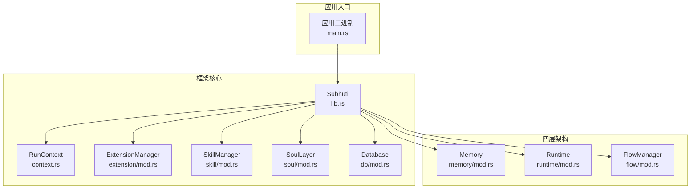
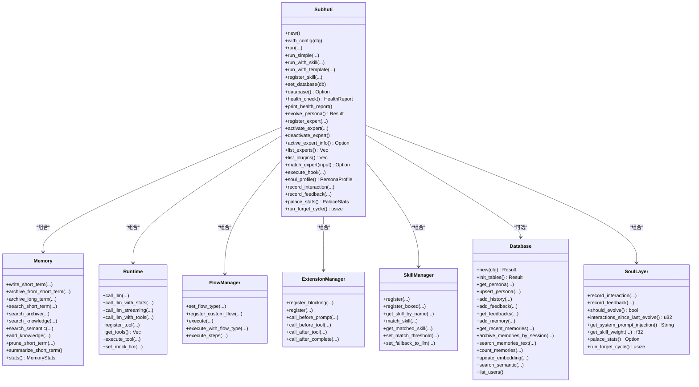
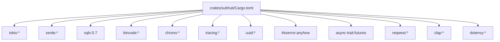

# API 参考

<cite>
**本文引用的文件**
- [lib.rs](file://crates/subhuti/src/lib.rs)
- [Cargo.toml](file://crates/subhuti/Cargo.toml)
- [main.rs](file://src/main.rs)
- [mod.rs（记忆层）](file://crates/subhuti/src/memory/mod.rs)
- [mod.rs（运行层）](file://crates/subhuti/src/runtime/mod.rs)
- [mod.rs（流程层）](file://crates/subhuti/src/flow/mod.rs)
- [mod.rs（技能层）](file://crates/subhuti/src/skill/mod.rs)
- [mod.rs（上下文）](file://crates/subhuti/src/context.rs)
- [mod.rs（心灵层）](file://crates/subhuti/src/soul/mod.rs)
- [mod.rs（数据库）](file://crates/subhuti/src/db/mod.rs)
- [mod.rs（扩展层）](file://crates/subhuti/src/extension/mod.rs)
- [persona.json](file://crates/subhuti/data/persona.json)
</cite>

## 目录
1. [简介](#简介)
2. [项目结构](#项目结构)
3. [核心组件](#核心组件)
4. [架构总览](#架构总览)
5. [详细组件分析](#详细组件分析)
6. [依赖关系分析](#依赖关系分析)
7. [性能考量](#性能考量)
8. [故障排查指南](#故障排查指南)
9. [结论](#结论)
10. [附录](#附录)

## 简介
本文件为 Subhuti 框架的完整 API 参考文档，覆盖四层架构（记忆层、运行层、流程层、扩展层）以及技能层、上下文、心灵层、数据库与专家插件系统。文档面向开发者，提供公共接口的函数签名、参数类型、返回值、异常处理、使用示例、参数说明、调用约定、版本兼容性、数据模型定义、错误码、配置参数参考与 SDK 使用示例。

## 项目结构
Subhuti 采用模块化分层设计，核心模块如下：
- 记忆层：短期/长期/知识库三类记忆，支持文本与向量检索、持久化与嵌入服务。
- 运行层：统一 LLM 抽象、工具系统、约束护栏、会话管理。
- 流程层：内置 ReAct、Plan-Act、Simple 等流程，支持自定义流程与步骤模板。
- 扩展层：生命周期 Hook（before_prompt/before_tool/after_tool/after_complete）。
- 技能层：纯代码实现的技能系统，支持预设流程模板与流式执行。
- 上下文：请求级 RunContext 与全局 Subhuti 分层设计。
- 心灵层：动态人格养成与演化，结合记忆宫殿与统计分析。
- 数据库：PostgreSQL 集成，pgvector 向量支持，Persona/History/Feedback/Memories 表。
- 专家插件：可插拔专家能力，支持安装、启用、禁用与知识注入。

图表来源
- [lib.rs](file://crates/subhuti/src/lib.rs)
- [context.rs](file://crates/subhuti/src/context.rs)
- [extension/mod.rs](file://crates/subhuti/src/extension/mod.rs)
- [skill/mod.rs](file://crates/subhuti/src/skill/mod.rs)
- [soul/mod.rs](file://crates/subhuti/src/soul/mod.rs)
- [db/mod.rs](file://crates/subhuti/src/db/mod.rs)
- [memory/mod.rs](file://crates/subhuti/src/memory/mod.rs)
- [runtime/mod.rs](file://crates/subhuti/src/runtime/mod.rs)
- [flow/mod.rs](file://crates/subhuti/src/flow/mod.rs)
- [main.rs](file://src/main.rs)

章节来源
- [lib.rs](file://crates/subhuti/src/lib.rs)
- [Cargo.toml](file://crates/subhuti/Cargo.toml)

## 核心组件
- SubhutiConfig：全局配置，包含 LLM、Provider、Runtime、Memory、Flow、DB。
- Subhuti：框架主入口，负责实例化与编排各子系统，提供 run/run_simple/run_with_* 等高层 API。
- Memory：统一记忆管理，支持写入、检索、归档、统计与向量搜索。
- Runtime：统一运行时，封装 LLM 客户端与工具系统，提供调用与流式输出。
- FlowManager：流程调度器，支持内置与自定义流程。
- SkillManager：技能管理器，支持关键词索引与匹配阈值。
- ExtensionManager：扩展管理器，提供生命周期 Hook。
- SoulLayer：心灵层，动态人格与演化。
- Database：PostgreSQL 集成，提供 Persona/Feedback/Memories 表 CRUD 与向量检索。
- 专家插件：插件安装/启用/禁用与知识注入。

章节来源
- [lib.rs](file://crates/subhuti/src/lib.rs)
- [mod.rs（记忆层）](file://crates/subhuti/src/memory/mod.rs)
- [mod.rs（运行层）](file://crates/subhuti/src/runtime/mod.rs)
- [mod.rs（流程层）](file://crates/subhuti/src/flow/mod.rs)
- [mod.rs（技能层）](file://crates/subhuti/src/skill/mod.rs)
- [mod.rs（扩展层）](file://crates/subhuti/src/extension/mod.rs)
- [mod.rs（心灵层）](file://crates/subhuti/src/soul/mod.rs)
- [mod.rs（数据库）](file://crates/subhuti/src/db/mod.rs)

## 架构总览
Subhuti 采用“全局只读共享 + 请求级可变”的分层设计：
- 全局资源（runtime、memory、flow、extensions、skills、soul、db）通过 Arc 共享，避免重复初始化。
- 请求级资源（session、tokens、chain）放入 RunContext，随请求生命周期变化。
- 扩展层通过 Hook 在关键生命周期点插入横切关注点（日志、敏感词过滤、Token 统计等）。

图表来源
- [lib.rs](file://crates/subhuti/src/lib.rs)
- [mod.rs（记忆层）](file://crates/subhuti/src/memory/mod.rs)
- [mod.rs（运行层）](file://crates/subhuti/src/runtime/mod.rs)
- [mod.rs（流程层）](file://crates/subhuti/src/flow/mod.rs)
- [mod.rs（技能层）](file://crates/subhuti/src/skill/mod.rs)
- [mod.rs（扩展层）](file://crates/subhuti/src/extension/mod.rs)
- [mod.rs（数据库）](file://crates/subhuti/src/db/mod.rs)
- [mod.rs（心灵层）](file://crates/subhuti/src/soul/mod.rs)

## 详细组件分析

### Subhuti 主入口 API
- new()：使用默认配置创建实例。
- with_config(cfg)：使用自定义配置创建实例。
- run(session, input)：运行 Agent，返回 (响应, 可选技能名, Token 统计)。
- run_simple(user_id, input)：单次请求场景，内部创建 Session。
- run_with_skill/session/...：支持显式指定 Skill 或流程模板。
- register_skill(skill)/set_skill_threshold(threshold)：动态注册技能与阈值。
- init_database(cfg)/set_database(db)/database()：数据库初始化与注入。
- health_check()/print_health_report()：系统健康检查。
- evolve_persona()：触发人格演化（统计分析 + LLM 反思）。
- register_expert/activate_expert/deactivate_expert/match_expert/list_plugins/execute_hook：专家插件管理与钩子链。
- soul_profile()/record_interaction()/record_feedback()/palace_stats()/run_forget_cycle()：心灵层与记忆宫殿能力。

章节来源
- [lib.rs](file://crates/subhuti/src/lib.rs)

### 记忆层 API
- MemoryConfig：short_term_capacity/archive_threshold/knowledge_dim/ttl_seconds。
- Memory::new()/with_config()/with_database()/set_database()/database()/has_database()：实例化与数据库连接。
- Memory::with_embedding()/set_embedding()/embedding_service()/has_embedding()：嵌入服务连接。
- Memory::write_short_term()/archive_from_short_term()/archive_long_term()：短期记忆写入与归档。
- Memory::search_short_term()/search_archive()/search_knowledge()：检索。
- Memory::search_semantic(query, limit)：向量相似度检索（需配置数据库与嵌入服务）。
- Memory::add_knowledge()/prune_short_term()/summarize_short_term()/stats()：知识入库、裁剪、摘要与统计。

章节来源
- [mod.rs（记忆层）](file://crates/subhuti/src/memory/mod.rs)

### 运行层 API
- RuntimeConfig：max_turns/max_context_tokens/timeout_seconds/default_temperature/default_max_tokens。
- Runtime::new()/with_config()/with_config_and_llm(config, llm_config, provider)：实例化与 LLM 客户端初始化。
- Runtime::set_llm()/set_mock_llm()/has_llm()：LLM 注入与测试。
- Runtime::call_llm()/call_llm_with_stats()/call_llm_streaming()/call_llm_with_tools()：LLM 调用与工具调用。
- Runtime::register_tool()/get_tools()/execute_tool()：工具注册与执行。

章节来源
- [mod.rs（运行层）](file://crates/subhuti/src/runtime/mod.rs)

### 流程层 API
- FlowConfig：max_iterations/auto_retry/max_retries/convergence_threshold/enable_reflection。
- FlowType：Simple/React/PlanAct/Custom。
- FlowManager::new()/with_config()/set_flow_type()/register_custom_flow()/execute()/execute_with_flow_type()/execute_steps()：流程调度。
- FlowStep：Tool/Knowledge/LLM/LLMToContext/Condition/Memory/Parallel/Loop，支持模板变量与上下文保存。
- FlowContext：会话、运行时、记忆、配置、状态、迭代、输入与上下文数据，提供 call_llm、execute_tool、get_tools、save_context/get_context、execute_steps 等。

章节来源
- [mod.rs（流程层）](file://crates/subhuti/src/flow/mod.rs)

### 技能层 API
- FlowTemplate：ReAct/PlanAct/Simple/ChainOfThought。
- SkillContext：input/session/runtime/memory/confidence/flow_template/tokens，提供 call_tool/call_llm/call_llm_streaming/get_memory/set_memory。
- Skill trait：name/description/matches/keywords/flow_template/supported_templates/execute/execute_simple/execute_react/execute_plan_act/execute_chain_of_thought/execute_streaming/supports_streaming/priority。
- SkillManager::new()/register()/register_boxed()/get_skill_by_name()/match_skill()/get_matched_skill()/set_match_threshold()/set_fallback_to_llm()：技能注册与匹配。
- RunContext：session/tokens/chain，提供 add_to_chain/get_chain。

章节来源
- [mod.rs（技能层）](file://crates/subhuti/src/skill/mod.rs)
- [mod.rs（上下文）](file://crates/subhuti/src/context.rs)

### 扩展层 API
- HookPhase：BeforePrompt/BeforeTool/AfterTool/AfterComplete。
- Hook trait：name/phase/execute。
- Extension trait：name/hooks。
- ExtensionManager::register_blocking()/register()/call_before_prompt()/call_before_tool()/call_after_tool()/call_after_complete()：扩展注册与生命周期调用。
- 内置 Hook：LoggingHook/SensitiveWordFilterHook/TokenCountHook。

章节来源
- [mod.rs（扩展层）](file://crates/subhuti/src/extension/mod.rs)

### 心灵层 API
- PersonaProfile：version/name/description/tone/emotional_tendency/big_five/skill_proficiency/expertise_areas/skill_affinity/interaction_stats/traits。
- SoulConfig：evolve_threshold/proficiency_alpha/domain_learning_rate/trait_learning_rate/max_change_per_evolve/stat_weight/llm_weight。
- SoulLayer::new()/with_config()/with_database()/set_database()/set_memory_palace()/memory_palace()/has_memory_palace()。
- record_interaction()/record_feedback()/should_evolve()/interactions_since_last_evolve()/get_system_prompt_injection()/get_skill_weight()/palace_stats()/run_forget_cycle()/add_memory_association()/get_associated_memories()/list_users()/get_user_profile()/get_user_profile_mut()/switch_user()。

章节来源
- [mod.rs（心灵层）](file://crates/subhuti/src/soul/mod.rs)

### 数据库 API
- DbConfig：host/port/database/username/password/max_connections/connection_string()。
- Database::new()/pool()/init_tables()：连接池与表初始化。
- Persona/History/Feedback/Memories 表 CRUD：get_persona/upsert_persona/add_history/add_feedback/get_feedbacks/add_memory/get_recent_memories/archive_memories_by_session/search_memories_text/count_memories/update_embedding/search_semantic/list_users。

章节来源
- [mod.rs（数据库）](file://crates/subhuti/src/db/mod.rs)

### 专家插件系统
- PluginManager：install()/uninstall()/enable()/disable()/activate()/deactivate()/get_active_expert_id()/list_plugins()/match_expert()/execute_hook()。
- ExpertPlugin/ExpertInfo/ExpertPersona/KnowledgeEntry：专家能力定义与知识注入。

章节来源
- [lib.rs](file://crates/subhuti/src/lib.rs)

## 依赖关系分析
- 依赖管理：Tokio、Serde、SQLx、bincode、chrono、tracing、uuid、thiserror、anyhow、async-trait、futures、reqwest、clap、dotenvy。
- 特性开关：openai、ollama。
- 运行时要求：Tokio 全功能特性；PostgreSQL + pgvector；可选 Ollama 用于嵌入服务。

图表来源
- [Cargo.toml](file://crates/subhuti/Cargo.toml)

章节来源
- [Cargo.toml](file://crates/subhuti/Cargo.toml)

## 性能考量
- 记忆层：短期记忆容量与归档阈值直接影响上下文长度；向量检索依赖数据库与嵌入服务，建议合理设置维度与索引。
- 运行层：工具调用轮次与超时限制可防止长尾耗时；流式输出可降低首字节延迟。
- 流程层：收敛阈值与自动重试可减少无效循环；自定义流程模板可减少 LLM 思考开销。
- 技能层：关键词索引与匹配阈值提升大规模技能匹配效率；流式执行可改善用户体验。
- 心灵层：统计分析轨道实时更新，LLM 反思轨道周期触发，避免每次交互都进行深度分析。
- 数据库：连接池大小与索引策略影响并发与查询性能；向量维度与索引需与硬件匹配。

## 故障排查指南
- 健康检查：使用 health_check()/print_health_report() 检查 MemoryPalace、Database、SoulLayer、ExpertPlugins、Skills 状态。
- 数据库未配置：search_semantic() 会返回错误；init_database() 需正确设置 OLLAMA_URL/EMBEDDING_MODEL 环境变量。
- LLM 未配置：call_llm()/call_llm_with_tools() 返回“未配置”错误；可通过 with_config_and_llm()/set_mock_llm() 注入。
- 工具不存在：execute_tool() 返回“未找到”错误；确认已通过 register_tool()/register() 注册。
- 专家插件：install()/enable()/activate() 失败时查看日志；deactivate() 可恢复默认状态。
- 心灵层：演化解析失败时会回退版本号；检查 LLM 响应格式与 JSON 结构。

章节来源
- [lib.rs](file://crates/subhuti/src/lib.rs)
- [mod.rs（运行层）](file://crates/subhuti/src/runtime/mod.rs)
- [mod.rs（记忆层）](file://crates/subhuti/src/memory/mod.rs)
- [mod.rs（扩展层）](file://crates/subhuti/src/extension/mod.rs)

## 结论
Subhuti 框架通过清晰的分层与可插拔设计，提供了从记忆、运行、流程到扩展的完整 Agent 能力，并以心灵层实现动态人格与演化。开发者可基于统一 API 快速构建定制化智能体，同时通过数据库与向量检索实现可扩展的记忆系统。

## 附录

### 数据模型定义
- 记忆层
  - MemoryConfig：short_term_capacity、archive_threshold、knowledge_dim、ttl_seconds。
  - MemoryItem：id、content、created_at、metadata、layer、session_id。
  - MemoryLayer：ShortTerm、Archive、Knowledge。
  - SearchResult/SemanticSearchResult：检索结果与向量相似度。
  - MemoryStats：short_term_count、archive_count、knowledge_count。
- 运行层
  - RuntimeConfig：max_turns、max_context_tokens、timeout_seconds、default_temperature、default_max_tokens。
  - LLM/LLMClient/LLMResponse/Message/Role/ToolInfo/MockLLM。
- 流程层
  - FlowConfig：max_iterations、auto_retry、max_retries、convergence_threshold、enable_reflection。
  - FlowType：Simple、React、PlanAct、Custom。
  - FlowStep：Tool/Knowledge/LLM/LLMToContext/Condition/Memory/Parallel/Loop。
  - FlowContext：session、runtime、memory、config、state、iteration、input、context_data。
- 技能层
  - FlowTemplate：ReAct、PlanAct、Simple、ChainOfThought。
  - SkillContext：input、session、runtime、memory、confidence、flow_template、tokens。
  - SkillInfo/SkillMatch：技能信息与匹配结果。
  - SkillManager：名称索引、关键词索引、匹配阈值、回退策略。
- 上下文
  - TokenStats：model、prompt_tokens、completion_tokens、total_tokens。
  - RunContext：session、tokens、chain。
- 心灵层
  - BigFive：openness、conscientiousness、extraversion、agreeableness、neuroticism。
  - ToneStyle/EmotionalTendency：语气风格与情感倾向枚举。
  - FeedbackType/UserFeedback：反馈类型与记录。
  - InteractionStats：互动统计。
  - PersonaProfile：性格快照。
  - SoulConfig：演化配置。
- 数据库
  - DbConfig：连接参数与连接串。
  - PersonaData/PersonaRow/HistoryRow/FeedbackRow/MemoryRow：表结构映射。
- 扩展层
  - HookPhase：生命周期阶段。
  - Hook/Extension：钩子与扩展接口。
  - HookContext：钩子上下文。

章节来源
- [mod.rs（记忆层）](file://crates/subhuti/src/memory/mod.rs)
- [mod.rs（运行层）](file://crates/subhuti/src/runtime/mod.rs)
- [mod.rs（流程层）](file://crates/subhuti/src/flow/mod.rs)
- [mod.rs（技能层）](file://crates/subhuti/src/skill/mod.rs)
- [mod.rs（上下文）](file://crates/subhuti/src/context.rs)
- [mod.rs（心灵层）](file://crates/subhuti/src/soul/mod.rs)
- [mod.rs（数据库）](file://crates/subhuti/src/db/mod.rs)
- [mod.rs（扩展层）](file://crates/subhuti/src/extension/mod.rs)

### 配置参数参考
- 环境变量
  - OLLAMA_URL：嵌入服务地址，默认 http://localhost:11434。
  - EMBEDDING_MODEL：嵌入模型名，默认 bge-m3:latest。
- 配置文件
  - data/persona.json：默认人格快照，包含版本、五大人格、技能熟练度、擅长领域、互动统计与特征关键词。
- 运行时配置
  - SubhutiConfig：llm/provider/runtime/memory/flow/db。
  - RuntimeConfig：max_turns、max_context_tokens、timeout_seconds、default_temperature、default_max_tokens。
  - MemoryConfig：short_term_capacity、archive_threshold、knowledge_dim、ttl_seconds。
  - FlowConfig：max_iterations、auto_retry、max_retries、convergence_threshold、enable_reflection。
  - SoulConfig：evolve_threshold、proficiency_alpha、domain_learning_rate、trait_learning_rate、max_change_per_evolve、stat_weight、llm_weight。
  - DbConfig：host、port、database、username、password、max_connections。

章节来源
- [lib.rs](file://crates/subhuti/src/lib.rs)
- [mod.rs（数据库）](file://crates/subhuti/src/db/mod.rs)
- [persona.json](file://crates/subhuti/data/persona.json)

### SDK 使用示例（客户端调用约定）
- 初始化
  - 创建 Subhuti 实例：Subhuti::new() 或 with_config(cfg)。
  - 可选：init_database(&DbConfig) 或 set_database(Arc<Database>)。
  - 注册技能：register_skill(...) 或 register_expert(...)。
- 调用
  - run(session, input) 或 run_simple(user_id, input)。
  - run_with_skill/run_with_template 可显式指定 Skill 或流程模板。
  - Runtime::call_llm_with_tools 与 Runtime::execute_tool 用于工具调用。
- 响应与统计
  - 返回值包含响应文本、可选技能名与 Token 统计（TokenStats）。
  - 可通过 RunContext.chain 获取调用链。
- 错误处理
  - 使用 Result 类型包装，常见错误来源：未配置 LLM、工具不存在、数据库未连接、向量检索失败、专家插件安装/启用失败等。
- 版本兼容性
  - 版本 0.1.0，特性 openai、ollama 可选；数据库与嵌入服务为可选增强能力。

章节来源
- [lib.rs](file://crates/subhuti/src/lib.rs)
- [mod.rs（运行层）](file://crates/subhuti/src/runtime/mod.rs)
- [mod.rs（技能层）](file://crates/subhuti/src/skill/mod.rs)
- [mod.rs（上下文）](file://crates/subhuti/src/context.rs)
- [main.rs](file://src/main.rs)