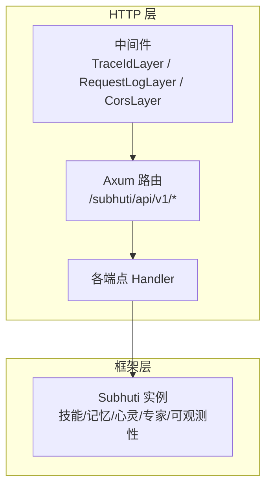
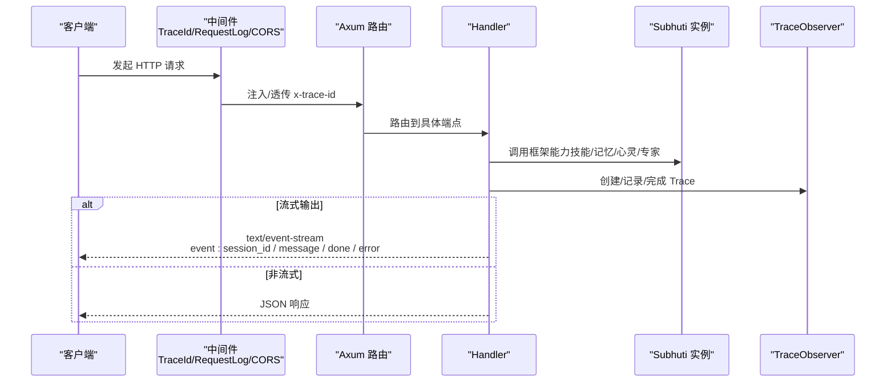
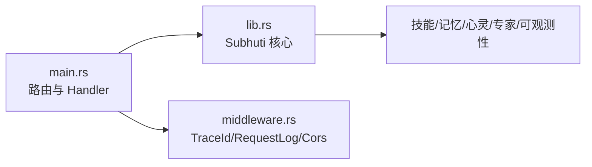

# HTTP API 端点

<cite>
**本文引用的文件**
- [main.rs](file://src/bin/http_server/main.rs)
- [middleware.rs](file://src/bin/http_server/middleware.rs)
- [lib.rs](file://crates/subhuti/src/lib.rs)
- [API_TUTORIAL.md](file://docs/API_TUTORIAL.md)
- [index.html](file://static/index.html)
</cite>

## 目录
1. [简介](#简介)
2. [项目结构](#项目结构)
3. [核心组件](#核心组件)
4. [架构总览](#架构总览)
5. [详细端点文档](#详细端点文档)
6. [依赖关系分析](#依赖关系分析)
7. [性能与流式输出](#性能与流式输出)
8. [故障排查指南](#故障排查指南)
9. [结论](#结论)

## 简介
本文件面向 Subhuti 框架的 HTTP API，系统性梳理所有 RESTful 端点，覆盖聊天、技能、健康检查、心灵宫殿、专家插件、可观测性等模块。文档提供每个端点的请求/响应示例、HTTP 方法、URL 模式、参数说明、状态码、错误处理、认证与安全（CORS）、速率限制、流式输出机制（SSE）以及客户端调用示例（cURL 与前端代码），并给出可视化图示帮助理解。

## 项目结构
- HTTP 服务器入口位于 src/bin/http_server/main.rs，负责路由注册、中间件装配、Handler 实现与应用启动。
- 中间件位于 src/bin/http_server/middleware.rs，提供 Trace ID 生成与请求日志记录。
- 框架核心位于 crates/subhuti/src/lib.rs，提供技能、记忆、心灵层、专家插件、可观测性等能力，HTTP 层通过 AppState 持有 Subhuti 实例以调用其方法。
- 文档样例位于 docs/API_TUTORIAL.md，包含 curl 与 JS 示例。
- 前端测试页 static/index.html 提供交互式端点列表与参数表单。

图表来源
- [main.rs:1385-1443](file://src/bin/http_server/main.rs#L1385-L1443)
- [middleware.rs:1-223](file://src/bin/http_server/middleware.rs#L1-L223)
- [lib.rs:84-156](file://crates/subhuti/src/lib.rs#L84-L156)

章节来源
- [main.rs:1385-1443](file://src/bin/http_server/main.rs#L1385-L1443)
- [middleware.rs:1-223](file://src/bin/http_server/middleware.rs#L1-L223)
- [lib.rs:84-156](file://crates/subhuti/src/lib.rs#L84-L156)

## 核心组件
- 应用状态 AppState：持有 Arc<Subhuti> 与 TraceObserver，作为各 Handler 的共享上下文。
- 中间件：
  - TraceIdLayer：为每个请求注入/透传 x-trace-id，便于全链路追踪。
  - RequestLogLayer：记录请求方法、路径、状态码、耗时与 Trace ID。
  - CorsLayer：允许任意来源、方法与头部，便于本地调试与跨域访问。
- 流式输出：基于 Server-Sent Events（text/event-stream），统一事件类型（message、done、error）与 session_id 初始事件。

章节来源
- [main.rs:364-385](file://src/bin/http_server/main.rs#L364-L385)
- [main.rs:1433-1439](file://src/bin/http_server/main.rs#L1433-L1439)
- [middleware.rs:15-82](file://src/bin/http_server/middleware.rs#L15-L82)
- [middleware.rs:96-171](file://src/bin/http_server/middleware.rs#L96-L171)

## 架构总览
下图展示 HTTP 路由、中间件与框架层的交互关系，以及 SSE 流式响应的生成路径。

图表来源
- [main.rs:1385-1443](file://src/bin/http_server/main.rs#L1385-L1443)
- [main.rs:487-551](file://src/bin/http_server/main.rs#L487-L551)
- [main.rs:1255-1318](file://src/bin/http_server/main.rs#L1255-L1318)
- [middleware.rs:15-82](file://src/bin/http_server/middleware.rs#L15-L82)

## 详细端点文档

### 通用约定
- 基础路径：/subhuti/api/v1
- Content-Type：除非特别标注，均为 application/json
- Accept：
  - 对于 SSE 端点，Accept: text/event-stream
  - 对于非 SSE 端点，Accept: application/json
- 认证：未实现鉴权中间件，按需自行扩展
- CORS：允许任意来源、方法与头部
- 速率限制：未实现限流中间件，按需自行扩展
- Trace ID：响应头 x-trace-id，便于定位问题

章节来源
- [main.rs:1433-1439](file://src/bin/http_server/main.rs#L1433-L1439)
- [middleware.rs:15-82](file://src/bin/http_server/middleware.rs#L15-L82)

---

### 健康检查
- 方法与路径
  - GET /subhuti/api/v1/health
  - GET /subhuti/api/v1/health/detailed
- 请求体：无
- 查询参数：无
- 成功响应
  - GET /health：返回 { "status": "ok", "timestamp": "..." }
  - GET /health/detailed：返回 { "status": "...", "overall_healthy": true/false, "timestamp": "...", "components": [...] }
- 错误
  - 500：内部错误（如健康检查异常）
- cURL 示例
  - curl http://localhost:8080/subhuti/api/v1/health
  - curl http://localhost:8080/subhuti/api/v1/health/detailed
- 前端调用示例
  - fetch('/subhuti/api/v1/health').then(r=>r.json()).then(console.log)

章节来源
- [main.rs:975-1000](file://src/bin/http_server/main.rs#L975-L1000)
- [lib.rs:573-647](file://crates/subhuti/src/lib.rs#L573-L647)
- [API_TUTORIAL.md:608-707](file://docs/API_TUTORIAL.md#L608-L707)

---

### 技能列表
- 方法与路径
  - GET/POST /subhuti/api/v1/skills
- 请求体：无
- 查询参数：无
- 成功响应
  - 返回技能清单，包含 name、description、flow_template、flow_templates、priority
- 错误
  - 500：内部错误（如技能管理器异常）

章节来源
- [main.rs:1170-1189](file://src/bin/http_server/main.rs#L1170-L1189)
- [lib.rs:222-230](file://crates/subhuti/src/lib.rs#L222-L230)

---

### 执行指定技能
- 方法与路径
  - POST /subhuti/api/v1/skills/{name}
  - POST /subhuti/api/v1/skills/{name}/stream
- 路径参数
  - name：技能名称（字符串）
- 请求体
  - message：用户消息（必填）
  - user_id：用户标识（可选）
  - session_id：会话标识（可选）
  - flow_template：流程模板（可选；见“流程模板”）
- 成功响应（非流式）
  - response：AI 回复
  - session_id：会话标识
  - trace_id：追踪 ID
  - skill_used：实际使用的技能名
  - chain：技能调用链（数组）
  - duration_ms：处理耗时（毫秒）
  - model/prompt_tokens/completion_tokens/total_tokens：Token 统计
- 成功响应（流式）
  - 初始事件：event: session_id，data: "{session_id}"
  - 数据事件：event: message，data: "{chunk}"
  - 结束事件：event: done，data: "true"
  - 错误事件：event: error，data: "{error}"
- 错误
  - 400：技能不存在或参数非法
  - 500：内部错误（如 LLM 调用失败）
- cURL 示例（非流式）
  - curl -X POST http://localhost:8080/subhuti/api/v1/skills/default_chat -H "Content-Type: application/json" -d '{"message":"你好","user_id":"u1"}'
- cURL 示例（流式）
  - curl -N -H "Accept: text/event-stream" http://localhost:8080/subhuti/api/v1/skills/default_chat/stream -H "Content-Type: application/json" -d '{"message":"讲个笑话"}'

章节来源
- [main.rs:1191-1253](file://src/bin/http_server/main.rs#L1191-L1253)
- [main.rs:1255-1318](file://src/bin/http_server/main.rs#L1255-L1318)
- [main.rs:387-396](file://src/bin/http_server/main.rs#L387-L396)

---

### 统一聊天入口
- 方法与路径
  - POST /subhuti/api/v1/chat
  - POST /subhuti/api/v1/chat/stream
- 请求体
  - message：用户消息（必填）
  - user_id：用户标识（可选）
  - session_id：会话标识（可选）
  - skill：指定技能名（可选；若指定则跳过智能匹配）
  - flow_template：流程模板（可选；见“流程模板”）
- 成功响应（非流式）
  - response：AI 回复
  - session_id：会话标识
  - trace_id：追踪 ID
  - skill_used：匹配到的技能名（可能为空）
  - chain：技能调用链（数组）
  - duration_ms：处理耗时（毫秒）
  - model/prompt_tokens/completion_tokens/total_tokens：Token 统计
- 成功响应（流式）
  - 初始事件：event: session_id，data: "{session_id}"
  - 数据事件：event: message，data: "{chunk}"
  - 结束事件：event: done，data: "true"
  - 错误事件：event: error，data: "{error}"
- 错误
  - 500：内部错误（如 LLM 调用失败）
- cURL 示例（非流式）
  - curl -X POST http://localhost:8080/subhuti/api/v1/chat -H "Content-Type: application/json" -d '{"message":"你好","user_id":"u1"}'
- cURL 示例（流式）
  - curl -N -H "Accept: text/event-stream" http://localhost:8080/subhuti/api/v1/chat/stream -H "Content-Type: application/json" -d '{"message":"讲个故事"}'

章节来源
- [main.rs:398-485](file://src/bin/http_server/main.rs#L398-L485)
- [main.rs:487-551](file://src/bin/http_server/main.rs#L487-L551)
- [main.rs:387-396](file://src/bin/http_server/main.rs#L387-L396)

---

### 心灵宫殿 API
- 统计信息
  - GET /subhuti/api/v1/palace/stats
  - 返回 total_count、zone_counts、importance_counts、avg_strength、base_stats（short_term/archive/knowledge）
- 执行遗忘周期
  - POST /subhuti/api/v1/palace/forget
  - 返回 success、forgotten_count、message
- 搜索记忆
  - POST /subhuti/api/v1/palace/search
  - 请求体：query（必填）、limit（默认 10）、use_persona_bias（布尔）
  - 返回 success、data（数组，每项含 id/content/zone/importance/strength/relevance_score/final_score/activation_count/created_at）

章节来源
- [main.rs:664-685](file://src/bin/http_server/main.rs#L664-L685)
- [main.rs:687-697](file://src/bin/http_server/main.rs#L687-L697)
- [main.rs:699-747](file://src/bin/http_server/main.rs#L699-L747)
- [lib.rs:536-553](file://crates/subhuti/src/lib.rs#L536-L553)

---

### 专家插件 API
- 列出专家
  - GET /subhuti/api/v1/experts
- 当前激活专家
  - GET /subhuti/api/v1/experts/active
- 激活专家
  - POST /subhuti/api/v1/experts/:id/activate
- 停用专家
  - POST /subhuti/api/v1/experts/deactivate
- 插件列表（含状态与权限）
  - GET /subhuti/api/v1/experts/plugins
- 启用/禁用插件
  - POST /subhuti/api/v1/experts/:id/enable
  - POST /subhuti/api/v1/experts/:id/disable
- 匹配专家
  - POST /subhuti/api/v1/experts/match

章节来源
- [main.rs:749-831](file://src/bin/http_server/main.rs#L749-L831)
- [main.rs:833-917](file://src/bin/http_server/main.rs#L833-L917)
- [main.rs:816-831](file://src/bin/http_server/main.rs#L816-L831)

---

### 可观测性（Trace）
- 列表（摘要）
  - GET /subhuti/api/v1/traces
- 获取 Trace 详情
  - GET /subhuti/api/v1/traces/:id
- 获取 Trace 的 Span 树（可视化）
  - GET /subhuti/api/v1/traces/:id/tree

章节来源
- [main.rs:919-973](file://src/bin/http_server/main.rs#L919-L973)

---

### 日志查询
- GET /subhuti/api/v1/logs
- 查询参数
  - trace_id：可选
  - level：可选
  - target：可选
  - keyword：可选
  - page/page_size：可选（默认 1/50，最大 500）
- 成功响应
  - total/page/page_size/logs（logs 为日志条目数组）

章节来源
- [main.rs:1002-1064](file://src/bin/http_server/main.rs#L1002-L1064)

---

### 性格快照与反馈
- 性格快照
  - GET /subhuti/api/v1/persona
- 触发生命演化
  - POST /subhuti/api/v1/persona/evolve
- 用户反馈
  - POST /subhuti/api/v1/persona/feedback（请求体：feedback_type、content、skill_name）

章节来源
- [main.rs:553-626](file://src/bin/http_server/main.rs#L553-L626)
- [main.rs:628-660](file://src/bin/http_server/main.rs#L628-L660)

---

### 流程模板（FlowTemplate）
- 支持的模板字符串（统一解析为 FlowTemplate）：
  - simple
  - react
  - plan_act
  - chain_of_thought
- 用途
  - 在 /chat 与 /skills/{name} 中通过 flow_template 参数指定
  - 若未指定，使用 Skill 默认模板或框架默认流程

章节来源
- [main.rs:387-396](file://src/bin/http_server/main.rs#L387-L396)
- [lib.rs:690-706](file://crates/subhuti/src/lib.rs#L690-L706)

---

### SSE 事件格式（流式输出）
- 事件类型
  - session_id：首次发送，携带 session_id
  - message：流式片段
  - done：结束
  - error：错误
- Content-Type：text/event-stream
- 客户端注意事项
  - 使用 EventSource 或 fetch + ReadableStream
  - 服务端会自动注入 x-trace-id 响应头

章节来源
- [main.rs:521-551](file://src/bin/http_server/main.rs#L521-L551)
- [main.rs:1290-1318](file://src/bin/http_server/main.rs#L1290-L1318)

---

### 客户端调用示例

- cURL（非流式）
  - curl -X POST http://localhost:8080/subhuti/api/v1/chat -H "Content-Type: application/json" -d '{"message":"你好","user_id":"u1"}'
- cURL（流式）
  - curl -N -H "Accept: text/event-stream" http://localhost:8080/subhuti/api/v1/chat/stream -H "Content-Type: application/json" -d '{"message":"讲个故事"}'
- 前端（EventSource）
  - 参考 static/index.html 中的 sendRequest 与 SSE 处理逻辑

章节来源
- [API_TUTORIAL.md:73-161](file://docs/API_TUTORIAL.md#L73-L161)
- [index.html:937-990](file://static/index.html#L937-L990)

## 依赖关系分析

图表来源
- [main.rs:1385-1443](file://src/bin/http_server/main.rs#L1385-L1443)
- [lib.rs:84-156](file://crates/subhuti/src/lib.rs#L84-L156)
- [middleware.rs:1-223](file://src/bin/http_server/middleware.rs#L1-L223)

章节来源
- [main.rs:1385-1443](file://src/bin/http_server/main.rs#L1385-L1443)
- [lib.rs:84-156](file://crates/subhuti/src/lib.rs#L84-L156)

## 性能与流式输出
- 流式输出
  - 使用 mpsc::channel 与 ReceiverStream，将框架回调的增量片段转为 SSE 事件
  - 初始 session_id 事件用于前端建立会话
  - DONE/ERROR 事件用于优雅结束/错误处理
- Token 统计
  - 非流式端点返回 prompt_tokens/completion_tokens/total_tokens，便于成本与性能分析
- 重试与降级
  - 框架层具备 LLM 重试与 fallback 机制，可在流式场景中输出降级消息

章节来源
- [main.rs:521-551](file://src/bin/http_server/main.rs#L521-L551)
- [main.rs:1290-1318](file://src/bin/http_server/main.rs#L1290-L1318)
- [lib.rs:573-647](file://crates/subhuti/src/lib.rs#L573-L647)

## 故障排查指南
- 关键步骤
  - 检查 x-trace-id 响应头，结合 /traces/:id 与 /logs 查询定位问题
  - 使用 /health 与 /health/detailed 检查系统组件状态
  - 对于 SSE，确认 Accept: text/event-stream 且浏览器网络面板显示 SSE 连接
- 常见错误
  - 400：技能名不存在或参数非法
  - 500：LLM 调用失败、框架内部异常
- 建议
  - 在生产环境启用鉴权与速率限制中间件
  - 配置合适的 CORS 与代理（如 Nginx/Traefik）

章节来源
- [main.rs:919-973](file://src/bin/http_server/main.rs#L919-L973)
- [main.rs:975-1000](file://src/bin/http_server/main.rs#L975-L1000)
- [middleware.rs:15-82](file://src/bin/http_server/middleware.rs#L15-L82)

## 结论
本文档系统化梳理了 Subhuti 框架的 HTTP API，涵盖聊天、技能、健康检查、心灵宫殿、专家插件、可观测性与日志查询等模块。通过统一的 SSE 流式输出与完善的 Trace 追踪，开发者可快速集成并调试。建议在生产环境中补充鉴权、限流与更严格的 CORS 策略，以满足安全与稳定性要求。