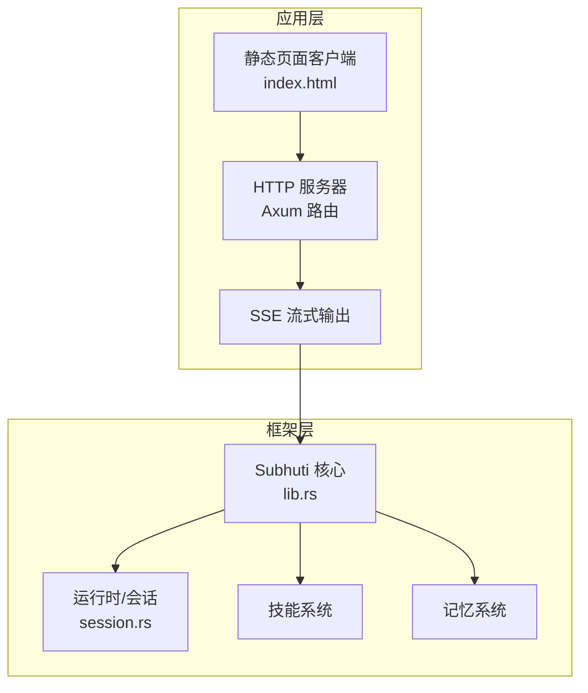
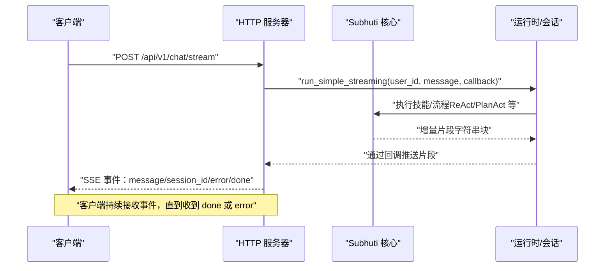
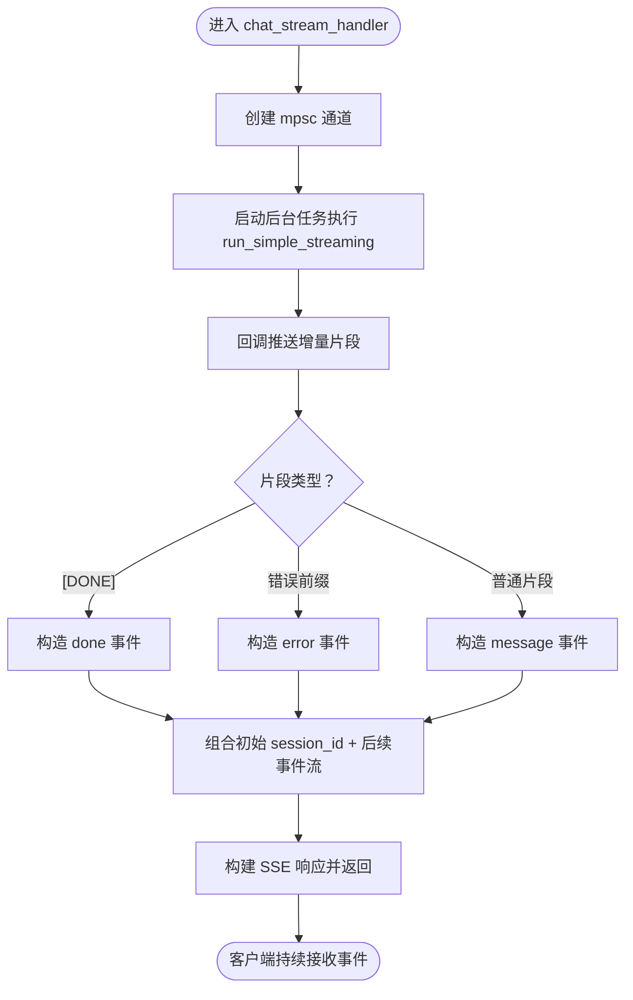
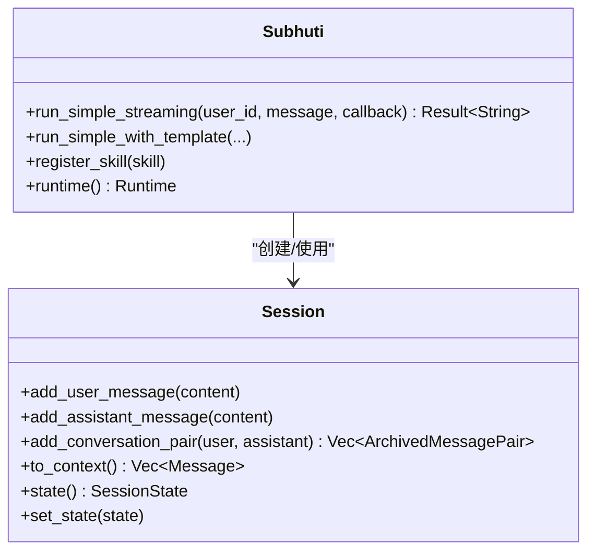
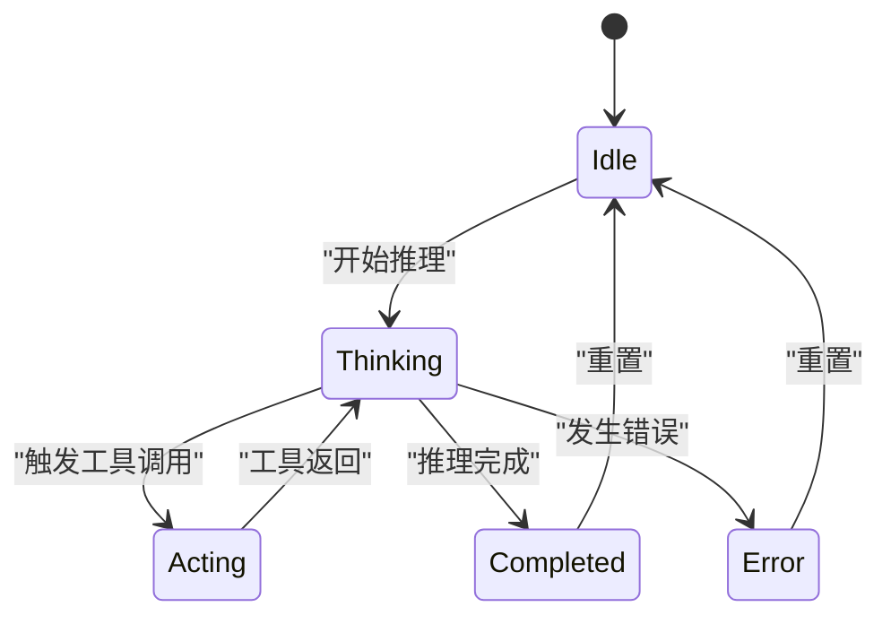
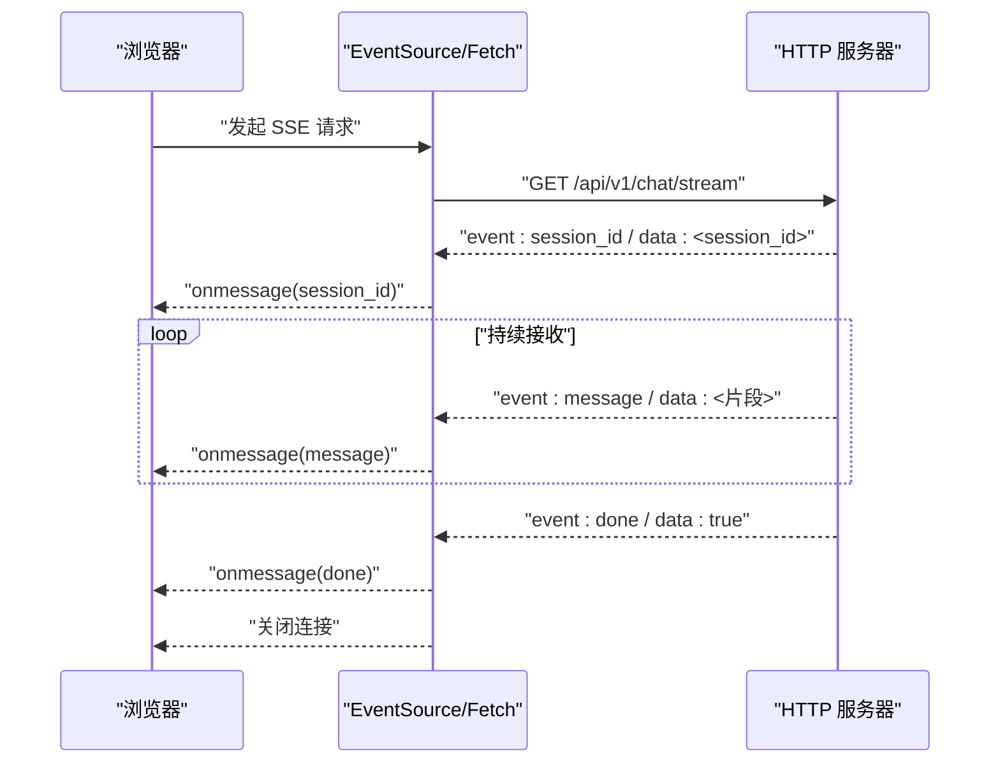
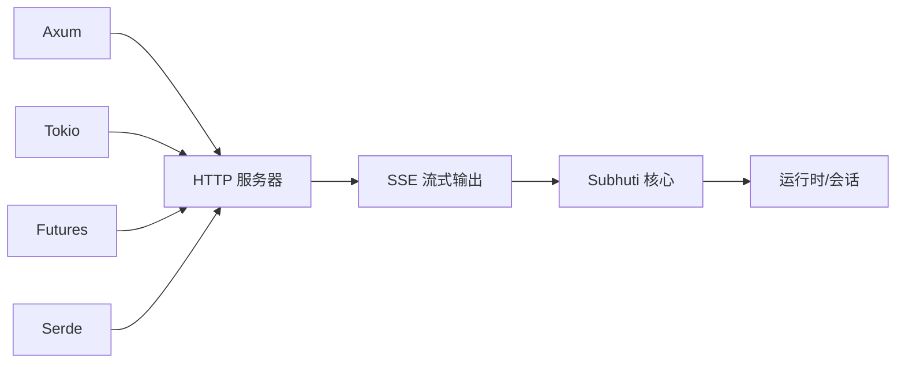

# WebSocket API

<cite>
**本文引用的文件**
- [Cargo.toml](file://Cargo.toml)
- [main.rs](file://src/bin/http_server/main.rs)
- [middleware.rs](file://src/bin/http_server/middleware.rs)
- [lib.rs](file://crates/subhuti/src/lib.rs)
- [session.rs](file://crates/subhuti/src/runtime/session.rs)
- [index.html](file://static/index.html)
- [API_TUTORIAL.md](file://docs/API_TUTORIAL.md)
</cite>

## 目录
1. [简介](#简介)
2. [项目结构](#项目结构)
3. [核心组件](#核心组件)
4. [架构概览](#架构概览)
5. [详细组件分析](#详细组件分析)
6. [依赖关系分析](#依赖关系分析)
7. [性能考量](#性能考量)
8. [故障排查指南](#故障排查指南)
9. [结论](#结论)
10. [附录](#附录)

## 简介
本文件面向 Subhuti 框架的 WebSocket API 与 Server-Sent Events（SSE）流式输出机制，提供从协议设计、消息格式、事件类型、状态管理到客户端集成与最佳实践的完整说明。当前仓库实现了基于 HTTP 的 SSE 接口，用于实时流式输出；同时保留了 WebSocket 的扩展空间，便于后续接入。

## 项目结构
- 服务端入口位于 http_server 二进制，提供统一网关与 SSE 流式输出。
- 框架核心位于 crates/subhuti，包含运行时、记忆、技能、心灵层等模块。
- 客户端示例位于 static/index.html，展示了 SSE 客户端集成方式。
- 文档 docs/API_TUTORIAL.md 提供了 SSE 使用示例与请求头说明。

**图表来源**
- [main.rs:1324-1327](file://src/bin/http_server/main.rs#L1324-L1327)
- [lib.rs:84-107](file://crates/subhuti/src/lib.rs#L84-L107)
- [session.rs:68-90](file://crates/subhuti/src/runtime/session.rs#L68-L90)
- [index.html:962-962](file://static/index.html#L962-L962)

**章节来源**
- [Cargo.toml:38-58](file://Cargo.toml#L38-L58)
- [main.rs:1-100](file://src/bin/http_server/main.rs#L1-L100)
- [lib.rs:1-50](file://crates/subhuti/src/lib.rs#L1-L50)

## 核心组件
- HTTP 服务器与路由：提供统一入口、SSE 流式接口、健康检查等。
- SSE 流式输出：以 Server-Sent Events 形式推送增量消息，支持 session_id、message、error、done 事件。
- Subhuti 核心：负责运行时、会话管理、技能调度与流式回调。
- 会话管理：维护用户会话、消息滑动窗口、状态与元数据。
- 客户端示例：静态 HTML 页面演示 SSE 客户端订阅与事件处理。

**章节来源**
- [main.rs:487-551](file://src/bin/http_server/main.rs#L487-L551)
- [lib.rs:972-972](file://crates/subhuti/src/lib.rs#L972-L972)
- [session.rs:68-90](file://crates/subhuti/src/runtime/session.rs#L68-L90)
- [index.html:962-962](file://static/index.html#L962-L962)

## 架构概览
Subhuti 的实时通信采用“HTTP + SSE”方案，结合框架的流式回调能力，实现低延迟、高吞吐的增量输出。WebSocket 的接入点预留，可在现有 SSE 基础上扩展。

**图表来源**
- [main.rs:491-551](file://src/bin/http_server/main.rs#L491-L551)
- [lib.rs:972-972](file://crates/subhuti/src/lib.rs#L972-L972)

## 详细组件分析

### SSE 流式输出（Server-Sent Events）
- 路由与处理器：chat_stream_handler 负责创建通道、启动后台任务执行 run_simple_streaming，并将回调输出转换为 SSE 事件。
- 事件类型：
  - session_id：首次推送，携带会话标识。
  - message：增量消息片段。
  - error：错误事件，携带错误信息。
  - done：结束事件，表示流式输出完成。
- 响应头：Content-Type: text/event-stream，Cache-Control: no-cache，Connection: keep-alive。
- 结束条件：后台任务发送 [DONE] 标记，前端收到 done 事件后停止等待。

**图表来源**
- [main.rs:491-551](file://src/bin/http_server/main.rs#L491-L551)

**章节来源**
- [main.rs:487-551](file://src/bin/http_server/main.rs#L487-L551)

### Subhuti 核心流式回调
- run_simple_streaming：对外暴露的流式执行入口，接受用户标识、输入与回调闭包。
- 回调契约：框架在推理过程中逐段推送字符串片段，最终返回完整响应。
- 与会话集成：run_simple_streaming 内部使用 Session 管理消息滑动窗口与状态。

**图表来源**
- [lib.rs:972-972](file://crates/subhuti/src/lib.rs#L972-L972)
- [session.rs:68-90](file://crates/subhuti/src/runtime/session.rs#L68-L90)

**章节来源**
- [lib.rs:972-972](file://crates/subhuti/src/lib.rs#L972-L972)
- [session.rs:68-90](file://crates/subhuti/src/runtime/session.rs#L68-L90)

### 会话状态与消息管理
- SessionState：Idle、Thinking、Acting、Completed、Error，用于反映会话生命周期状态。
- 滑动窗口：短期记忆容量限制，超出时自动归档最早对话对。
- 上下文生成：to_context 生成 LLM 输入上下文，包含系统提示词与消息历史。

**图表来源**
- [session.rs:52-65](file://crates/subhuti/src/runtime/session.rs#L52-L65)

**章节来源**
- [session.rs:52-65](file://crates/subhuti/src/runtime/session.rs#L52-L65)

### 客户端集成与示例
- 静态页面客户端：index.html 展示了如何订阅 text/event-stream 并处理不同事件类型。
- 关键要点：
  - 检测 Content-Type 是否包含 text/event-stream。
  - 为每个事件类型（message/session_id/error/done）编写处理逻辑。
  - 在收到 done 或 error 后停止监听并清理资源。

**图表来源**
- [index.html:962-962](file://static/index.html#L962-L962)
- [main.rs:544-550](file://src/bin/http_server/main.rs#L544-L550)

**章节来源**
- [index.html:962-962](file://static/index.html#L962-L962)
- [API_TUTORIAL.md:110-110](file://docs/API_TUTORIAL.md#L110-L110)

## 依赖关系分析
- 依赖栈：Axum（HTTP）、Tokio（异步）、Futures/Tokio-Stream（流式）、Serde（序列化）。
- SSE 依赖：tokio-stream 的 ReceiverStream 与 futures::stream::once 组合，实现事件流拼接。
- 框架依赖：Subhuti 依赖运行时、技能、记忆与心灵层模块。

**图表来源**
- [Cargo.toml:38-58](file://Cargo.toml#L38-L58)
- [main.rs:20-47](file://src/bin/http_server/main.rs#L20-L47)

**章节来源**
- [Cargo.toml:38-58](file://Cargo.toml#L38-L58)
- [main.rs:20-47](file://src/bin/http_server/main.rs#L20-L47)

## 性能考量
- 流式传输优势：
  - 低延迟：增量片段即时推送，避免等待完整响应。
  - 节省带宽：按需传输，减少一次性大包开销。
  - 友好体验：前端可逐步渲染，提升感知速度。
- 通道与背压：
  - mpsc 通道容量（默认 100）平衡吞吐与内存占用。
  - 回调阻塞发送可能造成背压，需确保回调处理快速。
- 事件头优化：
  - keep-alive 与 no-cache 保证连接稳定与缓存可控。
- 并发与资源：
  - 后台任务独立执行，避免阻塞主线程。
  - done/error 事件后及时关闭连接，释放资源。

[本节为通用性能讨论，不直接分析具体文件]

## 故障排查指南
- 常见问题与定位：
  - SSE 未接收：确认 Content-Type 为 text/event-stream，检查网络代理与 CORS。
  - 无 session_id：确认请求体与路由正确，查看服务器日志。
  - 无增量事件：检查 run_simple_streaming 回调是否被调用，关注错误事件。
  - 连接中断：检查 keep-alive 与防火墙设置，考虑客户端重连策略。
- 日志与追踪：
  - 中间件 Trace ID：请求头 x-trace-id 用于跨服务追踪。
  - 请求日志：记录方法、路径、状态码与耗时，辅助定位问题。
- 错误事件处理：
  - 服务端将错误片段以 [ERROR] 前缀传递，客户端收到 event: error 事件。
  - 建议在客户端捕获错误事件并提示用户或触发重试。

**章节来源**
- [middleware.rs:15-82](file://src/bin/http_server/middleware.rs#L15-L82)
- [middleware.rs:96-172](file://src/bin/http_server/middleware.rs#L96-L172)
- [main.rs:523-532](file://src/bin/http_server/main.rs#L523-L532)

## 结论
Subhuti 当前通过 HTTP + SSE 提供了可靠的实时流式输出能力，具备低延迟、易集成与可观测性的特点。WebSocket 的接入点已在现有架构中预留，可按需扩展。建议在生产环境中结合连接管理、心跳与断线重连策略，进一步提升稳定性与用户体验。

[本节为总结性内容，不直接分析具体文件]

## 附录

### 实时通信协议规范（SSE）
- 路由
  - POST /api/v1/chat/stream：流式聊天接口
- 请求头
  - Accept: text/event-stream
- 响应事件
  - event: session_id / data: <会话ID>
  - event: message / data: <增量片段>
  - event: error / data: <错误信息>
  - event: done / data: true
- 响应头
  - Content-Type: text/event-stream
  - Cache-Control: no-cache
  - Connection: keep-alive

**章节来源**
- [main.rs:487-551](file://src/bin/http_server/main.rs#L487-L551)
- [API_TUTORIAL.md:110-110](file://docs/API_TUTORIAL.md#L110-L110)

### 客户端集成步骤（SSE）
- 步骤
  - 发起 GET 请求到 /api/v1/chat/stream，Accept: text/event-stream
  - 订阅事件：session_id（首次）、message（增量）、error（错误）、done（结束）
  - 在收到 done 或 error 后停止监听并清理资源
- 示例参考
  - static/index.html 中的 SSE 客户端实现

**章节来源**
- [index.html:962-962](file://static/index.html#L962-L962)

### WebSocket 扩展建议
- 接入点
  - 在现有 Axum 路由中新增 WebSocket 路由，复用 Subhuti 的 run_simple_streaming 回调。
- 连接管理
  - 维护连接池与会话映射，支持多路复用。
- 心跳与超时
  - 客户端/服务端定期发送 ping/pong，检测空闲连接并超时回收。
- 断线重连
  - 基于 session_id 恢复会话状态，必要时回放最近消息以重建上下文。

[本节为概念性扩展建议，不直接分析具体文件]