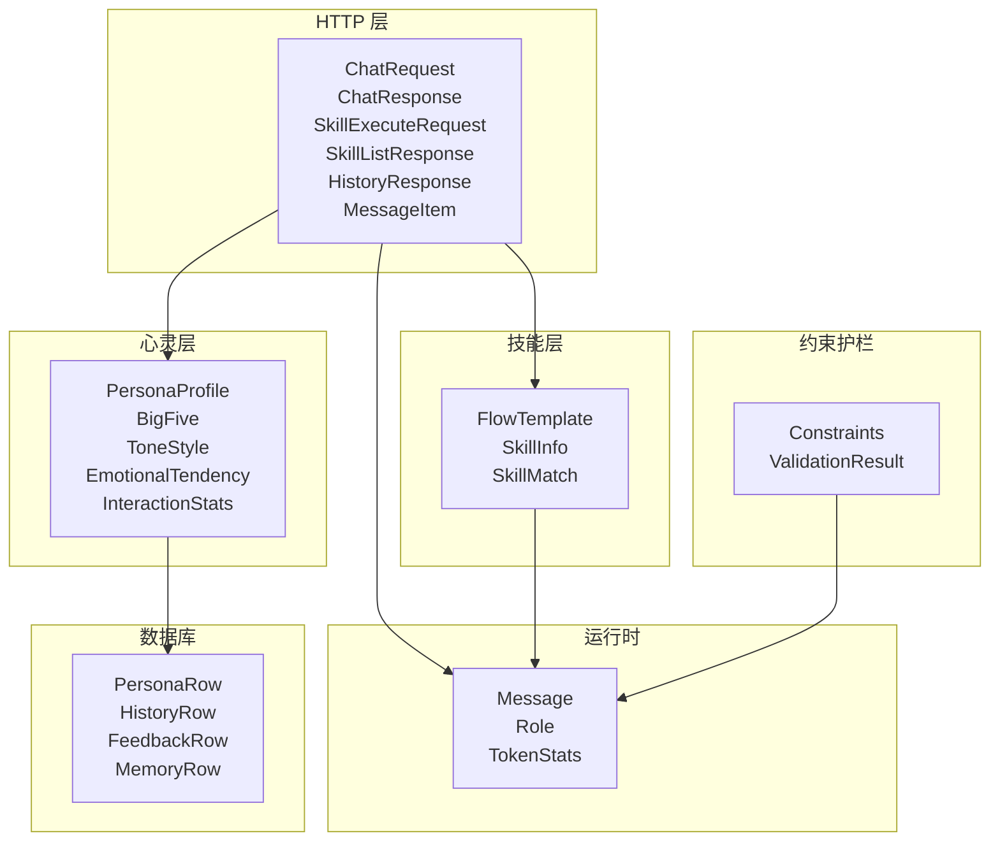
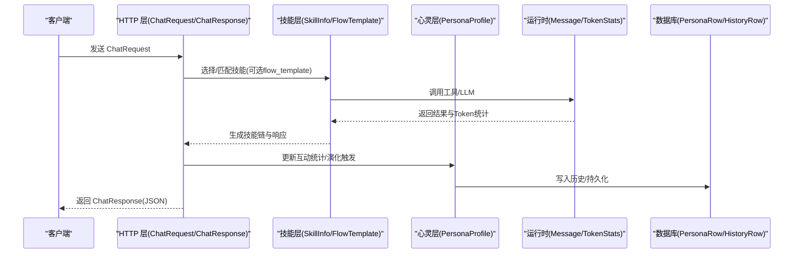
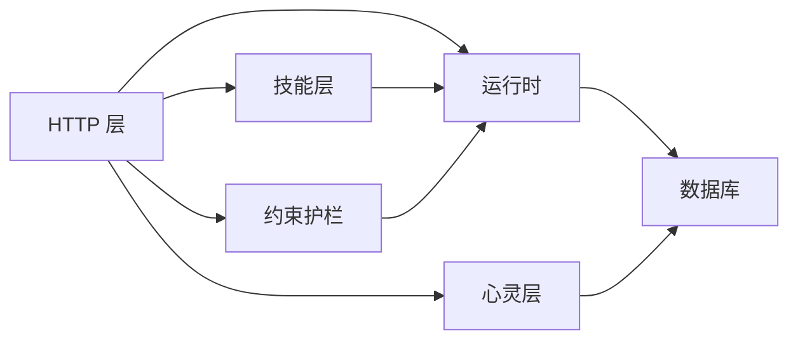

# 数据模型

<cite>
**本文引用的文件**
- [src/bin/http_server/main.rs](file://src/bin/http_server/main.rs)
- [crates/subhuti/src/skill/mod.rs](file://crates/subhuti/src/skill/mod.rs)
- [crates/subhuti/src/soul/mod.rs](file://crates/subhuti/src/soul/mod.rs)
- [crates/subhuti/src/runtime/llm/mod.rs](file://crates/subhuti/src/runtime/llm/mod.rs)
- [crates/subhuti/src/context.rs](file://crates/subhuti/src/context.rs)
- [crates/subhuti/src/runtime/constraints.rs](file://crates/subhuti/src/runtime/constraints.rs)
- [crates/subhuti/src/db/mod.rs](file://crates/subhuti/src/db/mod.rs)
- [crates/subhuti/data/persona.json](file://crates/subhuti/data/persona.json)
- [static/index.html](file://static/index.html)
</cite>

## 目录
1. [简介](#简介)
2. [项目结构](#项目结构)
3. [核心数据结构](#核心数据结构)
4. [架构概览](#架构概览)
5. [详细组件分析](#详细组件分析)
6. [依赖关系分析](#依赖关系分析)
7. [性能考量](#性能考量)
8. [故障排查指南](#故障排查指南)
9. [结论](#结论)
10. [附录](#附录)

## 简介
本文件系统性梳理 Subhuti 框架中的数据模型，覆盖 HTTP 层请求/响应、技能系统、心灵层（人格快照）及运行时上下文等关键结构，明确字段类型、取值范围、约束条件、默认值，并给出序列化格式、JSON Schema 建议与版本兼容性说明。目标是帮助开发者与集成者准确理解与使用数据模型。

## 项目结构
Subhuti 的数据模型主要分布在以下模块：
- HTTP 层：定义对外 API 的请求/响应结构
- 技能层：定义技能信息、流程模板与上下文
- 心灵层：定义人格快照、五大人格维度、语气风格、情感倾向等
- 运行时：定义消息、角色、Token 统计等
- 约束护栏：定义执行约束与校验结果
- 数据库：定义持久化表结构与迁移逻辑
- 示例与文档：提供 JSON 示例与前端交互参数

图表来源
- [src/bin/http_server/main.rs:208-305](file://src/bin/http_server/main.rs#L208-L305)
- [crates/subhuti/src/skill/mod.rs:93-113](file://crates/subhuti/src/skill/mod.rs#L93-L113)
- [crates/subhuti/src/soul/mod.rs:203-240](file://crates/subhuti/src/soul/mod.rs#L203-L240)
- [crates/subhuti/src/runtime/llm/mod.rs:19-43](file://crates/subhuti/src/runtime/llm/mod.rs#L19-L43)
- [crates/subhuti/src/context.rs:18-29](file://crates/subhuti/src/context.rs#L18-L29)
- [crates/subhuti/src/runtime/constraints.rs:38-151](file://crates/subhuti/src/runtime/constraints.rs#L38-L151)
- [crates/subhuti/src/db/mod.rs:630-688](file://crates/subhuti/src/db/mod.rs#L630-L688)

章节来源
- [src/bin/http_server/main.rs:208-305](file://src/bin/http_server/main.rs#L208-L305)
- [crates/subhuti/src/skill/mod.rs:93-113](file://crates/subhuti/src/skill/mod.rs#L93-L113)
- [crates/subhuti/src/soul/mod.rs:203-240](file://crates/subhuti/src/soul/mod.rs#L203-L240)
- [crates/subhuti/src/runtime/llm/mod.rs:19-43](file://crates/subhuti/src/runtime/llm/mod.rs#L19-L43)
- [crates/subhuti/src/context.rs:18-29](file://crates/subhuti/src/context.rs#L18-L29)
- [crates/subhuti/src/runtime/constraints.rs:38-151](file://crates/subhuti/src/runtime/constraints.rs#L38-L151)
- [crates/subhuti/src/db/mod.rs:630-688](file://crates/subhuti/src/db/mod.rs#L630-L688)

## 核心数据结构

### HTTP 请求/响应模型
- ChatRequest
  - 字段
    - message: 字符串，必填；用户输入文本
    - user_id: 字符串，可选；用户标识
    - session_id: 字符串，可选；会话标识
    - skill: 字符串，可选；直接指定使用的技能名称（若指定则跳过智能匹配）
    - flow_template: 字符串，可选；流程模板名称（用于技能或框架流程）
  - 约束与默认
    - 未指定 skill 时，由框架进行技能匹配；flow_template 在无技能匹配时作为框架流程类型
  - 序列化
    - JSON；反序列化失败将导致请求被拒绝
  - 参考
    - [src/bin/http_server/main.rs:208-221](file://src/bin/http_server/main.rs#L208-L221)

- ChatResponse
  - 字段
    - response: 字符串，必填；AI 返回文本
    - session_id: 字符串，必填；会话标识
    - trace_id: 字符串，必填；追踪 ID
    - skill_used: 字符串，可选；实际使用的技能名
    - chain: 字符串数组，必填；技能调用链（展示 AI 判断过程）
    - duration_ms: 整数(u64)，必填；请求处理耗时（毫秒）
    - model: 字符串，可选；使用的模型名
    - prompt_tokens: 整数(u32)，必填；Prompt Token 数量
    - completion_tokens: 整数(u32)，必填；Completion Token 数量
    - total_tokens: 整数(u32)，必填；Token 总数
  - 约束与默认
    - chain 至少包含一次调用；duration_ms ≥ 0；prompt/completion/total 为非负
  - 序列化
    - JSON；字段均为标量或数组，便于前端解析
  - 参考
    - [src/bin/http_server/main.rs:223-243](file://src/bin/http_server/main.rs#L223-L243)

- SkillExecuteRequest
  - 字段
    - message: 字符串，必填；用户输入
    - user_id: 字符串，可选；用户标识
    - session_id: 字符串，可选；会话标识
    - flow_template: 字符串，可选；覆盖技能默认模板
  - 约束与默认
    - 与 ChatRequest 类似，但不返回技能链
  - 序列化
    - JSON
  - 参考
    - [src/bin/http_server/main.rs:245-253](file://src/bin/http_server/main.rs#L245-L253)

- SkillListResponse
  - 字段
    - skills: 技能信息数组，必填；见 SkillInfoItem
  - 序列化
    - JSON
  - 参考
    - [src/bin/http_server/main.rs:255-259](file://src/bin/http_server/main.rs#L255-L259)

- SkillInfoItem
  - 字段
    - name: 字符串，必填；技能名称
    - description: 字符串，必填；技能描述
    - flow_template: 字符串，可选；当前使用的流程模板
    - flow_templates: 字符串数组，必填；所有实现的流程模板版本
    - priority: 整数(i32)，必填；优先级
  - 约束与默认
    - flow_templates 非空；priority 通常为正数
  - 序列化
    - JSON
  - 参考
    - [src/bin/http_server/main.rs:261-272](file://src/bin/http_server/main.rs#L261-L272)

- HistoryResponse
  - 字段
    - session_id: 字符串，必填；会话标识
    - messages: 消息数组，必填；见 MessageItem
  - 序列化
    - JSON
  - 参考
    - [src/bin/http_server/main.rs:274-279](file://src/bin/http_server/main.rs#L274-L279)

- MessageItem
  - 字段
    - role: 字符串，必填；消息角色（如 user/assistant/system/tool）
    - content: 字符串，必填；消息内容
    - timestamp: 字符串，必填；ISO 时间戳
  - 约束与默认
    - role 为已知枚举值之一；timestamp 符合 ISO 格式
  - 序列化
    - JSON
  - 参考
    - [src/bin/http_server/main.rs:281-287](file://src/bin/http_server/main.rs#L281-L287)

- PersonaResponse（HTTP 层）
  - 字段
    - version: 整数(u32)，必填；版本号
    - name: 字符串，必填；角色名
    - description: 字符串，必填；描述
    - tone: 字符串，必填；语气风格（Friendly/Formal/Casual/Enthusiastic/Calm/Witty）
    - emotional_tendency: 字符串，必填；情感倾向（Optimistic/Neutral/Cautious/Humorous/Professional）
    - traits: 字符串数组，必填；性格特征关键词
    - big_five: 对象，必填；见 BigFive
    - skill_proficiency: 映射，必填；技能名 -> 熟练度(0-1)
    - expertise_areas: 映射，必填；领域名 -> 权重(0-1)
    - skill_affinity: 映射，必填；技能名 -> 权重(0.5-1.5)
    - interaction_stats: 对象，必填；见 InteractionStatsResponse
    - interactions_since_last_evolve: 整数(u32)，必填；自上次演化以来的互动次数
    - updated_at: 字符串，必填；更新时间（ISO）
  - 约束与默认
    - tone/emotional_tendency 为枚举字符串；数值字段在合法区间
  - 序列化
    - JSON
  - 参考
    - [src/bin/http_server/main.rs:289-305](file://src/bin/http_server/main.rs#L289-L305)

章节来源
- [src/bin/http_server/main.rs:208-305](file://src/bin/http_server/main.rs#L208-L305)

### 技能与流程模板
- FlowTemplate（流程模板枚举）
  - 取值
    - ReAct：ReAct 流程（Reasoning + Acting），适合需要多轮思考和工具调用
    - PlanAct：Plan → Act → Observe，适合需要规划的任务
    - Simple：简单对话，适合问答场景
    - ChainOfThought：思维链，适合复杂推理
  - 约束与默认
    - 为技能选择的预设模板；可与技能默认模板叠加或覆盖
  - 参考
    - [crates/subhuti/src/skill/mod.rs:93-113](file://crates/subhuti/src/skill/mod.rs#L93-L113)

- SkillInfo（技能信息）
  - 字段
    - name: 字符串，必填；技能名
    - description: 字符串，必填；描述
    - priority: 整数(i32)，必填；优先级
    - flow_template: 枚举，可选；当前使用的流程模板
    - flow_templates: 枚举数组，必填；所有实现的流程模板版本
  - 约束与默认
    - flow_templates 非空；priority 通常为正数
  - 参考
    - [crates/subhuti/src/skill/mod.rs:407-420](file://crates/subhuti/src/skill/mod.rs#L407-L420)

- SkillMatch（技能匹配结果）
  - 字段
    - skill: 抽象引用，必填；匹配到的技能实例
    - confidence: 浮点数(f32)，必填；匹配度
    - info: 技能信息，必填；见 SkillInfo
  - 约束与默认
    - 0 ≤ confidence ≤ 1；info 与 skill 对应
  - 参考
    - [crates/subhuti/src/skill/mod.rs:422-449](file://crates/subhuti/src/skill/mod.rs#L422-L449)

章节来源
- [crates/subhuti/src/skill/mod.rs:93-113](file://crates/subhuti/src/skill/mod.rs#L93-L113)
- [crates/subhuti/src/skill/mod.rs:407-449](file://crates/subhuti/src/skill/mod.rs#L407-L449)

### 心灵层与人格快照
- PersonaProfile（人物性格快照）
  - 字段
    - version: 整数(u32)，必填；版本号
    - created_at/updated_at: 时间戳，必填；UTC
    - name/description: 字符串，必填；角色名与描述
    - tone: 枚举，必填；语气风格
    - emotional_tendency: 枚举，必填；情感倾向
    - big_five: 对象，必填；见 BigFive
    - skill_proficiency: 映射，必填；技能名 -> 熟练度(0-1)
    - expertise_areas: 映射，必填；领域名 -> 权重(0-1)
    - skill_affinity: 映射，必填；技能名 -> 权重(0.5-1.5)
    - interaction_stats: 对象，必填；见 InteractionStats
    - traits: 字符串数组，必填；性格特征关键词
  - 约束与默认
    - 数值字段在合法区间；traits 非空
  - 参考
    - [crates/subhuti/src/soul/mod.rs:203-240](file://crates/subhuti/src/soul/mod.rs#L203-L240)

- BigFive（五大人格维度）
  - 字段
    - openness/conscientiousness/extraversion/agreeableness/neuroticism: 浮点数(0-1)，必填
  - 约束与默认
    - 0 ≤ 值 ≤ 1；默认值为典型均衡分布
  - 参考
    - [crates/subhuti/src/soul/mod.rs:47-94](file://crates/subhuti/src/soul/mod.rs#L47-L94)

- ToneStyle（语气风格枚举）
  - 取值
    - Friendly、Formal、Casual、Enthusiastic、Calm、Witty
  - 约束与默认
    - 默认 Friendly；提供特征向量用于相似度匹配
  - 参考
    - [crates/subhuti/src/soul/mod.rs:98-139](file://crates/subhuti/src/soul/mod.rs#L98-L139)

- EmotionalTendency（情感倾向枚举）
  - 取值
    - Optimistic、Neutral、Cautious、Humorous、Professional
  - 约束与默认
    - 默认 Neutral
  - 参考
    - [crates/subhuti/src/soul/mod.rs:141-155](file://crates/subhuti/src/soul/mod.rs#L141-L155)

- InteractionStats（互动统计）
  - 字段
    - total_interactions: 整数(u32)，必填；总互动次数
    - last_active_at: 时间戳，必填；UTC
    - skill_usage: 映射，必填；技能名 -> 次数
    - avg_response_time_ms: 整数(u64)，必填；平均响应时长(ms)
    - likes/dislikes: 整数(u32)，必填；点赞/点踩次数
    - feedbacks: 对象数组，必填；见 UserFeedback
  - 约束与默认
    - 非负；avg_response_time_ms 通常为正
  - 参考
    - [crates/subhuti/src/soul/mod.rs:182-199](file://crates/subhuti/src/soul/mod.rs#L182-L199)

- UserFeedback（用户反馈）
  - 字段
    - feedback_type: 枚举，必填；Like/Dislike/Comment
    - content: 字符串，可选；评论内容
    - skill_name: 字符串，必填；关联技能名
    - created_at: 时间戳，必填；UTC
  - 约束与默认
    - content 在评论类型时必填
  - 参考
    - [crates/subhuti/src/soul/mod.rs:168-178](file://crates/subhuti/src/soul/mod.rs#L168-L178)

章节来源
- [crates/subhuti/src/soul/mod.rs:203-240](file://crates/subhuti/src/soul/mod.rs#L203-L240)
- [crates/subhuti/src/soul/mod.rs:47-94](file://crates/subhuti/src/soul/mod.rs#L47-L94)
- [crates/subhuti/src/soul/mod.rs:98-155](file://crates/subhuti/src/soul/mod.rs#L98-L155)
- [crates/subhuti/src/soul/mod.rs:168-199](file://crates/subhuti/src/soul/mod.rs#L168-L199)

### 运行时与消息
- Message（消息）
  - 字段
    - role: 枚举，必填；System/User/Assistant/Tool
    - content: 字符串，必填；消息内容
    - tool_call_id: 字符串，可选；当 role=Tool 时需要
  - 约束与默认
    - role 为已知枚举；tool_call_id 仅在 Tool 角色时出现
  - 参考
    - [crates/subhuti/src/runtime/llm/mod.rs:33-43](file://crates/subhuti/src/runtime/llm/mod.rs#L33-L43)

- Role（角色枚举）
  - 取值
    - System、User、Assistant、Tool
  - 约束与默认
    - 用于消息角色区分
  - 参考
    - [crates/subhuti/src/runtime/llm/mod.rs:19-31](file://crates/subhuti/src/runtime/llm/mod.rs#L19-L31)

- TokenStats（Token 统计）
  - 字段
    - model: 字符串，可选；使用的模型
    - prompt_tokens/completion_tokens/total_tokens: 整数(u32)，必填；Token 数量
  - 约束与默认
    - 非负；total_tokens = prompt_tokens + completion_tokens
  - 参考
    - [crates/subhuti/src/context.rs:18-29](file://crates/subhuti/src/context.rs#L18-L29)

章节来源
- [crates/subhuti/src/runtime/llm/mod.rs:19-43](file://crates/subhuti/src/runtime/llm/mod.rs#L19-L43)
- [crates/subhuti/src/context.rs:18-29](file://crates/subhuti/src/context.rs#L18-L29)

### 约束与校验
- Constraints（执行约束）
  - 字段
    - max_tool_turns: 整数，必填；最大工具调用轮次
    - max_context_tokens: 整数，必填；最大上下文长度(token)
    - timeout_seconds: 整数，必填；超时时间(秒)
    - allowed_tools: 字符串数组，可选；允许的工具列表
    - forbidden_keywords: 字符串数组，必填；禁止关键词
  - 约束与默认
    - 默认 max_tool_turns=10、max_context_tokens=8192、timeout_seconds=60
  - 参考
    - [crates/subhuti/src/runtime/constraints.rs:38-93](file://crates/subhuti/src/runtime/constraints.rs#L38-L93)

- ValidationResult（校验结果）
  - 字段
    - valid: 布尔，必填；是否通过
    - error: 字符串，可选；错误信息
  - 约束与默认
    - ok() 为通过；error() 为失败
  - 参考
    - [crates/subhuti/src/runtime/constraints.rs:11-36](file://crates/subhuti/src/runtime/constraints.rs#L11-L36)

章节来源
- [crates/subhuti/src/runtime/constraints.rs:38-151](file://crates/subhuti/src/runtime/constraints.rs#L38-L151)

### 数据库模型
- PersonaRow（人格快照表）
  - 字段
    - id: 整数，必填；主键
    - user_id: 字符串，必填；用户标识
    - version: 整数，必填；版本
    - name/description: 字符串，必填
    - tone/emotional_tendency: 字符串，必填；枚举字符串
    - big_five: 浮点数组，必填；openness/conscientiousness/extraversion/agreeableness/neuroticism
    - traits: JSON，必填；字符串数组
    - skill_proficiency/expertise_areas/skill_affinity: JSON，必填；映射
    - total_interactions/likes/dislikes: 整数，必填
    - avg_response_time_ms: 整数，必填；毫秒
    - skill_usage: JSON，必填；映射
    - created_at/updated_at: 时间戳，必填；UTC
  - 约束与默认
    - tone/emotional_tendency 为枚举字符串；数值字段非负
  - 参考
    - [crates/subhuti/src/db/mod.rs:630-655](file://crates/subhuti/src/db/mod.rs#L630-L655)

- HistoryRow（演化历史表）
  - 字段
    - id: 整数，必填；主键
    - user_id: 字符串，必填；用户标识
    - version: 整数，必填；版本
    - profile_snapshot: 字符串，必填；JSON 字符串
    - reason: 字符串，必填；演化原因
    - created_at: 时间戳，必填；UTC
  - 约束与默认
    - profile_snapshot 为 PersonaProfile 的 JSON 序列化
  - 参考
    - [crates/subhuti/src/db/mod.rs:657-665](file://crates/subhuti/src/db/mod.rs#L657-L665)

- FeedbackRow（反馈表）
  - 字段
    - id: 整数，必填；主键
    - user_id: 字符串，必填；用户标识
    - feedback_type: 字符串，必填；枚举字符串
    - content: 字符串，可选；评论内容
    - skill_name: 字符串，必填；关联技能
    - created_at: 时间戳，必填；UTC
  - 约束与默认
    - content 在评论类型时可选
  - 参考
    - [crates/subhuti/src/db/mod.rs:667-675](file://crates/subhuti/src/db/mod.rs#L667-L675)

- MemoryRow（记忆表）
  - 字段
    - id: 整数，必填；主键
    - user_id: 字符串，必填；用户标识
    - session_id: 字符串，可选；会话标识
    - role: 字符串，必填；消息角色
    - content: 字符串，必填；消息内容
    - metadata: JSON，必填；元数据
    - layer: 字符串，必填；记忆层（如 short_term/long_term/knowledge）
    - archived: 布尔，必填；是否归档
    - created_at: 时间戳，必填；UTC
  - 约束与默认
    - layer 为已知枚举字符串
  - 参考
    - [crates/subhuti/src/db/mod.rs:677-688](file://crates/subhuti/src/db/mod.rs#L677-L688)

章节来源
- [crates/subhuti/src/db/mod.rs:630-688](file://crates/subhuti/src/db/mod.rs#L630-L688)

## 架构概览
下图展示数据模型在系统中的交互关系：HTTP 层负责请求/响应编解码，技能层负责流程模板与匹配，心灵层负责人格快照与演化，运行时负责消息与 Token 统计，约束护栏负责执行校验，数据库负责持久化。

图表来源
- [src/bin/http_server/main.rs:208-243](file://src/bin/http_server/main.rs#L208-L243)
- [crates/subhuti/src/skill/mod.rs:93-113](file://crates/subhuti/src/skill/mod.rs#L93-L113)
- [crates/subhuti/src/soul/mod.rs:203-240](file://crates/subhuti/src/soul/mod.rs#L203-L240)
- [crates/subhuti/src/runtime/llm/mod.rs:19-43](file://crates/subhuti/src/runtime/llm/mod.rs#L19-L43)
- [crates/subhuti/src/context.rs:18-29](file://crates/subhuti/src/context.rs#L18-L29)
- [crates/subhuti/src/db/mod.rs:630-688](file://crates/subhuti/src/db/mod.rs#L630-L688)

## 详细组件分析

### HTTP 层数据模型
- ChatRequest/ChatResponse
  - 字段类型与约束
    - message: 非空字符串；建议长度限制与内容过滤
    - user_id/session_id: 字符串标识，建议长度限制
    - skill/flow_template: 字符串，建议白名单校验
    - response: 非空字符串
    - chain: 非空数组；至少包含一次调用
    - duration_ms/prompt_tokens/completion_tokens/total_tokens: 非负整数
  - 序列化格式
    - JSON；字段均为标量或数组，便于前端解析
  - 参考
    - [src/bin/http_server/main.rs:208-243](file://src/bin/http_server/main.rs#L208-L243)

- SkillListResponse/SkillInfoItem
  - 字段类型与约束
    - flow_templates: 非空数组；包含至少一个模板
    - priority: 整数；通常为正数
  - 序列化格式
    - JSON
  - 参考
    - [src/bin/http_server/main.rs:255-272](file://src/bin/http_server/main.rs#L255-L272)

- HistoryResponse/MessageItem
  - 字段类型与约束
    - role: 枚举字符串；建议白名单
    - timestamp: ISO 时间戳
  - 序列化格式
    - JSON
  - 参考
    - [src/bin/http_server/main.rs:274-287](file://src/bin/http_server/main.rs#L274-L287)

- PersonaResponse
  - 字段类型与约束
    - tone/emotional_tendency: 枚举字符串
    - big_five: 五个浮点数(0-1)
    - skill_proficiency/expertise_areas/skill_affinity: 映射；数值在合法区间
    - interaction_stats: 非负数值
  - 序列化格式
    - JSON
  - 参考
    - [src/bin/http_server/main.rs:289-305](file://src/bin/http_server/main.rs#L289-L305)

章节来源
- [src/bin/http_server/main.rs:208-305](file://src/bin/http_server/main.rs#L208-L305)

### 技能层数据模型
- FlowTemplate
  - 取值与用途
    - ReAct/PlanAct/Simple/ChainOfThought；用于技能流程选择
  - 参考
    - [crates/subhuti/src/skill/mod.rs:93-113](file://crates/subhuti/src/skill/mod.rs#L93-L113)

- SkillInfo/SkillMatch
  - 字段类型与约束
    - confidence: 0-1；优先级通常为正数
    - flow_templates: 非空
  - 参考
    - [crates/subhuti/src/skill/mod.rs:407-449](file://crates/subhuti/src/skill/mod.rs#L407-L449)

章节来源
- [crates/subhuti/src/skill/mod.rs:93-113](file://crates/subhuti/src/skill/mod.rs#L93-L113)
- [crates/subhuti/src/skill/mod.rs:407-449](file://crates/subhuti/src/skill/mod.rs#L407-L449)

### 心灵层数据模型
- PersonaProfile
  - 字段类型与约束
    - version: 自增；created_at/updated_at 为 UTC
    - big_five: 0-1；skill_proficiency/expertise_areas/skill_affinity: 合法区间
    - interaction_stats: 非负；traits 非空
  - 参考
    - [crates/subhuti/src/soul/mod.rs:203-240](file://crates/subhuti/src/soul/mod.rs#L203-L240)

- BigFive/ToneStyle/EmotionalTendency
  - 取值与默认
    - BigFive: 0-1；默认均衡分布
    - ToneStyle: Friendly(Formal/Casual/Enthusiastic/Calm/Witty)；默认 Friendly
    - EmotionalTendency: Neutral(Optimistic/Cautious/Humorous/Professional)；默认 Neutral
  - 参考
    - [crates/subhuti/src/soul/mod.rs:47-155](file://crates/subhuti/src/soul/mod.rs#L47-L155)

- InteractionStats/UserFeedback
  - 字段类型与约束
    - feedback_type: 枚举；content 在评论类型时可选
  - 参考
    - [crates/subhuti/src/soul/mod.rs:168-199](file://crates/subhuti/src/soul/mod.rs#L168-L199)

章节来源
- [crates/subhuti/src/soul/mod.rs:203-240](file://crates/subhuti/src/soul/mod.rs#L203-L240)
- [crates/subhuti/src/soul/mod.rs:47-155](file://crates/subhuti/src/soul/mod.rs#L47-L155)
- [crates/subhuti/src/soul/mod.rs:168-199](file://crates/subhuti/src/soul/mod.rs#L168-L199)

### 运行时数据模型
- Message/Role/TokenStats
  - 字段类型与约束
    - role: 枚举；tool_call_id 仅在 Tool 角色时出现
    - TokenStats: 非负；total_tokens = prompt + completion
  - 参考
    - [crates/subhuti/src/runtime/llm/mod.rs:19-43](file://crates/subhuti/src/runtime/llm/mod.rs#L19-L43)
    - [crates/subhuti/src/context.rs:18-29](file://crates/subhuti/src/context.rs#L18-L29)

章节来源
- [crates/subhuti/src/runtime/llm/mod.rs:19-43](file://crates/subhuti/src/runtime/llm/mod.rs#L19-L43)
- [crates/subhuti/src/context.rs:18-29](file://crates/subhuti/src/context.rs#L18-L29)

### 约束与校验
- Constraints/ValidationResult
  - 字段类型与约束
    - max_tool_turns/max_context_tokens/timeout_seconds：正整数
    - forbidden_keywords：字符串数组；allowed_tools：白名单
  - 参考
    - [crates/subhuti/src/runtime/constraints.rs:38-151](file://crates/subhuti/src/runtime/constraints.rs#L38-L151)

章节来源
- [crates/subhuti/src/runtime/constraints.rs:38-151](file://crates/subhuti/src/runtime/constraints.rs#L38-L151)

### 数据库模型
- PersonaRow/HistoryRow/FeedbackRow/MemoryRow
  - 字段类型与约束
    - JSON 字段用于存储映射与数组；数值字段非负
    - layer 为枚举字符串；tone/emotional_tendency 为枚举字符串
  - 参考
    - [crates/subhuti/src/db/mod.rs:630-688](file://crates/subhuti/src/db/mod.rs#L630-L688)

章节来源
- [crates/subhuti/src/db/mod.rs:630-688](file://crates/subhuti/src/db/mod.rs#L630-L688)

## 依赖关系分析
- HTTP 层依赖运行时的消息与 Token 统计，以及技能层的流程模板
- 技能层依赖运行时的工具与 LLM 能力
- 心灵层依赖数据库进行持久化与历史记录
- 约束护栏贯穿运行时与技能执行，保证安全性与稳定性

图表来源
- [src/bin/http_server/main.rs:208-243](file://src/bin/http_server/main.rs#L208-L243)
- [crates/subhuti/src/skill/mod.rs:93-113](file://crates/subhuti/src/skill/mod.rs#L93-L113)
- [crates/subhuti/src/runtime/llm/mod.rs:19-43](file://crates/subhuti/src/runtime/llm/mod.rs#L19-L43)
- [crates/subhuti/src/context.rs:18-29](file://crates/subhuti/src/context.rs#L18-L29)
- [crates/subhuti/src/soul/mod.rs:203-240](file://crates/subhuti/src/soul/mod.rs#L203-L240)
- [crates/subhuti/src/db/mod.rs:630-688](file://crates/subhuti/src/db/mod.rs#L630-L688)
- [crates/subhuti/src/runtime/constraints.rs:38-151](file://crates/subhuti/src/runtime/constraints.rs#L38-L151)

## 性能考量
- Token 统计
  - prompt_tokens/completion_tokens/total_tokens 用于成本与性能监控
  - 建议在运行时层集中统计，避免重复计算
- 消息与上下文
  - max_context_tokens 控制上下文长度，防止 OOM
  - 建议结合滑动窗口与归档策略
- 工具调用轮次
  - max_tool_turns 限制循环调用，防止无限循环
- 超时控制
  - timeout_seconds 保障请求及时返回，提升用户体验

## 故障排查指南
- 常见错误与定位
  - JSON 反序列化失败：检查字段类型与必填项
  - Token 统计异常：核对 prompt/completion/total 的一致性
  - 约束校验失败：检查 forbidden_keywords/allowed_tools/max_tool_turns/max_context_tokens
- 日志与追踪
  - trace_id 用于端到端追踪；建议在 HTTP 层统一注入
  - Span/Trace 用于细粒度可观测性（参考观察模块）

章节来源
- [crates/subhuti/src/runtime/constraints.rs:95-151](file://crates/subhuti/src/runtime/constraints.rs#L95-L151)
- [crates/subhuti/src/context.rs:18-29](file://crates/subhuti/src/context.rs#L18-L29)

## 结论
本文系统梳理了 Subhuti 框架的数据模型，覆盖 HTTP 层、技能层、心灵层、运行时、约束护栏与数据库六大方面，明确了字段类型、取值范围、约束条件与默认值，并给出了序列化格式与 JSON Schema 建议。建议在集成时严格遵循字段约束与默认值，配合约束护栏与 Token 统计，确保系统的稳定性与可维护性。

## 附录

### JSON Schema 建议（示例）
- ChatRequest
  - 类型：对象
  - 字段
    - message: 字符串，必填
    - user_id: 字符串，可选
    - session_id: 字符串，可选
    - skill: 字符串，可选（建议枚举：技能白名单）
    - flow_template: 字符串，可选（建议枚举：ReAct/PlanAct/Simple/ChainOfThought）
  - 参考
    - [src/bin/http_server/main.rs:208-221](file://src/bin/http_server/main.rs#L208-L221)

- ChatResponse
  - 类型：对象
  - 字段
    - response: 字符串，必填
    - session_id: 字符串，必填
    - trace_id: 字符串，必填
    - skill_used: 字符串，可选
    - chain: 数组，必填（字符串元素）
    - duration_ms: 整数，必填（≥0）
    - model: 字符串，可选
    - prompt_tokens: 整数，必填（≥0）
    - completion_tokens: 整数，必填（≥0）
    - total_tokens: 整数，必填（≥0）
  - 参考
    - [src/bin/http_server/main.rs:223-243](file://src/bin/http_server/main.rs#L223-L243)

- PersonaResponse
  - 类型：对象
  - 字段
    - version: 整数，必填（≥1）
    - name/description: 字符串，必填
    - tone: 字符串，必填（枚举：Friendly/Formal/Casual/Enthusiastic/Calm/Witty）
    - emotional_tendency: 字符串，必填（枚举：Optimistic/Neutral/Cautious/Humorous/Professional）
    - big_five: 对象，必填（五个浮点数(0-1)）
    - skill_proficiency: 对象，必填（映射，值(0-1)）
    - expertise_areas: 对象，必填（映射，值(0-1)）
    - skill_affinity: 对象，必填（映射，值(0.5-1.5)）
    - interaction_stats: 对象，必填（见 InteractionStatsSchema）
    - interactions_since_last_evolve: 整数，必填（≥0）
    - updated_at: 字符串，必填（ISO 时间）
  - 参考
    - [src/bin/http_server/main.rs:289-305](file://src/bin/http_server/main.rs#L289-L305)

- InteractionStats（Schema）
  - total_interactions: 整数，必填（≥0）
  - last_active_at: 字符串，必填（ISO 时间）
  - skill_usage: 对象，必填（映射，值(≥0)）
  - avg_response_time_ms: 整数，必填（≥0）
  - likes/dislikes: 整数，必填（≥0）
  - feedbacks: 数组，必填（UserFeedbackSchema）
  - 参考
    - [crates/subhuti/src/soul/mod.rs:182-199](file://crates/subhuti/src/soul/mod.rs#L182-L199)

- UserFeedback（Schema）
  - feedback_type: 字符串，必填（枚举：Like/Dislike/Comment）
  - content: 字符串，可选（Comment 时必填）
  - skill_name: 字符串，必填
  - created_at: 字符串，必填（ISO 时间）
  - 参考
    - [crates/subhuti/src/soul/mod.rs:168-178](file://crates/subhuti/src/soul/mod.rs#L168-L178)

### 版本兼容性与迁移指南
- 版本号与演化
  - PersonaProfile.version 自增；每次演化写入历史记录
  - 建议客户端在接收时比较 version，必要时触发本地缓存刷新
- 数据库迁移
  - PersonaRow/HistoryRow/FeedbackRow/MemoryRow 字段与类型稳定
  - 如需新增字段，建议添加默认值并兼容旧数据
- 前端参数
  - flow_template 可选值：''/simple/react/plan_act；建议与后端保持一致
  - 参考
    - [static/index.html:762-781](file://static/index.html#L762-L781)
    - [crates/subhuti/src/db/mod.rs:630-688](file://crates/subhuti/src/db/mod.rs#L630-L688)

章节来源
- [crates/subhuti/src/soul/mod.rs:203-240](file://crates/subhuti/src/soul/mod.rs#L203-L240)
- [crates/subhuti/src/db/mod.rs:630-688](file://crates/subhuti/src/db/mod.rs#L630-L688)
- [static/index.html:762-781](file://static/index.html#L762-L781)