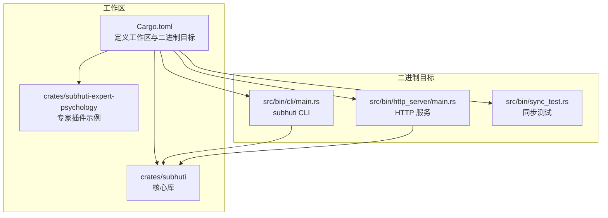
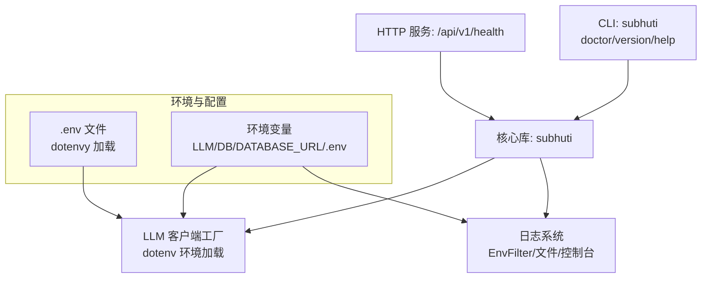
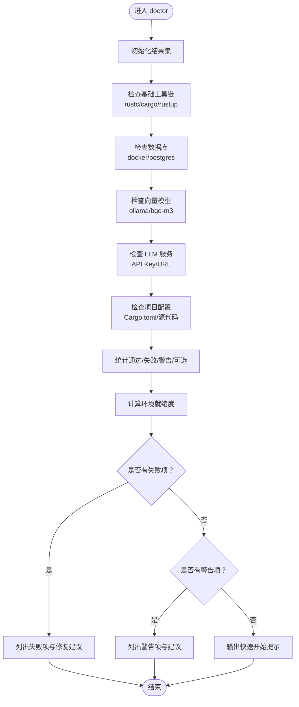
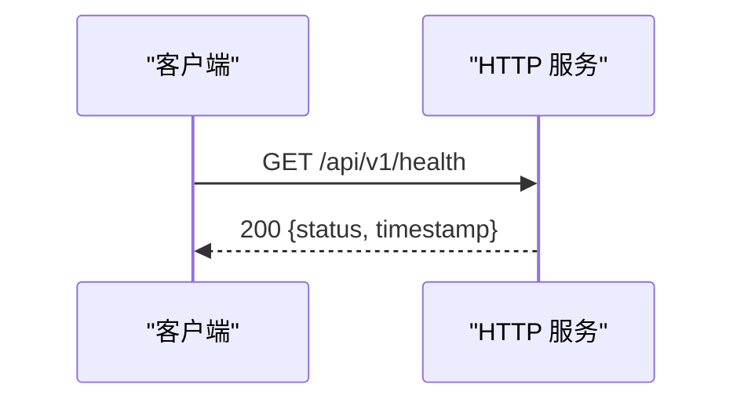
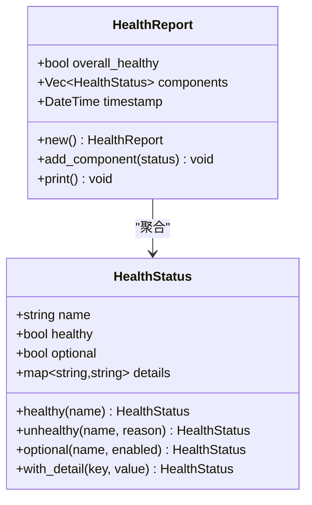
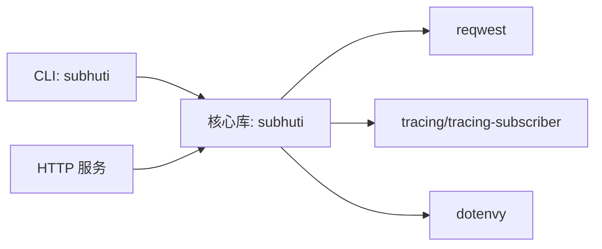

# CLI 工具

<cite>
**本文引用的文件**
- [src/bin/cli/main.rs](file://src/bin/cli/main.rs)
- [Cargo.toml](file://Cargo.toml)
- [crates/subhuti/Cargo.toml](file://crates/subhuti/Cargo.toml)
- [crates/subhuti/src/debug.rs](file://crates/subhuti/src/debug.rs)
- [crates/subhuti/src/runtime/llm/client.rs](file://crates/subhuti/src/runtime/llm/client.rs)
- [src/bin/http_server/main.rs](file://src/bin/http_server/main.rs)
- [src/bin/http_server/middleware.rs](file://src/bin/http_server/middleware.rs)
- [crates/subhuti/src/lib.rs](file://crates/subhuti/src/lib.rs)
- [crates/subhuti/src/runtime/mod.rs](file://crates/subhuti/src/runtime/mod.rs)
- [crates/subhuti/tests/performance_test.rs](file://crates/subhuti/tests/performance_test.rs)
- [docs/QUICKSTART.md](file://docs/QUICKSTART.md)
- [test_expert.sh](file://test_expert.sh)
- [test_expert_v2.sh](file://test_expert_v2.sh)
</cite>

## 目录
1. [简介](#简介)
2. [项目结构](#项目结构)
3. [核心组件](#核心组件)
4. [架构总览](#架构总览)
5. [详细组件分析](#详细组件分析)
6. [依赖关系分析](#依赖关系分析)
7. [性能考量](#性能考量)
8. [故障排除指南](#故障排除指南)
9. [结论](#结论)
10. [附录](#附录)

## 简介
本指南面向 Subhuti CLI 工具的使用者与维护者，系统讲解命令行工具的功能、参数、输出与退出状态，以及与子系统（HTTP 服务、健康检查、日志与配置）的集成关系。当前 CLI 工具提供以下命令：
- doctor：环境诊断
- version：显示版本信息
- help：显示帮助信息

此外，HTTP 服务提供了健康检查端点，可用于系统健康状态查询；框架还内置了健康检查与性能分析工具，便于在自动化脚本与 CI/CD 中集成。

## 项目结构
Subhuti 采用多 crate 的工作区组织，CLI 位于工作区根下的独立二进制目标，HTTP 服务同样为独立二进制目标，二者共享核心 crate（subhuti）。

图表来源
- [Cargo.toml:1-58](file://Cargo.toml#L1-L58)
- [crates/subhuti/Cargo.toml:1-63](file://crates/subhuti/Cargo.toml#L1-L63)

章节来源
- [Cargo.toml:1-58](file://Cargo.toml#L1-L58)
- [crates/subhuti/Cargo.toml:1-63](file://crates/subhuti/Cargo.toml#L1-L63)

## 核心组件
- CLI 子系统：负责解析命令、执行诊断逻辑、输出人类可读的诊断报告与建议。
- HTTP 服务子系统：提供健康检查端点、流式对话、专家插件与记忆宫殿等 API。
- 调试与健康检查工具：框架内置健康检查、性能分析与调试工具，支持在自动化脚本中使用。
- 日志与中间件：HTTP 服务内置日志初始化与请求日志中间件，支持控制台与文件双通道输出。

章节来源
- [src/bin/cli/main.rs:40-191](file://src/bin/cli/main.rs#L40-L191)
- [src/bin/http_server/main.rs:975-980](file://src/bin/http_server/main.rs#L975-L980)
- [crates/subhuti/src/debug.rs:185-290](file://crates/subhuti/src/debug.rs#L185-L290)
- [src/bin/http_server/middleware.rs:182-222](file://src/bin/http_server/middleware.rs#L182-L222)

## 架构总览
CLI 与 HTTP 服务通过共享核心库交互，CLI 专注于环境诊断与提示，HTTP 服务提供运行态的健康检查与业务 API。

图表来源
- [src/bin/cli/main.rs:40-191](file://src/bin/cli/main.rs#L40-L191)
- [src/bin/http_server/main.rs:975-980](file://src/bin/http_server/main.rs#L975-L980)
- [crates/subhuti/src/runtime/llm/client.rs:786-792](file://crates/subhuti/src/runtime/llm/client.rs#L786-L792)
- [src/bin/http_server/middleware.rs:182-222](file://src/bin/http_server/middleware.rs#L182-L222)

## 详细组件分析

### CLI 命令：doctor（环境诊断）
- 功能概述
  - 检查 Rust 工具链、Docker、PostgreSQL/pgvector、Ollama/bge-m3、LLM 提供商配置、项目配置与源代码完整性。
  - 输出按类别汇总，包含通过/失败/警告/可选统计与环境就绪度评分。
  - 失败项提供修复建议，警告项提供优化建议。
- 参数与行为
  - 无参数。仅支持命令名 doctor。
  - 退出状态：若存在失败项，返回非零；否则返回 0。
- 输出格式
  - 彩色图标标记的状态行，分类汇总统计，失败/警告清单与修复建议，最终“快速开始”或“请先修复”的提示。
- 使用场景
  - 新环境首次部署、变更环境后验证、CI 环节前置检查。
- 示例
  - 在项目根目录运行 doctor，观察输出中的“环境就绪度”百分比与失败/警告项。

图表来源
- [src/bin/cli/main.rs:78-191](file://src/bin/cli/main.rs#L78-L191)

章节来源
- [src/bin/cli/main.rs:40-191](file://src/bin/cli/main.rs#L40-L191)

### CLI 命令：version（版本信息）
- 功能概述
  - 输出 CLI 版本号与框架描述。
- 参数与行为
  - 无参数。仅支持命令名 version。
  - 退出状态：始终为 0。
- 输出格式
  - 单行或多行文本，包含版本号与描述。
- 使用场景
  - 运维巡检、问题定位时确认 CLI 版本。

章节来源
- [src/bin/cli/main.rs:57-60](file://src/bin/cli/main.rs#L57-L60)

### CLI 命令：help（帮助信息）
- 功能概述
  - 输出 CLI 使用说明与可用命令列表。
- 参数与行为
  - 无参数。支持 help、--help、-h。
  - 退出状态：始终为 0。
- 输出格式
  - 帮助文本，包含用法与示例。

章节来源
- [src/bin/cli/main.rs:62-76](file://src/bin/cli/main.rs#L62-L76)

### 健康检查（HTTP 服务）
- 端点
  - GET /api/v1/health：返回服务基本健康状态与时间戳。
- 行为与输出
  - 成功时返回状态码 200 与 JSON 结构，包含状态与时间戳。
- 使用场景
  - 健康探针、监控集成、CI/CD 部署后验证。

图表来源
- [src/bin/http_server/main.rs:975-980](file://src/bin/http_server/main.rs#L975-L980)

章节来源
- [src/bin/http_server/main.rs:975-980](file://src/bin/http_server/main.rs#L975-L980)

### 健康检查（框架内置）
- 组件
  - HealthStatus：组件健康状态，支持可选组件标记。
  - HealthReport：聚合组件健康状态，打印报告。
- 行为
  - add_component：根据 optional 标记决定是否影响整体健康。
  - print：输出带图标与详情的健康报告。
- 使用场景
  - 在自动化脚本中调用框架健康检查，输出结构化报告。

图表来源
- [crates/subhuti/src/debug.rs:185-290](file://crates/subhuti/src/debug.rs#L185-L290)

章节来源
- [crates/subhuti/src/debug.rs:185-290](file://crates/subhuti/src/debug.rs#L185-L290)

### 性能测试与分析（框架内置）
- 组件
  - Profiler：记录与汇总多次调用的耗时统计。
  - TestTracker：测试用例计数与失败收集。
- 使用场景
  - 在自动化脚本中运行性能测试，输出性能报告与测试总结。

章节来源
- [crates/subhuti/tests/performance_test.rs:1-295](file://crates/subhuti/tests/performance_test.rs#L1-L295)
- [crates/subhuti/src/debug.rs:298-350](file://crates/subhuti/src/debug.rs#L298-L350)

### 配置与环境变量
- 环境变量
  - LLM 提供商相关：如 DOUBAO_API_KEY、OPENAI_API_KEY、OLLAMA_BASE_URL。
  - 数据库：DATABASE_URL 或 DB_* 系列变量（HTTP 服务中使用）。
  - 日志级别：通过环境变量（如 RUST_LOG）与 EnvFilter 控制。
- .env 文件
  - LLM 客户端工厂在运行时尝试从当前工作目录加载 .env。
- 配置加载顺序
  - 代码中优先读取环境变量，其次加载 .env 文件。

章节来源
- [src/bin/cli/main.rs:417-458](file://src/bin/cli/main.rs#L417-L458)
- [crates/subhuti/src/runtime/llm/client.rs:786-792](file://crates/subhuti/src/runtime/llm/client.rs#L786-L792)
- [src/bin/http_server/main.rs:1366-1378](file://src/bin/http_server/main.rs#L1366-L1378)
- [src/bin/http_server/middleware.rs:212-213](file://src/bin/http_server/middleware.rs#L212-L213)

### 日志系统
- 输出通道
  - 控制台：彩色、简洁输出。
  - 文件：JSON 格式、详细信息，滚动日志。
- 级别控制
  - 通过 EnvFilter 从环境变量读取日志级别，默认关闭部分噪声日志。
- 使用场景
  - 生产环境同时保留控制台与文件日志，便于运维与审计。

章节来源
- [src/bin/http_server/middleware.rs:182-222](file://src/bin/http_server/middleware.rs#L182-L222)

### LLM 客户端与提供商
- 客户端工厂
  - 根据配置自动选择 OpenAI/Ollama/Doubao 客户端。
- 环境加载
  - 启动时尝试加载 .env，便于注入 API Key 与 Base URL。
- 使用场景
  - 在 doctor 未配置 LLM Key 时，可通过环境变量或 .env 提供凭据。

章节来源
- [crates/subhuti/src/runtime/llm/client.rs:808-825](file://crates/subhuti/src/runtime/llm/client.rs#L808-L825)
- [crates/subhuti/src/runtime/mod.rs:89-117](file://crates/subhuti/src/runtime/mod.rs#L89-L117)

## 依赖关系分析
- CLI 与核心库
  - CLI 通过共享核心库获取健康检查与调试能力。
- HTTP 服务与核心库
  - HTTP 服务直接依赖核心库，提供 API 与中间件。
- 依赖耦合
  - CLI 与 HTTP 服务均依赖核心库，但彼此解耦，可独立运行。
- 外部依赖
  - dotenvy 用于加载 .env；tracing/tracing-subscriber 用于日志；reqwest 用于 LLM 调用。

图表来源
- [Cargo.toml:25-58](file://Cargo.toml#L25-L58)
- [crates/subhuti/Cargo.toml:14-53](file://crates/subhuti/Cargo.toml#L14-L53)

章节来源
- [Cargo.toml:25-58](file://Cargo.toml#L25-L58)
- [crates/subhuti/Cargo.toml:14-53](file://crates/subhuti/Cargo.toml#L14-L53)

## 性能考量
- doctor 诊断
  - 通过外部命令检查工具链与服务可用性，耗时取决于系统环境与网络。
- HTTP 服务
  - 健康检查端点为轻量级，返回固定结构。
- 框架性能测试
  - 提供性能测试样例，包含初始化、记忆存储/搜索、遗忘周期、健康检查、Skill 列表、分区推断、记忆生命周期等指标与阈值。
- 建议
  - 在 CI/CD 中结合 doctor 与健康检查端点进行预检；对关键路径使用框架内置性能分析工具。

章节来源
- [crates/subhuti/tests/performance_test.rs:1-295](file://crates/subhuti/tests/performance_test.rs#L1-L295)

## 故障排除指南
- doctor 输出大量“可选”项
  - 说明相关组件（如 Docker、PostgreSQL、Ollama、LLM Key）未安装或未配置，属于可选依赖。若业务不需要可忽略。
- doctor 出现“失败”项
  - 依据输出中的修复建议逐项处理，例如安装工具链、启动容器、配置 API Key 或 .env。
- HTTP 服务健康检查失败
  - 检查 LLM 配置与网络连通性；确认 .env 或环境变量已正确加载。
- 日志级别过高或过低
  - 通过环境变量调整日志级别；必要时在中间件层调整 EnvFilter。
- 专家插件生态测试
  - 可参考专家插件测试脚本，验证插件启停、激活/停用、Persona 覆盖与技能注入等流程。

章节来源
- [src/bin/cli/main.rs:148-186](file://src/bin/cli/main.rs#L148-L186)
- [src/bin/http_server/main.rs:975-980](file://src/bin/http_server/main.rs#L975-L980)
- [src/bin/http_server/middleware.rs:212-213](file://src/bin/http_server/middleware.rs#L212-L213)
- [test_expert.sh:1-118](file://test_expert.sh#L1-L118)
- [test_expert_v2.sh:1-143](file://test_expert_v2.sh#L1-L143)

## 结论
Subhuti CLI 工具以 doctor 为核心，提供系统化环境诊断与修复建议；配合 HTTP 服务的健康检查端点与框架内置的健康检查/性能分析工具，可满足日常运维、故障排查与自动化集成需求。通过 .env 与环境变量灵活配置 LLM 与数据库，结合中间件的日志系统，可在不同环境中稳定运行。

## 附录

### 常用命令与示例
- doctor
  - 在项目根目录运行，查看“环境就绪度”与失败/警告项。
- version
  - 查看 CLI 版本信息。
- 健康检查（HTTP）
  - GET /api/v1/health：返回服务健康状态与时间戳。
- 快速开始参考
  - 参考快速入门文档中的步骤与示例。

章节来源
- [src/bin/cli/main.rs:40-76](file://src/bin/cli/main.rs#L40-L76)
- [src/bin/http_server/main.rs:975-980](file://src/bin/http_server/main.rs#L975-L980)
- [docs/QUICKSTART.md:1-281](file://docs/QUICKSTART.md#L1-L281)

### CI/CD 集成建议
- 预检阶段
  - 运行 doctor，捕获失败项并阻断后续流程。
- 部署后验证
  - 调用 /api/v1/health，确认服务可用。
- 性能回归
  - 在 CI 中运行框架性能测试样例，记录关键指标与阈值对比。
- 日志采集
  - 启用中间件日志，将控制台与文件日志接入统一日志平台。

章节来源
- [crates/subhuti/tests/performance_test.rs:1-295](file://crates/subhuti/tests/performance_test.rs#L1-L295)
- [src/bin/http_server/middleware.rs:182-222](file://src/bin/http_server/middleware.rs#L182-L222)