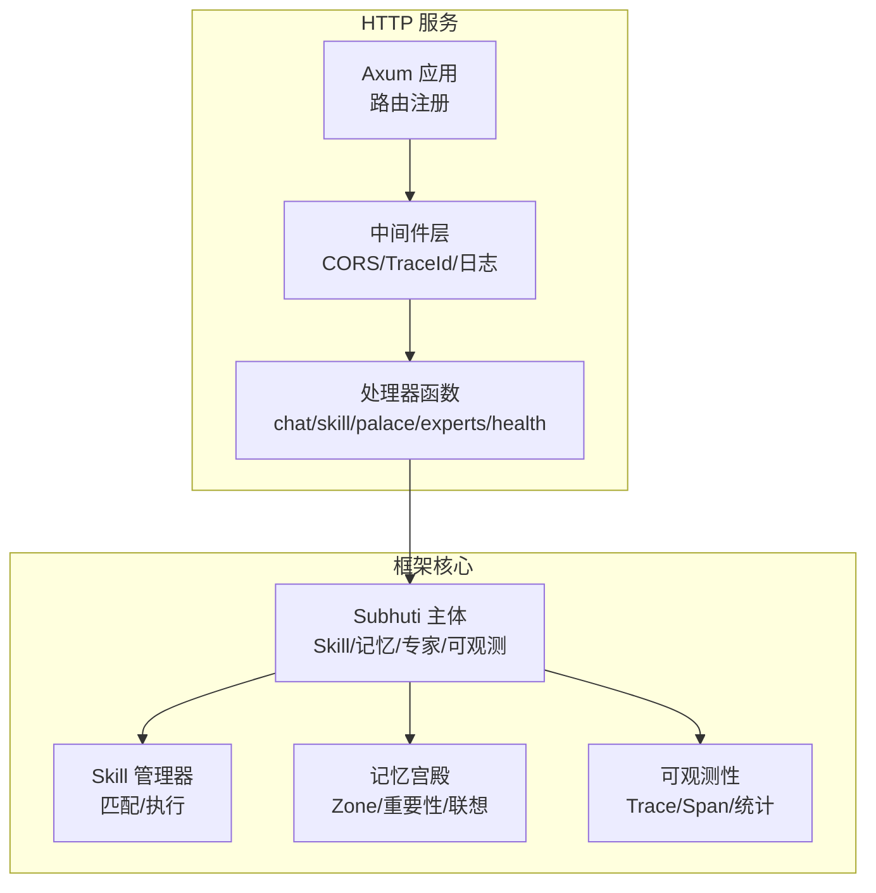
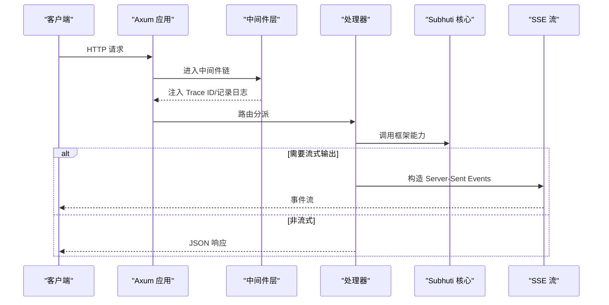
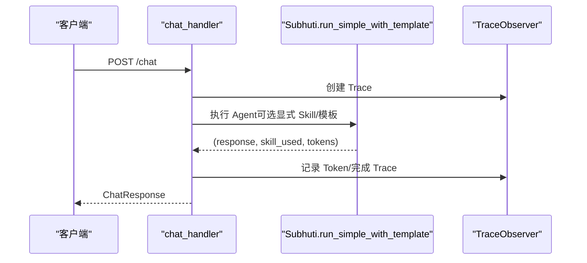
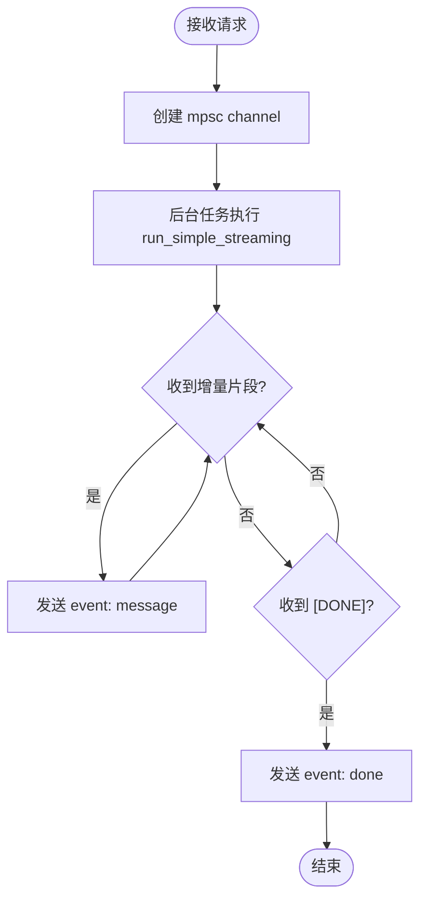
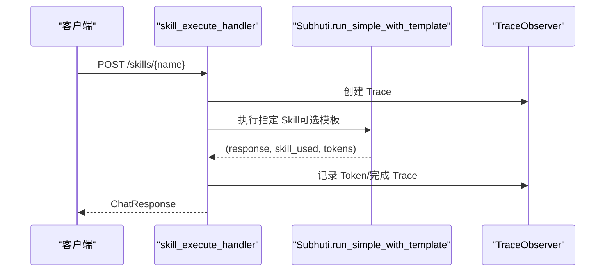
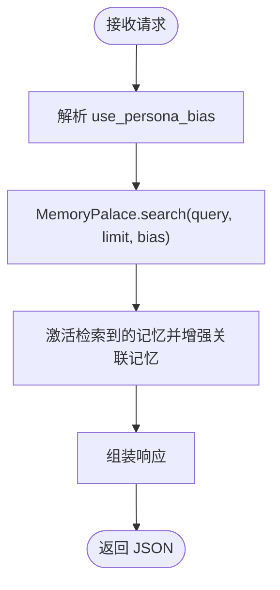
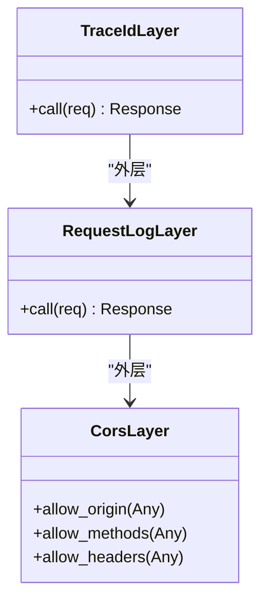
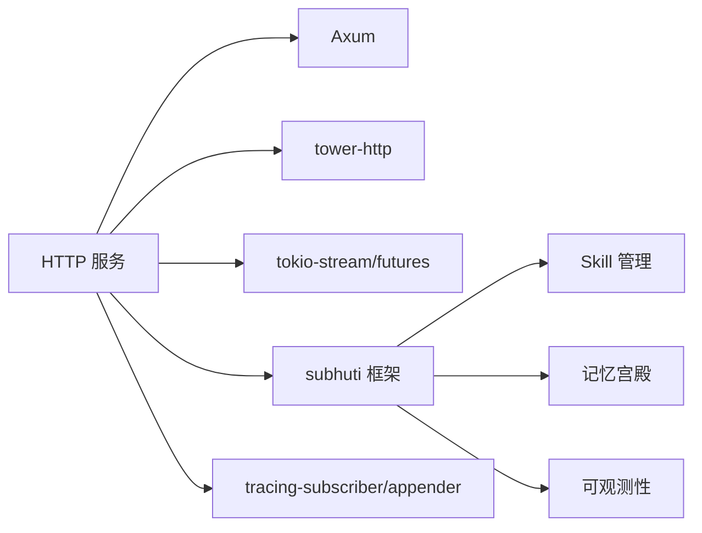

# HTTP API 服务

<cite>
**本文引用的文件**
- [main.rs](file://src/bin/http_server/main.rs)
- [middleware.rs](file://src/bin/http_server/middleware.rs)
- [lib.rs](file://crates/subhuti/src/lib.rs)
- [mod.rs](file://crates/subhuti/src/skill/mod.rs)
- [palace.rs](file://crates/subhuti/src/soul/palace.rs)
- [mod.rs](file://crates/subhuti/src/observe/mod.rs)
- [Cargo.toml](file://Cargo.toml)
- [API_TUTORIAL.md](file://docs/API_TUTORIAL.md)
- [QUICKSTART.md](file://docs/QUICKSTART.md)
</cite>

## 目录
1. [简介](#简介)
2. [项目结构](#项目结构)
3. [核心组件](#核心组件)
4. [架构总览](#架构总览)
5. [详细组件分析](#详细组件分析)
6. [依赖关系分析](#依赖关系分析)
7. [性能考虑](#性能考虑)
8. [故障排查指南](#故障排查指南)
9. [结论](#结论)
10. [附录](#附录)

## 简介
本文件为 Subhuti HTTP API 服务的完整接口文档，覆盖聊天接口、技能接口、健康检查、心灵宫殿操作、专家插件、可观测性追踪等全部 RESTful 端点。文档同时阐述中间件系统（CORS、认证授权、日志记录、性能监控）、WebSocket/Server-Sent Events（SSE）实时通信机制、使用示例、SDK 集成指南、API 版本管理策略、性能优化建议与安全配置最佳实践。

## 项目结构
- 服务入口位于 src/bin/http_server/main.rs，采用 Axum 路由注册与中间件装配。
- 中间件位于 src/bin/http_server/middleware.rs，提供 Trace ID 生成与请求日志记录。
- 核心框架位于 crates/subhuti，提供 Skill 管理、记忆宫殿、专家插件、可观测性等能力。
- 文档位于 docs，包含 API 教程与快速入门。

图表来源
- [main.rs:1386-1443](file://src/bin/http_server/main.rs#L1386-L1443)
- [lib.rs:84-156](file://crates/subhuti/src/lib.rs#L84-L156)
- [mod.rs:451-530](file://crates/subhuti/src/skill/mod.rs#L451-L530)
- [palace.rs:228-316](file://crates/subhuti/src/soul/palace.rs#L228-L316)
- [mod.rs:42-48](file://crates/subhuti/src/observe/mod.rs#L42-L48)

章节来源
- [main.rs:1386-1443](file://src/bin/http_server/main.rs#L1386-L1443)
- [Cargo.toml:13-23](file://Cargo.toml#L13-L23)

## 核心组件
- HTTP 路由与处理器：统一网关、技能路由、流式输出、健康检查、日志查询、心灵宫殿、专家插件、可观测性追踪。
- 中间件：CORS、Trace ID、请求日志。
- 框架能力：Skill 匹配与执行、记忆宫殿搜索与遗忘、专家插件激活与禁用、可观测性 Trace/Span。
- 实时通信：SSE 流式输出（聊天与技能执行）。

章节来源
- [main.rs:364-551](file://src/bin/http_server/main.rs#L364-L551)
- [middleware.rs:15-172](file://src/bin/http_server/middleware.rs#L15-L172)
- [lib.rs:644-731](file://crates/subhuti/src/lib.rs#L644-L731)
- [mod.rs:256-405](file://crates/subhuti/src/skill/mod.rs#L256-L405)
- [palace.rs:423-566](file://crates/subhuti/src/soul/palace.rs#L423-L566)

## 架构总览
HTTP 服务通过中间件层注入 Trace ID 与请求日志，随后进入路由层，根据路径分派到具体处理器；处理器调用框架核心 Subhuti 的能力（Skill、记忆、专家、可观测），并在必要时返回 SSE 流式响应。

图表来源
- [main.rs:1432-1443](file://src/bin/http_server/main.rs#L1432-L1443)
- [middleware.rs:53-81](file://src/bin/http_server/middleware.rs#L53-L81)
- [main.rs:487-551](file://src/bin/http_server/main.rs#L487-L551)

## 详细组件分析

### 聊天接口
- 路径：POST /subhuti/api/v1/chat
- 功能：统一入口，AI 自动判断调用哪个 Skill，返回调用链信息与 Token 统计。
- 请求体
  - message: string（必填）
  - user_id: string（可选）
  - session_id: string（可选）
  - skill: string（可选，显式指定 Skill）
  - flow_template: string（可选，"simple"/"react"/"plan_act"/"chain_of_thought"）
- 响应体
  - response: string
  - session_id: string
  - trace_id: string
  - skill_used: string（可选）
  - chain: string[]
  - duration_ms: number
  - model: string（可选）
  - prompt_tokens/completion_tokens/total_tokens: number
- 状态码
  - 200 成功
  - 500 服务端错误
- 错误处理
  - 捕获框架异常，记录 Trace 并返回统一错误响应。

图表来源
- [main.rs:402-485](file://src/bin/http_server/main.rs#L402-L485)
- [lib.rs:722-731](file://crates/subhuti/src/lib.rs#L722-L731)

章节来源
- [main.rs:208-243](file://src/bin/http_server/main.rs#L208-L243)
- [main.rs:398-485](file://src/bin/http_server/main.rs#L398-L485)

### 聊天流式接口（SSE）
- 路径：POST /subhuti/api/v1/chat/stream
- 功能：使用 Server-Sent Events 实时返回增量内容，首帧携带 session_id，结束帧为 "done"。
- 请求体：与聊天接口一致
- 响应事件
  - event: session_id（首帧，data: session_id）
  - event: message（增量片段）
  - event: done（结束）
- 错误事件
  - event: error（data: 错误信息）

图表来源
- [main.rs:491-551](file://src/bin/http_server/main.rs#L491-L551)

章节来源
- [main.rs:487-551](file://src/bin/http_server/main.rs#L487-L551)

### 技能接口
- 列出技能
  - GET/POST /subhuti/api/v1/skills
  - 响应：skills: SkillInfoItem[]
- 执行指定技能
  - POST /subhuti/api/v1/skills/{name}
  - 请求体：message/user_id/session_id/flow_template
  - 响应：ChatResponse（与聊天接口一致）
- 技能流式执行
  - POST /subhuti/api/v1/skills/{name}/stream
  - 响应：SSE 事件流（首帧 session_id，后续 message，结束 done）

图表来源
- [main.rs:1191-1253](file://src/bin/http_server/main.rs#L1191-L1253)
- [lib.rs:708-731](file://crates/subhuti/src/lib.rs#L708-L731)

章节来源
- [main.rs:1170-1253](file://src/bin/http_server/main.rs#L1170-L1253)
- [mod.rs:451-580](file://crates/subhuti/src/skill/mod.rs#L451-L580)

### 健康检查接口
- GET /subhuti/api/v1/health
  - 响应：status: "ok"/"unhealthy"，timestamp
- GET /subhuti/api/v1/health/detailed
  - 响应：components[] 包含 MemoryPalace、Database、SoulLayer、ExpertPlugins、Skills 等组件状态与详情

章节来源
- [main.rs:975-1000](file://src/bin/http_server/main.rs#L975-L1000)
- [lib.rs:562-636](file://crates/subhuti/src/lib.rs#L562-L636)

### 心灵宫殿接口
- GET /subhuti/api/v1/palace/stats
  - 响应：total_count、zone_counts、importance_counts、avg_strength、base_stats
- POST /subhuti/api/v1/palace/forget
  - 响应：forgotten_count、message
- POST /subhuti/api/v1/palace/search
  - 请求体：query/limit/use_persona_bias
  - 响应：data[]（包含 id/content/zone/importance/relevance_score/final_score/activation_count/created_at）

图表来源
- [main.rs:711-747](file://src/bin/http_server/main.rs#L711-L747)
- [palace.rs:423-566](file://crates/subhuti/src/soul/palace.rs#L423-L566)

章节来源
- [main.rs:664-747](file://src/bin/http_server/main.rs#L664-L747)
- [palace.rs:423-566](file://crates/subhuti/src/soul/palace.rs#L423-L566)

### 专家插件接口
- GET /subhuti/api/v1/experts
  - 响应：data.plugins[]、total
- GET /subhuti/api/v1/experts/plugins
  - 响应：data[]（包含权限、沙箱、钩子等）
- GET /subhuti/api/v1/experts/active
  - 响应：data.active_expert
- POST /subhuti/api/v1/experts/{id}/activate
  - 响应：success/message/data
- POST /subhuti/api/v1/experts/deactivate
  - 响应：success/message
- POST /subhuti/api/v1/experts/{id}/enable
- POST /subhuti/api/v1/experts/{id}/disable
- POST /subhuti/api/v1/experts/match
  - 响应：data（匹配到的专家）

章节来源
- [main.rs:751-814](file://src/bin/http_server/main.rs#L751-L814)
- [main.rs:833-917](file://src/bin/http_server/main.rs#L833-L917)
- [main.rs:816-831](file://src/bin/http_server/main.rs#L816-L831)

### 可观测性追踪接口
- GET /subhuti/api/v1/traces
  - 响应：data[]（Trace 摘要）
- GET /subhuti/api/v1/traces/{id}
  - 响应：data（Trace 详情）
- GET /subhuti/api/v1/traces/{id}/tree
  - 响应：data（Span 树）

章节来源
- [main.rs:921-973](file://src/bin/http_server/main.rs#L921-L973)
- [mod.rs:44-48](file://crates/subhuti/src/observe/mod.rs#L44-L48)

### 日志查询接口
- GET /subhuti/api/v1/logs
  - 查询参数：trace_id、level、target、keyword、page、page_size
  - 响应：total/page/page_size/logs[]（包含 timestamp/level/target/message/fields 等）

章节来源
- [main.rs:1002-1168](file://src/bin/http_server/main.rs#L1002-L1168)

### 中间件系统（Middleware）
- CORS 配置
  - 允许任意来源、方法与头部
- 认证授权
  - 未内置鉴权逻辑，可通过自定义中间件扩展
- 日志记录
  - RequestLogLayer：记录方法、路径、状态码、耗时、Trace ID
- Trace ID
  - TraceIdLayer：请求头若无 x-trace-id 则生成 UUID 并注入响应头

图表来源
- [middleware.rs:15-172](file://src/bin/http_server/middleware.rs#L15-L172)
- [main.rs:1434-1439](file://src/bin/http_server/main.rs#L1434-L1439)

章节来源
- [middleware.rs:15-172](file://src/bin/http_server/middleware.rs#L15-L172)
- [main.rs:1432-1443](file://src/bin/http_server/main.rs#L1432-L1443)

### WebSocket 支持
- 当前实现为 SSE（Server-Sent Events），通过 text/event-stream 响应类型与事件帧实现流式输出。
- WebSocket 支持未在现有代码中实现，如需扩展可在 Axum 中引入 WebSocket 中间件与处理器。

章节来源
- [main.rs:487-551](file://src/bin/http_server/main.rs#L487-L551)
- [main.rs:1255-1318](file://src/bin/http_server/main.rs#L1255-L1318)

### 使用示例与 SDK 集成
- 基础聊天与流式输出示例可参考 API 教程文档。
- 建议 SDK 集成遵循：
  - 统一设置 Content-Type: application/json
  - 透传 x-trace-id 响应头用于问题定位
  - SSE 场景使用 EventSource 或浏览器原生 EventSource 处理事件

章节来源
- [API_TUTORIAL.md:18-162](file://docs/API_TUTORIAL.md#L18-L162)
- [QUICKSTART.md:72-101](file://docs/QUICKSTART.md#L72-L101)

### API 版本管理策略
- 当前路由以 /subhuti/api/v1/ 前缀命名，建议后续版本迁移至 /subhuti/api/v2/ 并保持向后兼容或明确迁移指引。
- 通过文档与变更日志标注破坏性变更，避免强制升级。

## 依赖关系分析
- 依赖关系
  - HTTP 服务依赖 Axum、tower-http、tokio-stream、futures
  - 框架核心依赖 subhuti crate，提供 Skill、记忆、专家、可观测等能力
  - 日志系统使用 tracing-subscriber 与 tracing-appender，支持控制台与文件双写

图表来源
- [Cargo.toml:25-58](file://Cargo.toml#L25-L58)
- [main.rs:18-47](file://src/bin/http_server/main.rs#L18-L47)

章节来源
- [Cargo.toml:25-58](file://Cargo.toml#L25-L58)

## 性能考虑
- 流式输出
  - 使用 mpsc channel + ReceiverStream 将后台任务产生的增量片段转为 SSE，避免阻塞主线程
- Token 统计
  - 框架在 SkillContext 中聚合 LLM Token 消耗，便于成本控制与性能分析
- 关键字索引
  - SkillManager 使用关键词倒排索引优化大规模 Skill 匹配性能
- 心灵宫殿
  - 搜索阶段先读锁完成评分与排序，再释放锁进行激活增强，减少锁竞争

章节来源
- [main.rs:501-551](file://src/bin/http_server/main.rs#L501-L551)
- [mod.rs:181-235](file://crates/subhuti/src/skill/mod.rs#L181-L235)
- [mod.rs:655-729](file://crates/subhuti/src/skill/mod.rs#L655-L729)
- [palace.rs:423-566](file://crates/subhuti/src/soul/palace.rs#L423-L566)

## 故障排查指南
- Trace 追踪
  - 通过 /traces/{id}/tree 查看 Span 树，定位耗时环节
- 日志查询
  - 使用 /logs 接口按 trace_id/level/target/keyword 等条件过滤
- 健康检查
  - /health 与 /health/detailed 快速定位组件异常
- 常见问题
  - LLM 连接失败：检查环境变量（如 DOUBAO_API_KEY、OLLAMA_BASE_URL）
  - 数据库未配置：MemoryPalace/Database 为可选组件，不影响基本功能

章节来源
- [main.rs:921-973](file://src/bin/http_server/main.rs#L921-L973)
- [main.rs:1002-1168](file://src/bin/http_server/main.rs#L1002-L1168)
- [lib.rs:562-636](file://crates/subhuti/src/lib.rs#L562-L636)
- [QUICKSTART.md:241-268](file://docs/QUICKSTART.md#L241-L268)

## 结论
本接口文档系统梳理了 Subhuti HTTP API 的全部端点与中间件体系，明确了 SSE 流式输出机制与可观测性追踪能力。结合 Skill 管理、记忆宫殿与专家插件，服务具备良好的扩展性与可运维性。建议在生产环境中完善鉴权与限流、接入更严格的日志与监控，并按版本策略平滑演进 API。

## 附录
- 环境变量
  - LLM_PROVIDER/LLM_MODEL/LLM_API_URL/DOUBAO_API_KEY/Ollama 配置
  - DB_* 数据库连接参数
  - HTTP_ADDR 服务监听地址
- 测试页面
  - /subhuti/test 提供交互式测试界面

章节来源
- [main.rs:1332-1383](file://src/bin/http_server/main.rs#L1332-L1383)
- [main.rs:1429-1431](file://src/bin/http_server/main.rs#L1429-L1431)