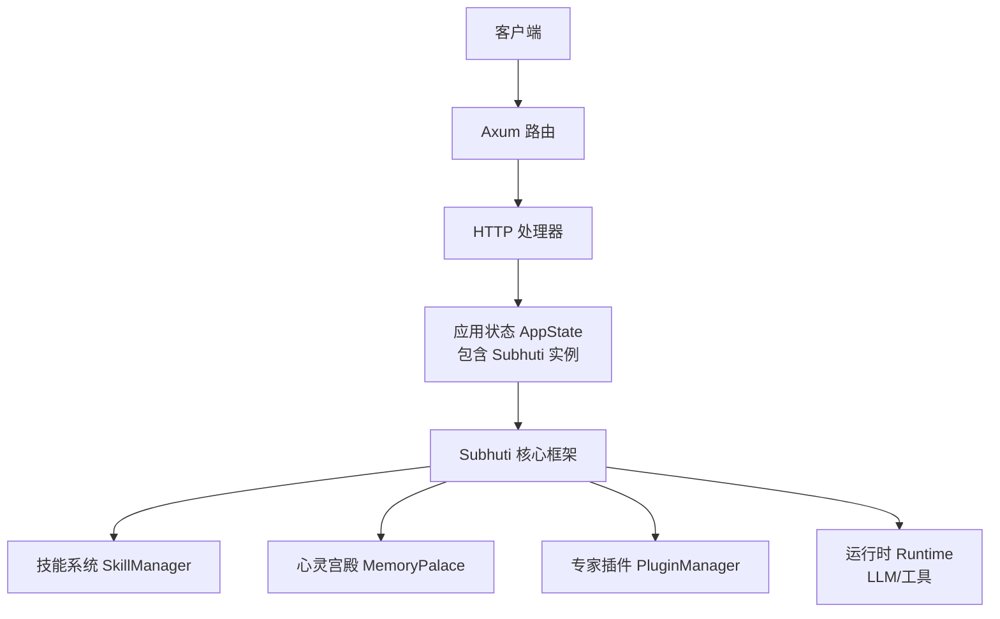
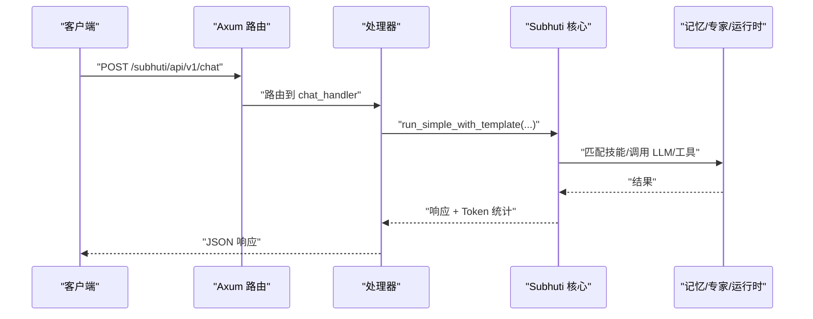
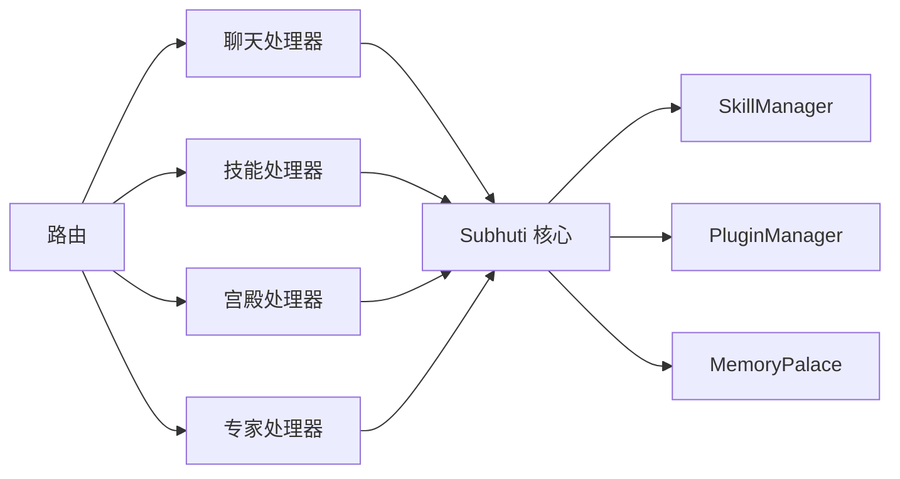
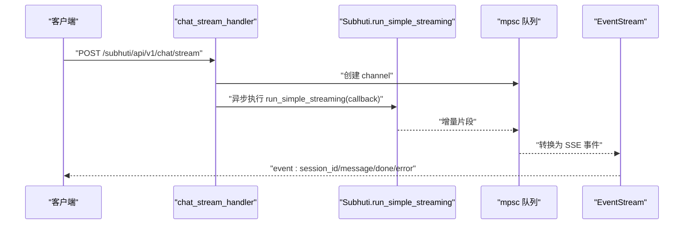

# REST API 端点

<cite>
**本文档引用的文件**
- [main.rs](file://src/bin/http_server/main.rs)
- [lib.rs](file://crates/subhuti/src/lib.rs)
- [mod.rs（技能）](file://crates/subhuti/src/skill/mod.rs)
- [mod.rs（专家插件）](file://crates/subhuti/src/expert/mod.rs)
- [palace.rs（心灵宫殿）](file://crates/subhuti/src/soul/palace.rs)
- [react.rs（流程）](file://crates/subhuti/src/flow/react.rs)
- [plan_act.rs（流程）](file://crates/subhuti/src/flow/plan_act.rs)
- [middleware.rs（中间件）](file://src/bin/http_server/middleware.rs)
- [API_TUTORIAL.md](file://docs/API_TUTORIAL.md)
- [index.html](file://static/index.html)
</cite>

## 目录
1. [简介](#简介)
2. [项目结构](#项目结构)
3. [核心组件](#核心组件)
4. [架构总览](#架构总览)
5. [详细组件分析](#详细组件分析)
6. [依赖分析](#依赖分析)
7. [性能考虑](#性能考虑)
8. [故障排除指南](#故障排除指南)
9. [结论](#结论)
10. [附录](#附录)

## 简介
本文件面向 Subhuti 的 HTTP REST API，系统性梳理所有对外暴露的端点，涵盖统一聊天入口、技能管理、健康检查、心灵宫殿操作、专家插件管理等。文档提供每个端点的请求/响应格式、参数说明、状态码含义、错误处理机制，并深入解释流式输出（SSE）在聊天接口中的应用。

## 项目结构
Subhuti 采用 Axum 作为 HTTP 服务器，路由集中在统一网关中；核心业务逻辑位于 crates/subhuti 框架层，HTTP 层负责协议适配与响应封装。

图表来源
- [main.rs:364-369](file://src/bin/http_server/main.rs#L364-L369)
- [lib.rs:84-107](file://crates/subhuti/src/lib.rs#L84-L107)

章节来源
- [main.rs:1-120](file://src/bin/http_server/main.rs#L1-L120)
- [lib.rs:1-82](file://crates/subhuti/src/lib.rs#L1-L82)

## 核心组件
- 应用状态 AppState：持有 Subhuti 实例与 Trace 观察器，供所有处理器共享。
- 路由注册：统一在应用启动时注册所有 API 路由。
- 中间件：Trace ID 生成与请求日志记录，便于端到端追踪。
- SSE 流式输出：基于 Server-Sent Events，支持实时增量返回。

章节来源
- [main.rs:364-385](file://src/bin/http_server/main.rs#L364-L385)
- [middleware.rs:15-82](file://src/bin/http_server/middleware.rs#L15-L82)

## 架构总览
Subhuti 的 HTTP 层通过路由将请求分发至对应处理器，处理器调用 Subhuti 核心执行业务逻辑，并返回结构化的响应。对于聊天类请求，支持同步与流式两种模式。

图表来源
- [main.rs:398-485](file://src/bin/http_server/main.rs#L398-L485)
- [lib.rs:695-742](file://crates/subhuti/src/lib.rs#L695-L742)

## 详细组件分析

### 统一聊天入口
- 路径
  - POST /subhuti/api/v1/chat
  - POST /subhuti/api/v1/chat/stream
- 功能
  - 统一入口：AI 自动判断调用哪个 Skill，返回调用链信息与 Token 统计。
  - 流式输出：SSE 实时推送增量片段，首帧携带 session_id，结束事件为 [DONE]。
- 请求体（ChatRequest）
  - message: string（必填）
  - user_id: string（可选）
  - session_id: string（可选）
  - skill: string（可选，显式指定 Skill）
  - flow_template: string（可选，支持 simple/react/plan_act/chain_of_thought）
- 响应体（ChatResponse）
  - response: string
  - session_id: string
  - trace_id: string
  - skill_used: string（可选）
  - chain: string[]（调用链）
  - duration_ms: number
  - model: string（可选）
  - prompt_tokens/completion_tokens/total_tokens: number
- 状态码
  - 200 成功
  - 500 服务器错误（内部异常）
- 错误处理
  - 失败时返回 ErrorResponse，包含错误信息与 500 状态码。
- 流式输出机制（SSE）
  - Content-Type: text/event-stream
  - 首帧事件：session_id
  - 增量事件：message
  - 结束事件：done（值为 true）
  - 错误事件：error（值为错误字符串）
- 使用场景
  - 简单问答、工具调用、复杂推理、规划执行等，由 Skill 与流程模板决定。

章节来源
- [main.rs:208-243](file://src/bin/http_server/main.rs#L208-L243)
- [main.rs:398-485](file://src/bin/http_server/main.rs#L398-L485)
- [main.rs:487-551](file://src/bin/http_server/main.rs#L487-L551)
- [main.rs:1385-1391](file://src/bin/http_server/main.rs#L1385-L1391)

### 技能管理
- 路径
  - GET/POST /subhuti/api/v1/skills
  - POST /subhuti/api/v1/skills/:name
  - POST /subhuti/api/v1/skills/:name/stream
- 功能
  - 列出所有已注册 Skill 及其流程模板。
  - 执行指定 Skill（可选覆盖流程模板）。
  - 流式执行指定 Skill。
- 请求体（SkillExecuteRequest）
  - message: string（必填）
  - user_id: string（可选）
  - session_id: string（可选）
  - flow_template: string（可选，覆盖 Skill 默认模板）
- 响应体（SkillListResponse/SkillInfoItem）
  - skills: SkillInfoItem[]
    - name: string
    - description: string
    - flow_template: string（可选）
    - flow_templates: string[]
    - priority: number
- 状态码
  - 200 成功
  - 404 未找到指定 Skill
  - 500 服务器错误
- 使用场景
  - 快速定位合适技能、绕过自动匹配直连特定技能、流式查看技能执行过程。

章节来源
- [main.rs:245-272](file://src/bin/http_server/main.rs#L245-L272)
- [main.rs:1392-1397](file://src/bin/http_server/main.rs#L1392-L1397)

### 健康检查
- 路径
  - GET /subhuti/api/v1/health
  - GET /subhuti/api/v1/health/detailed
- 功能
  - 健康检查：返回系统整体健康状态与关键组件统计。
  - 详细健康报告：包含 MemoryPalace、Database、SoulLayer、ExpertPlugins、Skills 等组件详情。
- 响应体（示例）
  - overall_healthy: boolean
  - timestamp: string
  - components: array（包含各组件健康状态与详情）
- 状态码
  - 200 成功
  - 404 不存在的端点
  - 500 服务器错误
- 使用场景
  - 运维监控、系统诊断、自动化巡检。

章节来源
- [lib.rs:573-647](file://crates/subhuti/src/lib.rs#L573-L647)
- [API_TUTORIAL.md:645-701](file://docs/API_TUTORIAL.md#L645-L701)
- [main.rs:1399-1401](file://src/bin/http_server/main.rs#L1399-L1401)

### 心灵宫殿操作
- 路径
  - GET /subhuti/api/v1/palace/stats
  - POST /subhuti/api/v1/palace/search
  - POST /subhuti/api/v1/palace/forget
- 功能
  - 统计信息：返回记忆总数、分区分布、平均强度、基础统计等。
  - 搜索：支持关键词检索，可选择是否使用人格偏置。
  - 遗忘周期：执行记忆清理，返回清理数量。
- 请求体（PalaceSearchRequest）
  - query: string（必填）
  - limit: number（默认 10）
  - use_persona_bias: boolean（默认 false）
- 响应体（示例）
  - success: boolean
  - data: object/array（根据端点不同）
  - total: number（搜索结果数量）
- 状态码
  - 200 成功
  - 500 服务器错误
- 使用场景
  - 记忆检索、个性化召回、定期清理过期记忆。

章节来源
- [main.rs:664-697](file://src/bin/http_server/main.rs#L664-L697)
- [main.rs:699-747](file://src/bin/http_server/main.rs#L699-L747)
- [main.rs:687-697](file://src/bin/http_server/main.rs#L687-L697)
- [palace.rs:34-115](file://crates/subhuti/src/soul/palace.rs#L34-L115)

### 专家插件管理
- 路径
  - GET /subhuti/api/v1/experts
  - GET /subhuti/api/v1/experts/plugins
  - GET /subhuti/api/v1/experts/active
  - POST /subhuti/api/v1/experts/:id/activate
  - POST /subhuti/api/v1/experts/deactivate
  - POST /subhuti/api/v1/experts/:id/enable
  - POST /subhuti/api/v1/experts/:id/disable
  - POST /subhuti/api/v1/experts/match
- 功能
  - 列出专家插件清单与状态。
  - 查询当前激活专家。
  - 激活/停用指定专家。
  - 启用/禁用指定专家。
  - 根据输入内容自动匹配专家。
- 响应体（示例）
  - success: boolean
  - data: object/array（根据端点不同）
  - message: string（错误或操作结果）
  - total: number（列表长度）
- 状态码
  - 200 成功
  - 400 参数错误/激活失败
  - 500 服务器错误
- 使用场景
  - 动态切换专家角色、扩展领域能力、权限与沙箱控制。

章节来源
- [main.rs:751-794](file://src/bin/http_server/main.rs#L751-L794)
- [lib.rs:234-354](file://crates/subhuti/src/lib.rs#L234-L354)
- [mod.rs（专家插件）:664-760](file://crates/subhuti/src/expert/mod.rs#L664-L760)

### 系统与可观测性
- 路径
  - GET /subhuti/api/v1/logs
  - GET /subhuti/api/v1/persona
  - POST /subhuti/api/v1/persona/evolve
  - POST /subhuti/api/v1/persona/feedback
  - GET /subhuti/api/v1/traces
  - GET /subhuti/api/v1/traces/:id
  - GET /subhuti/api/v1/traces/:id/tree
- 功能
  - 日志查询：前端调试工具可查看后端日志。
  - 性格快照：返回当前心灵层属性与统计。
  - 触发生命演化：基于 LLM 与统计分析生成调整建议。
  - 用户反馈：点赞/踩/评论记录与统计。
  - Trace 追踪：按 trace_id 查询请求链路树。
- 响应体（示例）
  - 性格快照：version/name/description/tone/emotional_tendency/traits/big_five/skill_proficiency/expertise_areas/skill_affinity/interaction_stats/interactions_since_last_evolve/updated_at
  - 演化结果：success/old_version/new_version/message
  - 反馈结果：success/likes/dislikes/message
- 状态码
  - 200 成功
  - 500 服务器错误
- 使用场景
  - 运行时观察、用户反馈分析、演化进程管理。

章节来源
- [main.rs:553-660](file://src/bin/http_server/main.rs#L553-L660)
- [main.rs:1403-1427](file://src/bin/http_server/main.rs#L1403-L1427)
- [lib.rs:368-408](file://crates/subhuti/src/lib.rs#L368-L408)

## 依赖分析
- 路由与处理器
  - 路由集中注册于应用启动阶段，处理器通过 State 访问 Subhuti 实例。
- 技能系统
  - SkillManager 负责技能注册、匹配与执行；支持关键词索引优化。
- 流程模板
  - FlowTemplate 提供 ReAct/PlanAct/Simple/ChainOfThought 等模板，Skill 可选择使用或自定义。
- 专家插件
  - PluginManager 管理插件生命周期、权限与钩子；激活后注入技能与知识库。
- 心灵宫殿
  - MemoryPalace 提供记忆分区、重要性、强度与检索能力。

图表来源
- [main.rs:1385-1427](file://src/bin/http_server/main.rs#L1385-L1427)
- [lib.rs:451-466](file://crates/subhuti/src/lib.rs#L451-L466)

章节来源
- [mod.rs（技能）:451-466](file://crates/subhuti/src/skill/mod.rs#L451-L466)
- [mod.rs（专家插件）:766-787](file://crates/subhuti/src/expert/mod.rs#L766-L787)
- [palace.rs:1-200](file://crates/subhuti/src/soul/palace.rs#L1-L200)

## 性能考虑
- 流式输出
  - SSE 降低首字节延迟，适合长文本生成与工具调用过程展示。
- Token 统计
  - ChatResponse 中包含 prompt/completion/total tokens，便于成本与性能分析。
- 技能匹配
  - SkillManager 使用关键词索引与优先级排序，提升大规模技能匹配效率。
- 并发与背压
  - mpsc channel 限制队列长度，防止上游生成过快导致内存压力。
- 日志与追踪
  - Trace ID 与请求日志中间件有助于定位性能瓶颈。

## 故障排除指南
- 常见错误
  - 404：路径不存在（例如 health/detailed 未部署）。
  - 400：参数错误（如激活专家时 ID 无效）。
  - 500：内部异常（技能执行失败、LLM 调用异常、工具调用失败）。
- 排查步骤
  - 检查响应头 x-trace-id，结合日志定位问题。
  - 使用 GET /subhuti/api/v1/health 或 /health/detailed 快速确认系统状态。
  - 对聊天接口，优先尝试非流式端点以排除 SSE 相关问题。
- 日志
  - 控制台与文件双通道输出，便于离线分析。

章节来源
- [middleware.rs:150-171](file://src/bin/http_server/middleware.rs#L150-L171)
- [API_TUTORIAL.md:645-701](file://docs/API_TUTORIAL.md#L645-L701)

## 结论
Subhuti 的 REST API 以统一网关为核心，围绕 Skill、专家插件与心灵宫殿三大能力域提供完备的 HTTP 接口。通过 SSE 流式输出与完善的可观测性，既满足交互体验，又便于运维与调试。建议在生产环境开启健康检查与日志监控，并合理使用流式接口与 Token 统计进行成本控制。

## 附录

### API 端点一览与规范
- 统一聊天入口
  - POST /subhuti/api/v1/chat
    - 请求体：ChatRequest
    - 响应体：ChatResponse
    - 状态码：200/500
- 流式聊天
  - POST /subhuti/api/v1/chat/stream
    - 响应：text/event-stream
    - 事件：session_id/message/done/error
- 技能管理
  - GET/POST /subhuti/api/v1/skills
    - 响应体：SkillListResponse
  - POST /subhuti/api/v1/skills/:name
    - 请求体：SkillExecuteRequest
  - POST /subhuti/api/v1/skills/:name/stream
- 健康检查
  - GET /subhuti/api/v1/health
  - GET /subhuti/api/v1/health/detailed
- 心灵宫殿
  - GET /subhuti/api/v1/palace/stats
  - POST /subhuti/api/v1/palace/search
  - POST /subhuti/api/v1/palace/forget
- 专家插件
  - GET /subhuti/api/v1/experts
  - GET /subhuti/api/v1/experts/plugins
  - GET /subhuti/api/v1/experts/active
  - POST /subhuti/api/v1/experts/:id/activate
  - POST /subhuti/api/v1/experts/deactivate
  - POST /subhuti/api/v1/experts/:id/enable
  - POST /subhuti/api/v1/experts/:id/disable
  - POST /subhuti/api/v1/experts/match
- 系统与可观测性
  - GET /subhuti/api/v1/logs
  - GET /subhuti/api/v1/persona
  - POST /subhuti/api/v1/persona/evolve
  - POST /subhuti/api/v1/persona/feedback
  - GET /subhuti/api/v1/traces
  - GET /subhuti/api/v1/traces/:id
  - GET /subhuti/api/v1/traces/:id/tree

章节来源
- [main.rs:1385-1427](file://src/bin/http_server/main.rs#L1385-L1427)
- [API_TUTORIAL.md:18-82](file://docs/API_TUTORIAL.md#L18-L82)

### 流式输出机制（SSE）序列图

图表来源
- [main.rs:487-551](file://src/bin/http_server/main.rs#L487-L551)

### 技能流程模板说明
- Simple：适合直接工具调用的简单流程。
- ReAct：多轮思考与工具调用，适合复杂推理。
- PlanAct：先规划再执行，适合需要计划的任务。
- ChainOfThought：强调思维链的复杂推理。

章节来源
- [mod.rs（技能）:93-113](file://crates/subhuti/src/skill/mod.rs#L93-L113)
- [react.rs（流程）:1-129](file://crates/subhuti/src/flow/react.rs#L1-L129)
- [plan_act.rs（流程）:50-166](file://crates/subhuti/src/flow/plan_act.rs#L50-L166)