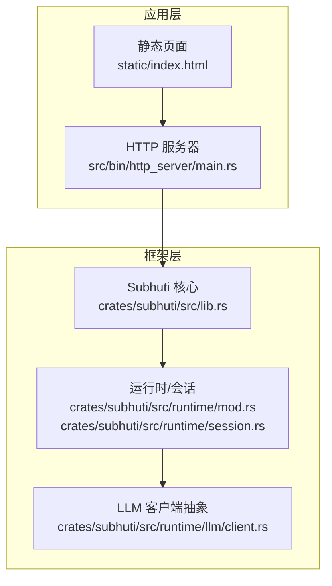
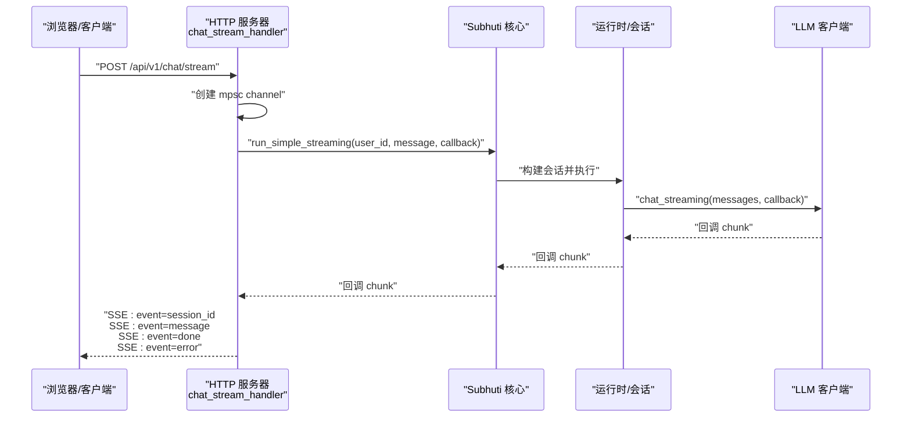
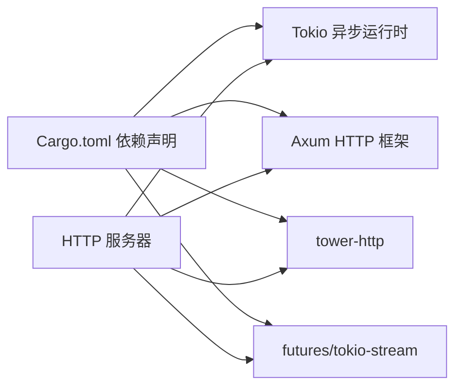

# WebSocket 支持

<cite>
**本文引用的文件**
- [lib.rs](file://crates/subhuti/src/lib.rs)
- [main.rs](file://src/bin/http_server/main.rs)
- [session.rs](file://crates/subhuti/src/runtime/session.rs)
- [runtime/mod.rs](file://crates/subhuti/src/runtime/mod.rs)
- [client.rs](file://crates/subhuti/src/runtime/llm/client.rs)
- [Cargo.toml](file://Cargo.toml)
- [index.html](file://static/index.html)
</cite>

## 目录
1. [简介](#简介)
2. [项目结构](#项目结构)
3. [核心组件](#核心组件)
4. [架构总览](#架构总览)
5. [详细组件分析](#详细组件分析)
6. [依赖关系分析](#依赖关系分析)
7. [性能考量](#性能考量)
8. [故障排查指南](#故障排查指南)
9. [结论](#结论)
10. [附录](#附录)

## 简介
本文件面向 Subhuti 框架的实时通信能力，重点说明当前实现中的“Server-Sent Events（SSE）”流式输出机制，并基于现有代码梳理其事件模型、消息格式与客户端交互方式。由于仓库中未发现 WebSocket 相关实现，本文将明确指出现状，并给出与 SSE 的差异对比、迁移建议以及最佳实践。

## 项目结构
- 框架核心位于 crates/subhuti，提供运行时、会话、LLM 抽象与技能系统。
- HTTP 服务器位于 src/bin/http_server，提供 REST API 与 SSE 流式输出。
- 客户端测试页面位于 static/index.html，演示如何通过浏览器发起请求与接收事件。

图示来源
- [main.rs:1-1460](file://src/bin/http_server/main.rs#L1-L1460)
- [lib.rs:1-1009](file://crates/subhuti/src/lib.rs#L1-L1009)
- [runtime/mod.rs:1-277](file://crates/subhuti/src/runtime/mod.rs#L1-L277)
- [session.rs:1-315](file://crates/subhuti/src/runtime/session.rs#L1-L315)
- [client.rs:1-1046](file://crates/subhuti/src/runtime/llm/client.rs#L1-L1046)

章节来源
- [main.rs:1-1460](file://src/bin/http_server/main.rs#L1-L1460)
- [lib.rs:1-1009](file://crates/subhuti/src/lib.rs#L1-L1009)

## 核心组件
- Subhuti 主体：统一配置、运行时、记忆与技能管理。
- 运行时 Runtime：LLM 抽象、工具系统、约束与会话管理。
- 会话 Session：消息滑动窗口、元数据与状态。
- HTTP 服务器：REST API 与 SSE 流式输出。
- 客户端页面：演示请求与事件消费。

章节来源
- [lib.rs:84-107](file://crates/subhuti/src/lib.rs#L84-L107)
- [runtime/mod.rs:57-72](file://crates/subhuti/src/runtime/mod.rs#L57-L72)
- [session.rs:67-90](file://crates/subhuti/src/runtime/session.rs#L67-L90)
- [main.rs:364-385](file://src/bin/http_server/main.rs#L364-L385)

## 架构总览
Subhuti 的实时通信采用 SSE（Server-Sent Events）实现，而非 WebSocket。SSE 以“服务器到客户端”的单向推送为核心，适合流式输出场景；而 WebSocket 提供双向通信，适用于需要客户端主动推送的场景。下图展示了 SSE 在 HTTP 服务器中的处理流程：

图示来源
- [main.rs:487-551](file://src/bin/http_server/main.rs#L487-L551)
- [runtime/mod.rs:176-195](file://crates/subhuti/src/runtime/mod.rs#L176-L195)
- [client.rs:218-227](file://crates/subhuti/src/runtime/llm/client.rs#L218-L227)

## 详细组件分析

### SSE 事件模型与消息格式
- 事件类型
  - session_id：首次发送，携带会话标识（session_id）。
  - message：流式输出的数据块。
  - done：结束信号，表示流式输出完成。
  - error：错误信号，携带错误信息。
- 数据格式
  - 每个事件以“event: 类型”和“data: 数据”两行组成，末尾以空行分隔。
  - done 事件 data 为布尔值；error 事件 data 为错误字符串；message 事件 data 为增量文本片段。
- 顺序与语义
  - 首先发送 session_id 事件，随后发送若干 message 事件，最后发送 done 或 error 事件之一。

章节来源
- [main.rs:521-551](file://src/bin/http_server/main.rs#L521-L551)

### 会话与消息上下文
- 会话 Session
  - 维护消息滑动窗口、系统提示词、状态与元数据。
  - 支持添加用户/助手消息、工具消息与对话对归档。
- 上下文生成
  - to_context() 返回系统提示词 + 历史消息，供 LLM 调用。

章节来源
- [session.rs:67-90](file://crates/subhuti/src/runtime/session.rs#L67-L90)
- [session.rs:275-292](file://crates/subhuti/src/runtime/session.rs#L275-L292)

### 运行时与 LLM 抽象
- 运行时 Runtime
  - 提供 call_llm_streaming 接口，支持回调式增量输出。
  - 支持工具调用与令牌统计（在非流式场景）。
- LLM 客户端
  - OpenAI/Ollama/Doubao 客户端均实现 chat_streaming 接口（当前简化为同步一次性输出）。
  - SSE 由 HTTP 层负责将增量回调转为 SSE 事件。

章节来源
- [runtime/mod.rs:176-195](file://crates/subhuti/src/runtime/mod.rs#L176-L195)
- [client.rs:218-227](file://crates/subhuti/src/runtime/llm/client.rs#L218-L227)
- [client.rs:359-368](file://crates/subhuti/src/runtime/llm/client.rs#L359-L368)
- [client.rs:770-778](file://crates/subhuti/src/runtime/llm/client.rs#L770-L778)

### HTTP 服务器与 SSE 实现
- chat_stream_handler
  - 创建 mpsc channel，启动后台任务执行 run_simple_streaming。
  - 将 channel 接收端转换为流，映射为 SSE 事件。
  - 首次发送 session_id 事件，后续发送 message、done、error 事件。
- 健康检查与其它 API
  - 提供健康检查、专家与心灵层相关接口，便于调试与监控。

章节来源
- [main.rs:487-551](file://src/bin/http_server/main.rs#L487-L551)

### 客户端交互与页面演示
- static/index.html
  - 提供 API 测试台，包含 SSE 请求示例与事件解析逻辑。
  - 展示如何监听 session_id/message/done/error 事件并渲染输出。

章节来源
- [index.html:760-800](file://static/index.html#L760-L800)

## 依赖关系分析
- 语言与运行时
  - 使用 Tokio 异步运行时，SSE 依赖 tokio-stream 与 futures。
- HTTP 框架
  - 使用 Axum，配合 tower-http 提供 CORS、日志与服务。
- SSE 通道
  - mpsc channel 作为生产者/消费者桥接，将增量回调转为事件流。

图示来源
- [Cargo.toml:25-58](file://Cargo.toml#L25-L58)
- [main.rs:18-47](file://src/bin/http_server/main.rs#L18-L47)

章节来源
- [Cargo.toml:25-58](file://Cargo.toml#L25-L58)

## 性能考量
- SSE 优势
  - 单工推送，实现简单，资源占用低，适合流式输出。
  - 与 HTTP/1.1 兼容，部署与代理友好。
- 性能要点
  - 控制回调频率与消息大小，避免过多小块导致网络开销。
  - 合理设置缓冲区与背压，防止内存膨胀。
  - 对于高并发场景，考虑连接池与限流策略。

## 故障排查指南
- 常见问题
  - SSE 未收到事件：确认请求路径正确、Content-Type 为 text/event-stream、未被代理或浏览器缓存拦截。
  - session_id 未出现：检查后台任务是否成功启动与 channel 是否阻塞。
  - done 与 error 事件冲突：确保只发送一个结束事件；错误时优先发送 error。
- 日志与追踪
  - 服务器端打印请求与耗时，便于定位问题。
  - 使用健康检查与 Trace 接口辅助诊断。

章节来源
- [main.rs:487-551](file://src/bin/http_server/main.rs#L487-L551)

## 结论
- 现状：Subhuti 当前采用 SSE 实现流式输出，事件模型清晰，易于集成与维护。
- 适用场景：SSE 适合“服务器驱动”的流式输出，如对话增量、工具调用结果拼接等。
- 迁移建议：若需引入 WebSocket（如需要客户端主动推送、多路复用等），可在现有运行时之上新增 WebSocket 路由与连接管理，保持事件模型一致，复用会话与 LLM 抽象。

## 附录

### 与 SSE 的区别与适用场景
- SSE
  - 单工推送，适合服务器到客户端的流式输出。
  - 与 HTTP 兼容，部署简单，适合对话增量、日志流等。
- WebSocket
  - 双工通信，适合需要客户端主动推送、实时交互、多路复用的场景。
  - 需要额外的握手、心跳与断线重连机制。

章节来源
- [main.rs:9-16](file://src/bin/http_server/main.rs#L9-L16)

### 客户端连接示例（基于现有 SSE）
- 使用 fetch + EventSource 监听事件
  - 首先监听 session_id，获取会话标识；
  - 连续监听 message，拼接增量文本；
  - 监听 done 或 error，结束或处理错误。
- 页面示例
  - static/index.html 提供了 SSE 请求与事件解析的前端示例，可直接参考。

章节来源
- [index.html:760-800](file://static/index.html#L760-L800)