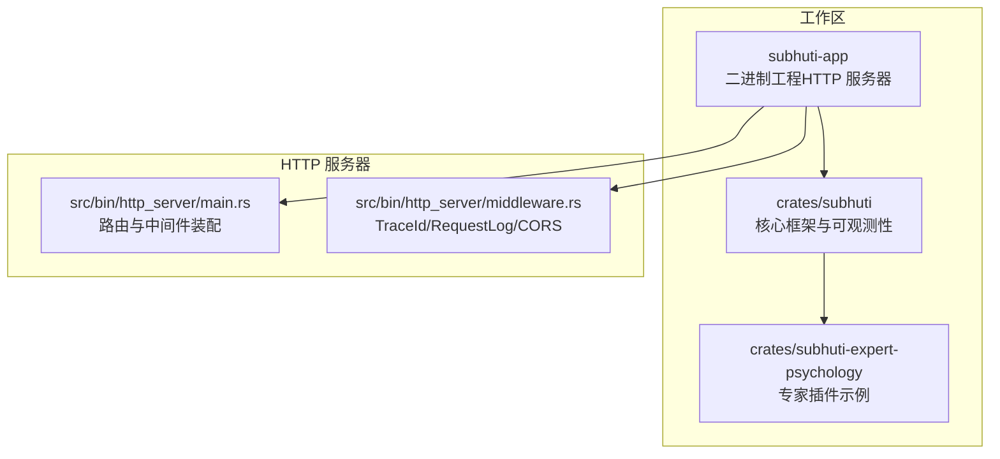
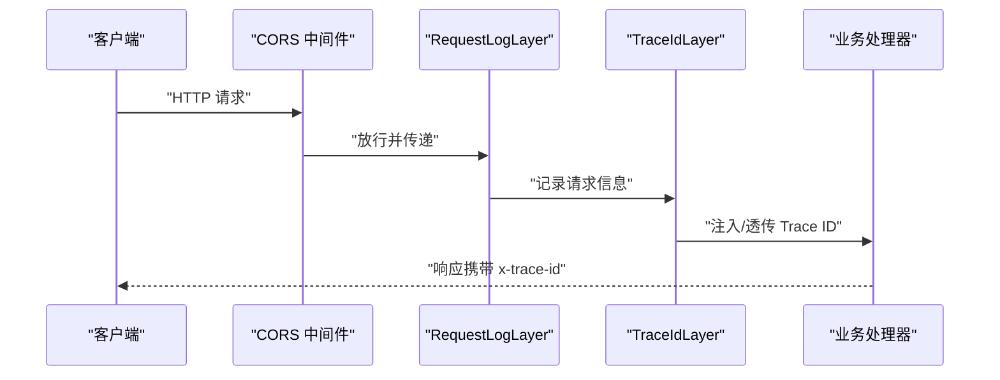
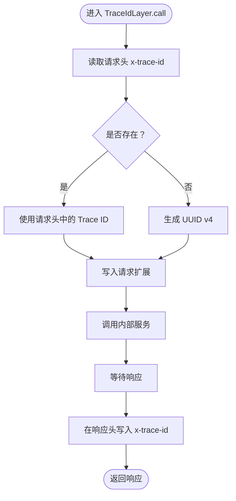
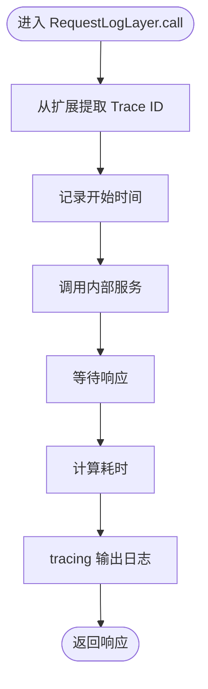
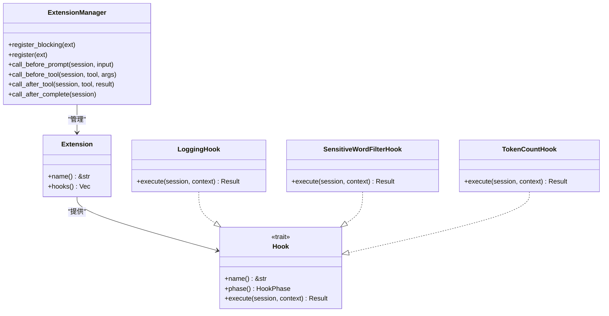
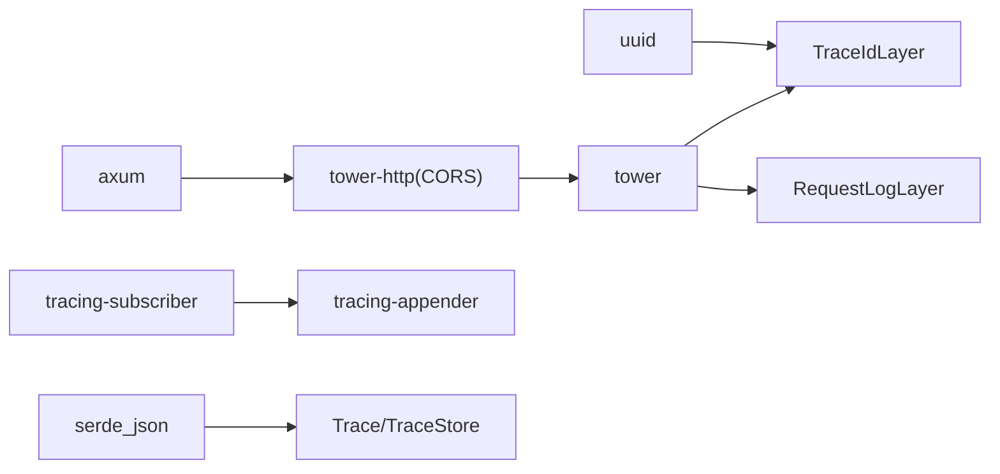

# 中间件系统

<cite>
**本文引用的文件**
- [middleware.rs](file://src/bin/http_server/middleware.rs)
- [main.rs](file://src/bin/http_server/main.rs)
- [lib.rs](file://crates/subhuti/src/lib.rs)
- [mod.rs](file://crates/subhuti/src/extension/mod.rs)
- [trace.rs](file://crates/subhuti/src/observe/trace.rs)
- [Cargo.toml](file://Cargo.toml)
- [debug.rs](file://crates/subhuti/src/debug.rs)
</cite>

## 目录
1. [简介](#简介)
2. [项目结构](#项目结构)
3. [核心组件](#核心组件)
4. [架构总览](#架构总览)
5. [详细组件分析](#详细组件分析)
6. [依赖分析](#依赖分析)
7. [性能考量](#性能考量)
8. [故障排查指南](#故障排查指南)
9. [结论](#结论)
10. [附录](#附录)

## 简介
本文件系统化阐述 Subhuti 的中间件体系，重点覆盖 HTTP 层中间件（TraceIdLayer、RequestLogLayer）、CORS 配置策略、扩展钩子（Extension/Hook）在“认证授权”和“性能监控”方面的应用思路，以及中间件链的执行顺序、错误处理与性能影响评估。文档同时提供注册与配置方法、自定义中间件开发指南、生产环境安全与性能优化最佳实践。

## 项目结构
Subhuti 采用多 crate 工作区组织，HTTP 服务器位于 workspace 根目录的二进制工程中，核心逻辑与可观测性能力集中在 crates/subhuti 下。HTTP 服务器通过 axum + tower/tower-http 实现中间件链，结合扩展钩子（Extension/Hook）实现更细粒度的横切关注点。

图示来源
- [Cargo.toml:1-58](file://Cargo.toml#L1-L58)
- [main.rs:1-200](file://src/bin/http_server/main.rs#L1-L200)
- [middleware.rs:1-223](file://src/bin/http_server/middleware.rs#L1-223)

章节来源
- [Cargo.toml:1-58](file://Cargo.toml#L1-L58)
- [main.rs:1-200](file://src/bin/http_server/main.rs#L1-L200)

## 核心组件
- TraceIdLayer：为每个请求注入/透传 Trace ID，贯穿请求生命周期，便于日志与追踪关联。
- RequestLogLayer：记录请求方法、路径、状态码、耗时与 Trace ID，统一输出到控制台与文件。
- CORS：基于 tower-http 的 CORS 中间件，提供跨域白名单与方法/头部允许策略。
- 扩展钩子（Extension/Hook）：在 Agent 执行链路中插入日志、敏感词过滤、Token 统计等横切逻辑，实现“认证授权”与“性能监控”的可插拔能力。

章节来源
- [middleware.rs:15-172](file://src/bin/http_server/middleware.rs#L15-172)
- [main.rs:1432-1443](file://src/bin/http_server/main.rs#L1432-L1443)
- [mod.rs:1-438](file://crates/subhuti/src/extension/mod.rs#L1-L438)

## 架构总览
HTTP 请求在进入业务处理器之前，依次经过 CORS → RequestLogLayer → TraceIdLayer 的中间件链。扩展钩子（Extension/Hook）在 Agent 执行链路中按阶段触发，二者共同构成“网络层中间件 + 框架层钩子”的双层横切体系。

图示来源
- [main.rs:1432-1443](file://src/bin/http_server/main.rs#L1432-L1443)
- [middleware.rs:15-172](file://src/bin/http_server/middleware.rs#L15-172)

## 详细组件分析

### TraceIdLayer：分布式追踪标识
- 设计理念
  - 若请求头携带 x-trace-id，则透传；否则生成新的 UUID v4。
  - 将 Trace ID 写入请求扩展（Request Extensions），便于后续中间件与业务逻辑读取。
  - 在响应头中回写 x-trace-id，便于客户端与下游系统关联。
- 关键行为
  - 读取/生成 Trace ID
  - 写入请求扩展
  - 调用内部服务
  - 在响应阶段追加 x-trace-id
- 与可观测性的关系
  - 与 observe/trace.rs 的 TraceId 类型一致，形成端到端追踪闭环。

图示来源
- [middleware.rs:53-81](file://src/bin/http_server/middleware.rs#L53-L81)

章节来源
- [middleware.rs:15-86](file://src/bin/http_server/middleware.rs#L15-86)
- [trace.rs:24-42](file://crates/subhuti/src/observe/trace.rs#L24-L42)

### RequestLogLayer：请求日志记录
- 设计理念
  - 记录请求方法、路径、状态码、耗时与 Trace ID。
  - 使用 tracing 输出到控制台与文件，支持 JSON 格式与目标标签。
- 关键行为
  - 从请求扩展提取 Trace ID。
  - 记录开始时间，调用内部服务。
  - 异步等待响应，计算耗时并输出日志。
- 日志初始化
  - init_logging：同时输出到控制台与文件，控制台简洁、文件 JSON 详细，返回 guard 以保证日志不丢失。

图示来源
- [middleware.rs:135-171](file://src/bin/http_server/middleware.rs#L135-L171)
- [middleware.rs:174-222](file://src/bin/http_server/middleware.rs#L174-L222)

章节来源
- [middleware.rs:96-172](file://src/bin/http_server/middleware.rs#L96-172)
- [middleware.rs:174-222](file://src/bin/http_server/middleware.rs#L174-222)

### CORS 配置策略
- 策略要点
  - 使用 tower-http 的 CorsLayer，默认允许任意来源、方法与头部。
  - 生产环境建议收紧 allow_origin、allow_methods、allow_headers，避免全开放风险。
- 配置位置
  - 在中间件链中注册 CORS 中间件，位于最外层，先于日志与追踪处理。

章节来源
- [main.rs:1432-1443](file://src/bin/http_server/main.rs#L1432-L1443)

### 扩展钩子（Extension/Hook）：认证授权与性能监控
- 钩子阶段
  - before_prompt：上下文预处理、裁剪、敏感词过滤等。
  - before_tool / after_tool：工具校验、日志、结果摘要。
  - after_complete：自动归档记忆、总结。
- 认证授权思路
  - 在 before_prompt 阶段进行用户身份校验与权限判定，必要时阻断请求。
  - 可结合外部鉴权服务或本地规则，失败时返回错误，阻止后续流程。
- 性能监控思路
  - 在 before_prompt 与 after_complete 阶段统计消息条数、字符数与 Token 估算，输出到日志或指标系统。
  - 结合调试工具（Profiler）记录关键步骤耗时，辅助定位瓶颈。
- 内置钩子
  - LoggingHook：记录各阶段输入/输出概要。
  - SensitiveWordFilterHook：敏感词过滤，命中即报错。
  - TokenCountHook：粗略估算 Token 数量并记录。

图示来源
- [mod.rs:102-227](file://crates/subhuti/src/extension/mod.rs#L102-L227)
- [mod.rs:237-368](file://crates/subhuti/src/extension/mod.rs#L237-L368)

章节来源
- [mod.rs:1-438](file://crates/subhuti/src/extension/mod.rs#L1-L438)
- [debug.rs:298-344](file://crates/subhuti/src/debug.rs#L298-L344)

### 中间件链执行顺序与控制流
- 注册顺序（从内到外）：CORS → RequestLogLayer → TraceIdLayer → 业务处理器
- 执行顺序（从外到内）：TraceIdLayer → RequestLogLayer → CORS
- 优点
  - TraceIdLayer 最先生成/透传 ID，RequestLogLayer 可稳定获取 Trace ID。
  - CORS 先处理跨域，减少不必要的后续开销。
- 错误处理
  - 中间件链中任一环节抛错，将中断后续处理，返回错误响应。
  - 建议在关键中间件中捕获异常并返回标准化错误。

章节来源
- [main.rs:1432-1443](file://src/bin/http_server/main.rs#L1432-L1443)
- [middleware.rs:15-172](file://src/bin/http_server/middleware.rs#L15-172)

### 自定义中间件开发指南
- 基本要求
  - 实现 Tower 的 Layer 与 Service trait，遵循 poll_ready 与 call 的异步契约。
  - 在 call 中先处理请求（如读取/写入扩展），再调用内部服务，最后处理响应（如写入响应头）。
- 示例步骤
  - 定义 Layer 与 Service 结构体
  - 在 Layer::layer 中构造 Service
  - 在 Service::call 中实现请求/响应处理
  - 在 main.rs 中按需注册到 Router
- 注意事项
  - 保持 Send + 'static 约束，避免跨线程问题。
  - 对响应头写入使用 HeaderName/HeaderValue，避免非法值。
  - 使用 tracing 记录关键事件，便于运维审计。

章节来源
- [middleware.rs:24-81](file://src/bin/http_server/middleware.rs#L24-81)
- [middleware.rs:106-171](file://src/bin/http_server/middleware.rs#L106-171)

## 依赖分析
- 运行时依赖
  - axum、tower、tower-http：HTTP 服务器与中间件基础设施。
  - tracing/tracing-subscriber/tracing-appender：结构化日志与文件滚动。
  - uuid：Trace ID 生成。
  - serde/serde_json：序列化日志与可观测数据。
- 组件耦合
  - HTTP 中间件与扩展钩子解耦：前者负责网络层横切，后者负责业务执行链横切。
  - TraceIdLayer 与 RequestLogLayer 通过扩展与响应头协同，形成端到端追踪。

图示来源
- [Cargo.toml:25-58](file://Cargo.toml#L25-L58)
- [middleware.rs:6-13](file://src/bin/http_server/middleware.rs#L6-13)
- [trace.rs:1-25](file://crates/subhuti/src/observe/trace.rs#L1-L25)

章节来源
- [Cargo.toml:25-58](file://Cargo.toml#L25-L58)

## 性能考量
- 中间件开销
  - TraceIdLayer：轻量，仅读取/生成 UUID、写扩展与响应头。
  - RequestLogLayer：轻量，主要为日志输出与时间计算。
  - CORS：简单策略下开销极低；复杂策略（正则/动态 Origin）可能增加 CPU。
- 观测与分析
  - 使用 Profiler 记录关键步骤耗时，定期输出报表。
  - 结合 TokenCountHook 估算 Token 消耗，辅助成本控制。
- 优化建议
  - 生产关闭冗余日志，仅保留 info 及以上级别。
  - 将日志写入与文件落盘分离，避免阻塞请求处理。
  - 合理设置 CORS 白名单，避免每请求重复计算 Origin。

章节来源
- [debug.rs:298-344](file://crates/subhuti/src/debug.rs#L298-L344)
- [mod.rs:322-368](file://crates/subhuti/src/extension/mod.rs#L322-L368)

## 故障排查指南
- Trace ID 缺失
  - 检查中间件注册顺序，确认 TraceIdLayer 在最外层。
  - 确认响应头是否包含 x-trace-id。
- 日志缺失
  - 确认 init_logging 返回的 guard 在进程生命周期内有效。
  - 检查日志级别与过滤器配置。
- CORS 失败
  - 核对 allow_origin/allow_methods/allow_headers 配置。
  - 检查预检请求（OPTIONS）是否被正确放行。
- 钩子阻断请求
  - 检查 SensitiveWordFilterHook 等钩子是否误判。
  - 在 before_prompt 阶段加入调试日志，定位具体钩子。

章节来源
- [middleware.rs:174-222](file://src/bin/http_server/middleware.rs#L174-222)
- [main.rs:1432-1443](file://src/bin/http_server/main.rs#L1432-L1443)
- [mod.rs:287-320](file://crates/subhuti/src/extension/mod.rs#L287-L320)

## 结论
Subhuti 的中间件系统以 Tower 为基础，结合扩展钩子，实现了“网络层中间件 + 框架层钩子”的双层横切能力。TraceIdLayer 与 RequestLogLayer 提供了稳定的追踪与日志能力，CORS 保障跨域安全。通过扩展钩子，认证授权与性能监控等横切需求可灵活插拔。生产环境中建议收紧 CORS、优化日志级别与落盘策略，并结合 Profiler 与 Token 统计持续优化性能与成本。

## 附录

### 中间件注册与配置方法
- 在 main.rs 中注册中间件链（从内到外，执行顺序从外到内）
  - CORS → RequestLogLayer → TraceIdLayer
- 初始化日志
  - 调用 init_logging，确保 guard 生命周期覆盖整个进程
- 扩展钩子注册
  - 通过 ExtensionManager.register 或 register_blocking 注册 Extension
  - Extension 会自动将其 Hook 按阶段分组并执行

章节来源
- [main.rs:1432-1443](file://src/bin/http_server/main.rs#L1432-L1443)
- [middleware.rs:174-222](file://src/bin/http_server/middleware.rs#L174-222)
- [mod.rs:125-172](file://crates/subhuti/src/extension/mod.rs#L125-L172)

### CORS 配置示例（生产建议）
- 仅允许特定来源、方法与头部
- 严格限制预检请求缓存时间
- 对敏感接口开启鉴权钩子（before_prompt）

章节来源
- [main.rs:1432-1443](file://src/bin/http_server/main.rs#L1432-L1443)
- [mod.rs:287-320](file://crates/subhuti/src/extension/mod.rs#L287-L320)

### 认证授权中间件实现思路
- 在 before_prompt 阶段进行鉴权与授权校验
- 通过 Hook 抛错或返回错误响应，阻断后续流程
- 对失败场景记录详细日志，便于审计

章节来源
- [mod.rs:301-320](file://crates/subhuti/src/extension/mod.rs#L301-L320)

### 性能监控中间件作用
- 使用 TokenCountHook 估算 Token 消耗
- 使用 Profiler 记录关键步骤耗时
- 结合 RequestLogLayer 输出的耗时指标进行趋势分析

章节来源
- [mod.rs:322-368](file://crates/subhuti/src/extension/mod.rs#L322-L368)
- [debug.rs:298-344](file://crates/subhuti/src/debug.rs#L298-L344)