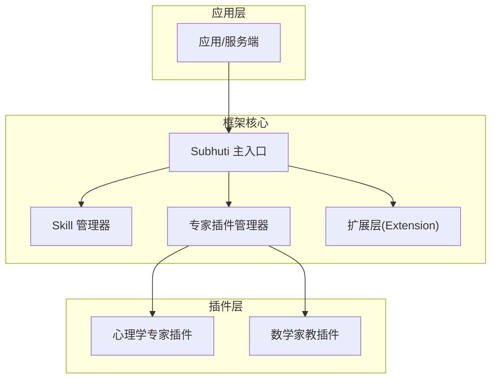
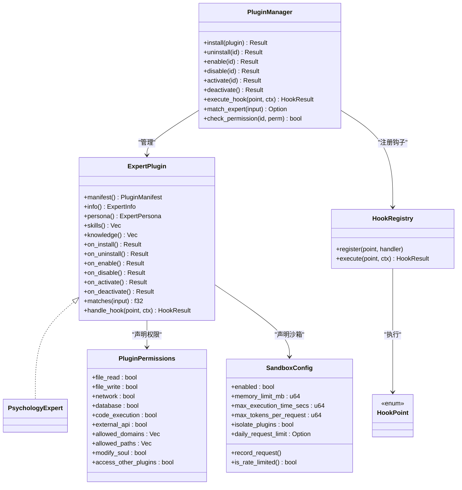
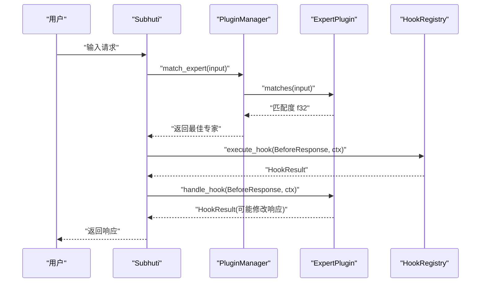
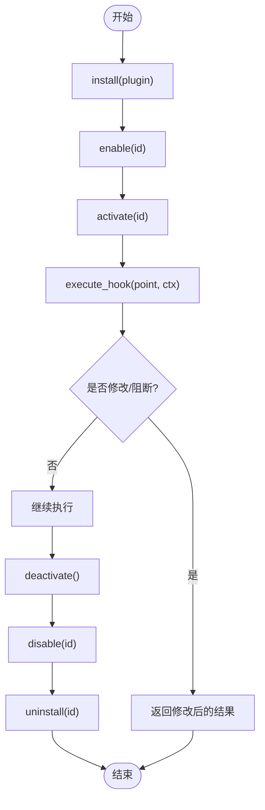
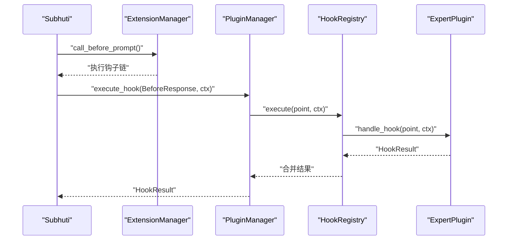
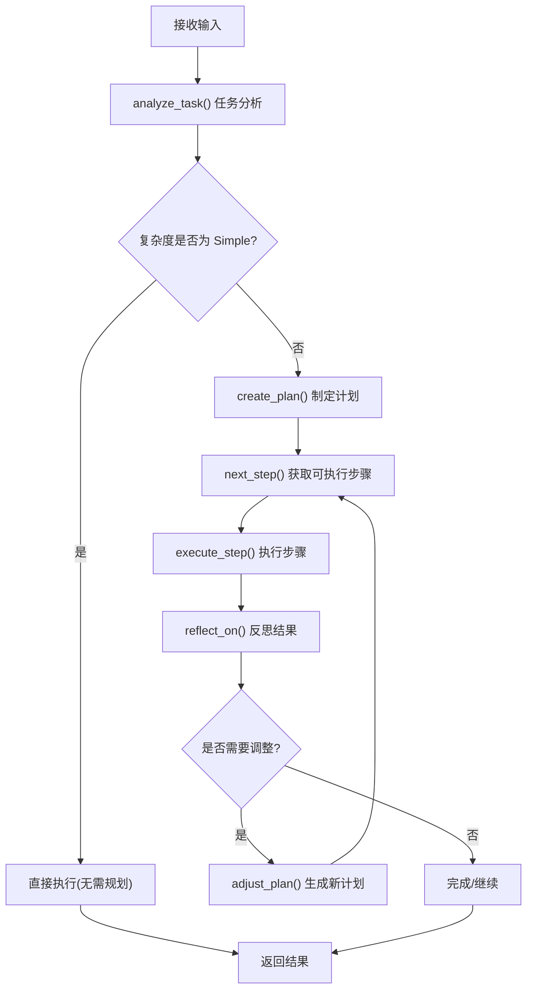
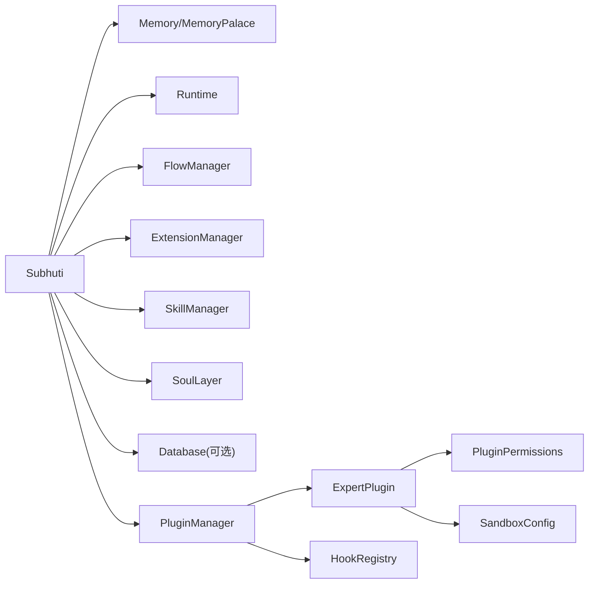

# 专家插件系统

<cite>
**本文引用的文件**
- [lib.rs](file://crates/subhuti/src/lib.rs)
- [expert/mod.rs](file://crates/subhuti/src/expert/mod.rs)
- [planning.rs](file://crates/subhuti/src/expert/planning.rs)
- [extension/mod.rs](file://crates/subhuti/src/extension/mod.rs)
- [skill/mod.rs](file://crates/subhuti/src/skill/mod.rs)
- [lib.rs](file://crates/subhuti-expert-psychology/src/lib.rs)
- [integration_test.rs](file://crates/subhuti/tests/integration_test.rs)
- [API_TUTORIAL.md](file://docs/API_TUTORIAL.md)
- [persona.json](file://crates/subhuti/data/persona.json)
</cite>

## 目录
1. [简介](#简介)
2. [项目结构](#项目结构)
3. [核心组件](#核心组件)
4. [架构总览](#架构总览)
5. [详细组件分析](#详细组件分析)
6. [依赖分析](#依赖分析)
7. [性能考量](#性能考量)
8. [故障排除指南](#故障排除指南)
9. [结论](#结论)
10. [附录](#附录)

## 简介
本指南面向希望基于 Subhuti 框架开发“专家插件”的开发者，系统讲解 ExpertPlugin trait 的设计接口与实现规范，涵盖插件生命周期管理、权限控制系统、钩子机制（Hooks）、插件管理器（PluginManager）的工作原理（发现、加载、卸载、状态监控），以及专家自主规划能力（Autonomous Planning）的实现机制（目标设定、行动计划、执行监控、结果评估）。同时提供权限控制的安全策略（API 访问控制、资源限制、沙箱隔离），并给出完整的插件开发示例（插件模板、Manifest 清单配置、钩子使用方法、调试技巧），最后总结专家插件生态系统的扩展策略与最佳实践。

## 项目结构
Subhuti 采用“四层架构”：Memory Layer、Runtime Layer、Flow Layer、Extension Layer。专家插件系统位于扩展层之上，通过 ExpertPlugin trait 与框架深度集成，借助 PluginManager 实现插件的全生命周期管理，并通过 Hook 系统在核心流程中注入自定义逻辑。

图表来源
- [lib.rs:84-156](file://crates/subhuti/src/lib.rs#L84-L156)
- [expert/mod.rs:767-802](file://crates/subhuti/src/expert/mod.rs#L767-L802)
- [extension/mod.rs:112-123](file://crates/subhuti/src/extension/mod.rs#L112-L123)

章节来源
- [lib.rs:22-46](file://crates/subhuti/src/lib.rs#L22-L46)
- [lib.rs:84-156](file://crates/subhuti/src/lib.rs#L84-L156)

## 核心组件
- ExpertPlugin trait：定义专家插件的清单、角色、技能、知识库、生命周期钩子与行为钩子。
- PluginManager：负责插件的安装、启用、激活、停用、卸载、状态监控与钩子注册。
- Hook 系统：在请求生命周期的关键节点（如 BeforeResponse、AfterSkillExecute 等）插入自定义逻辑。
- ExpertPlanning trait：专家的自主规划能力抽象，支持任务分析、执行计划、步骤执行与反思调整。
- 权限与沙箱：通过 PluginPermissions 与 SandboxConfig 控制插件的资源使用与访问边界。
- 心灵层（SoulLayer）与记忆系统：专家激活时注入 persona、技能与知识库，影响后续交互。

章节来源
- [expert/mod.rs:664-760](file://crates/subhuti/src/expert/mod.rs#L664-L760)
- [expert/mod.rs:767-802](file://crates/subhuti/src/expert/mod.rs#L767-L802)
- [expert/mod.rs:353-491](file://crates/subhuti/src/expert/mod.rs#L353-L491)
- [planning.rs:414-469](file://crates/subhuti/src/expert/planning.rs#L414-L469)
- [extension/mod.rs:29-53](file://crates/subhuti/src/extension/mod.rs#L29-L53)

## 架构总览
专家插件系统围绕 ExpertPlugin 与 PluginManager 构建，结合 Hook 系统与权限/沙箱控制，形成可插拔、可治理、可扩展的专家生态。

图表来源
- [expert/mod.rs:664-760](file://crates/subhuti/src/expert/mod.rs#L664-L760)
- [expert/mod.rs:767-802](file://crates/subhuti/src/expert/mod.rs#L767-L802)
- [expert/mod.rs:497-546](file://crates/subhuti/src/expert/mod.rs#L497-L546)
- [expert/mod.rs:225-290](file://crates/subhuti/src/expert/mod.rs#L225-L290)
- [expert/mod.rs:295-347](file://crates/subhuti/src/expert/mod.rs#L295-L347)
- [lib.rs:39-193](file://crates/subhuti-expert-psychology/src/lib.rs#L39-L193)

## 详细组件分析

### ExpertPlugin 接口与实现规范
- 清单与角色：通过 manifest() 返回 PluginManifest，包含 id、name、version、permissions、hooks、sandbox 等；persona() 返回 ExpertPersona，定义专家的性格、系统提示词与专长领域。
- 技能与知识：skills() 返回专家自带的技能集合；knowledge() 返回知识库条目，激活时注入到记忆系统与心灵宫殿。
- 生命周期钩子：on_install/on_uninstall/on_enable/on_disable/on_activate/on_deactivate，用于插件安装、启用、激活、停用、卸载时的初始化与清理。
- 行为钩子：handle_hook(point, ctx) 用于在 HookPoint 触发时执行自定义逻辑；matches(input) 用于自动匹配专家。

图表来源
- [expert/mod.rs:1033-1036](file://crates/subhuti/src/expert/mod.rs#L1033-L1036)
- [expert/mod.rs:1070-1094](file://crates/subhuti/src/expert/mod.rs#L1070-L1094)
- [expert/mod.rs:754-759](file://crates/subhuti/src/expert/mod.rs#L754-L759)

章节来源
- [expert/mod.rs:664-760](file://crates/subhuti/src/expert/mod.rs#L664-L760)
- [expert/mod.rs:1070-1094](file://crates/subhuti/src/expert/mod.rs#L1070-L1094)
- [expert/mod.rs:1033-1036](file://crates/subhuti/src/expert/mod.rs#L1033-L1036)

### PluginManager 工作原理
- 插件注册：install() 将插件加入管理器，记录状态与元数据；enable() 注册钩子处理器；activate() 注册技能、更新状态并记录沙箱请求。
- 状态机：Installed → Enabled → Activated → Enabled → Disabled → Installed/uninstalled；状态变更伴随钩子回调。
- 权限与沙箱：在 activate() 时检查 SandboxConfig 的每日限额与启用状态；check_permission() 用于权限查询。
- 钩子执行：execute_hook() 委托 HookRegistry 执行链式处理，支持阻断与修改。

图表来源
- [expert/mod.rs:812-834](file://crates/subhuti/src/expert/mod.rs#L812-L834)
- [expert/mod.rs:859-908](file://crates/subhuti/src/expert/mod.rs#L859-L908)
- [expert/mod.rs:939-992](file://crates/subhuti/src/expert/mod.rs#L939-L992)
- [expert/mod.rs:1033-1036](file://crates/subhuti/src/expert/mod.rs#L1033-L1036)

章节来源
- [expert/mod.rs:804-1116](file://crates/subhuti/src/expert/mod.rs#L804-L1116)

### 钩子系统（Hooks）
- 钩子点：BeforeRequest、BeforeSkillMatch、BeforeSkillExecute、AfterSkillExecute、BeforeLlmCall、AfterLlmCall、BeforeResponse、AfterResponse、BeforeMemorySearch、AfterMemorySearch、BeforeToolCall、AfterToolCall、OnExpertSwitch。
- 钩子上下文：包含 request_id、user_id、session_id、input、current_expert、timestamp 等。
- 执行结果：HookResult 支持 should_continue、modified_input、modified_response、extra_data、error。
- 扩展层钩子：Extension/ExtensionManager 提供 before_prompt、before_tool、after_tool、after_complete 等生命周期钩子，与专家插件钩子互补。

图表来源
- [extension/mod.rs:174-226](file://crates/subhuti/src/extension/mod.rs#L174-L226)
- [expert/mod.rs:1033-1036](file://crates/subhuti/src/expert/mod.rs#L1033-L1036)

章节来源
- [extension/mod.rs:29-100](file://crates/subhuti/src/extension/mod.rs#L29-L100)
- [extension/mod.rs:174-226](file://crates/subhuti/src/extension/mod.rs#L174-L226)
- [expert/mod.rs:353-491](file://crates/subhuti/src/expert/mod.rs#L353-L491)

### 专家自主规划能力（Autonomous Planning）
- 任务分析：ExpertPlanning.analyze_task() 将用户输入转化为 TaskAnalysis，包含任务类型、复杂度、核心目标、子目标、所需能力、步骤数、是否需要工具/外部信息、优先级与紧急度等。
- 执行计划：create_plan() 生成 ExecutionPlan，包含步骤列表（PlanStep），支持依赖关系、状态跟踪与进度统计。
- 步骤执行：execute_step() 调用 PlanExecutor 执行技能或工具，返回结果。
- 反思调整：reflect_on() 评估执行结果，生成 Reflection，决定是否需要调整计划并生成新步骤。
- 能力开关：needs_planning() 基于复杂度判断是否需要规划。

图表来源
- [planning.rs:414-469](file://crates/subhuti/src/expert/planning.rs#L414-L469)
- [planning.rs:222-347](file://crates/subhuti/src/expert/planning.rs#L222-L347)
- [planning.rs:427-442](file://crates/subhuti/src/expert/planning.rs#L427-L442)

章节来源
- [planning.rs:414-469](file://crates/subhuti/src/expert/planning.rs#L414-L469)
- [planning.rs:222-347](file://crates/subhuti/src/expert/planning.rs#L222-L347)

### 权限控制与沙箱隔离
- 权限声明：PluginPermissions 控制文件读写、网络、数据库、代码执行、外部 API、修改心灵层、访问其他插件等；支持域名与路径白名单。
- 沙箱配置：SandboxConfig 控制内存限制、执行时间、Token 消耗、插件间隔离、每日请求限额；提供 is_rate_limited()/record_request()/reset_daily_counter()。
- 安全策略：activate() 时检查沙箱限额；check_permission() 用于权限查询；钩子可在 BeforeResponse 等节点进行敏感内容拦截与修改。

章节来源
- [expert/mod.rs:225-290](file://crates/subhuti/src/expert/mod.rs#L225-L290)
- [expert/mod.rs:295-347](file://crates/subhuti/src/expert/mod.rs#L295-L347)
- [expert/mod.rs:958-965](file://crates/subhuti/src/expert/mod.rs#L958-L965)
- [expert/mod.rs:1096-1115](file://crates/subhuti/src/expert/mod.rs#L1096-L1115)

### 插件开发示例（心理学专家）
- 插件模板：实现 ExpertPlugin，定义 manifest()、persona()、skills()、knowledge()、生命周期钩子与 handle_hook()。
- Manifest 清单：包含 id、name、description、version、author、category、keywords、permissions、sandbox、hooks、dependencies、min_framework_version 等。
- 钩子使用：在 BeforeResponse 检测心理危机关键词并返回阻断响应。
- 调试技巧：使用 Subhuti 的健康检查与调试工具，验证插件安装、激活与钩子执行效果。

章节来源
- [lib.rs:39-193](file://crates/subhuti-expert-psychology/src/lib.rs#L39-L193)
- [integration_test.rs:348-358](file://crates/subhuti/tests/integration_test.rs#L348-L358)

## 依赖分析
- Subhuti 主入口依赖：Memory、MemoryPalace、Runtime、FlowManager、ExtensionManager、SkillManager、SoulLayer、Database（可选）、PluginManager（专家插件）。
- 专家插件依赖：ExpertPlugin、PluginManager、Hook 系统、权限与沙箱配置。
- 扩展层依赖：Extension trait、Hook trait、HookContext、ExtensionManager。

图表来源
- [lib.rs:84-156](file://crates/subhuti/src/lib.rs#L84-L156)
- [expert/mod.rs:767-802](file://crates/subhuti/src/expert/mod.rs#L767-L802)
- [extension/mod.rs:112-123](file://crates/subhuti/src/extension/mod.rs#L112-L123)

章节来源
- [lib.rs:84-156](file://crates/subhuti/src/lib.rs#L84-L156)

## 性能考量
- 关键字索引优化：SkillManager 使用关键词倒排索引与名称索引，匹配性能接近 O(1)，适合大规模 Skill 场景。
- 插件钩子链：HookRegistry 顺序执行，尽量保持轻量逻辑；必要时在钩子中短路返回以减少开销。
- 沙箱限制：SandboxConfig 的每日限额与资源限制可避免插件滥用导致的性能抖动。
- 记忆与心灵层：MemoryPalace 的分区统计与遗忘机制有助于控制长期记忆规模，降低检索成本。

## 故障排除指南
- 插件状态异常：检查 PluginManager 的状态机转换日志，确认是否处于 Installed/Enabled/Activated 等预期状态。
- 钩子未生效：确认插件在 enable() 时已正确注册钩子；检查 HookPoint 是否匹配。
- 权限拒绝：核对 PluginPermissions 与 SandboxConfig 的配置；在 BeforeResponse 等钩子中检查权限判定逻辑。
- 性能问题：使用 Subhuti 的健康检查与调试工具定位瓶颈；优化关键词索引与钩子链长度。

章节来源
- [integration_test.rs:196-382](file://crates/subhuti/tests/integration_test.rs#L196-L382)
- [lib.rs:562-636](file://crates/subhuti/src/lib.rs#L562-L636)

## 结论
Subhuti 的专家插件系统通过 ExpertPlugin trait 与 PluginManager 实现了完整的生命周期管理与钩子扩展能力，结合权限与沙箱控制，提供了安全可控的专家生态。配合 ExpertPlanning trait，专家可实现自主规划与反思调整，显著提升复杂任务的处理能力。建议在开发中遵循清单配置、最小权限原则与沙箱约束，充分利用钩子系统与调试工具，构建高质量的专家插件。

## 附录

### API 使用示例（专家插件相关）
- 列出专家插件：GET /subhuti/api/v1/experts/list
- 激活专家插件：POST /subhuti/api/v1/experts/activate
- 停用专家插件：POST /subhuti/api/v1/experts/deactivate
- 获取当前活跃专家：GET /subhuti/api/v1/experts/active

章节来源
- [API_TUTORIAL.md:342-491](file://docs/API_TUTORIAL.md#L342-L491)

### 心灵层与记忆系统
- 心灵宫殿统计：GET /subhuti/api/v1/palace/stats
- 记忆搜索：POST /subhuti/api/v1/palace/search
- 执行遗忘周期：POST /subhuti/api/v1/palace/forget
- 人格分区偏好：GET /subhuti/api/v1/soul/persona/zone-bias

章节来源
- [API_TUTORIAL.md:165-340](file://docs/API_TUTORIAL.md#L165-L340)
- [persona.json:1-44](file://crates/subhuti/data/persona.json#L1-L44)