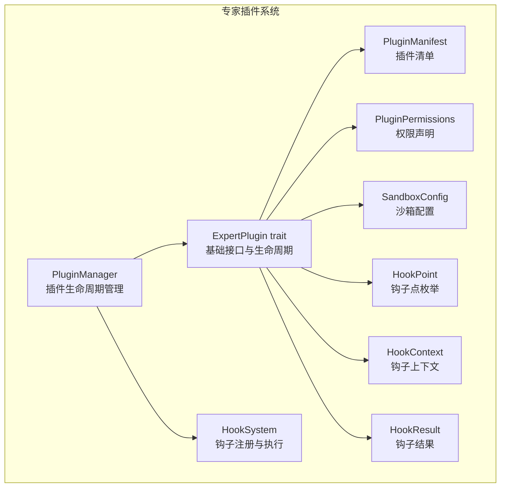
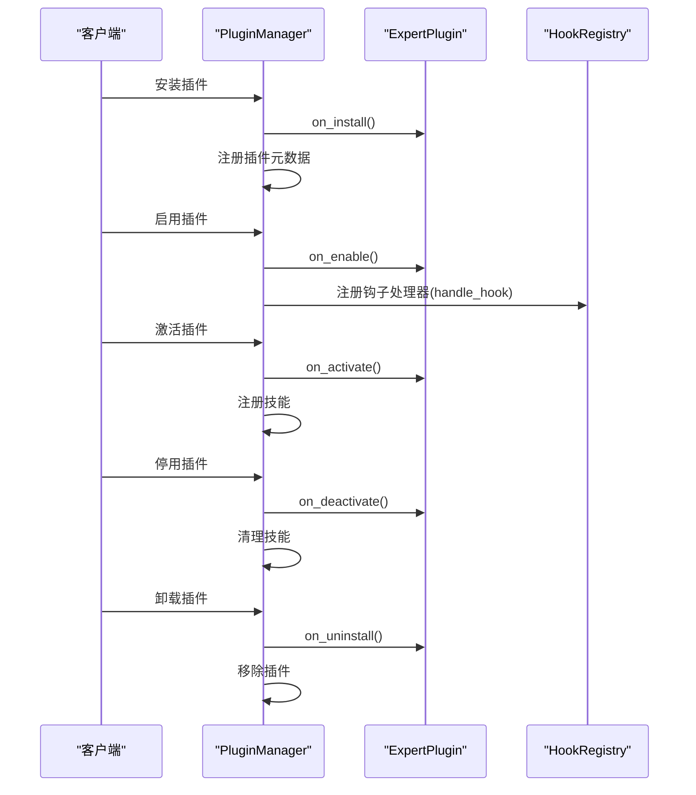
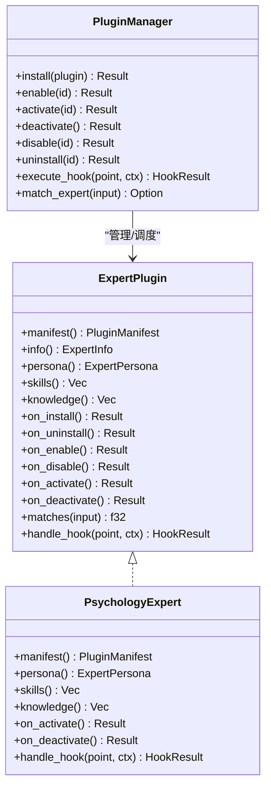

# 插件接口设计

<cite>
**本文引用的文件**
- [crates/subhuti/src/expert/mod.rs](file://crates/subhuti/src/expert/mod.rs)
- [crates/subhuti-expert-psychology/src/lib.rs](file://crates/subhuti-expert-psychology/src/lib.rs)
- [crates/subhuti/tests/test_hook_chain.rs](file://crates/subhuti/tests/test_hook_chain.rs)
- [docs/ARCHITECTURE.md](file://docs/ARCHITECTURE.md)
- [docs/API_TUTORIAL.md](file://docs/API_TUTORIAL.md)
</cite>

## 目录
1. [简介](#简介)
2. [项目结构](#项目结构)
3. [核心组件](#核心组件)
4. [架构总览](#架构总览)
5. [详细组件分析](#详细组件分析)
6. [依赖分析](#依赖分析)
7. [性能考虑](#性能考虑)
8. [故障排除指南](#故障排除指南)
9. [结论](#结论)
10. [附录](#附录)

## 简介
本文件围绕 ExpertPlugin trait 的接口设计进行系统化说明，覆盖基础接口（manifest、info、persona、skills、knowledge）、生命周期钩子（on_install、on_uninstall、on_enable、on_disable、on_activate、on_deactivate）、匹配度计算（matches）与钩子处理（handle_hook）的调用时机与实现要求，并结合实际插件实现示例与测试用例，提供错误处理、状态管理与性能优化建议。

## 项目结构
ExpertPlugin trait 位于专家插件系统模块中，配套包含清单系统、权限与沙箱配置、钩子系统、专家信息与性格、插件状态机、插件管理器等。心理学专家插件作为标准实现示例，展示了如何声明清单、角色、技能、知识库与钩子处理。

图表来源
- [crates/subhuti/src/expert/mod.rs:663-760](file://crates/subhuti/src/expert/mod.rs#L663-L760)
- [crates/subhuti/src/expert/mod.rs:768-1036](file://crates/subhuti/src/expert/mod.rs#L768-L1036)
- [crates/subhuti/src/expert/mod.rs:1070-1094](file://crates/subhuti/src/expert/mod.rs#L1070-L1094)

章节来源
- [crates/subhuti/src/expert/mod.rs:1-1273](file://crates/subhuti/src/expert/mod.rs#L1-L1273)

## 核心组件
- ExpertPlugin trait：定义插件的基础能力与生命周期钩子，提供匹配度计算与钩子处理接口。
- PluginManager：负责插件的安装、启用、激活、停用、卸载与状态转换，注册钩子处理器并将钩子点映射到插件方法。
- HookSystem：钩子注册表与执行链，支持链式执行、短路中断、输入/响应修改与错误传播。
- PluginManifest/Permissions/Sandbox：插件元数据、权限与资源限制声明。
- HookPoint/HookContext/HookResult：钩子点、上下文与结果结构。
- 心理学专家插件：标准实现示例，展示清单、角色、技能、知识库与钩子处理。

章节来源
- [crates/subhuti/src/expert/mod.rs:663-760](file://crates/subhuti/src/expert/mod.rs#L663-L760)
- [crates/subhuti/src/expert/mod.rs:768-1036](file://crates/subhuti/src/expert/mod.rs#L768-L1036)
- [crates/subhuti-expert-psychology/src/lib.rs:39-193](file://crates/subhuti-expert-psychology/src/lib.rs#L39-L193)

## 架构总览
ExpertPlugin trait 将“插件能力”与“生命周期”解耦，通过 PluginManager 实现统一的状态机与钩子调度。心理学专家插件作为具体实现，示范了如何在清单中声明权限、沙箱与钩子，并在激活时注入角色与知识库，在钩子点执行前置检查。

图表来源
- [crates/subhuti/src/expert/mod.rs:812-857](file://crates/subhuti/src/expert/mod.rs#L812-L857)
- [crates/subhuti/src/expert/mod.rs:859-937](file://crates/subhuti/src/expert/mod.rs#L859-L937)
- [crates/subhuti/src/expert/mod.rs:939-1015](file://crates/subhuti/src/expert/mod.rs#L939-L1015)
- [crates/subhuti/src/expert/mod.rs:1033-1036](file://crates/subhuti/src/expert/mod.rs#L1033-L1036)

## 详细组件分析

### ExpertPlugin trait 接口详解
- 基础接口
  - manifest()：返回插件清单，包含标识、名称、描述、版本、作者、类别、关键词、依赖、权限、沙箱、钩子点等。
  - info()：兼容旧接口，从 manifest 中派生专家信息。
  - persona()：返回专家性格定义，包含姓名、描述、语气风格、情感倾向、大五人格、专长领域、系统提示等。
  - skills()：返回插件提供的技能集合。
  - knowledge()：返回插件的知识库条目集合。
- 生命周期钩子
  - on_install()：首次安装时调用，用于初始化资源。
  - on_uninstall()：卸载时调用，用于清理资源。
  - on_enable()：启用时调用，准备可用但未激活。
  - on_disable()：停用时调用，停止工作。
  - on_activate()：激活时调用，切换为当前专家。
  - on_deactivate()：停用时调用，不再是当前专家。
- 匹配度计算
  - matches(input: &str)：基于关键词与名称进行模糊匹配，返回 0.0~1.0 的分数。
- 钩子处理
  - handle_hook(point: HookPoint, ctx: HookContext) -> HookResult：在注册的钩子点执行，可选择继续、阻断、修改输入或响应。

章节来源
- [crates/subhuti/src/expert/mod.rs:663-760](file://crates/subhuti/src/expert/mod.rs#L663-L760)

### HookSystem 钩子机制
- HookPoint：定义可挂载的钩子点，如 BeforeRequest、BeforeSkillMatch、BeforeSkillExecute、AfterSkillExecute、BeforeLlmCall、AfterLlmCall、BeforeResponse、AfterResponse、BeforeMemorySearch、AfterMemorySearch、BeforeToolCall、AfterToolCall、OnExpertSwitch。
- HookContext：包含请求 ID、用户 ID、会话 ID、当前输入、当前专家 ID、时间戳。
- HookResult：控制执行链，支持 should_continue、modified_input、modified_response、extra_data、error。
- HookRegistry：注册与执行钩子链，按注册顺序执行，遇到 block 即短路返回。

章节来源
- [crates/subhuti/src/expert/mod.rs:353-494](file://crates/subhuti/src/expert/mod.rs#L353-L494)
- [crates/subhuti/src/expert/mod.rs:496-546](file://crates/subhuti/src/expert/mod.rs#L496-L546)

### PluginManager 生命周期与状态机
- 状态：Installed → Enabled → Activated → Enabled → Disabled → Installed → Uninstalled。
- 关键操作：
  - install：执行 on_install，记录元数据。
  - enable：注册钩子处理器，执行 on_enable，更新状态。
  - activate：注册技能，更新状态，执行 on_activate。
  - deactivate：执行 on_deactivate，清理技能，回退状态。
  - disable：执行 on_disable，更新状态。
  - uninstall：执行 on_uninstall，清理技能，移除插件。
- 匹配专家：遍历已启用插件，调用 matches，返回最高分插件。

章节来源
- [crates/subhuti/src/expert/mod.rs:603-655](file://crates/subhuti/src/expert/mod.rs#L603-L655)
- [crates/subhuti/src/expert/mod.rs:812-1015](file://crates/subhuti/src/expert/mod.rs#L812-L1015)
- [crates/subhuti/src/expert/mod.rs:1070-1094](file://crates/subhuti/src/expert/mod.rs#L1070-L1094)

### 心理学专家插件实现示例
- 清单声明：id、name、description、version、author、category、keywords、permissions、sandbox、hooks、dependencies、min_framework_version、homepage、license。
- 角色定义：name、description、tone、emotional_tendency、big_five、traits、expertise_areas、system_prompt。
- 技能集合：mood_check、stress_relief。
- 知识库：ABC 理论、正念呼吸法、健康情绪释放方式。
- 生命周期钩子：on_activate/on_deactivate 记录日志。
- 钩子处理：BeforeResponse 钩子检测心理危机关键词，必要时修改响应。

章节来源
- [crates/subhuti-expert-psychology/src/lib.rs:39-193](file://crates/subhuti-expert-psychology/src/lib.rs#L39-L193)

### 匹配度计算算法与关键词匹配机制
- 算法要点
  - 将输入转为小写，逐个检查插件 info.keywords 中的关键词，命中则累加固定分数。
  - 若输入包含插件 name，则额外加分。
  - 最终分数不超过 1.0。
- 关键词匹配
  - 采用大小写不敏感的包含匹配，支持多关键词叠加。
  - 插件可通过 manifest.keywords 声明关键词，便于自动匹配与路由。

章节来源
- [crates/subhuti/src/expert/mod.rs:735-752](file://crates/subhuti/src/expert/mod.rs#L735-L752)

### 钩子处理接口与 HookContext 参数结构
- handle_hook(point, ctx)：在注册的钩子点执行，返回 HookResult 控制链路。
- HookContext 字段
  - request_id：请求唯一标识。
  - user_id：用户标识。
  - session_id：会话标识。
  - input：当前输入文本。
  - current_expert：当前专家 ID（可选）。
  - timestamp：UTC 时间戳。
- HookResult 字段
  - should_continue：是否继续执行后续钩子。
  - modified_input：修改后的输入（可选）。
  - modified_response：修改后的响应（可选）。
  - extra_data：附加数据（可选）。
  - error：错误信息（可选）。

章节来源
- [crates/subhuti/src/expert/mod.rs:404-494](file://crates/subhuti/src/expert/mod.rs#L404-L494)

### 生命周期钩子调用时机与实现要求
- 安装/卸载
  - on_install：初始化资源（如数据库连接、文件句柄、缓存）。
  - on_uninstall：释放资源，确保幂等与无副作用。
- 启用/停用
  - on_enable：准备可用但未激活（如注册钩子处理器）。
  - on_disable：停止工作，清理临时状态。
- 激活/停用
  - on_activate：切换为当前专家（如注入角色、加载知识库、记录请求）。
  - on_deactivate：不再是当前专家（如清理上下文、释放占用资源）。
- 实现建议
  - 所有钩子方法应快速返回，避免阻塞主流程。
  - 对外部依赖（网络、文件、数据库）进行超时与重试控制。
  - 使用 tracing 或日志记录关键事件，便于排障。

章节来源
- [crates/subhuti/src/expert/mod.rs:703-731](file://crates/subhuti/src/expert/mod.rs#L703-L731)
- [crates/subhuti/src/expert/mod.rs:812-1015](file://crates/subhuti/src/expert/mod.rs#L812-L1015)

### 钩子链执行流程与短路机制
- 执行顺序：按注册顺序依次执行。
- 短路规则：任一钩子返回 block，后续钩子不再执行。
- 结果合并：收集 should_continue、modified_input、modified_response、extra_data。

章节来源
- [crates/subhuti/src/expert/mod.rs:512-540](file://crates/subhuti/src/expert/mod.rs#L512-L540)
- [crates/subhuti/tests/test_hook_chain.rs:284-348](file://crates/subhuti/tests/test_hook_chain.rs#L284-L348)

## 依赖分析
- ExpertPlugin 依赖
  - PluginManifest/PluginPermissions/SandboxConfig：声明能力与约束。
  - HookPoint/HookContext/HookResult：钩子系统契约。
  - Skill：技能集合。
- PluginManager 依赖
  - ExpertPlugin：插件实例。
  - HookRegistry：钩子注册与执行。
  - PluginState：状态机。
- 心理学专家插件依赖
  - ExpertPlugin：实现 trait。
  - Skill：提供 mood_check、stress_relief。
  - tracing：日志记录。

图表来源
- [crates/subhuti/src/expert/mod.rs:663-760](file://crates/subhuti/src/expert/mod.rs#L663-L760)
- [crates/subhuti/src/expert/mod.rs:768-1036](file://crates/subhuti/src/expert/mod.rs#L768-L1036)
- [crates/subhuti-expert-psychology/src/lib.rs:39-193](file://crates/subhuti-expert-psychology/src/lib.rs#L39-L193)

章节来源
- [crates/subhuti/src/expert/mod.rs:663-1036](file://crates/subhuti/src/expert/mod.rs#L663-L1036)
- [crates/subhuti-expert-psychology/src/lib.rs:39-193](file://crates/subhuti-expert-psychology/src/lib.rs#L39-L193)

## 性能考虑
- 匹配度计算
  - 关键词匹配为 O(N*M)，N 为关键词数，M 为输入长度。建议：
    - 控制 keywords 数量，避免过多冗余关键词。
    - 使用更高效的字符串匹配（如 KMP、AC 自动机）可进一步优化。
- 钩子链
  - 钩子按注册顺序串行执行，尽量减少阻断型钩子的使用频率。
  - 对耗时操作异步化，避免阻塞主线程。
- 沙箱与速率限制
  - 合理设置 SandboxConfig 的 daily_request_limit，防止资源滥用。
  - 在 activate 前检查 is_rate_limited，提前失败以节省资源。
- 生命周期钩子
  - on_install/on_enable 尽量轻量，避免阻塞启动。
  - on_uninstall/on_disable 确保幂等，支持多次调用。

[本节为通用性能建议，无需特定文件引用]

## 故障排除指南
- 安装/启用失败
  - 检查 on_install/on_enable 返回值，确认错误信息。
  - 确认插件 ID 唯一且 manifest 正确。
- 激活失败
  - 检查状态是否为 Enabled，确认沙箱是否达到速率限制。
  - 确认钩子注册是否成功，handle_hook 是否抛错。
- 钩子未生效
  - 确认插件 manifest.hooks 是否包含相应 HookPoint。
  - 检查 PluginManager.enable 是否成功注册钩子处理器。
- 匹配不到专家
  - 确认插件已启用（Enabled/Activated），否则不会参与匹配。
  - 检查 keywords 与 name 是否合理，输入是否包含关键词。
- 危机干预未触发
  - 确认心理学专家插件已启用并注册 BeforeResponse 钩子。
  - 检查输入是否包含危机关键词，注意大小写与标点。

章节来源
- [crates/subhuti/src/expert/mod.rs:812-1015](file://crates/subhuti/src/expert/mod.rs#L812-L1015)
- [crates/subhuti/tests/test_hook_chain.rs:544-591](file://crates/subhuti/tests/test_hook_chain.rs#L544-L591)

## 结论
ExpertPlugin trait 将插件能力与生命周期解耦，配合 PluginManager 的状态机与 HookSystem 的钩子链，形成可扩展、可观测、可治理的专家生态。通过心理学专家插件的实现示例，开发者可以快速掌握清单声明、角色注入、技能与知识库管理、钩子处理与生命周期钩子的最佳实践。遵循本文的错误处理、状态管理与性能优化建议，可构建稳定可靠的专家插件。

[本节为总结性内容，无需特定文件引用]

## 附录

### 完整插件接口实现示例（步骤指引）
- 清单声明
  - 在 manifest 中填写 id、name、description、version、author、category、keywords、permissions、sandbox、hooks、dependencies、min_framework_version、homepage、license。
- 角色与知识
  - 在 persona 中定义 name、description、tone、emotional_tendency、big_five、traits、expertise_areas、system_prompt。
  - 在 knowledge 中提供知识条目。
- 技能集合
  - 在 skills 中返回实现 Skill trait 的技能实例。
- 生命周期钩子
  - 在 on_install/on_uninstall/on_enable/on_disable/on_activate/on_deactivate 中进行资源初始化/释放与状态变更。
- 钩子处理
  - 在 handle_hook 中根据 HookPoint 与 HookContext 决定 should_continue、modified_input、modified_response、extra_data、error。
- 匹配度计算
  - 在 matches 中基于 keywords 与 name 进行大小写不敏感的包含匹配，返回 0.0~1.0 的分数。

章节来源
- [crates/subhuti-expert-psychology/src/lib.rs:39-193](file://crates/subhuti-expert-psychology/src/lib.rs#L39-L193)
- [crates/subhuti/src/expert/mod.rs:663-760](file://crates/subhuti/src/expert/mod.rs#L663-L760)

### API 参考与使用场景
- 插件管理 API：列出插件、激活/停用专家、查看活跃专家。
- 心理学专家 API：在激活心理学专家后，BeforeResponse 钩子可对潜在心理危机进行干预。

章节来源
- [docs/API_TUTORIAL.md:342-491](file://docs/API_TUTORIAL.md#L342-L491)