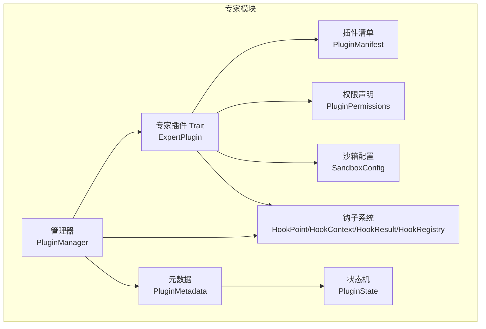
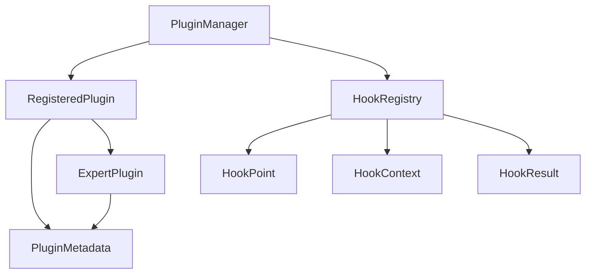
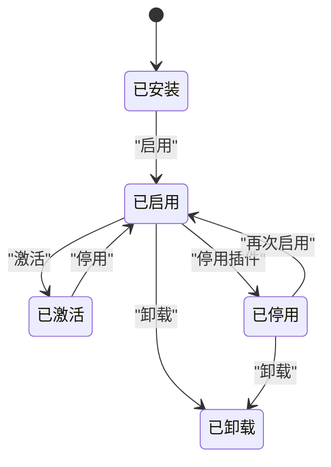
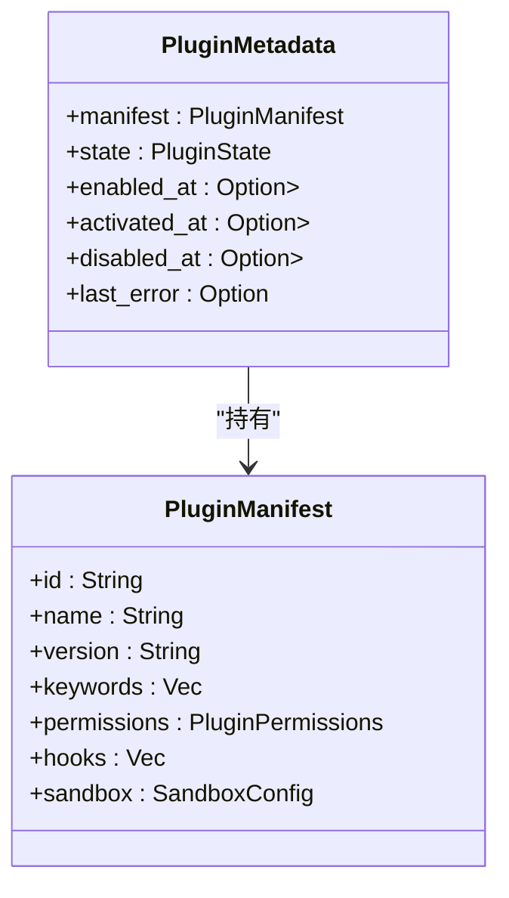
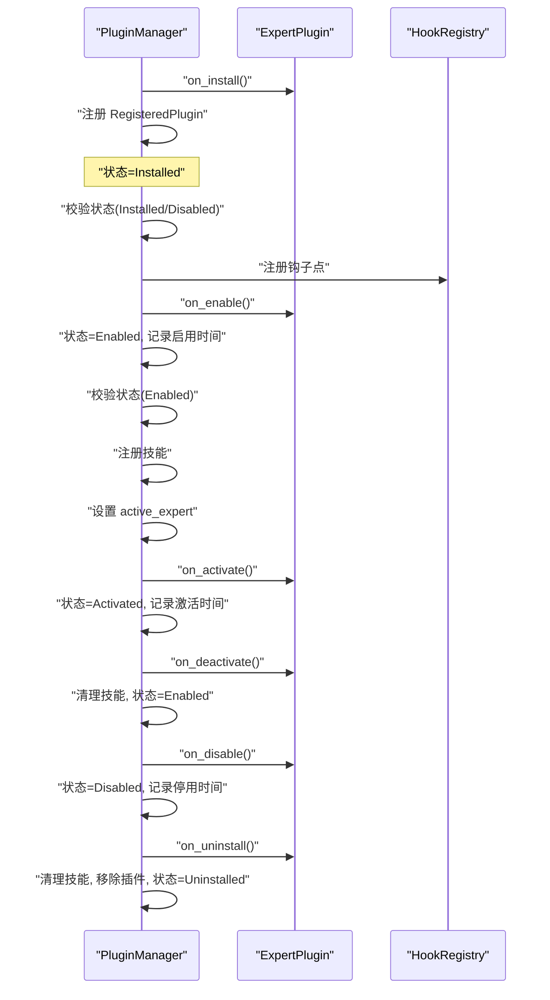
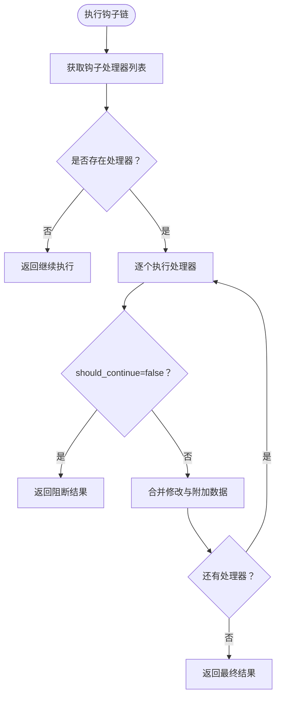
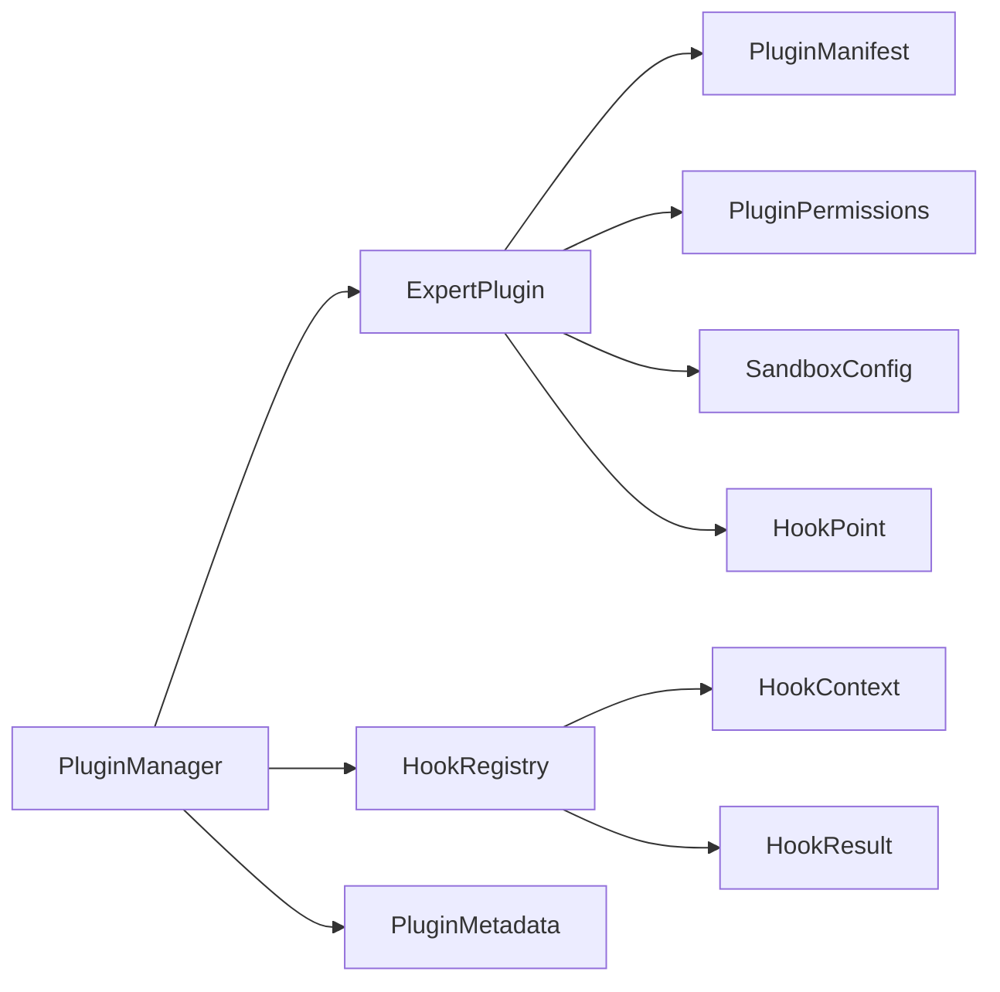

# 插件生命周期管理

<cite>
**本文引用的文件**
- [crates/subhuti/src/expert/mod.rs](file://crates/subhuti/src/expert/mod.rs)
- [crates/subhuti/tests/test_hook_chain.rs](file://crates/subhuti/tests/test_hook_chain.rs)
</cite>

## 目录
1. [简介](#简介)
2. [项目结构](#项目结构)
3. [核心组件](#核心组件)
4. [架构总览](#架构总览)
5. [详细组件分析](#详细组件分析)
6. [依赖关系分析](#依赖关系分析)
7. [性能考量](#性能考量)
8. [故障排查指南](#故障排查指南)
9. [结论](#结论)
10. [附录](#附录)

## 简介
本文件系统性阐述 Subhuti 框架中的“插件生命周期管理系统”，围绕以下目标展开：
- 设计并解释插件状态机：Installed → Enabled → Activated → Disabled → Uninstalled 的完整流程
- 深入说明每个状态的含义、触发条件与状态变更事件
- 解释 PluginMetadata 结构体的作用：状态记录、时间戳管理、错误跟踪
- 描述 PluginManager 的核心功能：插件注册、状态管理、激活控制、技能冲突检测
- 提供最佳实践：状态验证、异常处理、资源清理、监控告警
- 给出完整的状态转换示例与错误处理策略

## 项目结构
与插件生命周期管理相关的核心代码位于专家模块中，包含：
- 插件清单、权限、沙箱、钩子系统
- 插件状态枚举与元数据
- 专家插件 Trait 与插件管理器
- 钩子注册表与执行链
- 测试用例覆盖完整生命周期与钩子链

**图表来源**
- [crates/subhuti/src/expert/mod.rs:107-166](file://crates/subhuti/src/expert/mod.rs#L107-L166)
- [crates/subhuti/src/expert/mod.rs:225-289](file://crates/subhuti/src/expert/mod.rs#L225-L289)
- [crates/subhuti/src/expert/mod.rs:295-347](file://crates/subhuti/src/expert/mod.rs#L295-L347)
- [crates/subhuti/src/expert/mod.rs:353-402](file://crates/subhuti/src/expert/mod.rs#L353-L402)
- [crates/subhuti/src/expert/mod.rs:603-655](file://crates/subhuti/src/expert/mod.rs#L603-L655)
- [crates/subhuti/src/expert/mod.rs:766-802](file://crates/subhuti/src/expert/mod.rs#L766-L802)

**章节来源**
- [crates/subhuti/src/expert/mod.rs:1-120](file://crates/subhuti/src/expert/mod.rs#L1-L120)

## 核心组件
- 插件清单（PluginManifest）：承载插件身份、能力声明（权限、沙箱、钩子）、分类与关键字等元信息
- 权限系统（PluginPermissions）：细粒度控制文件、网络、数据库、代码执行、外部 API、心灵层修改、插件间访问等
- 沙箱配置（SandboxConfig）：资源限制与每日调用量限制，支持运行时计数与重置
- 钩子系统（HookPoint/HookContext/HookResult/HookRegistry）：在核心流程关键节点插入自定义逻辑，支持链式执行、输入/响应修改、阻断与错误传播
- 插件状态机（PluginState）：Installed → Enabled → Activated → Enabled → Disabled → Installed/Disabled → Uninstalled
- 插件元数据（PluginMetadata）：记录状态与时间戳（启用/激活/停用），以及最近错误
- 专家插件 Trait（ExpertPlugin）：提供生命周期钩子 on_install/on_uninstall/on_enable/on_disable/on_activate/on_deactivate 与可选 handle_hook
- 插件管理器（PluginManager）：负责安装/卸载、启用/停用、激活/停用当前专家、技能注册与冲突检测、钩子注册与执行、查询与权限检查

**章节来源**
- [crates/subhuti/src/expert/mod.rs:107-166](file://crates/subhuti/src/expert/mod.rs#L107-L166)
- [crates/subhuti/src/expert/mod.rs:225-289](file://crates/subhuti/src/expert/mod.rs#L225-L289)
- [crates/subhuti/src/expert/mod.rs:295-347](file://crates/subhuti/src/expert/mod.rs#L295-L347)
- [crates/subhuti/src/expert/mod.rs:353-402](file://crates/subhuti/src/expert/mod.rs#L353-L402)
- [crates/subhuti/src/expert/mod.rs:603-655](file://crates/subhuti/src/expert/mod.rs#L603-L655)
- [crates/subhuti/src/expert/mod.rs:664-760](file://crates/subhuti/src/expert/mod.rs#L664-L760)
- [crates/subhuti/src/expert/mod.rs:766-802](file://crates/subhuti/src/expert/mod.rs#L766-L802)

## 架构总览
下图展示插件生命周期管理的整体架构与交互关系。

**图表来源**
- [crates/subhuti/src/expert/mod.rs:766-802](file://crates/subhuti/src/expert/mod.rs#L766-L802)
- [crates/subhuti/src/expert/mod.rs:790-793](file://crates/subhuti/src/expert/mod.rs#L790-L793)
- [crates/subhuti/src/expert/mod.rs:633-655](file://crates/subhuti/src/expert/mod.rs#L633-L655)
- [crates/subhuti/src/expert/mod.rs:496-546](file://crates/subhuti/src/expert/mod.rs#L496-L546)

## 详细组件分析

### 插件状态机与状态转换
- 状态定义：Installed（已安装未启用）、Enabled（已启用未激活）、Activated（已激活正在使用）、Disabled（已停用）、Uninstalled（已卸载）
- 关键约束与转换规则：
  - 安装：由安装钩子 on_install 触发，状态置为 Installed
  - 启用：仅允许 Installed 或 Disabled；注册钩子链，执行 on_enable，状态置为 Enabled，并记录启用时间
  - 激活：仅允许 Enabled；注册技能，更新激活专家 ID，状态置为 Activated，记录激活时间并进行沙箱计数
  - 停用：可对 Activated 或 Enabled 执行；执行 on_deactivate，清理技能注册，状态回退至 Enabled
  - 停用插件：对 Enabled/Activated 执行；执行 on_disable，状态置为 Disabled，并记录停用时间
  - 卸载：仅允许 Installed/Disabled；执行 on_uninstall，清理技能，移除插件，状态置为 Uninstalled

**图表来源**
- [crates/subhuti/src/expert/mod.rs:603-618](file://crates/subhuti/src/expert/mod.rs#L603-L618)
- [crates/subhuti/src/expert/mod.rs:812-857](file://crates/subhuti/src/expert/mod.rs#L812-L857)
- [crates/subhuti/src/expert/mod.rs:859-937](file://crates/subhuti/src/expert/mod.rs#L859-L937)
- [crates/subhuti/src/expert/mod.rs:939-1015](file://crates/subhuti/src/expert/mod.rs#L939-L1015)

**章节来源**
- [crates/subhuti/src/expert/mod.rs:603-631](file://crates/subhuti/src/expert/mod.rs#L603-L631)
- [crates/subhuti/src/expert/mod.rs:812-1015](file://crates/subhuti/src/expert/mod.rs#L812-L1015)

### PluginMetadata：状态记录、时间戳与错误跟踪
- 字段职责：
  - manifest：插件清单
  - state：当前状态
  - enabled_at/activated_at/disabled_at：启用/激活/停用的时间戳
  - last_error：最近一次错误信息
- 初始化：从清单创建时默认状态为 Installed，其余时间戳为空，无错误

**图表来源**
- [crates/subhuti/src/expert/mod.rs:633-655](file://crates/subhuti/src/expert/mod.rs#L633-L655)
- [crates/subhuti/src/expert/mod.rs:107-166](file://crates/subhuti/src/expert/mod.rs#L107-L166)

**章节来源**
- [crates/subhuti/src/expert/mod.rs:633-655](file://crates/subhuti/src/expert/mod.rs#L633-L655)

### PluginManager：核心功能与控制流
- 安装（install）：校验唯一性，执行 on_install，注册 RegisteredPlugin（含 PluginMetadata），记录日志
- 卸载（uninstall）：禁止卸载正在激活的插件，执行 on_uninstall，清理技能，移除插件
- 启用（enable）：校验状态（Installed/Disabled），克隆钩子点列表，注册到 HookRegistry，执行 on_enable，更新状态与启用时间
- 停用插件（disable）：若当前激活即先停用，执行 on_disable，更新状态与停用时间
- 激活（activate）：校验状态（Enabled），注册技能，设置 active_expert，更新状态与激活时间，执行 on_activate
- 停用（deactivate）：执行 on_deactivate，清理技能，回退状态至 Enabled
- 技能管理：register_skills/unregister_skills，基于技能名与专家 ID 的映射避免重复注入
- 查询与匹配：get_active_expert_id/get_metadata/list_plugins/list_enabled/match_expert
- 权限检查：check_permission
- 钩子执行：execute_hook

**图表来源**
- [crates/subhuti/src/expert/mod.rs:812-1015](file://crates/subhuti/src/expert/mod.rs#L812-L1015)
- [crates/subhuti/src/expert/mod.rs:1019-1029](file://crates/subhuti/src/expert/mod.rs#L1019-L1029)
- [crates/subhuti/src/expert/mod.rs:1033-1036](file://crates/subhuti/src/expert/mod.rs#L1033-L1036)

**章节来源**
- [crates/subhuti/src/expert/mod.rs:766-802](file://crates/subhuti/src/expert/mod.rs#L766-L802)
- [crates/subhuti/src/expert/mod.rs:812-1015](file://crates/subhuti/src/expert/mod.rs#L812-L1015)
- [crates/subhuti/src/expert/mod.rs:1019-1036](file://crates/subhuti/src/expert/mod.rs#L1019-L1036)

### 钩子系统与生命周期钩子
- 钩子点（HookPoint）：请求前后、技能匹配/执行前后、LLM 调用前后、记忆检索前后、工具调用前后、专家切换等
- 钩子上下文（HookContext）：携带请求/用户/会话/输入、当前专家、时间戳
- 钩子结果（HookResult）：是否继续、修改后的输入/响应、附加数据、错误信息
- HookRegistry：按钩子点维护处理器列表，执行时短路传播（任一阻止则立即返回）

**图表来源**
- [crates/subhuti/src/expert/mod.rs:353-402](file://crates/subhuti/src/expert/mod.rs#L353-L402)
- [crates/subhuti/src/expert/mod.rs:404-491](file://crates/subhuti/src/expert/mod.rs#L404-L491)
- [crates/subhuti/src/expert/mod.rs:496-546](file://crates/subhuti/src/expert/mod.rs#L496-L546)

**章节来源**
- [crates/subhuti/src/expert/mod.rs:353-546](file://crates/subhuti/src/expert/mod.rs#L353-L546)

### 权限系统与沙箱
- 权限声明：文件读写、网络、数据库、代码执行、外部 API、心灵层修改、插件间访问
- 白名单机制：允许域名与路径通配符
- 沙箱配置：内存、执行时间、Token 限额、插件隔离、每日调用上限、运行时计数与重置

**章节来源**
- [crates/subhuti/src/expert/mod.rs:225-289](file://crates/subhuti/src/expert/mod.rs#L225-L289)
- [crates/subhuti/src/expert/mod.rs:295-347](file://crates/subhuti/src/expert/mod.rs#L295-L347)

### 技能冲突检测与避免
- 管理器维护“技能名 → 专家 ID”的映射，注册技能时插入，停用/卸载时清理，避免重复注入导致的冲突

**章节来源**
- [crates/subhuti/src/expert/mod.rs:1019-1029](file://crates/subhuti/src/expert/mod.rs#L1019-L1029)

### 完整生命周期示例（来自测试）
- 安装 → 启用 → 激活 → 钩子链执行 → 停用（保持启用）→ 停用插件（Disabled）→ 卸载
- 测试断言覆盖各阶段状态变化与活跃专家 ID

**章节来源**
- [crates/subhuti/tests/test_hook_chain.rs:461-522](file://crates/subhuti/tests/test_hook_chain.rs#L461-L522)

## 依赖关系分析
- PluginManager 依赖 ExpertPlugin（生命周期钩子）、HookRegistry（钩子执行）、PluginMetadata（状态与时间戳）
- ExpertPlugin 依赖 PluginManifest（能力声明）、PluginPermissions/SandboxConfig（安全与资源限制）、HookPoint（可挂载点）
- HookRegistry 依赖 HookPoint/HookContext/HookResult

**图表来源**
- [crates/subhuti/src/expert/mod.rs:766-802](file://crates/subhuti/src/expert/mod.rs#L766-L802)
- [crates/subhuti/src/expert/mod.rs:107-166](file://crates/subhuti/src/expert/mod.rs#L107-L166)
- [crates/subhuti/src/expert/mod.rs:225-289](file://crates/subhuti/src/expert/mod.rs#L225-L289)
- [crates/subhuti/src/expert/mod.rs:295-347](file://crates/subhuti/src/expert/mod.rs#L295-L347)
- [crates/subhuti/src/expert/mod.rs:353-402](file://crates/subhuti/src/expert/mod.rs#L353-L402)
- [crates/subhuti/src/expert/mod.rs:404-491](file://crates/subhuti/src/expert/mod.rs#L404-L491)
- [crates/subhuti/src/expert/mod.rs:496-546](file://crates/subhuti/src/expert/mod.rs#L496-L546)

**章节来源**
- [crates/subhuti/src/expert/mod.rs:766-802](file://crates/subhuti/src/expert/mod.rs#L766-L802)

## 性能考量
- 钩子链执行：按序遍历处理器，短路返回，避免不必要的后续处理
- 技能注册去重：通过映射快速判断是否重复，降低注入成本
- 沙箱计数：每日计数与重置，避免超限请求造成资源压力
- 日志与追踪：关键状态变更记录日志，便于审计与问题定位

[本节为通用指导，无需特定文件引用]

## 故障排查指南
- 状态非法转换
  - 现象：启用/停用/激活失败
  - 排查：确认当前状态是否满足转换前置条件（Installed/Disabled/Enabled）
  - 参考：启用/停用/激活方法的状态校验逻辑
- 正在激活的插件无法卸载
  - 现象：卸载报错
  - 排查：先执行停用再卸载
  - 参考：卸载方法对 active_expert 的保护
- 钩子链阻断
  - 现象：后续钩子未执行
  - 排查：检查上一个钩子是否返回阻断结果
  - 参考：HookRegistry 执行逻辑
- 权限不足
  - 现象：网络/文件/数据库等操作失败
  - 排查：核对 PluginPermissions 与白名单配置
  - 参考：权限检查方法
- 资源超限
  - 现象：达到每日调用上限
  - 排查：检查沙箱配置与计数，必要时重置
  - 参考：沙箱计数与重置

**章节来源**
- [crates/subhuti/src/expert/mod.rs:859-937](file://crates/subhuti/src/expert/mod.rs#L859-L937)
- [crates/subhuti/src/expert/mod.rs:836-857](file://crates/subhuti/src/expert/mod.rs#L836-L857)
- [crates/subhuti/src/expert/mod.rs:496-546](file://crates/subhuti/src/expert/mod.rs#L496-L546)
- [crates/subhuti/src/expert/mod.rs:1096-1115](file://crates/subhuti/src/expert/mod.rs#L1096-L1115)
- [crates/subhuti/src/expert/mod.rs:330-347](file://crates/subhuti/src/expert/mod.rs#L330-L347)

## 结论
本系统以清晰的状态机与完备的生命周期钩子为核心，结合权限与沙箱控制，提供了可扩展、可观测、可治理的插件管理体系。通过测试用例覆盖完整生命周期与钩子链，确保状态转换与资源管理符合预期。建议在生产环境中配合日志与监控，持续优化状态变更与资源使用策略。

[本节为总结，无需特定文件引用]

## 附录

### 最佳实践清单
- 状态验证
  - 在每次转换前严格校验当前状态，避免非法状态变更
- 异常处理
  - 生命周期钩子与资源操作需捕获错误并记录 last_error
- 资源清理
  - 停用/停用插件/卸载时务必清理钩子与技能注册
- 监控告警
  - 记录关键状态变更日志，结合 last_error 实现异常告警
- 权限最小化
  - 仅授予所需权限，谨慎开启危险权限
- 沙箱约束
  - 合理设置资源上限，定期重置计数并观察使用趋势

[本节为通用指导，无需特定文件引用]