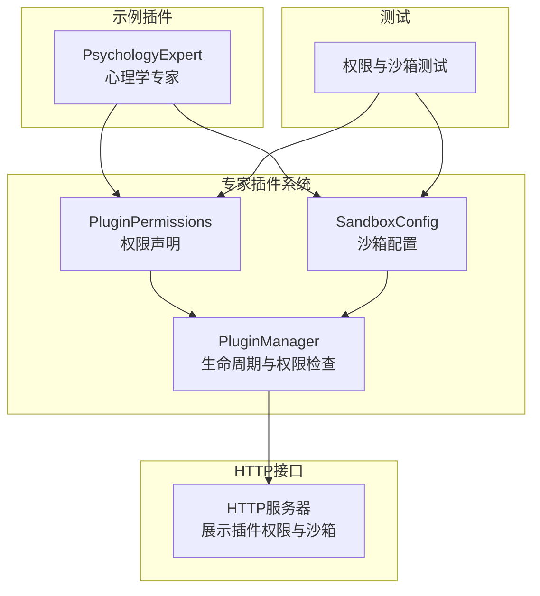
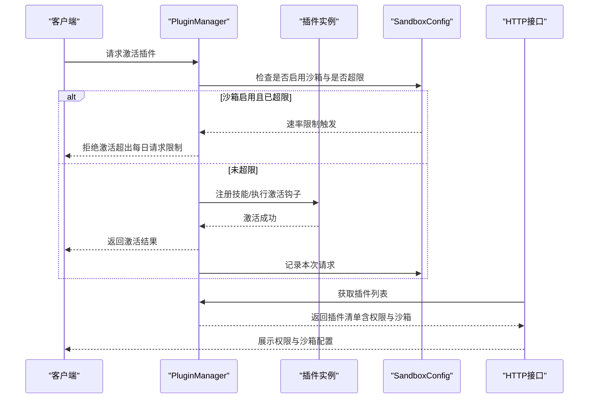
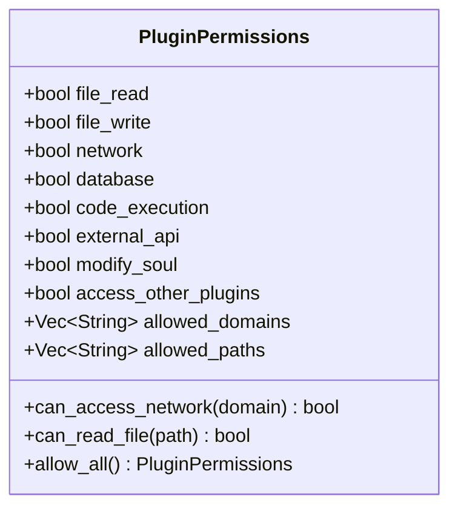
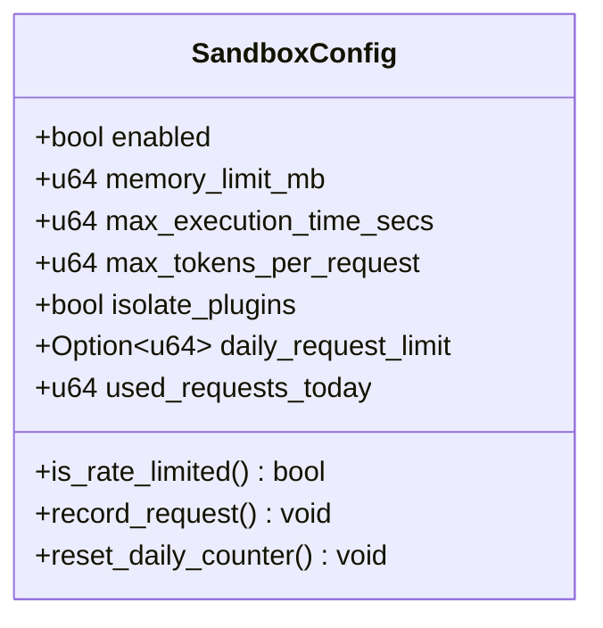
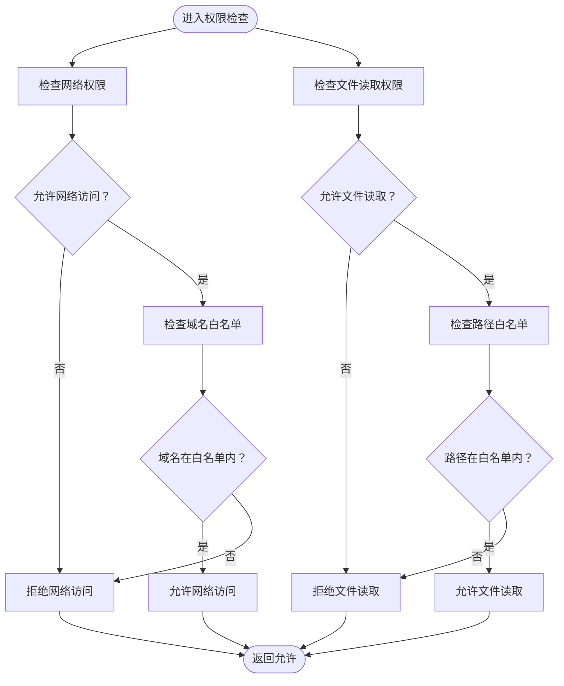
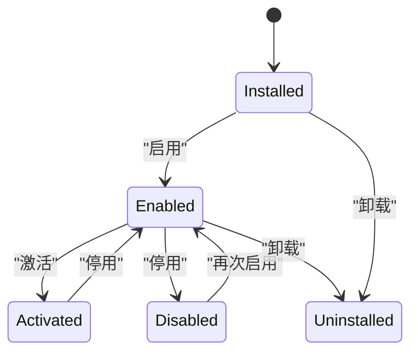
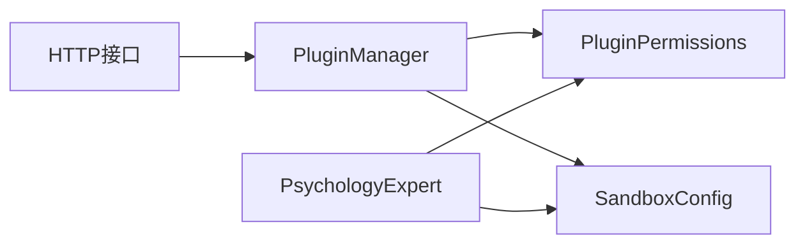

# 权限控制系统

<cite>
**本文档引用的文件**
- [crates/subhuti/src/expert/mod.rs](file://crates/subhuti/src/expert/mod.rs)
- [crates/subhuti-expert-psychology/src/lib.rs](file://crates/subhuti-expert-psychology/src/lib.rs)
- [src/bin/http_server/main.rs](file://src/bin/http_server/main.rs)
- [crates/subhuti/tests/test_hook_chain.rs](file://crates/subhuti/tests/test_hook_chain.rs)
</cite>

## 目录
1. [简介](#简介)
2. [项目结构](#项目结构)
3. [核心组件](#核心组件)
4. [架构总览](#架构总览)
5. [详细组件分析](#详细组件分析)
6. [依赖关系分析](#依赖关系分析)
7. [性能考量](#性能考量)
8. [故障排查指南](#故障排查指南)
9. [结论](#结论)
10. [附录](#附录)

## 简介
本文件系统性阐述 Subhuti 插件权限控制体系，围绕 PluginPermissions 结构体与 SandboxConfig 沙箱配置展开，覆盖文件访问、网络、数据库、代码执行、外部 API 等权限维度，以及域名白名单、路径白名单、资源使用监控等控制机制。同时提供最佳实践、配置示例与安全防护建议，帮助开发者在保证功能可用的同时，最大化系统安全性与稳定性。

## 项目结构
权限控制相关代码集中于专家插件系统模块，主要文件如下：
- 权限与沙箱定义：crates/subhuti/src/expert/mod.rs
- 示例插件（心理学专家）：crates/subhuti-expert-psychology/src/lib.rs
- HTTP 接口展示插件权限与沙箱配置：src/bin/http_server/main.rs
- 权限与沙箱相关测试：crates/subhuti/tests/test_hook_chain.rs

图表来源
- [crates/subhuti/src/expert/mod.rs:225-347](file://crates/subhuti/src/expert/mod.rs#L225-L347)
- [crates/subhuti-expert-psychology/src/lib.rs:41-85](file://crates/subhuti-expert-psychology/src/lib.rs#L41-L85)
- [src/bin/http_server/main.rs:833-866](file://src/bin/http_server/main.rs#L833-L866)
- [crates/subhuti/tests/test_hook_chain.rs:428-463](file://crates/subhuti/tests/test_hook_chain.rs#L428-L463)

章节来源
- [crates/subhuti/src/expert/mod.rs:225-347](file://crates/subhuti/src/expert/mod.rs#L225-L347)
- [crates/subhuti-expert-psychology/src/lib.rs:41-85](file://crates/subhuti-expert-psychology/src/lib.rs#L41-L85)
- [src/bin/http_server/main.rs:833-866](file://src/bin/http_server/main.rs#L833-L866)
- [crates/subhuti/tests/test_hook_chain.rs:428-463](file://crates/subhuti/tests/test_hook_chain.rs#L428-L463)

## 核心组件
- PluginPermissions：声明插件所需的最小权限集，并提供白名单校验与权限查询能力
- SandboxConfig：定义插件运行时的资源限制与隔离策略
- PluginManager：负责插件生命周期管理，并在关键节点进行权限与沙箱检查

章节来源
- [crates/subhuti/src/expert/mod.rs:225-347](file://crates/subhuti/src/expert/mod.rs#L225-L347)
- [crates/subhuti/src/expert/mod.rs:768-1116](file://crates/subhuti/src/expert/mod.rs#L768-L1116)

## 架构总览
权限控制贯穿插件生命周期的关键节点，形成“清单声明 + 运行时检查”的闭环。

图表来源
- [crates/subhuti/src/expert/mod.rs:940-992](file://crates/subhuti/src/expert/mod.rs#L940-L992)
- [crates/subhuti/src/expert/mod.rs:958-985](file://crates/subhuti/src/expert/mod.rs#L958-L985)
- [src/bin/http_server/main.rs:833-866](file://src/bin/http_server/main.rs#L833-L866)

## 详细组件分析

### PluginPermissions 权限模型
- 基础权限
  - 文件读取/写入：file_read、file_write
  - 网络访问：network
  - 数据库访问：database
  - 代码执行：code_execution
  - 外部 API 调用：external_api
  - 修改心灵层：modify_soul
  - 访问其他插件：access_other_plugins
- 白名单机制
  - allowed_domains：网络域名白名单
  - allowed_paths：文件路径白名单
- 权限校验
  - can_access_network(domain)：网络权限 + 域名白名单
  - can_read_file(path)：文件读取权限 + 路径白名单
- 默认行为
  - allow_all()：授予所有权限（仅测试用途）

图表来源
- [crates/subhuti/src/expert/mod.rs:225-289](file://crates/subhuti/src/expert/mod.rs#L225-L289)

章节来源
- [crates/subhuti/src/expert/mod.rs:225-289](file://crates/subhuti/src/expert/mod.rs#L225-L289)
- [crates/subhuti/tests/test_hook_chain.rs:428-463](file://crates/subhuti/tests/test_hook_chain.rs#L428-L463)

### SandboxConfig 沙箱策略
- 安全隔离
  - enabled：是否启用沙箱
  - isolate_plugins：是否限制插件间通信
- 资源限制
  - memory_limit_mb：最大内存限制（MB）
  - max_execution_time_secs：最大执行时间（秒）
  - max_tokens_per_request：单次请求最大 Token 消耗
  - daily_request_limit：每日调用次数上限（Option）
- 运行时统计
  - used_requests_today：当日已用请求数（运行时统计）
- 速率控制
  - is_rate_limited()：检查是否超限
  - record_request()：记录一次请求
  - reset_daily_counter()：重置每日计数

图表来源
- [crates/subhuti/src/expert/mod.rs:295-347](file://crates/subhuti/src/expert/mod.rs#L295-L347)

章节来源
- [crates/subhuti/src/expert/mod.rs:295-347](file://crates/subhuti/src/expert/mod.rs#L295-L347)
- [crates/subhuti/tests/test_hook_chain.rs:544-591](file://crates/subhuti/tests/test_hook_chain.rs#L544-L591)

### 权限检查算法
- 域名白名单验证
  - 若未开启网络权限，直接拒绝
  - 若白名单包含通配符，则允许
  - 否则检查域名是否包含白名单中的任意项
- 文件路径验证
  - 若未开启文件读取权限，直接拒绝
  - 若白名单包含通配符，则允许
  - 否则检查路径是否以白名单中的任一项为前缀
- 资源使用监控
  - 激活插件时检查沙箱是否启用及是否超限
  - 成功激活后记录一次请求

图表来源
- [crates/subhuti/src/expert/mod.rs:268-288](file://crates/subhuti/src/expert/mod.rs#L268-L288)

章节来源
- [crates/subhuti/src/expert/mod.rs:268-288](file://crates/subhuti/src/expert/mod.rs#L268-L288)
- [crates/subhuti/src/expert/mod.rs:958-985](file://crates/subhuti/src/expert/mod.rs#L958-L985)

### 插件生命周期与权限集成
- 安装/启用/停用/卸载：维护插件状态机，注册/注销钩子
- 激活阶段：检查沙箱限制，记录请求，注册技能，执行激活钩子
- 权限查询：通过 PluginManager 的 check_permission 方法按需查询

图表来源
- [crates/subhuti/src/expert/mod.rs:603-618](file://crates/subhuti/src/expert/mod.rs#L603-L618)
- [crates/subhuti/src/expert/mod.rs:940-992](file://crates/subhuti/src/expert/mod.rs#L940-L992)

章节来源
- [crates/subhuti/src/expert/mod.rs:603-618](file://crates/subhuti/src/expert/mod.rs#L603-L618)
- [crates/subhuti/src/expert/mod.rs:768-1116](file://crates/subhuti/src/expert/mod.rs#L768-L1116)

### HTTP 接口中的权限与沙箱展示
- HTTP 接口会返回每个插件的权限与沙箱配置，便于运维与审计
- 字段包括：file_read、file_write、network、database、code_execution、sandbox（enabled、memory_limit_mb、max_execution_time_secs、daily_request_limit）

章节来源
- [src/bin/http_server/main.rs:833-866](file://src/bin/http_server/main.rs#L833-L866)

## 依赖关系分析
- PluginPermissions 与 SandboxConfig 是 PluginManifest 的组成部分，决定插件的最小权限与运行时限制
- PluginManager 在激活阶段调用 SandboxConfig 的速率控制方法，确保每日请求限制生效
- 示例插件 PsychologyExpert 展示了合理的权限与沙箱配置组合

图表来源
- [crates/subhuti/src/expert/mod.rs:107-166](file://crates/subhuti/src/expert/mod.rs#L107-L166)
- [crates/subhuti-expert-psychology/src/lib.rs:41-85](file://crates/subhuti-expert-psychology/src/lib.rs#L41-L85)
- [src/bin/http_server/main.rs:833-866](file://src/bin/http_server/main.rs#L833-L866)

章节来源
- [crates/subhuti/src/expert/mod.rs:107-166](file://crates/subhuti/src/expert/mod.rs#L107-L166)
- [crates/subhuti-expert-psychology/src/lib.rs:41-85](file://crates/subhuti-expert-psychology/src/lib.rs#L41-L85)
- [src/bin/http_server/main.rs:833-866](file://src/bin/http_server/main.rs#L833-L866)

## 性能考量
- 沙箱默认启用，有助于防止资源滥用与拒绝服务攻击
- 速率限制在激活阶段即时生效，避免过载
- 白名单匹配采用简单字符串包含/前缀匹配，复杂度较低，适合高频检查场景
- 建议根据插件实际负载调整 memory_limit_mb、max_execution_time_secs、max_tokens_per_request

## 故障排查指南
- 激活失败（超出每日请求限制）
  - 检查插件的 daily_request_limit 与 used_requests_today
  - 确认是否需要重置计数或提升限额
- 权限不足
  - 确认 PluginPermissions 中对应权限是否开启
  - 检查 allowed_domains/allowed_paths 白名单是否正确配置
- HTTP 展示异常
  - 确认返回字段是否包含权限与沙箱配置
  - 检查插件清单是否正确填充

章节来源
- [crates/subhuti/src/expert/mod.rs:958-985](file://crates/subhuti/src/expert/mod.rs#L958-L985)
- [crates/subhuti/tests/test_hook_chain.rs:544-591](file://crates/subhuti/tests/test_hook_chain.rs#L544-L591)

## 结论
该权限控制系统通过“清单声明 + 运行时检查”的模式，实现了对文件、网络、数据库、代码执行、外部 API 等权限的细粒度控制，并结合沙箱的资源限制与速率控制，有效提升了系统的安全性与稳定性。建议在生产环境中遵循最小权限原则，严格配置白名单与资源限制，并定期进行安全审计与风险评估。

## 附录

### 最佳实践
- 最小权限原则
  - 默认关闭高危权限（如 file_write、code_execution、database），仅在确有必要时开启
  - 使用白名单精确限定网络域名与文件路径
- 安全审计
  - 定期审查插件权限与沙箱配置，确保与业务需求一致
  - 通过 HTTP 接口导出权限与沙箱信息，纳入运维巡检
- 风险评估
  - 对涉及外部 API 或数据库的插件，优先启用沙箱并设置严格的资源限制
  - 对可能产生大量 Token 消耗的插件，合理设置 max_tokens_per_request

### 权限配置示例
- 心理咨询专家（示例插件）
  - 权限：默认关闭所有高危权限
  - 沙箱：启用，内存限制 256MB，执行时间 30 秒，Token 限制 2048，每日 500 次
- HTTP 接口展示
  - 返回字段：permissions 与 sandbox 的关键配置，便于运维核对

章节来源
- [crates/subhuti-expert-psychology/src/lib.rs:64-75](file://crates/subhuti-expert-psychology/src/lib.rs#L64-L75)
- [src/bin/http_server/main.rs:833-866](file://src/bin/http_server/main.rs#L833-L866)