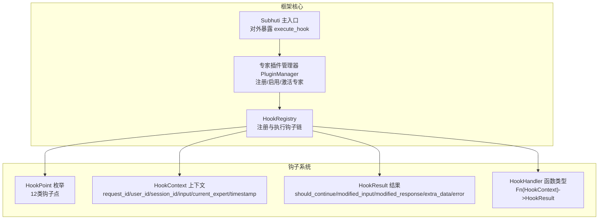
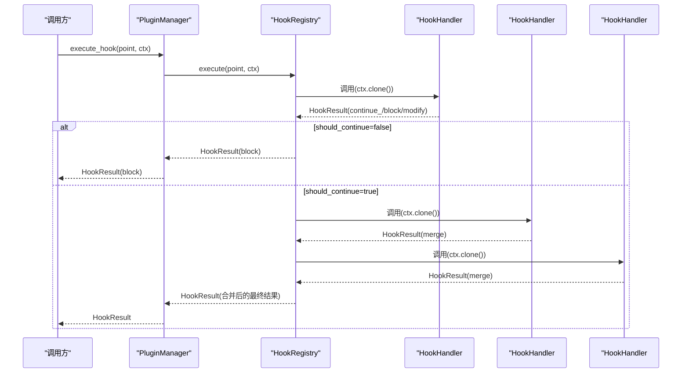
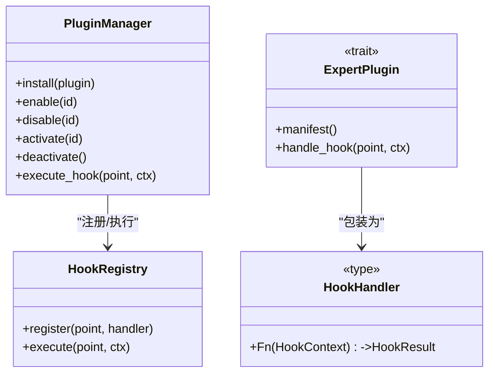
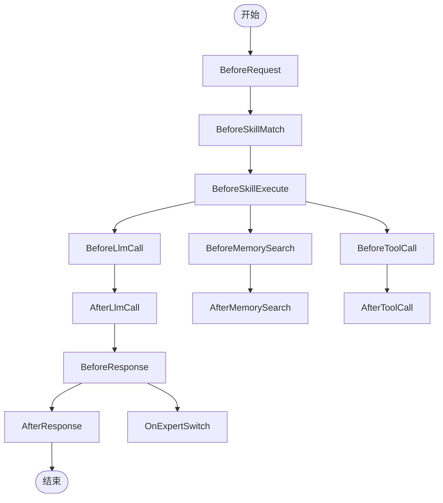
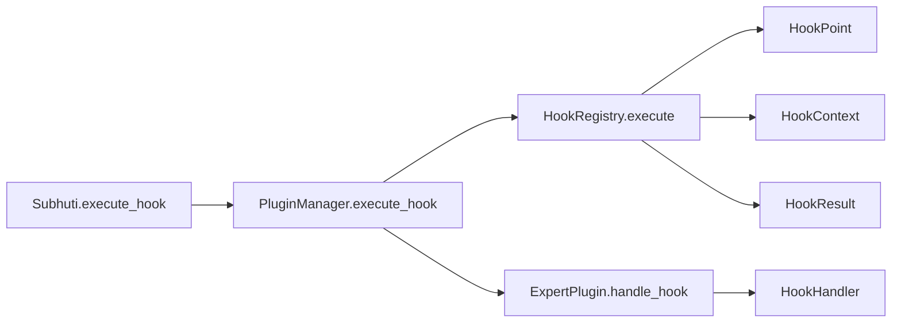

# 钩子系统机制

<cite>
**本文引用的文件**
- [expert/mod.rs](file://crates/subhuti/src/expert/mod.rs)
- [lib.rs](file://crates/subhuti/src/lib.rs)
- [extension/mod.rs](file://crates/subhuti/src/extension/mod.rs)
- [test_hook_chain.rs](file://crates/subhuti/tests/test_hook_chain.rs)
- [lib.rs](file://crates/subhuti-expert-psychology/src/lib.rs)
</cite>

## 目录
1. [简介](#简介)
2. [项目结构](#项目结构)
3. [核心组件](#核心组件)
4. [架构总览](#架构总览)
5. [详细组件分析](#详细组件分析)
6. [依赖关系分析](#依赖关系分析)
7. [性能考量](#性能考量)
8. [故障排查指南](#故障排查指南)
9. [结论](#结论)
10. [附录](#附录)

## 简介
本文件系统性阐述 Subhuti 框架中的“钩子系统”，涵盖 HookPoint 钩子点枚举、HookContext 上下文数据结构、HookResult 执行结果处理机制、HookRegistry 注册表与 HookHandler 处理函数模式，并结合测试与示例插件展示钩子的调用时机、数据传递与控制流。文档面向不同层次读者，既提供高层概览，也包含代码级细节与可视化图表。

## 项目结构
钩子系统位于 expert 模块中，与扩展层 ExtensionManager 并行存在，分别服务于“专家插件生命周期与行为”和“运行时扩展”。框架主入口 Subhuti 对外暴露 execute_hook 方法，便于在运行时触发钩子链。

**图表来源**
- [lib.rs:363-366](file://crates/subhuti/src/lib.rs#L363-L366)
- [expert/mod.rs:353-546](file://crates/subhuti/src/expert/mod.rs#L353-L546)

**章节来源**
- [lib.rs:363-366](file://crates/subhuti/src/lib.rs#L363-L366)
- [expert/mod.rs:353-546](file://crates/subhuti/src/expert/mod.rs#L353-L546)

## 核心组件
- HookPoint：定义 12 类钩子点，覆盖请求、技能、LLM、响应、记忆、工具、专家切换等关键节点。
- HookContext：携带请求标识、用户/会话、输入、当前专家、时间戳等上下文信息。
- HookResult：控制执行流（继续/阻断）、可修改输入/响应、附加数据与错误信息。
- HookRegistry：注册与执行钩子链，按注册顺序串行执行，遇到阻断即短路返回。
- HookHandler：钩子处理函数签名，接收 HookContext 返回 HookResult。
- PluginManager：将 ExpertPlugin 的 handle_hook 包装为 HookHandler 注册到 HookRegistry。

**章节来源**
- [expert/mod.rs:353-546](file://crates/subhuti/src/expert/mod.rs#L353-L546)

## 架构总览
钩子系统在专家插件启用时，将插件声明的 HookPoint 注册到 HookRegistry。当框架在相应生命周期触发钩子点时，HookRegistry 依次调用已注册的 HookHandler，合并修改结果并决定是否继续执行。

**图表来源**
- [expert/mod.rs:512-540](file://crates/subhuti/src/expert/mod.rs#L512-L540)
- [expert/mod.rs:887-890](file://crates/subhuti/src/expert/mod.rs#L887-L890)

**章节来源**
- [expert/mod.rs:512-540](file://crates/subhuti/src/expert/mod.rs#L512-L540)
- [expert/mod.rs:887-890](file://crates/subhuti/src/expert/mod.rs#L887-L890)

## 详细组件分析

### HookPoint 钩子点详解
- BeforeRequest：请求开始前，常用于输入清洗、鉴权、速率限制检查。
- BeforeSkillMatch：技能匹配前，可用于输入预处理或快速阻断。
- BeforeSkillExecute：技能执行前，可进行前置校验或输入增强。
- AfterSkillExecute：技能执行后，可用于结果摘要、副作用清理。
- BeforeLlmCall：LLM 调用前，可注入系统提示、上下文裁剪、安全过滤。
- AfterLlmCall：LLM 调用后，可进行结果清洗、敏感信息过滤。
- BeforeResponse：生成响应前，常用于危机干预、个性化定制、内容审核。
- AfterResponse：响应生成后，可用于统计、归档、缓存。
- BeforeMemorySearch：记忆检索前，可进行检索优化、权限校验。
- AfterMemorySearch：记忆检索后，可进行结果聚合、去重。
- BeforeToolCall：工具调用前，可进行参数校验、审计日志。
- AfterToolCall：工具调用后，可进行结果摘要、异常处理。
- OnExpertSwitch：专家切换时，可用于资源回收、状态迁移。

注意：上述说明基于 HookPoint 的语义命名与常见使用场景，具体行为取决于插件实现。

**章节来源**
- [expert/mod.rs:355-381](file://crates/subhuti/src/expert/mod.rs#L355-L381)

### HookContext 上下文数据结构
- request_id：请求唯一标识，用于跨组件追踪。
- user_id：用户标识，便于权限与审计。
- session_id：会话标识，支持多轮对话上下文。
- input：当前输入文本，可能被钩子修改。
- current_expert：当前激活专家 ID（可空），用于专家相关钩子。
- timestamp：UTC 时间戳，便于审计与统计。

构造函数提供便捷创建方式，确保每次请求生成唯一 request_id 并记录时间。

**章节来源**
- [expert/mod.rs:406-431](file://crates/subhuti/src/expert/mod.rs#L406-L431)

### HookResult 执行结果处理机制
- should_continue：控制链式执行是否继续。若为 false，后续钩子不再执行。
- modified_input：修改后的输入，将被后续钩子看到（当前实现为覆盖式合并）。
- modified_response：修改后的响应，将被后续钩子看到（当前实现为覆盖式合并）。
- extra_data：附加数据，用于跨钩子传递状态。
- error：阻断原因或错误信息。

工厂方法：
- continue_()：默认继续，不修改。
- block(reason)：阻断执行并附带错误。
- modify_input(input)/modify_response(response)：修改输入或响应。

合并策略：HookRegistry 会将多个钩子的结果进行合并，最后生效的修改来自最后一个返回的 HookResult。

**章节来源**
- [expert/mod.rs:435-491](file://crates/subhuti/src/expert/mod.rs#L435-L491)
- [expert/mod.rs:512-540](file://crates/subhuti/src/expert/mod.rs#L512-L540)

### HookRegistry 注册表与 HookHandler 模式
- 注册：register(point, handler)，将 HookHandler 按 HookPoint 分组保存。
- 执行：execute(point, ctx)，按注册顺序串行执行，遇到 should_continue=false 即短路返回。
- 合并：将每个钩子的 modified_input/modified_response/extra_data 合并到最终结果中。

HookHandler 是 Box<dyn Fn(HookContext)->HookResult + Send + Sync> 类型，支持异步与并发场景。

**章节来源**
- [expert/mod.rs:496-546](file://crates/subhuti/src/expert/mod.rs#L496-L546)

### PluginManager 与钩子集成
- 启用插件时，遍历插件声明的 hooks，将 handle_hook 包装为 HookHandler 注册到 HookRegistry。
- 执行钩子：execute_hook(point, ctx) 直接委托给 HookRegistry.execute。
- 专家切换：OnExpertSwitch 钩子在专家激活/停用时触发，便于资源管理与状态迁移。

**图表来源**
- [expert/mod.rs:804-1036](file://crates/subhuti/src/expert/mod.rs#L804-L1036)
- [expert/mod.rs:493-500](file://crates/subhuti/src/expert/mod.rs#L493-L500)

**章节来源**
- [expert/mod.rs:804-1036](file://crates/subhuti/src/expert/mod.rs#L804-L1036)
- [expert/mod.rs:493-500](file://crates/subhuti/src/expert/mod.rs#L493-L500)

### 钩子调用时机与控制流
- 请求生命周期：BeforeRequest → BeforeSkillMatch → BeforeSkillExecute → BeforeLlmCall → AfterLlmCall → BeforeResponse → AfterResponse。
- 记忆与工具：BeforeMemorySearch → AfterMemorySearch；BeforeToolCall → AfterToolCall。
- 专家切换：OnExpertSwitch（激活/停用时）。

[本图为概念流程示意，不直接映射具体源码文件]

## 依赖关系分析
- Subhuti 主入口通过 execute_hook 将钩子点与 HookContext 传递给 PluginManager。
- PluginManager 在启用插件时，将 ExpertPlugin 的 handle_hook 包装为 HookHandler 注册到 HookRegistry。
- 扩展层 ExtensionManager 提供另一套生命周期钩子（before_prompt/before_tool/after_tool/after_complete），与专家钩子系统互补。

**图表来源**
- [lib.rs:363-366](file://crates/subhuti/src/lib.rs#L363-L366)
- [expert/mod.rs:1033-1036](file://crates/subhuti/src/expert/mod.rs#L1033-L1036)
- [expert/mod.rs:512-540](file://crates/subhuti/src/expert/mod.rs#L512-L540)
- [extension/mod.rs:174-226](file://crates/subhuti/src/extension/mod.rs#L174-L226)

**章节来源**
- [lib.rs:363-366](file://crates/subhuti/src/lib.rs#L363-L366)
- [expert/mod.rs:1033-1036](file://crates/subhuti/src/expert/mod.rs#L1033-L1036)
- [extension/mod.rs:174-226](file://crates/subhuti/src/extension/mod.rs#L174-L226)

## 性能考量
- 串行执行：HookRegistry 按注册顺序串行执行，避免并发竞争，但可能成为瓶颈。
- 克隆上下文：每次调用都会 clone HookContext，注意输入较大时的内存开销。
- 合并策略：modified_input/modified_response 采用覆盖式合并，避免多次拷贝。
- 阻断短路：一旦 should_continue=false，立即停止后续钩子，降低延迟。
- 沙箱限制：PluginManager 在激活专家时检查 SandboxConfig，防止滥用。

[本节为通用指导，不直接分析具体文件]

## 故障排查指南
- 钩子未生效：确认插件已 install/enable，且钩子点在 manifest.hooks 中声明。
- 阻断链：若某钩子返回 block，后续钩子不会执行，检查错误信息与 should_continue。
- 输入/响应未修改：当前实现为覆盖式合并，最后一个钩子的修改生效；如需链式传递，需在单个钩子中累积修改。
- 权限与沙箱：检查 PluginPermissions 与 SandboxConfig，确保网络/文件/数据库等权限满足需求。
- 上下文字段缺失：确认 HookContext.new 的参数与期望一致。

**章节来源**
- [test_hook_chain.rs:311-348](file://crates/subhuti/tests/test_hook_chain.rs#L311-L348)
- [test_hook_chain.rs:350-373](file://crates/subhuti/tests/test_hook_chain.rs#L350-L373)
- [test_hook_chain.rs:524-542](file://crates/subhuti/tests/test_hook_chain.rs#L524-L542)
- [test_hook_chain.rs:544-591](file://crates/subhuti/tests/test_hook_chain.rs#L544-L591)

## 结论
钩子系统通过明确的钩子点、标准化的上下文与结果模型，提供了强大的可扩展性。结合 PluginManager 的生命周期管理与 HookRegistry 的串行执行机制，开发者可以在关键节点插入自定义逻辑，实现输入清洗、响应定制、安全过滤、专家切换等多样化能力。配合测试用例与示例插件，可快速验证钩子行为并进行调试。

[本节为总结，不直接分析具体文件]

## 附录

### 开发示例与最佳实践
- 示例插件：心理咨询专家插件在 BeforeResponse 钩子中检测危机关键词并返回定制化响应，展示了钩子的实际应用。
- 建议模式：
  - 将钩子逻辑拆分为独立模块，便于测试与复用。
  - 使用 HookResult.continue_()/block()/modify_*() 明确意图。
  - 在钩子中避免长时间阻塞操作，必要时异步执行。
  - 通过 extra_data 传递轻量状态，避免全局变量。
  - 为每个钩子编写单元测试，覆盖执行顺序、阻断、修改等场景。

**章节来源**
- [lib.rs:168-192](file://crates/subhuti-expert-psychology/src/lib.rs#L168-L192)
- [test_hook_chain.rs:284-309](file://crates/subhuti/tests/test_hook_chain.rs#L284-L309)
- [test_hook_chain.rs:311-348](file://crates/subhuti/tests/test_hook_chain.rs#L311-L348)
- [test_hook_chain.rs:350-373](file://crates/subhuti/tests/test_hook_chain.rs#L350-L373)
- [test_hook_chain.rs:375-394](file://crates/subhuti/tests/test_hook_chain.rs#L375-L394)
- [test_hook_chain.rs:396-426](file://crates/subhuti/tests/test_hook_chain.rs#L396-L426)
- [test_hook_chain.rs:524-542](file://crates/subhuti/tests/test_hook_chain.rs#L524-L542)
- [test_hook_chain.rs:544-591](file://crates/subhuti/tests/test_hook_chain.rs#L544-L591)