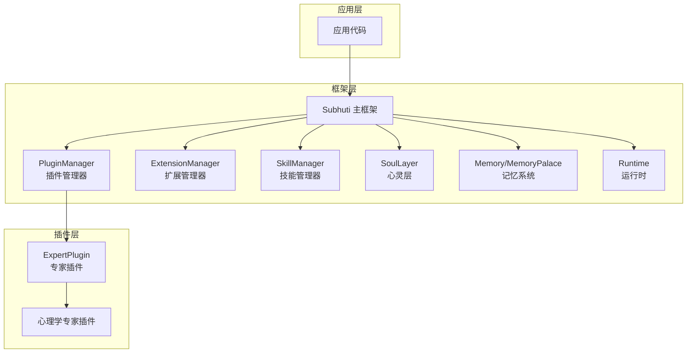
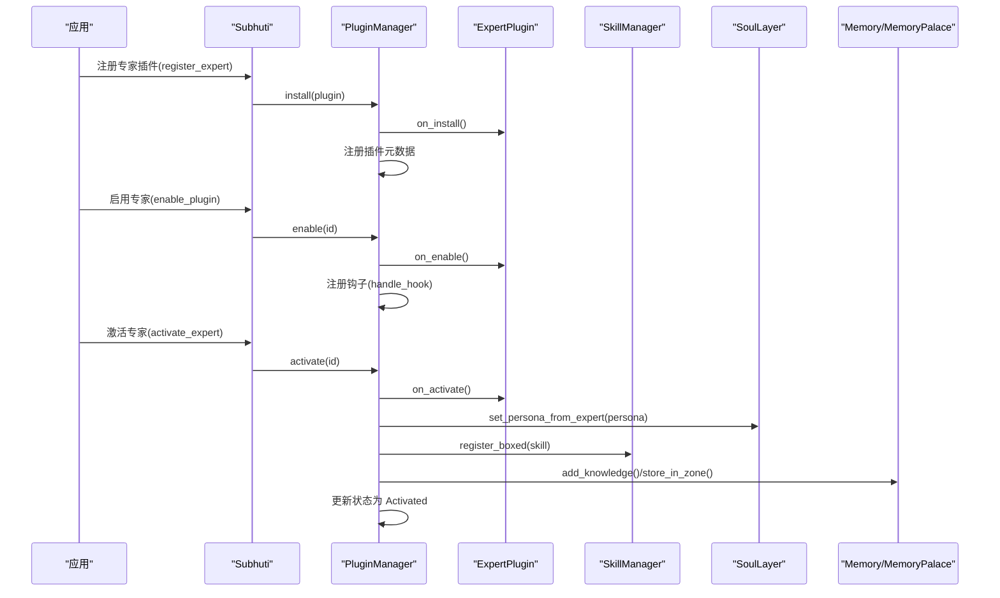
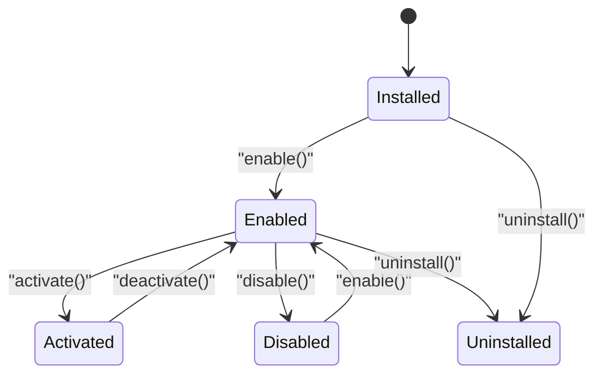
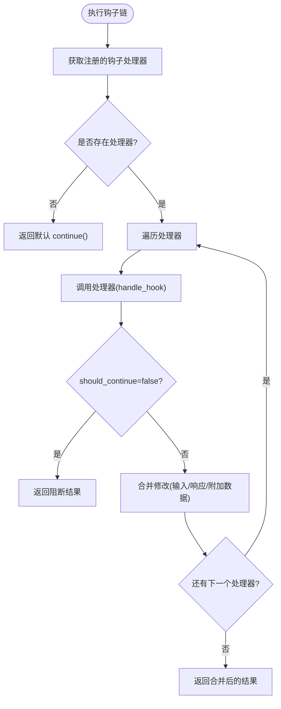
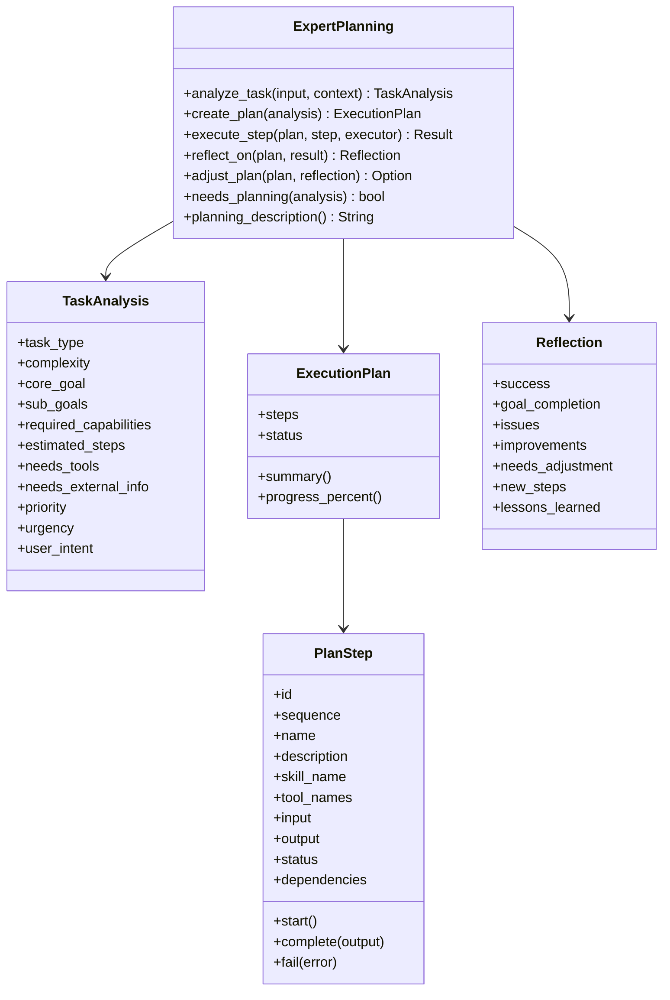
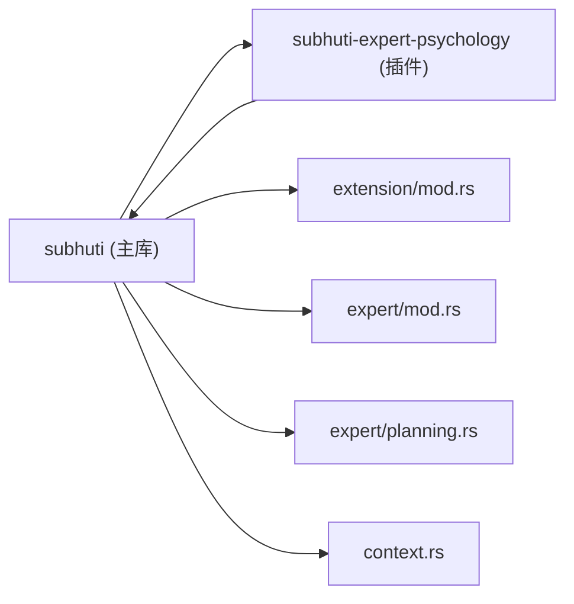

# 专家插件开发

<cite>
**本文档引用的文件**
- [lib.rs](file://crates/subhuti/src/lib.rs)
- [mod.rs](file://crates/subhuti/src/expert/mod.rs)
- [planning.rs](file://crates/subhuti/src/expert/planning.rs)
- [lib.rs](file://crates/subhuti-expert-psychology/src/lib.rs)
- [Cargo.toml](file://crates/subhuti/Cargo.toml)
- [Cargo.toml](file://crates/subhuti-expert-psychology/Cargo.toml)
- [test_hook_chain.rs](file://crates/subhuti/tests/test_hook_chain.rs)
- [mod.rs](file://crates/subhuti/src/extension/mod.rs)
- [context.rs](file://crates/subhuti/src/context.rs)
- [persona.json](file://crates/subhuti/data/persona.json)
- [test_expert.sh](file://test_expert.sh)
- [test_expert_v2.sh](file://test_expert_v2.sh)
</cite>

## 目录
1. [简介](#简介)
2. [项目结构](#项目结构)
3. [核心组件](#核心组件)
4. [架构概览](#架构概览)
5. [详细组件分析](#详细组件分析)
6. [依赖关系分析](#依赖关系分析)
7. [性能考量](#性能考量)
8. [故障排查指南](#故障排查指南)
9. [结论](#结论)
10. [附录](#附录)

## 简介
本指南面向希望基于 Subhuti 框架开发“专家插件”的开发者，系统讲解 ExpertPlugin trait 的实现要求、插件生命周期管理、权限控制、钩子系统、注册/激活/卸载流程、与主框架交互方式、自主规划能力（ExpertPlanning）的实现原理，以及插件清单（Manifest）的编写规范。文档还提供心理专家插件的完整实现示例、测试策略、性能分析与安全考虑等开发要点。

## 项目结构
Subhuti 采用“四层架构”：Memory、Runtime、Flow、Extension。专家插件系统位于 Extension 层之上，通过 PluginManager 管理插件的安装、启用、激活、停用、卸载，并与主框架的运行时、记忆系统、技能系统、心灵层进行交互。

图表来源
- [lib.rs:84-156](file://crates/subhuti/src/lib.rs#L84-L156)
- [mod.rs:767-802](file://crates/subhuti/src/expert/mod.rs#L767-L802)
- [mod.rs:1-227](file://crates/subhuti/src/extension/mod.rs#L1-L227)

章节来源
- [lib.rs:22-45](file://crates/subhuti/src/lib.rs#L22-L45)
- [lib.rs:84-156](file://crates/subhuti/src/lib.rs#L84-L156)

## 核心组件
- ExpertPlugin trait：定义插件的清单、角色、技能、知识库、生命周期钩子与匹配度计算。
- PluginManager：负责插件的安装、启用、激活、停用、卸载、钩子注册与执行、权限检查、沙箱限制。
- Hook 系统：支持多种 HookPoint，插件可注册钩子在关键节点插入自定义逻辑。
- ExpertPlanning trait：可选的自主规划能力，支持任务分析、执行计划、步骤执行与反思调整。
- 心灵层（SoulLayer）与记忆系统：插件激活时会覆盖 Persona 并注入知识库。
- 技能系统：插件可注册技能，由 SkillManager 管理与路由。

章节来源
- [mod.rs:664-760](file://crates/subhuti/src/expert/mod.rs#L664-L760)
- [mod.rs:767-1116](file://crates/subhuti/src/expert/mod.rs#L767-L1116)
- [planning.rs:414-469](file://crates/subhuti/src/expert/planning.rs#L414-L469)
- [lib.rs:232-354](file://crates/subhuti/src/lib.rs#L232-L354)

## 架构概览
专家插件系统围绕 PluginManager 构建，插件通过 ExpertPlugin trait 提供元数据与行为，PluginManager 负责状态机与生命周期钩子的触发。插件激活时，会将自身 Persona 注入心灵层，将技能注册到 SkillManager，将知识库注入记忆系统与心灵宫殿。

图表来源
- [lib.rs:234-306](file://crates/subhuti/src/lib.rs#L234-L306)
- [mod.rs:812-992](file://crates/subhuti/src/expert/mod.rs#L812-L992)

## 详细组件分析

### ExpertPlugin trait 实现要求
- 清单（manifest）：包含插件 ID、名称、描述、版本、作者、分类、关键词、依赖、最小框架版本、权限、沙箱、钩子点、主页、许可证等。
- 角色（persona）：定义专家姓名、描述、语气风格、情感倾向、大五人格、特质、专长领域、系统提示词。
- 技能（skills）：返回一组 Skill 实例，插件激活时注入 SkillManager。
- 知识库（knowledge）：返回一组 KnowledgeEntry，激活时注入记忆系统与心灵宫殿。
- 生命周期钩子：on_install/on_uninstall/on_enable/on_disable/on_activate/on_deactivate。
- 匹配度计算（matches）：基于关键词与名称计算与输入的匹配度。
- 钩子处理（handle_hook）：当插件注册了某 HookPoint 时，在对应时机被调用。

章节来源
- [mod.rs:107-166](file://crates/subhuti/src/expert/mod.rs#L107-L166)
- [mod.rs:552-597](file://crates/subhuti/src/expert/mod.rs#L552-L597)
- [mod.rs:664-760](file://crates/subhuti/src/expert/mod.rs#L664-L760)

### 插件生命周期管理
- 状态机：Installed → Enabled → Activated → Enabled → Disabled → Installed → Uninstalled。
- 安装：校验唯一性，执行 on_install，保存元数据。
- 启用：校验状态，注册钩子，执行 on_enable，更新状态。
- 激活：停用当前专家，校验状态与沙箱限制，注册技能，更新状态并记录请求。
- 停用：执行 on_deactivate，清理技能注册，回退状态。
- 卸载：校验未激活，执行 on_uninstall，清理技能，移除插件。

图表来源
- [mod.rs:603-631](file://crates/subhuti/src/expert/mod.rs#L603-L631)
- [mod.rs:812-992](file://crates/subhuti/src/expert/mod.rs#L812-L992)

章节来源
- [mod.rs:804-1116](file://crates/subhuti/src/expert/mod.rs#L804-L1116)

### 权限控制与沙箱
- 权限声明：文件读写、网络、数据库、代码执行、外部 API、域名白名单、路径白名单、修改心灵层、访问其他插件。
- 沙箱配置：启用开关、内存限制、最大执行时间、最大 Token、插件间隔离、每日请求限制、运行时计数。
- 权限检查：PluginManager.check_permission 根据插件清单中的 PluginPermissions 判断。
- 速率限制：SandboxConfig.is_rate_limited 与 record_request/reset_daily_counter。

章节来源
- [mod.rs:225-289](file://crates/subhuti/src/expert/mod.rs#L225-L289)
- [mod.rs:295-347](file://crates/subhuti/src/expert/mod.rs#L295-L347)
- [mod.rs:1096-1115](file://crates/subhuti/src/expert/mod.rs#L1096-L1115)

### 钩子系统
- 钩子点：BeforeRequest、BeforeSkillMatch、BeforeSkillExecute、AfterSkillExecute、BeforeLlmCall、AfterLlmCall、BeforeResponse、AfterResponse、BeforeMemorySearch、AfterMemorySearch、BeforeToolCall、AfterToolCall、OnExpertSwitch。
- 钩子上下文：包含 request_id、user_id、session_id、input、current_expert、timestamp。
- 钩子结果：should_continue、modified_input、modified_response、extra_data、error。
- HookRegistry：注册与执行钩子链，支持链式中断与结果合并。

图表来源
- [mod.rs:353-402](file://crates/subhuti/src/expert/mod.rs#L353-L402)
- [mod.rs:404-447](file://crates/subhuti/src/expert/mod.rs#L404-L447)
- [mod.rs:496-546](file://crates/subhuti/src/expert/mod.rs#L496-L546)

章节来源
- [mod.rs:353-546](file://crates/subhuti/src/expert/mod.rs#L353-L546)
- [test_hook_chain.rs:284-394](file://crates/subhuti/tests/test_hook_chain.rs#L284-L394)

### 专家规划能力（ExpertPlanning）
- 任务分析：analyze_task 返回 TaskAnalysis，包含任务类型、复杂度、核心目标、子目标、所需能力、估算步骤、是否需要工具/外部信息、优先级、紧急程度、用户意图。
- 执行计划：create_plan 返回 ExecutionPlan，包含步骤列表、状态、元数据、摘要。
- 步骤执行：execute_step 接收 plan 与 step，返回执行结果 Value。
- 反思调整：reflect_on 返回 Reflection，包含成功与否、目标完成度、问题、改进、是否需要调整、新步骤、经验教训。
- 可选调整：adjust_plan 基于反思结果生成新计划。

图表来源
- [planning.rs:414-469](file://crates/subhuti/src/expert/planning.rs#L414-L469)
- [planning.rs:68-111](file://crates/subhuti/src/expert/planning.rs#L68-L111)
- [planning.rs:222-347](file://crates/subhuti/src/expert/planning.rs#L222-L347)
- [planning.rs:113-203](file://crates/subhuti/src/expert/planning.rs#L113-L203)
- [planning.rs:378-409](file://crates/subhuti/src/expert/planning.rs#L378-L409)

章节来源
- [planning.rs:1-629](file://crates/subhuti/src/expert/planning.rs#L1-L629)

### 插件清单（Manifest）编写规范
- 基本信息：id、name、description、version、author（name/email/url）、category（枚举）、keywords。
- 依赖与版本：dependencies（其他插件 ID）、min_framework_version。
- 能力声明：permissions（文件/网络/数据库/代码执行/外部 API/白名单/心灵层/插件访问）、sandbox（启用/内存/时间/Token/隔离/每日限额）。
- 钩子点：hooks（注册的 HookPoint 列表）。
- 其他：homepage、license。

章节来源
- [mod.rs:107-166](file://crates/subhuti/src/expert/mod.rs#L107-L166)
- [mod.rs:176-220](file://crates/subhuti/src/expert/mod.rs#L176-L220)
- [mod.rs:225-289](file://crates/subhuti/src/expert/mod.rs#L225-L289)
- [mod.rs:295-347](file://crates/subhuti/src/expert/mod.rs#L295-L347)

### 插件与主框架交互
- 注册与启用：Subhuti.register_expert/install_plugin/enable_plugin。
- 激活与停用：activate_expert/deactivate_expert，激活时覆盖 Persona、注入技能、加载知识库。
- 钩子执行：Subhuti.execute_hook，贯穿请求生命周期。
- 技能路由：SkillManager 根据匹配度选择 Skill，或由 ExpertPlugin 的技能参与匹配。
- 心灵层与记忆：激活时 Persona 注入心灵层，知识库注入记忆与心灵宫殿。

章节来源
- [lib.rs:232-354](file://crates/subhuti/src/lib.rs#L232-L354)
- [lib.rs:274-320](file://crates/subhuti/src/lib.rs#L274-L320)
- [lib.rs:363-366](file://crates/subhuti/src/lib.rs#L363-L366)

### 心理专家插件实现示例
- 心理咨询专家插件展示了一个完整的 ExpertPlugin 实现：清单、角色、技能（mood_check、stress_relief）、知识库、钩子（BeforeResponse）、生命周期钩子。
- 心理危机干预钩子：在 BeforeResponse 钩子中检测关键词，必要时修改响应，提示用户寻求专业帮助。
- 技能实现：基于关键词匹配，返回简单流程模板的响应。

章节来源
- [lib.rs:39-193](file://crates/subhuti-expert-psychology/src/lib.rs#L39-L193)
- [lib.rs:196-300](file://crates/subhuti-expert-psychology/src/lib.rs#L196-L300)

## 依赖关系分析

图表来源
- [Cargo.toml:9-9](file://crates/subhuti-expert-psychology/Cargo.toml#L9-L9)
- [Cargo.toml:1-63](file://crates/subhuti/Cargo.toml#L1-L63)

章节来源
- [Cargo.toml:1-63](file://crates/subhuti/Cargo.toml#L1-L63)
- [Cargo.toml:1-15](file://crates/subhuti-expert-psychology/Cargo.toml#L1-L15)

## 性能考量
- 沙箱限制：通过 SandboxConfig 控制内存、执行时间、Token、每日限额，防止资源滥用。
- 钩子链开销：HookRegistry 串行执行，注意钩子数量与处理逻辑复杂度。
- 技能匹配：ExpertPlugin.matches 基于关键词，匹配度越高越可能被选中，需平衡关键词数量与准确性。
- 记忆注入：激活插件时批量注入知识库，注意 I/O 与索引构建成本。
- 心灵层演化的 LLM 调用：需控制提示词长度与 Token 消耗。

章节来源
- [mod.rs:295-347](file://crates/subhuti/src/expert/mod.rs#L295-L347)
- [mod.rs:735-752](file://crates/subhuti/src/expert/mod.rs#L735-L752)
- [lib.rs:408-508](file://crates/subhuti/src/lib.rs#L408-L508)

## 故障排查指南
- 插件状态异常：检查 PluginManager 的状态转换与错误信息，确认安装/启用/激活顺序是否正确。
- 钩子链中断：若某钩子返回 block，后续钩子不会执行，检查钩子处理逻辑与错误信息。
- 权限不足：使用 PluginManager.check_permission 检查插件权限，确认白名单配置。
- 沙箱限制：激活时报“今日调用次数已达上限”，检查 daily_request_limit 与 used_requests_today。
- Persona 未覆盖：确认激活流程是否成功，检查 Subhuti.activate_expert 的日志与返回值。
- 技能未生效：确认插件技能已注册到 SkillManager，且未被停用或卸载。

章节来源
- [test_hook_chain.rs:311-348](file://crates/subhuti/tests/test_hook_chain.rs#L311-L348)
- [test_hook_chain.rs:428-459](file://crates/subhuti/tests/test_hook_chain.rs#L428-L459)
- [test_hook_chain.rs:544-591](file://crates/subhuti/tests/test_hook_chain.rs#L544-L591)
- [lib.rs:274-320](file://crates/subhuti/src/lib.rs#L274-L320)

## 结论
Subhuti 的专家插件系统提供了完善的生命周期管理、权限控制、钩子机制与可选的自主规划能力。通过 PluginManager，插件可以无缝集成到主框架的运行时、记忆与技能体系中。开发者可基于心理专家插件示例快速实现自己的领域专家，并遵循清单规范、权限与沙箱配置，确保安全性与稳定性。

## 附录

### 插件开发最佳实践
- 清单完整性：确保清单包含必要的元数据、权限与钩子点声明。
- 权限最小化：仅申请必要权限，使用白名单限制网络与文件访问。
- 钩子幂等：钩子处理逻辑应幂等，避免副作用。
- 规划健壮性：ExpertPlanning 的分析与执行应考虑边界情况与错误处理。
- 测试覆盖：使用测试脚本与单元测试验证生命周期、钩子链、权限与沙箱行为。

章节来源
- [test_expert.sh:1-44](file://test_expert.sh#L1-L44)
- [test_expert_v2.sh:45-82](file://test_expert_v2.sh#L45-L82)

### 心理专家插件测试要点
- 清单与角色：验证清单字段、Persona 参数（如宜人性）。
- 技能匹配：验证关键词匹配与优先级。
- 钩子行为：BeforeResponse 钩子对心理危机关键词的检测与响应修改。
- 激活效果：Persona 覆盖、技能注入、知识库加载。

章节来源
- [lib.rs:302-347](file://crates/subhuti-expert-psychology/src/lib.rs#L302-L347)
- [test_expert.sh:27-44](file://test_expert.sh#L27-L44)
- [test_expert_v2.sh:60-82](file://test_expert_v2.sh#L60-L82)