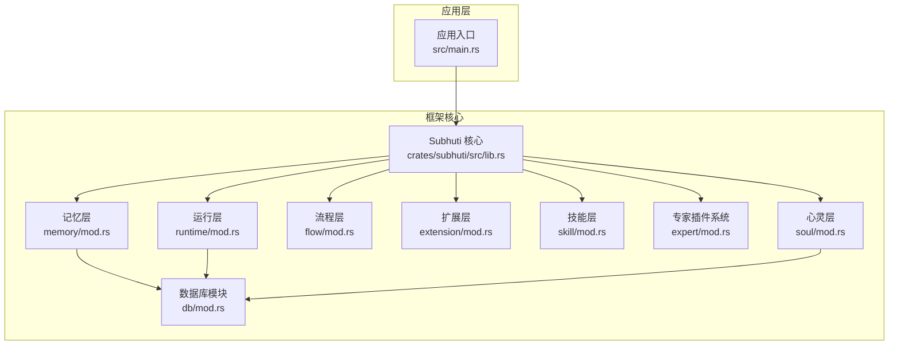
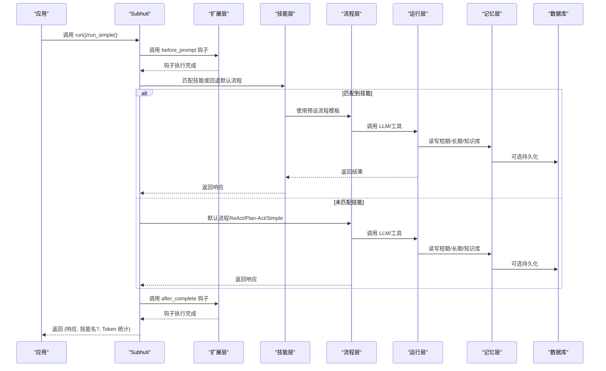
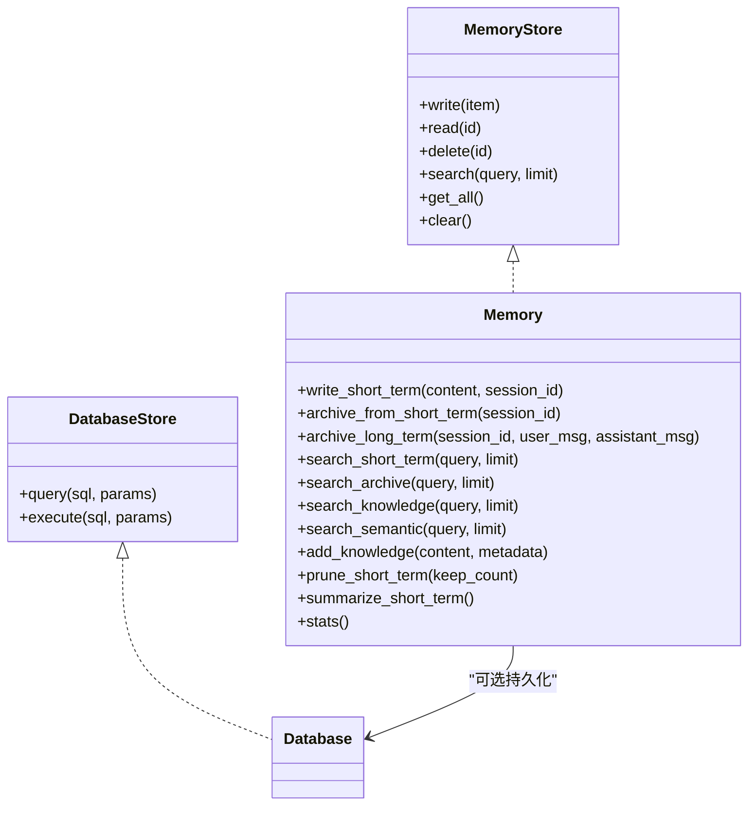
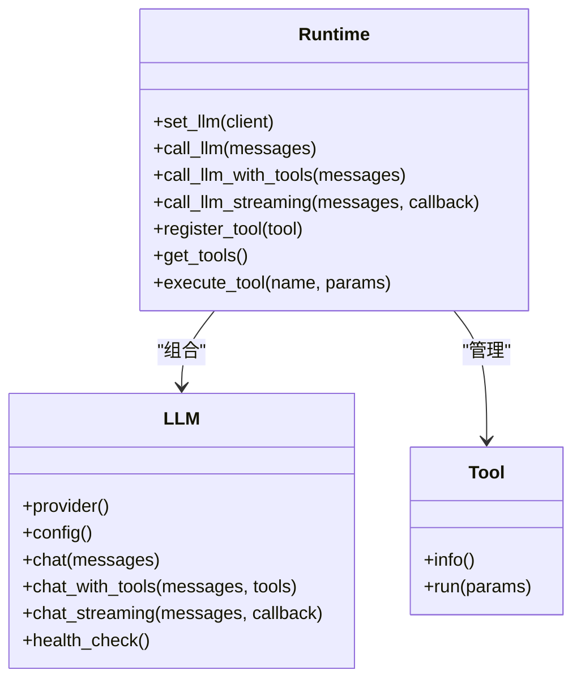
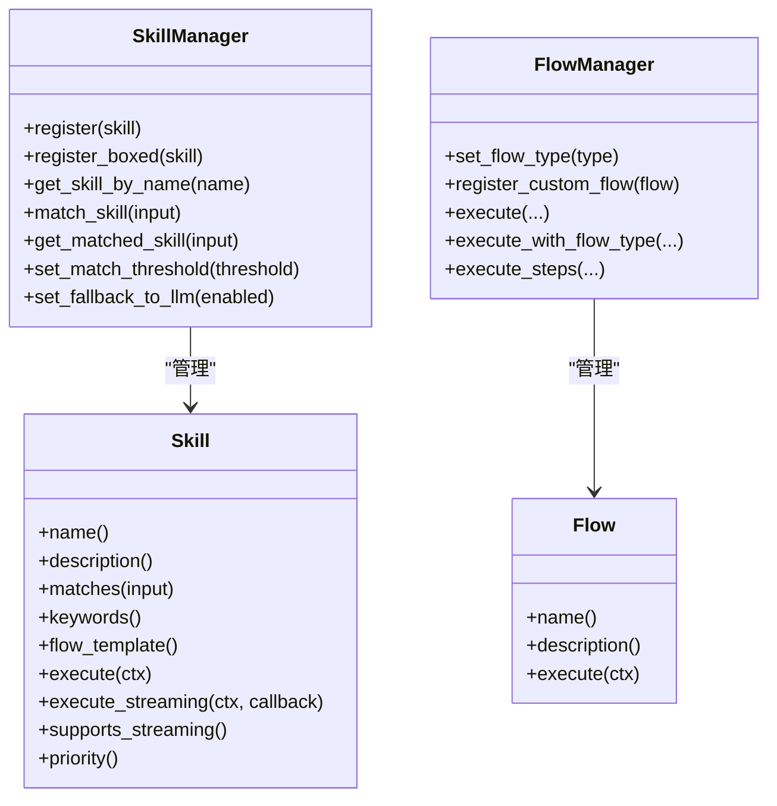
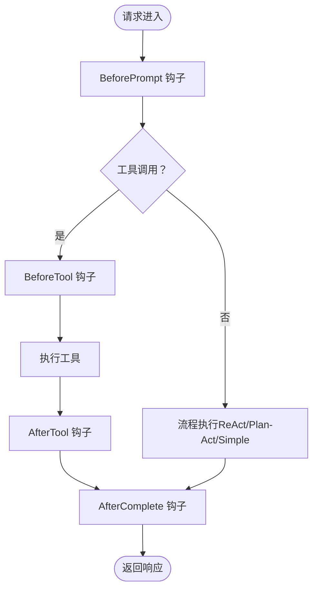
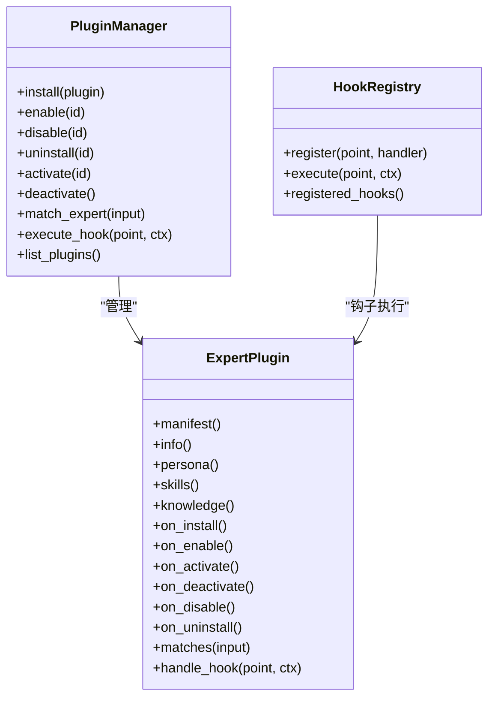
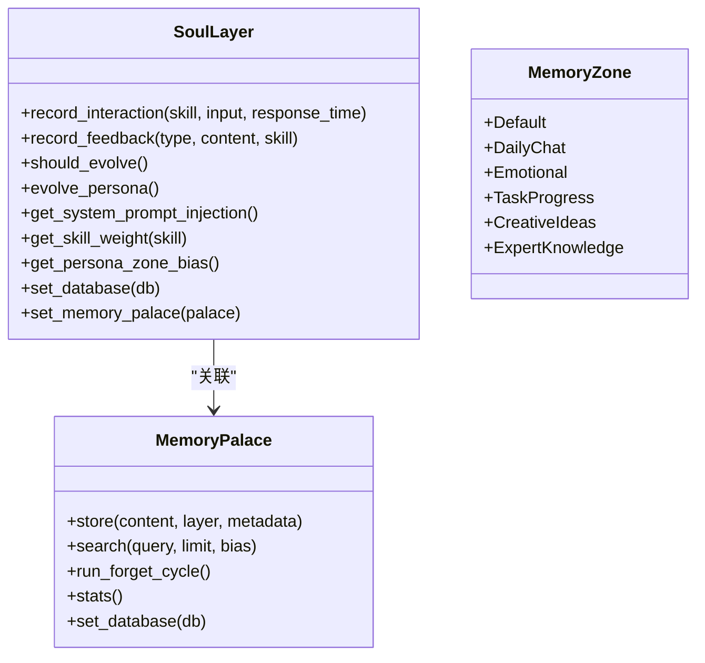
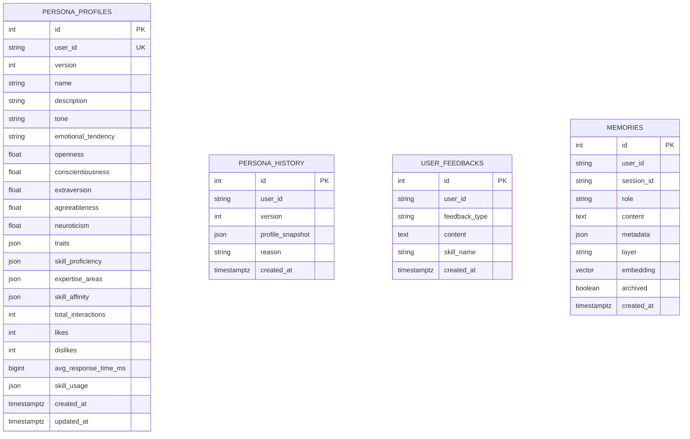
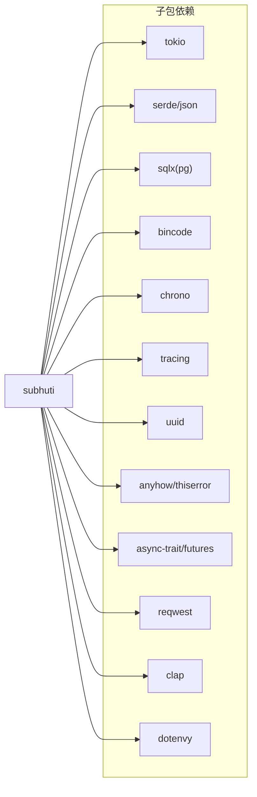

# 开发指南

<cite>
**本文引用的文件**
- [lib.rs](file://crates/subhuti/src/lib.rs)
- [mod.rs（记忆层）](file://crates/subhuti/src/memory/mod.rs)
- [mod.rs（运行层）](file://crates/subhuti/src/runtime/mod.rs)
- [mod.rs（LLM 抽象层）](file://crates/subhuti/src/runtime/llm/mod.rs)
- [mod.rs（技能层）](file://crates/subhuti/src/skill/mod.rs)
- [mod.rs（专家插件系统）](file://crates/subhuti/src/expert/mod.rs)
- [mod.rs（扩展层）](file://crates/subhuti/src/extension/mod.rs)
- [mod.rs（流程层）](file://crates/subhuti/src/flow/mod.rs)
- [mod.rs（心灵层）](file://crates/subhuti/src/soul/mod.rs)
- [mod.rs（数据库模块）](file://crates/subhuti/src/db/mod.rs)
- [main.rs（应用入口）](file://src/main.rs)
- [Cargo.toml（子包）](file://crates/subhuti/Cargo.toml)
- [Cargo.toml（工作区）](file://Cargo.toml)
- [persona.json（默认人格数据）](file://crates/subhuti/data/persona.json)
- [integration_test.rs（集成测试）](file://crates/subhuti/tests/integration_test.rs)
</cite>

## 目录
1. [简介](#简介)
2. [项目结构](#项目结构)
3. [核心组件](#核心组件)
4. [架构总览](#架构总览)
5. [详细组件分析](#详细组件分析)
6. [依赖关系分析](#依赖关系分析)
7. [性能考虑](#性能考虑)
8. [故障排查指南](#故障排查指南)
9. [结论](#结论)
10. [附录](#附录)

## 简介
本指南面向希望扩展 Subhuti 框架的开发者，覆盖以下主题：
- 扩展框架功能：自定义技能（Skill Interface Implementation）、专家插件（Plugin Development）、自定义存储后端（Custom Storage Backend）
- 内存存储接口（MemoryStore）实现规范：数据模型设计、查询优化、事务处理
- LLM 提供商集成（LLM Provider Integration）：接口适配、配置管理、性能优化
- 完整开发示例：代码模板、最佳实践、测试策略
- 调试技巧、性能分析、代码审查要点
- 从原型开发到生产部署的完整开发生命周期

## 项目结构
Subhuti 采用“四层架构”：Memory（记忆层）、Runtime（运行层）、Flow（流程层）、Extension（扩展层）。核心模块如下：
- 记忆层：短期/长期/知识库三层记忆，支持向量检索与持久化
- 运行层：LLM 抽象、工具系统、约束护栏、会话管理
- 流程层：ReAct/Plan-Act/Simple 等流程策略，支持自定义流程
- 扩展层：Hook 生命周期钩子，支持日志、敏感词过滤、Token 统计等
- 技能层：纯代码风格的技能系统，支持预设流程模板
- 专家插件系统：插件生命周期、权限与沙箱、钩子系统
- 心灵层：动态人格养成与演化，结合记忆宫殿

图表来源
- [lib.rs:1-120](file://crates/subhuti/src/lib.rs#L1-L120)
- [mod.rs（记忆层）:1-120](file://crates/subhuti/src/memory/mod.rs#L1-L120)
- [mod.rs（运行层）:1-120](file://crates/subhuti/src/runtime/mod.rs#L1-L120)
- [mod.rs（流程层）:1-120](file://crates/subhuti/src/flow/mod.rs#L1-L120)
- [mod.rs（扩展层）:1-120](file://crates/subhuti/src/extension/mod.rs#L1-L120)
- [mod.rs（技能层）:1-120](file://crates/subhuti/src/skill/mod.rs#L1-L120)
- [mod.rs（专家插件系统）:1-120](file://crates/subhuti/src/expert/mod.rs#L1-L120)
- [mod.rs（心灵层）:1-120](file://crates/subhuti/src/soul/mod.rs#L1-L120)
- [mod.rs（数据库模块）:1-120](file://crates/subhuti/src/db/mod.rs#L1-L120)

章节来源
- [lib.rs:1-120](file://crates/subhuti/src/lib.rs#L1-L120)
- [Cargo.toml（子包）:1-63](file://crates/subhuti/Cargo.toml#L1-L63)
- [Cargo.toml（工作区）:1-58](file://Cargo.toml#L1-L58)

## 核心组件
- Subhuti 主入口：负责实例化与装配各子系统，提供 run/run_simple 等高层 API
- Memory：统一记忆管理器，支持三层记忆与向量检索，可选数据库持久化
- Runtime：统一 LLM 抽象与工具系统，支持流式/非流式、工具调用、重试机制
- Flow：流程策略管理器，支持内置与自定义流程
- Extension：Hook 生命周期钩子，支持日志、敏感词过滤、Token 统计
- Skill：纯代码风格技能系统，支持预设流程模板与流式执行
- Expert：专家插件系统，支持清单、生命周期、权限与钩子
- Soul：动态人格养成与演化，结合记忆宫殿
- Database：PostgreSQL 集成，pgvector 扩展支持

章节来源
- [lib.rs:84-215](file://crates/subhuti/src/lib.rs#L84-L215)
- [mod.rs（记忆层）:163-258](file://crates/subhuti/src/memory/mod.rs#L163-L258)
- [mod.rs（运行层）:57-120](file://crates/subhuti/src/runtime/mod.rs#L57-L120)
- [mod.rs（流程层）:677-722](file://crates/subhuti/src/flow/mod.rs#L677-L722)
- [mod.rs（扩展层）:112-172](file://crates/subhuti/src/extension/mod.rs#L112-L172)
- [mod.rs（技能层）:451-566](file://crates/subhuti/src/skill/mod.rs#L451-L566)
- [mod.rs（专家插件系统）:766-800](file://crates/subhuti/src/expert/mod.rs#L766-L800)
- [mod.rs（心灵层）:330-387](file://crates/subhuti/src/soul/mod.rs#L330-L387)
- [mod.rs（数据库模块）:44-120](file://crates/subhuti/src/db/mod.rs#L44-L120)

## 架构总览
Subhuti 的执行路径：应用调用 Subhuti.run，经过 Extension 钩子、Skill 匹配或默认 Flow，最终由 Runtime 调用 LLM 与工具，并通过 Memory 与 Database 完成记忆与持久化。

图表来源
- [lib.rs:644-731](file://crates/subhuti/src/lib.rs#L644-L731)
- [mod.rs（扩展层）:174-206](file://crates/subhuti/src/extension/mod.rs#L174-L206)
- [mod.rs（技能层）:255-317](file://crates/subhuti/src/skill/mod.rs#L255-L317)
- [mod.rs（流程层）:729-771](file://crates/subhuti/src/flow/mod.rs#L729-L771)
- [mod.rs（运行层）:135-163](file://crates/subhuti/src/runtime/mod.rs#L135-L163)
- [mod.rs（记忆层）:260-318](file://crates/subhuti/src/memory/mod.rs#L260-L318)

## 详细组件分析

### 记忆层（Memory）与存储接口（MemoryStore）
- 数据模型
  - MemoryItem：内容、元数据、创建时间、记忆层级、会话关联
  - MemoryLayer：ShortTerm/Archive/Knowledge
  - MemoryConfig：容量、归档阈值、向量维度、TTL
- 接口规范
  - MemoryStore：write/read/delete/search/get_all/clear
  - DatabaseStore：query/execute（异步）
- 核心能力
  - 短期记忆滑动窗口与归档
  - 长期记忆检索
  - 知识库向量检索（需数据库与 Embedding 服务）
  - 双写策略：内存 + 数据库
- 查询优化
  - 关键词索引（SkillManager）与倒排索引
  - TTL 过期检查
  - 分区偏好（SoulLayer 人格影响）
- 事务处理
  - 数据库持久化采用 SQLX 连接池
  - 向量更新异步化，避免阻塞主线程

图表来源
- [mod.rs（记忆层）:134-162](file://crates/subhuti/src/memory/mod.rs#L134-L162)
- [mod.rs（记忆层）:163-444](file://crates/subhuti/src/memory/mod.rs#L163-L444)
- [mod.rs（数据库模块）:44-120](file://crates/subhuti/src/db/mod.rs#L44-L120)

章节来源
- [mod.rs（记忆层）:30-120](file://crates/subhuti/src/memory/mod.rs#L30-L120)
- [mod.rs（记忆层）:134-258](file://crates/subhuti/src/memory/mod.rs#L134-L258)
- [mod.rs（数据库模块）:11-120](file://crates/subhuti/src/db/mod.rs#L11-L120)

### 运行层（Runtime）与 LLM 抽象
- LLM 抽象
  - LLM trait：chat/chat_with_tools/chat_streaming/health_check
  - LLMProvider：OpenAI/Ollama/Doubao/Custom
  - LLMConfig：模型、API 地址、密钥、温度、最大 token
- 工具系统
  - Tool trait：info/run
  - ToolInfo/FunctionDefinition
- 约束护栏
  - 最大轮次、上下文 token、超时、温度/最大 token 默认值
- 流式输出与工具调用
  - 支持回调式流式输出
  - 工具调用参数 Schema 校验

图表来源
- [mod.rs（运行层）:57-248](file://crates/subhuti/src/runtime/mod.rs#L57-L248)
- [mod.rs（LLM 抽象层）:124-148](file://crates/subhuti/src/runtime/llm/mod.rs#L124-L148)

章节来源
- [mod.rs（运行层）:30-120](file://crates/subhuti/src/runtime/mod.rs#L30-L120)
- [mod.rs（LLM 抽象层）:83-148](file://crates/subhuti/src/runtime/llm/mod.rs#L83-L148)

### 技能层（Skill）与流程层（Flow）
- 技能系统
  - Skill trait：name/description/matches/keywords/flow_template/execute
  - SkillContext：输入、会话、运行时、记忆、Token 统计、流式工具调用
  - SkillManager：名称索引、关键词倒排索引、匹配阈值、优先级
- 流程系统
  - Flow trait：execute
  - FlowType：Simple/React/PlanAct/Custom
  - FlowContext：状态机、上下文数据、步骤执行（工具/知识库/LLM/条件/记忆/并行/循环）

图表来源
- [mod.rs（技能层）:255-405](file://crates/subhuti/src/skill/mod.rs#L255-L405)
- [mod.rs（技能层）:451-800](file://crates/subhuti/src/skill/mod.rs#L451-L800)
- [mod.rs（流程层）:631-675](file://crates/subhuti/src/flow/mod.rs#L631-L675)
- [mod.rs（流程层）:677-800](file://crates/subhuti/src/flow/mod.rs#L677-L800)

章节来源
- [mod.rs（技能层）:115-235](file://crates/subhuti/src/skill/mod.rs#L115-L235)
- [mod.rs（技能层）:451-761](file://crates/subhuti/src/skill/mod.rs#L451-L761)
- [mod.rs（流程层）:229-310](file://crates/subhuti/src/flow/mod.rs#L229-L310)
- [mod.rs（流程层）:677-794](file://crates/subhuti/src/flow/mod.rs#L677-L794)

### 扩展层（Extension）与 Hook 生命周期
- Hook 生命周期：BeforePrompt/BeforeTool/AfterTool/AfterComplete
- 内置 Hook：LoggingHook、SensitiveWordFilterHook、TokenCountHook
- ExtensionManager：注册扩展、按阶段执行钩子

图表来源
- [mod.rs（扩展层）:29-41](file://crates/subhuti/src/extension/mod.rs#L29-L41)
- [mod.rs（扩展层）:174-226](file://crates/subhuti/src/extension/mod.rs#L174-L226)

章节来源
- [mod.rs（扩展层）:112-227](file://crates/subhuti/src/extension/mod.rs#L112-L227)

### 专家插件系统（ExpertPlugin）
- 清单与权限：PluginManifest、PluginPermissions、SandboxConfig
- 钩子系统：HookPoint、HookContext、HookResult、HookRegistry
- 生命周期：Installed/Enabled/Activated/Disabled/Uninstalled
- PluginManager：安装/启用/停用/卸载、钩子执行、专家匹配

图表来源
- [mod.rs（专家插件系统）:664-760](file://crates/subhuti/src/expert/mod.rs#L664-L760)
- [mod.rs（专家插件系统）:766-800](file://crates/subhuti/src/expert/mod.rs#L766-L800)
- [mod.rs（专家插件系统）:496-546](file://crates/subhuti/src/expert/mod.rs#L496-L546)

章节来源
- [mod.rs（专家插件系统）:107-220](file://crates/subhuti/src/expert/mod.rs#L107-L220)
- [mod.rs（专家插件系统）:225-347](file://crates/subhuti/src/expert/mod.rs#L225-L347)
- [mod.rs（专家插件系统）:353-491](file://crates/subhuti/src/expert/mod.rs#L353-L491)
- [mod.rs（专家插件系统）:664-760](file://crates/subhuti/src/expert/mod.rs#L664-L760)

### 心灵层（Soul）与记忆宫殿（MemoryPalace）
- 人格系统：BigFive、ToneStyle、EmotionalTendency、PersonaProfile、InteractionStats
- 演化引擎：统计分析轨道 + LLM 自反思轨道
- 记忆宫殿：分区（MemoryZone）、联想网络、遗忘周期、分区偏好

图表来源
- [mod.rs（心灵层）:330-502](file://crates/subhuti/src/soul/mod.rs#L330-L502)
- [mod.rs（心灵层）:504-528](file://crates/subhuti/src/soul/mod.rs#L504-L528)
- [mod.rs（心灵层）:575-621](file://crates/subhuti/src/soul/mod.rs#L575-L621)
- [mod.rs（心灵层）:690-735](file://crates/subhuti/src/soul/mod.rs#L690-L735)
- [mod.rs（心灵层）:819-845](file://crates/subhuti/src/soul/mod.rs#L819-L845)

章节来源
- [mod.rs（心灵层）:203-271](file://crates/subhuti/src/soul/mod.rs#L203-L271)
- [mod.rs（心灵层）:297-350](file://crates/subhuti/src/soul/mod.rs#L297-L350)
- [mod.rs（心灵层）:419-445](file://crates/subhuti/src/soul/mod.rs#L419-L445)

### 数据库模块（PostgreSQL + pgvector）
- 表结构：persona_profiles、persona_history、user_feedbacks、memories
- 能力：Persona CRUD、Feedback CRUD、Memory CRUD、向量检索
- 索引：user_id、layer、archived、feedbacks、history

图表来源
- [mod.rs（数据库模块）:11-180](file://crates/subhuti/src/db/mod.rs#L11-L180)
- [mod.rs（数据库模块）:182-244](file://crates/subhuti/src/db/mod.rs#L182-L244)
- [mod.rs（数据库模块）:416-592](file://crates/subhuti/src/db/mod.rs#L416-L592)

章节来源
- [mod.rs（数据库模块）:11-180](file://crates/subhuti/src/db/mod.rs#L11-L180)
- [mod.rs（数据库模块）:182-244](file://crates/subhuti/src/db/mod.rs#L182-L244)

## 依赖关系分析
- 依赖管理：Tokio、Serde、sqlx、bincode、chrono、tracing、uuid、thiserror/anyhow、async-trait、futures、reqwest、clap、dotenvy
- 特性开关：openai、ollama
- 工作区成员：subhuti、subhuti-expert-psychology

图表来源
- [Cargo.toml（子包）:14-58](file://crates/subhuti/Cargo.toml#L14-L58)

章节来源
- [Cargo.toml（子包）:1-63](file://crates/subhuti/Cargo.toml#L1-L63)
- [Cargo.toml（工作区）:1-58](file://Cargo.toml#L1-L58)

## 性能考虑
- 记忆层
  - 使用 Arc<RwLock<...>> 降低锁竞争
  - 归档阈值与滑动窗口控制短期记忆容量
  - 向量检索异步更新 embedding，避免阻塞
- 运行层
  - LLM 调用支持流式输出，降低首字节延迟
  - 工具调用参数 Schema 校验，减少无效调用
- 技能层
  - 关键词索引 + 倒排索引，O(k) 候选集筛选
  - 优先级排序，相同匹配度按优先级选择
- 扩展层
  - 钩子按阶段执行，避免全局锁持有
- 数据库
  - 连接池配置与索引优化，向量检索使用 pgvector

## 故障排查指南
- 健康检查
  - Subhuti.health_check() 输出各组件状态
  - 记忆宫殿、数据库、心灵层、专家插件、技能数量
- 调试工具
  - TestTracker：集成测试汇总
  - diagnose_value/measure_time/debug_print：诊断与性能测量
- 常见问题
  - LLM 未配置：Runtime.has_llm() 为 false
  - 数据库未连接：Memory.has_database()/has_embedding() 为 false
  - 敏感词过滤：BeforePrompt 钩子检测到违禁词会直接报错
  - 向量检索失败：确认数据库与 Embedding 服务均已初始化

章节来源
- [lib.rs:562-642](file://crates/subhuti/src/lib.rs#L562-L642)
- [integration_test.rs:198-216](file://crates/subhuti/tests/integration_test.rs#L198-L216)
- [mod.rs（扩展层）:301-320](file://crates/subhuti/src/extension/mod.rs#L301-L320)

## 结论
Subhuti 框架通过清晰的四层架构与丰富的扩展点，提供了从记忆、运行、流程到扩展的完整 Agent 能力。开发者可基于 MemoryStore/LLM 抽象、Skill/Flow 模板、Hook 生命周期与专家插件系统，快速构建定制化的智能体应用。配合数据库与向量检索，可在生产环境中实现高性能与可维护性的平衡。

## 附录

### 开发示例与最佳实践
- 自定义技能（Skill）
  - 实现 Skill trait，定义 matches/flow_template/execute
  - 使用 SkillContext 调用 LLM 与工具，累积 Token 统计
  - 通过 SkillManager.register 注册，设置匹配阈值与优先级
- 专家插件（ExpertPlugin）
  - 实现 ExpertPlugin，提供清单、权限、钩子与生命周期方法
  - 通过 PluginManager.install/enable/activate 管理插件
  - 在钩子中修改输入/响应或执行自定义逻辑
- 自定义存储后端（Custom Storage Backend）
  - 实现 MemoryStore/DatabaseStore 接口
  - 在 Memory.set_database/set_embedding 注入后端
  - 保持线程安全与异步写入策略
- LLM 提供商集成（LLM Provider Integration）
  - 实现 LLM trait 或使用现有 OpenAI/Ollama/Doubao 客户端
  - 通过 Runtime.with_config_and_llm 自动初始化
  - 配置重试机制与流式输出回调

章节来源
- [mod.rs（技能层）:255-317](file://crates/subhuti/src/skill/mod.rs#L255-L317)
- [mod.rs（技能层）:451-566](file://crates/subhuti/src/skill/mod.rs#L451-L566)
- [mod.rs（专家插件系统）:664-760](file://crates/subhuti/src/expert/mod.rs#L664-L760)
- [mod.rs（运行层）:89-120](file://crates/subhuti/src/runtime/mod.rs#L89-L120)
- [mod.rs（记忆层）:216-258](file://crates/subhuti/src/memory/mod.rs#L216-L258)

### 测试策略
- 单元测试：各模块独立测试（如 Memory、Runtime、Skill、Flow、Extension、Expert、Soul、DB）
- 集成测试：integration_test.rs 展示端到端流程与调试工具使用
- 性能测试：使用 measure_time 与 TestTracker 统计耗时与成功率

章节来源
- [integration_test.rs:1-190](file://crates/subhuti/tests/integration_test.rs#L1-L190)

### 代码审查要点
- 记忆层
  - 线程安全：Arc<RwLock<...>> 使用是否合理
  - TTL 与归档策略是否一致
  - 向量检索是否在数据库与 Embedding 服务就绪时才启用
- 运行层
  - LLM 客户端初始化是否成功
  - 工具调用参数 Schema 是否严格校验
  - 流式输出回调是否正确处理
- 技能层
  - 关键词索引是否覆盖常用触发词
  - 匹配阈值与优先级是否合理
- 扩展层
  - 钩子是否幂等且无副作用
  - 敏感词过滤是否可配置
- 专家插件系统
  - 权限与沙箱配置是否最小化
  - 钩子链是否短路与合并
- 心灵层
  - 演化触发阈值与权重是否可调
  - 记忆宫殿分区偏好是否与 BigFive 映射一致
- 数据库
  - 连接池大小与索引是否匹配负载
  - 向量维度是否与 pgvector 一致