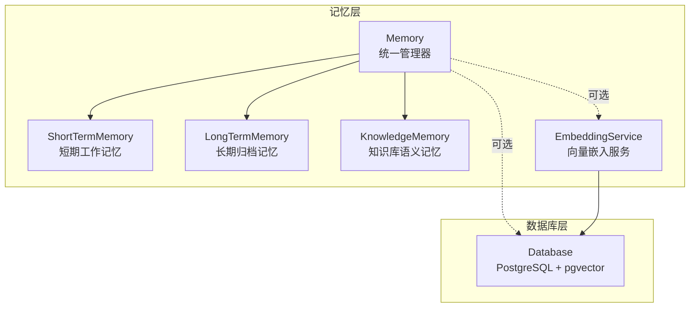
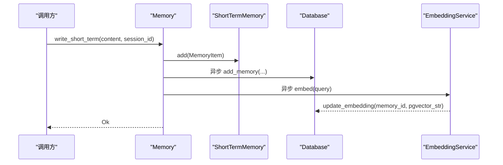
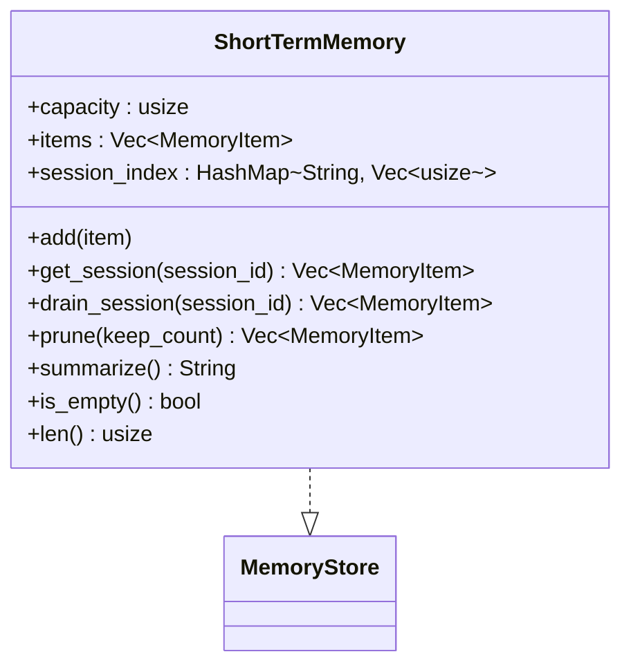
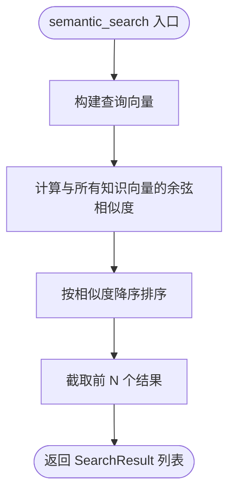
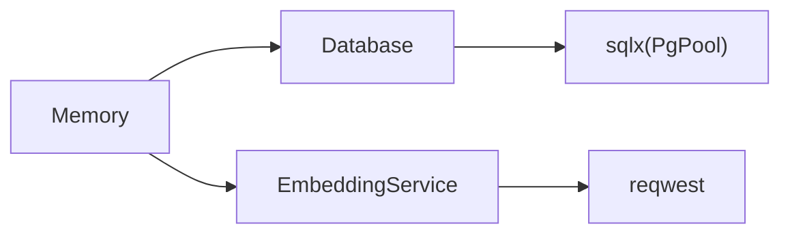

# 自定义存储后端

<cite>
**本文档引用的文件**
- [crates/subhuti/src/memory/mod.rs](file://crates/subhuti/src/memory/mod.rs)
- [crates/subhuti/src/memory/short_term.rs](file://crates/subhuti/src/memory/short_term.rs)
- [crates/subhuti/src/memory/long_term.rs](file://crates/subhuti/src/memory/long_term.rs)
- [crates/subhuti/src/memory/knowledge.rs](file://crates/subhuti/src/memory/knowledge.rs)
- [crates/subhuti/src/memory/embedding.rs](file://crates/subhuti/src/memory/embedding.rs)
- [crates/subhuti/src/db/mod.rs](file://crates/subhuti/src/db/mod.rs)
- [crates/subhuti/src/lib.rs](file://crates/subhuti/src/lib.rs)
- [crates/subhuti/tests/performance_test.rs](file://crates/subhuti/tests/performance_test.rs)
- [crates/subhuti/tests/integration_test.rs](file://crates/subhuti/tests/integration_test.rs)
- [crates/subhuti/src/debug.rs](file://crates/subhuti/src/debug.rs)
- [Cargo.toml](file://Cargo.toml)
</cite>

## 目录
1. [简介](#简介)
2. [项目结构](#项目结构)
3. [核心组件](#核心组件)
4. [架构概览](#架构概览)
5. [详细组件分析](#详细组件分析)
6. [依赖分析](#依赖分析)
7. [性能考虑](#性能考虑)
8. [故障排除指南](#故障排除指南)
9. [结论](#结论)
10. [附录](#附录)

## 简介
本指南面向希望为 Subhuti 框架开发自定义存储后端的开发者，重点围绕 MemoryStore trait 的实现规范、不同存储类型的差异、数据库集成最佳实践、向量数据库集成方案、数据迁移与运维策略，以及测试与性能基准方法。文档中的所有技术细节均来自仓库现有实现，确保可操作性和一致性。

## 项目结构
Subhuti 将记忆层（Memory Layer）作为四层架构之一，负责短期/长期/知识库的记忆存储与检索，并通过统一的 Memory 管理器协调短期、长期与知识库三类存储，同时支持可选的数据库持久化与向量嵌入服务。



**图表来源**
- [crates/subhuti/src/memory/mod.rs:163-183](file://crates/subhuti/src/memory/mod.rs#L163-L183)
- [crates/subhuti/src/db/mod.rs:44-63](file://crates/subhuti/src/db/mod.rs#L44-L63)

**章节来源**
- [crates/subhuti/src/memory/mod.rs:1-120](file://crates/subhuti/src/memory/mod.rs#L1-L120)
- [crates/subhuti/src/db/mod.rs:1-60](file://crates/subhuti/src/db/mod.rs#L1-L60)

## 核心组件
- MemoryStore trait：定义统一的记忆存储接口，包括写入、读取、删除、文本搜索、全量获取与清空等方法，为短期、长期与知识库三类存储提供一致的行为契约。
- Memory 管理器：聚合短期、长期与知识库三类存储，提供双写策略（内存+数据库），并支持运行时配置数据库与向量嵌入服务。
- Database：提供 PostgreSQL 集成，支持 pgvector 扩展，包含表结构初始化、索引、迁移与向量相似度搜索等能力。
- EmbeddingService：封装 Ollama 的 embedding API，支持生成向量并转换为 pgvector 字符串格式，用于向量相似度搜索。

**章节来源**
- [crates/subhuti/src/memory/mod.rs:134-148](file://crates/subhuti/src/memory/mod.rs#L134-L148)
- [crates/subhuti/src/memory/mod.rs:163-258](file://crates/subhuti/src/memory/mod.rs#L163-L258)
- [crates/subhuti/src/db/mod.rs:44-180](file://crates/subhuti/src/db/mod.rs#L44-L180)
- [crates/subhuti/src/memory/embedding.rs:29-98](file://crates/subhuti/src/memory/embedding.rs#L29-L98)

## 架构概览
Memory 管理器在写入短期记忆时，采用“内存写入 + 异步数据库双写”的策略；当达到阈值时，短期记忆会被归档至长期记忆；知识库采用简化的向量表示用于演示，实际项目可替换为专业向量数据库；数据库层提供向量相似度搜索能力，配合 EmbeddingService 实现语义检索。



**图表来源**
- [crates/subhuti/src/memory/mod.rs:260-318](file://crates/subhuti/src/memory/mod.rs#L260-L318)
- [crates/subhuti/src/db/mod.rs:418-444](file://crates/subhuti/src/db/mod.rs#L418-L444)
- [crates/subhuti/src/memory/embedding.rs:50-98](file://crates/subhuti/src/memory/embedding.rs#L50-L98)

**章节来源**
- [crates/subhuti/src/memory/mod.rs:260-407](file://crates/subhuti/src/memory/mod.rs#L260-L407)

## 详细组件分析

### MemoryStore trait 实现规范
- 必备方法
  - write：写入 MemoryItem，短期/长期/知识库各自维护 add 语义，MemoryStore 的 write 通常作为占位或委托。
  - read/delete/get_all：提供按 id 的读取与删除，以及全量获取。
  - search：提供文本搜索，返回 SearchResult 列表，包含 item 与 score。
  - clear：清空存储。
- 语义约定
  - MemoryItem 包含 id、content、created_at、metadata、layer、session_id 等字段，用于区分记忆层级与会话关联。
  - MemoryLayer 枚举区分 ShortTerm、Archive、Knowledge 三层。
- 线程安全
  - MemoryStore 本身要求 Send + Sync，具体实现需保证并发安全（如使用互斥锁或原子类型）。

**章节来源**
- [crates/subhuti/src/memory/mod.rs:54-148](file://crates/subhuti/src/memory/mod.rs#L54-L148)

### 短期工作记忆（ShortTermMemory）
- 特点
  - 基于固定容量的滑动窗口，超出容量时移除最旧项。
  - 维护 session_id 到索引的映射，便于按会话检索与归档。
  - 提供摘要生成、裁剪与按会话提取等实用方法。
- 搜索策略
  - 文本包含匹配，返回固定分数的 SearchResult。



**图表来源**
- [crates/subhuti/src/memory/short_term.rs:10-158](file://crates/subhuti/src/memory/short_term.rs#L10-L158)

**章节来源**
- [crates/subhuti/src/memory/short_term.rs:20-158](file://crates/subhuti/src/memory/short_term.rs#L20-L158)

### 长期归档记忆（LongTermMemory）
- 特点
  - 无容量限制，维护 items、session_index 与关键词索引（keyword_index）。
  - 提供按会话检索与时间范围查询占位（待实现）。
- 搜索策略
  - 文本包含匹配，返回固定分数的 SearchResult。

**章节来源**
- [crates/subhuti/src/memory/long_term.rs:21-129](file://crates/subhuti/src/memory/long_term.rs#L21-L129)

### 知识库语义记忆（KnowledgeMemory）
- 特点
  - 简化向量表示（词袋模型 + 归一化），演示向量相似度计算。
  - 提供 semantic_search，按余弦相似度排序返回 SearchResult。
- 实际应用
  - 建议替换为专业向量数据库（如 pgvector、chromadb、qdrant 等）以获得更好的性能与功能。



**图表来源**
- [crates/subhuti/src/memory/knowledge.rs:97-118](file://crates/subhuti/src/memory/knowledge.rs#L97-L118)

**章节来源**
- [crates/subhuti/src/memory/knowledge.rs:70-166](file://crates/subhuti/src/memory/knowledge.rs#L70-L166)

### 向量嵌入服务（EmbeddingService）
- 功能
  - 调用 Ollama 的 embedding API 生成向量。
  - 支持批量生成与向量转 pgvector 字符串格式。
- 配置
  - api_url、model、dimensions 可配置，环境变量可覆盖默认值。

**章节来源**
- [crates/subhuti/src/memory/embedding.rs:8-98](file://crates/subhuti/src/memory/embedding.rs#L8-L98)

### 数据库集成（PostgreSQL + pgvector）
- 连接池与配置
  - Database 使用 PgPoolOptions 配置最大连接数，提供连接池实例。
- 表结构与索引
  - 初始化 personas、history、feedbacks、memories 等表。
  - 为 memories.user_id、layer、archived 等字段建立索引。
- 迁移策略
  - 动态迁移 memories 表，确保新增列（session_id、layer、embedding）存在；若 embedding 维度不匹配则重建列。
- 查询接口
  - add_memory、get_recent_memories、archive_memories_by_session、search_memories_text、count_memories、update_embedding、search_semantic（向量相似度搜索）等。
- 向量相似度搜索
  - 使用 embedding <=> $2::vector 计算余弦距离，返回相似度分数。

```mermaid
erDiagram
MEMORIES {
serial id PK
varchar user_id
varchar session_id
varchar role
text content
jsonb metadata
varchar layer
vector embedding
boolean archived
timestamptz created_at
}
IDX_MEMORIES_USER_ID: "CREATE INDEX IF NOT EXISTS idx_memories_user_id ON memories(user_id)"
IDX_MEMORIES_LAYER: "CREATE INDEX IF NOT EXISTS idx_memories_layer ON memories(layer)"
IDX_MEMORIES_ARCHIVED: "CREATE INDEX IF NOT EXISTS idx_memories_archived ON memories(archived)"
MEMORIES ||--o{ IDX_MEMORIES_USER_ID : "索引"
MEMORIES ||--o{ IDX_MEMORIES_LAYER : "索引"
MEMORIES ||--o{ IDX_MEMORIES_ARCHIVED : "索引"
```

**图表来源**
- [crates/subhuti/src/db/mod.rs:138-177](file://crates/subhuti/src/db/mod.rs#L138-L177)

**章节来源**
- [crates/subhuti/src/db/mod.rs:11-60](file://crates/subhuti/src/db/mod.rs#L11-L60)
- [crates/subhuti/src/db/mod.rs:158-244](file://crates/subhuti/src/db/mod.rs#L158-L244)
- [crates/subhuti/src/db/mod.rs:418-592](file://crates/subhuti/src/db/mod.rs#L418-L592)

### 统一记忆管理器（Memory）
- 双写策略
  - 写入短期记忆时，同步写入数据库（异步任务），并在生成向量后更新 embedding。
- 语义搜索
  - 需同时配置数据库与 EmbeddingService，生成查询向量后调用数据库的 search_semantic。
- 统计与摘要
  - 提供 stats、summarize_short_term 等方法，便于监控与运维。

**章节来源**
- [crates/subhuti/src/memory/mod.rs:163-444](file://crates/subhuti/src/memory/mod.rs#L163-L444)

## 依赖分析
- 内部依赖
  - Memory 依赖 Database 与 EmbeddingService（可选）。
  - Database 依赖 sqlx（PostgreSQL 连接池）。
  - EmbeddingService 依赖 reqwest（HTTP 客户端）。
- 外部依赖
  - tokio（异步运行时）、serde/serde_json（序列化）、anyhow/thiserror（错误处理）、uuid/chrono（通用类型）。



**图表来源**
- [crates/subhuti/src/memory/mod.rs:169-172](file://crates/subhuti/src/memory/mod.rs#L169-L172)
- [crates/subhuti/src/db/mod.rs:44-48](file://crates/subhuti/src/db/mod.rs#L44-L48)
- [crates/subhuti/src/memory/embedding.rs:31-34](file://crates/subhuti/src/memory/embedding.rs#L31-L34)

**章节来源**
- [Cargo.toml:25-58](file://Cargo.toml#L25-L58)

## 性能考虑
- 连接池与并发
  - Database 使用 PgPoolOptions 配置 max_connections，建议根据 QPS 与硬件资源调优。
- 索引与查询
  - 为高频查询字段（user_id、layer、archived）建立索引，减少全表扫描。
- 异步双写
  - 短期记忆写入采用 tokio::task::spawn 异步双写数据库，避免阻塞主线程。
- 向量搜索
  - search_semantic 使用向量索引与余弦距离，建议结合合适的维度与批量插入策略。
- 基准测试
  - 框架提供性能测试与集成测试，包含存储、搜索、遗忘周期、分区推断等场景的基准指标。

**章节来源**
- [crates/subhuti/src/db/mod.rs:161-177](file://crates/subhuti/src/db/mod.rs#L161-L177)
- [crates/subhuti/tests/performance_test.rs:22-295](file://crates/subhuti/tests/performance_test.rs#L22-L295)
- [crates/subhuti/tests/integration_test.rs:21-382](file://crates/subhuti/tests/integration_test.rs#L21-L382)

## 故障排除指南
- 健康检查
  - Subhuti::health_check 提供一键检查 MemoryPalace、Database、SoulLayer、ExpertPlugins、Skills 等组件状态。
- 调试工具
  - diagnose! / diagnose_value：打印变量类型与值。
  - time_it! / measure_time：测量代码块执行时间。
  - assert_that! / assert_with_context：带上下文断言。
  - TestTracker：结构化测试结果追踪。
  - Profiler：累积性能数据分析。
- 常见问题
  - 数据库未初始化：确认 Database::init_tables 已执行且扩展 vector 已启用。
  - 向量维度不匹配：检查 memories.embedding 列维度，必要时重建列。
  - Ollama 未运行：EmbeddingService 会返回错误，需启动 Ollama 或调整配置。

**章节来源**
- [crates/subhuti/src/lib.rs:573-653](file://crates/subhuti/src/lib.rs#L573-L653)
- [crates/subhuti/src/debug.rs:15-126](file://crates/subhuti/src/debug.rs#L15-L126)
- [crates/subhuti/src/db/mod.rs:67-71](file://crates/subhuti/src/db/mod.rs#L67-L71)
- [crates/subhuti/src/memory/embedding.rs:50-82](file://crates/subhuti/src/memory/embedding.rs#L50-L82)

## 结论
通过 MemoryStore trait 的统一接口与 Memory 管理器的双写策略，Subhuti 为短期、长期与知识库三类存储提供了清晰的实现边界。数据库层以 PostgreSQL + pgvector 为基础，具备完善的索引、迁移与向量搜索能力；向量嵌入服务通过 Ollama 提供即插即用的语义检索能力。结合框架提供的调试工具与基准测试，开发者可以高效地实现自定义存储后端并进行性能优化与故障排查。

## 附录

### 自定义存储后端实现步骤
- 实现 MemoryStore trait
  - 定义数据模型（如 Vec<MemoryItem> + 索引映射）。
  - 实现 write/read/delete/search/get_all/clear。
  - 确保线程安全与并发访问正确性。
- 集成数据库（可选）
  - 参考 Database 的表结构与索引设计，提供对应 CRUD 与向量搜索接口。
  - 使用 PgPoolOptions 配置连接池参数。
- 集成向量嵌入（可选）
  - 使用 EmbeddingService 的 embed 与 to_pgvector_string。
  - 在写入时异步生成向量并更新数据库。
- 测试与基准
  - 参考 performance_test 与 integration_test 的测试模式，编写针对性测试。
  - 使用调试工具进行性能剖析与健康检查。

**章节来源**
- [crates/subhuti/src/memory/mod.rs:134-148](file://crates/subhuti/src/memory/mod.rs#L134-L148)
- [crates/subhuti/src/db/mod.rs:11-60](file://crates/subhuti/src/db/mod.rs#L11-L60)
- [crates/subhuti/src/memory/embedding.rs:84-98](file://crates/subhuti/src/memory/embedding.rs#L84-L98)
- [crates/subhuti/tests/performance_test.rs:22-295](file://crates/subhuti/tests/performance_test.rs#L22-L295)
- [crates/subhuti/tests/integration_test.rs:21-382](file://crates/subhuti/tests/integration_test.rs#L21-L382)