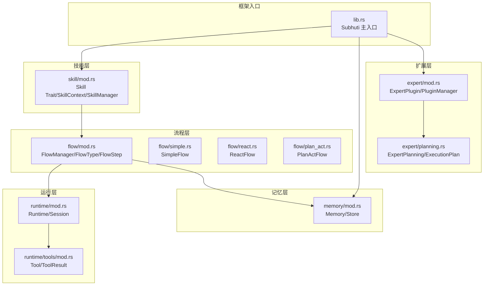
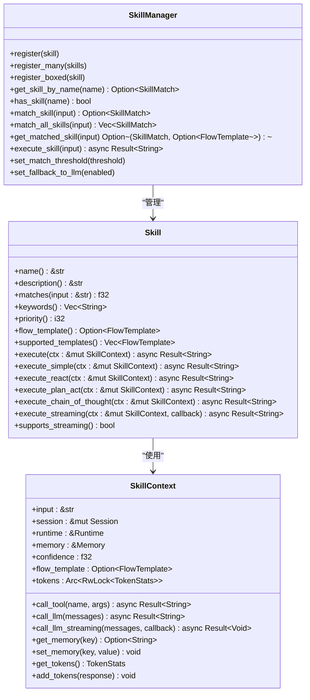
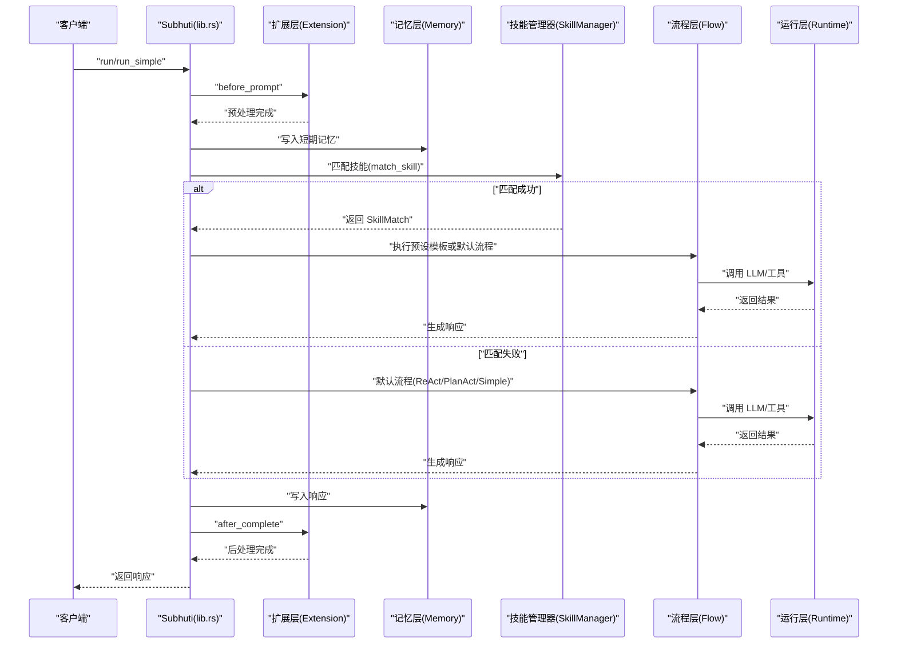
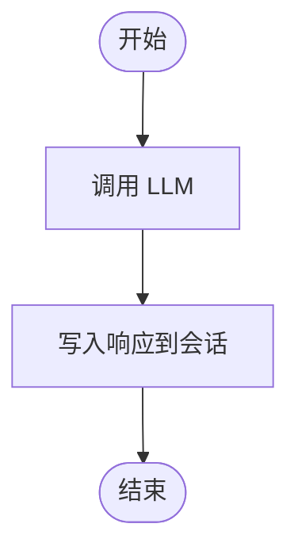
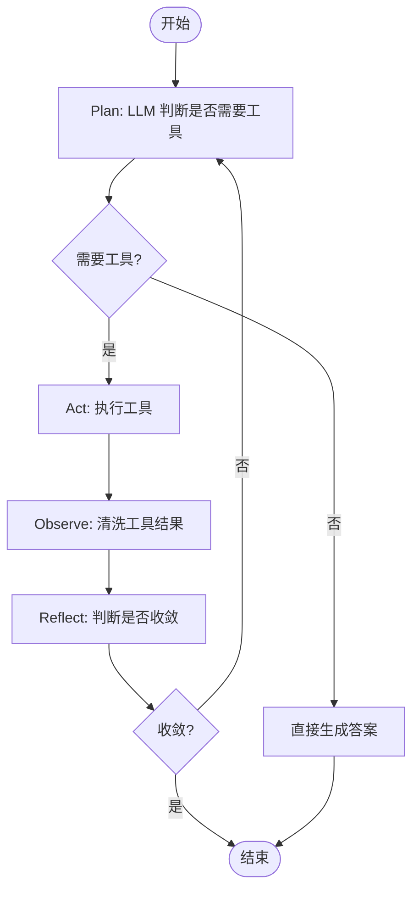
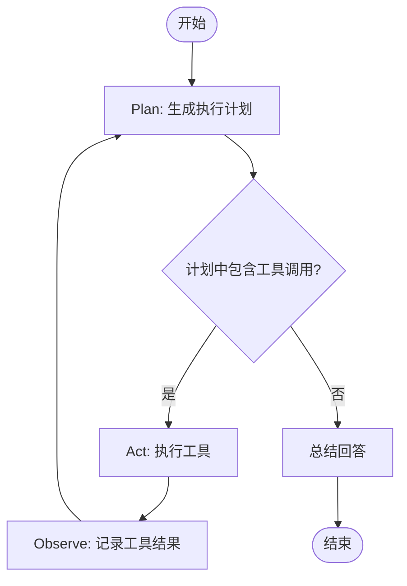
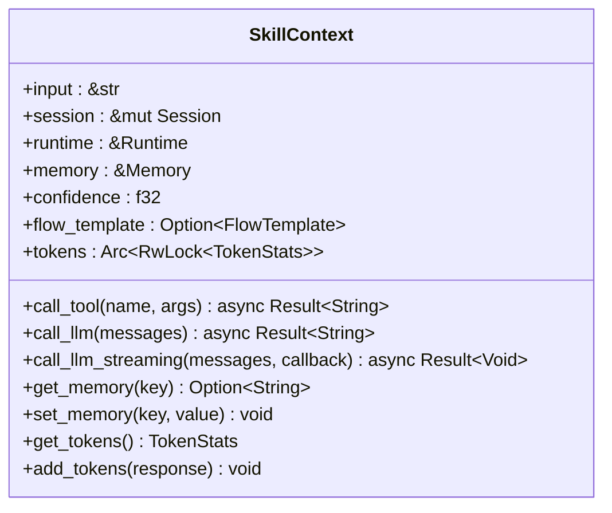
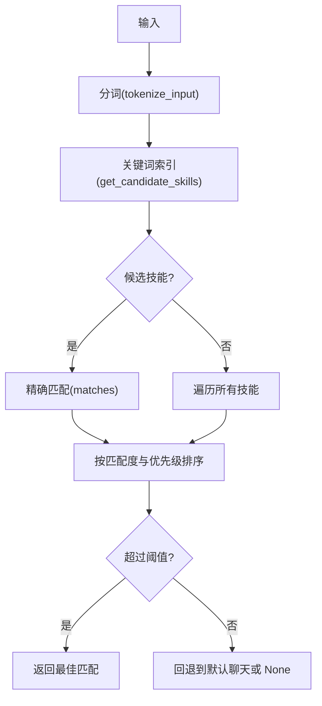
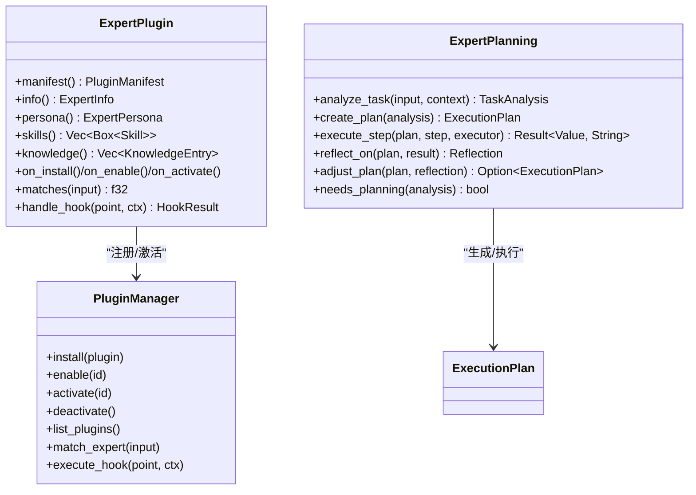
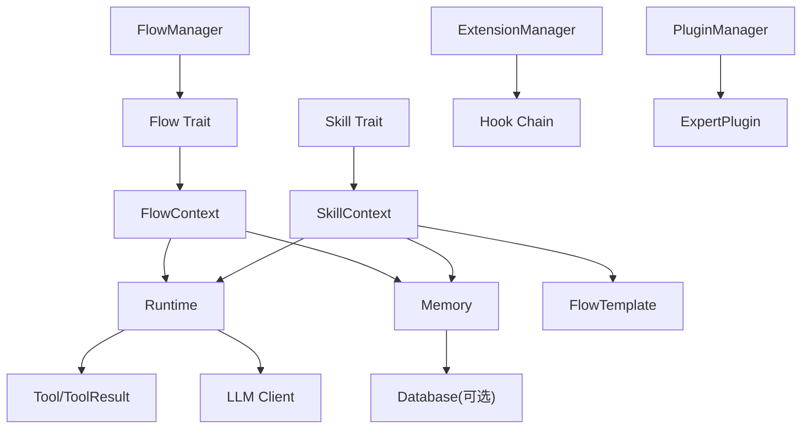

# 自定义技能开发

<cite>
**本文档引用的文件**
- [skill/mod.rs](file://crates/subhuti/src/skill/mod.rs)
- [flow/mod.rs](file://crates/subhuti/src/flow/mod.rs)
- [flow/simple.rs](file://crates/subhuti/src/flow/simple.rs)
- [flow/react.rs](file://crates/subhuti/src/flow/react.rs)
- [flow/plan_act.rs](file://crates/subhuti/src/flow/plan_act.rs)
- [context.rs](file://crates/subhuti/src/context.rs)
- [memory/mod.rs](file://crates/subhuti/src/memory/mod.rs)
- [runtime/tools/mod.rs](file://crates/subhuti/src/runtime/tools/mod.rs)
- [lib.rs](file://crates/subhuti/src/lib.rs)
- [expert/mod.rs](file://crates/subhuti/src/expert/mod.rs)
- [expert/planning.rs](file://crates/subhuti/src/expert/planning.rs)
- [技能.md](file://crates/subhuti/技能.md)
- [大纲.md](file://crates/subhuti/大纲.md)
- [执行链路.md](file://crates/subhuti/执行链路.md)
- [integration_test.rs](file://crates/subhuti/tests/integration_test.rs)
- [performance_test.rs](file://crates/subhuti/tests/performance_test.rs)
</cite>

## 目录
1. [简介](#简介)
2. [项目结构](#项目结构)
3. [核心组件](#核心组件)
4. [架构概览](#架构概览)
5. [详细组件分析](#详细组件分析)
6. [依赖分析](#依赖分析)
7. [性能考量](#性能考量)
8. [故障排查指南](#故障排查指南)
9. [结论](#结论)
10. [附录](#附录)

## 简介
本指南面向希望在 Subhuti 框架中开发自定义技能（Skill）的开发者，系统讲解 Skill Trait 的实现规范、四种流程模板（Simple、ReAct、PlanAct、ChainOfThought）的设计原理与适用场景，并深入说明 SkillContext 的使用方法（工具调用、LLM 调用、记忆操作、流式输出）。文档还涵盖技能匹配机制、关键词索引优化、优先级设置等高级特性，并提供完整的开发示例、最佳实践、性能优化建议以及调试与测试方法。

## 项目结构
Subhuti 采用四层架构：记忆层（Memory）、运行层（Runtime）、流程层（Flow）、扩展层（Extension），技能层（Skill）位于顶层，负责路由与业务编排。核心模块包括：
- skill/mod.rs：Skill Trait、SkillContext、SkillManager、FlowTemplate 等
- flow/mod.rs、flow/simple.rs、flow/react.rs、flow/plan_act.rs：流程层与内置流程模板
- context.rs：RunContext、TokenStats 等上下文与统计
- memory/mod.rs：记忆系统（短期、长期、知识库）
- runtime/tools/mod.rs：工具系统与内置工具
- lib.rs：框架主入口与运行流程
- expert/mod.rs、expert/planning.rs：专家插件与规划能力
- 技能.md、大纲.md、执行链路.md：设计文档与执行链路说明
- tests/*：集成与性能测试

**图表来源**
- [lib.rs:84-156](file://crates/subhuti/src/lib.rs#L84-L156)
- [skill/mod.rs:256-405](file://crates/subhuti/src/skill/mod.rs#L256-L405)
- [flow/mod.rs:38-80](file://crates/subhuti/src/flow/mod.rs#L38-L80)
- [flow/simple.rs:12-61](file://crates/subhuti/src/flow/simple.rs#L12-L61)
- [flow/react.rs:13-95](file://crates/subhuti/src/flow/react.rs#L13-L95)
- [flow/plan_act.rs:17-83](file://crates/subhuti/src/flow/plan_act.rs#L17-L83)
- [memory/mod.rs:163-444](file://crates/subhuti/src/memory/mod.rs#L163-L444)
- [runtime/tools/mod.rs:53-61](file://crates/subhuti/src/runtime/tools/mod.rs#L53-L61)
- [expert/mod.rs:660-760](file://crates/subhuti/src/expert/mod.rs#L660-L760)
- [expert/planning.rs:411-469](file://crates/subhuti/src/expert/planning.rs#L411-L469)

**章节来源**
- [大纲.md:1-665](file://crates/subhuti/大纲.md#L1-L665)
- [lib.rs:84-156](file://crates/subhuti/src/lib.rs#L84-L156)

## 核心组件
本节聚焦 Skill Trait 的实现规范与关键方法设计原则，包括 name()、matches()、description()、keywords()、priority()、flow_template()、execute() 等。

- name()：技能唯一标识，动词开头、蛇形命名，用于路由与日志
- description()：技能描述，决定 LLM 调用准确率，应包含功能说明、适用场景与边界限制
- matches()：匹配度计算（0.0-1.0），输入越匹配返回值越高
- keywords()：关键词列表，用于构建倒排索引，优化大规模技能匹配性能
- priority()：优先级（数值越小优先级越高），相同匹配度时生效
- flow_template()：选择预设流程模板（可选），None 表示完全自定义
- execute()：核心执行方法，支持预设模板路由或完全自定义
- execute_streaming()：流式执行方法，回调逐块输出
- supports_streaming()：是否支持流式输出

**图表来源**
- [skill/mod.rs:256-405](file://crates/subhuti/src/skill/mod.rs#L256-L405)
- [skill/mod.rs:115-235](file://crates/subhuti/src/skill/mod.rs#L115-L235)
- [skill/mod.rs:451-806](file://crates/subhuti/src/skill/mod.rs#L451-L806)

**章节来源**
- [skill/mod.rs:256-405](file://crates/subhuti/src/skill/mod.rs#L256-L405)
- [技能.md:14-92](file://crates/subhuti/技能.md#L14-L92)

## 架构概览
Subhuti 的技能执行路径如下：用户输入经扩展层预处理后进入记忆层写入短期记忆；随后由技能管理器进行匹配，若匹配成功则执行技能的纯代码实现（可选预设流程模板），否则回退到默认流程（AI 自主决策）；最后写入响应并经扩展层后处理。

**图表来源**
- [lib.rs:655-742](file://crates/subhuti/src/lib.rs#L655-L742)
- [lib.rs:754-806](file://crates/subhuti/src/lib.rs#L754-L806)
- [skill/mod.rs:604-789](file://crates/subhuti/src/skill/mod.rs#L604-L789)
- [flow/mod.rs:729-794](file://crates/subhuti/src/flow/mod.rs#L729-L794)

**章节来源**
- [大纲.md:515-622](file://crates/subhuti/大纲.md#L515-L622)
- [执行链路.md:1-96](file://crates/subhuti/执行链路.md#L1-L96)

## 详细组件分析

### Skill Trait 实现规范
- name()：唯一标识，建议动词开头、蛇形命名，便于日志与路由
- description()：高质量描述决定 LLM 调用准确率，应包含功能、场景与边界
- matches()：返回匹配度，支持关键词索引与阈值过滤
- keywords()：关键词用于倒排索引，优化大规模匹配性能
- priority()：数值越小优先级越高，相同匹配度时生效
- flow_template()：选择预设模板（None 表示完全自定义）
- execute()：核心执行逻辑，支持模板路由或自定义流程
- execute_streaming()：流式输出回调逐块推送
- supports_streaming()：声明是否支持流式输出

最佳实践：
- 将“触发描述”写得尽可能精确，避免过度泛化
- 在 matches() 中结合关键词与语义判断，兼顾速度与准确率
- 使用 tokens 统计与流式输出提升用户体验与可观测性
- 优先使用预设模板以减少 LLM 消耗，复杂逻辑再考虑自定义

**章节来源**
- [skill/mod.rs:256-405](file://crates/subhuti/src/skill/mod.rs#L256-L405)
- [技能.md:196-202](file://crates/subhuti/技能.md#L196-L202)

### 四种流程模板详解

#### Simple 模板
- 适用场景：简单问答，无需工具调用
- 特点：直接调用 LLM，流程简洁，Token 消耗低
- 实现要点：无需预设步骤，直接在 execute() 中调用 ctx.call_llm()

**图表来源**
- [flow/simple.rs:47-60](file://crates/subhuti/src/flow/simple.rs#L47-L60)

**章节来源**
- [flow/simple.rs:12-61](file://crates/subhuti/src/flow/simple.rs#L12-L61)

#### ReAct 模板
- 适用场景：需要多轮思考与工具调用的复杂任务
- 特点：Plan → Act → Observe → Reflect 循环，自动工具调用
- 实现要点：在 execute_react() 中实现循环逻辑，处理工具调用与收敛判断

**图表来源**
- [flow/react.rs:107-196](file://crates/subhuti/src/flow/react.rs#L107-L196)

**章节来源**
- [flow/react.rs:13-196](file://crates/subhuti/src/flow/react.rs#L13-L196)

#### PlanAct 模板
- 适用场景：需要先规划再执行的复杂任务
- 特点：先生成执行计划，再按计划调用工具，最后总结回答
- 实现要点：在 execute_plan_act() 中先规划，再执行工具，最后汇总

**图表来源**
- [flow/plan_act.rs:95-154](file://crates/subhuti/src/flow/plan_act.rs#L95-L154)

**章节来源**
- [flow/plan_act.rs:17-154](file://crates/subhuti/src/flow/plan_act.rs#L17-L154)

#### ChainOfThought 模板
- 适用场景：需要复杂推理与思维链的场景
- 特点：强调推理过程，适合数学、逻辑、分析类任务
- 实现要点：在 execute_chain_of_thought() 中引导 LLM 输出中间推理步骤，再给出最终结论

注意：在当前代码中，ChainOfThought 作为枚举值存在，但未提供具体实现文件。可在自定义流程中按需实现。

**章节来源**
- [skill/mod.rs:93-113](file://crates/subhuti/src/skill/mod.rs#L93-L113)

### SkillContext 使用指南
SkillContext 提供统一的执行上下文，包含输入、会话、运行时、记忆、匹配度、流程模板与 Token 统计等。常用方法：
- call_tool(name, args)：调用工具，返回字符串结果
- call_llm(messages)：调用 LLM，返回字符串结果
- call_llm_streaming(messages, callback)：流式调用 LLM，逐块回调
- get_memory(key)/set_memory(key, value)：短期记忆读写
- get_tokens()/add_tokens(response)：Token 统计读取与累加

**图表来源**
- [skill/mod.rs:115-235](file://crates/subhuti/src/skill/mod.rs#L115-L235)

**章节来源**
- [skill/mod.rs:133-235](file://crates/subhuti/src/skill/mod.rs#L133-L235)
- [context.rs:18-86](file://crates/subhuti/src/context.rs#L18-L86)

### 技能匹配机制与索引优化
SkillManager 提供高效的技能匹配与索引优化：
- 名称索引（HashMap，O(1) 查找）
- 关键词倒排索引（关键词 → 技能列表）
- 匹配阈值（低于阈值不触发）
- 优先级排序（数值越小优先级越高）

匹配流程：
1) 通过关键词索引快速筛选候选技能（O(k)）
2) 对候选技能计算精确匹配度
3) 若无关键词匹配，遍历所有技能兜底
4) 按匹配度与优先级排序，返回最佳匹配

**图表来源**
- [skill/mod.rs:604-789](file://crates/subhuti/src/skill/mod.rs#L604-L789)
- [skill/mod.rs:692-728](file://crates/subhuti/src/skill/mod.rs#L692-L728)

**章节来源**
- [skill/mod.rs:451-761](file://crates/subhuti/src/skill/mod.rs#L451-L761)

### 专家插件与规划能力
专家插件系统提供领域专家扩展与自主规划能力：
- ExpertPlugin：插件生命周期与钩子支持
- ExpertPlanning：任务分析、执行计划、步骤执行、反思调整
- PluginManager：插件注册、启用、激活与知识注入

**图表来源**
- [expert/mod.rs:660-760](file://crates/subhuti/src/expert/mod.rs#L660-L760)
- [expert/planning.rs:411-469](file://crates/subhuti/src/expert/planning.rs#L411-L469)

**章节来源**
- [expert/mod.rs:660-800](file://crates/subhuti/src/expert/mod.rs#L660-L800)
- [expert/planning.rs:411-629](file://crates/subhuti/src/expert/planning.rs#L411-L629)

## 依赖分析
- Skill 依赖：SkillContext（工具/LLM/记忆/Token）、FlowTemplate（流程模板）、SkillManager（匹配与注册）
- Flow 层依赖：FlowContext（会话、运行时、记忆、配置、状态）、FlowManager（流程选择）
- 运行层依赖：Runtime（LLM 客户端）、Tools（工具注册与执行）
- 记忆层依赖：Memory（短期/长期/知识库）、Database（可选持久化）
- 扩展层依赖：ExtensionManager（钩子链）、PluginManager（专家插件）

**图表来源**
- [skill/mod.rs:256-405](file://crates/subhuti/src/skill/mod.rs#L256-L405)
- [flow/mod.rs:631-644](file://crates/subhuti/src/flow/mod.rs#L631-L644)
- [lib.rs:108-156](file://crates/subhuti/src/lib.rs#L108-L156)

**章节来源**
- [lib.rs:108-156](file://crates/subhuti/src/lib.rs#L108-L156)
- [flow/mod.rs:631-644](file://crates/subhuti/src/flow/mod.rs#L631-L644)
- [runtime/tools/mod.rs:53-61](file://crates/subhuti/src/runtime/tools/mod.rs#L53-L61)

## 性能考量
- 关键词索引：通过 keywords() 构建倒排索引，匹配复杂度从 O(n*m) 降低到 O(k+m)，其中 n 为技能数，m 为输入长度，k 为关键词数
- Token 统计：使用 Arc + RwLock 共享 TokenStats，避免重复分配与竞争
- 流式输出：支持 call_llm_streaming，降低首字延迟，提升用户体验
- 阈值与优先级：通过 set_match_threshold 与 priority 控制匹配与排序成本
- 性能测试：集成测试与性能测试覆盖框架初始化、记忆存储/搜索、健康检查、技能匹配等关键路径

最佳实践：
- 为高频技能提供关键词，避免无关键词匹配导致全量扫描
- 合理设置匹配阈值，避免误触发
- 使用流式输出与 Token 统计监控资源消耗
- 对复杂流程优先使用预设模板，减少 LLM 推理开销

**章节来源**
- [skill/mod.rs:451-761](file://crates/subhuti/src/skill/mod.rs#L451-L761)
- [context.rs:18-86](file://crates/subhuti/src/context.rs#L18-L86)
- [performance_test.rs:171-200](file://crates/subhuti/tests/performance_test.rs#L171-L200)

## 故障排查指南
- 调试工具：使用 TestTracker、Profiler、HealthReport、diagnose_value、measure_time 等工具进行系统健康检查与性能分析
- 集成测试：integration_test.rs 展示从 HTTP 层到记忆层的完整执行链路，便于定位问题
- 常见问题：
  - 技能未触发：检查 matches() 返回值、keywords() 是否正确、阈值是否过高
  - LLM/工具调用失败：查看 ToolResult.error 与 LLM 响应，确认参数与权限
  - 性能瓶颈：关注 Token 统计、流式输出、关键词索引命中率

**章节来源**
- [integration_test.rs:21-190](file://crates/subhuti/tests/integration_test.rs#L21-L190)
- [performance_test.rs:22-264](file://crates/subhuti/tests/performance_test.rs#L22-L264)

## 结论
Subhuti 的技能系统以“纯代码实现 + 可选预设流程模板”为核心理念，既保证灵活性又兼顾效率。通过关键词索引、阈值与优先级控制、Token 统计与流式输出等机制，开发者可以在复杂业务场景中快速构建高性能的自定义技能。配合专家插件与规划能力，Subhuti 能够满足从简单问答到复杂推理与规划的多样化需求。

## 附录

### 开发示例与最佳实践
- 使用预设模板（ReAct/Simple/PlanAct）快速实现常见场景
- 复杂逻辑使用完全自定义流程，结合 ctx.call_tool()、ctx.call_llm()、ctx.memory 操作
- 为技能提供高质量 description 与 keywords，提升匹配准确率
- 使用 supports_streaming() 与 execute_streaming() 提升用户体验
- 通过 priority() 与 set_match_threshold() 精细控制匹配与排序

### 单元测试与代码审查要点
- 单元测试：围绕 Skill 的 matches()、execute()、execute_streaming() 编写测试用例
- 代码审查：关注匹配度计算的合理性、流程模板的选择依据、工具调用的参数校验、错误处理与兜底逻辑、Token 统计与流式输出的正确性

**章节来源**
- [技能.md:85-92](file://crates/subhuti/技能.md#L85-L92)
- [大纲.md:414-427](file://crates/subhuti/大纲.md#L414-L427)