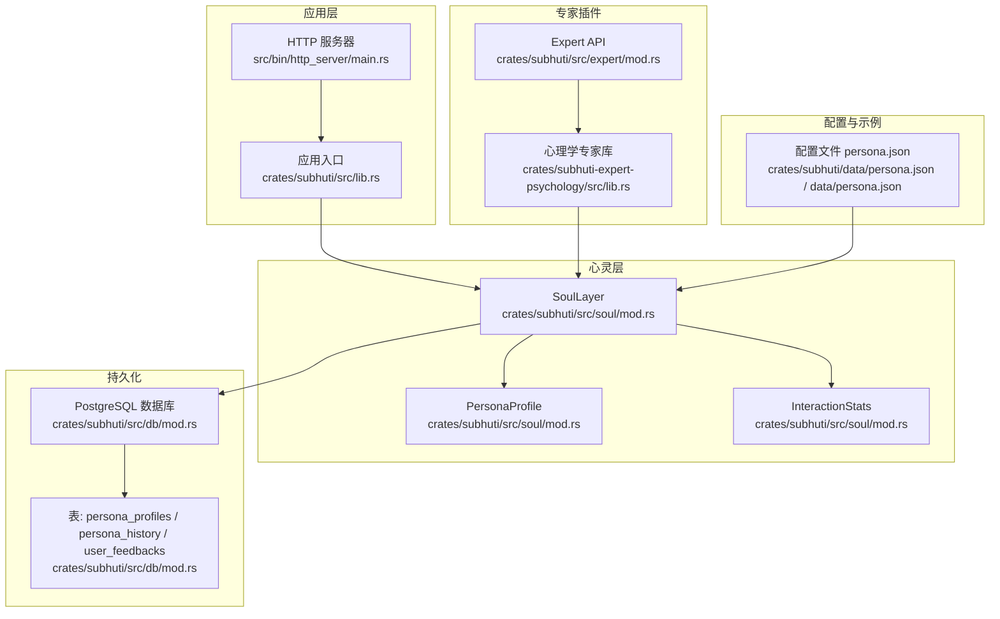
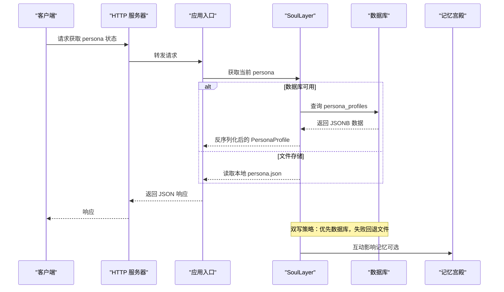
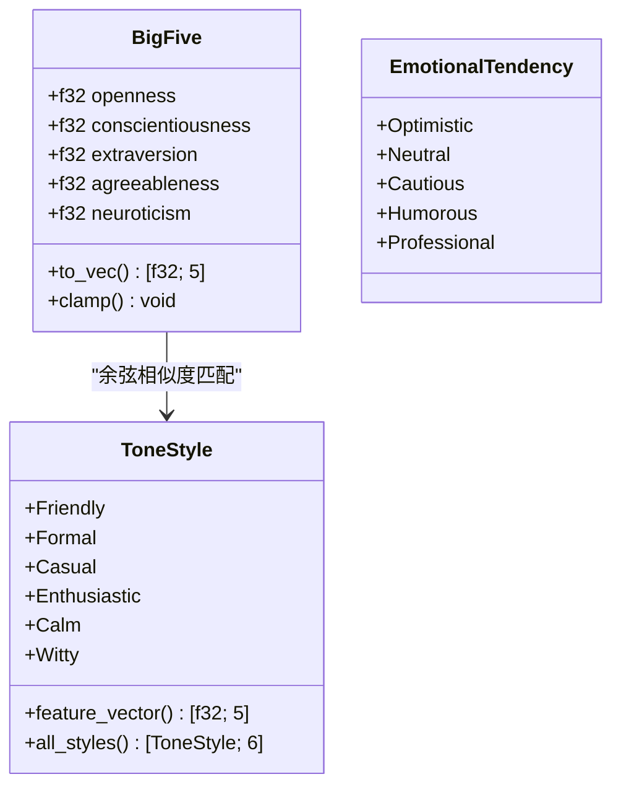
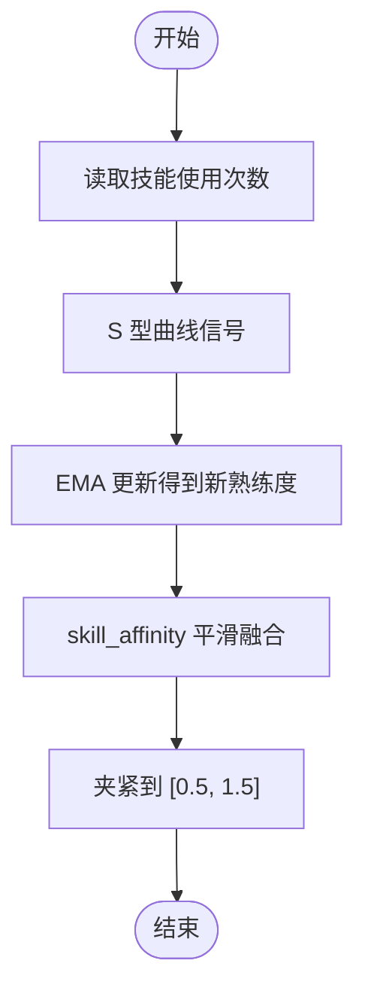
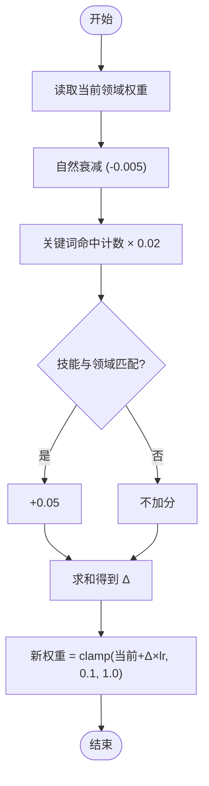
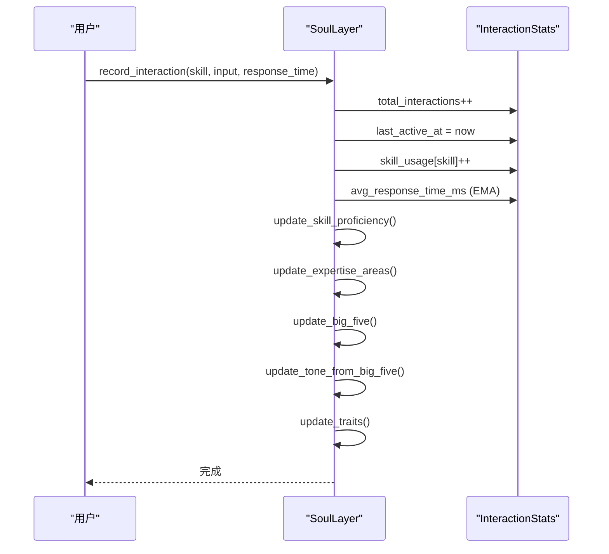
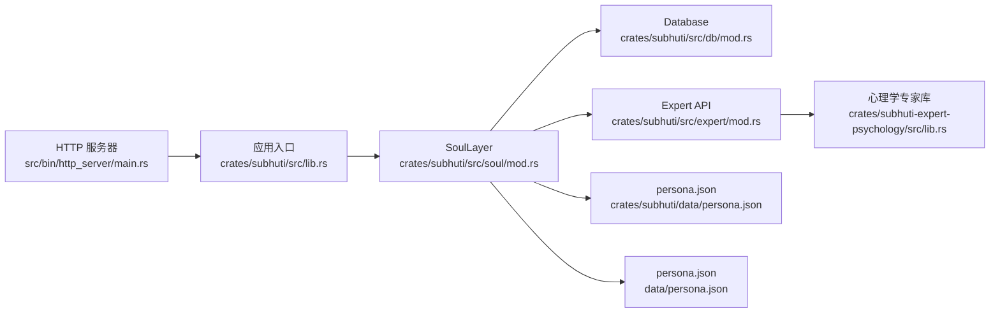

# 人格配置管理

<cite>
**本文档引用的文件**
- [crates/subhuti/src/soul/mod.rs](file://crates/subhuti/src/soul/mod.rs)
- [crates/subhuti/data/persona.json](file://crates/subhuti/data/persona.json)
- [data/persona.json](file://data/persona.json)
- [crates/subhuti/src/db/mod.rs](file://crates/subhuti/src/db/mod.rs)
- [crates/subhuti/src/expert/mod.rs](file://crates/subhuti/src/expert/mod.rs)
- [crates/subhuti-expert-psychology/src/lib.rs](file://crates/subhuti-expert-psychology/src/lib.rs)
- [crates/subhuti/src/lib.rs](file://crates/subhuti/src/lib.rs)
- [src/bin/http_server/main.rs](file://src/bin/http_server/main.rs)
- [Cargo.toml](file://Cargo.toml)
</cite>

## 目录
1. [简介](#简介)
2. [项目结构](#项目结构)
3. [核心组件](#核心组件)
4. [架构总览](#架构总览)
5. [详细组件分析](#详细组件分析)
6. [依赖关系分析](#依赖关系分析)
7. [性能考量](#性能考量)
8. [故障排查指南](#故障排查指南)
9. [结论](#结论)
10. [附录](#附录)

## 简介
本文件系统性阐述 Subhuti 项目中“人格配置管理”的技术实现，围绕 PersonaProfile 数据模型展开，覆盖版本管理、时间戳追踪、角色基本信息、语气风格与情感倾向、大五人格映射、技能熟练度与偏好权重、擅长领域动态更新、互动统计数据、性格特征关键词生成、多用户支持、专家插件集成、持久化存储策略与配置文件格式，并提供配置示例、迁移指南与最佳实践。

## 项目结构
- 心灵层（Soul Layer）负责人格快照与演化，核心数据结构位于 crates/subhuti/src/soul/mod.rs
- 数据持久化采用 PostgreSQL + JSONB 字段，表结构定义于 crates/subhuti/src/db/mod.rs
- 专家插件通过 crates/subhuti/src/expert/mod.rs 与 crates/subhuti-expert-psychology 提供扩展能力
- 配置文件 persona.json 作为初始模板与历史快照参考
- HTTP 接口导出当前 persona 状态，位于 src/bin/http_server/main.rs

图表来源
- [crates/subhuti/src/soul/mod.rs](file://crates/subhuti/src/soul/mod.rs)
- [crates/subhuti/src/db/mod.rs](file://crates/subhuti/src/db/mod.rs)
- [crates/subhuti/src/expert/mod.rs](file://crates/subhuti/src/expert/mod.rs)
- [crates/subhuti-expert-psychology/src/lib.rs](file://crates/subhuti-expert-psychology/src/lib.rs)
- [crates/subhuti/data/persona.json](file://crates/subhuti/data/persona.json)
- [data/persona.json](file://data/persona.json)
- [src/bin/http_server/main.rs](file://src/bin/http_server/main.rs)

章节来源
- [Cargo.toml:1-58](file://Cargo.toml#L1-L58)

## 核心组件
- PersonaProfile：人格快照的核心数据模型，包含版本、时间戳、角色基础信息、语气风格、情感倾向、大五人格、技能熟练度、擅长领域、技能偏好权重、互动统计、性格特征关键词等
- InteractionStats：互动统计聚合，含总交互次数、最近活跃时间、各技能使用次数、平均响应时长、点赞/点踩、用户反馈列表
- 大五人格（BigFive）：开放性、尽责性、外向性、宜人性、情绪稳定性，支持向量化与夹紧
- 语气风格（ToneStyle）：友好、正式、随意、热情、冷静、机智，具备特征向量与余弦相似度匹配
- 情感倾向（EmotionalTendency）：乐观、中性、谨慎、幽默、专业
- 技能偏好权重（skill_affinity）：基于熟练度与使用频率的自适应调整
- 擅长领域（expertise_areas）：基于关键词命中与技能调用的动态更新
- 多用户支持：user_profiles 映射 user_id -> PersonaProfile
- 专家插件：set_persona_from_expert 从专家库切换角色
- 持久化：数据库（JSONB）与文件（JSON）双写策略

章节来源
- [crates/subhuti/src/soul/mod.rs:201-271](file://crates/subhuti/src/soul/mod.rs#L201-L271)
- [crates/subhuti/src/soul/mod.rs:182-199](file://crates/subhuti/src/soul/mod.rs#L182-L199)
- [crates/subhuti/src/soul/mod.rs:47-94](file://crates/subhuti/src/soul/mod.rs#L47-L94)
- [crates/subhuti/src/soul/mod.rs:98-139](file://crates/subhuti/src/soul/mod.rs#L98-L139)
- [crates/subhuti/src/soul/mod.rs:141-155](file://crates/subhuti/src/soul/mod.rs#L141-L155)

## 架构总览
心灵层（SoulLayer）以 PersonaProfile 为核心，结合统计分析轨道与 LLM 自反思轨道，实现人格的实时演化与周期性升级。数据通过数据库（JSONB）与文件（JSON）双重持久化，支持多用户隔离与专家插件集成。

图表来源
- [src/bin/http_server/main.rs:581-598](file://src/bin/http_server/main.rs#L581-L598)
- [crates/subhuti/src/soul/mod.rs:1291-1384](file://crates/subhuti/src/soul/mod.rs#L1291-L1384)
- [crates/subhuti/src/db/mod.rs:248-353](file://crates/subhuti/src/db/mod.rs#L248-L353)

## 详细组件分析

### PersonaProfile 数据模型
- 版本管理（version）：u32，用于记录人格快照版本；演化完成后递增
- 时间戳追踪（created_at、updated_at）：DateTime<Utc>，记录创建与最后更新时间
- 角色基本信息（name、description）：字符串，描述角色名称与职责
- 语气风格（ToneStyle）：友好、正式、随意、热情、冷静、机智，具备特征向量，用于与大五人格向量做余弦相似度匹配
- 情感倾向（EmotionalTendency）：乐观、中性、谨慎、幽默、专业
- 大五人格（BigFive）：开放性、尽责性、外向性、宜人性、情绪稳定性，支持向量化与夹紧至 [0,1]
- 技能熟练度（skill_proficiency）：HashMap<技能名, f32>，范围 [0,1]
- 擅长领域（expertise_areas）：HashMap<领域名, f32>，范围 [0,1]
- 技能偏好权重（skill_affinity）：HashMap<技能名, f32>，范围 [0.5,1.5]，用于技能匹配时加权
- 互动统计数据（InteractionStats）：总交互次数、最近活跃时间、各技能使用次数、平均响应时长、点赞/点踩、用户反馈列表
- 性格特征关键词（traits）：Vec<String>，由统计与 LLM 双轨融合生成

章节来源
- [crates/subhuti/src/soul/mod.rs:201-271](file://crates/subhuti/src/soul/mod.rs#L201-L271)
- [crates/subhuti/src/soul/mod.rs:182-199](file://crates/subhuti/src/soul/mod.rs#L182-L199)
- [crates/subhuti/src/soul/mod.rs:47-94](file://crates/subhuti/src/soul/mod.rs#L47-L94)
- [crates/subhuti/src/soul/mod.rs:98-139](file://crates/subhuti/src/soul/mod.rs#L98-L139)
- [crates/subhuti/src/soul/mod.rs:141-155](file://crates/subhuti/src/soul/mod.rs#L141-L155)

### 语气风格（ToneStyle）与情感倾向（EmotionalTendency）
- 六种语气风格各自具有特征向量，用于与大五人格向量计算余弦相似度，选择最匹配的风格
- 情感倾向五种状态，分别对应不同的情感表达倾向

图表来源
- [crates/subhuti/src/soul/mod.rs:47-94](file://crates/subhuti/src/soul/mod.rs#L47-L94)
- [crates/subhuti/src/soul/mod.rs:98-139](file://crates/subhuti/src/soul/mod.rs#L98-L139)
- [crates/subhuti/src/soul/mod.rs:141-155](file://crates/subhuti/src/soul/mod.rs#L141-L155)

章节来源
- [crates/subhuti/src/soul/mod.rs:115-139](file://crates/subhuti/src/soul/mod.rs#L115-L139)
- [crates/subhuti/src/soul/mod.rs:881-895](file://crates/subhuti/src/soul/mod.rs#L881-L895)

### 技能熟练度与偏好权重（skill_proficiency 与 skill_affinity）
- 技能熟练度：基于使用次数的 S 型曲线与指数移动平均（EMA）更新，形成非线性增长
- 技能偏好权重：在熟练度基础上引入平滑融合，范围约束在 [0.5,1.5]，优先级高于熟练度参与技能匹配

图表来源
- [crates/subhuti/src/soul/mod.rs:737-764](file://crates/subhuti/src/soul/mod.rs#L737-L764)

章节来源
- [crates/subhuti/src/soul/mod.rs:737-764](file://crates/subhuti/src/soul/mod.rs#L737-L764)

### 擅长领域（expertise_areas）动态更新机制
- 自然衰减：每个领域默认轻微衰减
- 关键词命中：根据领域关键词命中次数增加权重
- 技能调用关联：当技能名与领域匹配时额外加分
- 夹紧：最终值限制在 [0.1, 1.0]

图表来源
- [crates/subhuti/src/soul/mod.rs:766-799](file://crates/subhuti/src/soul/mod.rs#L766-L799)

章节来源
- [crates/subhuti/src/soul/mod.rs:766-799](file://crates/subhuti/src/soul/mod.rs#L766-L799)

### 互动统计数据的收集与分析
- 总交互次数与最近活跃时间：每次互动递增与更新
- 技能使用次数：按技能名累加
- 平均响应时长：指数移动平均（EMA）更新
- 点赞/点踩：根据反馈类型更新大五人格（宜人性、外向性、尽责性、开放性）
- 用户反馈列表：保留最近若干条，便于后续分析

图表来源
- [crates/subhuti/src/soul/mod.rs:692-735](file://crates/subhuti/src/soul/mod.rs#L692-L735)
- [crates/subhuti/src/soul/mod.rs:623-680](file://crates/subhuti/src/soul/mod.rs#L623-L680)

章节来源
- [crates/subhuti/src/soul/mod.rs:692-735](file://crates/subhuti/src/soul/mod.rs#L692-L735)
- [crates/subhuti/src/soul/mod.rs:623-680](file://crates/subhuti/src/soul/mod.rs#L623-L680)

### 性格特征关键词（traits）的智能生成算法
- 统计分析轨道：根据用户反馈与互动行为，动态调整 traits
- LLM 自反思轨道：周期性融合 LLM 建议，形成更稳定的关键词集合
- 双轨融合：统计结果占主导权重，LLM 建议作为补充

章节来源
- [crates/subhuti/src/soul/mod.rs:938-1189](file://crates/subhuti/src/soul/mod.rs#L938-L1189)

### 多用户支持机制
- user_profiles：HashMap<user_id, PersonaProfile>
- get_user_profile / get_user_profile_mut：按需克隆默认配置或返回已有快照
- switch_user：切换活跃用户
- list_users：列出所有用户 ID
- 数据库按 user_id 唯一存储，避免冲突

章节来源
- [crates/subhuti/src/soul/mod.rs:530-561](file://crates/subhuti/src/soul/mod.rs#L530-L561)
- [crates/subhuti/src/db/mod.rs:248-353](file://crates/subhuti/src/db/mod.rs#L248-L353)

### 专家插件集成
- set_persona_from_expert：从专家库导入 persona，覆盖名称、描述、语气风格、情感倾向、大五、traits、expertise_areas
- 心理学专家示例：提供高宜人性与共情特质，擅长情绪管理与压力应对

章节来源
- [crates/subhuti/src/soul/mod.rs:504-528](file://crates/subhuti/src/soul/mod.rs#L504-L528)
- [crates/subhuti/src/expert/mod.rs:564-597](file://crates/subhuti/src/expert/mod.rs#L564-L597)
- [crates/subhuti-expert-psychology/src/lib.rs:87-118](file://crates/subhuti-expert-psychology/src/lib.rs#L87-L118)

### 持久化存储策略
- 双写策略：优先数据库（JSONB 字段），失败回退文件（JSON）
- 数据库表结构：
  - persona_profiles：存储 persona 快照与统计
  - persona_history：存储演化历史快照
  - user_feedbacks：存储用户反馈
- 文件存储：SoulLayerData 序列化为 JSON，包含 profile、user_profiles、history、interactions_since_last_evolve

章节来源
- [crates/subhuti/src/db/mod.rs:73-179](file://crates/subhuti/src/db/mod.rs#L73-L179)
- [crates/subhuti/src/db/mod.rs:248-353](file://crates/subhuti/src/db/mod.rs#L248-L353)
- [crates/subhuti/src/soul/mod.rs:1256-1384](file://crates/subhuti/src/soul/mod.rs#L1256-L1384)

### 配置文件格式
- JSON Schema：包含 profile（PersonaProfile）、user_profiles、history、interactions_since_last_evolve
- 示例文件：
  - crates/subhuti/data/persona.json：单版本示例
  - data/persona.json：包含历史版本与反馈列表的示例

章节来源
- [crates/subhuti/data/persona.json:1-55](file://crates/subhuti/data/persona.json#L1-L55)
- [data/persona.json:1-213](file://data/persona.json#L1-L213)

## 依赖关系分析

图表来源
- [crates/subhuti/src/soul/mod.rs](file://crates/subhuti/src/soul/mod.rs)
- [crates/subhuti/src/db/mod.rs](file://crates/subhuti/src/db/mod.rs)
- [crates/subhuti/src/expert/mod.rs](file://crates/subhuti/src/expert/mod.rs)
- [crates/subhuti-expert-psychology/src/lib.rs](file://crates/subhuti-expert-psychology/src/lib.rs)
- [src/bin/http_server/main.rs](file://src/bin/http_server/main.rs)
- [crates/subhuti/src/lib.rs](file://crates/subhuti/src/lib.rs)

章节来源
- [Cargo.toml:1-58](file://Cargo.toml#L1-L58)

## 性能考量
- 统计分析轨道：每次互动执行 O(1) 级别的哈希表操作与少量浮点运算，开销极低
- LLM 自反思轨道：周期性触发，避免高频调用带来的延迟
- 数据库写入：采用 upsert 与 JSONB 字段，减少字段拆分与 JOIN
- 内存占用：HashMap 与 Vec 在合理容量下可控；建议对 traits 与 feedbacks 限制长度
- I/O 优化：文件存储仅作为后备方案，优先使用数据库

## 故障排查指南
- 数据库连接失败：检查 DbConfig 与连接字符串，确认 PostgreSQL 服务可用
- 表结构异常：运行 init_tables 初始化，必要时执行迁移逻辑
- 文件存储权限：确保 storage_path 目录可读写
- 专家插件未生效：确认 set_persona_from_expert 已调用且数据库同步成功
- 反馈写入失败：检查 user_feedbacks 表写入日志，确认字段类型与 JSON 序列化正确

章节来源
- [crates/subhuti/src/db/mod.rs:50-64](file://crates/subhuti/src/db/mod.rs#L50-L64)
- [crates/subhuti/src/db/mod.rs:66-180](file://crates/subhuti/src/db/mod.rs#L66-L180)
- [crates/subhuti/src/soul/mod.rs:1291-1384](file://crates/subhuti/src/soul/mod.rs#L1291-L1384)

## 结论
本系统通过 PersonaProfile 将“统计分析”与“LLM 自反思”双轨融合，实现了可解释、可演化的动态人格管理。数据库与文件的双写策略保证了可靠性与可移植性；多用户支持与专家插件增强了扩展性。配合完善的互动统计与关键词生成算法，能够持续优化用户体验并保持性格稳定性与成长性。

## 附录

### 配置示例
- 单用户默认配置：参见 crates/subhuti/data/persona.json
- 历史版本与反馈示例：参见 data/persona.json

章节来源
- [crates/subhuti/data/persona.json:1-55](file://crates/subhuti/data/persona.json#L1-L55)
- [data/persona.json:1-213](file://data/persona.json#L1-L213)

### 迁移指南
- 新增字段：memories 表的 embedding 列维度不匹配时，需重建列
- 表初始化：首次运行需执行 init_tables 创建 persona_profiles、persona_history、user_feedbacks、memories 等表
- 数据同步：文件数据可同步到数据库，确保 user_id 唯一性

章节来源
- [crates/subhuti/src/db/mod.rs:182-244](file://crates/subhuti/src/db/mod.rs#L182-L244)
- [crates/subhuti/src/db/mod.rs:66-180](file://crates/subhuti/src/db/mod.rs#L66-L180)
- [crates/subhuti/src/soul/mod.rs:1373-1384](file://crates/subhuti/src/soul/mod.rs#L1373-L1384)

### 最佳实践建议
- 保持 skill_affinity 与 skill_proficiency 的一致性，避免技能偏好与实际能力不匹配
- 控制 traits 数量与更新频率，避免过度漂移
- 定期归档历史版本，限制 persona_history 长度
- 使用专家插件前先在测试环境验证 persona 的合理性
- 监控数据库写入延迟与文件存储回退频率，及时扩容或优化