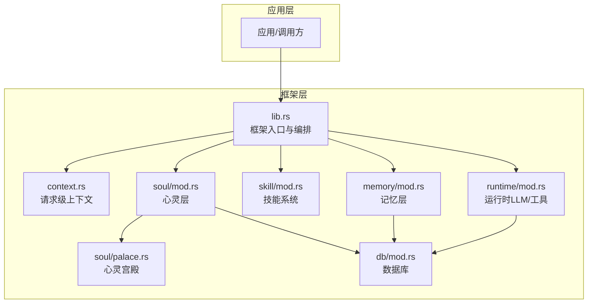
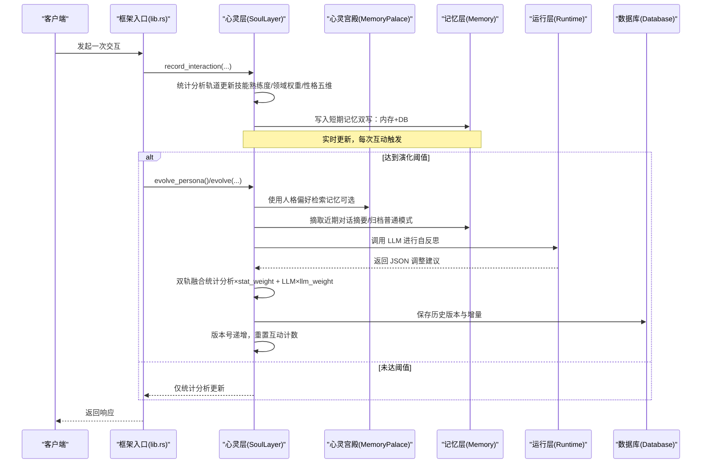
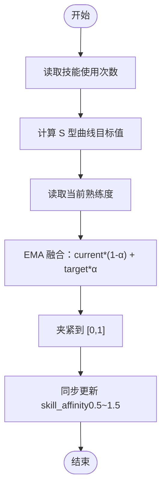
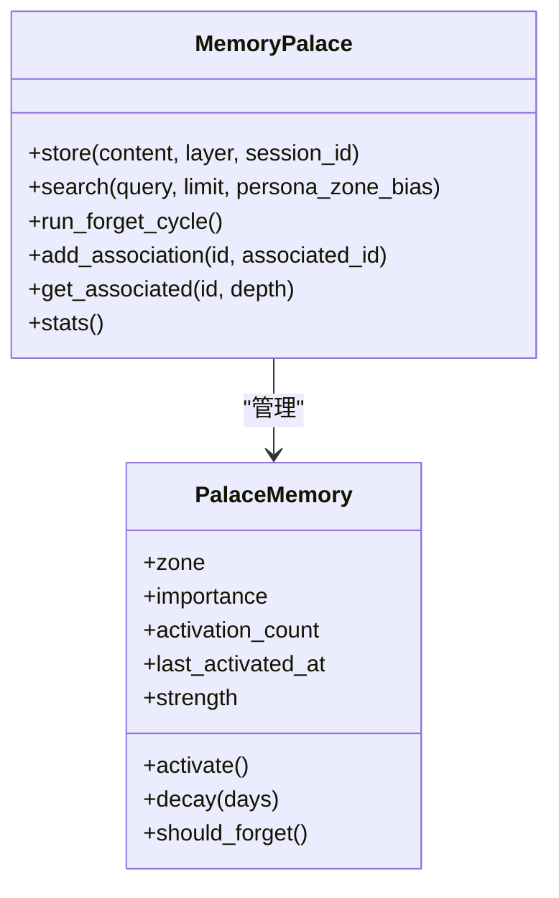
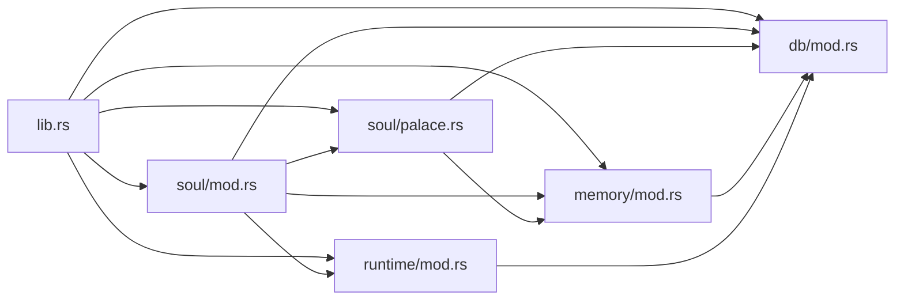

# 动态演化机制

<cite>
**本文引用的文件**
- [crates/subhuti/src/soul/mod.rs](file://crates/subhuti/src/soul/mod.rs)
- [crates/subhuti/src/soul/palace.rs](file://crates/subhuti/src/soul/palace.rs)
- [crates/subhuti/src/lib.rs](file://crates/subhuti/src/lib.rs)
- [crates/subhuti/src/db/mod.rs](file://crates/subhuti/src/db/mod.rs)
- [crates/subhuti/src/memory/mod.rs](file://crates/subhuti/src/memory/mod.rs)
- [crates/subhuti/src/context.rs](file://crates/subhuti/src/context.rs)
- [crates/subhuti/src/runtime/mod.rs](file://crates/subhuti/src/runtime/mod.rs)
</cite>

## 目录
1. [简介](#简介)
2. [项目结构](#项目结构)
3. [核心组件](#核心组件)
4. [架构总览](#架构总览)
5. [详细组件分析](#详细组件分析)
6. [依赖分析](#依赖分析)
7. [性能考虑](#性能考虑)
8. [故障排查指南](#故障排查指南)
9. [结论](#结论)
10. [附录](#附录)

## 简介
本文件系统性阐述 Subhuti 框架中的“动态演化机制”，重点围绕“双轨驱动架构”展开：  
- 统计分析轨道（轻量、实时）：每次互动即刻更新，基于交互统计、技能熟练度、领域权重与性格五维的信号驱动更新。  
- LLM 自反思轨道（深度、周期性）：每 N 次互动触发一次，由 LLM 对近期记忆与统计性格进行自省，给出调整建议，并与统计轨道进行融合。

文档还深入解析以下关键参数与机制：  
- 演化触发阈值（evolve_threshold）  
- EMA 学习率（proficiency_alpha、domain_learning_rate、trait_learning_rate）  
- 最大变化幅度（max_change_per_evolve）  
- 双轨融合算法（stat_weight、llm_weight）  
- 互动统计（InteractionStats）采集机制  
- 技能熟练度更新（S 型曲线 + EMA）  
- 领域权重衰减与关键词匹配  
- 演化历史记录、版本管理与持久化（数据库/文件）

## 项目结构
动态演化机制主要分布在以下模块：  
- 心灵层（SoulLayer）：负责角色性格的动态演化、统计分析与 LLM 融合。  
- 心灵宫殿（MemoryPalace）：记忆与心灵的统一体，提供带人格影响的记忆检索、激活与遗忘。  
- 记忆层（Memory）：短期/长期/知识库三层记忆，支撑统计分析轨道的数据来源。  
- 运行层（Runtime）：LLM 与工具调用，支撑 LLM 自反思轨道的推理过程。  
- 数据库（Database）：持久化角色、历史、反馈与记忆，支持演化记录与多用户管理。

图示来源
- [crates/subhuti/src/lib.rs](file://crates/subhuti/src/lib.rs)
- [crates/subhuti/src/context.rs](file://crates/subhuti/src/context.rs)
- [crates/subhuti/src/runtime/mod.rs](file://crates/subhuti/src/runtime/mod.rs)
- [crates/subhuti/src/skill/mod.rs](file://crates/subhuti/src/skill/mod.rs)
- [crates/subhuti/src/memory/mod.rs](file://crates/subhuti/src/memory/mod.rs)
- [crates/subhuti/src/soul/mod.rs](file://crates/subhuti/src/soul/mod.rs)
- [crates/subhuti/src/soul/palace.rs](file://crates/subhuti/src/soul/palace.rs)
- [crates/subhuti/src/db/mod.rs](file://crates/subhuti/src/db/mod.rs)

章节来源
- [crates/subhuti/src/lib.rs](file://crates/subhuti/src/lib.rs)
- [crates/subhuti/src/soul/mod.rs](file://crates/subhuti/src/soul/mod.rs)
- [crates/subhuti/src/soul/palace.rs](file://crates/subhuti/src/soul/palace.rs)
- [crates/subhuti/src/memory/mod.rs](file://crates/subhuti/src/memory/mod.rs)
- [crates/subhuti/src/runtime/mod.rs](file://crates/subhuti/src/runtime/mod.rs)
- [crates/subhuti/src/db/mod.rs](file://crates/subhuti/src/db/mod.rs)

## 核心组件
- 心灵层（SoulLayer）：承载角色性格快照（PersonaProfile）、演化配置（SoulConfig）、互动统计与历史版本；提供统计分析轨道与 LLM 自反思轨道的统一入口。  
- 心灵宫殿（MemoryPalace）：记忆与心灵的统一体，支持分区检索、记忆激活/衰减、联想网络与遗忘周期；为 LLM 自反思提供“带人格影响”的检索素材。  
- 记忆层（Memory）：短期/长期/知识库三层记忆，提供文本与向量检索，支撑统计分析轨道的数据来源。  
- 运行层（Runtime）：统一 LLM 客户端与工具调用，支撑 LLM 自反思轨道的推理与工具调用。  
- 数据库（Database）：持久化角色、历史、反馈与记忆，支持多用户与版本回溯。

章节来源
- [crates/subhuti/src/soul/mod.rs](file://crates/subhuti/src/soul/mod.rs)
- [crates/subhuti/src/soul/palace.rs](file://crates/subhuti/src/soul/palace.rs)
- [crates/subhuti/src/memory/mod.rs](file://crates/subhuti/src/memory/mod.rs)
- [crates/subhuti/src/runtime/mod.rs](file://crates/subhuti/src/runtime/mod.rs)
- [crates/subhuti/src/db/mod.rs](file://crates/subhuti/src/db/mod.rs)

## 架构总览
双轨驱动架构的总体流程如下：

图示来源
- [crates/subhuti/src/lib.rs](file://crates/subhuti/src/lib.rs)
- [crates/subhuti/src/soul/mod.rs](file://crates/subhuti/src/soul/mod.rs)
- [crates/subhuti/src/soul/palace.rs](file://crates/subhuti/src/soul/palace.rs)
- [crates/subhuti/src/memory/mod.rs](file://crates/subhuti/src/memory/mod.rs)
- [crates/subhuti/src/runtime/mod.rs](file://crates/subhuti/src/runtime/mod.rs)
- [crates/subhuti/src/db/mod.rs](file://crates/subhuti/src/db/mod.rs)

## 详细组件分析

### 双轨驱动架构设计
- 统计分析轨道（轻量、实时）  
  - 每次互动触发：更新互动统计、技能使用次数、平均响应时长；  
  - 技能熟练度：S 型曲线 + EMA；  
  - 领域权重：关键词命中 + 自然衰减；  
  - 性格五维：基于输入信号的增量更新；  
  - 语气风格与情感倾向：基于五维的余弦相似度映射与同步更新；  
  - traits：基于五维阈值的关键词集合更新；  
  - 记忆宫殿联动：基于输入进行记忆检索、激活与联想网络增强。  

- LLM 自反思轨道（深度、周期性）  
  - 触发条件：达到 evolve_threshold；  
  - 素材准备：近期对话摘要、近期对话记录、当前统计性格、技能使用统计；  
  - LLM 推理：输出纯 JSON 的调整建议（语气风格、情感倾向、五维、领域权重、技能偏好、原因）；  
  - 双轨融合：按 stat_weight 与 llm_weight 线性混合，限制最大变化幅度；  
  - 版本管理：保存历史版本、递增版本号、重置互动计数；  
  - 持久化：数据库写入 persona_profiles、persona_history、user_feedbacks。

章节来源
- [crates/subhuti/src/soul/mod.rs](file://crates/subhuti/src/soul/mod.rs)
- [crates/subhuti/src/soul/palace.rs](file://crates/subhuti/src/soul/palace.rs)
- [crates/subhuti/src/lib.rs](file://crates/subhuti/src/lib.rs)

### 演化触发阈值（evolve_threshold）
- 作用：决定多久触发一次 LLM 自反思轨道；  
- 机制：SoulLayer 维护 interactions_since_last_evolve，每次 record_interaction 增加 1，达到阈值后 should_evolve 返回 true；  
- 默认值：20 次互动；  
- 触发点：框架入口在合适时机调用 evolve_persona 或 evolve，进入 LLM 自反思流程。

章节来源
- [crates/subhuti/src/soul/mod.rs](file://crates/subhuti/src/soul/mod.rs)
- [crates/subhuti/src/lib.rs](file://crates/subhuti/src/lib.rs)

### EMA 学习率（proficiency_alpha、domain_learning_rate、trait_learning_rate）
- proficiency_alpha（技能熟练度 EMA 学习率）：控制 S 型曲线与当前熟练度的融合速度；  
- domain_learning_rate（领域权重学习率）：控制关键词命中与技能匹配对领域权重的影响强度；  
- trait_learning_rate（性格五维学习率）：控制信号对五维的增量幅度；  
- 默认值：  
  - proficiency_alpha=0.15  
  - domain_learning_rate=0.1  
  - trait_learning_rate=0.03  
- 使用位置：  
  - update_skill_proficiency：EMA 融合 S 型曲线目标值；  
  - update_expertise_areas：关键词命中 + 自然衰减；  
  - update_big_five：信号增量 × learning_rate。

章节来源
- [crates/subhuti/src/soul/mod.rs](file://crates/subhuti/src/soul/mod.rs)

### 最大变化幅度（max_change_per_evolve）
- 作用：限制每次演化中任一维度的最大变化，避免过度震荡；  
- 实现：在双轨融合时，对 blended 与当前值的差值进行 clamp(-max_delta, max_delta)，再 clamp 到有效区间；  
- 默认值：0.2；  
- 应用范围：五维、领域权重、技能偏好。

章节来源
- [crates/subhuti/src/soul/mod.rs](file://crates/subhuti/src/soul/mod.rs)

### 双轨融合算法（stat_weight、llm_weight）
- 权重分配：  
  - stat_weight：统计分析轨道权重（默认 0.7）  
  - llm_weight：LLM 自反思轨道权重（默认 0.3）  
  - 融合公式：blend = current × stat_weight + target × llm_weight  
  - 限制：Δ = clamp(blend − current, ±max_delta)，current = clamp(current + Δ, 0..1)  
- 应用范围：  
  - 性格五维（五项分别融合）  
  - 领域权重（逐项融合，下限 0.1，上限 1.0）  
  - 技能偏好（逐项融合，下限 0.5，上限 1.5）  
  - traits：直接采用 LLM 建议（不参与融合）

章节来源
- [crates/subhuti/src/soul/mod.rs](file://crates/subhuti/src/soul/mod.rs)

### 互动统计（InteractionStats）采集机制
- 字段：总互动次数、最近活跃时间、各技能使用次数、平均响应时长（ms，EMA）、点赞/踩次数、用户反馈列表（最近 N 条）。  
- 更新点：record_interaction 每次互动都会更新；  
- 反馈：record_feedback 支持点赞/踩/评论，更新点赞/踩计数与五维（点赞提升宜人性与外向性，点踩提升尽责性与开放性），并写入数据库反馈表。

章节来源
- [crates/subhuti/src/soul/mod.rs](file://crates/subhuti/src/soul/mod.rs)
- [crates/subhuti/src/db/mod.rs](file://crates/subhuti/src/db/mod.rs)

### 技能熟练度更新（S 型曲线 + EMA）
- S 型曲线：以使用次数为自变量，midpoint≈10，形成“先慢后快再饱和”的增长曲线；  
- EMA 融合：current ← current × (1−α) + signal × α；  
- 同步更新：skill_affinity 与熟练度联动，保持在 [0.5, 1.5] 区间。

图示来源
- [crates/subhuti/src/soul/mod.rs](file://crates/subhuti/src/soul/mod.rs)

章节来源
- [crates/subhuti/src/soul/mod.rs](file://crates/subhuti/src/soul/mod.rs)

### 领域权重衰减与关键词匹配
- 自然衰减：每次更新减去固定负值（如 -0.005），防止权重固化；  
- 关键词命中：统计命中文本关键词的数量，按权重累加正向增量；  
- 技能匹配：根据技能名与领域映射增加额外增量；  
- 最终值夹紧到 [0.1, 1.0]。

章节来源
- [crates/subhuti/src/soul/mod.rs](file://crates/subhuti/src/soul/mod.rs)

### 性格五维信号驱动更新
- 信号来源：首次使用新技能、提问“为什么/怎么/原理”、计算器技能、输入中数字数量、闲聊类技能、语气词、感谢/礼貌用语、抱怨/不满等；  
- 更新规则：signals_sum × trait_learning_rate，再 clamp 到 [0,1]。

章节来源
- [crates/subhuti/src/soul/mod.rs](file://crates/subhuti/src/soul/mod.rs)

### 语气风格与情感倾向映射
- 语气风格：基于五维向量与风格特征向量的余弦相似度匹配，选择最佳风格；  
- 情感倾向：与语气风格一一对应（例如机智/随意→幽默，正式/冷静→专业，热情→乐观，友好→中性）。

章节来源
- [crates/subhuti/src/soul/mod.rs](file://crates/subhuti/src/soul/mod.rs)

### 心灵宫殿与记忆检索
- 记忆分区：日常对话、专业知识、情感记忆、任务进度、创意想法、默认；  
- 人格影响检索：根据五维为各分区赋予权重，提升与当前性格契合的记忆的检索权重；  
- 激活与衰减：检索命中后激活记忆，增强强度；时间过去后按重要性衰减；  
- 联想网络：建立记忆间的双向关联，检索时增强相关记忆强度；  
- 遗忘周期：定期检查强度阈值，移除即将遗忘的记忆。

图示来源
- [crates/subhuti/src/soul/palace.rs](file://crates/subhuti/src/soul/palace.rs)

章节来源
- [crates/subhuti/src/soul/palace.rs](file://crates/subhuti/src/soul/palace.rs)

### 演化历史记录、版本管理与持久化
- 历史记录：每次演化保存旧版本快照与调整原因；  
- 版本号：每次演化递增；  
- 持久化：优先写入数据库（persona_profiles、persona_history、user_feedbacks），失败时回退到文件；  
- 多用户：支持 user_id 级别的人格快照与历史；  
- 数据库表结构：包含 JSONB 字段存储向量与映射，便于演化前后对比与审计。

章节来源
- [crates/subhuti/src/soul/mod.rs](file://crates/subhuti/src/soul/mod.rs)
- [crates/subhuti/src/db/mod.rs](file://crates/subhuti/src/db/mod.rs)

### LLM 自反思轨道与双轨融合
- 触发：达到 evolve_threshold 后，框架入口调用 evolve 或 evolve_persona；  
- 素材：近期对话摘要、近期对话记录、当前统计性格、技能使用统计；  
- LLM 输出：纯 JSON，包含五维调整建议、领域权重、技能偏好与原因；  
- 融合：按权重线性混合并限制最大变化；  
- 保存：写入 persona_history 与 persona_profiles，递增版本号。

章节来源
- [crates/subhuti/src/lib.rs](file://crates/subhuti/src/lib.rs)
- [crates/subhuti/src/soul/mod.rs](file://crates/subhuti/src/soul/mod.rs)
- [crates/subhuti/src/db/mod.rs](file://crates/subhuti/src/db/mod.rs)

## 依赖分析
- 模块耦合  
  - lib.rs 作为入口，协调 SoulLayer、MemoryPalace、Memory、Runtime、Database；  
  - SoulLayer 依赖 MemoryPalace（可选）、Memory（统计素材）、Runtime（LLM 推理）、Database（持久化）；  
  - MemoryPalace 依赖 Memory（底层存储）、Database（可选）、Embedding（可选）；  
  - Database 为所有层提供持久化能力，支持多用户与版本回溯。  

- 外部依赖  
  - PostgreSQL + pgvector：向量检索与嵌入存储；  
  - LLM 提供商（OpenAI/Ollama/Doubao/自定义）：统一抽象与客户端适配；  
  - Tokio 异步运行时：异步写入数据库与回调处理。

图示来源
- [crates/subhuti/src/lib.rs](file://crates/subhuti/src/lib.rs)
- [crates/subhuti/src/soul/mod.rs](file://crates/subhuti/src/soul/mod.rs)
- [crates/subhuti/src/soul/palace.rs](file://crates/subhuti/src/soul/palace.rs)
- [crates/subhuti/src/memory/mod.rs](file://crates/subhuti/src/memory/mod.rs)
- [crates/subhuti/src/runtime/mod.rs](file://crates/subhuti/src/runtime/mod.rs)
- [crates/subhuti/src/db/mod.rs](file://crates/subhuti/src/db/mod.rs)

章节来源
- [crates/subhuti/src/lib.rs](file://crates/subhuti/src/lib.rs)
- [crates/subhuti/src/soul/mod.rs](file://crates/subhuti/src/soul/mod.rs)
- [crates/subhuti/src/soul/palace.rs](file://crates/subhuti/src/soul/palace.rs)
- [crates/subhuti/src/memory/mod.rs](file://crates/subhuti/src/memory/mod.rs)
- [crates/subhuti/src/runtime/mod.rs](file://crates/subhuti/src/runtime/mod.rs)
- [crates/subhuti/src/db/mod.rs](file://crates/subhuti/src/db/mod.rs)

## 性能考虑
- 统计分析轨道（实时）  
  - 使用 EMA 与 S 型曲线，计算开销极低；  
  - 互动统计与技能使用计数均为哈希表操作，时间复杂度 O(1)；  
  - 记忆宫殿检索在读锁内完成评分与排序，避免长时间持锁。  

- LLM 自反思轨道（周期性）  
  - 仅在达到 evolve_threshold 时触发，频率可控；  
  - LLM 调用为异步 IO，避免阻塞主线程；  
  - JSON 解析失败时降级为仅递增版本号，保证系统可用性。  

- 记忆与检索  
  - 心灵宫殿支持分区检索与人格权重，减少无关记忆扫描；  
  - 向量检索依赖 pgvector，需合理设置维度与索引；  
  - 遗忘周期定期清理，避免内存膨胀。  

- 持久化  
  - 双写策略（内存+DB）异步化，降低写入延迟；  
  - 数据库连接池复用，避免频繁创建销毁；  
  - 文件回退策略保证在 DB 不可用时仍可运行。

## 故障排查指南
- LLM 解析失败  
  - 现象：自反思输出非纯 JSON；  
  - 处理：记录日志并仅递增版本号，不进行融合；  
  - 建议：检查提示词格式与 LLM 输出稳定性。  

- 数据库不可用  
  - 现象：持久化失败；  
  - 处理：自动回退到文件存储；  
  - 建议：检查连接字符串、权限与 pgvector 扩展。  

- 记忆检索异常  
  - 现象：检索结果不符合预期；  
  - 处理：检查人格权重计算与分区映射；  
  - 建议：确认五维数值与 zone_bias 的一致性。  

- 版本历史过多  
  - 现象：历史记录占用空间过大；  
  - 处理：finalize_evolution 中限制历史数量（默认保留最近 20 版本）；  
  - 建议：结合业务需求调整保留策略。

章节来源
- [crates/subhuti/src/soul/mod.rs](file://crates/subhuti/src/soul/mod.rs)
- [crates/subhuti/src/db/mod.rs](file://crates/subhuti/src/db/mod.rs)

## 结论
动态演化机制通过“统计分析轨道 + LLM 自反思轨道”的双轨协同，实现了轻量实时更新与深度周期性演化的平衡。  
- 统计分析轨道以 EMA 与信号驱动为核心，确保每次互动都能带来可感知的变化；  
- LLM 自反思轨道以 JSON 建议为依据，进行可控的渐进式调整；  
- 双轨融合通过权重与最大变化幅度约束，避免过度震荡；  
- 心灵宫殿与记忆层提供记忆检索与激活机制，强化演化素材的真实性与相关性；  
- 数据库与文件双持久化策略，兼顾可靠性与可用性。

## 附录
- 关键参数默认值（来自 SoulConfig）  
  - evolve_threshold: 20  
  - proficiency_alpha: 0.15  
  - domain_learning_rate: 0.1  
  - trait_learning_rate: 0.03  
  - max_change_per_evolve: 0.2  
  - stat_weight: 0.7  
  - llm_weight: 0.3  

- 数据库表结构要点  
  - persona_profiles：角色快照（JSONB 存储映射与向量）  
  - persona_history：演化历史（版本号+快照+原因）  
  - user_feedbacks：用户反馈（点赞/踩/评论）  
  - memories：记忆（支持向量检索与层区分）

章节来源
- [crates/subhuti/src/soul/mod.rs](file://crates/subhuti/src/soul/mod.rs)
- [crates/subhuti/src/db/mod.rs](file://crates/subhuti/src/db/mod.rs)