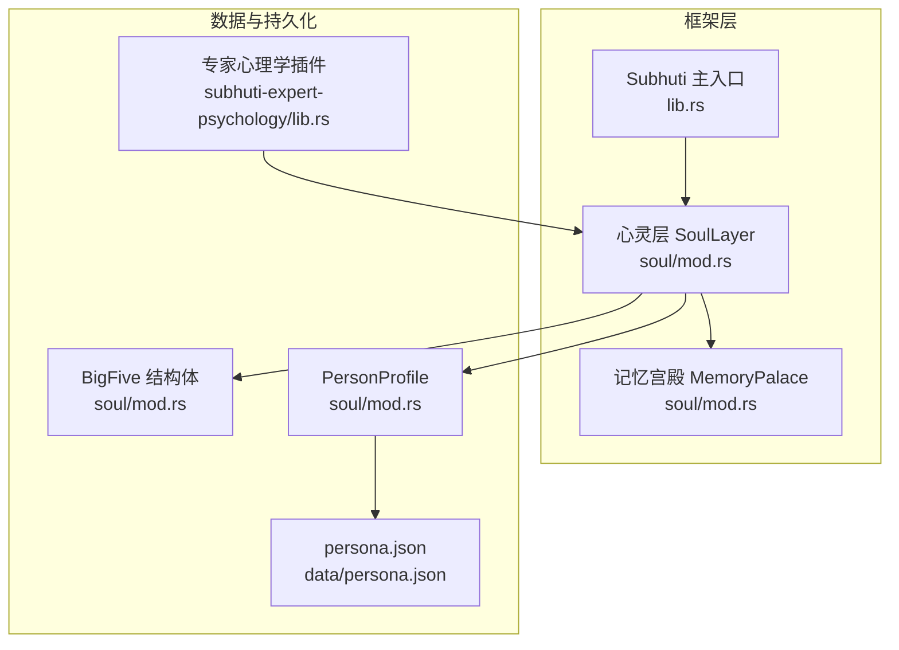
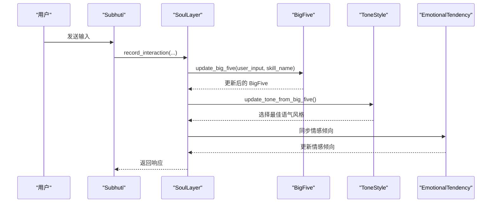
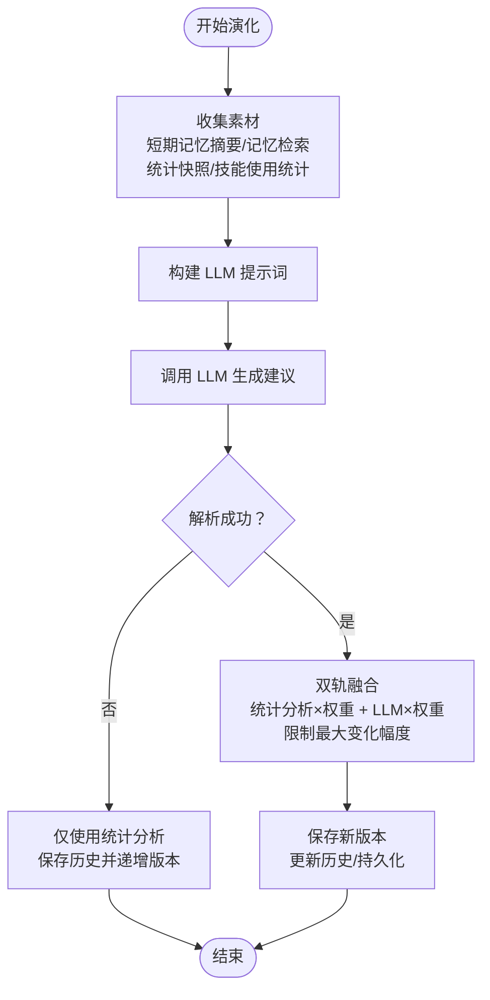
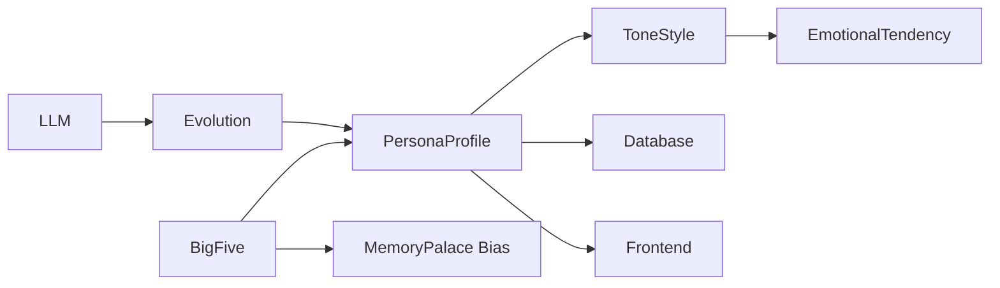

# 大五人格模型

<cite>
**本文引用的文件**
- [soul/mod.rs](file://crates/subhuti/src/soul/mod.rs)
- [lib.rs](file://crates/subhuti/src/lib.rs)
- [persona.json](file://crates/subhuti/data/persona.json)
- [lib.rs (专家心理学)](file://crates/subhuti-expert-psychology/src/lib.rs)
- [index.html](file://static/index.html)
</cite>

## 目录
1. [简介](#简介)
2. [项目结构](#项目结构)
3. [核心组件](#核心组件)
4. [架构总览](#架构总览)
5. [详细组件分析](#详细组件分析)
6. [依赖关系分析](#依赖关系分析)
7. [性能考量](#性能考量)
8. [故障排查指南](#故障排查指南)
9. [结论](#结论)
10. [附录](#附录)

## 简介
本文件面向“大五人格模型”在 AI Agent 中的工程实现，围绕开放性（Openness）、尽责性（Conscientiousness）、外向性（Extraversion）、宜人性（Agreeableness）、神经质（Neuroticism）五个维度，系统阐述其数据结构、默认值、数值范围、行为影响机制、计算方法与夹紧算法，并结合心理学理论背景、工程实现原理、实际应用场景与数值示例进行说明。读者可据此理解 Agent 如何通过 BigFive 的动态演化，驱动语气风格、情感倾向与技能偏好等行为表现。

## 项目结构
大五人格模型位于心灵层（Soul Layer）中，与记忆宫殿（MemoryPalace）协同工作，形成“记忆—人格—行为”的闭环。核心文件与职责如下：
- soul/mod.rs：BigFive 结构体、默认值、to_vec、clamp、更新逻辑、语气风格映射、演化融合等
- lib.rs：框架导出与集成入口，暴露 BigFive、ToneStyle、EmotionalTendency 等类型
- persona.json：持久化存储的初始人格快照（包含 BigFive 五维）
- lib.rs (专家心理学)：示例专家插件，展示如何以 BigFive 为基础构建角色
- index.html：前端可视化展示 BigFive 与技能熟练度

图表来源
- [soul/mod.rs:1-120](file://crates/subhuti/src/soul/mod.rs#L1-L120)
- [lib.rs:42-45](file://crates/subhuti/src/lib.rs#L42-L45)
- [persona.json:10-16](file://crates/subhuti/data/persona.json#L10-L16)
- [lib.rs (专家心理学):87-125](file://crates/subhuti-expert-psychology/src/lib.rs#L87-L125)

章节来源
- [soul/mod.rs:1-120](file://crates/subhuti/src/soul/mod.rs#L1-L120)
- [lib.rs:42-45](file://crates/subhuti/src/lib.rs#L42-L45)
- [persona.json:10-16](file://crates/subhuti/data/persona.json#L10-L16)
- [lib.rs (专家心理学):87-125](file://crates/subhuti-expert-psychology/src/lib.rs#L87-L125)

## 核心组件
- BigFive 结构体：承载五个人格维度，提供向量化与夹紧能力
- 语气风格（ToneStyle）：基于 BigFive 与预设特征向量的余弦相似度匹配
- 情感倾向（EmotionalTendency）：随语气风格联动更新
- 人格快照（PersonaProfile）：整合 BigFive、语气风格、情感倾向、技能熟练度、领域权重、互动统计与特征关键词
- 演化引擎：统计分析轨道与 LLM 自反思轨道双轨融合，渐进式调整 BigFive

章节来源
- [soul/mod.rs:47-94](file://crates/subhuti/src/soul/mod.rs#L47-L94)
- [soul/mod.rs:98-155](file://crates/subhuti/src/soul/mod.rs#L98-L155)
- [soul/mod.rs:204-240](file://crates/subhuti/src/soul/mod.rs#L204-L240)

## 架构总览
BigFive 在心灵层中贯穿“统计分析轨道”与“LLM 自反思轨道”，在每次交互中接收用户输入与技能调用信号，经由信号累加与学习率衰减，更新 BigFive，并通过余弦相似度映射到语气风格与情感倾向，再同步更新特征关键词与技能偏好权重。周期性地，LLM 生成演化建议，与统计分析结果按权重融合，完成渐进式的人格演化。

图表来源
- [soul/mod.rs:692-735](file://crates/subhuti/src/soul/mod.rs#L692-L735)
- [soul/mod.rs:801-879](file://crates/subhuti/src/soul/mod.rs#L801-L879)
- [soul/mod.rs:881-904](file://crates/subhuti/src/soul/mod.rs#L881-L904)

## 详细组件分析

### BigFive 数据结构与默认值
- 字段含义
  - 开放性（Openness）：探索新思想、创造力倾向
  - 尽责性（Conscientiousness）：严谨、精确、计划性
  - 外向性（Extraversion）：社交活跃、表达意愿
  - 宜人性（Agreeableness）：合作、共情、利他
  - 神经质（Neuroticism）：谨慎、保守、防御性（分数越高越谨慎/保守）
- 默认值
  - 默认 BigFive：开放性 0.6、尽责性 0.5、外向性 0.5、宜人性 0.7、神经质 0.4
  - 默认 PersonaProfile：包含上述 BigFive 默认值与若干领域权重、技能偏好等
- 数值范围
  - 严格限定在 [0, 1]，超出范围通过 clamp 夹紧
- 计算方法
  - to_vec：将五维转为长度为 5 的 f32 数组，用于余弦相似度计算
  - clamp：逐维夹紧至 [0, 1]

章节来源
- [soul/mod.rs:47-72](file://crates/subhuti/src/soul/mod.rs#L47-L72)
- [soul/mod.rs:74-94](file://crates/subhuti/src/soul/mod.rs#L74-L94)
- [soul/mod.rs:242-271](file://crates/subhuti/src/soul/mod.rs#L242-L271)

### BigFive 对 Agent 行为的影响机制
- 语气风格映射
  - 基于 BigFive 向量与预设语气风格特征向量的余弦相似度匹配，选择最优语气
  - 预设特征向量覆盖友好、正式、随意、热情、冷静、机智六种风格
- 情感倾向联动
  - 依据所选语气风格同步更新情感倾向（如热情对应乐观、冷静对应专业等）
- 记忆检索影响
  - 根据 BigFive 为记忆宫殿的各分区赋予偏置权重，影响检索与激活
- 技能偏好与熟练度
  - 技能熟练度采用 S 型曲线与指数滑动平均（EMA）更新
  - 熟练度同步影响技能偏好权重（skill_affinity），形成“用得越多越偏好”的正反馈
- 特征关键词
  - 根据阈值动态生成“友善、乐于助人、好奇心强、善于学习、严谨、精确、活泼、热情、谨慎、温和、可靠”等关键词

章节来源
- [soul/mod.rs:115-139](file://crates/subhuti/src/soul/mod.rs#L115-L139)
- [soul/mod.rs:419-445](file://crates/subhuti/src/soul/mod.rs#L419-L445)
- [soul/mod.rs:737-764](file://crates/subhuti/src/soul/mod.rs#L737-L764)
- [soul/mod.rs:906-936](file://crates/subhuti/src/soul/mod.rs#L906-L936)

### BigFive 更新信号与学习率
- 信号触发
  - 开放性：首次使用新技能、提问“为什么/怎么/原理”
  - 尽责性：使用计算器、出现数字/精确查询
  - 外向性：闲聊类技能、包含语气词、输入较短
  - 宜人性：用户表达感谢、礼貌用语
  - 神经质：用户抱怨/不满
- 学习率与夹紧
  - 使用配置中的 trait_learning_rate 控制更新幅度
  - 每次更新后调用 clamp，确保数值稳定在 [0, 1]

章节来源
- [soul/mod.rs:801-879](file://crates/subhuti/src/soul/mod.rs#L801-L879)

### 余弦相似度与语气风格匹配
- cosine_similarity：计算两个五维向量的余弦相似度
- update_tone_from_big_five：遍历所有语气风格，选择相似度最高的风格，并同步更新情感倾向

章节来源
- [soul/mod.rs:1429-1439](file://crates/subhuti/src/soul/mod.rs#L1429-L1439)
- [soul/mod.rs:881-904](file://crates/subhuti/src/soul/mod.rs#L881-L904)

### 演化融合：统计分析轨道与 LLM 自反思轨道
- 统计分析轨道（每次互动更新）
  - 更新技能熟练度（S 型+EMA）
  - 更新领域权重（关键词命中+技能匹配+自然衰减）
  - 更新 BigFive（信号累加+学习率+clamp）
  - 语气风格与情感倾向同步更新
  - 特征关键词动态生成
- LLM 自反思轨道（周期性）
  - 收集近期记忆与统计快照，构建分析提示词
  - LLM 生成演化建议（包含五维调整、领域权重、技能偏好、特征关键词）
  - 双轨融合：stat_weight × 统计分析 + llm_weight × LLM 建议，限制最大变化幅度
  - 保存历史版本并递增版本号

图表来源
- [soul/mod.rs:938-1077](file://crates/subhuti/src/soul/mod.rs#L938-L1077)
- [soul/mod.rs:1089-1136](file://crates/subhuti/src/soul/mod.rs#L1089-L1136)
- [soul/mod.rs:1181-1231](file://crates/subhuti/src/soul/mod.rs#L1181-L1231)

### 心理学理论背景与工程实现对照
- 理论背景
  - 大五人格模型（Big Five）：开放性、尽责性、外向性、宜人性、神经质
  - 余弦相似度：衡量向量方向一致性，用于风格匹配
  - S 型曲线：模拟学习过程的非线性增长
  - EMA：平滑历史信号，抑制噪声
- 工程实现
  - BigFive.to_vec 与 cosine_similarity 用于风格映射
  - update_big_five 以关键词与技能调用为信号源
  - update_skill_proficiency 采用 S 型与 EMA
  - evolve 与 merge_llm_suggestion 实现渐进式演化

章节来源
- [soul/mod.rs:74-94](file://crates/subhuti/src/soul/mod.rs#L74-L94)
- [soul/mod.rs:1429-1439](file://crates/subhuti/src/soul/mod.rs#L1429-L1439)
- [soul/mod.rs:801-879](file://crates/subhuti/src/soul/mod.rs#L801-L879)
- [soul/mod.rs:737-764](file://crates/subhuti/src/soul/mod.rs#L737-L764)
- [soul/mod.rs:938-1077](file://crates/subhuti/src/soul/mod.rs#L938-L1077)

### 实际应用场景与数值示例
- 场景一：用户频繁询问“为什么/怎么/原理”
  - 开放性上升，Agent 更倾向于探索性回答，语气风格可能偏向热情或友好
- 场景二：用户多次使用计算器
  - 尽责性上升，Agent 更注重精确与结构化表达
- 场景三：用户表达感谢/礼貌用语
  - 宜人性上升，Agent 更友善、共情
- 场景四：用户抱怨/不满
  - 神经质上升，Agent 更谨慎、保守，情感倾向可能转向谨慎
- 示例数值（来自 persona.json）
  - 开放性：约 0.65
  - 尽责性：约 0.59
  - 外向性：约 0.57
  - 宜人性：0.70
  - 神经质：0.40

章节来源
- [soul/mod.rs:801-879](file://crates/subhuti/src/soul/mod.rs#L801-L879)
- [persona.json:10-16](file://crates/subhuti/data/persona.json#L10-L16)

### 专家插件中的 BigFive 应用
- 心理咨询专家插件以高宜人性与低外向性、低神经质的 BigFive 体现温暖、共情与专业
- 通过 set_persona_from_expert 将专家角色注入心灵层，实现快速角色切换

章节来源
- [lib.rs (专家心理学):87-125](file://crates/subhuti-expert-psychology/src/lib.rs#L87-L125)
- [soul/mod.rs:504-528](file://crates/subhuti/src/soul/mod.rs#L504-L528)

## 依赖关系分析
- 模块耦合
  - BigFive 与 PersonaProfile 强耦合，前者决定后者的行为表现
  - 语气风格与情感倾向依赖 BigFive 的向量化表示
  - 记忆宫殿通过 BigFive 影响检索偏置，形成“记忆—人格—行为”的闭环
- 外部依赖
  - LLM：用于演化轨道的自反思与建议生成
  - 数据库：持久化存储 persona 快照与历史版本
  - 前端：可视化展示 BigFive 与技能熟练度

图表来源
- [soul/mod.rs:204-240](file://crates/subhuti/src/soul/mod.rs#L204-L240)
- [soul/mod.rs:419-445](file://crates/subhuti/src/soul/mod.rs#L419-L445)
- [soul/mod.rs:938-1077](file://crates/subhuti/src/soul/mod.rs#L938-L1077)

章节来源
- [soul/mod.rs:204-240](file://crates/subhuti/src/soul/mod.rs#L204-L240)
- [soul/mod.rs:419-445](file://crates/subhuti/src/soul/mod.rs#L419-L445)
- [soul/mod.rs:938-1077](file://crates/subhuti/src/soul/mod.rs#L938-L1077)

## 性能考量
- 计算复杂度
  - BigFive.to_vec 与 cosine_similarity 均为 O(5)，常数级开销
  - update_big_five 遍历固定数量的关键词集合，整体 O(1)
  - 记忆检索偏置计算 O(N_zones)，通常较小
- 内存与持久化
  - BigFive 与 PersonaProfile 为小对象，序列化成本低
  - 建议使用数据库持久化，避免频繁文件 IO
- 并发与锁
  - 心灵层使用互斥锁保护，记录交互与反馈时需注意锁粒度与临界区大小

## 故障排查指南
- 数值越界
  - 症状：BigFive 某维度超过 [0, 1]
  - 处理：确认是否调用了 clamp；检查学习率与信号累加是否过大
- 语气风格不匹配
  - 症状：风格与预期不符
  - 处理：检查 BigFive 是否被正确更新；确认特征向量权重是否合理
- 演化失败
  - 症状：LLM 解析失败导致仅统计分析更新
  - 处理：检查 LLM 输出格式；查看日志中的 JSON 提取位置
- 前端显示异常
  - 症状：BigFive 或技能熟练度显示异常
  - 处理：检查前端数据绑定与百分比计算逻辑

章节来源
- [soul/mod.rs:86-93](file://crates/subhuti/src/soul/mod.rs#L86-L93)
- [soul/mod.rs:1059-1067](file://crates/subhuti/src/soul/mod.rs#L1059-L1067)
- [static/index.html:1320-1336](file://static/index.html#L1320-L1336)

## 结论
大五人格模型在 Subhuti 框架中通过“统计分析轨道 + LLM 自反思轨道”的双轨机制，实现了对 Agent 行为的动态塑造。BigFive 以简洁的五维向量驱动语气风格、情感倾向、记忆检索偏置、技能偏好与特征关键词，既具备心理学理论基础，又满足工程上的可解释性与可控性。通过 clamp 与渐进融合策略，系统在保证稳定性的同时，允许 Agent 在真实交互中持续成长。

## 附录
- 前端可视化
  - BigFive 与技能熟练度的条形图渲染逻辑，便于观察与调试

章节来源
- [static/index.html:1320-1336](file://static/index.html#L1320-L1336)