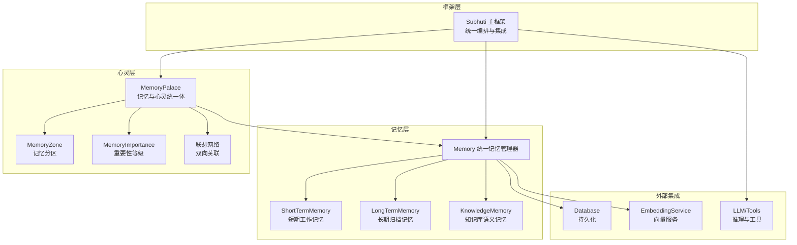
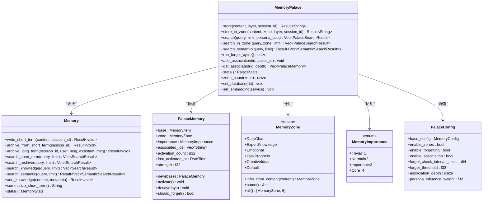
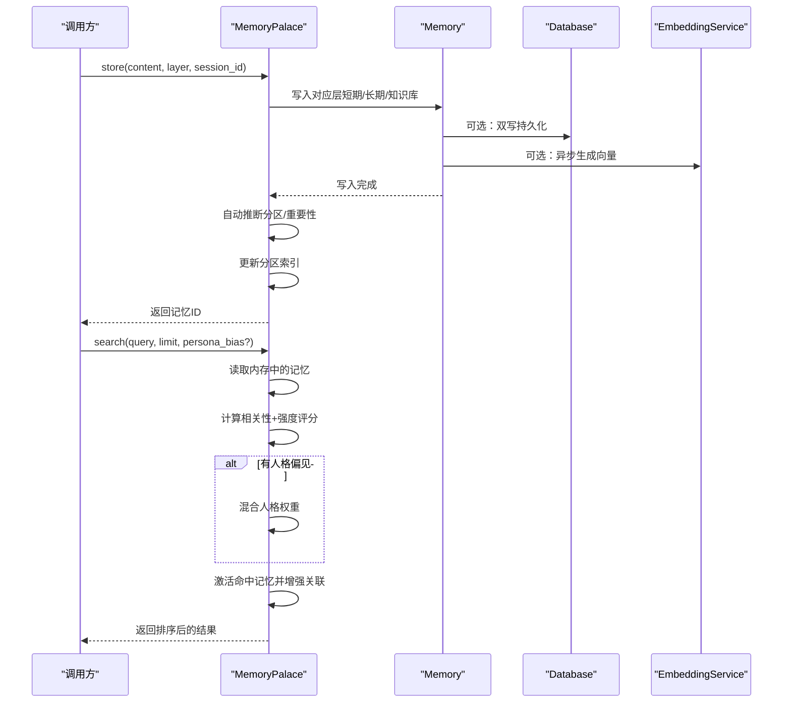
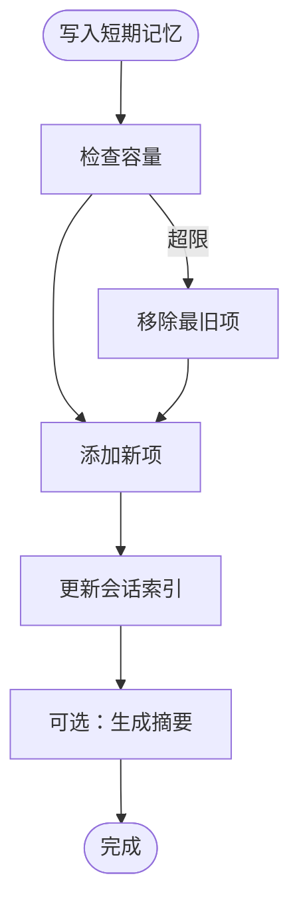
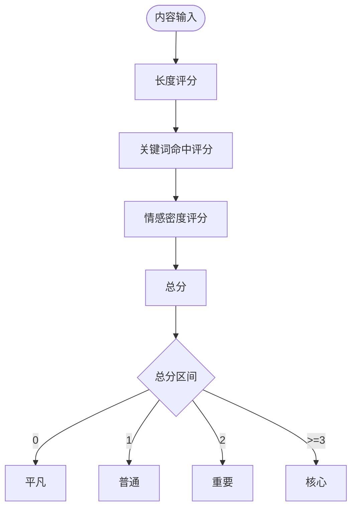
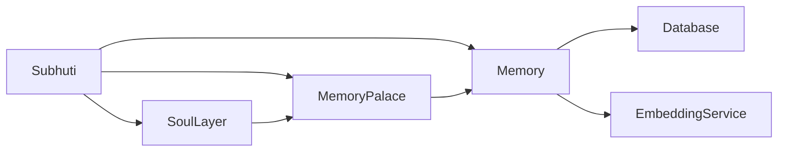

# 心灵宫殿架构

<cite>
**本文档引用的文件**
- [palace.rs](file://crates/subhuti/src/soul/palace.rs)
- [mod.rs](file://crates/subhuti/src/memory/mod.rs)
- [short_term.rs](file://crates/subhuti/src/memory/short_term.rs)
- [long_term.rs](file://crates/subhuti/src/memory/long_term.rs)
- [knowledge.rs](file://crates/subhuti/src/memory/knowledge.rs)
- [lib.rs](file://crates/subhuti/src/lib.rs)
- [mod.rs](file://crates/subhuti/src/soul/mod.rs)
- [integration_test.rs](file://crates/subhuti/tests/integration_test.rs)
- [test_debug_tools.rs](file://crates/subhuti/tests/test_debug_tools.rs)
- [persona.json](file://crates/subhuti/data/persona.json)
</cite>

## 目录
1. [简介](#简介)
2. [项目结构](#项目结构)
3. [核心组件](#核心组件)
4. [架构总览](#架构总览)
5. [详细组件分析](#详细组件分析)
6. [依赖关系分析](#依赖关系分析)
7. [性能考量](#性能考量)
8. [故障排查指南](#故障排查指南)
9. [结论](#结论)
10. [附录](#附录)

## 简介
本文件系统性阐述“心灵宫殿”作为记忆与心灵统一体的设计理念与实现架构。它将记忆视为心灵的“房间”，通过三层记忆结构（短期、长期、知识库）、记忆分区（MemoryZone）、重要性等级（MemoryImportance）、联想网络（Association Network），以及人格影响的搜索机制，构建出既可解释又可演化的智能体记忆体系。同时，结合记忆系统的深度集成，实现记忆激活、遗忘清理、关联建立等高级功能，并提供统计信息与健康检查能力。

## 项目结构
心灵宫殿位于 soul 模块，记忆系统位于 memory 模块，二者通过 MemoryPalace 统一对外暴露。整体采用分层架构：Memory 层负责三层记忆的存储与检索；Soul 层负责人格与演化；Subhuti 主框架负责编排与集成。

图表来源
- [lib.rs:84-156](file://crates/subhuti/src/lib.rs#L84-L156)
- [palace.rs:228-316](file://crates/subhuti/src/soul/palace.rs#L228-L316)
- [mod.rs:163-173](file://crates/subhuti/src/memory/mod.rs#L163-L173)

章节来源
- [lib.rs:1-100](file://crates/subhuti/src/lib.rs#L1-L100)
- [palace.rs:1-52](file://crates/subhuti/src/soul/palace.rs#L1-L52)
- [mod.rs:1-52](file://crates/subhuti/src/memory/mod.rs#L1-L52)

## 核心组件
- MemoryPalace：记忆与心灵的统一体，负责记忆写入、搜索、遗忘、关联、统计与配置。
- Memory：三层记忆的统一管理器，提供短期、长期、知识库的写入、检索、归档与统计。
- MemoryZone：记忆分区枚举，将记忆按主题分区存储（如日常对话、专业知识、情感记忆、任务进度、创意想法、默认）。
- MemoryImportance：记忆重要性等级，决定遗忘速度与强度衰减。
- PalaceConfig：心灵宫殿配置，控制分区、遗忘、关联、人格影响等行为。
- PalaceSearchResult：搜索结果包装，包含记忆项与评分。
- PalaceStats：统计信息，汇总总数、分区分布、重要性分布、平均强度与基础统计。

章节来源
- [palace.rs:34-155](file://crates/subhuti/src/soul/palace.rs#L34-L155)
- [palace.rs:248-274](file://crates/subhuti/src/soul/palace.rs#L248-L274)
- [palace.rs:773-791](file://crates/subhuti/src/soul/palace.rs#L773-L791)
- [mod.rs:30-52](file://crates/subhuti/src/memory/mod.rs#L30-L52)

## 架构总览
心灵宫殿以 MemoryPalace 为核心，向上提供统一的记忆服务，向下委托 Memory 的三层记忆实现。Memory 通过短、长、知三类存储分别承载不同生命周期与用途的记忆，并可选地接入数据库与嵌入服务，实现持久化与向量检索。Soul 层通过 Personality 与 EvolutionEngine 对记忆进行人格化引导与演化。

图表来源
- [palace.rs:228-316](file://crates/subhuti/src/soul/palace.rs#L228-L316)
- [palace.rs:138-224](file://crates/subhuti/src/soul/palace.rs#L138-L224)
- [palace.rs:34-115](file://crates/subhuti/src/soul/palace.rs#L34-L115)
- [palace.rs:120-133](file://crates/subhuti/src/soul/palace.rs#L120-L133)
- [palace.rs:248-274](file://crates/subhuti/src/soul/palace.rs#L248-L274)
- [mod.rs:163-444](file://crates/subhuti/src/memory/mod.rs#L163-L444)

## 详细组件分析

### MemoryPalace：记忆与心灵的统一体
- 记忆写入与分区
  - 自动推断分区：根据内容关键词自动分类至日常对话、专业知识、情感记忆、任务进度、创意想法或默认。
  - 手动指定分区：允许显式指定分区写入。
  - 分层写入：短期记忆写入短期存储并可双写数据库；长期记忆写入归档；知识库写入知识库。
- 搜索与评分
  - 文本匹配：全字匹配优先，其次按词匹配比例评分。
  - 强度加权：最终得分乘以记忆强度，强度越高越易被召回。
  - 人格影响：可传入分区偏好映射，按权重混合最终得分。
  - 激活增强：命中记忆在返回前被激活，提升其强度，并联动增强其关联记忆。
- 遗忘与清理
  - 时间衰减：按重要性等级设定衰减率，强度随时间下降。
  - 忽略阈值：低于阈值的记忆被标记为遗忘并清理。
  - 分区同步：删除记忆时同步更新分区索引。
- 联想网络
  - 双向关联：添加关联时互相写入，形成双向网络。
  - 深度检索：按深度遍历关联记忆，支持多跳联想。
- 统计与监控
  - 分区统计：统计各分区记忆数量。
  - 重要性统计：统计重要性等级分布。
  - 平均强度：计算当前平均记忆强度。
  - 基础统计：委托 Memory 统计三层记忆数量。

图表来源
- [palace.rs:320-376](file://crates/subhuti/src/soul/palace.rs#L320-L376)
- [palace.rs:423-566](file://crates/subhuti/src/soul/palace.rs#L423-L566)
- [mod.rs:260-318](file://crates/subhuti/src/memory/mod.rs#L260-L318)

章节来源
- [palace.rs:320-376](file://crates/subhuti/src/soul/palace.rs#L320-L376)
- [palace.rs:423-566](file://crates/subhuti/src/soul/palace.rs#L423-L566)
- [palace.rs:582-635](file://crates/subhuti/src/soul/palace.rs#L582-L635)
- [palace.rs:639-700](file://crates/subhuti/src/soul/palace.rs#L639-L700)
- [palace.rs:704-731](file://crates/subhuti/src/soul/palace.rs#L704-L731)

### Memory：三层记忆系统
- 短期记忆（ShortTermMemory）
  - 容量限制与滑动窗口：超过容量时移除最旧项。
  - 会话索引：按 session_id 维护索引，便于归档与查询。
  - 摘要生成：基于首尾消息生成简要摘要。
- 长期记忆（LongTermMemory）
  - 关键词索引：按词建立索引，加速检索。
  - 会话索引：支持按会话检索。
- 知识库（KnowledgeMemory）
  - 简化向量：使用词袋模型与余弦相似度实现语义检索。
  - 可替换：实际项目可替换为专业向量数据库（如 Qdrant、Chroma 等）。

图表来源
- [short_term.rs:30-47](file://crates/subhuti/src/memory/short_term.rs#L30-L47)
- [short_term.rs:97-108](file://crates/subhuti/src/memory/short_term.rs#L97-L108)

章节来源
- [mod.rs:163-444](file://crates/subhuti/src/memory/mod.rs#L163-L444)
- [short_term.rs:1-158](file://crates/subhuti/src/memory/short_term.rs#L1-L158)
- [long_term.rs:1-129](file://crates/subhuti/src/memory/long_term.rs#L1-L129)
- [knowledge.rs:1-166](file://crates/subhuti/src/memory/knowledge.rs#L1-L166)

### 记忆分区与重要性
- 记忆分区（MemoryZone）
  - 自动推断：根据内容关键词集合自动分类。
  - 名称与枚举：提供名称映射与全集枚举。
- 记忆重要性（MemoryImportance）
  - 估算规则：综合内容长度、关键词命中、情感密度等。
  - 衰减策略：不同等级对应不同衰减率与遗忘阈值。

图表来源
- [palace.rs:173-198](file://crates/subhuti/src/soul/palace.rs#L173-L198)

章节来源
- [palace.rs:34-115](file://crates/subhuti/src/soul/palace.rs#L34-L115)
- [palace.rs:120-133](file://crates/subhuti/src/soul/palace.rs#L120-L133)
- [palace.rs:173-198](file://crates/subhuti/src/soul/palace.rs#L173-L198)

### 人格影响与搜索
- 人格偏见权重：通过 persona_zone_bias 映射，将某分区权重放大，从而影响最终排序。
- 混合公式：最终得分 = relevance × strength × (1 - influence) + zone_weight × influence。
- 分区搜索：提供按分区搜索的便捷方法，内部构造偏见映射。

章节来源
- [palace.rs:423-518](file://crates/subhuti/src/soul/palace.rs#L423-L518)
- [palace.rs:568-573](file://crates/subhuti/src/soul/palace.rs#L568-L573)

### 联想网络与激活增强
- 双向关联：添加关联时互相写入，确保双向可达。
- 激活增强：命中记忆被激活，强度提升；其关联记忆也被轻微增强，促进网络扩散。

章节来源
- [palace.rs:639-665](file://crates/subhuti/src/soul/palace.rs#L639-L665)
- [palace.rs:537-562](file://crates/subhuti/src/soul/palace.rs#L537-L562)

### 统计信息与健康检查
- PalaceStats：聚合总数、分区分布、重要性分布、平均强度与基础统计。
- 健康检查：Subhuti 提供健康报告，包含 MemoryPalace、Database、SoulLayer、ExpertPlugins、Skills 等组件状态。

章节来源
- [palace.rs:704-731](file://crates/subhuti/src/soul/palace.rs#L704-L731)
- [lib.rs:574-647](file://crates/subhuti/src/lib.rs#L574-L647)

## 依赖关系分析
- MemoryPalace 依赖 Memory 的三层存储与可选数据库/嵌入服务。
- Memory 依赖 Database 与 EmbeddingService（可选），并在写入短期记忆时进行双写与异步向量生成。
- Subhuti 在初始化时创建 MemoryPalace 并将其注入 SoulLayer，同时将数据库与嵌入服务传递给两者。

图表来源
- [lib.rs:116-131](file://crates/subhuti/src/lib.rs#L116-L131)
- [lib.rs:170-184](file://crates/subhuti/src/lib.rs#L170-L184)
- [palace.rs:290-316](file://crates/subhuti/src/soul/palace.rs#L290-L316)

章节来源
- [lib.rs:116-131](file://crates/subhuti/src/lib.rs#L116-L131)
- [lib.rs:170-184](file://crates/subhuti/src/lib.rs#L170-L184)
- [palace.rs:290-316](file://crates/subhuti/src/soul/palace.rs#L290-L316)

## 性能考量
- 读写锁策略：搜索阶段先读锁扫描与评分，再释放锁进行排序与激活，减少写锁持有时间。
- 分区索引：启用分区时维护 zone_index，加速按分区检索。
- 异步处理：数据库写入与向量生成采用异步任务，避免阻塞主线程。
- 衰减与清理：定期遗忘周期降低无效记忆占用，保持系统稳定。

## 故障排查指南
- 记忆未被搜索到
  - 检查查询是否为空或过于宽泛，确认相关性评分是否为零。
  - 确认记忆强度是否低于阈值，必要时触发激活或缩短遗忘周期。
- 遗忘过多
  - 调整遗忘阈值与检查间隔，或减少 Core/Important 等级记忆的衰减。
- 关联网络不生效
  - 确认 enable_association 已开启，且双向关联已正确添加。
- 数据库/嵌入服务异常
  - 检查初始化流程与环境变量（如 OLLAMA_URL、EMBEDDING_MODEL），确认连接可用。

章节来源
- [palace.rs:582-635](file://crates/subhuti/src/soul/palace.rs#L582-L635)
- [palace.rs:639-700](file://crates/subhuti/src/soul/palace.rs#L639-L700)
- [lib.rs:158-188](file://crates/subhuti/src/lib.rs#L158-L188)

## 结论
心灵宫殿通过 MemoryPalace 将记忆的“房间化”组织、重要性分级、联想网络与人格影响有机结合，形成可解释、可演化的智能体记忆体系。配合 Memory 的三层存储与可选数据库/嵌入服务，实现了从短期工作记忆到长期沉淀再到知识库检索的完整闭环。通过统计与健康检查，系统具备良好的可观测性与可维护性。

## 附录

### 实际使用示例（路径指引）
- 写入记忆并按分区检索
  - [palace.rs:320-376](file://crates/subhuti/src/soul/palace.rs#L320-L376)
  - [palace.rs:568-573](file://crates/subhuti/src/soul/palace.rs#L568-L573)
- 语义搜索
  - [palace.rs:575-578](file://crates/subhuti/src/soul/palace.rs#L575-L578)
  - [mod.rs:385-407](file://crates/subhuti/src/memory/mod.rs#L385-L407)
- 执行遗忘周期
  - [palace.rs:582-635](file://crates/subhuti/src/soul/palace.rs#L582-L635)
- 添加双向关联并获取联想记忆
  - [palace.rs:639-700](file://crates/subhuti/src/soul/palace.rs#L639-L700)
- 获取统计信息
  - [palace.rs:704-731](file://crates/subhuti/src/soul/palace.rs#L704-L731)
- 健康检查
  - [lib.rs:574-647](file://crates/subhuti/src/lib.rs#L574-L647)

### 配置参数说明（PalaceConfig）
- base_config：继承自 MemoryConfig，控制容量、阈值、维度等。
- enable_zones：是否启用分区索引。
- enable_forgetting：是否启用遗忘周期。
- enable_association：是否启用联想网络。
- forget_check_interval_secs：遗忘检查间隔（秒）。
- forget_threshold：遗忘阈值。
- association_depth：联想检索深度。
- persona_influence_weight：人格偏见权重。

章节来源
- [palace.rs:248-274](file://crates/subhuti/src/soul/palace.rs#L248-L274)
- [mod.rs:30-52](file://crates/subhuti/src/memory/mod.rs#L30-L52)