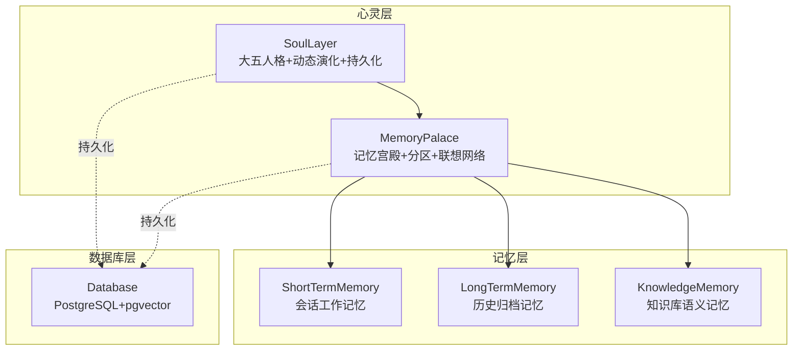
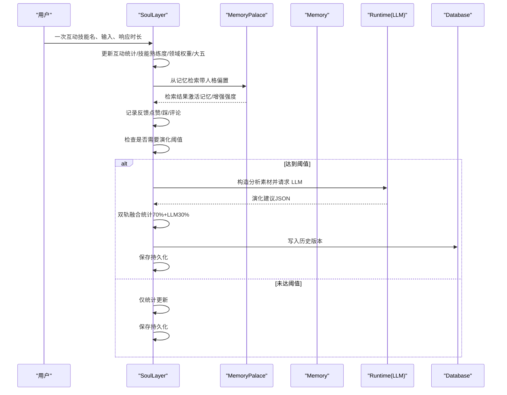
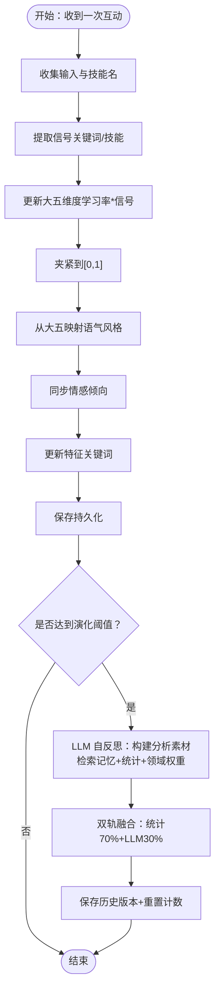
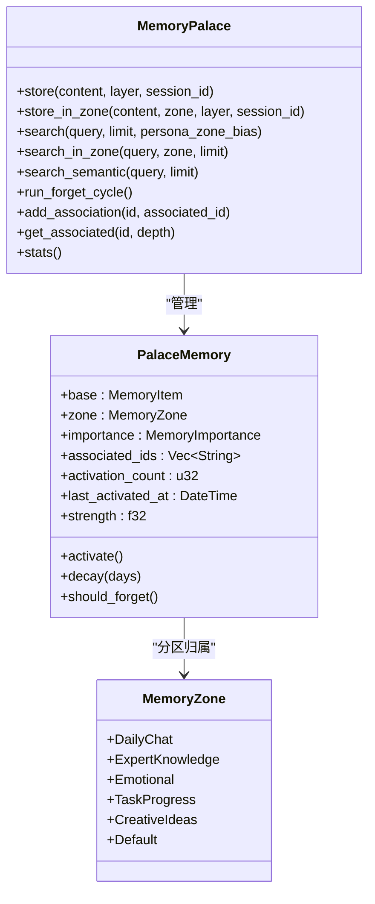
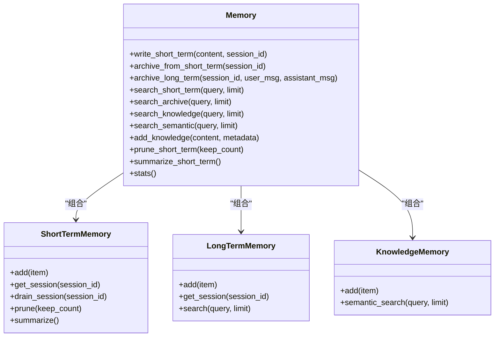
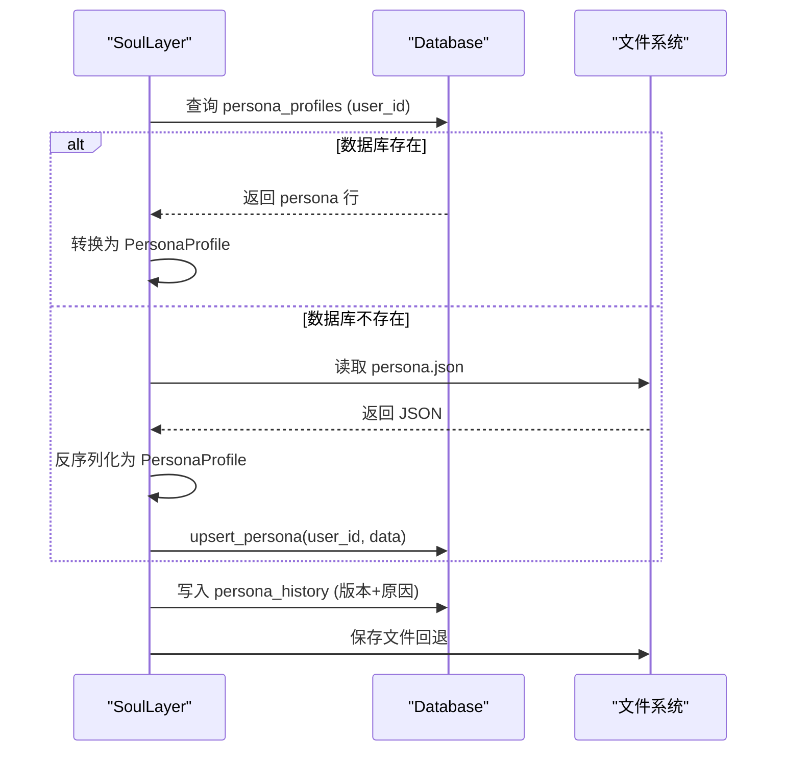
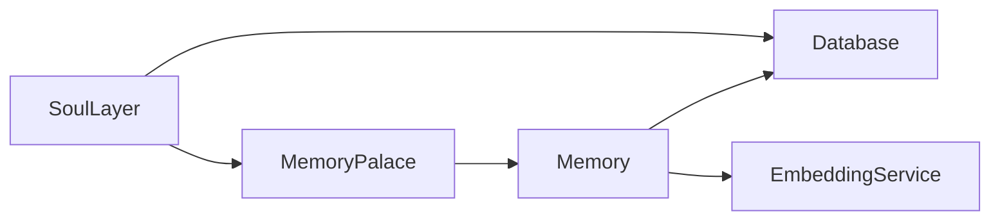

# 心灵层

<cite>
**本文引用的文件**
- [soul/mod.rs](file://crates/subhuti/src/soul/mod.rs)
- [soul/palace.rs](file://crates/subhuti/src/soul/palace.rs)
- [memory/mod.rs](file://crates/subhuti/src/memory/mod.rs)
- [memory/short_term.rs](file://crates/subhuti/src/memory/short_term.rs)
- [memory/long_term.rs](file://crates/subhuti/src/memory/long_term.rs)
- [memory/knowledge.rs](file://crates/subhuti/src/memory/knowledge.rs)
- [db/mod.rs](file://crates/subhuti/src/db/mod.rs)
- [data/persona.json](file://crates/subhuti/data/persona.json)
- [tests/integration_test.rs](file://crates/subhuti/tests/integration_test.rs)
</cite>

## 目录
1. [简介](#简介)
2. [项目结构](#项目结构)
3. [核心组件](#核心组件)
4. [架构总览](#架构总览)
5. [详细组件分析](#详细组件分析)
6. [依赖关系分析](#依赖关系分析)
7. [性能考量](#性能考量)
8. [故障排查指南](#故障排查指南)
9. [结论](#结论)
10. [附录](#附录)

## 简介
本文件面向 Subhuti 心灵层的心理学与工程实现，系统阐述大五人格模型在 AI Agent 中的应用与实现，动态演化机制（双轨驱动：统计分析轨道 + LLM 自反思轨道）的工作原理，以及心灵宫殿架构（Memory Palace）的组织结构与记忆分区映射关系。文档还涵盖人格配置管理（Persona Profile）的数据结构、加载与持久化策略，并给出心理学术背景与工程实现细节，辅以实际的人格测试示例、行为预测演示与个性化交互案例。

## 项目结构
心灵层位于 crates/subhuti/src/soul 下，核心由“心灵层”（SoulLayer）与“心灵宫殿”（MemoryPalace）两大子系统构成；记忆层位于 crates/subhuti/src/memory 下，提供短期、长期与知识库三层记忆；数据库层位于 crates/subhuti/src/db 下，提供 persona_profiles、persona_history、memories 等表的持久化能力。

图表来源
- [soul/mod.rs:297-349](file://crates/subhuti/src/soul/mod.rs#L297-L349)
- [soul/palace.rs:228-234](file://crates/subhuti/src/soul/palace.rs#L228-L234)
- [memory/mod.rs:164-173](file://crates/subhuti/src/memory/mod.rs#L164-L173)
- [db/mod.rs:46-48](file://crates/subhuti/src/db/mod.rs#L46-L48)

章节来源
- [soul/mod.rs:1-120](file://crates/subhuti/src/soul/mod.rs#L1-L120)
- [soul/palace.rs:1-52](file://crates/subhuti/src/soul/palace.rs#L1-L52)
- [memory/mod.rs:1-52](file://crates/subhuti/src/memory/mod.rs#L1-L52)
- [db/mod.rs:1-42](file://crates/subhuti/src/db/mod.rs#L1-L42)

## 核心组件
- 大五人格模型（Big Five）：开放性、尽责性、外向性、宜人性、神经质，用于刻画性格五维并驱动语气风格、情感倾向与行为偏好。
- 语气风格与情感倾向：基于大五映射，形成 Friendly、Formal、Casual、Enthusiastic、Calm、Witty 等风格与 Optimistic、Neutral、Cautious、Humorous、Professional 等倾向。
- 互动统计与反馈：记录总互动次数、平均响应时长、点赞/踩、技能使用频次与用户反馈，作为统计分析轨道的输入。
- 心灵层（SoulLayer）：负责人格快照管理、动态演化、持久化与与记忆宫殿的联动。
- 心灵宫殿（MemoryPalace）：三层记忆结构（短期、长期、知识库）+ 六个记忆分区（日常对话、专业知识、情感记忆、任务进度、创意想法、默认）+ 联想网络与遗忘机制。
- 记忆层（Memory）：统一记忆管理器，封装短期、长期与知识库三类记忆，支持向量检索与数据库双写。
- 数据库层（Database）：提供 persona_profiles、persona_history、memories 等表，支持 JSONB 字段与 pgvector 向量检索。

章节来源
- [soul/mod.rs:47-240](file://crates/subhuti/src/soul/mod.rs#L47-L240)
- [soul/palace.rs:34-115](file://crates/subhuti/src/soul/palace.rs#L34-L115)
- [memory/mod.rs:54-132](file://crates/subhuti/src/memory/mod.rs#L54-L132)
- [db/mod.rs:74-178](file://crates/subhuti/src/db/mod.rs#L74-L178)

## 架构总览
心灵层采用“双轨驱动”的动态演化架构：
- 统计分析轨道（实时、轻量）：每次互动触发，更新技能熟练度、领域权重、大五人格、语气风格与特征关键词。
- LLM 自反思轨道（周期性、深度）：每 N 次互动触发一次，使用心灵宫殿检索与记忆统计构建分析素材，经 LLM 生成演化建议，与统计结果进行加权融合，最终保存版本历史。

图表来源
- [soul/mod.rs:692-735](file://crates/subhuti/src/soul/mod.rs#L692-L735)
- [soul/mod.rs:940-1077](file://crates/subhuti/src/soul/mod.rs#L940-L1077)
- [soul/palace.rs:423-566](file://crates/subhuti/src/soul/palace.rs#L423-L566)
- [db/mod.rs:296-353](file://crates/subhuti/src/db/mod.rs#L296-L353)

章节来源
- [soul/mod.rs:27-31](file://crates/subhuti/src/soul/mod.rs#L27-L31)
- [soul/mod.rs:575-578](file://crates/subhuti/src/soul/mod.rs#L575-L578)
- [soul/mod.rs:938-1077](file://crates/subhuti/src/soul/mod.rs#L938-L1077)

## 详细组件分析

### 大五人格模型与动态演化机制
- 大五维度与夹紧约束：开放性、尽责性、外向性、宜人性、神经质，均夹紧在 [0,1] 区间，避免越界。
- 信号触发更新：根据用户输入关键词（如“为什么/怎么/原理”、“计算器/数字”、“聊天/语气词”、“感谢/礼貌”、“抱怨/不满”）与技能使用情况，为各维度注入正负信号，按学习率累积更新。
- 语气风格与情感倾向：基于大五向量与风格特征向量的余弦相似度匹配，选择最佳风格，并同步更新情感倾向。
- 特征关键词：依据维度阈值动态生成“友善/乐于助人/好奇心强/严谨/热情/谨慎/温和/可靠”等关键词。
- 双轨融合：统计分析（70%）与 LLM 建议（30%）加权融合，最大变化幅度限制，避免突变。

图表来源
- [soul/mod.rs:801-879](file://crates/subhuti/src/soul/mod.rs#L801-L879)
- [soul/mod.rs:881-904](file://crates/subhuti/src/soul/mod.rs#L881-L904)
- [soul/mod.rs:906-936](file://crates/subhuti/src/soul/mod.rs#L906-L936)
- [soul/mod.rs:938-1077](file://crates/subhuti/src/soul/mod.rs#L938-L1077)

章节来源
- [soul/mod.rs:47-94](file://crates/subhuti/src/soul/mod.rs#L47-L94)
- [soul/mod.rs:801-879](file://crates/subhuti/src/soul/mod.rs#L801-L879)
- [soul/mod.rs:881-936](file://crates/subhuti/src/soul/mod.rs#L881-L936)
- [soul/mod.rs:1089-1136](file://crates/subhuti/src/soul/mod.rs#L1089-L1136)

### 心灵宫殿架构与记忆分区映射
- 记忆分区（六房）：日常对话、专业知识、情感记忆、任务进度、创意想法、默认。
- 分区映射关系：开放性高偏好创意与专业知识；尽责性高偏好任务进度；外向性高偏好日常对话；宜人性高偏好情感记忆；神经质高偏好专业知识与任务进度（谨慎）。
- 搜索与人格影响：搜索时可传入“分区偏好权重”，将人格维度映射为不同分区的权重，提升相关记忆的最终得分。
- 联想网络：记忆项之间可建立双向关联，检索结果激活主记忆与关联记忆，增强其强度。
- 遗忘机制：按重要性等级（转瞬即逝/普通/重要/核心）与时间衰减计算强度，低于阈值的记忆被遗忘清理。

图表来源
- [soul/palace.rs:228-234](file://crates/subhuti/src/soul/palace.rs#L228-L234)
- [soul/palace.rs:34-52](file://crates/subhuti/src/soul/palace.rs#L34-L52)
- [soul/palace.rs:138-155](file://crates/subhuti/src/soul/palace.rs#L138-L155)
- [soul/palace.rs:423-566](file://crates/subhuti/src/soul/palace.rs#L423-L566)

章节来源
- [soul/palace.rs:34-115](file://crates/subhuti/src/soul/palace.rs#L34-L115)
- [soul/palace.rs:423-566](file://crates/subhuti/src/soul/palace.rs#L423-L566)
- [soul/palace.rs:582-635](file://crates/subhuti/src/soul/palace.rs#L582-L635)
- [soul/palace.rs:639-700](file://crates/subhuti/src/soul/palace.rs#L639-L700)

### 记忆层与三层结构
- 短期记忆（会话工作记忆）：容量有限，超限自动归档；支持按会话检索与摘要。
- 长期记忆（历史归档）：非自动注入上下文，需主动检索；支持按会话与关键词索引。
- 知识库（语义记忆）：向量检索，支持余弦相似度；演示实现使用词袋向量，实际项目可接入专业向量数据库。
- 统一记忆管理器：Memory 提供写入短期记忆、归档、搜索、统计等统一接口；可配置数据库与嵌入服务，实现双写与向量索引。

图表来源
- [memory/mod.rs:164-173](file://crates/subhuti/src/memory/mod.rs#L164-L173)
- [memory/short_term.rs:20-47](file://crates/subhuti/src/memory/short_term.rs#L20-L47)
- [memory/long_term.rs:21-53](file://crates/subhuti/src/memory/long_term.rs#L21-L53)
- [memory/knowledge.rs:70-95](file://crates/subhuti/src/memory/knowledge.rs#L70-L95)

章节来源
- [memory/mod.rs:164-444](file://crates/subhuti/src/memory/mod.rs#L164-L444)
- [memory/short_term.rs:20-158](file://crates/subhuti/src/memory/short_term.rs#L20-L158)
- [memory/long_term.rs:21-129](file://crates/subhuti/src/memory/long_term.rs#L21-L129)
- [memory/knowledge.rs:70-166](file://crates/subhuti/src/memory/knowledge.rs#L70-L166)

### 人格配置管理（Persona Profile）与持久化
- 数据结构：版本号、创建/更新时间、角色名/描述、语气风格、情感倾向、大五、技能熟练度、擅长领域、技能偏好、互动统计、特征关键词。
- 多用户支持：user_profiles 映射 user_id -> PersonaProfile；默认用户为 "default"。
- 加载机制：优先从数据库加载 persona_profiles，若失败则回退到文件 persona.json；加载后可同步至数据库。
- 持久化策略：优先写入数据库 persona_profiles 与 persona_history；失败时回退到文件存储；支持异步写入与同步。

图表来源
- [soul/mod.rs:1240-1289](file://crates/subhuti/src/soul/mod.rs#L1240-L1289)
- [soul/mod.rs:1324-1371](file://crates/subhuti/src/soul/mod.rs#L1324-L1371)
- [db/mod.rs:248-353](file://crates/subhuti/src/db/mod.rs#L248-L353)
- [data/persona.json:1-44](file://crates/subhuti/data/persona.json#L1-L44)

章节来源
- [soul/mod.rs:204-240](file://crates/subhuti/src/soul/mod.rs#L204-L240)
- [soul/mod.rs:1240-1391](file://crates/subhuti/src/soul/mod.rs#L1240-L1391)
- [db/mod.rs:248-353](file://crates/subhuti/src/db/mod.rs#L248-L353)
- [data/persona.json:1-44](file://crates/subhuti/data/persona.json#L1-L44)

## 依赖关系分析
- 心灵层依赖记忆层与数据库层：SoulLayer 在记录互动、更新人格、触发演化时，会调用 MemoryPalace 的检索与统计，必要时回退到 Memory；持久化依赖 Database。
- 记忆层依赖数据库与嵌入服务：Memory 在写入短期记忆时可双写数据库并异步生成向量；知识库语义检索依赖嵌入服务与数据库向量索引。
- 数据库层提供 persona_profiles、persona_history、memories 等表，支持 JSONB 与 pgvector。

图表来源
- [soul/mod.rs:36-43](file://crates/subhuti/src/soul/mod.rs#L36-L43)
- [memory/mod.rs:28-29](file://crates/subhuti/src/memory/mod.rs#L28-L29)
- [db/mod.rs:46-48](file://crates/subhuti/src/db/mod.rs#L46-L48)

章节来源
- [soul/mod.rs:36-43](file://crates/subhuti/src/soul/mod.rs#L36-L43)
- [memory/mod.rs:28-29](file://crates/subhuti/src/memory/mod.rs#L28-L29)
- [db/mod.rs:46-48](file://crates/subhuti/src/db/mod.rs#L46-L48)

## 性能考量
- 统计分析轨道：每次互动执行，开销主要来自技能熟练度更新、领域权重与大五更新，均为 O(1) 或 O(n_skills) 的轻量计算。
- LLM 自反思轨道：周期性触发，构建分析素材与调用 LLM，成本较高；通过阈值控制频率，避免频繁调用。
- 记忆检索：MemoryPalace 搜索在读锁内完成评分与排序，激活与增强关联记忆在写锁中进行，避免长时间持锁；联想网络与遗忘周期按配置启用，减少无效计算。
- 数据库与嵌入：双写与异步向量生成，降低主线程阻塞；向量索引与索引优化可显著提升检索性能。

## 故障排查指南
- 数据库连接失败：检查数据库配置与连接字符串；确认 pgvector 扩展已启用；查看表初始化日志。
- 记忆向量维度不匹配：迁移时若 embedding 维度不一致，需重建列；生产环境建议使用安全迁移脚本。
- LLM 解析失败：当 LLM 返回非 JSON 结果时，系统回退到仅统计分析更新；检查提示词与 LLM 输出格式。
- 文件持久化回退：数据库不可用时自动回退到文件 persona.json；确保存储路径可写且目录存在。
- 集成测试：通过集成测试验证记忆存储、搜索、遗忘、分区统计、人格系统、技能系统与专家插件等模块协同工作。

章节来源
- [db/mod.rs:67-180](file://crates/subhuti/src/db/mod.rs#L67-L180)
- [db/mod.rs:182-244](file://crates/subhuti/src/db/mod.rs#L182-L244)
- [soul/mod.rs:1059-1067](file://crates/subhuti/src/soul/mod.rs#L1059-L1067)
- [soul/mod.rs:1240-1289](file://crates/subhuti/src/soul/mod.rs#L1240-L1289)
- [tests/integration_test.rs:1-382](file://crates/subhuti/tests/integration_test.rs#L1-L382)

## 结论
Subhuti 的心灵层以大五人格模型为核心，结合“统计分析轨道 + LLM 自反思轨道”的双轨驱动机制，实现了可解释、渐进式、可追踪的人格动态演化。心灵宫殿作为记忆与心灵的统一体，通过分区、联想网络与遗忘机制，将记忆塑造成影响人格、同时被人格筛选与解释的闭环。数据库层提供可靠的持久化与向量检索能力，支撑长期演化的可追溯性与高性能检索。整体架构兼顾心理学理论与工程实践，既满足个性化交互需求，又具备良好的扩展性与可维护性。

## 附录

### 心理学理论背景
- 大五人格模型（Big Five）：开放性（创造力/好奇心）、尽责性（严谨/目标导向）、外向性（社交/活力）、宜人性（合作/信任）、神经质（情绪稳定性/防御性）。在 AI 交互中，这些维度直接影响语气风格、情感倾向、行为偏好与记忆偏好。
- 动态演化：基于行为反馈与记忆检索的统计分析，结合 LLM 的深度反思，实现渐进式的人格调整，避免突变，保持稳定性与可解释性。
- 记忆宫殿：将记忆按主题分区，赋予不同重要性与关联网络，使记忆成为塑造人格的“食物”，同时人格也筛选与解释记忆，形成双向影响。

### 实际应用示例与演示

- 人格测试示例
  - 场景：用户连续提问“为什么”“怎么”“原理”，系统识别为开放性信号，适度提升开放性；随后用户使用计算器技能，系统识别为尽责性信号，适度提升尽责性；用户表达感谢，系统识别为宜人性信号，适度提升宜人性；用户抱怨/不满，系统识别为神经质信号，适度提升谨慎度。
  - 预期结果：大五维度在合理范围内缓慢变化，语气风格与情感倾向随之调整，特征关键词反映新的性格倾向。

- 行为预测演示
  - 场景：某次互动后，系统记录技能使用频次与领域权重；下一次检索记忆时，系统根据“人格分区偏好权重”提升专业知识与任务进度分区的检索权重，从而更易检索到与当前性格相符的记忆，形成“行为一致性”的反馈循环。

- 个性化交互案例
  - 场景：用户 A 与用户 B 使用同一系统，分别拥有独立的 persona_profiles；系统通过 user_id 切换到对应人格，呈现不同的语气风格、情感倾向与擅长领域，实现真正的“多用户个性化”。

章节来源
- [soul/mod.rs:801-879](file://crates/subhuti/src/soul/mod.rs#L801-L879)
- [soul/mod.rs:881-936](file://crates/subhuti/src/soul/mod.rs#L881-L936)
- [soul/palace.rs:423-566](file://crates/subhuti/src/soul/palace.rs#L423-L566)
- [tests/integration_test.rs:218-382](file://crates/subhuti/tests/integration_test.rs#L218-L382)