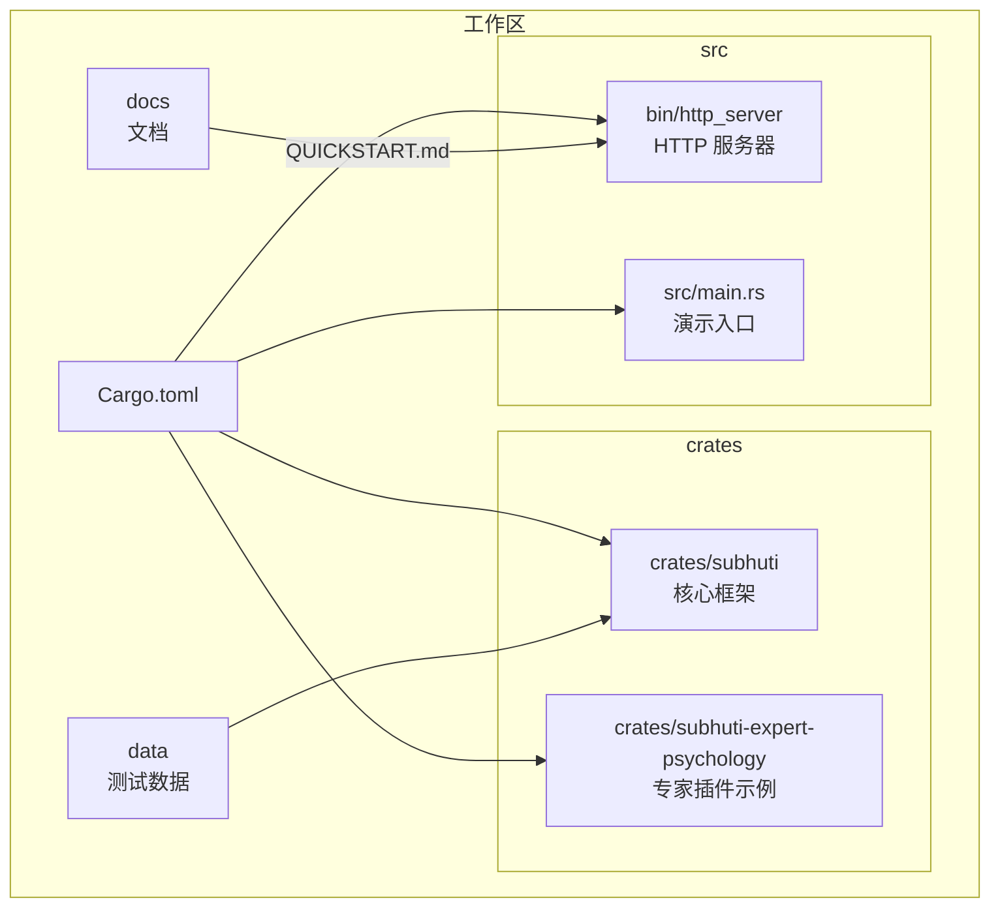
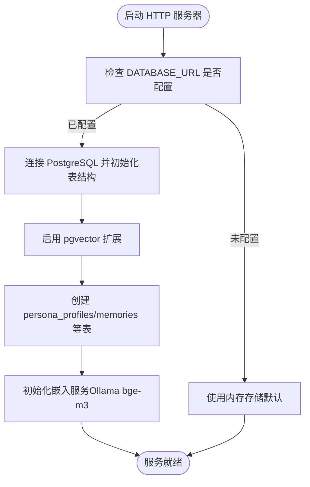
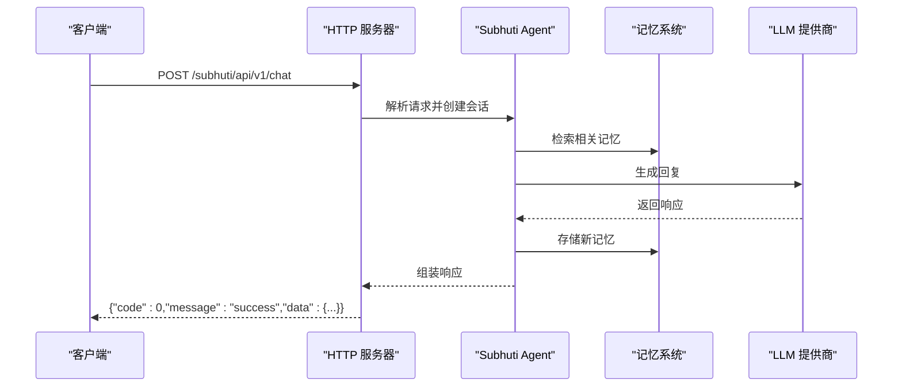
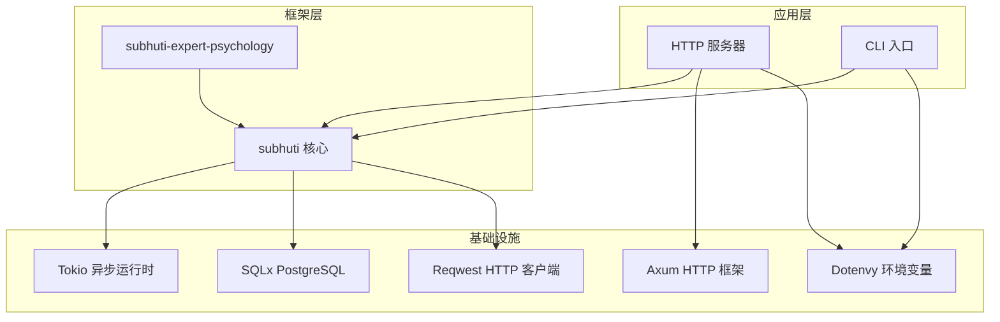

# 快速开始

<cite>
**本文引用的文件**
- [Cargo.toml](file://Cargo.toml)
- [crates/subhuti/Cargo.toml](file://crates/subhuti/Cargo.toml)
- [docs/QUICKSTART.md](file://docs/QUICKSTART.md)
- [docs/README.md](file://docs/README.md)
- [src/bin/http_server/main.rs](file://src/bin/http_server/main.rs)
- [crates/subhuti/src/lib.rs](file://crates/subhuti/src/lib.rs)
- [crates/subhuti/src/db/mod.rs](file://crates/subhuti/src/db/mod.rs)
- [crates/subhuti/src/memory/mod.rs](file://crates/subhuti/src/memory/mod.rs)
- [data/persona.json](file://data/persona.json)
</cite>

## 目录
1. [简介](#简介)
2. [项目结构](#项目结构)
3. [核心组件](#核心组件)
4. [架构概览](#架构概览)
5. [详细组件分析](#详细组件分析)
6. [依赖关系分析](#依赖关系分析)
7. [性能考虑](#性能考虑)
8. [故障排除指南](#故障排除指南)
9. [结论](#结论)
10. [附录](#附录)

## 简介
本指南面向首次接触 Subhuti AI Agent 框架的新用户，目标是在 15 分钟内完成环境准备、安装部署、数据库配置与向量数据库初始化，并成功运行第一个 HTTP 服务器实例，发送第一条聊天消息，查看响应结果。文档涵盖系统环境要求、依赖安装、项目构建、环境配置以及常见问题排查。

## 项目结构
Subhuti 采用多 crate 的工作区组织方式，核心框架位于 crates/subhuti，应用入口位于 src/bin/http_server，配套文档位于 docs 目录，测试数据位于 data 目录。



**图表来源**
- [Cargo.toml:1-58](file://Cargo.toml#L1-L58)
- [docs/README.md:72-99](file://docs/README.md#L72-L99)

**章节来源**
- [Cargo.toml:1-58](file://Cargo.toml#L1-L58)
- [docs/README.md:72-99](file://docs/README.md#L72-L99)

## 核心组件
- HTTP 服务器：提供统一 API 网关，支持聊天、流式输出、心灵宫殿、专家插件、健康检查等接口。
- 核心框架（subhuti）：包含记忆层、运行时（LLM/工具）、流程层（Flow）、扩展层、Skill 系统、心灵层（动态角色养成）、专家插件系统等。
- 数据库模块：基于 PostgreSQL，支持 pgvector 扩展，提供 persona_profiles、memories、user_feedbacks 等表。
- 记忆层：短期工作记忆、长期归档记忆、知识库语义记忆，支持向量检索与遗忘机制。
- 心灵层：基于大五人格模型的动态角色养成系统，支持演化与反馈统计。

**章节来源**
- [src/bin/http_server/main.rs:1-120](file://src/bin/http_server/main.rs#L1-L120)
- [crates/subhuti/src/lib.rs:84-156](file://crates/subhuti/src/lib.rs#L84-L156)
- [crates/subhuti/src/db/mod.rs:44-63](file://crates/subhuti/src/db/mod.rs#L44-L63)
- [crates/subhuti/src/memory/mod.rs:163-196](file://crates/subhuti/src/memory/mod.rs#L163-L196)

## 架构概览
Subhuti 采用四层架构：记忆层、运行时（LLM/工具）、流程层（ReAct/Plan-Act/简单流程）、扩展层。HTTP 服务器作为统一网关，将请求路由到 Skill 或默认流程，结合记忆检索与 LLM 生成，最终通过心灵层进行角色演化与反馈统计。

```mermaid
graph TB
Client[客户端] --> API[HTTP API 网关]
API --> Router[请求路由]
Router --> SkillMgr[Skill 管理器]
Router --> FlowMgr[流程管理器]
Router --> Memory[记忆系统]
Router --> Runtime[运行时(LLM/工具)]
Router --> Soul[心灵层]
Memory --> DB[(PostgreSQL + pgvector)]
Runtime --> LLM[LLM 提供商]
Soul --> MemoryPalace[心灵宫殿]
```

**图表来源**
- [src/bin/http_server/main.rs:398-485](file://src/bin/http_server/main.rs#L398-L485)
- [crates/subhuti/src/lib.rs:644-731](file://crates/subhuti/src/lib.rs#L644-L731)

## 详细组件分析

### 环境准备与系统要求
- Rust 工具链：建议版本 1.75+，确保 rustc 与 cargo 正常工作。
- Docker（可选）：用于快速启动 PostgreSQL + pgvector 容器。
- Git：用于克隆仓库。

**章节来源**
- [docs/QUICKSTART.md:19-41](file://docs/QUICKSTART.md#L19-L41)

### 安装与依赖
- 工作区根目录 Cargo.toml 定义了工作区成员、二进制入口（http_server、subhuti CLI、sync_test）以及主要依赖（Tokio、Axum、reqwest、serde、sqlx 等）。
- 核心框架 crates/subhuti/Cargo.toml 定义了框架依赖，包括 Tokio、sqlx（PostgreSQL）、bincode（向量存储）、reqwest（LLM API）、clap（命令行）、dotenvy（环境变量）等。

**章节来源**
- [Cargo.toml:13-58](file://Cargo.toml#L13-L58)
- [crates/subhuti/Cargo.toml:14-54](file://crates/subhuti/Cargo.toml#L14-L54)

### 项目构建
- 使用 Cargo 在工作区根目录构建与运行：
  - 编译并启动 HTTP 服务器：cargo run --bin http_server
  - 启动 CLI：cargo run --bin subhuti
  - 运行同步测试：cargo run --bin sync_test

**章节来源**
- [Cargo.toml:13-24](file://Cargo.toml#L13-L24)
- [docs/QUICKSTART.md:43-70](file://docs/QUICKSTART.md#L43-L70)

### 环境配置

#### 数据库设置（PostgreSQL + pgvector）
- 快速启动方式：使用 Docker 启动已配置好 pgvector 的容器，设置 DATABASE_URL 环境变量后启动服务。
- 完整启动方式：手动配置 PostgreSQL，确保启用 vector 扩展，初始化 persona_profiles、memories、user_feedbacks、persona_history 等表。
- 运行时初始化：框架在初始化数据库时会自动创建扩展与表结构，并设置嵌入服务（默认尝试连接 Ollama 的 bge-m3 模型）。



**图表来源**
- [src/bin/http_server/main.rs:100-117](file://src/bin/http_server/main.rs#L100-L117)
- [crates/subhuti/src/lib.rs:158-188](file://crates/subhuti/src/lib.rs#L158-L188)
- [crates/subhuti/src/db/mod.rs:66-180](file://crates/subhuti/src/db/mod.rs#L66-L180)

**章节来源**
- [docs/QUICKSTART.md:57-69](file://docs/QUICKSTART.md#L57-L69)
- [crates/subhuti/src/lib.rs:158-188](file://crates/subhuti/src/lib.rs#L158-L188)
- [crates/subhuti/src/db/mod.rs:66-180](file://crates/subhuti/src/db/mod.rs#L66-L180)

#### LLM API 密钥配置
- 支持多种 LLM 提供商（豆包 Doubao 默认、Ollama 本地模型、OpenAI 兼容接口）。
- 配置方式：
  - 豆包：设置 DOUBAO_API_KEY 环境变量
  - Ollama：设置 LLM_PROVIDER=ollama 与 OLLAMA_BASE_URL
- 若未配置，将出现 "Failed to connect to LLM" 错误。

**章节来源**
- [docs/QUICKSTART.md:241-269](file://docs/QUICKSTART.md#L241-L269)

#### 向量数据库初始化
- 框架自动创建 memories 表并添加 embedding 列，支持向量相似度搜索。
- 嵌入服务默认使用 Ollama 的 bge-m3:latest 模型，可通过环境变量调整。

**章节来源**
- [crates/subhuti/src/db/mod.rs:138-177](file://crates/subhuti/src/db/mod.rs#L138-L177)
- [crates/subhuti/src/db/mod.rs:537-592](file://crates/subhuti/src/db/mod.rs#L537-L592)
- [crates/subhuti/src/lib.rs:176-184](file://crates/subhuti/src/lib.rs#L176-L184)

### 第一个 Hello World 示例

#### 启动 HTTP 服务器
- 在工作区根目录执行：cargo run --bin http_server
- 服务器启动后输出类似：🚀 HTTP server running on http://0.0.0.0:8080

**章节来源**
- [docs/QUICKSTART.md:43-56](file://docs/QUICKSTART.md#L43-L56)

#### 发送第一条聊天消息
- 使用浏览器访问测试页面：http://localhost:8080/
- 或使用 curl 发送消息：
  - POST /subhuti/api/v1/chat
  - 请求体：{"message": "你好，我是小明，今天天气真好！", "user_id": "test_user_001"}
- 预期响应包含 response、trace_id、matched_skill 等字段。



**图表来源**
- [src/bin/http_server/main.rs:398-485](file://src/bin/http_server/main.rs#L398-L485)
- [crates/subhuti/src/lib.rs:697-731](file://crates/subhuti/src/lib.rs#L697-L731)

**章节来源**
- [docs/QUICKSTART.md:72-110](file://docs/QUICKSTART.md#L72-L110)

#### 查看响应结果
- 响应包含：
  - response：AI 回复内容
  - trace_id：请求追踪 ID
  - matched_skill：匹配到的 Skill 名称
  - model、prompt_tokens、completion_tokens、total_tokens：LLM Token 统计

**章节来源**
- [src/bin/http_server/main.rs:223-243](file://src/bin/http_server/main.rs#L223-L243)

### 心灵宫殿体验
- 查看统计：GET /subhuti/api/v1/palace/stats
- 搜索记忆：POST /subhuti/api/v1/palace/search
- 执行遗忘：POST /subhuti/api/v1/palace/forget

**章节来源**
- [src/bin/http_server/main.rs:664-747](file://src/bin/http_server/main.rs#L664-L747)

### 系统状态检查
- 健康检查：GET /subhuti/api/v1/health
- 详细健康状态：GET /subhuti/api/v1/health/detailed

**章节来源**
- [src/bin/http_server/main.rs:553-601](file://src/bin/http_server/main.rs#L553-L601)
- [crates/subhuti/src/lib.rs:562-636](file://crates/subhuti/src/lib.rs#L562-L636)

## 依赖关系分析



**图表来源**
- [Cargo.toml:25-58](file://Cargo.toml#L25-L58)
- [crates/subhuti/Cargo.toml:14-54](file://crates/subhuti/Cargo.toml#L14-L54)

**章节来源**
- [Cargo.toml:25-58](file://Cargo.toml#L25-L58)
- [crates/subhuti/Cargo.toml:14-54](file://crates/subhuti/Cargo.toml#L14-L54)

## 性能考虑
- 异步运行时：Tokio 提供高性能异步执行环境。
- 数据库连接池：SQLx 管理 PostgreSQL 连接池，减少连接开销。
- 向量搜索：memories 表建立索引，支持高效相似度检索。
- 流式输出：SSE 流式响应提升用户体验，避免阻塞等待。
- 记忆容量：短期记忆容量与长期归档阈值可配置，平衡性能与效果。

## 故障排除指南

### 常见问题与解决方案
- 启动报错 "Failed to connect to LLM"
  - 检查 LLM API Key 是否正确配置（如 DOUBAO_API_KEY）
  - 或切换到本地 Ollama：设置 LLM_PROVIDER=ollama 与 OLLAMA_BASE_URL
- 可以不用数据库吗？
  - 可以！框架默认使用内存存储，适合快速体验；生产环境建议配置 PostgreSQL + pgvector
- 支持哪些 LLM？
  - 豆包（Doubao，默认）、Ollama（本地模型）、OpenAI 兼容接口

**章节来源**
- [docs/QUICKSTART.md:241-269](file://docs/QUICKSTART.md#L241-L269)

### 环境诊断方法
- 健康检查：调用 /subhuti/api/v1/health 或 /subhuti/api/v1/health/detailed 获取组件状态
- 日志：框架使用 tracing 订阅器输出日志，可通过环境变量控制级别
- 数据库连通性：确认 DATABASE_URL 正确，PostgreSQL 启用 vector 扩展
- 嵌入服务：检查 Ollama 服务是否可用，模型名称与维度配置

**章节来源**
- [src/bin/http_server/main.rs:553-601](file://src/bin/http_server/main.rs#L553-L601)
- [crates/subhuti/src/lib.rs:562-636](file://crates/subhuti/src/lib.rs#L562-L636)
- [crates/subhuti/src/db/mod.rs:66-71](file://crates/subhuti/src/db/mod.rs#L66-L71)

## 结论
通过本快速开始指南，您已在 15 分钟内完成了 Subhuti AI Agent 框架的环境准备、安装部署、数据库与向量数据库初始化，并成功运行了第一个 HTTP 服务器实例，发送了第一条聊天消息。建议继续阅读文档中心中的架构详解与 API 教程，深入了解框架的设计理念与高级用法。

## 附录

### API 速查
- 聊天接口
  - POST /subhuti/api/v1/chat：发送消息
  - POST /subhuti/api/v1/chat/stream：流式输出
- 心灵宫殿
  - GET /subhuti/api/v1/palace/stats：统计信息
  - POST /subhuti/api/v1/palace/search：搜索记忆
  - POST /subhuti/api/v1/palace/forget：遗忘清理
- 专家插件
  - GET /subhuti/api/v1/experts/list：列出插件
  - POST /subhuti/api/v1/experts/activate：激活专家
  - POST /subhuti/api/v1/experts/deactivate：停用专家
- 系统监控
  - GET /subhuti/api/v1/health：健康检查
  - GET /subhuti/api/v1/health/detailed：详细健康状态
  - GET /subhuti/api/v1/trace/{trace_id}：Trace 追踪

**章节来源**
- [docs/README.md:103-148](file://docs/README.md#L103-L148)