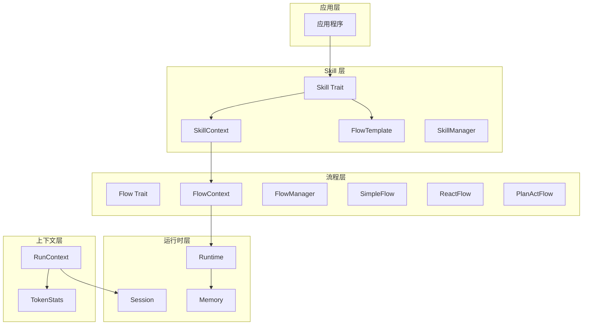
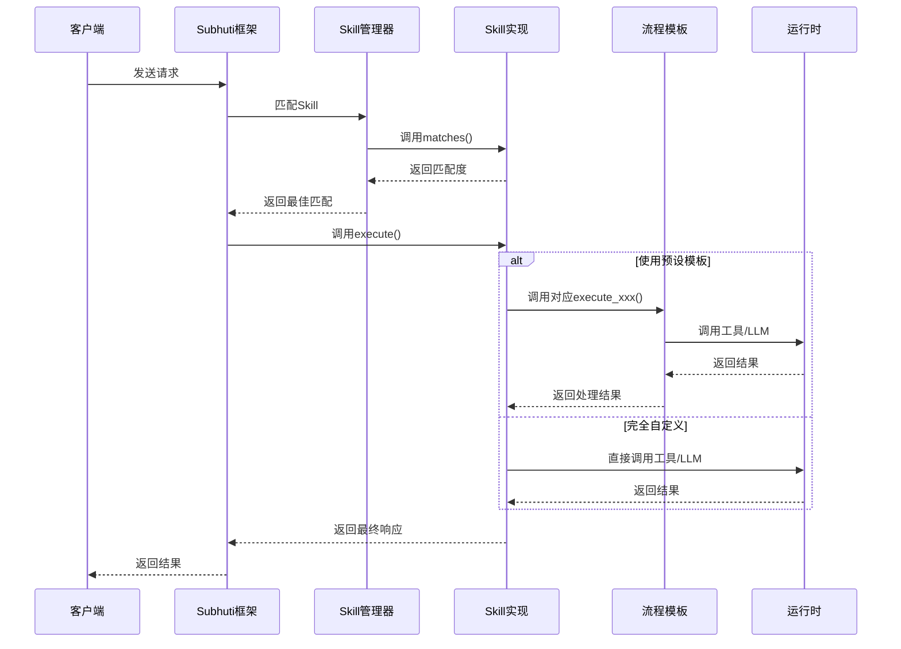
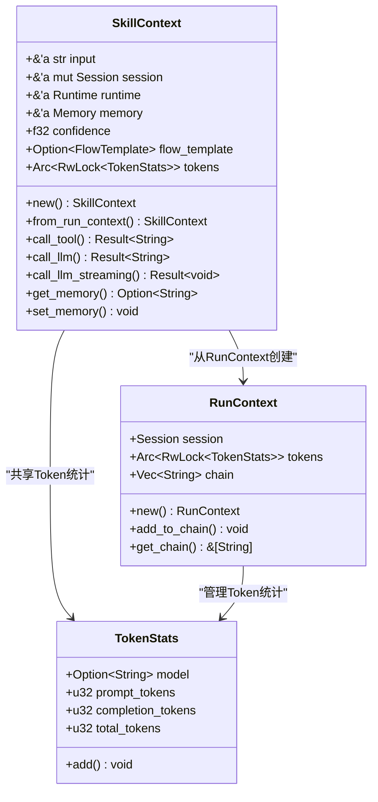
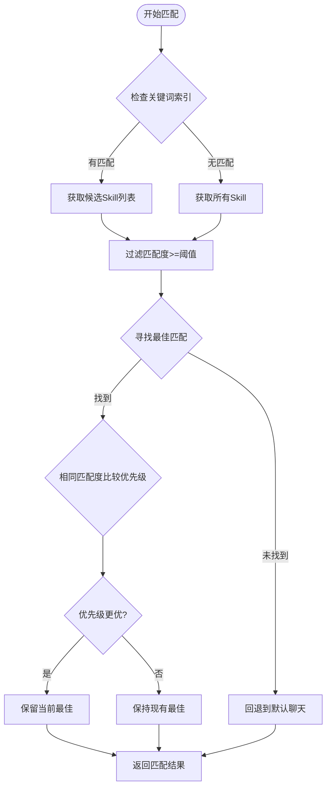
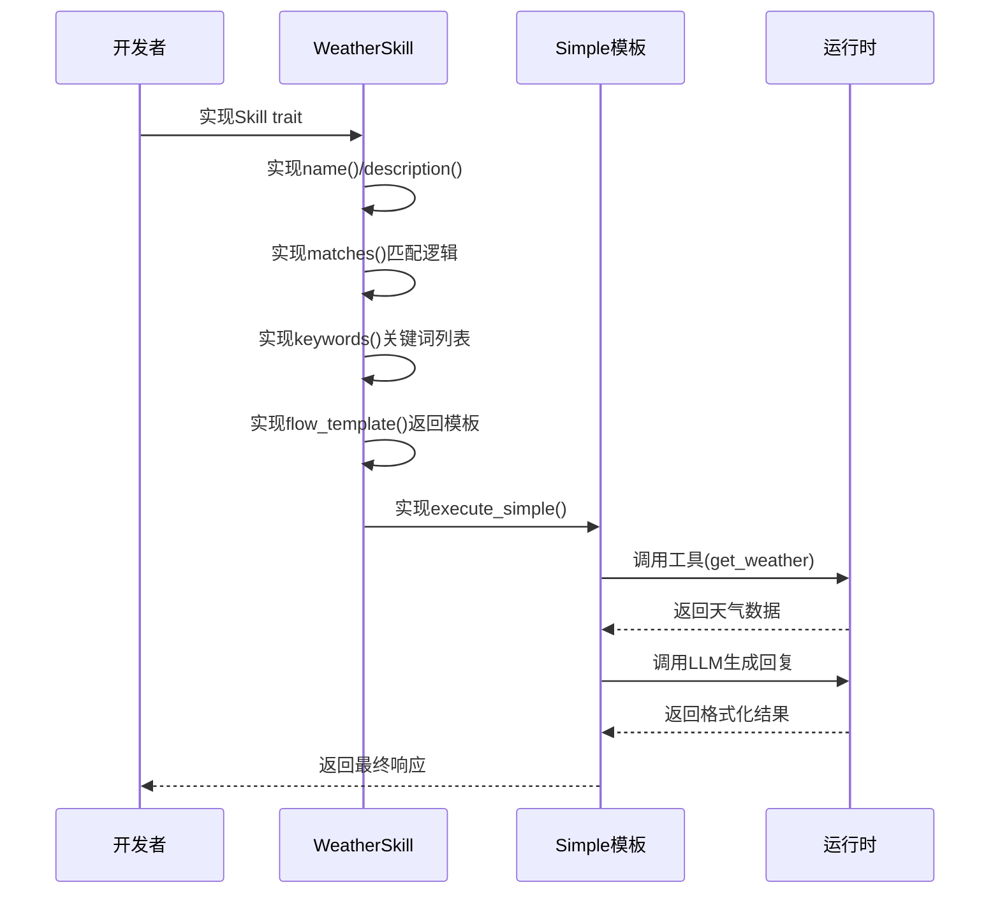
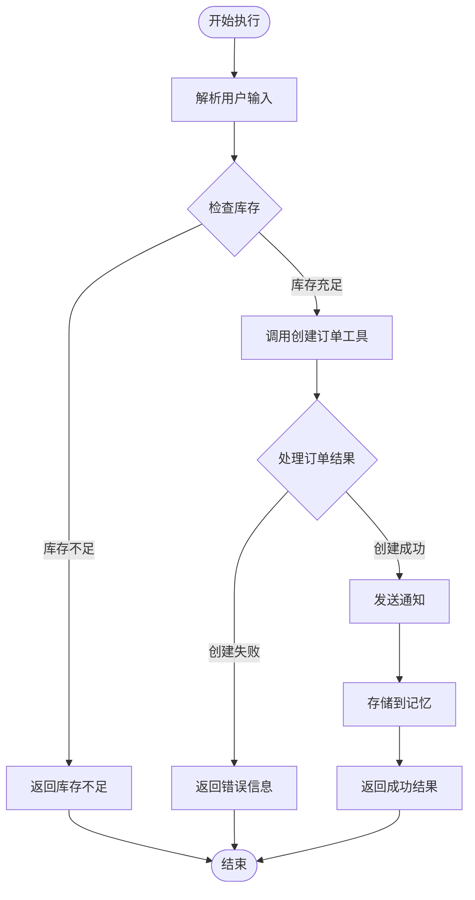
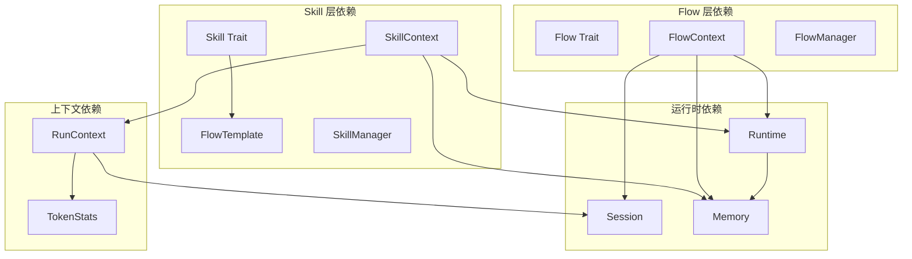

# Skill 接口设计

<cite>
**本文档引用的文件**
- [crates/subhuti/src/skill/mod.rs](file://crates/subhuti/src/skill/mod.rs)
- [crates/subhuti/src/context.rs](file://crates/subhuti/src/context.rs)
- [crates/subhuti/src/flow/mod.rs](file://crates/subhuti/src/flow/mod.rs)
- [crates/subhuti/src/flow/simple.rs](file://crates/subhuti/src/flow/simple.rs)
- [crates/subhuti/src/flow/react.rs](file://crates/subhuti/src/flow/react.rs)
- [crates/subhuti/src/flow/plan_act.rs](file://crates/subhuti/src/flow/plan_act.rs)
- [crates/subhuti/src/runtime/session.rs](file://crates/subhuti/src/runtime/session.rs)
- [crates/subhuti/src/memory/mod.rs](file://crates/subhuti/src/memory/mod.rs)
- [crates/subhuti/src/lib.rs](file://crates/subhuti/src/lib.rs)
</cite>

## 目录
1. [简介](#简介)
2. [项目结构](#项目结构)
3. [核心组件](#核心组件)
4. [架构概览](#架构概览)
5. [详细组件分析](#详细组件分析)
6. [依赖关系分析](#依赖关系分析)
7. [性能考虑](#性能考虑)
8. [故障排除指南](#故障排除指南)
9. [结论](#结论)

## 简介

Skill 接口设计是 Subhuti AI Agent 框架中的核心抽象层，采用纯代码风格实现，支持预设主流程模板。该设计的核心理念是"全代码实现 + 可选预设 Flow 模板"，通过灵活的模板选择机制和强大的上下文管理，实现了灵活性最大化。

传统设计中，Skill 通常需要声明式步骤定义，表达能力受限。而 Subhuti 的设计通过纯代码实现，消除了声明式步骤的束缚，同时提供了多种预设流程模板供开发者选择使用。

## 项目结构

Subhuti 框架采用四层架构设计：

**图表来源**
- [crates/subhuti/src/skill/mod.rs:237-405](file://crates/subhuti/src/skill/mod.rs#L237-L405)
- [crates/subhuti/src/flow/mod.rs:631-644](file://crates/subhuti/src/flow/mod.rs#L631-L644)
- [crates/subhuti/src/context.rs:51-86](file://crates/subhuti/src/context.rs#L51-L86)

**章节来源**
- [crates/subhuti/src/skill/mod.rs:1-82](file://crates/subhuti/src/skill/mod.rs#L1-L82)
- [crates/subhuti/src/lib.rs:22-45](file://crates/subhuti/src/lib.rs#L22-L45)

## 核心组件

### Skill Trait 设计理念

Skill Trait 采用了"纯代码风格 + 预设模板"的设计理念，主要特点包括：

1. **全代码实现**：不需要声明式步骤定义
2. **预设模板支持**：提供多种流程模板选择
3. **灵活路由机制**：支持请求级和 Skill 级模板选择
4. **流式输出支持**：可选的流式执行接口

### FlowTemplate 枚举设计

FlowTemplate 提供了四种预设流程模板：

| 模板类型 | 特点 | 适用场景 | 默认实现 |
|---------|------|----------|----------|
| Simple | 简单对话，直接调用 LLM | 基础问答、简单查询 | execute_simple() |
| ReAct | 思考→行动→观察→反思循环 | 需要多轮思考和工具调用 | execute_react() |
| PlanAct | 先规划再执行 | 复杂任务，需要先制定计划 | execute_plan_act() |
| ChainOfThought | 思维链推理 | 需要复杂逻辑推理的任务 | execute_chain_of_thought() |

**章节来源**
- [crates/subhuti/src/skill/mod.rs:93-113](file://crates/subhuti/src/skill/mod.rs#L93-L113)
- [crates/subhuti/src/skill/mod.rs:256-405](file://crates/subhuti/src/skill/mod.rs#L256-L405)

## 架构概览

**图表来源**
- [crates/subhuti/src/lib.rs:754-861](file://crates/subhuti/src/lib.rs#L754-L861)
- [crates/subhuti/src/skill/mod.rs:303-317](file://crates/subhuti/src/skill/mod.rs#L303-L317)

## 详细组件分析

### SkillContext 上下文设计

SkillContext 采用了类似 HTTP 框架的状态 + 扩展模式，实现了全局资源与请求级资源的清晰分离：

**图表来源**
- [crates/subhuti/src/skill/mod.rs:115-131](file://crates/subhuti/src/skill/mod.rs#L115-L131)
- [crates/subhuti/src/context.rs:51-86](file://crates/subhuti/src/context.rs#L51-L86)

#### 上下文分离策略

**全局资源（只读共享）**：
- Runtime：全局运行时，包含 LLM 和工具系统
- Memory：全局记忆系统，包含短期、长期和知识库

**请求级资源（可变）**：
- Session：会话状态，包含消息历史和元数据
- Tokens：Token 统计，通过 Arc 共享避免重复计算

这种设计借鉴了 Axum 框架的 State + Extensions 模式，确保了：

1. **线程安全**：全局资源使用 Arc 包装，请求级资源保持可变性
2. **职责分离**：避免了"上帝对象"，每个组件职责明确
3. **性能优化**：Token 统计通过 Arc 共享，在多次调用中累加

**章节来源**
- [crates/subhuti/src/skill/mod.rs:154-179](file://crates/subhuti/src/skill/mod.rs#L154-L179)
- [crates/subhuti/src/context.rs:18-49](file://crates/subhuti/src/context.rs#L18-L49)

### SkillManager 匹配机制

SkillManager 实现了高效的技能匹配算法，结合了关键词索引和精确匹配：

**图表来源**
- [crates/subhuti/src/skill/mod.rs:604-653](file://crates/subhuti/src/skill/mod.rs#L604-L653)

#### 关键词索引优化

SkillManager 使用了倒排索引技术来优化大规模 Skill 匹配性能：

1. **HashMap 名称索引**：O(1) 时间复杂度的直接查找
2. **倒排索引**：基于关键词的快速候选筛选
3. **分词算法**：支持中文和英文混合文本的智能分词
4. **匹配度计算**：精确的相似度评分算法

**章节来源**
- [crates/subhuti/src/skill/mod.rs:455-566](file://crates/subhuti/src/skill/mod.rs#L455-L566)
- [crates/subhuti/src/skill/mod.rs:655-728](file://crates/subhuti/src/skill/mod.rs#L655-L728)

### 预设流程模板详解

#### Simple 模板
适用于简单的问答场景，直接调用 LLM 返回结果。流程简洁明了，适合不需要工具调用的基础功能。

#### ReAct 模板
实现"思考→行动→观察→反思"的循环机制，适合需要多轮思考和工具调用的复杂场景。通过 LLM 的函数调用 API 自动选择合适的工具。

#### PlanAct 模板
先规划后执行的流程，适合需要复杂任务分解的场景。LLM 先生成执行计划，然后按计划逐步执行工具调用。

#### ChainOfThought 模板
专注于复杂推理过程，通过详细的思维链路实现深度思考。虽然在 Skill 层中提供此模板，但在 Subhuti 框架中通常映射到 ReAct 流程。

**章节来源**
- [crates/subhuti/src/flow/simple.rs:12-61](file://crates/subhuti/src/flow/simple.rs#L12-L61)
- [crates/subhuti/src/flow/react.rs:13-196](file://crates/subhuti/src/flow/react.rs#L13-L196)
- [crates/subhuti/src/flow/plan_act.rs:17-154](file://crates/subhuti/src/flow/plan_act.rs#L17-L154)

### 接口实现示例

#### 使用预设模板的 Skill 实现

**图表来源**
- [crates/subhuti/src/skill/mod.rs:998-1061](file://crates/subhuti/src/skill/mod.rs#L998-L1061)

#### 完全自定义流程的 Skill 实现

**图表来源**
- [crates/subhuti/src/skill/mod.rs:1199-1261](file://crates/subhuti/src/skill/mod.rs#L1199-L1261)

**章节来源**
- [crates/subhuti/src/skill/mod.rs:998-1190](file://crates/subhuti/src/skill/mod.rs#L998-L1190)
- [crates/subhuti/src/skill/mod.rs:1199-1261](file://crates/subhuti/src/skill/mod.rs#L1199-L1261)

## 依赖关系分析

**图表来源**
- [crates/subhuti/src/skill/mod.rs:84-91](file://crates/subhuti/src/skill/mod.rs#L84-L91)
- [crates/subhuti/src/flow/mod.rs:42-48](file://crates/subhuti/src/flow/mod.rs#L42-L48)
- [crates/subhuti/src/context.rs:14-16](file://crates/subhuti/src/context.rs#L14-L16)

### 组件耦合度分析

Skill 层与其他层的耦合关系体现了良好的分层设计：

1. **低耦合**：Skill 层只依赖 FlowTemplate 和上下文接口
2. **高内聚**：每个组件职责明确，功能完整
3. **可扩展性**：通过 trait 接口支持动态扩展
4. **可测试性**：清晰的接口定义便于单元测试

**章节来源**
- [crates/subhuti/src/skill/mod.rs:84-91](file://crates/subhuti/src/skill/mod.rs#L84-L91)
- [crates/subhuti/src/flow/mod.rs:42-48](file://crates/subhuti/src/flow/mod.rs#L42-L48)

## 性能考虑

### 匹配性能优化

SkillManager 实现了多层次的性能优化策略：

1. **关键词索引**：O(k) 时间复杂度的候选筛选，k 为关键词数量
2. **倒排索引**：基于关键词的快速查找，避免全量扫描
3. **分词优化**：智能处理中文和英文混合文本
4. **缓存机制**：Session 级别的滑动窗口缓存

### 内存管理

1. **Arc 共享**：全局资源通过 Arc 共享，避免重复分配
2. **RwLock 保护**：Token 统计使用读写锁，支持并发访问
3. **滑动窗口**：Session 内部的消息队列限制内存使用
4. **及时归档**：超限消息自动归档到长期记忆

### 并发处理

1. **异步执行**：所有关键操作都支持异步执行
2. **流式输出**：支持流式响应，提升用户体验
3. **并发安全**：使用 Send + Sync trait 确保线程安全
4. **资源隔离**：请求级资源与全局资源严格分离

## 故障排除指南

### 常见问题及解决方案

#### Skill 未匹配到任何模板

**问题症状**：执行 execute() 时抛出错误，提示未选择流程模板且未覆盖 execute()

**解决方案**：
1. 确保实现 flow_template() 返回有效的模板
2. 或者重写 execute() 方法提供完全自定义实现
3. 检查模板选择逻辑是否正确

#### Token 统计异常

**问题症状**：Token 统计不准确或出现负值

**解决方案**：
1. 确保在每次 LLM 调用后调用 add_tokens()
2. 检查并发访问时的锁机制
3. 验证 TokenStats 的累加逻辑

#### 内存泄漏问题

**问题症状**：长时间运行后内存使用持续增长

**解决方案**：
1. 检查 Session 的滑动窗口配置
2. 确保超限消息正确归档
3. 验证 Arc 引用计数是否正确释放

**章节来源**
- [crates/subhuti/src/skill/mod.rs:312-316](file://crates/subhuti/src/skill/mod.rs#L312-L316)
- [crates/subhuti/src/skill/mod.rs:187-190](file://crates/subhuti/src/skill/mod.rs#L187-L190)

## 结论

Skill 接口设计通过"纯代码风格 + 预设模板"的创新理念，成功解决了传统 AI Agent 框架中声明式步骤的局限性。该设计的主要优势包括：

1. **灵活性最大化**：开发者可以选择使用预设模板或完全自定义实现
2. **性能优异**：通过关键词索引和倒排索引实现高效的技能匹配
3. **架构清晰**：四层架构设计确保了良好的职责分离和可维护性
4. **扩展性强**：基于 trait 的接口设计支持动态扩展和插件化开发

该设计为构建复杂 AI 应用程序提供了坚实的基础，既保证了开发效率，又确保了系统的可扩展性和性能表现。通过合理的上下文管理和资源分离策略，Subhuti 框架能够在保持简洁性的同时，满足企业级应用的高性能需求。