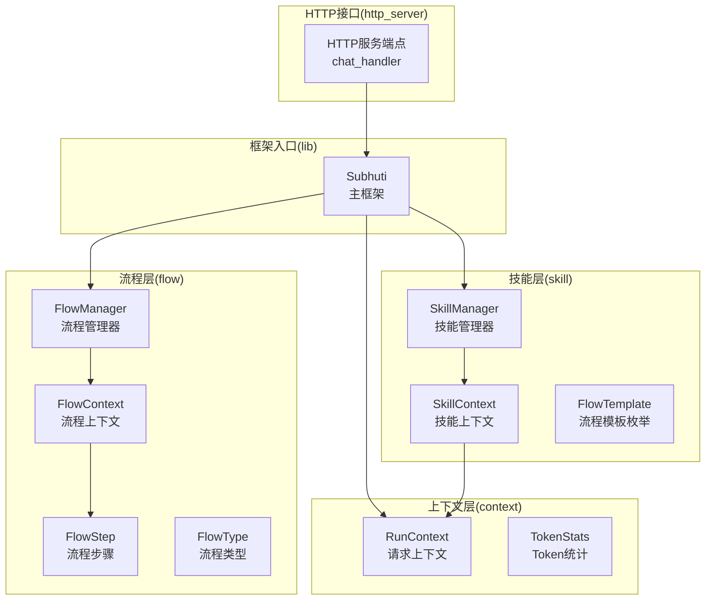
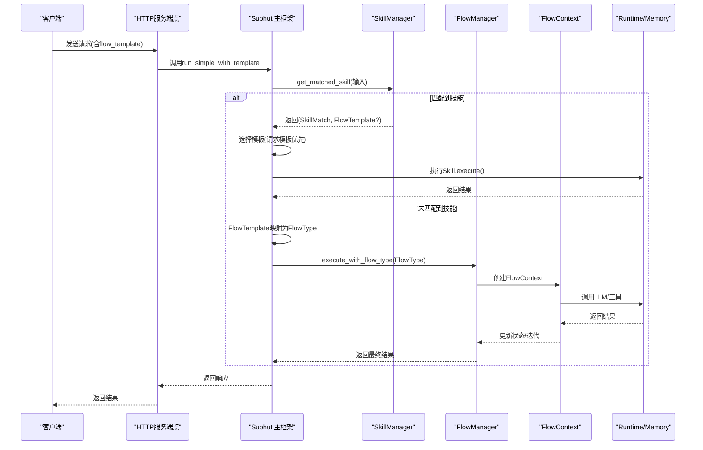
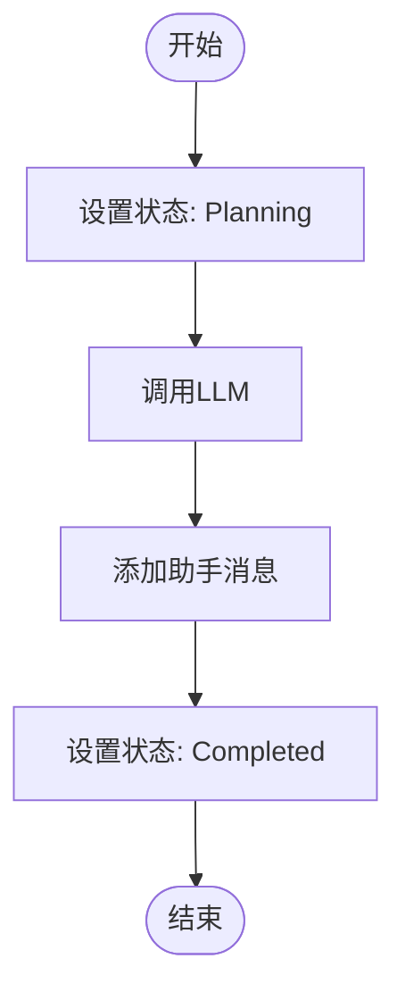
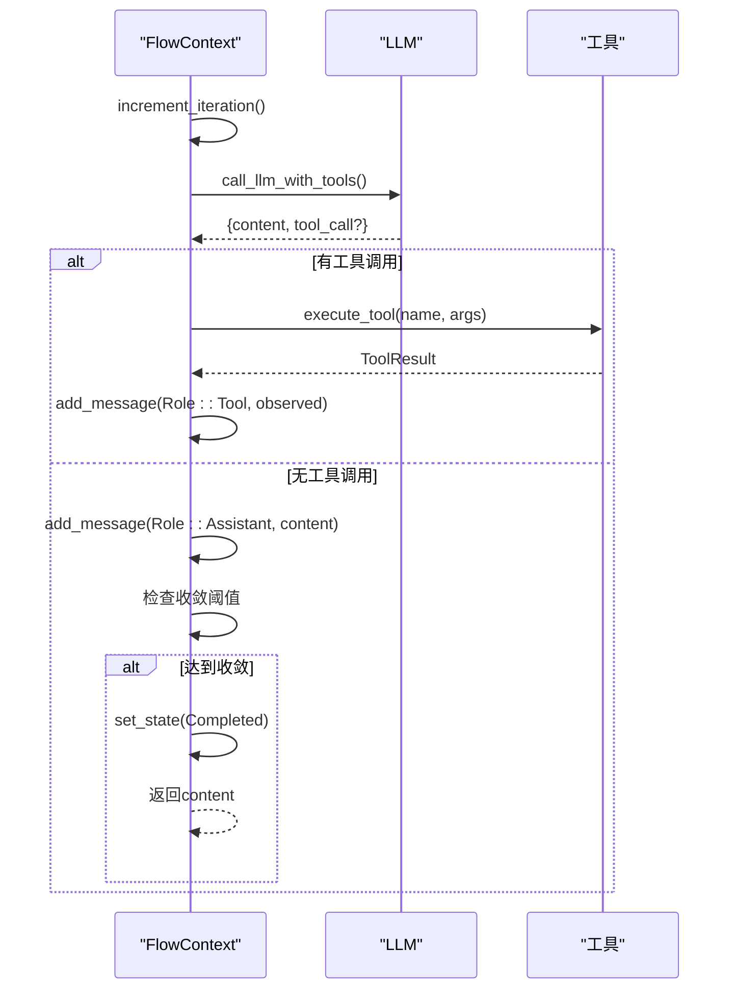
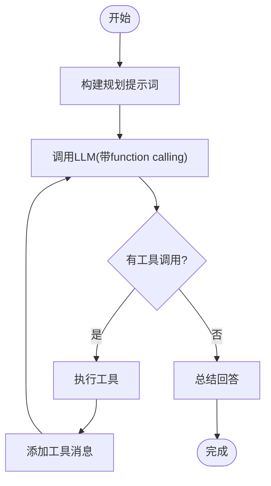
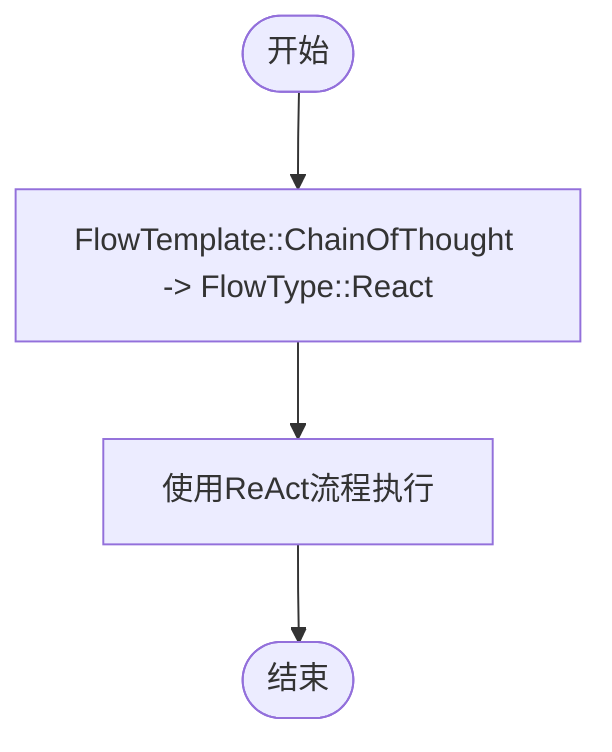
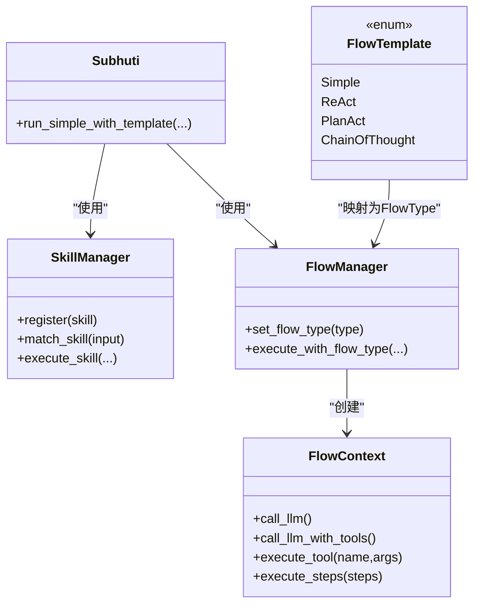

# 内置技能详解

<cite>
**本文档引用的文件**
- [flow/mod.rs](file://crates/subhuti/src/flow/mod.rs)
- [flow/simple.rs](file://crates/subhuti/src/flow/simple.rs)
- [flow/react.rs](file://crates/subhuti/src/flow/react.rs)
- [flow/plan_act.rs](file://crates/subhuti/src/flow/plan_act.rs)
- [skill/mod.rs](file://crates/subhuti/src/skill/mod.rs)
- [context.rs](file://crates/subhuti/src/context.rs)
- [lib.rs](file://crates/subhuti/src/lib.rs)
- [main.rs](file://src/bin/http_server/main.rs)
</cite>

## 目录
1. [简介](#简介)
2. [项目结构](#项目结构)
3. [核心组件](#核心组件)
4. [架构总览](#架构总览)
5. [详细组件分析](#详细组件分析)
6. [依赖关系分析](#依赖关系分析)
7. [性能考量](#性能考量)
8. [故障排查指南](#故障排查指南)
9. [结论](#结论)
10. [附录](#附录)

## 简介
本文件系统性阐述 Subhuti 框架中的“内置技能类型”，重点围绕四种预设流程模板的实现与使用场景：
- Simple 流程模板：适合简单直接的任务，如直接工具调用
- ReAct 流程模板：适合需要多轮思考和工具调用的复杂推理场景
- PlanAct 流程模板：适合需要先规划再执行的复杂任务
- ChainOfThought 流程模板：适合需要复杂思维链推理的场景

文档将深入说明每种模板的执行逻辑、适用条件、性能特点，并提供在不同场景下的选择建议与最佳实践。

## 项目结构
本项目采用分层设计，核心位于 crates/subhuti/src 目录，其中：
- flow 模块：流程层，定义 Flow trait、FlowContext、FlowStep、FlowManager 等
- skill 模块：技能层，定义 Skill trait、FlowTemplate 枚举及多个内置示例技能
- context 模块：上下文层，定义 RunContext、TokenStats 等
- lib.rs：框架入口，负责 Skill 匹配、流程模板映射与执行调度
- http_server/main.rs：HTTP 接口层，暴露 flow_template 参数供客户端选择模板

图表来源
- [flow/mod.rs:677-800](file://crates/subhuti/src/flow/mod.rs#L677-L800)
- [skill/mod.rs:451-861](file://crates/subhuti/src/skill/mod.rs#L451-L861)
- [context.rs:51-86](file://crates/subhuti/src/context.rs#L51-L86)
- [lib.rs:808-834](file://crates/subhuti/src/lib.rs#L808-L834)
- [main.rs:387-396](file://src/bin/http_server/main.rs#L387-L396)

章节来源
- [flow/mod.rs:1-80](file://crates/subhuti/src/flow/mod.rs#L1-L80)
- [skill/mod.rs:1-120](file://crates/subhuti/src/skill/mod.rs#L1-L120)
- [context.rs:1-87](file://crates/subhuti/src/context.rs#L1-L87)
- [lib.rs:800-861](file://crates/subhuti/src/lib.rs#L800-L861)
- [main.rs:387-396](file://src/bin/http_server/main.rs#L387-L396)

## 核心组件
- Flow trait：流程抽象接口，所有流程必须实现 name、description、execute
- FlowContext：流程执行上下文，封装 Session、Runtime、Memory、配置、状态、迭代次数、输入、上下文数据
- FlowStep：流程步骤定义，支持 Tool、Knowledge、LLM、LLMToContext、Condition、Memory、Parallel、Loop 等
- FlowManager：流程管理器，负责根据 FlowType 执行对应流程
- FlowTemplate：技能层的流程模板枚举，包含 Simple、ReAct、PlanAct、ChainOfThought
- SkillContext：技能执行上下文，封装输入、Session、Runtime、Memory、匹配度、模板、Token 统计
- SkillManager：技能管理器，负责技能注册、匹配、执行与流式输出
- RunContext：请求级上下文，包含 Session、Token 统计、调用链

章节来源
- [flow/mod.rs:52-134](file://crates/subhuti/src/flow/mod.rs#L52-L134)
- [flow/mod.rs:290-424](file://crates/subhuti/src/flow/mod.rs#L290-L424)
- [flow/mod.rs:631-644](file://crates/subhuti/src/flow/mod.rs#L631-L644)
- [flow/mod.rs:677-794](file://crates/subhuti/src/flow/mod.rs#L677-L794)
- [skill/mod.rs:93-113](file://crates/subhuti/src/skill/mod.rs#L93-L113)
- [skill/mod.rs:115-131](file://crates/subhuti/src/skill/mod.rs#L115-L131)
- [skill/mod.rs:255-405](file://crates/subhuti/src/skill/mod.rs#L255-L405)
- [context.rs:51-86](file://crates/subhuti/src/context.rs#L51-L86)

## 架构总览
框架采用“技能层 + 流程层”的双层架构：
- 技能层：SkillManager 负责技能匹配与执行，支持预设流程模板或完全自定义
- 流程层：FlowManager 负责根据 FlowType 执行对应流程，Simple/ReAct/PlanAct 由 FlowContext 驱动
- 上下文层：RunContext 提供请求级状态，TokenStats 统计 LLM 使用情况
- 入口层：Subhuti 在匹配不到技能时，将 FlowTemplate 映射为 FlowType 并执行默认流程

图表来源
- [lib.rs:808-834](file://crates/subhuti/src/lib.rs#L808-L834)
- [skill/mod.rs:800-826](file://crates/subhuti/src/skill/mod.rs#L800-L826)
- [flow/mod.rs:739-771](file://crates/subhuti/src/flow/mod.rs#L739-L771)
- [main.rs:387-396](file://src/bin/http_server/main.rs#L387-L396)

章节来源
- [lib.rs:808-834](file://crates/subhuti/src/lib.rs#L808-L834)
- [skill/mod.rs:800-826](file://crates/subhuti/src/skill/mod.rs#L800-L826)
- [flow/mod.rs:739-771](file://crates/subhuti/src/flow/mod.rs#L739-L771)
- [main.rs:387-396](file://src/bin/http_server/main.rs#L387-L396)

## 详细组件分析

### Simple 流程模板
- 适用场景：简单直接的任务，如直接工具调用或无需工具的问答
- 执行逻辑：直接调用 LLM，无需工具调用，状态从 Planning 到 Completed
- 性能特点：开销最小，适合高频、低复杂度任务
- 代码实现参考路径：
  - [SimpleFlow::execute:47-60](file://crates/subhuti/src/flow/simple.rs#L47-L60)
  - [Skill示例：WeatherSkill 使用 Simple:998-1061](file://crates/subhuti/src/skill/mod.rs#L998-L1061)

图表来源
- [simple.rs:47-60](file://crates/subhuti/src/flow/simple.rs#L47-L60)

章节来源
- [simple.rs:1-72](file://crates/subhuti/src/flow/simple.rs#L1-L72)
- [skill/mod.rs:998-1061](file://crates/subhuti/src/skill/mod.rs#L998-L1061)

### ReAct 流程模板
- 适用场景：需要多轮思考和工具调用的复杂推理场景
- 执行逻辑：Plan → Act → Observe → Reflect 循环，收敛阈值控制停止条件
- 关键机制：
  - 使用 function calling API 获取工具调用
  - 连续无工具调用达到收敛阈值则完成
  - 工具调用参数为空时回退为纯文本回答
- 性能特点：可能多次 LLM 调用，适合需要工具交互的复杂任务
- 代码实现参考路径：
  - [ReactFlow::execute:107-196](file://crates/subhuti/src/flow/react.rs#L107-L196)
  - [Skill示例：CalculatorSkill 使用 ReAct:1068-1190](file://crates/subhuti/src/skill/mod.rs#L1068-L1190)

图表来源
- [react.rs:107-196](file://crates/subhuti/src/flow/react.rs#L107-L196)

章节来源
- [react.rs:1-227](file://crates/subhuti/src/flow/react.rs#L1-L227)
- [skill/mod.rs:1068-1190](file://crates/subhuti/src/skill/mod.rs#L1068-L1190)

### PlanAct 流程模板
- 适用场景：需要先规划再执行的复杂任务
- 执行逻辑：先让 LLM 生成执行计划，再逐条执行工具调用，最后总结回答
- 关键机制：
  - 构建规划提示词，要求 LLM 输出 PLAN 步骤
  - 识别工具调用 JSON 并执行
  - 无工具调用即视为完成
- 性能特点：规划阶段一次 LLM 调用，后续工具调用可能多次
- 代码实现参考路径：
  - [PlanActFlow::execute:95-154](file://crates/subhuti/src/flow/plan_act.rs#L95-L154)

图表来源
- [plan_act.rs:95-154](file://crates/subhuti/src/flow/plan_act.rs#L95-L154)

章节来源
- [plan_act.rs:1-166](file://crates/subhuti/src/flow/plan_act.rs#L1-L166)

### ChainOfThought 流程模板
- 适用场景：需要复杂思维链推理的场景
- 实现现状：在框架层面，FlowTemplate::ChainOfThought 会被映射为 FlowType::React，因此其行为与 ReAct 类似
- 选择建议：若需要复杂推理但又希望复用现有 ReAct 能力，可直接使用 ReAct；若未来有独立实现，可在 Skill 层通过 execute_chain_of_thought 方法扩展
- 代码实现参考路径：
  - [FlowTemplate::ChainOfThought 映射](file://crates/subhuti/src/lib.rs#L813)
  - [Skill::execute_chain_of_thought 占位实现:352-361](file://crates/subhuti/src/skill/mod.rs#L352-L361)

图表来源
- [lib.rs](file://crates/subhuti/src/lib.rs#L813)
- [skill/mod.rs:352-361](file://crates/subhuti/src/skill/mod.rs#L352-L361)

章节来源
- [lib.rs](file://crates/subhuti/src/lib.rs#L813)
- [skill/mod.rs:352-361](file://crates/subhuti/src/skill/mod.rs#L352-L361)

## 依赖关系分析
- SkillManager 依赖 Skill trait 与 RunContext，负责技能匹配与执行
- FlowManager 依赖 Flow trait 与 FlowContext，负责流程执行
- FlowContext 依赖 Runtime、Memory、Session，提供统一的执行环境
- Subhuti 在未匹配到技能时，将 FlowTemplate 映射为 FlowType 并委托 FlowManager 执行
- HTTP 服务端点将客户端传入的 flow_template 字符串解析为 FlowTemplate 枚举

图表来源
- [skill/mod.rs:451-861](file://crates/subhuti/src/skill/mod.rs#L451-L861)
- [flow/mod.rs:677-800](file://crates/subhuti/src/flow/mod.rs#L677-L800)
- [lib.rs:808-834](file://crates/subhuti/src/lib.rs#L808-L834)

章节来源
- [skill/mod.rs:451-861](file://crates/subhuti/src/skill/mod.rs#L451-L861)
- [flow/mod.rs:677-800](file://crates/subhuti/src/flow/mod.rs#L677-L800)
- [lib.rs:808-834](file://crates/subhuti/src/lib.rs#L808-L834)

## 性能考量
- Simple：最小开销，适合高频问答
- ReAct：可能多次 LLM 调用，适合需要工具交互的复杂任务；收敛阈值可避免无限循环
- PlanAct：规划阶段一次 LLM 调用，工具调用可能多次；适合需要明确步骤的任务
- ChainOfThought：当前映射为 ReAct，注意避免重复开销
- Token 统计：RunContext 提供 TokenStats，便于监控与优化

章节来源
- [react.rs:122-190](file://crates/subhuti/src/flow/react.rs#L122-L190)
- [plan_act.rs:106-149](file://crates/subhuti/src/flow/plan_act.rs#L106-L149)
- [context.rs:18-49](file://crates/subhuti/src/context.rs#L18-L49)

## 故障排查指南
- 未匹配到技能：检查 SkillManager 的匹配阈值与关键词索引
- 模板选择错误：确认 HTTP 请求中的 flow_template 参数是否正确解析
- 工具调用失败：检查工具参数与可用工具列表
- 收敛问题：调整 FlowConfig 的收敛阈值与最大迭代次数
- Token 异常：检查 TokenStats 的累加逻辑

章节来源
- [skill/mod.rs:610-653](file://crates/subhuti/src/skill/mod.rs#L610-L653)
- [main.rs:387-396](file://src/bin/http_server/main.rs#L387-L396)
- [flow/mod.rs:229-254](file://crates/subhuti/src/flow/mod.rs#L229-L254)

## 结论
- Simple 适合简单直接任务，性能最优
- ReAct 适合需要多轮思考与工具交互的复杂推理
- PlanAct 适合需要明确规划步骤的任务
- ChainOfThought 当前映射为 ReAct，建议直接使用 ReAct 或等待未来独立实现
- 模板选择应结合任务复杂度、工具需求与性能目标综合考虑

## 附录
- 模板选择最佳实践
  - 低复杂度问答：选择 Simple
  - 需要工具交互的推理：选择 ReAct
  - 需要明确步骤的任务：选择 PlanAct
  - 复杂思维链推理：当前选择 ReAct，未来可扩展 ChainOfThought
- HTTP 接口参数
  - flow_template：支持 "simple"、"react"、"plan_act"、"chain_of_thought"

章节来源
- [main.rs:387-396](file://src/bin/http_server/main.rs#L387-L396)