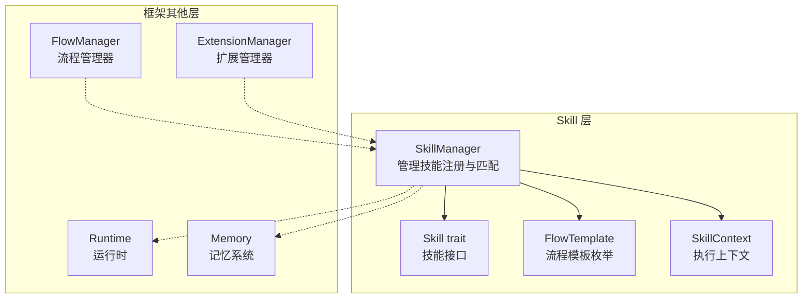
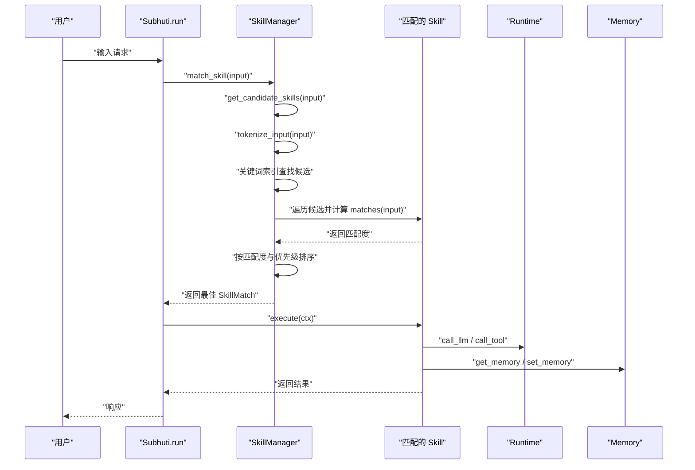
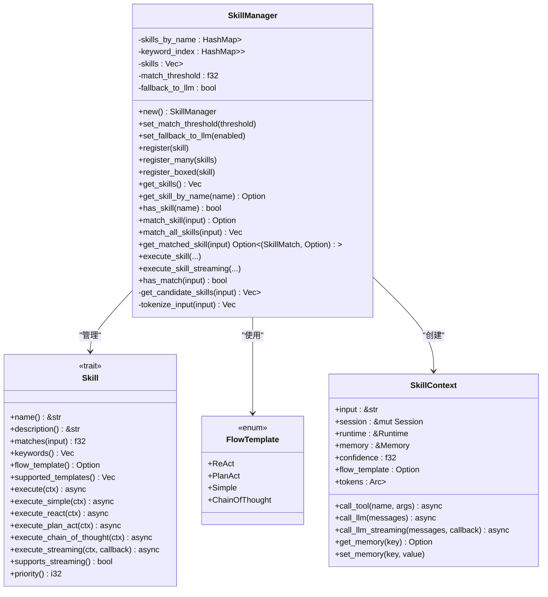
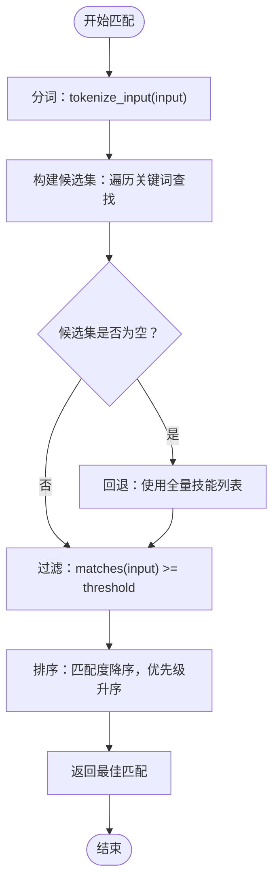
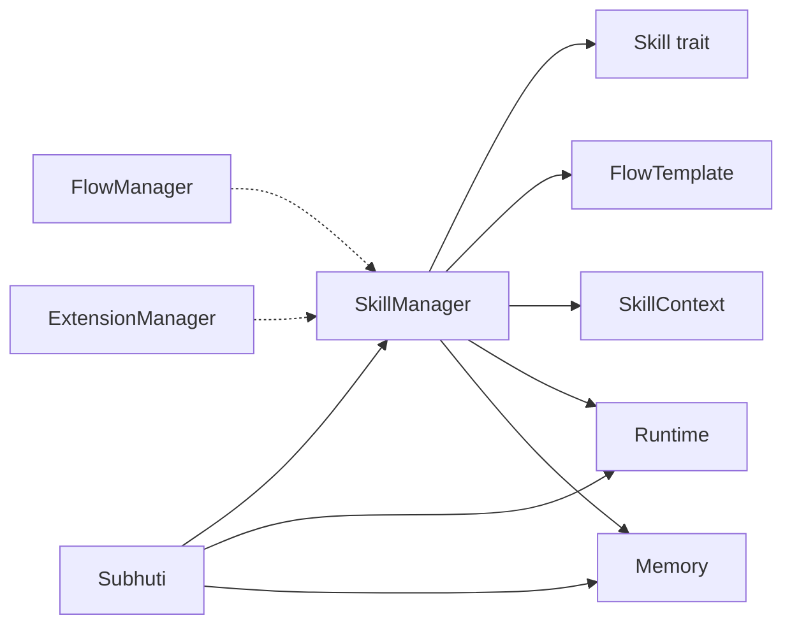

# 技能匹配机制

<cite>
**本文档引用的文件**
- [mod.rs](file://crates/subhuti/src/skill/mod.rs)
- [lib.rs](file://crates/subhuti/src/lib.rs)
- [大纲.md](file://crates/subhuti/大纲.md)
- [技能.md](file://crates/subhuti/技能.md)
- [performance_test.rs](file://crates/subhuti/tests/performance_test.rs)
- [integration_test.rs](file://crates/subhuti/tests/integration_test.rs)
</cite>

## 目录
1. [简介](#简介)
2. [项目结构](#项目结构)
3. [核心组件](#核心组件)
4. [架构概览](#架构概览)
5. [详细组件分析](#详细组件分析)
6. [依赖分析](#依赖分析)
7. [性能考量](#性能考量)
8. [故障排查指南](#故障排查指南)
9. [结论](#结论)
10. [附录](#附录)

## 简介
本文件围绕 Subhuti 框架中的技能匹配机制展开，重点阐述 SkillManager 的设计与实现，包括：
- 名称索引（HashMap）与关键词倒排索引的数据结构设计
- 匹配算法的优化策略：先通过关键词索引快速筛选候选技能（O(k)），再对候选技能计算精确匹配度，最后按匹配度与优先级排序
- 关键词索引的构建过程、分词算法（中文词汇提取、英文单词识别）、候选技能去重机制
- 匹配阈值设置、优先级排序、回退机制（默认聊天 Skill）的配置与使用
- 性能优化技巧与大规模技能匹配的最佳实践

## 项目结构
Skill 层位于框架四层架构的第四层，负责“路由式技能系统”，提供纯代码风格的 Skill 实现与可选预设主流程模板。SkillManager 作为核心管理器，维护技能注册、索引构建与匹配执行。

图表来源
- [mod.rs:451-466](file://crates/subhuti/src/skill/mod.rs#L451-L466)
- [mod.rs:256-405](file://crates/subhuti/src/skill/mod.rs#L256-L405)
- [mod.rs:96-113](file://crates/subhuti/src/skill/mod.rs#L96-L113)
- [mod.rs:115-131](file://crates/subhuti/src/skill/mod.rs#L115-L131)

章节来源
- [大纲.md:189-428](file://crates/subhuti/大纲.md#L189-L428)
- [技能.md:1-202](file://crates/subhuti/技能.md#L1-L202)

## 核心组件
- SkillManager：技能管理器，维护名称索引（HashMap）、关键词倒排索引、技能列表、匹配阈值与回退开关
- Skill trait：技能接口，定义名称、描述、匹配度、关键词、流程模板、执行方法等
- FlowTemplate：预设主流程模板枚举（ReAct、PlanAct、Simple、ChainOfThought）
- SkillContext：执行上下文，封装输入、会话、运行时、记忆、匹配度、流程模板与 Token 统计
- 内置技能：WeatherSkill、CalculatorSkill、SearchLongMemorySkill、DefaultChatSkill 等

章节来源
- [mod.rs:451-466](file://crates/subhuti/src/skill/mod.rs#L451-L466)
- [mod.rs:256-405](file://crates/subhuti/src/skill/mod.rs#L256-L405)
- [mod.rs:96-113](file://crates/subhuti/src/skill/mod.rs#L96-L113)
- [mod.rs:115-131](file://crates/subhuti/src/skill/mod.rs#L115-L131)

## 架构概览
SkillManager 在初始化时注册内置技能，并在注册过程中自动构建索引；匹配时优先通过关键词索引筛选候选技能，再对候选技能计算精确匹配度并排序，最后返回最佳匹配结果。若无匹配则回退至默认聊天技能。

图表来源
- [mod.rs:604-653](file://crates/subhuti/src/skill/mod.rs#L604-L653)
- [mod.rs:655-690](file://crates/subhuti/src/skill/mod.rs#L655-L690)
- [mod.rs:692-728](file://crates/subhuti/src/skill/mod.rs#L692-L728)
- [mod.rs:828-855](file://crates/subhuti/src/skill/mod.rs#L828-L855)
- [lib.rs:754-806](file://crates/subhuti/src/lib.rs#L754-L806)

## 详细组件分析

### SkillManager 设计与实现
- 数据结构
  - 名称索引：HashMap<String, Arc<dyn Skill>>，支持 O(1) 名称查找
  - 关键词倒排索引：HashMap<String, Vec<Arc<dyn Skill>>>，关键词到技能列表映射
  - 技能列表：Vec<Arc<dyn Skill>>，用于无关键词匹配时的兜底遍历
  - 配置：match_threshold（匹配阈值）、fallback_to_llm（是否启用回退）
- 注册流程
  - 将技能加入名称索引
  - 遍历技能的 keywords()，构建关键词倒排索引
  - 将技能加入列表并按 priority() 排序
- 匹配流程
  - 通过关键词索引获取候选技能（O(k)）
  - 若无候选，回退到全量技能列表
  - 对候选技能计算精确匹配度，过滤低于阈值的技能
  - 按匹配度降序、优先级升序排序，返回最佳匹配

图表来源
- [mod.rs:451-466](file://crates/subhuti/src/skill/mod.rs#L451-L466)
- [mod.rs:256-405](file://crates/subhuti/src/skill/mod.rs#L256-L405)
- [mod.rs:96-113](file://crates/subhuti/src/skill/mod.rs#L96-L113)
- [mod.rs:115-131](file://crates/subhuti/src/skill/mod.rs#L115-L131)

章节来源
- [mod.rs:481-530](file://crates/subhuti/src/skill/mod.rs#L481-L530)
- [mod.rs:532-566](file://crates/subhuti/src/skill/mod.rs#L532-L566)
- [mod.rs:582-602](file://crates/subhuti/src/skill/mod.rs#L582-L602)
- [mod.rs:604-653](file://crates/subhuti/src/skill/mod.rs#L604-L653)
- [mod.rs:655-690](file://crates/subhuti/src/skill/mod.rs#L655-L690)
- [mod.rs:692-728](file://crates/subhuti/src/skill/mod.rs#L692-L728)
- [mod.rs:730-760](file://crates/subhuti/src/skill/mod.rs#L730-L760)
- [mod.rs:762-789](file://crates/subhuti/src/skill/mod.rs#L762-L789)
- [mod.rs:828-855](file://crates/subhuti/src/skill/mod.rs#L828-L855)
- [mod.rs:857-861](file://crates/subhuti/src/skill/mod.rs#L857-L861)

### 匹配算法与优化策略
- 优化流程
  - 第一步：通过关键词索引快速筛选候选技能（O(k)），k 为输入中的关键词数量
  - 第二步：对候选技能计算精确匹配度 matches(input)
  - 第三步：过滤低于阈值的技能，按匹配度降序、优先级升序排序
- 候选技能去重
  - 在构建候选列表时，通过名称去重，避免同一技能重复计算
- 回退机制
  - 若关键词索引无匹配，回退到全量技能列表
  - 若仍无匹配，返回 None 或使用默认聊天技能（取决于上层调用）

图表来源
- [mod.rs:604-653](file://crates/subhuti/src/skill/mod.rs#L604-L653)
- [mod.rs:655-690](file://crates/subhuti/src/skill/mod.rs#L655-L690)
- [mod.rs:730-760](file://crates/subhuti/src/skill/mod.rs#L730-L760)

章节来源
- [mod.rs:604-653](file://crates/subhuti/src/skill/mod.rs#L604-L653)
- [mod.rs:655-690](file://crates/subhuti/src/skill/mod.rs#L655-L690)
- [mod.rs:730-760](file://crates/subhuti/src/skill/mod.rs#L730-L760)

### 关键词索引构建与分词算法
- 关键词索引构建
  - 注册技能时，遍历 keywords()，将每个关键词映射到技能列表
  - 通过 Arc<dyn Skill> 共享引用，避免重复拷贝
- 分词算法
  - 提取中文词汇（连续中文字符）
  - 提取英文单词（ASCII 字母序列）
  - 添加原始输入作为额外关键词，提高精确匹配召回
- 候选技能去重
  - 在构建候选集时，按名称去重，避免重复技能多次计算

章节来源
- [mod.rs:503-530](file://crates/subhuti/src/skill/mod.rs#L503-L530)
- [mod.rs:692-728](file://crates/subhuti/src/skill/mod.rs#L692-L728)
- [mod.rs:662-675](file://crates/subhuti/src/skill/mod.rs#L662-L675)

### 匹配阈值、优先级与回退机制
- 匹配阈值
  - 通过 set_match_threshold(threshold) 设置，低于阈值的技能不会被返回
- 优先级
  - 通过 priority() 控制，数值越小优先级越高
  - 排序时优先按匹配度降序，相同匹配度时按优先级升序
- 回退机制
  - get_matched_skill(input)：若无匹配，尝试查找名为 default_chat 的技能作为兜底
  - 若仍无匹配，返回 None

章节来源
- [mod.rs:493-501](file://crates/subhuti/src/skill/mod.rs#L493-L501)
- [mod.rs:750-757](file://crates/subhuti/src/skill/mod.rs#L750-L757)
- [mod.rs:762-789](file://crates/subhuti/src/skill/mod.rs#L762-L789)

### 内置技能与使用示例
- 内置技能
  - WeatherSkill：使用 Simple 模板，查询天气并友好回复
  - CalculatorSkill：使用 ReAct 模板，提取表达式并计算
  - SearchLongMemorySkill：使用 ReAct 模板，检索长期记忆
  - DefaultChatSkill：默认聊天技能，优先级最低
- 注册与使用
  - Subhuti::with_config() 默认注册内置技能
  - 可通过 register_skill() 动态注册自定义技能

章节来源
- [mod.rs:869-990](file://crates/subhuti/src/skill/mod.rs#L869-L990)
- [mod.rs:992-1061](file://crates/subhuti/src/skill/mod.rs#L992-L1061)
- [mod.rs:1063-1190](file://crates/subhuti/src/skill/mod.rs#L1063-L1190)
- [mod.rs:1192-1261](file://crates/subhuti/src/skill/mod.rs#L1192-L1261)
- [mod.rs:1278-1377](file://crates/subhuti/src/skill/mod.rs#L1278-L1377)
- [mod.rs:1379-1437](file://crates/subhuti/src/skill/mod.rs#L1379-L1437)
- [mod.rs:1439-1491](file://crates/subhuti/src/skill/mod.rs#L1439-L1491)
- [mod.rs:1493-1596](file://crates/subhuti/src/skill/mod.rs#L1493-L1596)
- [lib.rs:133-142](file://crates/subhuti/src/lib.rs#L133-L142)

## 依赖分析
SkillManager 依赖 Skill trait、FlowTemplate、SkillContext、Runtime、Memory 等组件；与框架其他层通过 Subhuti 主入口协作。

图表来源
- [mod.rs:256-405](file://crates/subhuti/src/skill/mod.rs#L256-L405)
- [mod.rs:96-113](file://crates/subhuti/src/skill/mod.rs#L96-L113)
- [mod.rs:115-131](file://crates/subhuti/src/skill/mod.rs#L115-L131)
- [lib.rs:84-107](file://crates/subhuti/src/lib.rs#L84-L107)
- [lib.rs:749-760](file://crates/subhuti/src/lib.rs#L749-L760)

章节来源
- [lib.rs:84-107](file://crates/subhuti/src/lib.rs#L84-L107)
- [lib.rs:749-760](file://crates/subhuti/src/lib.rs#L749-L760)

## 性能考量
- 时间复杂度
  - 关键词索引查找：O(k)，k 为关键词数量
  - 精确匹配：对候选技能调用 matches(input)，整体 O(k + c·m)，c 为候选数，m 为每个技能的匹配成本
  - 排序：O(c log c)
- 空间复杂度
  - 名称索引：O(n)
  - 关键词倒排索引：O(n + k)，n 为技能数，k 为关键词总数
- 优化建议
  - 合理设计 keywords()，确保关键词覆盖常用触发词
  - 为高频技能设置较低 priority()，提升命中概率
  - 使用合适的 match_threshold，避免过多候选导致排序开销
  - 对 matches() 实现进行轻量化，减少字符串处理与外部调用
  - 在注册时按 priority() 排序，减少运行时排序成本

章节来源
- [performance_test.rs:171-200](file://crates/subhuti/tests/performance_test.rs#L171-L200)

## 故障排查指南
- 无技能匹配
  - 检查 keywords() 是否覆盖输入关键词
  - 调整 match_threshold，确认阈值是否过高
  - 确认是否注册了 default_chat 技能
- 匹配度异常
  - 检查 matches() 实现，确保返回范围在 [0.0, 1.0]
  - 确认 priority() 设置是否合理
- 性能问题
  - 关注候选集大小，避免过多关键词导致候选膨胀
  - 评估 matches() 的复杂度，必要时引入缓存或简化逻辑
  - 使用性能测试工具验证优化效果

章节来源
- [mod.rs:762-789](file://crates/subhuti/src/skill/mod.rs#L762-L789)
- [integration_test.rs:335-346](file://crates/subhuti/tests/integration_test.rs#L335-L346)

## 结论
SkillManager 通过名称索引与关键词倒排索引的组合，实现了大规模技能的高效匹配。其优化策略在保证召回的同时显著降低了匹配成本，配合优先级与阈值控制，能够稳定地选出最优技能。结合内置技能与扩展机制，框架可在不同场景下灵活适配，满足从简单对话到复杂推理的多样化需求。

## 附录
- 配置与使用
  - 设置匹配阈值：set_match_threshold(threshold)
  - 设置回退开关：set_fallback_to_llm(enabled)
  - 注册技能：register_skill(skill) 或在 Subhuti::with_config() 中默认注册
- 最佳实践
  - 为技能提供高质量 keywords()，覆盖常见触发词
  - 合理设置 priority()，使常用技能优先命中
  - 为复杂技能使用预设模板（ReAct/PlanAct/Simple/ChainOfThought），简化实现
  - 在 matches() 中避免昂贵操作，必要时引入缓存或预计算

章节来源
- [lib.rs:222-230](file://crates/subhuti/src/lib.rs#L222-L230)
- [mod.rs:493-501](file://crates/subhuti/src/skill/mod.rs#L493-L501)
- [mod.rs:133-142](file://crates/subhuti/src/skill/mod.rs#L133-L142)