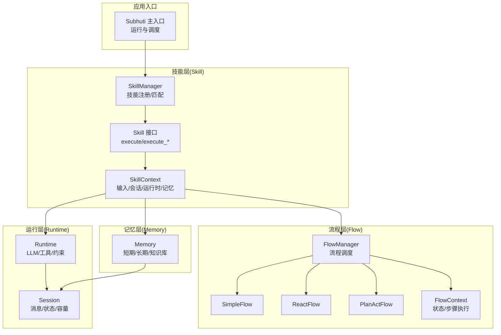
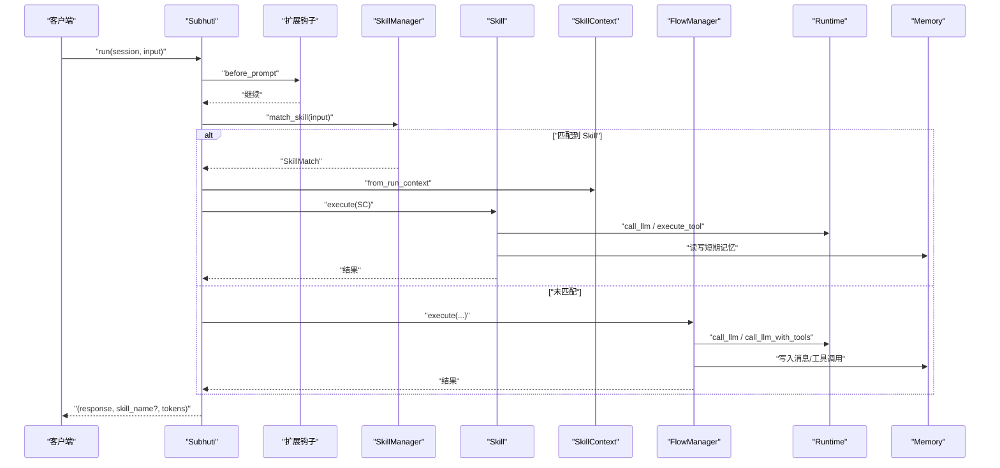
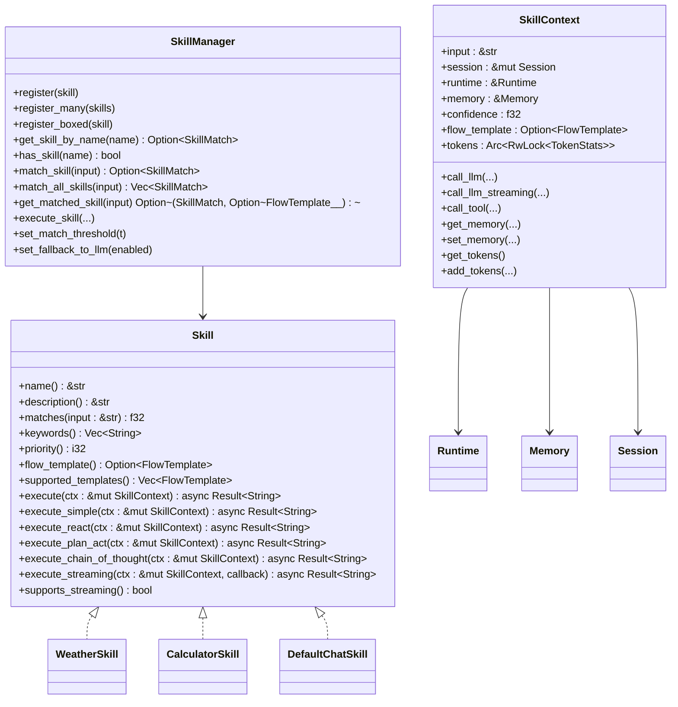
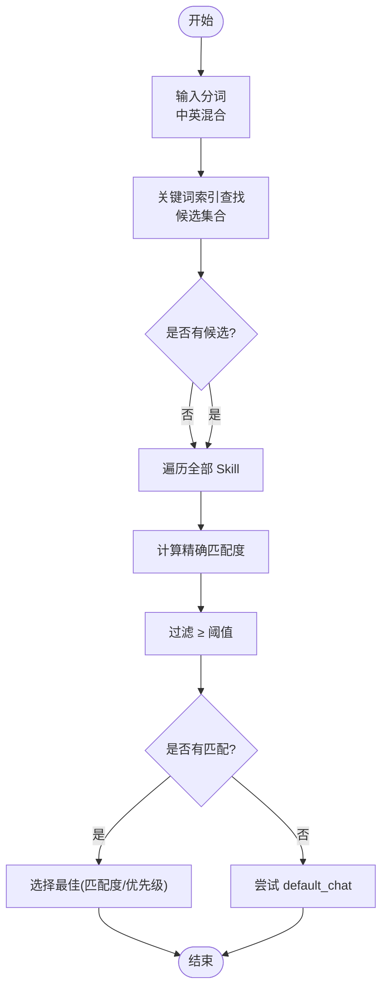
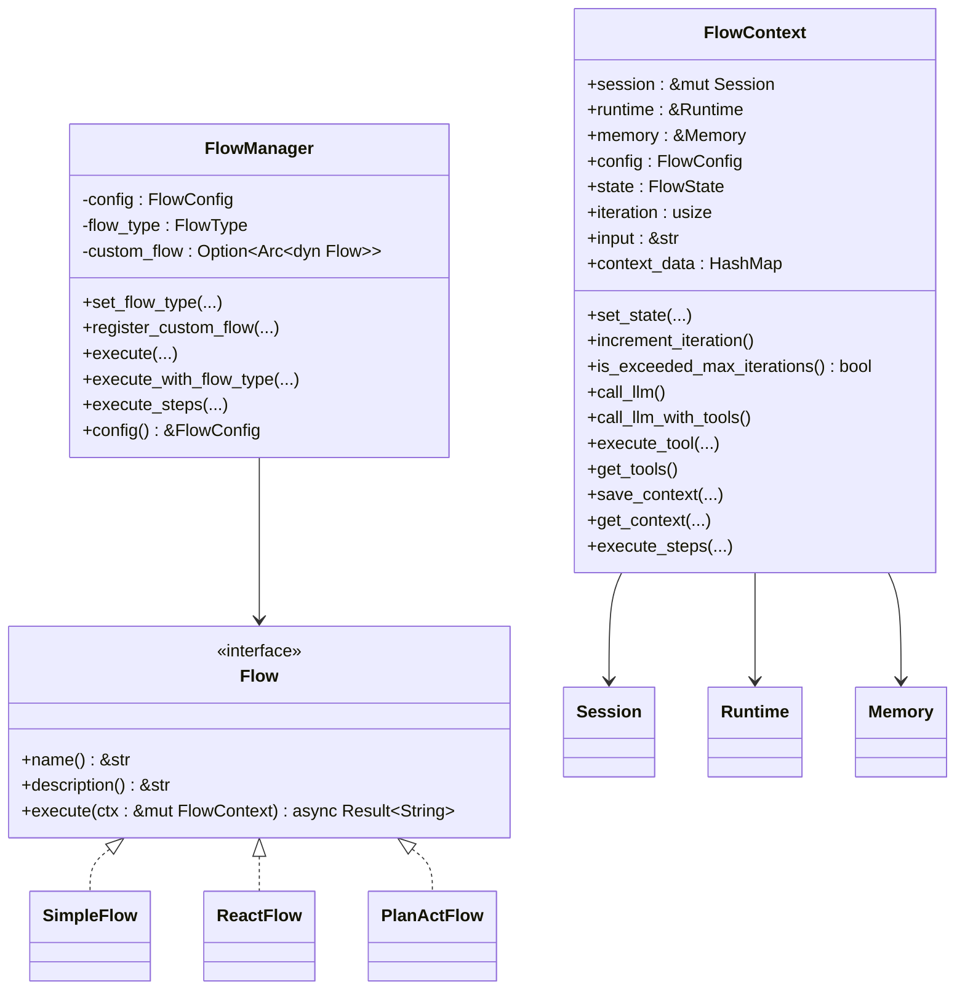
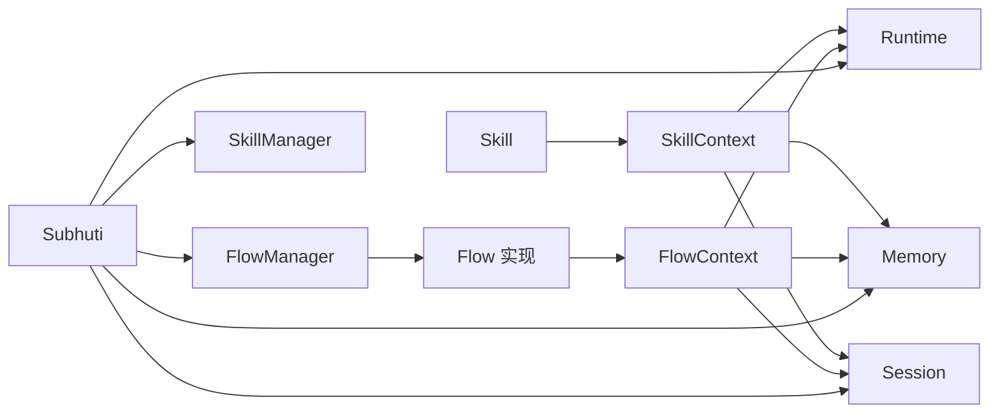

# 技能系统

<cite>
**本文引用的文件**
- [crates/subhuti/src/skill/mod.rs](file://crates/subhuti/src/skill/mod.rs)
- [crates/subhuti/src/flow/mod.rs](file://crates/subhuti/src/flow/mod.rs)
- [crates/subhuti/src/flow/simple.rs](file://crates/subhuti/src/flow/simple.rs)
- [crates/subhuti/src/flow/react.rs](file://crates/subhuti/src/flow/react.rs)
- [crates/subhuti/src/flow/plan_act.rs](file://crates/subhuti/src/flow/plan_act.rs)
- [crates/subhuti/src/context.rs](file://crates/subhuti/src/context.rs)
- [crates/subhuti/src/runtime/mod.rs](file://crates/subhuti/src/runtime/mod.rs)
- [crates/subhuti/src/runtime/session.rs](file://crates/subhuti/src/runtime/session.rs)
- [crates/subhuti/src/lib.rs](file://crates/subhuti/src/lib.rs)
- [crates/subhuti/data/persona.json](file://crates/subhuti/data/persona.json)
- [crates/subhuti/tests/integration_test.rs](file://crates/subhuti/tests/integration_test.rs)
- [crates/subhuti/tests/performance_test.rs](file://crates/subhuti/tests/performance_test.rs)
</cite>

## 目录
1. [简介](#简介)
2. [项目结构](#项目结构)
3. [核心组件](#核心组件)
4. [架构总览](#架构总览)
5. [详细组件分析](#详细组件分析)
6. [依赖关系分析](#依赖关系分析)
7. [性能考量](#性能考量)
8. [故障排查指南](#故障排查指南)
9. [结论](#结论)
10. [附录](#附录)

## 简介
本文件面向 Subhuti 技能系统，提供从设计理念到实现规范的完整开发文档。重点覆盖：
- Skill 接口设计与实现规范：技能注册、参数定义、执行流程、返回值处理
- 内置技能分类与功能：简单技能（SimpleSkill）、反应技能（ReactSkill）、计划行动技能（PlanActSkill）
- 技能匹配机制（Skill Matching）：意图识别、参数解析、最佳技能选择
- 流程管理器（Flow Manager）：调度算法、并发控制、错误恢复
- 自定义技能开发：模板使用、工具调用最佳实践、性能优化技巧

## 项目结构
Subhuti 采用“四层架构”：Memory、Runtime、Flow、Extension。技能系统位于 Skill 层，与 Flow 层协同工作，通过 Runtime 层调用 LLM 与工具，借助 Memory 层与 Session 管理状态。

图示来源
- [crates/subhuti/src/lib.rs](file://crates/subhuti/src/lib.rs)
- [crates/subhuti/src/skill/mod.rs](file://crates/subhuti/src/skill/mod.rs)
- [crates/subhuti/src/flow/mod.rs](file://crates/subhuti/src/flow/mod.rs)
- [crates/subhuti/src/runtime/mod.rs](file://crates/subhuti/src/runtime/mod.rs)
- [crates/subhuti/src/runtime/session.rs](file://crates/subhuti/src/runtime/session.rs)

章节来源
- [crates/subhuti/src/lib.rs](file://crates/subhuti/src/lib.rs)
- [crates/subhuti/src/skill/mod.rs](file://crates/subhuti/src/skill/mod.rs)
- [crates/subhuti/src/flow/mod.rs](file://crates/subhuti/src/flow/mod.rs)
- [crates/subhuti/src/runtime/mod.rs](file://crates/subhuti/src/runtime/mod.rs)
- [crates/subhuti/src/runtime/session.rs](file://crates/subhuti/src/runtime/session.rs)

## 核心组件
- Skill 接口与上下文
  - Skill trait：定义名称、描述、匹配度、关键词索引、流程模板选择、纯代码执行与流式执行
  - SkillContext：封装输入、会话、运行时、记忆、匹配度、模板、Token 统计
- SkillManager：注册、索引、匹配、阈值控制、回退策略
- Flow 层：Simple/React/PlanAct 三种内置流程，FlowManager 统一调度
- Runtime：LLM 客户端抽象、工具系统、约束护栏、会话管理
- Memory：短期/长期/知识库，支持检索与归档
- Session：滑动窗口消息管理、工具调用计数、元数据

章节来源
- [crates/subhuti/src/skill/mod.rs](file://crates/subhuti/src/skill/mod.rs)
- [crates/subhuti/src/flow/mod.rs](file://crates/subhuti/src/flow/mod.rs)
- [crates/subhuti/src/flow/simple.rs](file://crates/subhuti/src/flow/simple.rs)
- [crates/subhuti/src/flow/react.rs](file://crates/subhuti/src/flow/react.rs)
- [crates/subhuti/src/flow/plan_act.rs](file://crates/subhuti/src/flow/plan_act.rs)
- [crates/subhuti/src/runtime/mod.rs](file://crates/subhuti/src/runtime/mod.rs)
- [crates/subhuti/src/runtime/session.rs](file://crates/subhuti/src/runtime/session.rs)
- [crates/subhuti/src/context.rs](file://crates/subhuti/src/context.rs)

## 架构总览
Subhuti 的运行路径如下：
1) 外部输入进入 Subhuti.run，创建 RunContext
2) 扩展钩子 before_prompt 触发
3) SkillManager 按关键词索引与匹配度选择最佳 Skill
4) 若匹配成功：从 RunContext 构造 SkillContext，调用 Skill.execute
5) 若未匹配：转为 FlowManager 执行默认流程（Simple/React/PlanAct）
6) Runtime 负责 LLM 与工具调用，Memory 负责记忆读写，Session 管理会话状态

图示来源
- [crates/subhuti/src/lib.rs](file://crates/subhuti/src/lib.rs)
- [crates/subhuti/src/skill/mod.rs](file://crates/subhuti/src/skill/mod.rs)
- [crates/subhuti/src/flow/mod.rs](file://crates/subhuti/src/flow/mod.rs)
- [crates/subhuti/src/runtime/mod.rs](file://crates/subhuti/src/runtime/mod.rs)
- [crates/subhuti/src/runtime/session.rs](file://crates/subhuti/src/runtime/session.rs)

## 详细组件分析

### Skill 接口与上下文
- 设计理念
  - 纯代码风格：Skill 以 Rust 代码实现，无需声明式步骤
  - 预设主流程模板：提供 ReAct、Plan-Act、Simple、Chain-of-Thought 等模板
  - 灵活选择：可使用模板或完全自定义 execute
- 关键接口
  - name/description/keywords/priority：元信息与索引
  - matches：返回 0~1 的匹配度
  - flow_template/supported_templates：模板选择
  - execute/execute_*：模板化执行；supports_streaming/execute_streaming：流式输出
- 上下文能力
  - call_llm/call_llm_streaming：调用 LLM，自动累加 Token 统计
  - call_tool：调用工具，失败即报错
  - get_memory/set_memory：短期记忆读写
  - tokens/get_tokens/add_tokens：跨调用共享的 Token 统计

图示来源
- [crates/subhuti/src/skill/mod.rs](file://crates/subhuti/src/skill/mod.rs)

章节来源
- [crates/subhuti/src/skill/mod.rs](file://crates/subhuti/src/skill/mod.rs)

### 技能匹配机制（Skill Matching）
- 关键词索引优化
  - 注册时为每个 Skill 构建关键词倒排索引，提升大规模匹配性能
  - 匹配阶段先通过关键词索引筛选候选，再对候选计算精确匹配度
- 匹配流程
  - get_candidate_skills：基于输入分词（中英混合）查找候选
  - match_skill：在候选集中计算 matches，取高于阈值的最佳项
  - get_matched_skill：若无匹配，尝试 default_chat 回退
- 阈值与优先级
  - set_match_threshold 控制最低匹配度
  - 相同匹配度时按 priority 选择更高优先级的 Skill

图示来源
- [crates/subhuti/src/skill/mod.rs](file://crates/subhuti/src/skill/mod.rs)

章节来源
- [crates/subhuti/src/skill/mod.rs](file://crates/subhuti/src/skill/mod.rs)

### 流程管理器（Flow Manager）
- 内置流程
  - SimpleFlow：直接调用 LLM，适合简单对话
  - ReactFlow：ReAct 循环（Plan→Act→Observe→Reflect），自动工具调用
  - PlanActFlow：先规划再执行，适合复杂任务
- 统一调度
  - FlowManager 根据 FlowType 选择 Simple/React/PlanAct 或自定义流程
  - execute_steps 支持 Skill 预设步骤，减少 LLM 思考开销
- 上下文与状态
  - FlowContext 统一承载 Session/Runtime/Memory/配置/状态/迭代计数
  - FlowState：Init/Planning/Acting/Observing/Reflecting/Completed/Failed

图示来源
- [crates/subhuti/src/flow/mod.rs](file://crates/subhuti/src/flow/mod.rs)
- [crates/subhuti/src/flow/simple.rs](file://crates/subhuti/src/flow/simple.rs)
- [crates/subhuti/src/flow/react.rs](file://crates/subhuti/src/flow/react.rs)
- [crates/subhuti/src/flow/plan_act.rs](file://crates/subhuti/src/flow/plan_act.rs)

章节来源
- [crates/subhuti/src/flow/mod.rs](file://crates/subhuti/src/flow/mod.rs)
- [crates/subhuti/src/flow/simple.rs](file://crates/subhuti/src/flow/simple.rs)
- [crates/subhuti/src/flow/react.rs](file://crates/subhuti/src/flow/react.rs)
- [crates/subhuti/src/flow/plan_act.rs](file://crates/subhuti/src/flow/plan_act.rs)

### 内置技能分类与功能
- 简单技能（SimpleSkill）
  - 适合直接工具调用或简单问答
  - 在 flow_template 中返回 Simple，实现 execute_simple
- 反应技能（ReactSkill）
  - 适合需要多轮思考与工具调用的场景
  - 在 flow_template 中返回 ReAct，实现 execute_react
- 计划行动技能（PlanActSkill）
  - 适合需要先规划再执行的复杂任务
  - 在 flow_template 中返回 PlanAct，实现 execute_plan_act
- 默认聊天（DefaultChatSkill）
  - 未匹配到具体技能时的回退方案

章节来源
- [crates/subhuti/src/skill/mod.rs](file://crates/subhuti/src/skill/mod.rs)
- [crates/subhuti/src/lib.rs](file://crates/subhuti/src/lib.rs)

### 自定义技能开发指南
- 步骤
  - 实现 Skill trait：name/description/matches/flow_template/supported_templates
  - 选择模板或实现 execute：若使用模板需实现对应的 execute_* 方法
  - 在 execute 中使用 SkillContext 调用 LLM 与工具，读写记忆
  - 可选：实现 execute_streaming 与 supports_streaming
  - 注册：通过 Subhuti.register_skill 或 SkillManager.register
- 参数与返回
  - matches 返回 0~1 的匹配度，keywords 用于索引优化
  - execute 返回字符串结果；流式输出通过 execute_streaming
  - 使用 Token 统计：SkillContext.add_tokens 累加 LLM 使用量
- 工具调用最佳实践
  - 使用 SkillContext.call_tool，失败即报错，便于上层统一处理
  - 参数尽量结构化，避免在 LLM 中拼接复杂 JSON
- 性能优化
  - 为高频技能提供 keywords，利用关键词索引
  - 优先使用模板化流程，减少 LLM 思考成本
  - 合理设置匹配阈值与优先级，避免误触发

章节来源
- [crates/subhuti/src/skill/mod.rs](file://crates/subhuti/src/skill/mod.rs)
- [crates/subhuti/src/context.rs](file://crates/subhuti/src/context.rs)

## 依赖关系分析
- 组件耦合
  - Skill 依赖 SkillContext，SkillContext 依赖 Runtime/Memory/Session
  - FlowManager 依赖 Flow 实现与 FlowContext
  - Subhuti 作为门面，协调扩展、Skill、Flow、Runtime、Memory
- 外部依赖
  - LLM 客户端抽象（OpenAI/Ollama/Doubao/Custom）
  - 工具系统（Tool trait + ToolInfo/ToolResult）
  - 会话与记忆（Session/Message/TokenStats）

图示来源
- [crates/subhuti/src/skill/mod.rs](file://crates/subhuti/src/skill/mod.rs)
- [crates/subhuti/src/flow/mod.rs](file://crates/subhuti/src/flow/mod.rs)
- [crates/subhuti/src/runtime/mod.rs](file://crates/subhuti/src/runtime/mod.rs)
- [crates/subhuti/src/runtime/session.rs](file://crates/subhuti/src/runtime/session.rs)
- [crates/subhuti/src/lib.rs](file://crates/subhuti/src/lib.rs)

章节来源
- [crates/subhuti/src/skill/mod.rs](file://crates/subhuti/src/skill/mod.rs)
- [crates/subhuti/src/flow/mod.rs](file://crates/subhuti/src/flow/mod.rs)
- [crates/subhuti/src/runtime/mod.rs](file://crates/subhuti/src/runtime/mod.rs)
- [crates/subhuti/src/runtime/session.rs](file://crates/subhuti/src/runtime/session.rs)
- [crates/subhuti/src/lib.rs](file://crates/subhuti/src/lib.rs)

## 性能考量
- 技能匹配
  - 关键词索引：注册时建立倒排索引，匹配时先筛选候选，再精确计算
  - 分词策略：中英混合分词，兼顾中文词汇与英文单词
  - 阈值与优先级：合理设置阈值与优先级，降低误匹配与回退概率
- 流程执行
  - Simple/React/PlanAct 三类流程针对不同场景，选择合适模板可显著降低 LLM 思考成本
  - FlowContext 的状态机与迭代限制，避免无限循环
- 运行时与会话
  - Session 的滑动窗口与自动归档，控制上下文长度与内存占用
  - Token 统计集中管理，便于成本控制与审计
- 基准测试
  - 集成测试与性能测试覆盖框架初始化、记忆系统、健康检查、技能匹配等关键路径

章节来源
- [crates/subhuti/tests/integration_test.rs](file://crates/subhuti/tests/integration_test.rs)
- [crates/subhuti/tests/performance_test.rs](file://crates/subhuti/tests/performance_test.rs)
- [crates/subhuti/src/runtime/session.rs](file://crates/subhuti/src/runtime/session.rs)
- [crates/subhuti/src/context.rs](file://crates/subhuti/src/context.rs)

## 故障排查指南
- 技能未匹配
  - 检查 matches 返回值与关键词索引是否正确
  - 调整 set_match_threshold，确认 fallback_to_llm 配置
  - 确认 default_chat 是否存在
- 工具调用失败
  - 使用 SkillContext.call_tool 会将错误包装为异常，检查工具名称与参数
  - 确认 Runtime 已注册相应工具
- LLM 调用异常
  - 检查 Runtime 是否配置了 LLM 客户端
  - 关注超时与上下文长度限制
- 会话溢出
  - Session 的滑动窗口容量默认较小，必要时增大 short_term_capacity
  - 关注自动归档逻辑，确保历史对话被正确归档

章节来源
- [crates/subhuti/src/skill/mod.rs](file://crates/subhuti/src/skill/mod.rs)
- [crates/subhuti/src/runtime/mod.rs](file://crates/subhuti/src/runtime/mod.rs)
- [crates/subhuti/src/runtime/session.rs](file://crates/subhuti/src/runtime/session.rs)

## 结论
Subhuti 技能系统以“纯代码风格 + 预设流程模板”为核心，结合关键词索引与多轮匹配，实现了高灵活性与高性能的技能路由。通过 Flow 层的 ReAct/Plan-Act/Simple 等模板，以及 Runtime/Memory/Session 的统一抽象，开发者可以快速构建从简单问答到复杂任务的各类技能，并在保证可控性的前提下获得良好的扩展性与性能表现。

## 附录
- 人格配置（Persona）
  - 用于心灵层（SoulLayer）的角色属性与偏好，影响交互风格与技能亲和度
  - 可通过 Subhuti 激活专家插件，动态注入技能与知识

章节来源
- [crates/subhuti/data/persona.json](file://crates/subhuti/data/persona.json)
- [crates/subhuti/src/lib.rs](file://crates/subhuti/src/lib.rs)