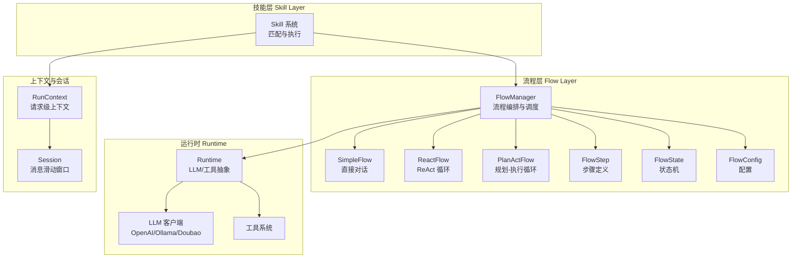
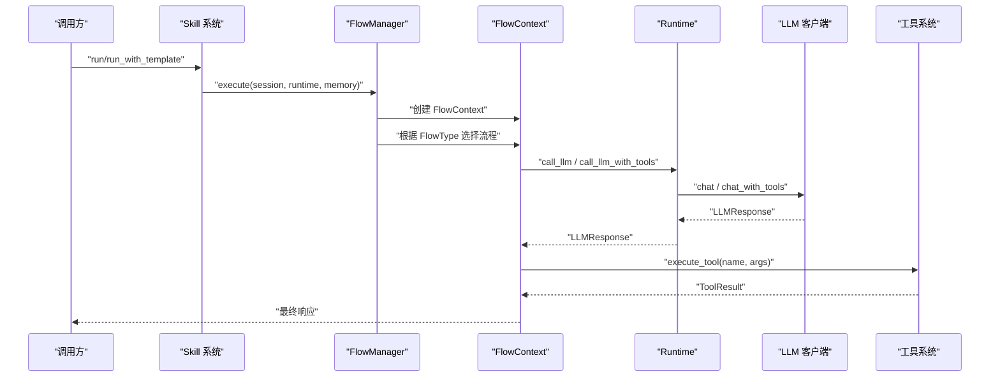
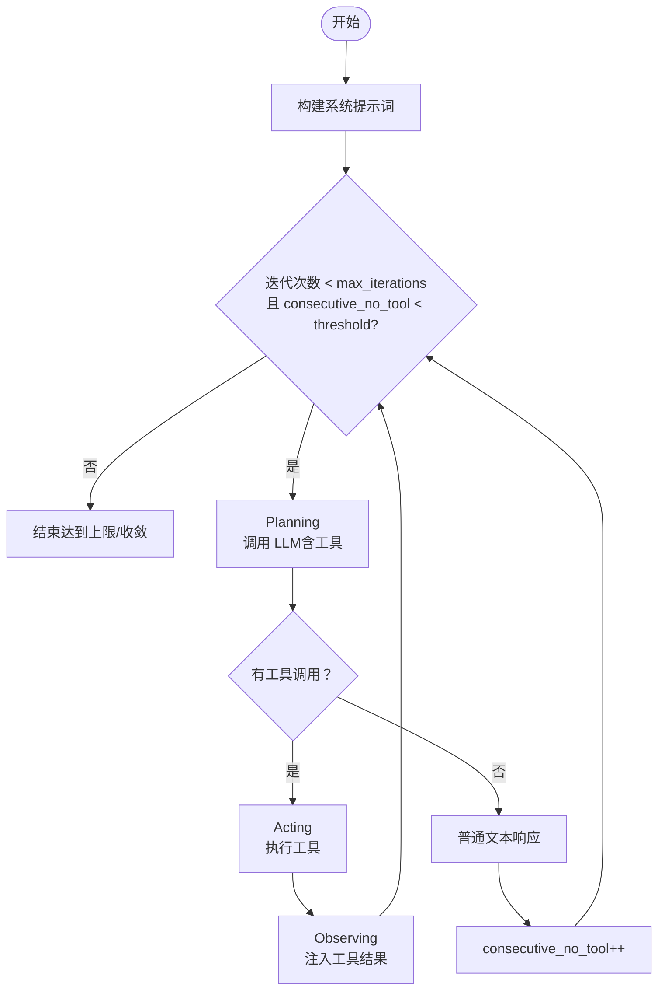
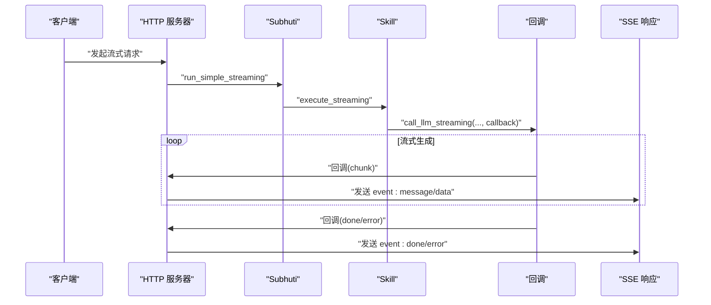
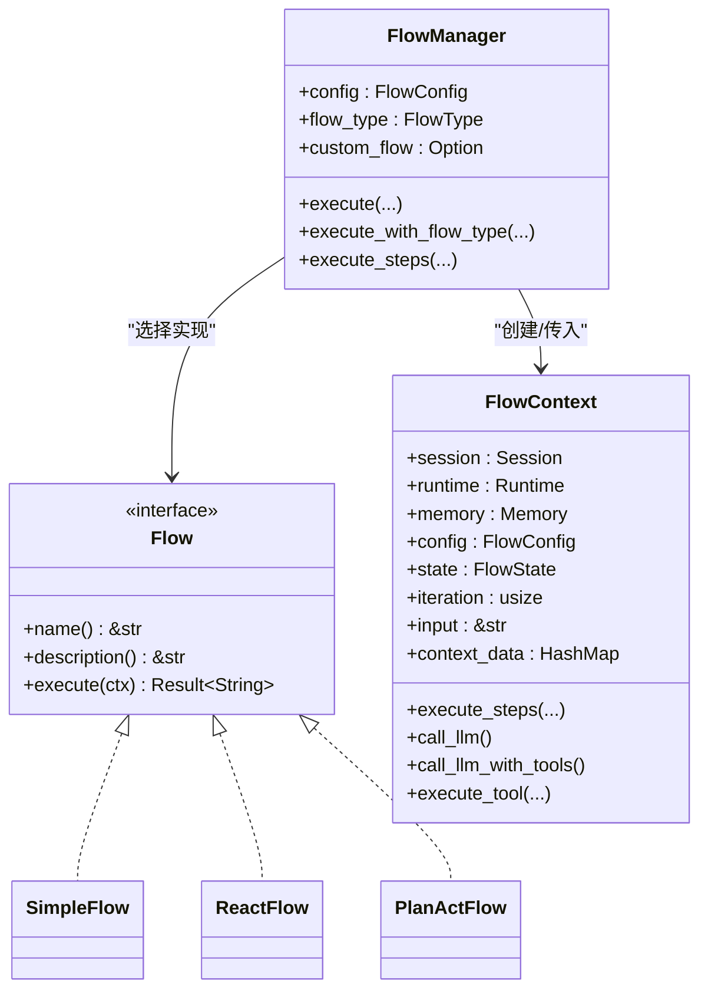

# 流程管理器

<cite>
**本文引用的文件**
- [lib.rs](file://crates/subhuti/src/lib.rs)
- [flow/mod.rs](file://crates/subhuti/src/flow/mod.rs)
- [flow/simple.rs](file://crates/subhuti/src/flow/simple.rs)
- [flow/react.rs](file://crates/subhuti/src/flow/react.rs)
- [flow/plan_act.rs](file://crates/subhuti/src/flow/plan_act.rs)
- [context.rs](file://crates/subhuti/src/context.rs)
- [session.rs](file://crates/subhuti/src/runtime/session.rs)
- [client.rs](file://crates/subhuti/src/runtime/llm/client.rs)
- [retry.rs](file://crates/subhuti/src/runtime/llm/retry.rs)
- [skill/mod.rs](file://crates/subhuti/src/skill/mod.rs)
- [integration_test.rs](file://crates/subhuti/tests/integration_test.rs)
</cite>

## 目录
1. [简介](#简介)
2. [项目结构](#项目结构)
3. [核心组件](#核心组件)
4. [架构总览](#架构总览)
5. [详细组件分析](#详细组件分析)
6. [依赖关系分析](#依赖关系分析)
7. [性能考量](#性能考量)
8. [故障排除指南](#故障排除指南)
9. [结论](#结论)
10. [附录](#附录)

## 简介
本文件面向 Subhuti 框架中的“流程管理器”（FlowManager）与“流程层”（Flow Layer），系统性阐述其调度算法、并发控制、技能执行生命周期、错误恢复策略、超时处理、三种预设流程模板（SimpleFlow、ReActFlow、PlanActFlow）的实现细节，以及流式输出、回调函数、实时数据传输机制。同时提供最佳实践、使用示例与故障排除指南，帮助开发者在不同场景下正确选择与定制流程策略。

## 项目结构
流程层位于 crates/subhuti/src/flow 下，包含 Flow trait、FlowManager、FlowStep、FlowConfig、FlowState 等核心类型；具体流程模板分别在 simple.rs、react.rs、plan_act.rs 中实现；与之协作的还有运行时（LLM、工具）、会话（Session）、上下文（RunContext）与技能系统（Skill）。

图表来源
- [flow/mod.rs:677-800](file://crates/subhuti/src/flow/mod.rs#L677-L800)
- [flow/simple.rs:1-72](file://crates/subhuti/src/flow/simple.rs#L1-L72)
- [flow/react.rs:1-227](file://crates/subhuti/src/flow/react.rs#L1-L227)
- [flow/plan_act.rs:1-166](file://crates/subhuti/src/flow/plan_act.rs#L1-L166)
- [lib.rs:84-156](file://crates/subhuti/src/lib.rs#L84-L156)
- [context.rs:51-87](file://crates/subhuti/src/context.rs#L51-L87)
- [session.rs:67-315](file://crates/subhuti/src/runtime/session.rs#L67-L315)
- [skill/mod.rs:1-120](file://crates/subhuti/src/skill/mod.rs#L1-L120)

章节来源
- [flow/mod.rs:1-134](file://crates/subhuti/src/flow/mod.rs#L1-L134)
- [lib.rs:22-50](file://crates/subhuti/src/lib.rs#L22-L50)

## 核心组件
- Flow trait：流程抽象接口，所有流程需实现 name、description、execute。
- FlowManager：统一编排器，负责选择流程类型（Simple/React/PlanAct/Custom），并驱动 FlowContext 执行。
- FlowContext：流程执行上下文，封装 Session、Runtime、Memory、配置、状态、迭代计数、输入与上下文数据。
- FlowStep：流程步骤定义，支持 Tool、Knowledge、LLM、LLMToContext、Condition、Memory、Parallel、Loop 等。
- FlowConfig：流程配置，包含最大迭代、自动重试、收敛阈值、反思开关等。
- FlowState：流程状态机，Init、Planning、Acting、Observing、Reflecting、Completed、Failed。
- FlowType：流程类型枚举，Simple、React、PlanAct、Custom。

章节来源
- [flow/mod.rs:52-274](file://crates/subhuti/src/flow/mod.rs#L52-L274)
- [flow/mod.rs:631-675](file://crates/subhuti/src/flow/mod.rs#L631-L675)
- [flow/mod.rs:677-800](file://crates/subhuti/src/flow/mod.rs#L677-L800)

## 架构总览
FlowManager 作为流程编排中枢，接收来自 Skill 或默认流程的调用请求，依据 FlowType 选择对应流程模板，并通过 FlowContext 驱动执行。FlowContext 在执行过程中可调用 Runtime 的 LLM 与工具，维护 Session 的消息滑动窗口，累积 Token 统计，并在必要时进行工具调用与观察。

图表来源
- [lib.rs:754-771](file://crates/subhuti/src/lib.rs#L754-L771)
- [flow/mod.rs:729-771](file://crates/subhuti/src/flow/mod.rs#L729-L771)
- [flow/mod.rs:393-413](file://crates/subhuti/src/flow/mod.rs#L393-L413)
- [flow/mod.rs:405-408](file://crates/subhuti/src/flow/mod.rs#L405-L408)

## 详细组件分析

### FlowManager 调度与并发控制
- 调度算法
  - 通过 set_flow_type 与 execute_with_flow_type 选择流程类型，支持 Simple、React、PlanAct、Custom。
  - React 与 PlanAct 采用 ReAct 循环：Plan → Act → Observe → Reflect（PlanAct 中的 Final 为 Completed）。
  - SimpleFlow 直接调用 LLM，无工具调用。
- 并发控制
  - FlowContext::execute_steps 对 FlowStep 列表顺序执行，内部使用 Box::pin 处理递归异步调用。
  - FlowStep::Parallel 当前为顺序执行（注释提示可用 futures join! 优化），可作为并发优化点。
- 状态机
  - FlowState 在每个阶段推进，便于可观测性与调试。
- 配置与收敛
  - FlowConfig 提供 max_iterations、convergence_threshold、auto_retry、enable_reflection 等参数。
  - ReactFlow 使用 consecutive_no_tool 与 convergence_threshold 控制收敛。

章节来源
- [flow/mod.rs:696-771](file://crates/subhuti/src/flow/mod.rs#L696-L771)
- [flow/react.rs:107-196](file://crates/subhuti/src/flow/react.rs#L107-L196)
- [flow/plan_act.rs:95-154](file://crates/subhuti/src/flow/plan_act.rs#L95-L154)
- [flow/simple.rs:47-60](file://crates/subhuti/src/flow/simple.rs#L47-L60)
- [flow/mod.rs:425-574](file://crates/subhuti/src/flow/mod.rs#L425-L574)

### FlowContext 生命周期与中间结果处理
- 生命周期
  - 创建：new/with_input/from_run_context，初始化 state=Init、iteration=0、context_data=HashMap。
  - 执行：execute_steps 遍历 FlowStep，逐个执行并累积最终结果。
  - 结束：set_state 推进到 Completed/Failure，更新 Session 消息。
- 中间结果
  - save_context/get_context 用于在步骤间传递数据。
  - process_prompt_template/process_args_template 支持模板变量注入（{{input}}、{{context.key}}）。
  - evaluate_condition 简化条件判断（has_context:、input_contains:）。

章节来源
- [flow/mod.rs:290-424](file://crates/subhuti/src/flow/mod.rs#L290-L424)
- [flow/mod.rs:576-629](file://crates/subhuti/src/flow/mod.rs#L576-L629)

### FlowStep 步骤定义与执行
- Tool：调用工具，支持 save_to_context。
- Knowledge：查询知识库，支持 save_to_context。
- LLM/LLMToContext：调用 LLM，前者不保存结果，后者保存到上下文。
- Condition：条件分支，嵌套执行 if_true/if_false。
- Memory：读取/写入/搜索短期记忆。
- Parallel：顺序执行（可优化为并行）。
- Loop：循环执行 body n 次，变量保存到上下文。

章节来源
- [flow/mod.rs:52-134](file://crates/subhuti/src/flow/mod.rs#L52-L134)
- [flow/mod.rs:425-574](file://crates/subhuti/src/flow/mod.rs#L425-L574)

### 三种预设流程模板

#### SimpleFlow（直接执行模式）
- 适用场景：简单对话，无需工具调用。
- 执行流程：Planning → 直接调用 LLM → Completed，追加 Assistant 消息。
- 特点：最轻量，适合高频、低复杂度交互。

章节来源
- [flow/simple.rs:1-72](file://crates/subhuti/src/flow/simple.rs#L1-L72)

#### ReActFlow（多轮思考机制）
- 适用场景：需要自动工具调用的复杂任务。
- 执行流程：Plan → Act → Observe → Reflect 循环，收敛阈值控制结束。
- 关键点：
  - 构建系统提示词，限定工具可用范围与调用格式。
  - 使用 call_llm_with_tools 获取工具调用意图，若参数为空则回退为普通文本。
  - 执行工具后将结果作为 Tool 消息注入，进入下一轮思考。
  - 支持 consecutive_no_tool 收敛与 max_iterations 保护。

图表来源
- [flow/react.rs:107-196](file://crates/subhuti/src/flow/react.rs#L107-L196)

章节来源
- [flow/react.rs:1-227](file://crates/subhuti/src/flow/react.rs#L1-L227)

#### PlanActFlow（规划-执行循环）
- 适用场景：复杂任务，需要先规划步骤再执行。
- 执行流程：Plan → Act → Observe → Completed（PlanAct 中的 Final 为 Completed）。
- 关键点：
  - 构建规划提示词，要求 LLM 先给出 PLAN 步骤，再逐条执行工具调用。
  - 若无工具调用，视为已完成，直接返回最终回答。

章节来源
- [flow/plan_act.rs:1-166](file://crates/subhuti/src/flow/plan_act.rs#L1-L166)

### 流式输出与回调函数
- Skill 层支持流式输出：SkillContext::call_llm_streaming 接受回调，边生成边推送。
- HTTP 层将回调输出转换为 Server-Sent Events（SSE），事件类型包括 message、done、error，首帧发送 session_id。
- Subhuti::run_simple_streaming 将回调桥接到 SSE 流，实现端到端实时数据传输。

图表来源
- [skill/mod.rs:212-222](file://crates/subhuti/src/skill/mod.rs#L212-L222)
- [lib.rs:890-950](file://crates/subhuti/src/lib.rs#L890-L950)
- [client.rs:218-227](file://crates/subhuti/src/runtime/llm/client.rs#L218-L227)

章节来源
- [skill/mod.rs:212-222](file://crates/subhuti/src/skill/mod.rs#L212-L222)
- [lib.rs:890-950](file://crates/subhuti/src/lib.rs#L890-L950)
- [client.rs:218-227](file://crates/subhuti/src/runtime/llm/client.rs#L218-L227)

### 错误恢复与超时处理
- LLM 重试与回退
  - retry.rs 提供带指数退避的重试机制，支持普通 chat 与流式 chat。
  - 可配置最大重试次数、初始延迟、是否启用回退消息。
- HTTP 层超时
  - DoubaoClient 构造时设置 connect_timeout 与 timeout，避免阻塞。
- 流程层保护
  - FlowContext::is_exceeded_max_iterations 与 FlowState 状态机防止无限循环。
  - ReactFlow 的 consecutive_no_tool 收敛阈值避免冗余思考。

章节来源
- [retry.rs:52-202](file://crates/subhuti/src/runtime/llm/retry.rs#L52-L202)
- [client.rs:586-598](file://crates/subhuti/src/runtime/llm/client.rs#L586-L598)
- [flow/mod.rs:388-392](file://crates/subhuti/src/flow/mod.rs#L388-L392)
- [flow/react.rs:122-135](file://crates/subhuti/src/flow/react.rs#L122-L135)

## 依赖关系分析
- FlowManager 依赖 Flow trait 的实现（Simple/React/PlanAct/Custom），并通过 FlowContext 统一访问 Runtime、Memory、Session。
- FlowContext 依赖 Runtime 的 LLM 与工具调用，依赖 Memory 的知识与短期记忆操作。
- Skill 系统通过 RunContext 与 FlowManager 协作，支持模板选择与流式执行。
- HTTP 层通过 Subhuti::run_simple_streaming 将回调转为 SSE。

图表来源
- [flow/mod.rs:631-771](file://crates/subhuti/src/flow/mod.rs#L631-L771)
- [flow/simple.rs:13-29](file://crates/subhuti/src/flow/simple.rs#L13-L29)
- [flow/react.rs:14-29](file://crates/subhuti/src/flow/react.rs#L14-L29)
- [flow/plan_act.rs:18-32](file://crates/subhuti/src/flow/plan_act.rs#L18-L32)

章节来源
- [flow/mod.rs:631-771](file://crates/subhuti/src/flow/mod.rs#L631-L771)
- [lib.rs:84-156](file://crates/subhuti/src/lib.rs#L84-L156)

## 性能考量
- 并发优化
  - FlowStep::Parallel 当前顺序执行，建议使用 futures::join! 并行执行子步骤，降低总延迟。
- 模板变量处理
  - process_prompt_template/process_args_template 为字符串替换，建议缓存常用模板键值，减少重复解析。
- 消息滑动窗口
  - Session 的 add_conversation_pair 自动归档超额消息，避免内存膨胀；结合长期记忆归档提升吞吐。
- 重试策略
  - 根据场景选择保守/激进重试配置，避免过度重试导致延迟放大。
- 流式输出
  - 流式回调应尽量短路处理，避免阻塞主线程；SSE 事件合并可减少网络开销。

[本节为通用指导，不直接分析特定文件]

## 故障排除指南
- 无工具调用但模型仍请求工具
  - 检查 ReactFlow 的工具调用参数是否为空，必要时回退为普通文本。
- 收敛过早或过晚
  - 调整 FlowConfig::convergence_threshold 与 max_iterations，平衡响应质量与时延。
- 流式输出中断
  - 检查 LLM 客户端是否支持真正的流式输出；当前部分客户端为简化实现，可能改为一次性返回。
- 超时与连接失败
  - DoubaoClient 已设置超时；如遇网络波动，启用重试配置并考虑指数退避。
- 记忆未命中
  - 检查 Memory::search_knowledge 与短期记忆搜索参数，确认关键词与上下文注入是否正确。

章节来源
- [flow/react.rs:144-162](file://crates/subhuti/src/flow/react.rs#L144-L162)
- [retry.rs:137-202](file://crates/subhuti/src/runtime/llm/retry.rs#L137-L202)
- [client.rs:586-598](file://crates/subhuti/src/runtime/llm/client.rs#L586-L598)
- [flow/mod.rs:576-629](file://crates/subhuti/src/flow/mod.rs#L576-L629)

## 结论
FlowManager 通过 Flow trait 与 FlowManager 的统一调度，将 Simple、ReAct、PlanAct 三类流程模板无缝接入 Skill 与默认流程路径。配合 FlowContext 的状态机、模板变量注入、工具与 LLM 调用，实现了从简单对话到复杂推理的全栈支持。结合流式输出与重试回退机制，可在高并发与不稳定网络环境下保持稳定体验。建议在生产环境中进一步优化并行执行、缓存模板变量与消息滑动窗口策略，以获得更优的性能与稳定性。

[本节为总结性内容，不直接分析特定文件]

## 附录

### 使用示例（路径指引）
- 使用默认流程（ReAct）
  - [lib.rs:667-742](file://crates/subhuti/src/lib.rs#L667-L742)
- 使用指定流程模板（Simple/ReAct/PlanAct）
  - [lib.rs:695-742](file://crates/subhuti/src/lib.rs#L695-L742)
- 使用 Skill 并指定模板
  - [lib.rs:778-806](file://crates/subhuti/src/lib.rs#L778-L806)
- 流式输出（HTTP SSE）
  - [lib.rs:890-950](file://crates/subhuti/src/lib.rs#L890-L950)
  - [client.rs:218-227](file://crates/subhuti/src/runtime/llm/client.rs#L218-L227)
- 执行预设步骤（Skill 的纯代码实现）
  - [flow/mod.rs:773-794](file://crates/subhuti/src/flow/mod.rs#L773-L794)

### 最佳实践清单
- 选择合适的流程模板：简单对话用 Simple，复杂推理用 ReAct/PlanAct。
- 合理设置收敛阈值与最大迭代，避免无限循环。
- 在工具调用前后明确状态推进（Planning/Acting/Observing/Completed）。
- 使用 save_context 传递中间结果，避免重复计算。
- 对并行步骤进行性能评估，必要时启用 futures 并行执行。
- 配置重试与回退策略，确保在网络抖动时仍可返回可用结果。
- 使用流式输出时，确保回调处理非阻塞，SSE 事件及时发送。

[本节为通用指导，不直接分析特定文件]