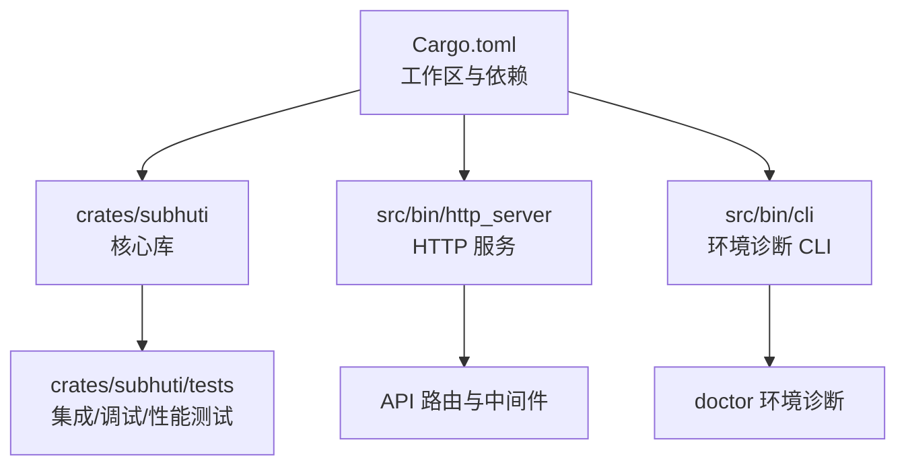
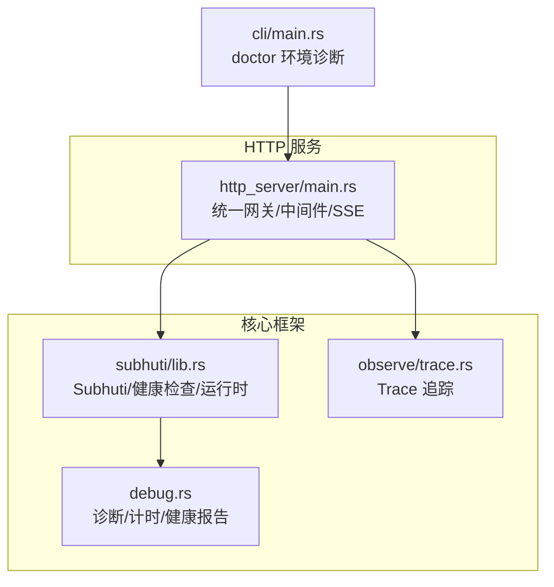
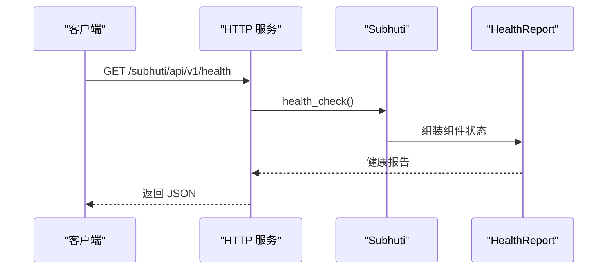
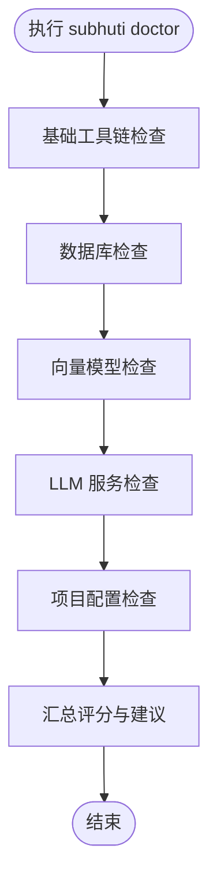
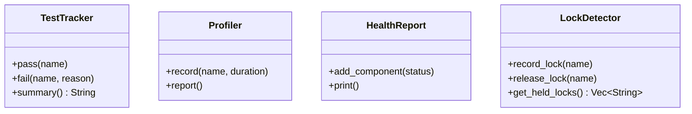
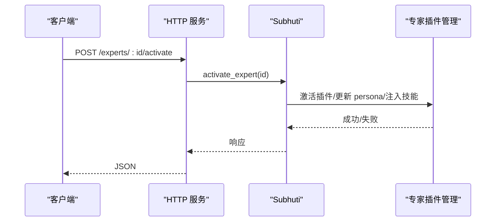
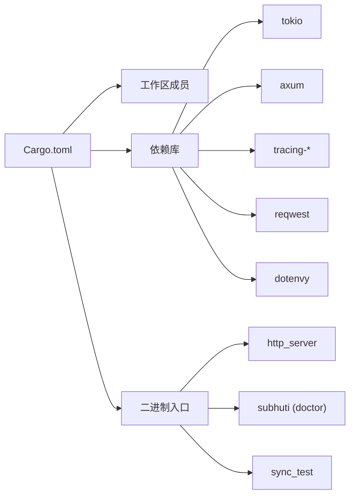

# 故障排除与常见问题

<cite>
**本文引用的文件**
- [Cargo.toml](file://Cargo.toml)
- [crates/subhuti/src/lib.rs](file://crates/subhuti/src/lib.rs)
- [crates/subhuti/src/debug.rs](file://crates/subhuti/src/debug.rs)
- [crates/subhuti/tests/integration_test.rs](file://crates/subhuti/tests/integration_test.rs)
- [crates/subhuti/tests/test_debug_tools.rs](file://crates/subhuti/tests/test_debug_tools.rs)
- [crates/subhuti/tests/performance_test.rs](file://crates/subhuti/tests/performance_test.rs)
- [src/bin/cli/main.rs](file://src/bin/cli/main.rs)
- [src/bin/http_server/main.rs](file://src/bin/http_server/main.rs)
- [crates/subhuti/data/persona.json](file://crates/subhuti/data/persona.json)
- [test_expert.sh](file://test_expert.sh)
- [test_expert_v2.sh](file://test_expert_v2.sh)
</cite>

## 目录
1. [简介](#简介)
2. [项目结构](#项目结构)
3. [核心组件](#核心组件)
4. [架构总览](#架构总览)
5. [详细组件分析](#详细组件分析)
6. [依赖关系分析](#依赖关系分析)
7. [性能考虑](#性能考虑)
8. [故障排除指南](#故障排除指南)
9. [结论](#结论)
10. [附录](#附录)

## 简介
本文件面向 Subhuti 框架使用者与维护者，提供系统化的故障排除与常见问题解答。内容覆盖安装与环境诊断、配置校验、运行时异常定位、日志分析、性能诊断、网络与数据库连接问题、LLM API 调用异常排查，以及社区支持与版本升级注意事项。文档同时给出可操作的诊断步骤、可视化流程图与最佳实践，帮助快速定位并解决问题。

## 项目结构
Subhuti 采用多 crate 组织，核心框架位于 crates/subhuti，应用入口位于 src/，并通过 Cargo.toml 统一声明依赖与二进制入口。HTTP 服务与 CLI 工具分别提供对外接口与环境诊断能力；测试用例覆盖集成、调试工具与性能基准。

图表来源
- [Cargo.toml:1-58](file://Cargo.toml#L1-L58)
- [src/bin/http_server/main.rs:1-120](file://src/bin/http_server/main.rs#L1-L120)
- [src/bin/cli/main.rs:40-191](file://src/bin/cli/main.rs#L40-L191)

章节来源
- [Cargo.toml:1-58](file://Cargo.toml#L1-L58)

## 核心组件
- 调试与诊断工具：提供变量诊断、断言、计时、结构打印、健康检查、性能分析器、锁竞争检测器等，贯穿开发与运维全流程。
- 健康检查系统：一键检查记忆宫殿、数据库、心灵层、专家插件、Skills 等组件状态，并支持 HTTP 端点输出。
- 环境诊断 CLI：doctor 命令对 Rust 工具链、Docker/PostgreSQL、Ollama/bge-m3、LLM API Key、项目配置等进行系统检查。
- HTTP 服务：统一网关路由、SSE 流式输出、可观测性追踪、专家插件与技能生态 API。

章节来源
- [crates/subhuti/src/debug.rs:1-384](file://crates/subhuti/src/debug.rs#L1-L384)
- [crates/subhuti/src/lib.rs:573-647](file://crates/subhuti/src/lib.rs#L573-L647)
- [src/bin/cli/main.rs:78-191](file://src/bin/cli/main.rs#L78-L191)
- [src/bin/http_server/main.rs:398-485](file://src/bin/http_server/main.rs#L398-L485)

## 架构总览
下图展示 HTTP 服务与核心框架交互、健康检查与调试工具的协作关系。

图表来源
- [src/bin/http_server/main.rs:364-386](file://src/bin/http_server/main.rs#L364-L386)
- [crates/subhuti/src/lib.rs:573-647](file://crates/subhuti/src/lib.rs#L573-L647)
- [crates/subhuti/src/debug.rs:238-290](file://crates/subhuti/src/debug.rs#L238-L290)
- [src/bin/cli/main.rs:78-191](file://src/bin/cli/main.rs#L78-L191)

## 详细组件分析

### 健康检查系统
- 组件覆盖：记忆宫殿、数据库（可选）、心灵层、专家插件、Skills。
- 输出：格式化健康报告，包含组件详情与总体健康状态。
- HTTP 端点：/subhuti/api/v1/health 与 /subhuti/api/v1/health/detailed。

图表来源
- [src/bin/http_server/main.rs:398-485](file://src/bin/http_server/main.rs#L398-L485)
- [crates/subhuti/src/lib.rs:573-647](file://crates/subhuti/src/lib.rs#L573-L647)
- [crates/subhuti/src/debug.rs:238-290](file://crates/subhuti/src/debug.rs#L238-L290)

章节来源
- [crates/subhuti/src/lib.rs:573-647](file://crates/subhuti/src/lib.rs#L573-L647)
- [crates/subhuti/src/debug.rs:238-290](file://crates/subhuti/src/debug.rs#L238-L290)
- [src/bin/http_server/main.rs:398-485](file://src/bin/http_server/main.rs#L398-L485)

### 环境诊断 CLI（doctor）
- 检查范围：Rust 工具链、Docker/PostgreSQL、Ollama/bge-m3、LLM API Key、项目配置与源代码完整性。
- 输出：分类统计、通过/失败/警告/可选项汇总与修复建议。

图表来源
- [src/bin/cli/main.rs:78-191](file://src/bin/cli/main.rs#L78-L191)

章节来源
- [src/bin/cli/main.rs:78-191](file://src/bin/cli/main.rs#L78-L191)

### 调试工具与测试追踪
- 调试宏：diagnose!/assert_that!/time_it!/debug_struct!，配合函数版本在 tests/ 使用。
- 测试追踪器：TestTracker，统计通过/失败与失败明细。
- 性能分析器：Profiler，记录与统计调用次数、总耗时、均值、最小/最大耗时。
- 锁竞争检测器：LockDetector，记录与释放锁，输出当前持有的锁列表。

图表来源
- [crates/subhuti/src/debug.rs:129-183](file://crates/subhuti/src/debug.rs#L129-L183)
- [crates/subhuti/src/debug.rs:298-350](file://crates/subhuti/src/debug.rs#L298-L350)
- [crates/subhuti/src/debug.rs:352-383](file://crates/subhuti/src/debug.rs#L352-L383)

章节来源
- [crates/subhuti/src/debug.rs:1-384](file://crates/subhuti/src/debug.rs#L1-L384)
- [crates/subhuti/tests/test_debug_tools.rs:1-143](file://crates/subhuti/tests/test_debug_tools.rs#L1-L143)
- [crates/subhuti/tests/integration_test.rs:1-382](file://crates/subhuti/tests/integration_test.rs#L1-L382)
- [crates/subhuti/tests/performance_test.rs:1-295](file://crates/subhuti/tests/performance_test.rs#L1-L295)

### 专家插件与技能生态 API
- 专家插件：列出、启用/停用、激活/停用、自动匹配。
- 技能：统一网关路由、流式输出、Token 统计、Trace 记录。
- 测试脚本：验证专家激活后 persona 覆盖、技能注入与匹配功能。

图表来源
- [src/bin/http_server/main.rs:774-794](file://src/bin/http_server/main.rs#L774-L794)
- [crates/subhuti/src/lib.rs:274-306](file://crates/subhuti/src/lib.rs#L274-L306)

章节来源
- [src/bin/http_server/main.rs:750-794](file://src/bin/http_server/main.rs#L750-L794)
- [crates/subhuti/src/lib.rs:274-306](file://crates/subhuti/src/lib.rs#L274-L306)
- [test_expert.sh:1-118](file://test_expert.sh#L1-L118)
- [test_expert_v2.sh:1-143](file://test_expert_v2.sh#L1-L143)

## 依赖关系分析
- 依赖管理：工作区成员、Tokio 运行时、tracing 日志栈、Axum HTTP 框架、reqwest HTTP 客户端、dotenvy 环境变量加载、UUID 生成、SSE 支持等。
- 二进制入口：http_server、subhuti（CLI doctor）、sync_test。

图表来源
- [Cargo.toml:25-58](file://Cargo.toml#L25-L58)
- [Cargo.toml:13-24](file://Cargo.toml#L13-L24)

章节来源
- [Cargo.toml:1-58](file://Cargo.toml#L1-L58)

## 性能考虑
- 性能测试覆盖：框架初始化、宫殿存储/搜索/遗忘/大规模搜索、健康检查、Skill 列表、分区推断、记忆生命周期等。
- 性能分析建议：使用 time_it!/Profiler 定位热点；结合健康检查与日志级别进行端到端分析。
- 资源建议：合理配置 LLM API Key、向量模型与数据库连接，避免阻塞与超时。

章节来源
- [crates/subhuti/tests/performance_test.rs:27-264](file://crates/subhuti/tests/performance_test.rs#L27-L264)
- [crates/subhuti/src/debug.rs:298-350](file://crates/subhuti/src/debug.rs#L298-L350)

## 故障排除指南

### 一、安装与环境诊断
- 症状：无法启动 doctor 或健康检查失败。
- 排查步骤：
  1) 使用 doctor 命令检查工具链与服务依赖。
  2) 若缺少 Docker/PostgreSQL，按提示安装或使用内存模式跳过持久化。
  3) 若缺少 Ollama/bge-m3，按提示安装模型或切换云端 LLM。
  4) 若未配置 LLM API Key，按提示设置环境变量。
- 常见修复：
  - 安装 Rust 工具链与 Cargo。
  - 安装 Docker 并运行 PostgreSQL + pgvector 或本地安装 PostgreSQL 并启用 vector 扩展。
  - 安装 Ollama 并拉取 bge-m3 模型。
  - 设置 DOUBAO_API_KEY、OPENAI_API_KEY 或 OLLAMA_BASE_URL。

章节来源
- [src/bin/cli/main.rs:78-191](file://src/bin/cli/main.rs#L78-L191)

### 二、配置错误
- 症状：启动时报错找不到配置、环境变量未生效。
- 排查步骤：
  1) 确认项目根目录存在 Cargo.toml。
  2) 确认源代码与文档目录存在。
  3) 检查 dotenvy 加载的环境变量是否正确。
- 常见修复：
  - 在项目根目录运行 doctor。
  - 补充缺失的 docs/ 目录或在 IDE 中打开项目根目录。
  - 检查 .env 文件与环境变量导出顺序。

章节来源
- [src/bin/cli/main.rs:461-510](file://src/bin/cli/main.rs#L461-L510)
- [Cargo.toml:50-51](file://Cargo.toml#L50-L51)

### 三、运行时异常与日志分析
- 症状：HTTP 服务报 500、响应为空、SSE 流中断。
- 排查步骤：
  1) 启用详细日志：设置 RUST_LOG=debug。
  2) 使用健康检查端点 /subhuti/api/v1/health 与 /subhuti/api/v1/health/detailed。
  3) 在关键路径使用 time_it!/diagnose! 定位耗时与变量状态。
  4) 检查 Trace ID 与错误响应体。
- 常见修复：
  - 修正 LLM API Key 或网络代理。
  - 优化工具调用与流式输出回调。
  - 降低并发或增加超时配置。

章节来源
- [src/bin/http_server/main.rs:402-485](file://src/bin/http_server/main.rs#L402-L485)
- [crates/subhuti/src/debug.rs:15-106](file://crates/subhuti/src/debug.rs#L15-L106)
- [crates/subhuti/src/debug.rs:238-290](file://crates/subhuti/src/debug.rs#L238-L290)

### 四、网络连接问题
- 症状：LLM API 调用超时、401/403、域名解析失败。
- 排查步骤：
  1) doctor 检查 LLM 提供商配置。
  2) 使用 curl/浏览器验证 API Key 与网关连通性。
  3) 检查代理与防火墙设置。
- 常见修复：
  - 设置正确的 DOUBAO_API_KEY/OPENAI_API_KEY/OLLAMA_BASE_URL。
  - 配置系统代理或直连网络。
  - 临时禁用安全策略进行对比测试。

章节来源
- [src/bin/cli/main.rs:416-459](file://src/bin/cli/main.rs#L416-L459)
- [src/bin/http_server/main.rs:402-485](file://src/bin/http_server/main.rs#L402-L485)

### 五、数据库连接失败
- 症状：初始化数据库失败、查询超时、连接池耗尽。
- 排查步骤：
  1) doctor 检查 PostgreSQL 状态（容器/本地）。
  2) 确认 pgvector 扩展已启用。
  3) 使用 health_check() 检查数据库组件状态。
- 常见修复：
  - 启动 Docker 容器并映射端口。
  - 在本地安装 PostgreSQL 并执行 CREATE EXTENSION vector;。
  - 调整连接池大小与超时参数。

章节来源
- [src/bin/cli/main.rs:305-345](file://src/bin/cli/main.rs#L305-L345)
- [crates/subhuti/src/lib.rs:158-209](file://crates/subhuti/src/lib.rs#L158-L209)

### 六、LLM API 调用异常
- 症状：响应为空、Token 统计异常、流式输出中断。
- 排查步骤：
  1) 检查 API Key 与模型名称。
  2) 使用 time_it! 测量 LLM 调用耗时。
  3) 查看 Token 统计与 Trace 记录。
- 常见修复：
  - 更新过期的 API Key。
  - 切换到稳定网络或本地 Ollama。
  - 降低提示词长度或分段调用。

章节来源
- [src/bin/http_server/main.rs:402-485](file://src/bin/http_server/main.rs#L402-L485)
- [crates/subhuti/src/debug.rs:79-106](file://crates/subhuti/src/debug.rs#L79-L106)

### 七、专家插件与技能生态问题
- 症状：专家未激活、技能未注入、Persona 未覆盖。
- 排查步骤：
  1) 使用 /experts/list 与 /experts/active 检查状态。
  2) 使用 /persona 验证 persona 是否被覆盖。
  3) 使用 /skills 列表确认技能注入。
- 常见修复：
  1) 通过 /experts/:id/activate 正确激活专家。
  2) 确认专家插件已安装并启用。
  3) 重启服务后再次验证。

章节来源
- [src/bin/http_server/main.rs:750-794](file://src/bin/http_server/main.rs#L750-L794)
- [test_expert.sh:1-118](file://test_expert.sh#L1-L118)
- [test_expert_v2.sh:1-143](file://test_expert_v2.sh#L1-L143)

### 八、日志分析与根因定位
- 日志级别：使用 tracing-subscriber 的 env-filter 与 fmt 控制输出。
- 关键信息：Trace ID、组件状态、Token 统计、错误堆栈。
- 分析技巧：
  - 以 Trace ID 串联请求生命周期。
  - 结合 HealthReport 与 time_it! 定位瓶颈。
  - 使用 LockDetector 检测潜在死锁。

章节来源
- [Cargo.toml:29-31](file://Cargo.toml#L29-L31)
- [crates/subhuti/src/debug.rs:352-383](file://crates/subhuti/src/debug.rs#L352-L383)

### 九、性能问题诊断
- CPU 占用：使用 time_it!/Profiler 分析热点函数。
- 内存使用：结合健康检查与日志观察短期/长期记忆增长趋势。
- 数据库查询：检查慢查询日志与连接池状态。
- 网络延迟：对比本地 Ollama 与云端 API 的响应时间。

章节来源
- [crates/subhuti/tests/performance_test.rs:27-264](file://crates/subhuti/tests/performance_test.rs#L27-L264)
- [crates/subhuti/src/debug.rs:298-350](file://crates/subhuti/src/debug.rs#L298-L350)

## 结论
通过 doctor 环境诊断、健康检查与调试工具的组合使用，大多数安装、配置与运行时问题均可快速定位与修复。建议在开发与生产环境中持续使用健康检查与日志分析，配合性能测试与专家插件生态验证，构建稳健的 AI Agent 应用。

## 附录

### 社区支持与问题反馈
- 仓库与文档：参考项目根目录 docs/ 与源码注释。
- 测试与基准：运行集成测试与性能测试，提交测试报告。
- 版本升级：遵循 Cargo.toml 中的版本约束，逐步升级依赖并运行测试。

章节来源
- [Cargo.toml:1-58](file://Cargo.toml#L1-L58)
- [crates/subhuti/tests/integration_test.rs:1-382](file://crates/subhuti/tests/integration_test.rs#L1-L382)
- [crates/subhuti/tests/performance_test.rs:1-295](file://crates/subhuti/tests/performance_test.rs#L1-L295)