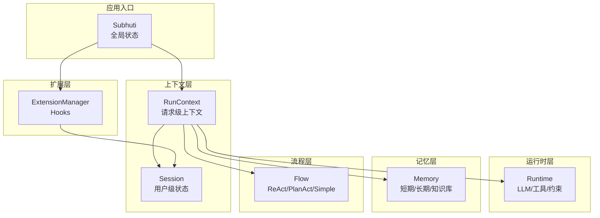
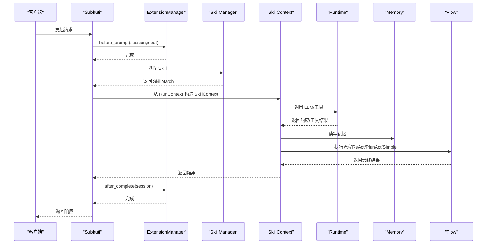
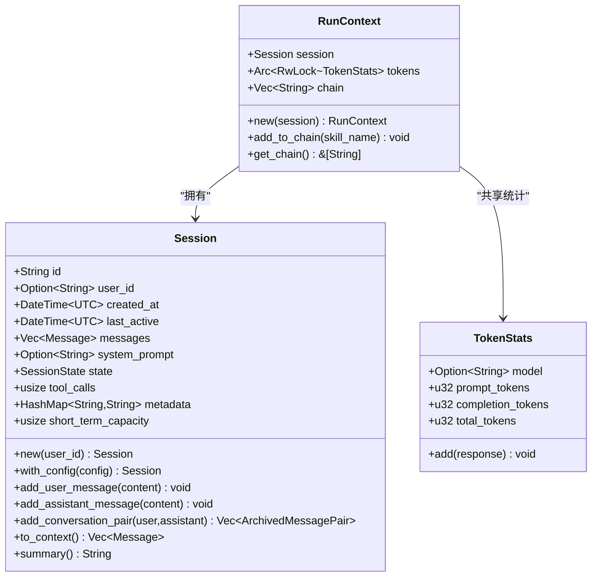
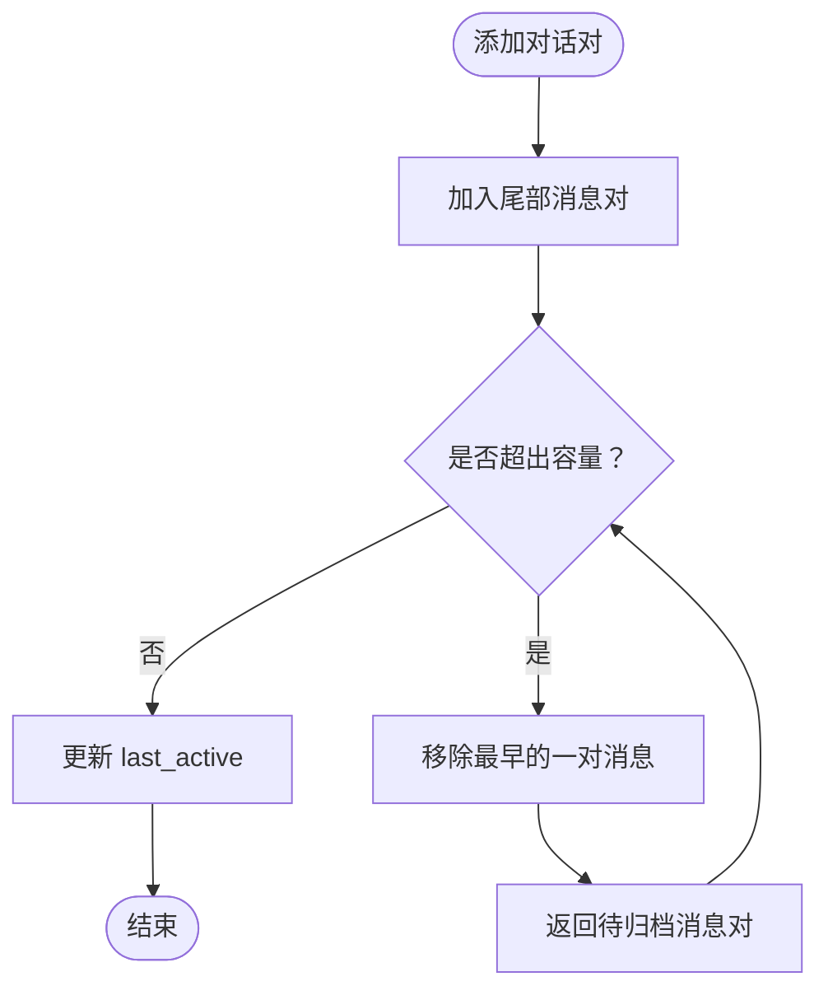
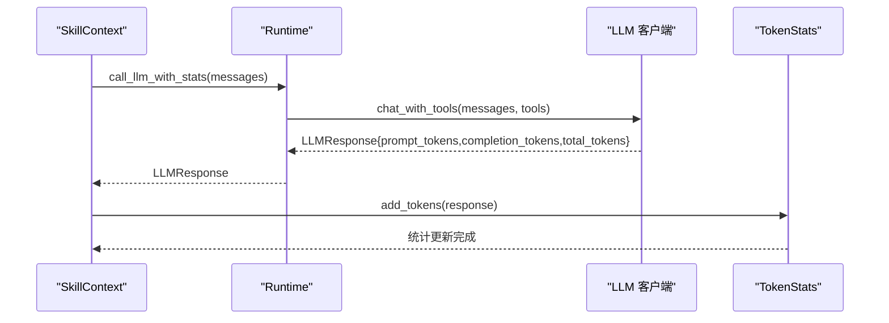
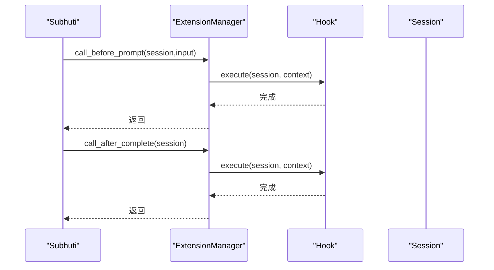
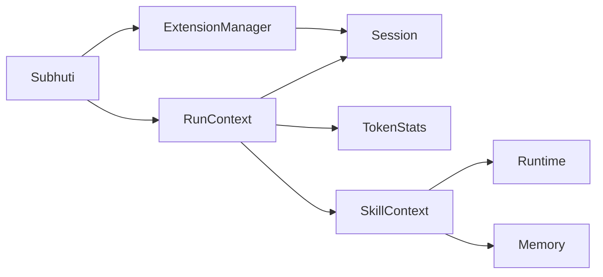

# 上下文管理系统

<cite>
**本文引用的文件**
- [context.rs](file://crates/subhuti/src/context.rs)
- [session.rs](file://crates/subhuti/src/runtime/session.rs)
- [lib.rs](file://crates/subhuti/src/lib.rs)
- [runtime/mod.rs](file://crates/subhuti/src/runtime/mod.rs)
- [runtime/llm/client.rs](file://crates/subhuti/src/runtime/llm/client.rs)
- [memory/mod.rs](file://crates/subhuti/src/memory/mod.rs)
- [skill/mod.rs](file://crates/subhuti/src/skill/mod.rs)
- [flow/mod.rs](file://crates/subhuti/src/flow/mod.rs)
- [flow/react.rs](file://crates/subhuti/src/flow/react.rs)
- [extension/mod.rs](file://crates/subhuti/src/extension/mod.rs)
- [debug.rs](file://crates/subhuti/src/debug.rs)
</cite>

## 目录
1. [简介](#简介)
2. [项目结构](#项目结构)
3. [核心组件](#核心组件)
4. [架构总览](#架构总览)
5. [详细组件分析](#详细组件分析)
6. [依赖关系分析](#依赖关系分析)
7. [性能考量](#性能考量)
8. [故障排查指南](#故障排查指南)
9. [结论](#结论)
10. [附录](#附录)

## 简介
本文件面向“上下文管理系统”的运行时设计，聚焦于 RunContext 与 Session 的设计模式与生命周期管理。Session 负责用户级别的状态持久化（用户标识、会话历史、技能使用统计等），RunContext 处理请求级别的临时状态（调用链追踪、Token 统计、中间结果缓存等）。文档阐述四层架构中的上下文传递机制、状态隔离策略、并发安全保证与内存管理优化，并解释上下文如何支持流式输出、错误恢复与性能监控。最后提供上下文流转图、状态机图与最佳实践指南，帮助开发者实现稳定可靠的上下文管理方案。

## 项目结构
本项目采用四层架构：
- Memory Layer：记忆存储与检索（短期/长期/知识库）
- Runtime Layer：LLM 抽象、工具系统、约束护栏
- Flow Layer：ReAct 智能闭环（Plan→Act→Observe→Reflect）
- Extension Layer：Hook/中间件扩展

上下文系统位于统一的 context 层，RunContext 作为请求级上下文，Session 作为用户级状态容器，二者协同工作贯穿整个执行流程。

图表来源
- [lib.rs:84-107](file://crates/subhuti/src/lib.rs#L84-L107)
- [context.rs:58-86](file://crates/subhuti/src/context.rs#L58-L86)
- [runtime/mod.rs:57-62](file://crates/subhuti/src/runtime/mod.rs#L57-L62)
- [memory/mod.rs:164-173](file://crates/subhuti/src/memory/mod.rs#L164-L173)
- [flow/mod.rs:1-20](file://crates/subhuti/src/flow/mod.rs#L1-L20)
- [extension/mod.rs:112-116](file://crates/subhuti/src/extension/mod.rs#L112-L116)

章节来源
- [lib.rs:5-33](file://crates/subhuti/src/lib.rs#L5-L33)

## 核心组件
- RunContext：请求级上下文，包含 Session、Token 统计、调用链等，生命周期与单次请求绑定，避免全局污染。
- Session：用户级状态容器，负责消息历史、状态机、工具调用计数、元数据等，支持滑动窗口与自动归档。
- TokenStats：Token 使用统计，聚合 prompt/completion/total token，支持并发累加。
- SkillContext：从 RunContext 派生的技能执行上下文，桥接全局资源与请求级资源。
- ExtensionManager：扩展钩子管理，提供 before_prompt/before_tool/after_tool/after_complete 生命周期钩子。

章节来源
- [context.rs:18-86](file://crates/subhuti/src/context.rs#L18-L86)
- [session.rs:16-315](file://crates/subhuti/src/runtime/session.rs#L16-L315)
- [skill/mod.rs:115-184](file://crates/subhuti/src/skill/mod.rs#L115-L184)
- [extension/mod.rs:112-227](file://crates/subhuti/src/extension/mod.rs#L112-L227)

## 架构总览
上下文在四层架构中的传递遵循“全局共享、请求隔离”的原则：
- 全局资源（runtime、memory）通过 Arc 共享，只读访问，避免重复初始化与状态污染。
- 请求级资源（session、tokens、chain）在 RunContext 中创建，随请求生命周期结束而销毁。
- 扩展层通过 Hook 在关键节点介入，实现日志、过滤、统计等横切关注点。

图表来源
- [lib.rs:655-760](file://crates/subhuti/src/lib.rs#L655-L760)
- [skill/mod.rs:154-179](file://crates/subhuti/src/skill/mod.rs#L154-L179)
- [extension/mod.rs:174-206](file://crates/subhuti/src/extension/mod.rs#L174-L206)
- [flow/react.rs:107-196](file://crates/subhuti/src/flow/react.rs#L107-L196)

## 详细组件分析

### RunContext 设计与生命周期
- 设计理念：参考 HTTP 框架的 State + Extensions 模式，全局资源只读共享，请求级资源可变且与请求绑定。
- 成员：
  - session：用户级状态容器
  - tokens：Arc<RwLock<TokenStats>>，跨调用共享统计
  - chain：Vec<String>，记录本次请求的技能调用链
- 生命周期：
  - 创建：Subhuti::create_run_context(Session::new(...))
  - 使用：run_with_run_context(...) 中传递给 SkillContext
  - 销毁：请求结束，RunContext 随之销毁，Session 被回写到调用方

图表来源
- [context.rs:58-86](file://crates/subhuti/src/context.rs#L58-L86)
- [context.rs:18-49](file://crates/subhuti/src/context.rs#L18-L49)
- [session.rs:68-308](file://crates/subhuti/src/runtime/session.rs#L68-L308)

章节来源
- [context.rs:58-86](file://crates/subhuti/src/context.rs#L58-L86)
- [lib.rs:744-747](file://crates/subhuti/src/lib.rs#L744-L747)

### Session 设计与滑动窗口机制
- 滑动窗口：短期消息限制在 capacity*2 条（每对 2 条消息），超出则从头部移除并返回待归档的消息对。
- 自动归档：当短期记忆超限时，被挤出的对话对自动归档到长期记忆。
- 状态机：Idle/Thinking/Acting/Completed/Error，便于可观测性与流程控制。
- 工具调用计数：increment_tool_calls/reset_tool_calls，配合 Flow 层使用。

图表来源
- [session.rs:157-198](file://crates/subhuti/src/runtime/session.rs#L157-L198)

章节来源
- [session.rs:68-308](file://crates/subhuti/src/runtime/session.rs#L68-L308)

### Token 统计与并发安全
- TokenStats：聚合模型名与三类 token，add(response) 原子累加。
- RunContext/SkillContext：通过 Arc<RwLock<TokenStats>> 共享统计，避免竞态。
- LLM 客户端：OpenAI/Ollama/Doubao 支持返回 token 统计，SkillContext 自动累加。

图表来源
- [skill/mod.rs:186-190](file://crates/subhuti/src/skill/mod.rs#L186-L190)
- [runtime/llm/client.rs:161-216](file://crates/subhuti/src/runtime/llm/client.rs#L161-L216)

章节来源
- [context.rs:18-49](file://crates/subhuti/src/context.rs#L18-L49)
- [skill/mod.rs:186-190](file://crates/subhuti/src/skill/mod.rs#L186-L190)
- [runtime/llm/client.rs:161-216](file://crates/subhuti/src/runtime/llm/client.rs#L161-L216)

### 扩展钩子与上下文传递
- 生命周期钩子：before_prompt/before_tool/after_tool/after_complete
- 通过 ExtensionManager 注册与执行，支持日志、敏感词过滤、Token 统计等横切能力。
- 钩子上下文 HookContext：携带输入、工具名/参数/结果、额外数据。

图表来源
- [extension/mod.rs:174-206](file://crates/subhuti/src/extension/mod.rs#L174-L206)

章节来源
- [extension/mod.rs:112-227](file://crates/subhuti/src/extension/mod.rs#L112-L227)

### 流式输出与错误恢复
- 流式输出：Runtime::call_llm_streaming 支持回调增量输出，SkillContext::call_llm_streaming 直接透传。
- 错误恢复：ReAct 流程在工具调用参数为空时回退为纯文本回复；Flow 层收敛阈值防止无限循环。
- 记忆归档：短期记忆超限时自动归档，避免上下文膨胀。

章节来源
- [runtime/mod.rs:176-195](file://crates/subhuti/src/runtime/mod.rs#L176-L195)
- [flow/react.rs:122-196](file://crates/subhuti/src/flow/react.rs#L122-L196)
- [memory/mod.rs:319-368](file://crates/subhuti/src/memory/mod.rs#L319-L368)

## 依赖关系分析
- RunContext 依赖 Session、TokenStats、Arc/RwLock
- SkillContext 从 RunContext 派生，依赖 Runtime/Memory
- Subhuti 作为全局入口，创建 RunContext 并驱动执行
- ExtensionManager 与 Subhuti 解耦，通过钩子介入

图表来源
- [lib.rs:744-747](file://crates/subhuti/src/lib.rs#L744-L747)
- [context.rs:58-86](file://crates/subhuti/src/context.rs#L58-L86)
- [skill/mod.rs:154-179](file://crates/subhuti/src/skill/mod.rs#L154-L179)

章节来源
- [lib.rs:84-107](file://crates/subhuti/src/lib.rs#L84-L107)
- [runtime/mod.rs:57-62](file://crates/subhuti/src/runtime/mod.rs#L57-L62)

## 性能考量
- 并发安全：TokenStats 使用 Arc<RwLock>，减少锁竞争；扩展钩子执行时释放锁后迭代，避免长时间持锁。
- 内存管理：Session 滑动窗口限制短期消息；短期记忆超限时异步归档至长期记忆与数据库，降低内存占用。
- 统计与监控：内置 TokenCountHook 与 Profiler，支持运行时性能分析与健康检查。
- 流式输出：Runtime 支持增量回调，减少等待时间，提升用户体验。

章节来源
- [context.rs:60-64](file://crates/subhuti/src/context.rs#L60-L64)
- [session.rs:157-198](file://crates/subhuti/src/runtime/session.rs#L157-L198)
- [memory/mod.rs:319-368](file://crates/subhuti/src/memory/mod.rs#L319-L368)
- [extension/mod.rs:322-368](file://crates/subhuti/src/extension/mod.rs#L322-L368)
- [debug.rs:298-350](file://crates/subhuti/src/debug.rs#L298-L350)

## 故障排查指南
- 敏感词过滤：通过 SensitiveWordFilterHook 在 before_prompt 阶段拦截，若命中则直接返回错误。
- 锁竞争检测：LockDetector 记录锁持有位置，辅助定位死锁或长时间持锁问题。
- 健康检查：Subhuti::health_check 汇总 Memory、Database、SoulLayer、ExpertPlugins、Skills 等组件状态。
- 调试工具：diagnose!/assert_that!/time_it! 等宏与函数，便于开发调试与性能分析。

章节来源
- [extension/mod.rs:287-320](file://crates/subhuti/src/extension/mod.rs#L287-L320)
- [debug.rs:352-383](file://crates/subhuti/src/debug.rs#L352-L383)
- [lib.rs:573-647](file://crates/subhuti/src/lib.rs#L573-L647)

## 结论
上下文管理系统通过 RunContext 与 Session 的清晰分离，实现了用户级状态持久化与请求级状态隔离。借助扩展钩子与流程层，系统具备良好的可插拔性与可观测性。滑动窗口与自动归档机制保障了内存与性能的稳定性；并发安全与流式输出提升了可靠性与用户体验。结合内置调试与健康检查工具，开发者可以快速定位问题并持续优化系统表现。

## 附录
- 最佳实践
  - 将全局只读资源（runtime、memory）通过 Arc 共享，避免重复初始化
  - 请求级状态（session、tokens、chain）放入 RunContext，避免跨请求污染
  - 使用扩展钩子实现横切关注点（日志、过滤、统计），保持核心逻辑简洁
  - 合理设置 Session 容量与归档阈值，平衡上下文质量与性能
  - 在工具调用前后使用钩子进行审计与缓存，提升可维护性
  - 使用 Profiler 与 HealthReport 持续监控系统健康状况