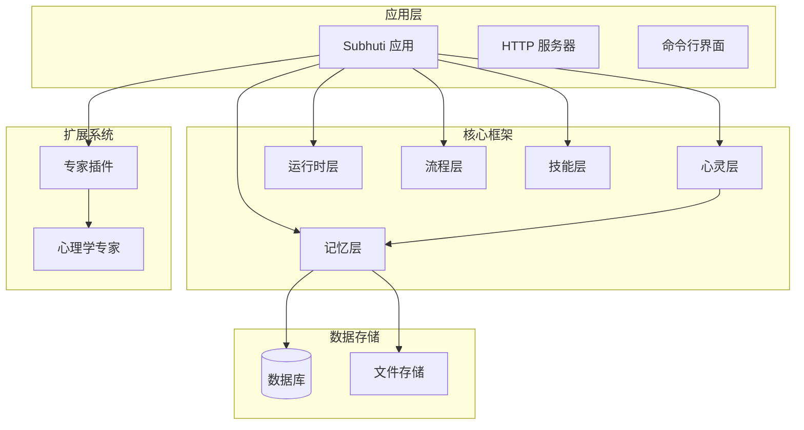
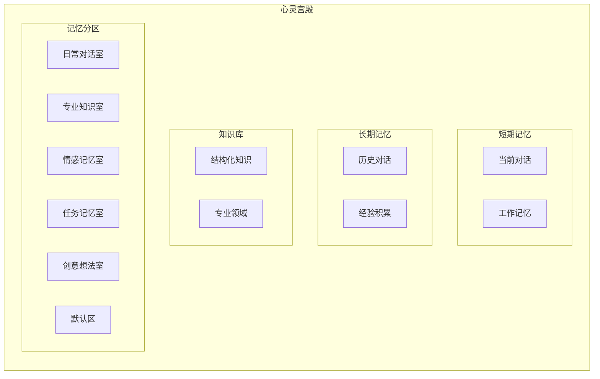
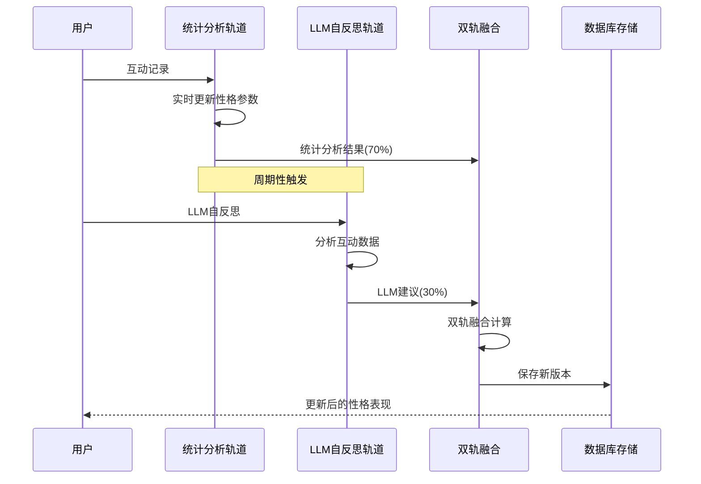
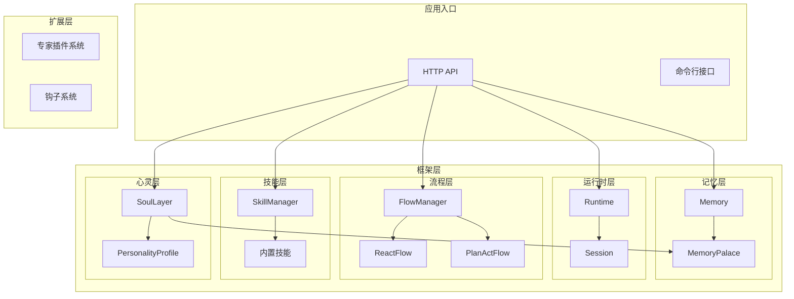
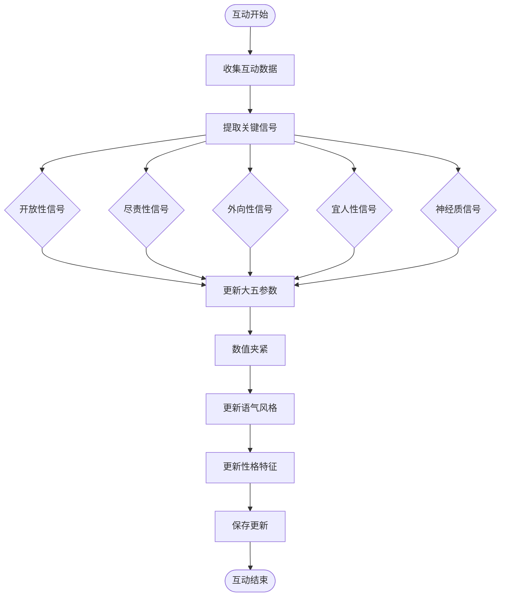
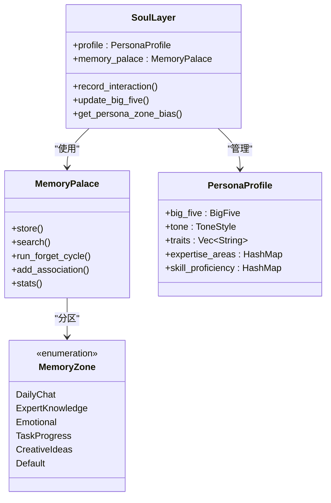
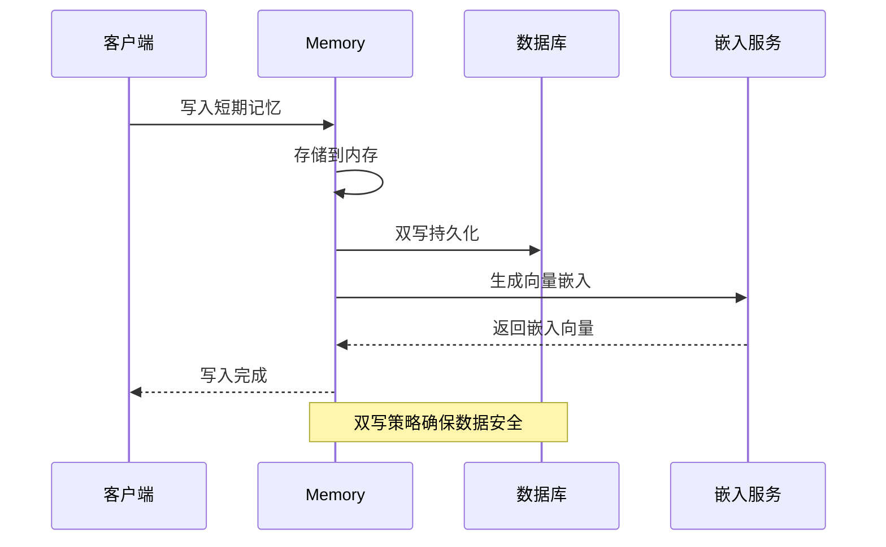
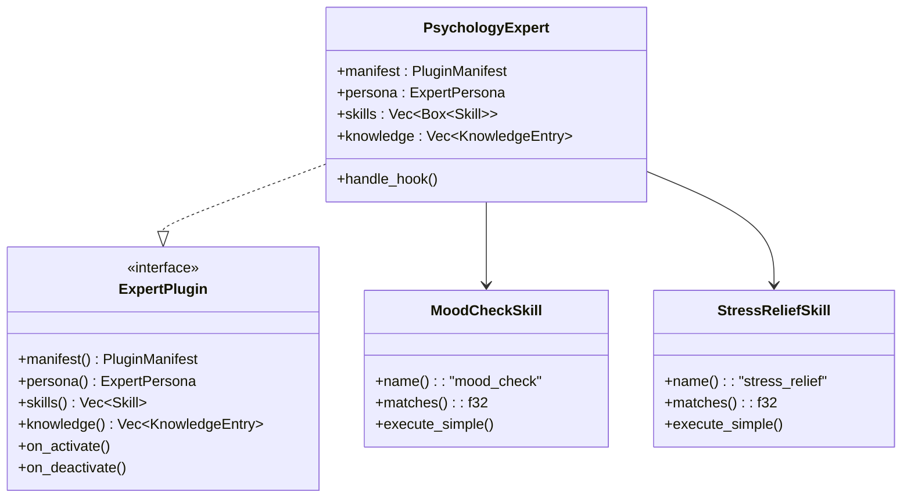
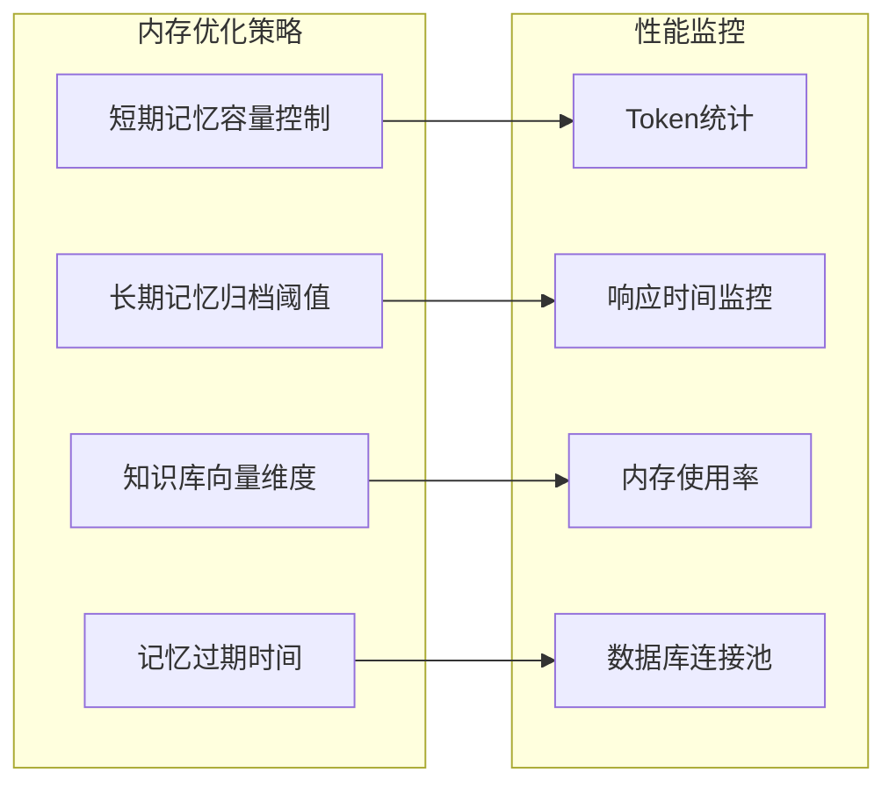

# 动态人格系统

<cite>
**本文档引用的文件**
- [lib.rs](file://crates/subhuti/src/lib.rs)
- [mod.rs](file://crates/subhuti/src/soul/mod.rs)
- [palace.rs](file://crates/subhuti/src/soul/palace.rs)
- [mod.rs](file://crates/subhuti/src/memory/mod.rs)
- [mod.rs](file://crates/subhuti/src/skill/mod.rs)
- [mod.rs](file://crates/subhuti/src/runtime/mod.rs)
- [mod.rs](file://crates/subhuti/src/flow/mod.rs)
- [lib.rs](file://crates/subhuti-expert-psychology/src/lib.rs)
- [persona.json](file://data/persona.json)
- [Cargo.toml](file://Cargo.toml)
</cite>

## 目录
1. [简介](#简介)
2. [项目结构](#项目结构)
3. [核心组件](#核心组件)
4. [架构概览](#架构概览)
5. [详细组件分析](#详细组件分析)
6. [依赖关系分析](#依赖关系分析)
7. [性能考虑](#性能考虑)
8. [故障排除指南](#故障排除指南)
9. [结论](#结论)
10. [附录](#附录)

## 简介

动态人格系统是一个基于大五人格模型（Big Five）的心理学驱动的AI代理系统。该系统通过"心灵宫殿"（Memory Palace）与人格系统的深度融合，实现了记忆与心灵的统一体，支持动态性格演化和个性化AI助手构建。

系统的核心创新在于双轨驱动架构：统计分析轨道（实时、轻量）与LLM自反思轨道（周期性、深度）的融合，确保了性格演化的稳定性和适应性。

## 项目结构

项目采用模块化设计，主要包含以下核心模块：



**图表来源**
- [lib.rs:1-100](file://crates/subhuti/src/lib.rs#L1-L100)
- [Cargo.toml:1-58](file://Cargo.toml#L1-L58)

**章节来源**
- [lib.rs:1-100](file://crates/subhuti/src/lib.rs#L1-L100)
- [Cargo.toml:1-58](file://Cargo.toml#L1-L58)

## 核心组件

### 大五人格模型

系统基于经典的大五人格模型，包含以下五个维度：

| 维度 | 英文名称 | 描述 | 数值范围 |
|------|----------|------|----------|
| 开放性 | Openness | 好奇心、创造力、接受新体验 | 0.0-1.0 |
| 尽责性 | Conscientiousness | 严谨性、自律性、目标导向 | 0.0-1.0 |
| 外向性 | Extraversion | 社交性、活力、寻求刺激 | 0.0-1.0 |
| 宜人性 | Agreeableness | 合作性、同情心、信任 | 0.0-1.0 |
| 神经质 | Neuroticism | 情绪稳定性、焦虑倾向 | 0.0-1.0 |

### 心灵宫殿架构

心灵宫殿是记忆与心灵的统一体，包含三层记忆结构：



**图表来源**
- [palace.rs:10-52](file://crates/subhuti/src/soul/palace.rs#L10-L52)

**章节来源**
- [palace.rs:1-873](file://crates/subhuti/src/soul/palace.rs#L1-L873)

### 双轨驱动演化机制

系统采用双轨融合的演化机制：



**图表来源**
- [mod.rs:1090-1136](file://crates/subhuti/src/soul/mod.rs#L1090-L1136)
- [lib.rs:407-508](file://crates/subhuti/src/lib.rs#L407-L508)

**章节来源**
- [mod.rs:938-1189](file://crates/subhuti/src/soul/mod.rs#L938-L1189)
- [lib.rs:407-508](file://crates/subhuti/src/lib.rs#L407-L508)

## 架构概览

系统采用四层架构设计，每层都有明确的职责分工：



**图表来源**
- [lib.rs:22-46](file://crates/subhuti/src/lib.rs#L22-L46)
- [mod.rs:163-173](file://crates/subhuti/src/memory/mod.rs#L163-L173)

**章节来源**
- [lib.rs:84-156](file://crates/subhuti/src/lib.rs#L84-L156)
- [mod.rs:1-496](file://crates/subhuti/src/memory/mod.rs#L1-L496)

## 详细组件分析

### 心灵层（SoulLayer）

心灵层是系统的核心，负责动态性格的生成和演化：

#### 性格参数更新机制



**图表来源**
- [mod.rs:801-879](file://crates/subhuti/src/soul/mod.rs#L801-L879)

#### 记忆宫殿集成

心灵层与记忆宫殿深度集成，实现"记忆塑造性格，性格影响记忆"的双向反馈：



**图表来源**
- [mod.rs:330-349](file://crates/subhuti/src/soul/mod.rs#L330-L349)
- [palace.rs:34-52](file://crates/subhuti/src/soul/palace.rs#L34-L52)

**章节来源**
- [mod.rs:295-445](file://crates/subhuti/src/soul/mod.rs#L295-L445)
- [palace.rs:226-445](file://crates/subhuti/src/soul/palace.rs#L226-L445)

### 记忆层（MemoryLayer）

记忆层提供完整的记忆管理功能，支持三层记忆结构：

#### 记忆存储机制



**图表来源**
- [mod.rs:260-318](file://crates/subhuti/src/memory/mod.rs#L260-L318)

#### 记忆检索算法

记忆检索采用多因子评分机制：

1. **内容匹配度**：基于关键词匹配和全文搜索
2. **记忆强度**：反映记忆的新鲜度和重要性
3. **人格偏见**：根据当前性格偏好调整权重
4. **联想增强**：激活相关记忆提升检索效果

**章节来源**
- [mod.rs:163-444](file://crates/subhuti/src/memory/mod.rs#L163-L444)
- [palace.rs:421-566](file://crates/subhuti/src/soul/palace.rs#L421-L566)

### 技能层（SkillLayer）

技能层采用纯代码实现，支持预设流程模板：

#### 技能匹配机制

```mermaid
flowchart LR
Input[用户输入] --> KeywordIndex[关键词索引]
KeywordIndex --> Candidate[Candidates]
Candidate --> Precision[精确匹配度计算]
Precision --> Threshold{超过阈值?}
Threshold --> |是| Skill[匹配技能]
Threshold --> |否| Default[默认聊天技能]
subgraph "关键词索引优化"
KeywordIndex --> Build[构建倒排索引]
Build --> Fast[O(k)快速筛选]
end
```

**图表来源**
- [mod.rs:604-653](file://crates/subhuti/src/skill/mod.rs#L604-L653)

**章节来源**
- [mod.rs:451-790](file://crates/subhuti/src/skill/mod.rs#L451-L790)

### 专家插件系统

系统支持领域专家插件扩展，提供专业化能力：

#### 心理咨询专家示例



**图表来源**
- [lib.rs:39-193](file://crates/subhuti-expert-psychology/src/lib.rs#L39-L193)

**章节来源**
- [lib.rs:1-348](file://crates/subhuti-expert-psychology/src/lib.rs#L1-L348)

## 依赖关系分析

系统采用松耦合设计，各模块间依赖关系清晰：

```mermaid
graph TB
subgraph "核心依赖"
subhuti_core[subhuti = { path = "crates/subhuti" }]
psychology_core[subhuti-expert-psychology = { path = "crates/subhuti-expert-psychology" }]
end
subgraph "外部依赖"
tokio[tokio = "1"]
serde[serde = "1"]
anyhow[anyhow = "1"]
chrono[chrono = "0.4"]
async_trait[async-trait = "0.1"]
end
subgraph "Web框架"
axum[axum = "0.7"]
tower[tower = "0.4"]
reqwest[reqwest = "0.12"]
end
subgraph "工具库"
futures[futures = "0.3"]
dotenvy[dotenvy = "0.15"]
uuid[uuid = "1"]
async_stream[async-stream = "0.3"]
end
subhuti_core --> tokio
subhuti_core --> serde
subhuti_core --> anyhow
subhuti_core --> chrono
subhuti_core --> async_trait
psychology_core --> subhuti_core
psychology_core --> serde
axum --> tokio
axum --> tower
reqwest --> tokio
```

**图表来源**
- [Cargo.toml:25-58](file://Cargo.toml#L25-L58)

**章节来源**
- [Cargo.toml:1-58](file://Cargo.toml#L1-L58)

## 性能考虑

### 记忆检索优化

系统采用多种优化策略提升性能：

1. **关键词索引**：使用倒排索引加速技能匹配
2. **缓存机制**：短期记忆驻留内存，避免频繁磁盘IO
3. **批量处理**：记忆写入采用异步批量处理
4. **向量化搜索**：利用嵌入服务实现高效的语义检索

### 内存管理



**图表来源**
- [mod.rs:30-52](file://crates/subhuti/src/memory/mod.rs#L30-L52)

## 故障排除指南

### 常见问题及解决方案

#### 记忆存储异常

**问题**：记忆无法持久化到数据库
**解决方案**：
1. 检查数据库连接配置
2. 验证表结构完整性
3. 查看日志中的具体错误信息

#### 演化失败

**问题**：性格演化过程中出现异常
**解决方案**：
1. 检查LLM API配置和可用性
2. 验证JSON解析逻辑
3. 查看演化历史记录

#### 性能问题

**问题**：系统响应缓慢
**解决方案**：
1. 调整记忆容量配置
2. 优化关键词索引
3. 检查嵌入服务性能

**章节来源**
- [mod.rs:1233-1236](file://crates/subhuti/src/soul/mod.rs#L1233-L1236)
- [mod.rs:260-318](file://crates/subhuti/src/memory/mod.rs#L260-L318)

## 结论

动态人格系统通过将心理学理论与现代AI技术相结合，创造了一个具有真实个性特征的AI代理。系统的核心优势包括：

1. **科学基础**：基于大五人格模型的理论支撑
2. **双向反馈**：记忆塑造性格，性格影响记忆的循环机制
3. **双轨融合**：统计分析与LLM反思的平衡演化
4. **模块化设计**：清晰的职责分离和扩展能力
5. **性能优化**：多层优化策略确保系统高效运行

该系统为构建个性化AI助手提供了完整的框架，开发者可以根据具体需求定制不同的人格特征和行为模式。

## 附录

### 配置示例

#### 基础配置
```toml
[dependencies]
subhuti = { path = "crates/subhuti" }
subhuti-expert-psychology = { path = "crates/subhuti-expert-psychology" }
tokio = { version = "1", features = ["full"] }
tracing = "0.1"
```

#### 心灵层配置参数

| 参数 | 默认值 | 说明 |
|------|--------|------|
| evolve_threshold | 20 | 演化触发阈值（互动次数） |
| proficiency_alpha | 0.15 | 技能熟练度学习率 |
| domain_learning_rate | 0.1 | 领域权重学习率 |
| trait_learning_rate | 0.03 | 性格参数学习率 |
| max_change_per_evolve | 0.2 | 每次演化最大变化幅度 |
| stat_weight | 0.7 | 统计分析权重 |
| llm_weight | 0.3 | LLM反思权重 |

### 实际应用场景

1. **客户服务机器人**：根据客户偏好调整回应风格
2. **教育辅导系统**：根据学习者特点调整教学方式
3. **心理健康助手**：提供个性化心理支持和建议
4. **创意写作伙伴**：根据作者风格调整创作建议
5. **企业AI助手**：适应不同企业文化氛围

**章节来源**
- [mod.rs:297-328](file://crates/subhuti/src/soul/mod.rs#L297-L328)
- [lib.rs:54-82](file://crates/subhuti/src/lib.rs#L54-L82)