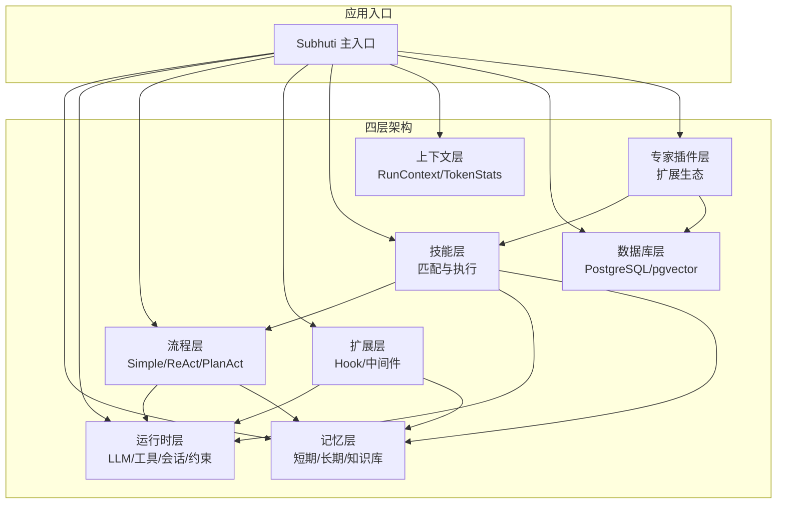
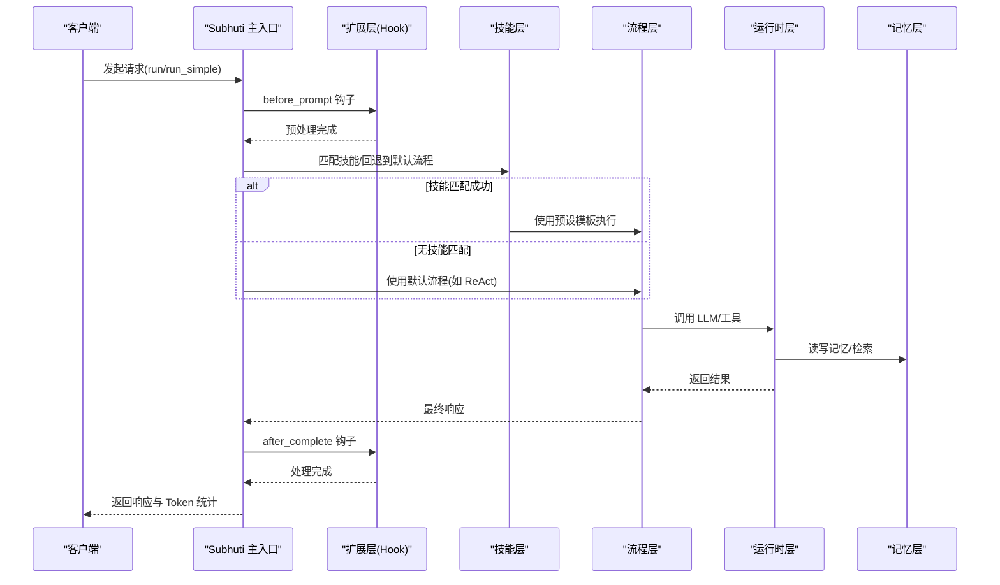
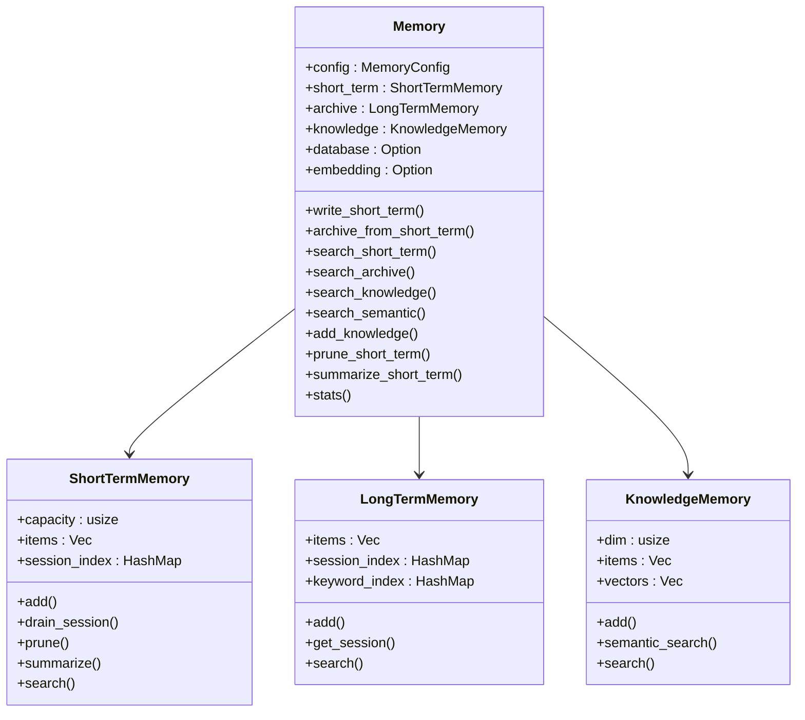
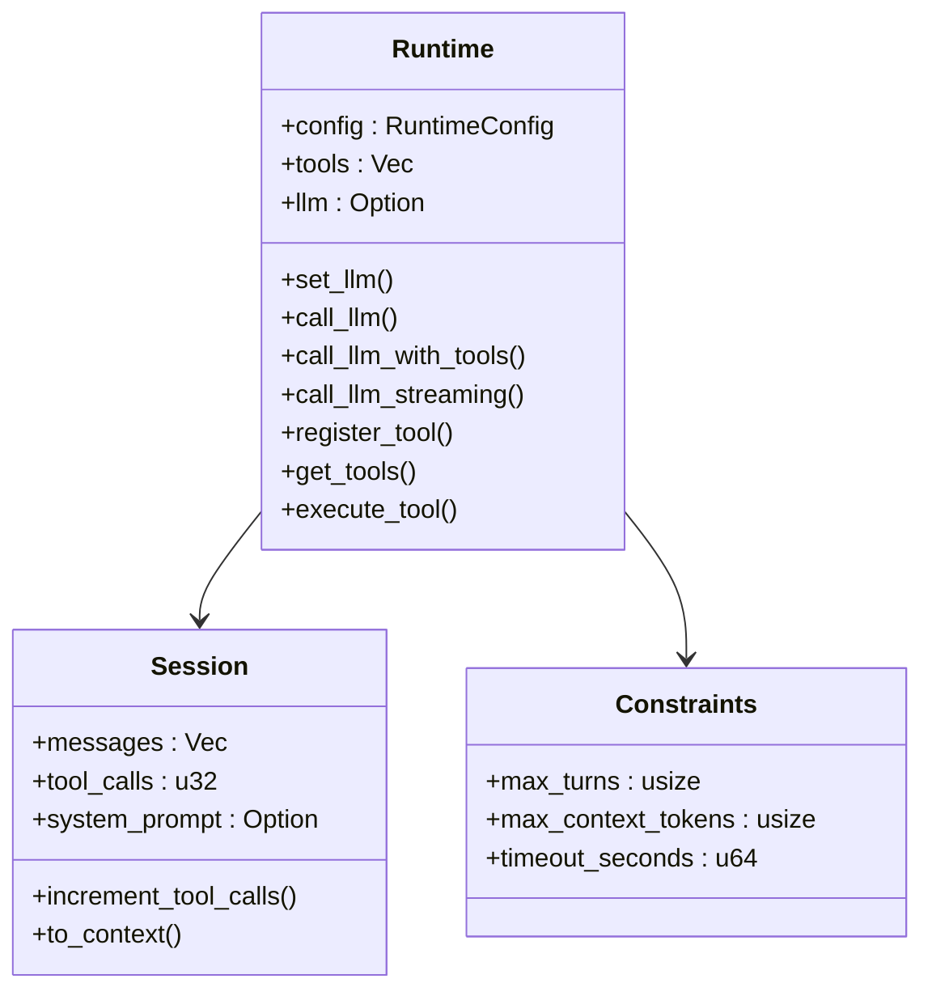
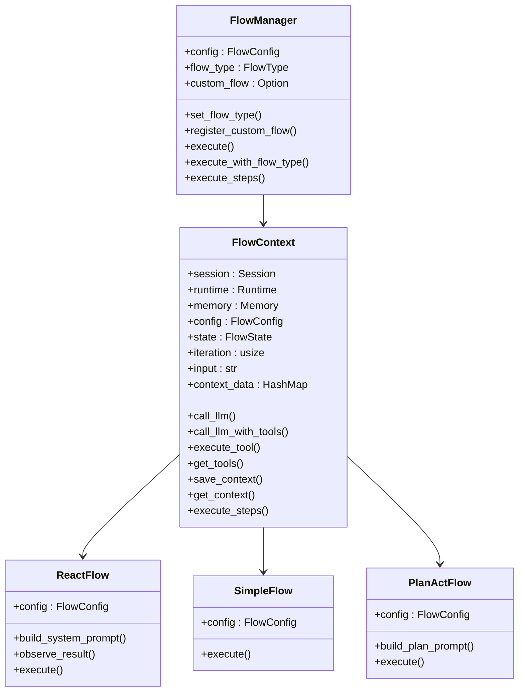
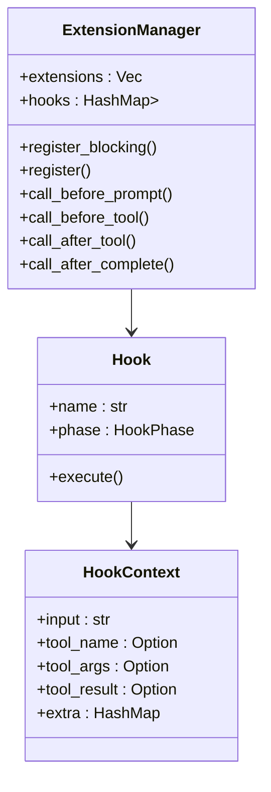
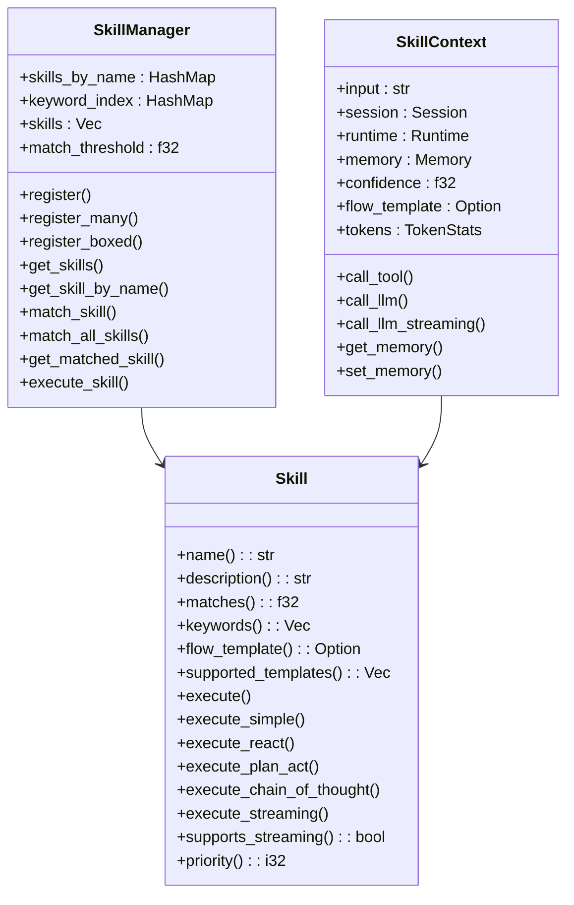
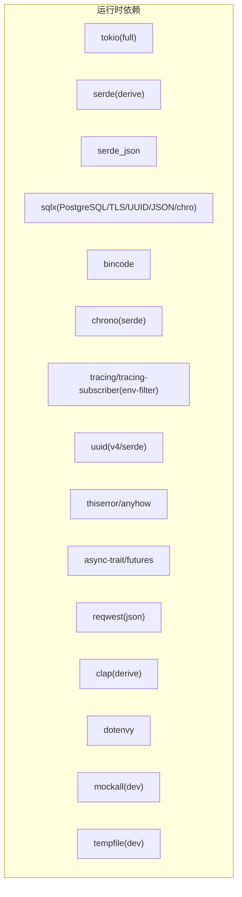

# 四层架构设计

<cite>
**本文档引用的文件**
- [lib.rs](file://crates/subhuti/src/lib.rs)
- [Cargo.toml](file://crates/subhuti/Cargo.toml)
- [memory/mod.rs](file://crates/subhuti/src/memory/mod.rs)
- [memory/short_term.rs](file://crates/subhuti/src/memory/short_term.rs)
- [memory/long_term.rs](file://crates/subhuti/src/memory/long_term.rs)
- [memory/knowledge.rs](file://crates/subhuti/src/memory/knowledge.rs)
- [runtime/mod.rs](file://crates/subhuti/src/runtime/mod.rs)
- [flow/mod.rs](file://crates/subhuti/src/flow/mod.rs)
- [flow/react.rs](file://crates/subhuti/src/flow/react.rs)
- [flow/simple.rs](file://crates/subhuti/src/flow/simple.rs)
- [flow/plan_act.rs](file://crates/subhuti/src/flow/plan_act.rs)
- [extension/mod.rs](file://crates/subhuti/src/extension/mod.rs)
- [skill/mod.rs](file://crates/subhuti/src/skill/mod.rs)
- [context.rs](file://crates/subhuti/src/context.rs)
- [db/mod.rs](file://crates/subhuti/src/db/mod.rs)
- [expert/mod.rs](file://crates/subhuti/src/expert/mod.rs)
</cite>

## 目录
1. [简介](#简介)
2. [项目结构](#项目结构)
3. [核心组件](#核心组件)
4. [架构总览](#架构总览)
5. [详细组件分析](#详细组件分析)
6. [依赖分析](#依赖分析)
7. [性能考虑](#性能考虑)
8. [故障排除指南](#故障排除指南)
9. [结论](#结论)

## 简介
Subhuti 框架采用四层架构设计，围绕“薄封装、无魔法、无全局状态”的理念，构建极简轻量的 AI Agent 框架。四层分别为：
- **记忆层（Memory Layer）**：统一管理短期记忆、长期记忆与知识库，支持文本与向量检索、持久化与嵌入服务。
- **运行时层（Runtime Layer）**：抽象 LLM 与工具系统，提供约束护栏、会话管理与流式输出。
- **流程层（Flow Layer）**：实现 ReAct 智能闭环（Plan→Act→Observe→Reflect），支持多种流程策略与自定义流程模板。
- **扩展层（Extension Layer）**：提供 Hook/中间件扩展机制，贯穿请求生命周期，实现日志、过滤、统计等横切能力。

该设计强调职责边界清晰、组件交互明确、数据流向可控，并通过统一上下文与分层设计，使框架既可扩展又易于维护。

## 项目结构
框架采用模块化组织，核心模块位于 crates/subhuti/src 下，按层划分：
- memory：短期/长期/知识库与嵌入服务
- runtime：LLM 抽象、工具系统、会话与约束
- flow：流程策略（Simple/ReAct/PlanAct）与流程模板
- extension：Hook 生命周期与扩展管理
- skill：技能系统与匹配机制
- context：请求级上下文与 Token 统计
- db：PostgreSQL 集成与向量索引
- expert：专家插件系统（扩展层能力）

图表来源
- [lib.rs:22-46](file://crates/subhuti/src/lib.rs#L22-L46)
- [memory/mod.rs:1-20](file://crates/subhuti/src/memory/mod.rs#L1-L20)
- [runtime/mod.rs:1-25](file://crates/subhuti/src/runtime/mod.rs#L1-L25)
- [flow/mod.rs:1-20](file://crates/subhuti/src/flow/mod.rs#L1-L20)
- [extension/mod.rs:1-20](file://crates/subhuti/src/extension/mod.rs#L1-L20)
- [skill/mod.rs:1-20](file://crates/subhuti/src/skill/mod.rs#L1-L20)
- [context.rs:1-20](file://crates/subhuti/src/context.rs#L1-L20)
- [db/mod.rs:1-20](file://crates/subhuti/src/db/mod.rs#L1-L20)
- [expert/mod.rs:1-20](file://crates/subhuti/src/expert/mod.rs#L1-L20)

章节来源
- [lib.rs:1-82](file://crates/subhuti/src/lib.rs#L1-L82)
- [Cargo.toml:1-63](file://crates/subhuti/Cargo.toml#L1-L63)

## 核心组件
- Subhuti 主入口：聚合四层能力，提供统一运行接口与扩展管理。
- Memory：三层记忆统一管理，支持文本检索与向量检索，可选嵌入服务与数据库持久化。
- Runtime：LLM 客户端抽象、工具注册与执行、约束配置与流式输出。
- Flow：流程策略管理，支持 Simple/ReAct/PlanAct，以及自定义流程模板。
- Extension：Hook 生命周期管理，贯穿请求前后与工具调用前后。
- Skill：技能匹配与执行，支持预设流程模板与完全自定义。
- Context：请求级上下文，包含会话、Token 统计与调用链。
- DB：PostgreSQL 集成，支持向量索引与表结构迁移。
- Expert：专家插件系统，提供清单、权限、沙箱与钩子链。

章节来源
- [lib.rs:84-156](file://crates/subhuti/src/lib.rs#L84-L156)
- [memory/mod.rs:163-214](file://crates/subhuti/src/memory/mod.rs#L163-L214)
- [runtime/mod.rs:57-87](file://crates/subhuti/src/runtime/mod.rs#L57-L87)
- [flow/mod.rs:677-722](file://crates/subhuti/src/flow/mod.rs#L677-L722)
- [extension/mod.rs:112-132](file://crates/subhuti/src/extension/mod.rs#L112-L132)
- [skill/mod.rs:451-491](file://crates/subhuti/src/skill/mod.rs#L451-L491)
- [context.rs:51-86](file://crates/subhuti/src/context.rs#L51-L86)
- [db/mod.rs:44-63](file://crates/subhuti/src/db/mod.rs#L44-L63)
- [expert/mod.rs:661-760](file://crates/subhuti/src/expert/mod.rs#L661-L760)

## 架构总览
四层架构通过清晰的职责边界与数据流向协作：
- 记忆层提供统一的数据存储与检索，支撑短期对话、长期沉淀与知识库语义检索。
- 运行时层抽象 LLM 与工具，提供约束护栏与会话状态，保证执行可控。
- 流程层实现 ReAct 智能闭环，结合工具调用与反思收敛，提升决策质量。
- 扩展层以 Hook 机制贯穿请求生命周期，实现日志、过滤、统计等横切关注点。

图表来源
- [lib.rs:655-742](file://crates/subhuti/src/lib.rs#L655-L742)
- [extension/mod.rs:174-206](file://crates/subhuti/src/extension/mod.rs#L174-L206)
- [skill/mod.rs:791-800](file://crates/subhuti/src/skill/mod.rs#L791-L800)
- [flow/mod.rs:729-771](file://crates/subhuti/src/flow/mod.rs#L729-L771)
- [runtime/mod.rs:146-174](file://crates/subhuti/src/runtime/mod.rs#L146-L174)
- [memory/mod.rs:370-407](file://crates/subhuti/src/memory/mod.rs#L370-L407)

## 详细组件分析

### 记忆层（Memory Layer）
- 职责边界：统一管理短期工作记忆、长期归档记忆与知识库语义记忆，提供检索、归档与持久化能力。
- 组件交互：
  - 短期记忆：基于容量限制与会话索引，支持滑动窗口与自动归档。
  - 长期记忆：关键词索引与会话索引，支持历史检索。
  - 知识库：简化向量表示与余弦相似度，支持语义检索。
  - 嵌入服务：可选，用于向量检索与数据库 pgvector 存储。
  - 数据库：可选，双写策略，支持向量索引与表结构迁移。
- 数据流向：写入短期记忆 → 检查容量阈值 → 自动归档到长期 → 可选写入数据库 → 异步生成向量。
- 设计权衡：三层记忆分离降低 LLM 上下文负担；向量检索简化实现便于演示，生产环境建议使用专业向量数据库。

图表来源
- [memory/mod.rs:163-214](file://crates/subhuti/src/memory/mod.rs#L163-L214)
- [memory/short_term.rs:10-47](file://crates/subhuti/src/memory/short_term.rs#L10-L47)
- [memory/long_term.rs:11-53](file://crates/subhuti/src/memory/long_term.rs#L11-L53)
- [memory/knowledge.rs:69-95](file://crates/subhuti/src/memory/knowledge.rs#L69-L95)

章节来源
- [memory/mod.rs:1-496](file://crates/subhuti/src/memory/mod.rs#L1-L496)
- [memory/short_term.rs:1-158](file://crates/subhuti/src/memory/short_term.rs#L1-L158)
- [memory/long_term.rs:1-129](file://crates/subhuti/src/memory/long_term.rs#L1-L129)
- [memory/knowledge.rs:1-166](file://crates/subhuti/src/memory/knowledge.rs#L1-L166)

### 运行时层（Runtime Layer）
- 职责边界：抽象 LLM 客户端与工具系统，提供会话状态管理、约束配置与流式输出。
- 组件交互：
  - LLM 抽象：支持 OpenAI/Ollama/Doubao/Custom 等提供商，统一 Chat/Tools/Streaming 接口。
  - 工具系统：注册与执行工具，暴露工具信息给 LLM。
  - 会话管理：Session 状态与消息队列，支持工具调用计数与系统提示注入。
  - 约束护栏：最大轮次、上下文长度、超时等配置。
- 数据流向：请求进入 → 会话构建上下文 → LLM 调用（可带工具）→ 工具执行（可选）→ 返回响应。
- 设计权衡：通过 Arc 共享与锁粒度控制，平衡并发与一致性；Mock LLM 便于测试。

图表来源
- [runtime/mod.rs:57-117](file://crates/subhuti/src/runtime/mod.rs#L57-L117)
- [runtime/mod.rs:146-223](file://crates/subhuti/src/runtime/mod.rs#L146-L223)

章节来源
- [runtime/mod.rs:1-277](file://crates/subhuti/src/runtime/mod.rs#L1-L277)

### 流程层（Flow Layer）
- 职责边界：实现 ReAct 智能闭环（Plan→Act→Observe→Reflect），支持多种流程策略与自定义流程模板。
- 组件交互：
  - SimpleFlow：直接调用 LLM，适合简单对话。
  - ReactFlow：ReAct 循环，自动工具调用与收敛判断。
  - PlanActFlow：先规划再执行，适合复杂任务。
  - FlowContext：共享执行上下文，包含会话、运行时、记忆、配置与状态。
  - FlowStep：流程步骤抽象，支持工具调用、知识库查询、LLM 调用、条件判断、记忆操作与并行/循环。
- 数据流向：根据流程类型构建系统提示 → LLM 生成计划/直接回答 → 工具调用（可选）→ 观察结果 → 反思收敛 → 完成。
- 设计权衡：通过状态机与迭代控制，避免无限循环；模板化步骤减少 LLM 思考成本。

图表来源
- [flow/mod.rs:677-722](file://crates/subhuti/src/flow/mod.rs#L677-L722)
- [flow/mod.rs:290-374](file://crates/subhuti/src/flow/mod.rs#L290-L374)
- [flow/react.rs:14-89](file://crates/subhuti/src/flow/react.rs#L14-L89)
- [flow/simple.rs:12-35](file://crates/subhuti/src/flow/simple.rs#L12-L35)
- [flow/plan_act.rs:17-77](file://crates/subhuti/src/flow/plan_act.rs#L17-L77)

章节来源
- [flow/mod.rs:1-800](file://crates/subhuti/src/flow/mod.rs#L1-L800)
- [flow/react.rs:1-227](file://crates/subhuti/src/flow/react.rs#L1-L227)
- [flow/simple.rs:1-72](file://crates/subhuti/src/flow/simple.rs#L1-L72)
- [flow/plan_act.rs:1-166](file://crates/subhuti/src/flow/plan_act.rs#L1-L166)

### 扩展层（Extension Layer）
- 职责边界：不侵入内核，提供 Hook 生命周期与中间件扩展，实现日志、过滤、统计等横切能力。
- 组件交互：
  - Hook 生命周期：BeforePrompt/BeforeTool/AfterTool/AfterComplete。
  - Extension：扩展能力集合，暴露关联的 Hooks。
  - ExtensionManager：注册与执行 Hook，支持同步与异步注册。
  - 内置扩展：日志 Hook、敏感词过滤 Hook、Token 统计 Hook。
- 数据流向：请求进入 → before_prompt → 执行业务 → before_tool/after_tool → after_complete。
- 设计权衡：通过阶段化 Hook 与上下文传递，实现灵活的横切逻辑注入。

图表来源
- [extension/mod.rs:112-172](file://crates/subhuti/src/extension/mod.rs#L112-L172)
- [extension/mod.rs:29-53](file://crates/subhuti/src/extension/mod.rs#L29-L53)
- [extension/mod.rs:55-100](file://crates/subhuti/src/extension/mod.rs#L55-L100)

章节来源
- [extension/mod.rs:1-438](file://crates/subhuti/src/extension/mod.rs#L1-L438)

### 技能层（Skill Layer）
- 职责边界：纯代码风格的技能系统，支持预设主流程模板与完全自定义执行。
- 组件交互：
  - Skill：匹配度计算、关键词索引、流程模板选择与执行。
  - SkillManager：名称索引、关键词倒排索引、匹配阈值与回退策略。
  - FlowTemplate：Simple/ReAct/PlanAct/ChainOfThought 模板。
  - SkillContext：封装输入、会话、运行时、记忆、Token 统计与流程模板。
- 数据流向：输入 → 关键词索引筛选 → 精确匹配度计算 → 选择模板/自定义执行 → 流程模板路由 → 返回结果。
- 设计权衡：通过模板与纯代码结合，兼顾灵活性与效率；关键词索引优化大规模匹配性能。

图表来源
- [skill/mod.rs:451-530](file://crates/subhuti/src/skill/mod.rs#L451-L530)
- [skill/mod.rs:255-390](file://crates/subhuti/src/skill/mod.rs#L255-L390)
- [skill/mod.rs:115-180](file://crates/subhuti/src/skill/mod.rs#L115-L180)

章节来源
- [skill/mod.rs:1-800](file://crates/subhuti/src/skill/mod.rs#L1-L800)

### 上下文层（Context Layer）
- 职责边界：采用 HTTP 框架类似的分层设计，区分全局状态与请求级上下文。
- 组件交互：
  - RunContext：会话、Token 统计（Arc 共享）、调用链。
  - TokenStats：累计 Prompt/Completion/Total Token 数量。
- 设计权衡：全局资源只读共享，请求级资源可变，避免“上帝对象”，职责清晰。

章节来源
- [context.rs:1-87](file://crates/subhuti/src/context.rs#L1-L87)

### 数据库层（DB Layer）
- 职责边界：PostgreSQL 集成，支持 pgvector 扩展与表结构迁移。
- 组件交互：
  - Database：连接池、表初始化、迁移、CRUD。
  - 支持 persona_profiles、persona_history、user_feedbacks、memories 等表。
  - 向量检索：基于 embedding 列与 pgvector 的余弦距离。
- 设计权衡：双写策略保障数据一致性；向量维度迁移需谨慎处理。

章节来源
- [db/mod.rs:1-688](file://crates/subhuti/src/db/mod.rs#L1-L688)

### 专家插件层（Expert Layer）
- 职责边界：完整的插件生态，包含清单、生命周期、权限、沙箱与钩子系统。
- 组件交互：
  - ExpertPlugin：清单、性格、技能、知识库与生命周期钩子。
  - PluginManager：安装/启用/停用/卸载与状态机管理。
  - Hook 点：请求前后、技能匹配、LLM 调用、工具调用、专家切换等。
  - 权限与沙箱：文件/网络/数据库/代码执行等权限声明与资源限制。
- 设计权衡：通过状态机与权限控制，确保插件能力边界与安全隔离。

章节来源
- [expert/mod.rs:1-800](file://crates/subhuti/src/expert/mod.rs#L1-L800)

## 依赖分析
- 语言与运行时：Tokio 异步运行时，支持 full 特性。
- 序列化：Serde（derive），JSON 支持。
- 数据库：SQLx（PostgreSQL、TLS、UUID、JSON、chrono）。
- 向量存储：Bincode（轻量序列化）。
- HTTP/日志：Tracing/Subscriber（环境过滤）。
- LLM API：Reqwest（JSON）。
- 命令行：Clap（derive）。
- 开发依赖：Mockall、Tempfile。

图表来源
- [Cargo.toml:14-58](file://crates/subhuti/Cargo.toml#L14-L58)

章节来源
- [Cargo.toml:1-63](file://crates/subhuti/Cargo.toml#L1-L63)

## 性能考虑
- 记忆层
  - 短期记忆容量与归档阈值直接影响上下文长度与性能，建议根据模型上下文限制合理配置。
  - 向量检索为简化实现，生产环境建议使用专业向量数据库（如 Qdrant、Chroma）以提升检索性能与精度。
- 运行时层
  - 工具调用轮次与超时配置需平衡响应速度与准确性；流式输出可改善用户体验。
- 流程层
  - ReAct 收敛阈值与最大迭代次数决定循环终止条件，避免无限循环。
  - 模板化步骤可显著减少 LLM 思考成本，提高整体吞吐。
- 扩展层
  - Hook 执行链顺序与数量影响延迟，建议按需启用与合并日志。
- 技能层
  - 关键词索引与分词策略优化匹配性能；匹配阈值与回退策略需结合业务场景调优。
- 数据库层
  - 向量维度与索引创建需谨慎迁移；连接池大小与查询优化影响整体性能。

## 故障排除指南
- 记忆层
  - 未配置数据库/嵌入服务：向量检索会报错，需确认数据库连接与嵌入服务初始化。
  - 归档异常：检查短期记忆容量与归档阈值，确保会话 ID 正确。
- 运行时层
  - 无 LLM 客户端：调用 LLM 会返回错误，需正确初始化 Provider。
  - 工具未找到：检查工具注册与名称一致。
- 流程层
  - 收敛失败：检查收敛阈值与工具调用参数有效性。
  - 自定义流程未注册：确保注册自定义流程并设置为 Custom 类型。
- 扩展层
  - 钩子阻断：检查 HookResult.should_continue 与错误信息。
- 技能层
  - 无技能匹配：检查关键词索引与匹配阈值；必要时回退到默认聊天。
- 数据库层
  - 连接失败：检查连接字符串与权限；确认 pgvector 扩展已启用。
  - 向量维度不匹配：注意迁移时的列重建与维度校验。
- 专家插件层
  - 权限不足：检查插件权限声明与沙箱配置；网络/文件访问需白名单。
  - 状态异常：检查插件状态机流转与生命周期钩子执行。

章节来源
- [memory/mod.rs:389-407](file://crates/subhuti/src/memory/mod.rs#L389-L407)
- [runtime/mod.rs:146-159](file://crates/subhuti/src/runtime/mod.rs#L146-L159)
- [flow/mod.rs:763-770](file://crates/subhuti/src/flow/mod.rs#L763-L770)
- [extension/mod.rs:208-226](file://crates/subhuti/src/extension/mod.rs#L208-L226)
- [skill/mod.rs:610-653](file://crates/subhuti/src/skill/mod.rs#L610-L653)
- [db/mod.rs:53-63](file://crates/subhuti/src/db/mod.rs#L53-L63)
- [expert/mod.rs:268-289](file://crates/subhuti/src/expert/mod.rs#L268-L289)

## 结论
Subhuti 框架通过四层架构实现了清晰的职责分离与可扩展的组件协作。记忆层提供统一的数据基础设施，运行时层抽象底层能力，流程层实现智能闭环，扩展层以 Hook 机制注入横切能力。配合技能层的模板化与纯代码执行模式，以及专家插件系统的生态扩展，框架既能满足简单场景的快速落地，也能支撑复杂业务的深度定制。建议在生产环境中结合专业向量数据库与完善的监控体系，持续优化性能与稳定性。