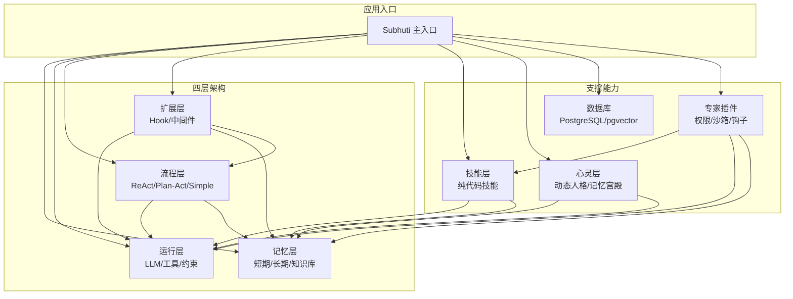
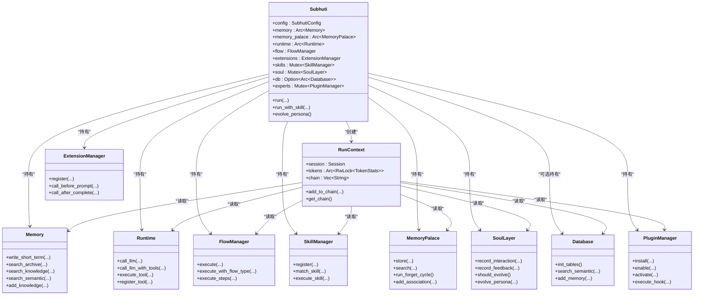
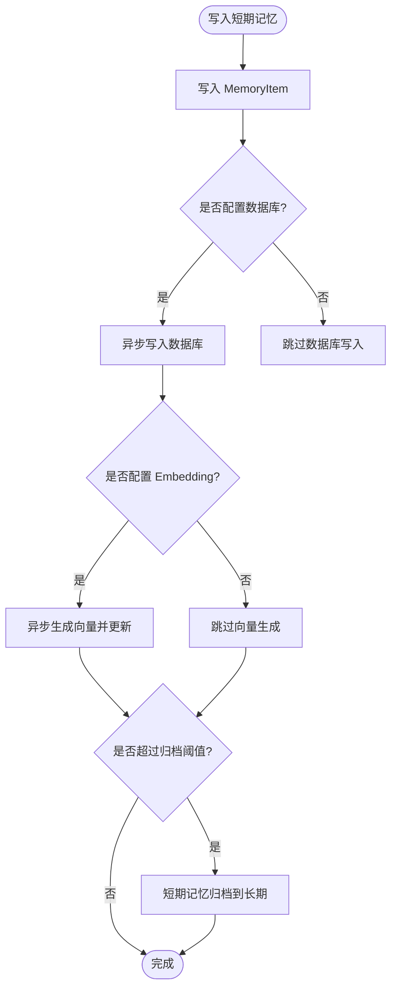
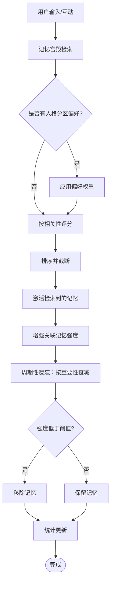
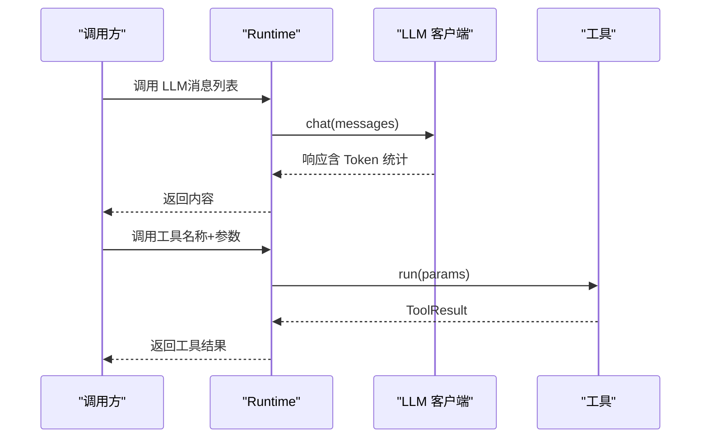
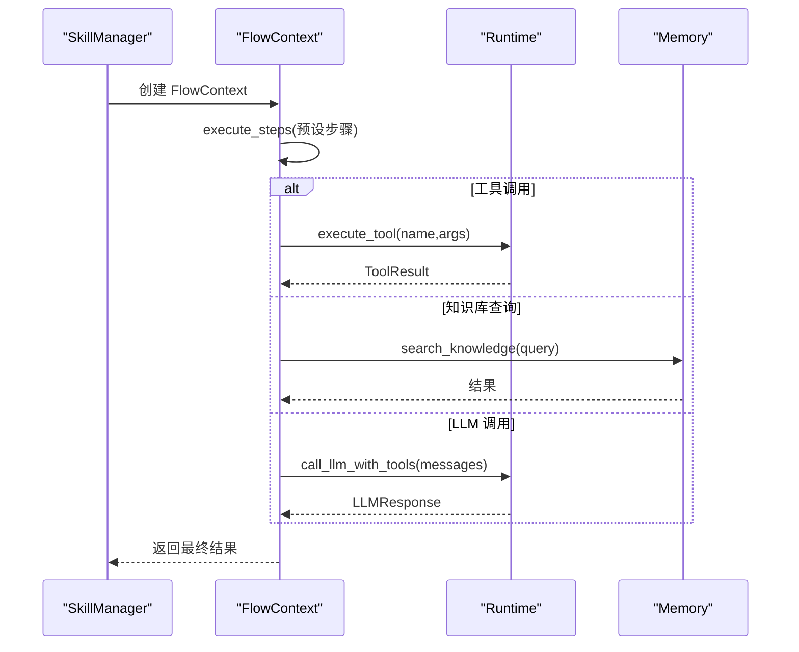
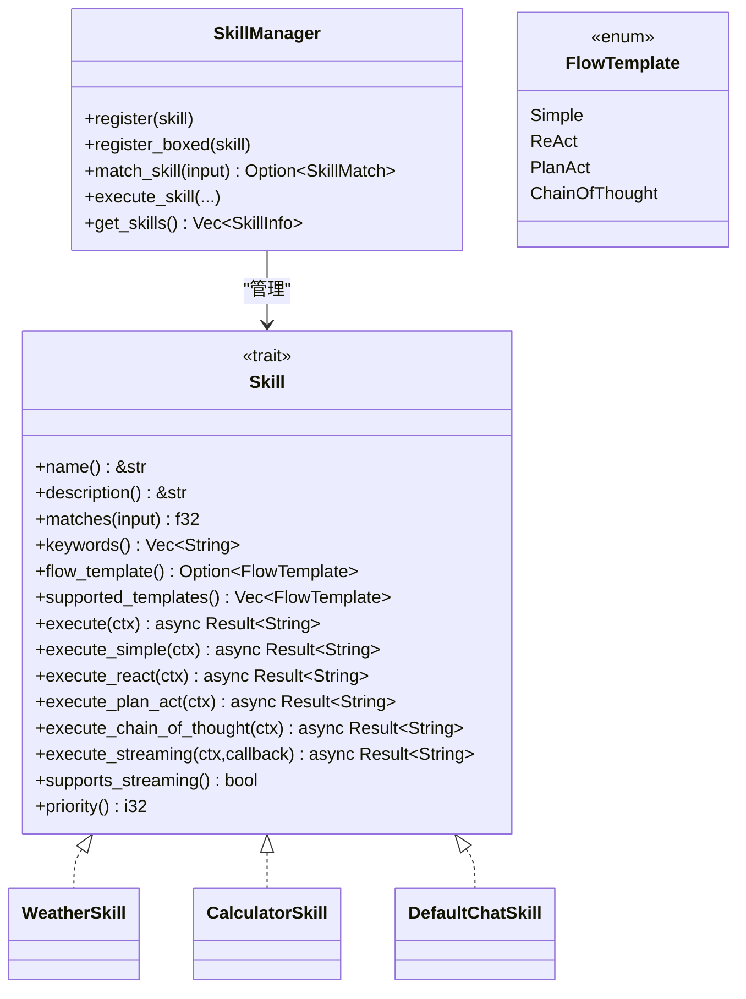
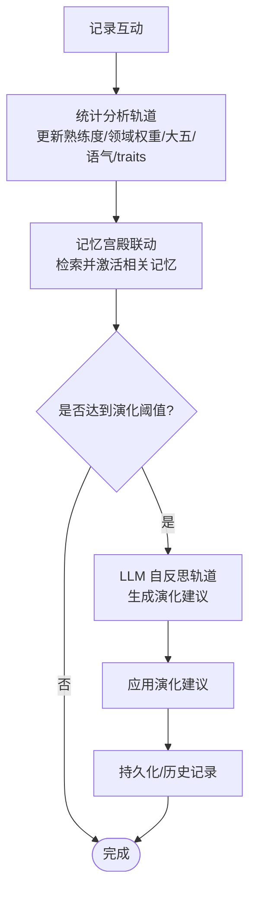
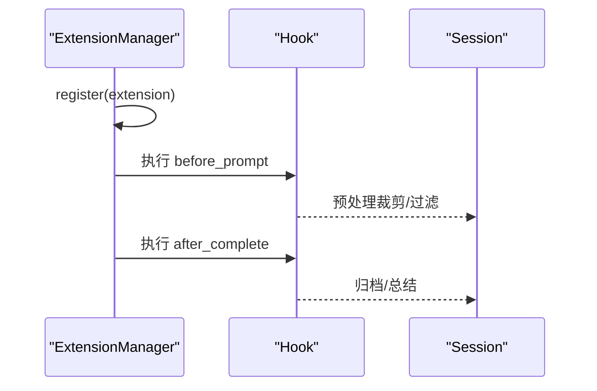
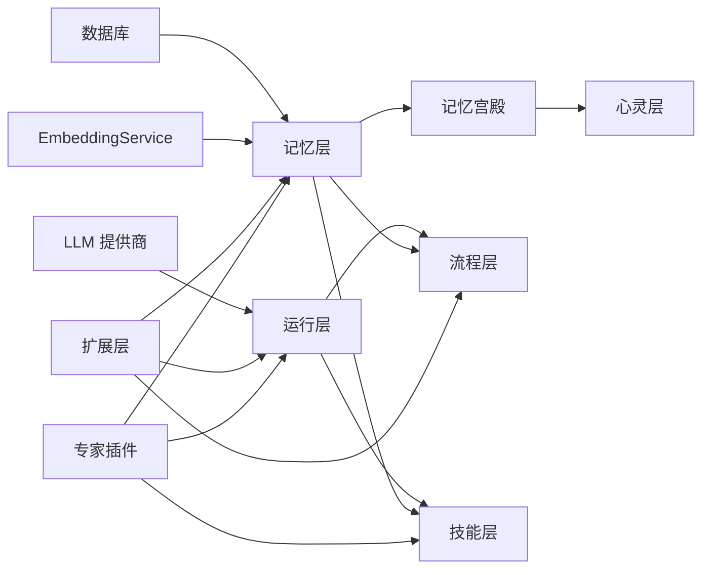

# 核心概念

<cite>
**本文引用的文件**
- [lib.rs](file://crates/subhuti/src/lib.rs)
- [Cargo.toml](file://crates/subhuti/Cargo.toml)
- [context.rs](file://crates/subhuti/src/context.rs)
- [palace.rs](file://crates/subhuti/src/soul/palace.rs)
- [mod.rs（记忆层）](file://crates/subhuti/src/memory/mod.rs)
- [mod.rs（运行层）](file://crates/subhuti/src/runtime/mod.rs)
- [mod.rs（流程层）](file://crates/subhuti/src/flow/mod.rs)
- [mod.rs（技能层）](file://crates/subhuti/src/skill/mod.rs)
- [mod.rs（扩展层）](file://crates/subhuti/src/extension/mod.rs)
- [mod.rs（数据库）](file://crates/subhuti/src/db/mod.rs)
- [mod.rs（专家插件）](file://crates/subhuti/src/expert/mod.rs)
- [persona.json](file://crates/subhuti/data/persona.json)
</cite>

## 目录
1. [引言](#引言)
2. [项目结构](#项目结构)
3. [核心组件](#核心组件)
4. [架构总览](#架构总览)
5. [详细组件分析](#详细组件分析)
6. [依赖关系分析](#依赖关系分析)
7. [性能考量](#性能考量)
8. [故障排查指南](#故障排查指南)
9. [结论](#结论)
10. [附录](#附录)

## 引言
本文件面向 Subhuti AI Agent 框架，系统阐述其核心概念与设计哲学，重点覆盖以下主题：
- Agent 的定义、状态管理与决策机制
- 四层架构（Memory/ Runtime/ Flow/ Extension）的职责与协作
- 记忆宫殿架构的六种记忆分区与四级重要性系统
- 动态人格系统（大五人格模型）的心理学基础与演化机制
- 上下文管理、会话状态、约束护栏等关键概念
- 为后续功能文档奠定坚实的理论基础

## 项目结构
Subhuti 采用模块化分层设计，核心模块包括：
- 记忆层：短期/长期/知识库三层记忆与检索
- 运行层：LLM 抽象、工具系统、约束护栏
- 流程层：ReAct/Plan-Act/Simple 等流程策略
- 扩展层：Hook/中间件扩展
- 技能层：纯代码风格的技能系统与流程模板
- 心灵层：动态人格与记忆宫殿
- 数据库：PostgreSQL 集成与向量检索
- 专家插件：可插拔的能力扩展与权限沙箱

图表来源
- [lib.rs:84-156](file://crates/subhuti/src/lib.rs#L84-L156)
- [mod.rs（流程层）:677-771](file://crates/subhuti/src/flow/mod.rs#L677-L771)
- [mod.rs（技能层）:451-861](file://crates/subhuti/src/skill/mod.rs#L451-L861)
- [mod.rs（扩展层）:112-227](file://crates/subhuti/src/extension/mod.rs#L112-L227)
- [mod.rs（数据库）:44-603](file://crates/subhuti/src/db/mod.rs#L44-L603)

章节来源
- [lib.rs:1-998](file://crates/subhuti/src/lib.rs#L1-L998)
- [Cargo.toml:1-63](file://crates/subhuti/Cargo.toml#L1-L63)

## 核心组件
- Subhuti 主入口：统一配置、实例化各子系统，并提供 run/run_simple 等高层 API
- 记忆系统：三层记忆（短期/长期/知识库）与记忆宫殿（分区/重要性/遗忘/联想）
- 运行时：LLM 抽象、工具注册、约束护栏、会话状态
- 流程管理：ReAct/Plan-Act/Simple 等流程策略与自定义流程
- 技能系统：纯代码实现、关键词索引、流程模板选择
- 心灵层：大五人格模型、动态演化、交互统计、记忆宫殿联动
- 扩展系统：Hook 生命周期、敏感词过滤、日志与 Token 统计
- 数据库：PostgreSQL 表结构、向量检索、持久化
- 专家插件：清单/权限/沙箱/钩子/生命周期

章节来源
- [lib.rs:84-156](file://crates/subhuti/src/lib.rs#L84-L156)
- [mod.rs（记忆层）:163-444](file://crates/subhuti/src/memory/mod.rs#L163-L444)
- [mod.rs（运行层）:57-248](file://crates/subhuti/src/runtime/mod.rs#L57-L248)
- [mod.rs（流程层）:677-800](file://crates/subhuti/src/flow/mod.rs#L677-L800)
- [mod.rs（技能层）:451-861](file://crates/subhuti/src/skill/mod.rs#L451-L861)
- [palace.rs:226-765](file://crates/subhuti/src/soul/palace.rs#L226-L765)
- [mod.rs（扩展层）:112-227](file://crates/subhuti/src/extension/mod.rs#L112-L227)
- [mod.rs（数据库）:44-603](file://crates/subhuti/src/db/mod.rs#L44-L603)
- [mod.rs（专家插件）:658-800](file://crates/subhuti/src/expert/mod.rs#L658-L800)

## 架构总览
Subhuti 的分层设计遵循“薄封装、无魔法、无全局状态、可完全掌控”的哲学。全局状态（Subhuti）仅持有只读共享资源（Arc），请求级状态（RunContext）承载会话与 Token 统计，避免“上帝对象”。

图表来源
- [lib.rs:84-156](file://crates/subhuti/src/lib.rs#L84-L156)
- [context.rs:51-86](file://crates/subhuti/src/context.rs#L51-L86)
- [mod.rs（记忆层）:163-444](file://crates/subhuti/src/memory/mod.rs#L163-L444)
- [mod.rs（运行层）:57-248](file://crates/subhuti/src/runtime/mod.rs#L57-L248)
- [mod.rs（流程层）:677-800](file://crates/subhuti/src/flow/mod.rs#L677-L800)
- [mod.rs（技能层）:451-861](file://crates/subhuti/src/skill/mod.rs#L451-L861)
- [palace.rs:226-765](file://crates/subhuti/src/soul/palace.rs#L226-L765)
- [mod.rs（扩展层）:112-227](file://crates/subhuti/src/extension/mod.rs#L112-L227)
- [mod.rs（数据库）:44-603](file://crates/subhuti/src/db/mod.rs#L44-L603)
- [mod.rs（专家插件）:766-800](file://crates/subhuti/src/expert/mod.rs#L766-L800)

## 详细组件分析

### 记忆层（Memory）
- 三层标准记忆
  - 短期工作记忆：当前会话上下文，自动注入 LLM
  - 长期归档记忆：历史对话沉淀，AI 主动调用搜索
  - 知识库语义记忆：向量知识、外部文档，向量检索
- 记忆项与层级
  - MemoryItem：内容、元数据、时间戳、会话关联
  - MemoryLayer：ShortTerm/Archive/Knowledge
- 搜索与持久化
  - 文本搜索：search_short_term/search_archive/search_knowledge
  - 语义搜索：search_semantic（依赖数据库与 EmbeddingService）
  - 双写策略：内存 + 数据库；可选向量化
- 统计与容量
  - MemoryConfig：短期容量、归档阈值、知识维度、TTL
  - MemoryStats：各类计数

图表来源
- [mod.rs（记忆层）:260-368](file://crates/subhuti/src/memory/mod.rs#L260-L368)

章节来源
- [mod.rs（记忆层）:1-496](file://crates/subhuti/src/memory/mod.rs#L1-L496)

### 记忆宫殿（MemoryPalace）
- 记忆分区（六种主题房间）
  - 日常对话室、专业知识室、情感记忆室、任务记忆室、创意想法室、默认区
- 记忆重要性（四级）
  - Trivial/Normal/Important/Core，影响遗忘速度
- 联想网络与激活
  - 记忆检索时激活并增强强度；可建立双向关联
- 遗忘周期
  - 基于重要性与时间衰减，定期清理低强度记忆
- 与心灵层联动
  - 互动时增强相关记忆，建立联想网络

图表来源
- [palace.rs:421-566](file://crates/subhuti/src/soul/palace.rs#L421-L566)
- [palace.rs:582-635](file://crates/subhuti/src/soul/palace.rs#L582-L635)

章节来源
- [palace.rs:1-800](file://crates/subhuti/src/soul/palace.rs#L1-L800)

### 运行层（Runtime）
- LLM 抽象：统一接口，支持 OpenAI/Ollama/Doubao/Custom
- 工具系统：Tool Trait，name/description/schema/run
- 约束护栏：最大工具调用轮次、上下文长度、超时
- 会话状态：Session 无状态，运行时只读

图表来源
- [mod.rs（运行层）:135-212](file://crates/subhuti/src/runtime/mod.rs#L135-L212)

章节来源
- [mod.rs（运行层）:1-266](file://crates/subhuti/src/runtime/mod.rs#L1-L266)

### 流程层（Flow）
- 流程类型：Simple/React/PlanAct/Custom
- 流程步骤：Tool/Knowledge/LLM/Condition/Memory/Parallel/Loop
- 上下文：FlowContext 携带 session/runtime/memory/config/state/iteration/input/context_data
- 执行策略：Skill 匹配成功走预设步骤；否则走默认流程

图表来源
- [mod.rs（流程层）:425-574](file://crates/subhuti/src/flow/mod.rs#L425-L574)

章节来源
- [mod.rs（流程层）:1-828](file://crates/subhuti/src/flow/mod.rs#L1-L828)

### 技能层（Skill）
- 纯代码风格：Skill 用代码实现，无需声明式步骤
- 预设流程模板：Simple/ReAct/PlanAct/ChainOfThought
- 匹配与索引：关键词倒排索引 + 匹配阈值 + 优先级
- 执行上下文：SkillContext 携带 input/session/runtime/memory/confidence/flow_template/tokens

图表来源
- [mod.rs（技能层）:255-405](file://crates/subhuti/src/skill/mod.rs#L255-L405)
- [mod.rs（技能层）:451-861](file://crates/subhuti/src/skill/mod.rs#L451-L861)

章节来源
- [mod.rs（技能层）:1-1642](file://crates/subhuti/src/skill/mod.rs#L1-L1642)

### 心灵层（Soul）
- 动态人格系统：大五人格模型 + 语气风格 + 情感倾向
- 双轨演化：统计分析轨道（实时）+ LLM 自反思轨道（周期性）
- 互动统计：技能使用次数、平均响应时长、点赞/踩、反馈列表
- 记忆宫殿联动：互动时增强相关记忆、建立联想网络

图表来源
- [lib.rs:407-508](file://crates/subhuti/src/lib.rs#L407-L508)
- [mod.rs（心灵层）:419-502](file://crates/subhuti/src/soul/palace.rs#L419-L502)

章节来源
- [lib.rs:1-998](file://crates/subhuti/src/lib.rs#L1-L998)
- [palace.rs:1-800](file://crates/subhuti/src/soul/palace.rs#L1-L800)

### 扩展层（Extension）
- 生命周期 Hook：before_prompt/before_tool/after_tool/after_complete
- 内置 Hook：日志、敏感词过滤、Token 统计
- 扩展管理：注册扩展与钩子，按阶段执行

图表来源
- [mod.rs（扩展层）:174-226](file://crates/subhuti/src/extension/mod.rs#L174-L226)

章节来源
- [mod.rs（扩展层）:1-438](file://crates/subhuti/src/extension/mod.rs#L1-L438)

### 数据库（PostgreSQL）
- 表结构：persona_profiles、persona_history、user_feedbacks、memories（含向量）
- 能力：初始化表、向量相似度检索、记忆 CRUD、反馈 CRUD
- 集成：与记忆层、心灵层、专家插件协同

章节来源
- [mod.rs（数据库）:66-603](file://crates/subhuti/src/db/mod.rs#L66-L603)

### 专家插件系统
- 清单/权限/沙箱/钩子/生命周期
- 插件状态机：Installed → Enabled → Activated（Disabled）
- 钩子链：在请求生命周期中插入自定义逻辑

章节来源
- [mod.rs（专家插件）:1-1273](file://crates/subhuti/src/expert/mod.rs#L1-L1273)

## 依赖关系分析
- 运行时依赖 LLM 提供商（OpenAI/Ollama/Doubao/Custom）
- 记忆层可选依赖数据库与 EmbeddingService
- 心灵层依赖记忆宫殿与数据库
- 扩展层与各层解耦，通过 Hook 注入
- 专家插件通过清单与权限声明能力边界

图表来源
- [mod.rs（运行层）:89-128](file://crates/subhuti/src/runtime/mod.rs#L89-L128)
- [mod.rs（记忆层）:216-258](file://crates/subhuti/src/memory/mod.rs#L216-L258)
- [mod.rs（扩展层）:112-227](file://crates/subhuti/src/extension/mod.rs#L112-L227)
- [mod.rs（专家插件）:658-800](file://crates/subhuti/src/expert/mod.rs#L658-L800)

章节来源
- [Cargo.toml:14-63](file://crates/subhuti/Cargo.toml#L14-L63)

## 性能考量
- 记忆层
  - 短期容量与归档阈值直接影响上下文长度与检索成本
  - 向量检索依赖数据库与 EmbeddingService，需关注延迟与向量维度
- 技能层
  - 关键词索引 + 倒排索引优化大规模匹配性能
  - 流程模板减少 LLM 思考开销，提升吞吐
- 心灵层
  - 演化频率与统计分析轨道的权衡，避免过度 LLM 调用
- 扩展层
  - Hook 数量与执行顺序影响整体延迟，建议最小化必要 Hook

## 故障排查指南
- 健康检查
  - Subhuti.health_check() 输出 MemoryPalace、Database、SoulLayer、ExpertPlugins、Skills 状态
- 常见问题定位
  - LLM 未配置：运行时调用会报错
  - 数据库未初始化：无法持久化记忆/人格
  - 记忆向量未生成：检查 EmbeddingService 与数据库向量列
  - 敏感词拦截：检查扩展层敏感词过滤 Hook
- 调试工具
  - TestTracker/HealthReport/Profiler/LockDetector
  - 调试打印与断言工具

章节来源
- [lib.rs:562-642](file://crates/subhuti/src/lib.rs#L562-L642)
- [mod.rs（扩展层）:235-438](file://crates/subhuti/src/extension/mod.rs#L235-L438)

## 结论
Subhuti 以“四层架构 + 心灵层 + 扩展层”为核心，结合记忆宫殿与动态人格系统，形成可完全掌控、可扩展、可演化的 AI Agent 框架。通过纯代码技能、流程模板与 Hook 机制，既保证灵活性，又维持工程可控性。后续功能开发可在本理论基础上，围绕记忆、人格、流程与扩展进行深化。

## 附录
- 上下文与会话
  - RunContext：请求级会话、Token 统计、调用链
  - Session：消息历史、角色、工具调用状态
- 心理学基础
  - 大五人格模型：开放性、尽责性、外向性、宜人性、神经质
  - 语气风格与情感倾向：友好/正式/随意/热情/冷静/机智
- 专家插件示例
  - 心理咨询专家、编程开发专家等，具备独立清单、权限、钩子与生命周期

章节来源
- [context.rs:1-87](file://crates/subhuti/src/context.rs#L1-L87)
- [mod.rs（专家插件）:107-220](file://crates/subhuti/src/expert/mod.rs#L107-L220)
- [persona.json:1-44](file://crates/subhuti/data/persona.json#L1-L44)