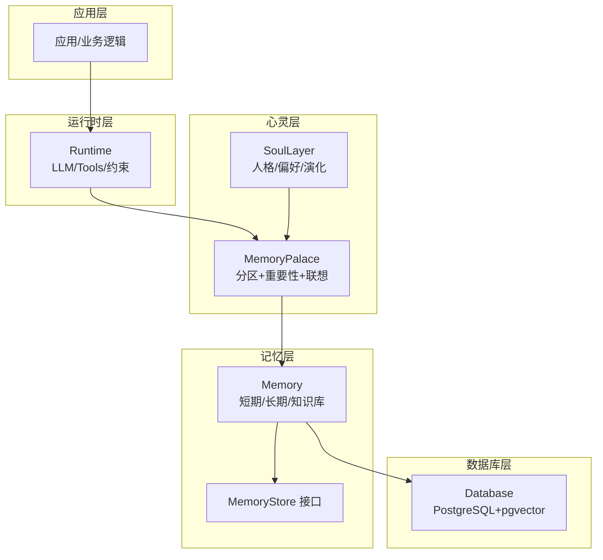
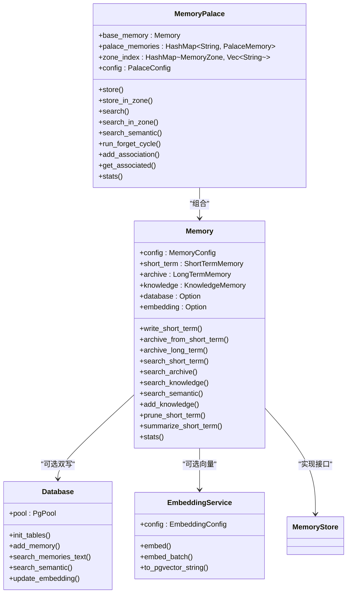
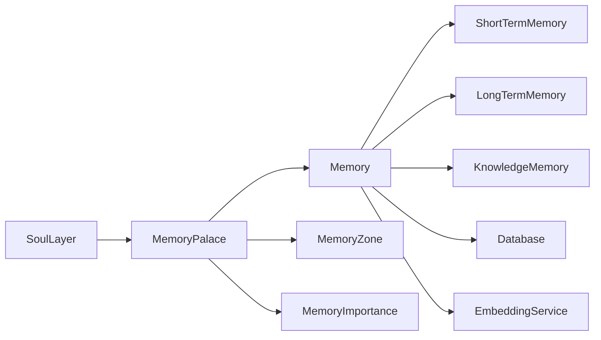
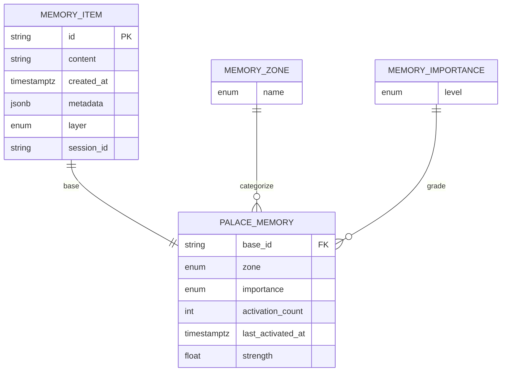
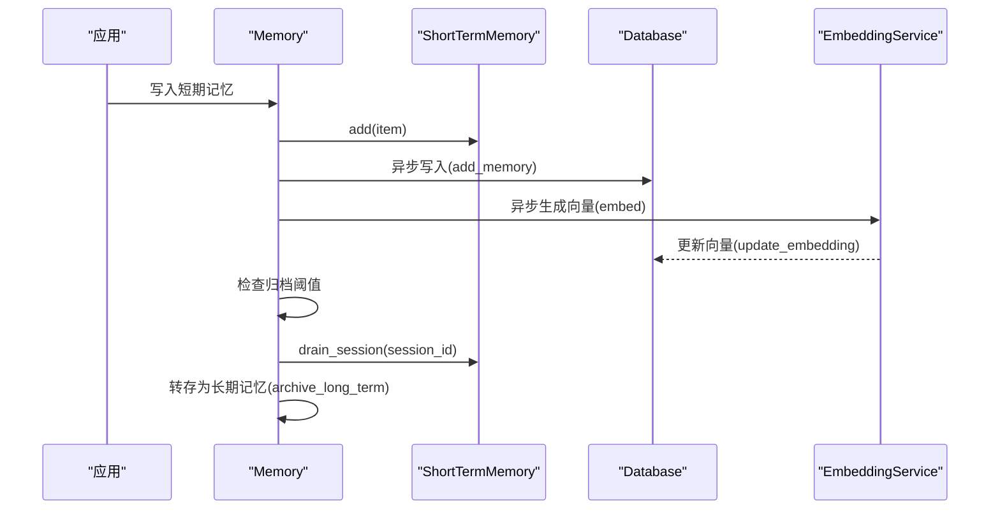
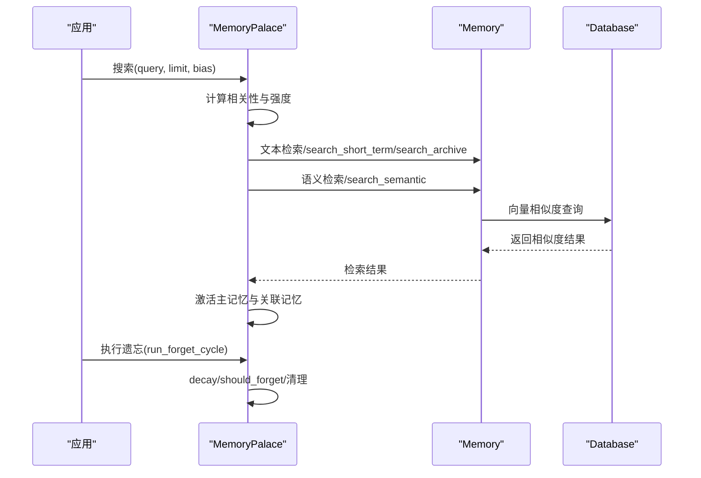
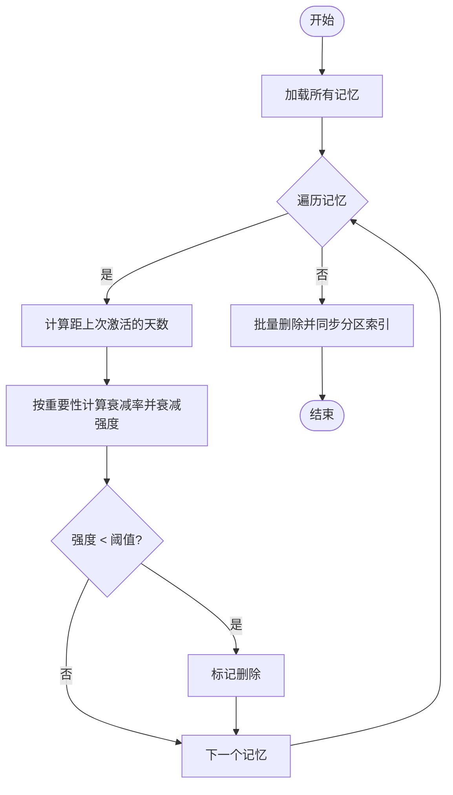

# 记忆宫殿架构

<cite>
**本文档引用的文件**
- [memory/mod.rs](file://crates/subhuti/src/memory/mod.rs)
- [memory/short_term.rs](file://crates/subhuti/src/memory/short_term.rs)
- [memory/long_term.rs](file://crates/subhuti/src/memory/long_term.rs)
- [memory/knowledge.rs](file://crates/subhuti/src/memory/knowledge.rs)
- [memory/embedding.rs](file://crates/subhuti/src/memory/embedding.rs)
- [soul/palace.rs](file://crates/subhuti/src/soul/palace.rs)
- [db/mod.rs](file://crates/subhuti/src/db/mod.rs)
- [lib.rs](file://crates/subhuti/src/lib.rs)
</cite>

## 目录
1. [简介](#简介)
2. [项目结构](#项目结构)
3. [核心组件](#核心组件)
4. [架构总览](#架构总览)
5. [详细组件分析](#详细组件分析)
6. [依赖关系分析](#依赖关系分析)
7. [性能考量](#性能考量)
8. [故障排查指南](#故障排查指南)
9. [结论](#结论)
10. [附录](#附录)

## 简介
本文件面向“记忆宫殿”架构，系统性梳理短期记忆的滑动窗口管理、长期记忆的归档策略、知识库的结构化存储、向量嵌入的语义检索机制，并深入阐释记忆的生命周期管理、遗忘算法、优先级排序与跨分区检索机制。文档同时给出内存布局图、数据流图与性能优化策略，帮助开发者快速实现与扩展该记忆系统。

## 项目结构
- 记忆层（Memory Layer）：短期工作记忆、长期归档记忆、知识库语义记忆，统一通过 Memory 结构体协调。
- 心灵层（Soul Layer）：在记忆基础上引入分区（Zone）、重要性（Importance）与联想网络，形成“记忆宫殿”的心智统一体。
- 数据库层（DB Layer）：基于 PostgreSQL + pgvector，提供持久化与向量检索能力。
- 运行时层（Runtime Layer）：LLM 抽象、工具系统、约束护栏，支撑记忆系统的使用场景。

图表来源
- [lib.rs:108-156](file://crates/subhuti/src/lib.rs#L108-L156)
- [memory/mod.rs:163-214](file://crates/subhuti/src/memory/mod.rs#L163-L214)
- [soul/palace.rs:228-288](file://crates/subhuti/src/soul/palace.rs#L228-L288)
- [db/mod.rs:44-64](file://crates/subhuti/src/db/mod.rs#L44-L64)

章节来源
- [lib.rs:108-156](file://crates/subhuti/src/lib.rs#L108-L156)
- [memory/mod.rs:163-214](file://crates/subhuti/src/memory/mod.rs#L163-L214)
- [soul/palace.rs:228-288](file://crates/subhuti/src/soul/palace.rs#L228-L288)
- [db/mod.rs:44-64](file://crates/subhuti/src/db/mod.rs#L44-L64)

## 核心组件
- Memory：统一记忆管理器，协调短期、长期、知识库三类存储，支持文本检索与语义检索，具备双写策略（内存+数据库）。
- MemoryPalace：在 Memory 基础上，引入分区（Zone）、重要性（Importance）、联想网络与遗忘机制，形成“记忆宫殿”的心智统一体。
- Database：PostgreSQL 集成，支持 pgvector 向量检索，提供记忆持久化与向量索引。
- EmbeddingService：基于 Ollama 的 embedding API，生成文本向量，支持 pgvector 格式转换与批量生成。
- MemoryStore 接口：抽象各类存储的通用能力（写入、读取、删除、搜索、清空）。

章节来源
- [memory/mod.rs:134-148](file://crates/subhuti/src/memory/mod.rs#L134-L148)
- [soul/palace.rs:228-288](file://crates/subhuti/src/soul/palace.rs#L228-L288)
- [db/mod.rs:44-64](file://crates/subhuti/src/db/mod.rs#L44-L64)
- [memory/embedding.rs:29-43](file://crates/subhuti/src/memory/embedding.rs#L29-L43)

## 架构总览
记忆宫殿架构围绕“三层记忆 + 心灵心智 + 数据库持久化 + 向量检索”的主线展开。短期记忆采用滑动窗口，超限时自动归档；长期记忆提供关键词索引与时间范围查询；知识库支持向量相似度检索；MemoryPalace 在此基础上引入分区、重要性与遗忘，形成可演化的记忆心智。

图表来源
- [memory/mod.rs:163-214](file://crates/subhuti/src/memory/mod.rs#L163-L214)
- [soul/palace.rs:228-288](file://crates/subhuti/src/soul/palace.rs#L228-L288)
- [db/mod.rs:44-64](file://crates/subhuti/src/db/mod.rs#L44-L64)
- [memory/embedding.rs:29-43](file://crates/subhuti/src/memory/embedding.rs#L29-L43)

## 详细组件分析

### 记忆分区（Zone）设计
记忆宫殿将记忆按主题分区存储，类似“房间”概念，便于检索与组织。支持的分区包括：
- 日常对话区（DailyChat）：普通闲聊
- 专业知识区（ExpertKnowledge）：技术、学术等
- 情感记忆区（Emotional）：情绪、感受、关系
- 任务记忆区（TaskProgress）：待办、目标、进度
- 创意想法区（CreativeIdeas）：灵感、创意、脑洞
- 默认区（Default）：未分类

分区推断基于关键词匹配，如情感、任务、专业知识、创意、日常对话等关键字集合。MemoryPalace 在写入时自动推断分区，也可手动指定分区写入。

章节来源
- [soul/palace.rs:34-115](file://crates/subhuti/src/soul/palace.rs#L34-L115)

### 四级重要性系统（Importance）
记忆重要性用于控制遗忘速度与激活强度，分为四级：
- 转瞬即逝（Trivial）：很快遗忘
- 普通（Normal）：正常衰减
- 重要（Important）：衰减较慢
- 核心（Core）：几乎不遗忘

重要性估算综合考虑内容长度、关键词命中数与情感浓度，最终映射到四个等级。MemoryPalace 在检索时结合重要性与时间衰减，计算最终得分。

章节来源
- [soul/palace.rs:120-133](file://crates/subhuti/src/soul/palace.rs#L120-L133)
- [soul/palace.rs:173-198](file://crates/subhuti/src/soul/palace.rs#L173-L198)

### 短期记忆的滑动窗口管理
短期记忆采用固定容量的滑动窗口，超出容量时移除最旧元素。支持：
- add：添加记忆并维护会话索引
- get_session：按会话获取记忆
- drain_session：按会话排出记忆（用于归档）
- prune：裁剪保留指定数量
- summarize：生成摘要
- search：简单文本匹配

归档阈值由 MemoryConfig 控制，达到阈值时触发归档流程，将会话内的短期记忆转存为长期记忆。

章节来源
- [memory/short_term.rs:10-158](file://crates/subhuti/src/memory/short_term.rs#L10-L158)
- [memory/mod.rs:320-333](file://crates/subhuti/src/memory/mod.rs#L320-L333)

### 长期记忆的归档策略
长期记忆提供关键词索引与会话索引，支持：
- add：添加记忆并更新索引
- get_session：按会话获取记忆
- get_by_time_range：按时间范围获取记忆（预留）
- search：简单文本匹配
- clear：清空

归档流程包括：
- 从短期记忆按会话归档
- 或直接写入长期记忆（archive_long_term）

章节来源
- [memory/long_term.rs:10-129](file://crates/subhuti/src/memory/long_term.rs#L10-L129)
- [memory/mod.rs:335-368](file://crates/subhuti/src/memory/mod.rs#L335-L368)

### 知识库的结构化存储与向量检索
知识库支持两种检索模式：
- 文本检索：基于 KnowledgeMemory 的向量近似实现（简化词袋模型 + 余弦相似度）
- 语义检索：通过 EmbeddingService 生成向量，Database 使用 pgvector 进行向量相似度检索

注意：实际项目中推荐使用专业向量数据库（如 tantivy、meilisearch、chromadb、qdrant）替代简化实现。

章节来源
- [memory/knowledge.rs:69-166](file://crates/subhuti/src/memory/knowledge.rs#L69-L166)
- [memory/embedding.rs:29-98](file://crates/subhuti/src/memory/embedding.rs#L29-L98)
- [db/mod.rs:554-592](file://crates/subhuti/src/db/mod.rs#L554-L592)

### 记忆生命周期管理与遗忘算法
MemoryPalace 引入记忆强度（strength）与激活次数（activation_count），结合重要性与时间衰减，实现遗忘算法：
- decay：按重要性等级计算衰减率，随时间衰减
- should_forget：当强度低于阈值时触发遗忘
- run_forget_cycle：遍历所有记忆，执行遗忘清理并同步分区索引

章节来源
- [soul/palace.rs:207-224](file://crates/subhuti/src/soul/palace.rs#L207-L224)
- [soul/palace.rs:582-635](file://crates/subhuti/src/soul/palace.rs#L582-L635)

### 优先级排序与跨分区检索
检索流程包含三个阶段：
- 阶段1（读锁内）：计算相关性得分与记忆强度，结合人格偏好的分区权重，得到最终得分
- 阶段2（无锁）：按最终得分排序并截断
- 阶段3（写锁）：激活主记忆与其关联记忆，增强联想网络

支持：
- 按分区检索（search_in_zone）
- 语义检索（search_semantic）
- 人格偏好的分区权重（persona_zone_bias）

章节来源
- [soul/palace.rs:423-566](file://crates/subhuti/src/soul/palace.rs#L423-L566)
- [soul/palace.rs:568-578](file://crates/subhuti/src/soul/palace.rs#L568-L578)

### 联想网络与跨分区检索机制
- add_association：建立双向关联，增强检索时的上下文连通性
- get_associated：按深度遍历关联记忆，支持多跳联想
- 分区索引：按 Zone 维护记忆 ID 列表，便于分区检索与统计

章节来源
- [soul/palace.rs:637-700](file://crates/subhuti/src/soul/palace.rs#L637-L700)

### 数据库与向量检索集成
- Database 提供记忆持久化、向量更新与向量相似度检索
- Memory 在写入短期记忆时异步生成向量并更新数据库
- MemoryPalace 在检索时调用 Memory 的语义检索接口

章节来源
- [db/mod.rs:418-592](file://crates/subhuti/src/db/mod.rs#L418-L592)
- [memory/mod.rs:269-311](file://crates/subhuti/src/memory/mod.rs#L269-L311)
- [memory/mod.rs:385-407](file://crates/subhuti/src/memory/mod.rs#L385-L407)

## 依赖关系分析

图表来源
- [memory/mod.rs:163-214](file://crates/subhuti/src/memory/mod.rs#L163-L214)
- [soul/palace.rs:228-288](file://crates/subhuti/src/soul/palace.rs#L228-L288)

章节来源
- [memory/mod.rs:163-214](file://crates/subhuti/src/memory/mod.rs#L163-L214)
- [soul/palace.rs:228-288](file://crates/subhuti/src/soul/palace.rs#L228-L288)

## 性能考量
- 短期记忆滑动窗口：固定容量，避免无限增长；归档阈值需平衡上下文长度与性能。
- 长期记忆索引：关键词索引与会话索引提升检索效率；时间范围查询预留，可按需实现。
- 知识库检索：简化向量实现仅作演示，建议替换为专业向量数据库；向量化与索引构建需异步化。
- 语义检索：EmbeddingService 串行生成向量，可优化为批量并发；数据库向量相似度查询需合理设置索引。
- 心灵宫殿检索：分阶段处理（读锁内计算、无锁排序、写锁激活），减少锁竞争；可进一步拆分统计与激活阶段。
- 数据库连接池：合理设置最大连接数，避免阻塞；向量更新采用异步任务，不影响主线程。

[本节为通用性能指导，不直接分析具体文件]

## 故障排查指南
- 向量检索失败：检查 EmbeddingService 配置与 Ollama 服务可用性；确认数据库向量维度一致。
- 归档异常：检查 Memory 的归档阈值与会话 ID；确认数据库连接与事务一致性。
- 检索结果为空：确认 MemoryPalace 的分区权重与查询关键词；检查知识库是否已加载。
- 遗忘过度：调整遗忘阈值与周期；检查重要性估算逻辑与激活频率。
- 数据库初始化：确认 pgvector 扩展启用与表结构迁移；检查连接字符串与权限。

章节来源
- [memory/embedding.rs:50-91](file://crates/subhuti/src/memory/embedding.rs#L50-L91)
- [db/mod.rs:66-180](file://crates/subhuti/src/db/mod.rs#L66-L180)
- [memory/mod.rs:313-317](file://crates/subhuti/src/memory/mod.rs#L313-L317)
- [soul/palace.rs:582-635](file://crates/subhuti/src/soul/palace.rs#L582-L635)

## 结论
记忆宫殿架构通过“三层记忆 + 心灵心智 + 数据库持久化 + 向量检索”的协同，实现了从短期到长期、从结构化到语义化的完整记忆体系。MemoryPalace 在此基础上引入分区、重要性与遗忘机制，使记忆具备心智属性与演化能力。建议在生产环境中替换简化向量实现为专业向量数据库，并优化异步与并发策略以提升整体性能。

[本节为总结性内容，不直接分析具体文件]

## 附录

### 数据模型与内存布局

图表来源
- [memory/mod.rs:54-96](file://crates/subhuti/src/memory/mod.rs#L54-L96)
- [soul/palace.rs:138-155](file://crates/subhuti/src/soul/palace.rs#L138-L155)
- [soul/palace.rs:34-52](file://crates/subhuti/src/soul/palace.rs#L34-L52)
- [soul/palace.rs:120-133](file://crates/subhuti/src/soul/palace.rs#L120-L133)

### 数据流图（写入与归档）

图表来源
- [memory/mod.rs:260-317](file://crates/subhuti/src/memory/mod.rs#L260-L317)
- [memory/mod.rs:335-368](file://crates/subhuti/src/memory/mod.rs#L335-L368)
- [db/mod.rs:418-552](file://crates/subhuti/src/db/mod.rs#L418-L552)
- [memory/embedding.rs:50-91](file://crates/subhuti/src/memory/embedding.rs#L50-L91)

### 数据流图（检索与遗忘）

图表来源
- [soul/palace.rs:423-566](file://crates/subhuti/src/soul/palace.rs#L423-L566)
- [memory/mod.rs:370-407](file://crates/subhuti/src/memory/mod.rs#L370-L407)
- [db/mod.rs:554-592](file://crates/subhuti/src/db/mod.rs#L554-L592)
- [soul/palace.rs:582-635](file://crates/subhuti/src/soul/palace.rs#L582-L635)

### 遗忘算法流程

图表来源
- [soul/palace.rs:582-635](file://crates/subhuti/src/soul/palace.rs#L582-L635)