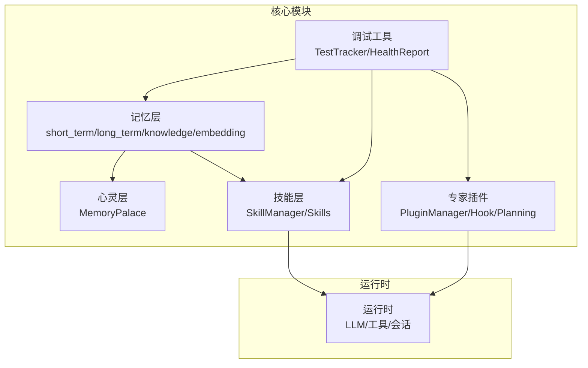
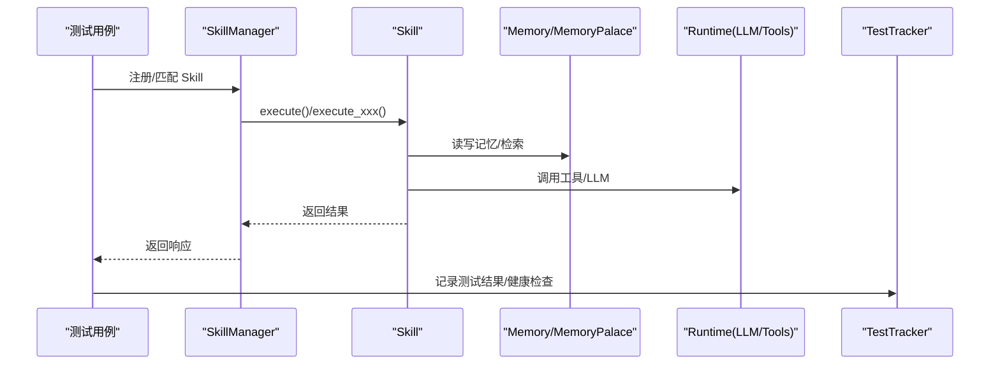
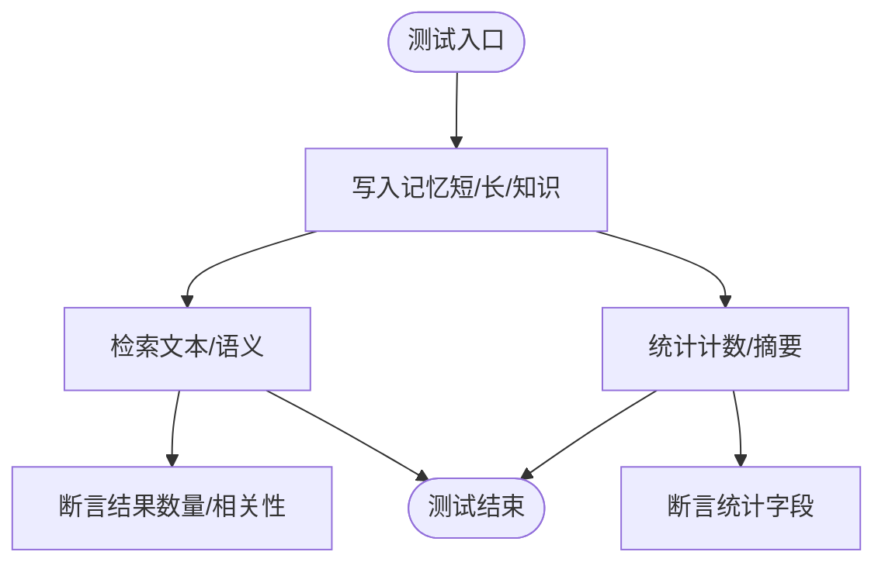
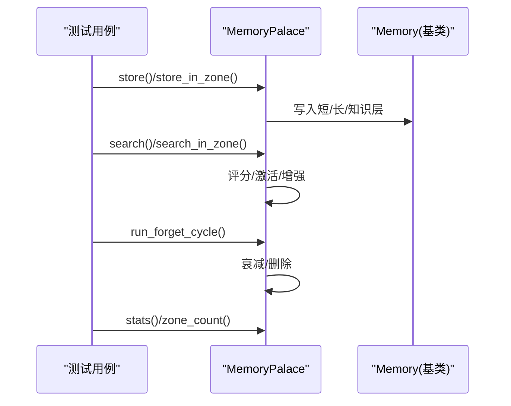
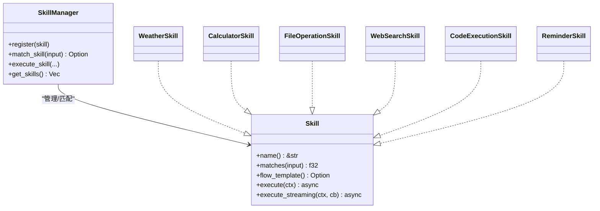
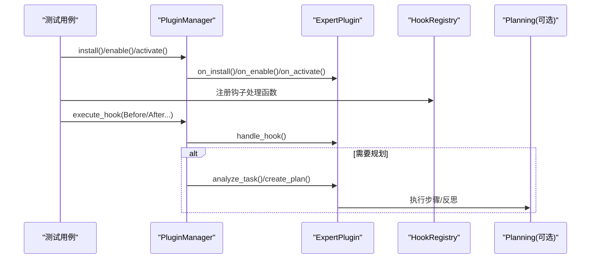
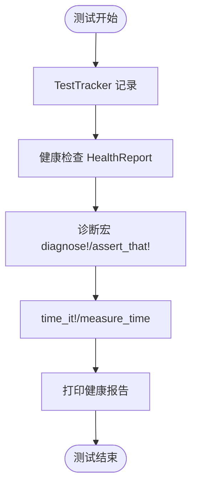
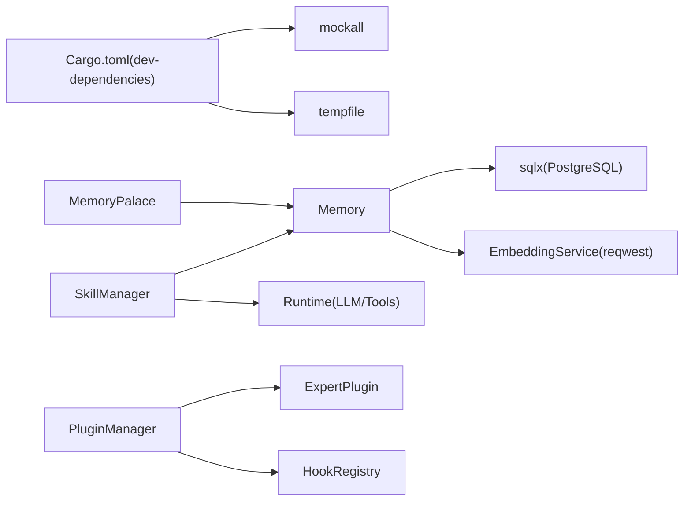

# 单元测试

<cite>
**本文引用的文件**   
- [lib.rs](file://crates/subhuti/src/lib.rs)
- [Cargo.toml](file://crates/subhuti/Cargo.toml)
- [test_debug_tools.rs](file://crates/subhuti/tests/test_debug_tools.rs)
- [debug.rs](file://crates/subhuti/src/debug.rs)
- [mod.rs（记忆层）](file://crates/subhuti/src/memory/mod.rs)
- [short_term.rs](file://crates/subhuti/src/memory/short_term.rs)
- [long_term.rs](file://crates/subhuti/src/memory/long_term.rs)
- [knowledge.rs](file://crates/subhuti/src/memory/knowledge.rs)
- [embedding.rs](file://crates/subhuti/src/memory/embedding.rs)
- [palace.rs](file://crates/subhuti/src/soul/palace.rs)
- [mod.rs（技能层）](file://crates/subhuti/src/skill/mod.rs)
- [mod.rs（专家插件）](file://crates/subhuti/src/expert/mod.rs)
- [planning.rs](file://crates/subhuti/src/expert/planning.rs)
</cite>

## 目录
1. [简介](#简介)
2. [项目结构](#项目结构)
3. [核心组件](#核心组件)
4. [架构总览](#架构总览)
5. [详细组件分析](#详细组件分析)
6. [依赖分析](#依赖分析)
7. [性能考量](#性能考量)
8. [故障排查指南](#故障排查指南)
9. [结论](#结论)
10. [附录](#附录)

## 简介
本指南面向 Subhuti 框架的单元测试实践，覆盖记忆系统、技能系统、专家插件等核心模块的测试方法论与最佳实践。内容包括：
- 测试用例设计原则与断言策略
- Mock 对象与异步测试处理
- 测试数据准备与环境配置
- 调试工具与 TestTracker 的使用
- 针对 MemoryPalace、SkillManager、ExpertPlugin 的具体测试思路与示例路径

## 项目结构
Subhuti 采用模块化分层设计，核心模块如下：
- 记忆层（memory）：短期/长期/知识库、嵌入服务
- 心灵层（soul）：MemoryPalace 统一记忆与心灵
- 技能层（skill）：SkillManager 与内置 Skill
- 专家插件（expert）：插件生命周期、权限、钩子、规划接口
- 调试工具（debug）：TestTracker、健康检查、计时与诊断宏

**图表来源**
- [lib.rs:22-45](file://crates/subhuti/src/lib.rs#L22-L45)
- [mod.rs（记忆层）:1-496](file://crates/subhuti/src/memory/mod.rs#L1-L496)
- [palace.rs:1-873](file://crates/subhuti/src/soul/palace.rs#L1-L873)
- [mod.rs（技能层）:1-1642](file://crates/subhuti/src/skill/mod.rs#L1-L1642)
- [mod.rs（专家插件）:1-1273](file://crates/subhuti/src/expert/mod.rs#L1-L1273)
- [debug.rs:1-384](file://crates/subhuti/src/debug.rs#L1-L384)

**章节来源**
- [lib.rs:22-45](file://crates/subhuti/src/lib.rs#L22-L45)

## 核心组件
- Memory：统一记忆管理器，支持短/长/知识三层，可选数据库与嵌入服务
- MemoryPalace：记忆与心灵的统一体，支持分区、联想网络、遗忘周期
- SkillManager：Skill 管理与匹配，支持关键词索引与模板执行
- ExpertPlugin/PluginManager：插件生命周期、权限、钩子、可选规划接口
- TestTracker/HealthReport：测试结果追踪与系统健康检查

**章节来源**
- [mod.rs（记忆层）:163-444](file://crates/subhuti/src/memory/mod.rs#L163-L444)
- [palace.rs:227-765](file://crates/subhuti/src/soul/palace.rs#L227-L765)
- [mod.rs（技能层）:451-861](file://crates/subhuti/src/skill/mod.rs#L451-L861)
- [mod.rs（专家插件）:766-800](file://crates/subhuti/src/expert/mod.rs#L766-L800)
- [debug.rs:128-296](file://crates/subhuti/src/debug.rs#L128-L296)

## 架构总览
Subhuti 的测试关注点在于：
- 记忆系统的写入/搜索/统计一致性
- MemoryPalace 的分区、联想、遗忘与检索排序
- Skill 的匹配度、模板路由与流式执行
- 专家插件的生命周期钩子与权限控制
- 调试工具在测试中的诊断与健康检查

**图表来源**
- [mod.rs（技能层）:800-861](file://crates/subhuti/src/skill/mod.rs#L800-L861)
- [palace.rs:423-566](file://crates/subhuti/src/soul/palace.rs#L423-L566)
- [debug.rs:128-183](file://crates/subhuti/src/debug.rs#L128-L183)

## 详细组件分析

### 记忆系统（Memory/ShortTerm/LongTerm/Knowledge/Embedding）
- 测试要点
  - 写入与检索一致性：短/长/知识三层写入后可检索
  - 容量与裁剪：短期记忆容量上限与裁剪行为
  - 关键词索引：长期记忆关键词索引有效性
  - 语义检索：嵌入服务与数据库向量检索配合
  - 统计与摘要：记忆统计与短期摘要生成
- Mock 对象建议
  - 使用嵌入服务 Mock（如返回固定向量）以避免外部 Ollama 依赖
  - 使用数据库 Mock（如内存数据库）以避免真实 Postgres
- 断言策略
  - 检索结果数量与相关性排序
  - 统计字段（计数、平均强度）与容量阈值
- 示例路径
  - [记忆写入与检索测试:477-495](file://crates/subhuti/src/memory/mod.rs#L477-L495)
  - [嵌入服务测试:106-133](file://crates/subhuti/src/memory/embedding.rs#L106-L133)

**图表来源**
- [mod.rs（记忆层）:370-444](file://crates/subhuti/src/memory/mod.rs#L370-L444)
- [short_term.rs:30-118](file://crates/subhuti/src/memory/short_term.rs#L30-L118)
- [long_term.rs:31-82](file://crates/subhuti/src/memory/long_term.rs#L31-L82)
- [knowledge.rs:97-129](file://crates/subhuti/src/memory/knowledge.rs#L97-L129)
- [embedding.rs:50-98](file://crates/subhuti/src/memory/embedding.rs#L50-L98)

**章节来源**
- [mod.rs（记忆层）:473-495](file://crates/subhuti/src/memory/mod.rs#L473-L495)
- [short_term.rs:30-118](file://crates/subhuti/src/memory/short_term.rs#L30-L118)
- [long_term.rs:31-82](file://crates/subhuti/src/memory/long_term.rs#L31-L82)
- [knowledge.rs:97-129](file://crates/subhuti/src/memory/knowledge.rs#L97-L129)
- [embedding.rs:106-133](file://crates/subhuti/src/memory/embedding.rs#L106-L133)

### 心灵宫殿（MemoryPalace）
- 测试要点
  - 自动分区与重要性估算
  - 检索排序与人格偏见权重
  - 联想网络与双向关联
  - 遗忘周期与强度衰减
  - 统计信息（分区计数、平均强度）
- Mock 对象建议
  - 基于 Memory 的 Mock，避免真实数据库与嵌入服务
- 断言策略
  - 按分区检索结果分布
  - 激活后强度提升与关联记忆增强
  - 遗忘后剩余记忆数量
- 示例路径
  - [记忆分区推断测试:55-90](file://crates/subhuti/src/soul/palace.rs#L55-L90)
  - [检索与激活流程:423-566](file://crates/subhuti/src/soul/palace.rs#L423-L566)
  - [遗忘周期测试:582-635](file://crates/subhuti/src/soul/palace.rs#L582-L635)

**图表来源**
- [palace.rs:320-419](file://crates/subhuti/src/soul/palace.rs#L320-L419)
- [palace.rs:423-566](file://crates/subhuti/src/soul/palace.rs#L423-L566)
- [palace.rs:582-635](file://crates/subhuti/src/soul/palace.rs#L582-L635)
- [palace.rs:704-740](file://crates/subhuti/src/soul/palace.rs#L704-L740)

**章节来源**
- [palace.rs:55-90](file://crates/subhuti/src/soul/palace.rs#L55-L90)
- [palace.rs:423-566](file://crates/subhuti/src/soul/palace.rs#L423-L566)
- [palace.rs:582-635](file://crates/subhuti/src/soul/palace.rs#L582-L635)
- [palace.rs:704-740](file://crates/subhuti/src/soul/palace.rs#L704-L740)

### 技能系统（SkillManager 与内置 Skill）
- 测试要点
  - 匹配度与关键词索引：输入触发预期 Skill
  - 模板路由：ReAct/PlanAct/Simple/ChainOfThought
  - 执行上下文：SkillContext 的 LLM/工具调用与 Token 统计
  - 流式执行：回调驱动的流式输出
  - 内置 Skill 行为：天气、计算器、文件操作、Web 搜索、代码执行、提醒
- Mock 对象建议
  - 使用 MockLLM 注入固定响应，避免真实 LLM 调用
  - 使用工具 Mock（如 get_weather、calculate、web_search 等）
- 断言策略
  - 匹配度阈值与优先级排序
  - 模板方法是否被正确路由
  - Token 统计累加与流式回调触发
- 示例路径
  - [SkillManager 注册与匹配:503-653](file://crates/subhuti/src/skill/mod.rs#L503-L653)
  - [Skill 执行与模板路由:800-826](file://crates/subhuti/src/skill/mod.rs#L800-L826)
  - [内置 WeatherSkill:996-1061](file://crates/subhuti/src/skill/mod.rs#L996-L1061)
  - [内置 CalculatorSkill（ReAct）:1068-1190](file://crates/subhuti/src/skill/mod.rs#L1068-L1190)
  - [内置 FileOperationSkill:1281-1363](file://crates/subhuti/src/skill/mod.rs#L1281-L1363)
  - [内置 WebSearchSkill:1383-1437](file://crates/subhuti/src/skill/mod.rs#L1383-L1437)
  - [内置 CodeExecutionSkill:1443-1491](file://crates/subhuti/src/skill/mod.rs#L1443-L1491)
  - [内置 ReminderSkill:1497-1567](file://crates/subhuti/src/skill/mod.rs#L1497-L1567)

**图表来源**
- [mod.rs（技能层）:451-861](file://crates/subhuti/src/skill/mod.rs#L451-L861)
- [mod.rs（技能层）:876-1567](file://crates/subhuti/src/skill/mod.rs#L876-L1567)

**章节来源**
- [mod.rs（技能层）:503-653](file://crates/subhuti/src/skill/mod.rs#L503-L653)
- [mod.rs（技能层）:800-826](file://crates/subhuti/src/skill/mod.rs#L800-L826)
- [mod.rs（技能层）:996-1061](file://crates/subhuti/src/skill/mod.rs#L996-L1061)
- [mod.rs（技能层）:1068-1190](file://crates/subhuti/src/skill/mod.rs#L1068-L1190)
- [mod.rs（技能层）:1281-1363](file://crates/subhuti/src/skill/mod.rs#L1281-L1363)
- [mod.rs（技能层）:1383-1437](file://crates/subhuti/src/skill/mod.rs#L1383-L1437)
- [mod.rs（技能层）:1443-1491](file://crates/subhuti/src/skill/mod.rs#L1443-L1491)
- [mod.rs（技能层）:1497-1567](file://crates/subhuti/src/skill/mod.rs#L1497-L1567)

### 专家插件（ExpertPlugin/PluginManager/Hook/Planning）
- 测试要点
  - 插件清单与权限声明：文件/网络/数据库/外部 API 等
  - 生命周期钩子：安装/启用/激活/停用/卸载
  - 钩子链执行：Before/After 系列钩子的顺序与修改能力
  - 角色与知识注入：专家 persona 与技能、知识库加载
  - 规划接口：任务分析、执行计划、步骤依赖与反思
- Mock 对象建议
  - 使用 PluginManager 的 Mock 注入专家插件
  - 使用 HookContext 的 Mock 验证钩子链
- 断言策略
  - 插件状态迁移与错误记录
  - 钩子修改输入/响应后的执行链
  - 规划步骤的依赖满足与进度计算
- 示例路径
  - [专家插件 Trait 与生命周期:664-760](file://crates/subhuti/src/expert/mod.rs#L664-L760)
  - [插件管理器与钩子注册:766-800](file://crates/subhuti/src/expert/mod.rs#L766-L800)
  - [Hook 注册与执行链:502-546](file://crates/subhuti/src/expert/mod.rs#L502-L546)
  - [规划接口与执行计划:411-469](file://crates/subhuti/src/expert/planning.rs#L411-L469)
  - [规划步骤与依赖:545-629](file://crates/subhuti/src/expert/planning.rs#L545-L629)

**图表来源**
- [mod.rs（专家插件）:664-760](file://crates/subhuti/src/expert/mod.rs#L664-L760)
- [mod.rs（专家插件）:766-800](file://crates/subhuti/src/expert/mod.rs#L766-L800)
- [mod.rs（专家插件）:502-546](file://crates/subhuti/src/expert/mod.rs#L502-L546)
- [planning.rs:411-469](file://crates/subhuti/src/expert/planning.rs#L411-L469)
- [planning.rs:545-629](file://crates/subhuti/src/expert/planning.rs#L545-L629)

**章节来源**
- [mod.rs（专家插件）:664-760](file://crates/subhuti/src/expert/mod.rs#L664-L760)
- [mod.rs（专家插件）:766-800](file://crates/subhuti/src/expert/mod.rs#L766-L800)
- [mod.rs（专家插件）:502-546](file://crates/subhuti/src/expert/mod.rs#L502-L546)
- [planning.rs:411-469](file://crates/subhuti/src/expert/planning.rs#L411-L469)
- [planning.rs:545-629](file://crates/subhuti/src/expert/planning.rs#L545-L629)

### 调试工具与测试追踪（TestTracker/HealthReport）
- 测试要点
  - TestTracker：测试通过/失败计数与汇总
  - 健康检查：MemoryPalace、数据库、SoulLayer、ExpertPlugins、Skills 状态
  - 诊断宏：diagnose!/assert_that!/time_it!/debug_struct!
- 示例路径
  - [TestTracker 使用与汇总:50-62](file://crates/subhuti/tests/test_debug_tools.rs#L50-L62)
  - [健康状态与报告:64-92](file://crates/subhuti/tests/test_debug_tools.rs#L64-L92)
  - [MemoryPalace 诊断与检索:106-130](file://crates/subhuti/tests/test_debug_tools.rs#L106-L130)
  - [调试宏与计时:7-35](file://crates/subhuti/tests/test_debug_tools.rs#L7-L35)
  - [调试工具实现:128-296](file://crates/subhuti/src/debug.rs#L128-L296)

**图表来源**
- [test_debug_tools.rs:50-104](file://crates/subhuti/tests/test_debug_tools.rs#L50-L104)
- [debug.rs:128-296](file://crates/subhuti/src/debug.rs#L128-L296)

**章节来源**
- [test_debug_tools.rs:7-130](file://crates/subhuti/tests/test_debug_tools.rs#L7-L130)
- [debug.rs:128-296](file://crates/subhuti/src/debug.rs#L128-L296)

## 依赖分析
- 开发依赖
  - mockall：用于生成 Mock 对象
  - tempfile：临时文件/目录测试
- 运行时依赖
  - tokio、reqwest、sqlx、serde、uuid、chrono、tracing 等
- 模块耦合
  - Memory 与 MemoryPalace 双写/共享
  - SkillManager 与 Runtime/Memory 的协作
  - ExpertPlugin 与 PluginManager、HookRegistry 的交互

**图表来源**
- [Cargo.toml:55-58](file://crates/subhuti/Cargo.toml#L55-L58)
- [mod.rs（记忆层）:21-28](file://crates/subhuti/src/memory/mod.rs#L21-L28)
- [embedding.rs:31-43](file://crates/subhuti/src/memory/embedding.rs#L31-L43)
- [mod.rs（技能层）:84-91](file://crates/subhuti/src/skill/mod.rs#L84-L91)
- [mod.rs（专家插件）:766-800](file://crates/subhuti/src/expert/mod.rs#L766-L800)

**章节来源**
- [Cargo.toml:55-58](file://crates/subhuti/Cargo.toml#L55-L58)

## 性能考量
- 记忆检索
  - 短期记忆：线性扫描，容量上限控制
  - 长期记忆：关键词索引，避免全表扫描
  - 知识库：简化向量相似度，生产环境建议专业向量库
- 技能匹配
  - 关键词索引 + 优先级排序，支持大规模 Skill
- MemoryPalace
  - 分区索引与人格偏见权重，减少无效检索
  - 联想网络深度控制，避免过度关联
- 异步与并发
  - 使用 tokio 并发执行工具调用与嵌入生成
  - 避免在热路径上持有读写锁过久

## 故障排查指南
- 常见问题
  - 嵌入服务不可用：Mock 返回固定向量或跳过语义检索
  - 数据库未初始化：使用 TestTracker 记录失败并打印健康报告
  - 锁竞争：使用 LockDetector 记录锁持有位置
- 调试手段
  - diagnose!/debug_struct! 打印变量与结构体
  - time_it!/measure_time 记录耗时
  - assert_that!/assert_with_context 提供上下文断言
- 健康检查
  - MemoryPalace、数据库、SoulLayer、ExpertPlugins、Skills 状态
  - print_health_report 输出到控制台

**章节来源**
- [debug.rs:15-106](file://crates/subhuti/src/debug.rs#L15-L106)
- [debug.rs:128-296](file://crates/subhuti/src/debug.rs#L128-L296)

## 结论
通过以上测试指南，可以在不依赖外部服务的前提下，对 Subhuti 的核心模块进行全面的单元测试。重点在于：
- 使用 Mock 对象隔离外部依赖
- 基于关键词索引与模板路由设计可验证的测试场景
- 利用调试工具与健康检查快速定位问题
- 在异步环境下正确组织测试流程与断言

## 附录
- 测试环境配置建议
  - 使用 dotenv 管理环境变量（如 OLLAMA_URL、EMBEDDING_MODEL）
  - 为测试准备最小化配置（MemoryConfig、PalaceConfig）
- 测试数据准备
  - 短期记忆：少量对话片段
  - 长期记忆：关键词丰富的文本
  - 知识库：结构化文档片段
  - MemoryPalace：混合分区内容
- 异步测试最佳实践
  - 使用 #[tokio::test] 标注异步测试
  - 使用 MockLLM 注入固定响应
  - 使用 TestTracker 记录测试结果与耗时