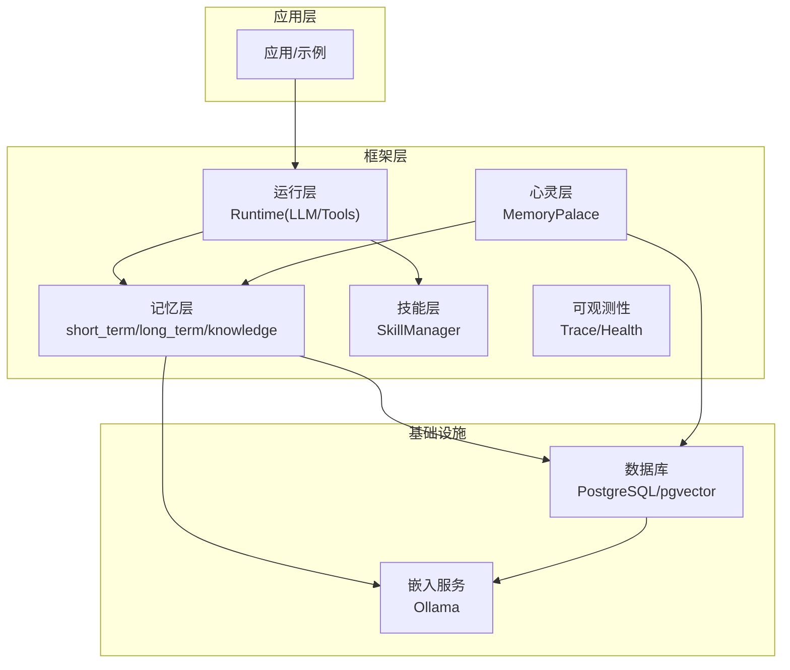
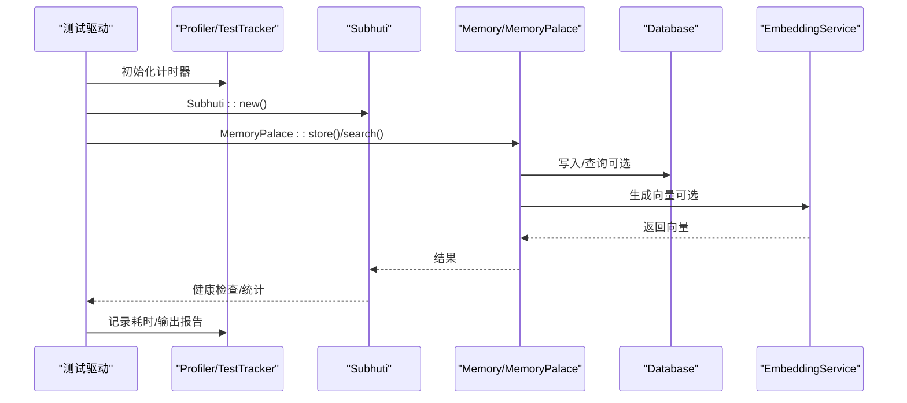
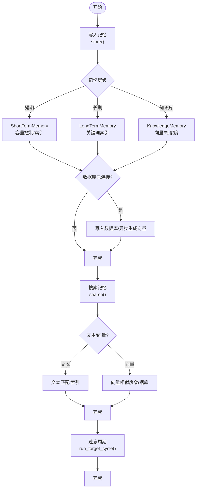
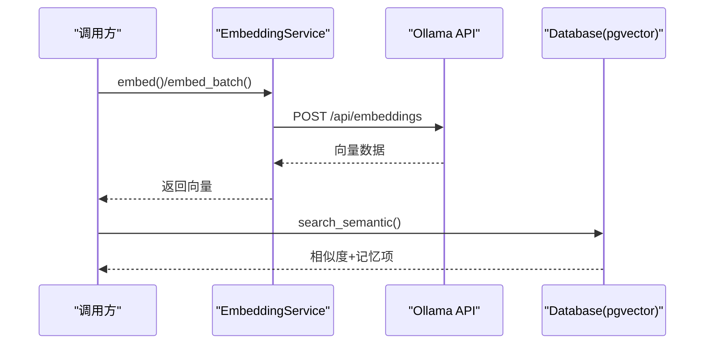
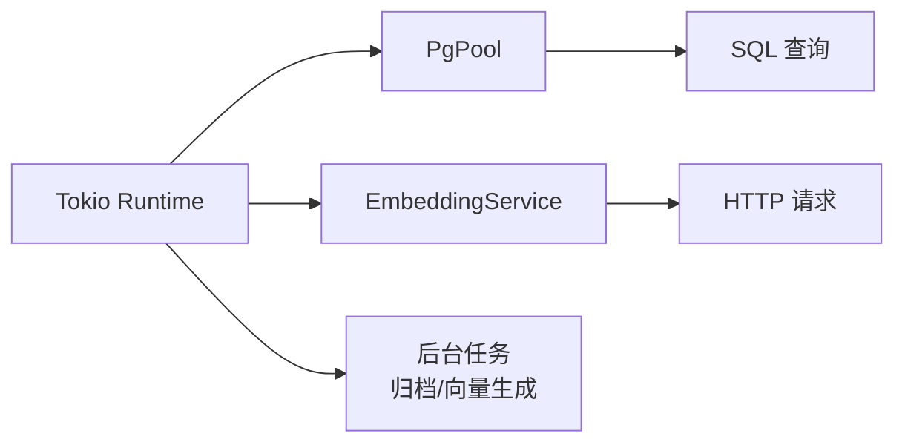
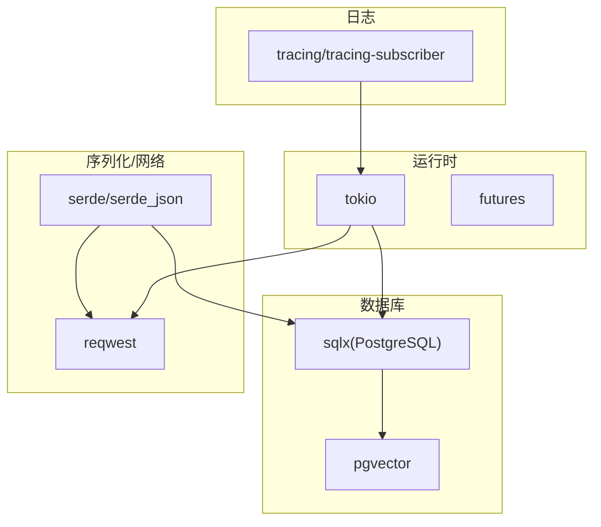

# 性能测试

<cite>
**本文引用的文件**
- [crates/subhuti/tests/performance_test.rs](file://crates/subhuti/tests/performance_test.rs)
- [crates/subhuti/src/debug.rs](file://crates/subhuti/src/debug.rs)
- [crates/subhuti/src/lib.rs](file://crates/subhuti/src/lib.rs)
- [crates/subhuti/src/soul/palace.rs](file://crates/subhuti/src/soul/palace.rs)
- [crates/subhuti/src/memory/mod.rs](file://crates/subhuti/src/memory/mod.rs)
- [crates/subhuti/src/memory/short_term.rs](file://crates/subhuti/src/memory/short_term.rs)
- [crates/subhuti/src/memory/long_term.rs](file://crates/subhuti/src/memory/long_term.rs)
- [crates/subhuti/src/memory/knowledge.rs](file://crates/subhuti/src/memory/knowledge.rs)
- [crates/subhuti/src/memory/embedding.rs](file://crates/subhuti/src/memory/embedding.rs)
- [crates/subhuti/src/db/mod.rs](file://crates/subhuti/src/db/mod.rs)
- [Cargo.toml](file://Cargo.toml)
- [crates/subhuti/Cargo.toml](file://crates/subhuti/Cargo.toml)
- [docs/DEBUG_TOOLS_SUMMARY.md](file://docs/DEBUG_TOOLS_SUMMARY.md)
</cite>

## 目录
1. [简介](#简介)
2. [项目结构](#项目结构)
3. [核心组件](#核心组件)
4. [架构总览](#架构总览)
5. [详细组件分析](#详细组件分析)
6. [依赖分析](#依赖分析)
7. [性能考量](#性能考量)
8. [故障排查指南](#故障排查指南)
9. [结论](#结论)
10. [附录](#附录)

## 简介
本指南面向 Subhuti 框架的性能测试实践，聚焦于内存使用、CPU 性能、并发处理能力三类关键指标，结合框架内置的性能分析工具与测试用例，系统讲解如何进行基准测试、识别瓶颈、优化策略与结果分析。文档同时覆盖记忆系统（短期/长期/知识库）、向量搜索、异步处理等核心路径，并给出可复用的测试脚手架与最佳实践。

## 项目结构
Subhuti 采用多模块分层设计，性能测试主要围绕以下模块展开：
- 记忆层：短期、长期、知识库与向量嵌入
- 运行层：LLM 抽象、工具系统、约束与会话
- 心灵层：记忆宫殿（记忆与心灵的统一体），含分区、重要性、联想网络与遗忘周期
- 调试与测试：内置 Profiler、TestTracker、健康检查与计时工具

图表来源
- [crates/subhuti/src/lib.rs:22-45](file://crates/subhuti/src/lib.rs#L22-L45)
- [crates/subhuti/src/memory/mod.rs:1-52](file://crates/subhuti/src/memory/mod.rs#L1-L52)
- [crates/subhuti/src/soul/palace.rs:24-52](file://crates/subhuti/src/soul/palace.rs#L24-L52)
- [crates/subhuti/src/db/mod.rs:44-48](file://crates/subhuti/src/db/mod.rs#L44-L48)
- [crates/subhuti/src/memory/embedding.rs:29-43](file://crates/subhuti/src/memory/embedding.rs#L29-L43)

章节来源
- [crates/subhuti/src/lib.rs:22-45](file://crates/subhuti/src/lib.rs#L22-L45)
- [Cargo.toml:1-58](file://Cargo.toml#L1-L58)
- [crates/subhuti/Cargo.toml:14-54](file://crates/subhuti/Cargo.toml#L14-L54)

## 核心组件
- 记忆层：提供短期工作记忆、长期归档记忆与知识库语义记忆，支持文本检索与向量检索。
- 心灵层：记忆宫殿统一管理记忆与心灵，具备分区、重要性、联想网络与遗忘周期。
- 运行层：抽象 LLM 客户端、工具系统与约束护栏，支持同步与流式调用。
- 调试与测试：内置 Profiler、TestTracker、HealthReport 与计时工具，便于性能剖析与健康检查。

章节来源
- [crates/subhuti/src/memory/mod.rs:163-444](file://crates/subhuti/src/memory/mod.rs#L163-L444)
- [crates/subhuti/src/soul/palace.rs:227-765](file://crates/subhuti/src/soul/palace.rs#L227-L765)
- [crates/subhuti/src/runtime/mod.rs:57-259](file://crates/subhuti/src/runtime/mod.rs#L57-L259)
- [crates/subhuti/src/debug.rs:128-350](file://crates/subhuti/src/debug.rs#L128-L350)

## 架构总览
下图展示了性能测试关注的关键调用链路与数据流：

图表来源
- [crates/subhuti/tests/performance_test.rs:22-264](file://crates/subhuti/tests/performance_test.rs#L22-L264)
- [crates/subhuti/src/lib.rs:109-156](file://crates/subhuti/src/lib.rs#L109-L156)
- [crates/subhuti/src/soul/palace.rs:320-420](file://crates/subhuti/src/soul/palace.rs#L320-L420)
- [crates/subhuti/src/db/mod.rs:418-592](file://crates/subhuti/src/db/mod.rs#L418-L592)
- [crates/subhuti/src/memory/embedding.rs:50-91](file://crates/subhuti/src/memory/embedding.rs#L50-L91)

## 详细组件分析

### 记忆系统性能测试
- 存储路径：短期/长期/知识库写入，涉及内存容器与可选数据库双写。
- 搜索路径：文本检索与向量检索，分别对应不同复杂度与延迟。
- 遗忘周期：按重要性与时间衰减触发清理，影响长期稳定性与内存占用。

图表来源
- [crates/subhuti/src/memory/short_term.rs:30-95](file://crates/subhuti/src/memory/short_term.rs#L30-L95)
- [crates/subhuti/src/memory/long_term.rs:31-82](file://crates/subhuti/src/memory/long_term.rs#L31-L82)
- [crates/subhuti/src/memory/knowledge.rs:97-128](file://crates/subhuti/src/memory/knowledge.rs#L97-L128)
- [crates/subhuti/src/soul/palace.rs:582-635](file://crates/subhuti/src/soul/palace.rs#L582-L635)

章节来源
- [crates/subhuti/tests/performance_test.rs:54-151](file://crates/subhuti/tests/performance_test.rs#L54-L151)
- [crates/subhuti/src/memory/short_term.rs:30-118](file://crates/subhuti/src/memory/short_term.rs#L30-L118)
- [crates/subhuti/src/memory/long_term.rs:31-128](file://crates/subhuti/src/memory/long_term.rs#L31-L128)
- [crates/subhuti/src/memory/knowledge.rs:97-166](file://crates/subhuti/src/memory/knowledge.rs#L97-L166)
- [crates/subhuti/src/soul/palace.rs:582-635](file://crates/subhuti/src/soul/palace.rs#L582-L635)

### 向量搜索与嵌入服务
- 嵌入服务：通过 Ollama API 生成文本向量，支持批量与格式化为 pgvector 字符串。
- 数据库向量检索：基于余弦距离，返回相似度与记忆项。
- 性能关注点：网络延迟、模型响应时间、向量维度与索引策略。

图表来源
- [crates/subhuti/src/memory/embedding.rs:50-97](file://crates/subhuti/src/memory/embedding.rs#L50-L97)
- [crates/subhuti/src/db/mod.rs:554-592](file://crates/subhuti/src/db/mod.rs#L554-L592)

章节来源
- [crates/subhuti/src/memory/embedding.rs:50-97](file://crates/subhuti/src/memory/embedding.rs#L50-L97)
- [crates/subhuti/src/db/mod.rs:554-592](file://crates/subhuti/src/db/mod.rs#L554-L592)

### 异步处理与并发能力
- Tokio 异步运行时：广泛用于数据库连接池、嵌入服务调用与后台任务。
- 并发关注点：数据库连接池大小、向量生成批处理、锁竞争与线程调度。

图表来源
- [crates/subhuti/Cargo.toml:16-16](file://crates/subhuti/Cargo.toml#L16-L16)
- [crates/subhuti/src/db/mod.rs:51-59](file://crates/subhuti/src/db/mod.rs#L51-L59)
- [crates/subhuti/src/memory/embedding.rs:59-81](file://crates/subhuti/src/memory/embedding.rs#L59-L81)

章节来源
- [crates/subhuti/Cargo.toml:16-16](file://crates/subhuti/Cargo.toml#L16-L16)
- [crates/subhuti/src/db/mod.rs:51-59](file://crates/subhuti/src/db/mod.rs#L51-L59)
- [crates/subhuti/src/memory/embedding.rs:59-81](file://crates/subhuti/src/memory/embedding.rs#L59-L81)

### 健康检查与系统状态
- 健康检查：覆盖记忆宫殿、数据库、心灵层、专家插件与技能数量等关键组件。
- 报告输出：结构化健康报告，便于快速定位异常。

章节来源
- [crates/subhuti/src/lib.rs:573-647](file://crates/subhuti/src/lib.rs#L573-L647)
- [crates/subhuti/src/debug.rs:238-290](file://crates/subhuti/src/debug.rs#L238-L290)

## 依赖分析
- 运行时与并发：Tokio 提供异步运行时；Futures 提供组合与任务抽象。
- 数据库：sqlx 提供类型安全的 PostgreSQL 访问；pgvector 扩展支持向量相似度。
- 序列化与网络：Serde/serde_json 用于数据序列化；reqwest 用于 HTTP 请求（嵌入服务）。
- 日志与可观测：tracing/tracing-subscriber 提供结构化日志与采样。

图表来源
- [crates/subhuti/Cargo.toml:16-44](file://crates/subhuti/Cargo.toml#L16-L44)
- [crates/subhuti/src/db/mod.rs:5-9](file://crates/subhuti/src/db/mod.rs#L5-L9)
- [crates/subhuti/src/memory/embedding.rs:5-7](file://crates/subhuti/src/memory/embedding.rs#L5-L7)

章节来源
- [crates/subhuti/Cargo.toml:14-54](file://crates/subhuti/Cargo.toml#L14-L54)
- [Cargo.toml:25-58](file://Cargo.toml#L25-L58)

## 性能考量
- 内存使用
  - 短期记忆容量限制与索引：避免无限增长，降低查找成本。
  - 长期记忆关键词索引：提升文本检索效率。
  - 知识库向量维度：直接影响内存占用与计算开销。
- CPU 性能
  - 文本检索：哈希表/向量相似度计算的时间复杂度。
  - 向量生成：网络 I/O 与模型推理时间。
  - 遗忘周期：按重要性与时间衰减的遍历与过滤。
- 并发处理
  - 数据库连接池：合理设置最大连接数，避免阻塞。
  - 异步任务：后台生成向量与归档，减少主线程阻塞。
  - 锁策略：读写锁分离，避免长时间持有写锁。

## 故障排查指南
- 死锁与锁竞争
  - 使用 LockDetector 追踪锁持有情况，避免在持有读锁时申请写锁。
  - 通过 diagnose!/time_it! 打印锁操作前后日志，定位卡顿位置。
- 性能回归
  - 使用 Profiler 记录关键路径耗时，对比基线。
  - 使用 TestTracker 快速汇总测试结果，定位失败用例。
- 健康检查
  - 通过 health_check() 与 HealthReport 快速掌握系统状态。
  - 关注数据库连接、向量维度与索引状态。

章节来源
- [crates/subhuti/src/debug.rs:128-350](file://crates/subhuti/src/debug.rs#L128-L350)
- [docs/DEBUG_TOOLS_SUMMARY.md:1-63](file://docs/DEBUG_TOOLS_SUMMARY.md#L1-L63)

## 结论
通过内置的 Profiler、TestTracker、HealthReport 与完善的记忆/向量/异步路径，Subhuti 框架提供了系统化的性能测试能力。建议在持续集成中定期运行性能测试套件，结合健康检查与日志，形成闭环的质量保障体系。

## 附录

### 性能测试案例与步骤
- 框架初始化性能
  - 步骤：重复创建 Subhuti 实例，记录平均耗时。
  - 指标：平均耗时（毫秒）。
  - 通过条件：小于阈值。
- 心灵宫殿存储性能
  - 步骤：批量写入大量记忆，记录总耗时与平均耗时。
  - 指标：总耗时（毫秒）、平均耗时（微秒）。
  - 通过条件：总耗时与平均耗时满足阈值。
- 心灵宫殿搜索性能
  - 步骤：多次执行搜索，记录平均耗时。
  - 指标：平均耗时（毫秒/微秒）。
  - 通过条件：平均耗时满足阈值。
- 人格加权搜索性能
  - 步骤：带分区偏权重的搜索，记录平均耗时。
  - 指标：平均耗时（毫秒/微秒）。
  - 通过条件：平均耗时满足阈值。
- 遗忘周期性能
  - 步骤：对大规模记忆执行遗忘周期，记录耗时与清理数量。
  - 指标：耗时（毫秒）、清理数量。
  - 通过条件：耗时满足阈值。
- 大规模数据搜索性能
  - 步骤：在大规模记忆上执行多次搜索，记录平均耗时。
  - 指标：平均耗时（毫秒/微秒）。
  - 通过条件：平均耗时满足阈值。
- 健康检查性能
  - 步骤：重复执行健康检查，记录平均耗时。
  - 指标：平均耗时（微秒）。
  - 通过条件：平均耗时满足阈值。
- Skill 匹配性能
  - 步骤：重复列出 Skill，记录总调用次数与平均耗时。
  - 指标：总调用次数、平均耗时（微秒）。
  - 通过条件：平均耗时满足阈值。
- 分区推断性能
  - 步骤：对测试文本集合执行分区推断，记录平均耗时。
  - 指标：平均耗时（纳秒/微秒）。
  - 通过条件：平均耗时满足阈值。
- 记忆强度衰减性能
  - 步骤：对大量记忆执行强度衰减与激活，记录总耗时与平均耗时。
  - 指标：总耗时（秒）、平均耗时（纳秒）。
  - 通过条件：总耗时与平均耗时满足阈值。

章节来源
- [crates/subhuti/tests/performance_test.rs:22-264](file://crates/subhuti/tests/performance_test.rs#L22-L264)

### 性能指标定义
- 平均耗时：总耗时 / 调用次数。
- 总耗时：单次或多次调用的累计时间。
- 最小/最大耗时：单次调用的最小与最大值。
- 调用次数：测试中执行的总次数。
- 内存占用：可通过系统监控工具采集（如 OS 级别）。

章节来源
- [crates/subhuti/src/debug.rs:317-343](file://crates/subhuti/src/debug.rs#L317-L343)

### 测试环境配置
- 数据库
  - PostgreSQL 连接：DbConfig 提供主机、端口、数据库名、用户名、密码与最大连接数。
  - 初始化表结构：init_tables() 自动创建 persona_profiles、memories 等表及索引。
- 嵌入服务
  - Ollama API：EmbeddingConfig 提供 API 地址、模型与维度。
  - pgvector：数据库需启用 vector 扩展，表中 embedding 列用于向量检索。
- 运行时
  - Tokio：启用 full 特性，支持多并发任务。
  - 日志：tracing-subscriber 配置 env-filter 与 JSON 输出。

章节来源
- [crates/subhuti/src/db/mod.rs:11-42](file://crates/subhuti/src/db/mod.rs#L11-L42)
- [crates/subhuti/src/db/mod.rs:65-180](file://crates/subhuti/src/db/mod.rs#L65-L180)
- [crates/subhuti/src/memory/embedding.rs:8-27](file://crates/subhuti/src/memory/embedding.rs#L8-L27)
- [crates/subhuti/Cargo.toml:16-16](file://crates/subhuti/Cargo.toml#L16-L16)
- [Cargo.toml:29-31](file://Cargo.toml#L29-L31)

### 结果分析方法
- 使用 Profiler 的 report() 输出每条路径的总耗时、平均耗时、最小/最大耗时与调用次数。
- 使用 TestTracker 的 summary() 快速汇总通过/失败用例与总耗时。
- 对比不同配置（如数据库连接池大小、向量维度、短期记忆容量）下的性能差异，定位瓶颈。

章节来源
- [crates/subhuti/src/debug.rs:317-343](file://crates/subhuti/src/debug.rs#L317-L343)
- [crates/subhuti/src/debug.rs:157-177](file://crates/subhuti/src/debug.rs#L157-L177)

### 识别与优化性能问题
- 缓存策略
  - 短期记忆容量与索引：避免频繁扩容与重排。
  - 长期记忆关键词索引：提升检索命中率。
  - 向量维度：在精度与性能间折衷，必要时使用降维或近似检索。
- 算法优化
  - 文本检索：优先使用哈希表/索引；避免全表扫描。
  - 向量检索：利用数据库内置向量索引与相似度函数。
- 资源管理
  - 数据库连接池：合理设置最大连接数与空闲超时。
  - 异步任务：将耗时操作（向量生成、归档）放入后台任务，减少主线程阻塞。
  - 锁策略：读写锁分离，避免长时间持有写锁；使用 LockDetector 辅助排查。

章节来源
- [crates/subhuti/src/memory/short_term.rs:30-95](file://crates/subhuti/src/memory/short_term.rs#L30-L95)
- [crates/subhuti/src/memory/long_term.rs:31-128](file://crates/subhuti/src/memory/long_term.rs#L31-L128)
- [crates/subhuti/src/memory/knowledge.rs:97-166](file://crates/subhuti/src/memory/knowledge.rs#L97-L166)
- [crates/subhuti/src/db/mod.rs:51-59](file://crates/subhuti/src/db/mod.rs#L51-L59)
- [crates/subhuti/src/debug.rs:352-383](file://crates/subhuti/src/debug.rs#L352-L383)