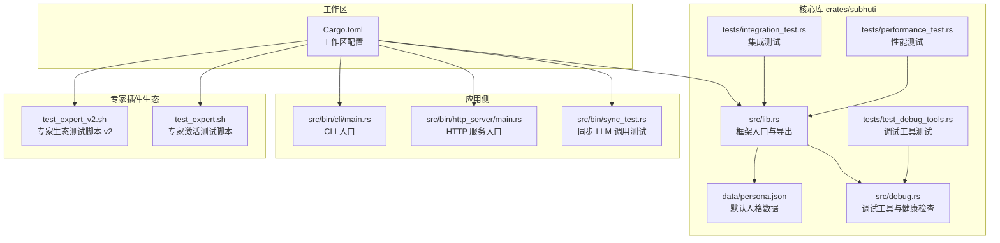
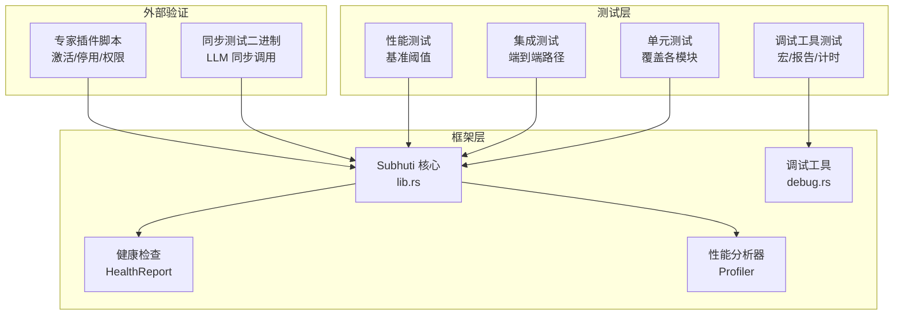
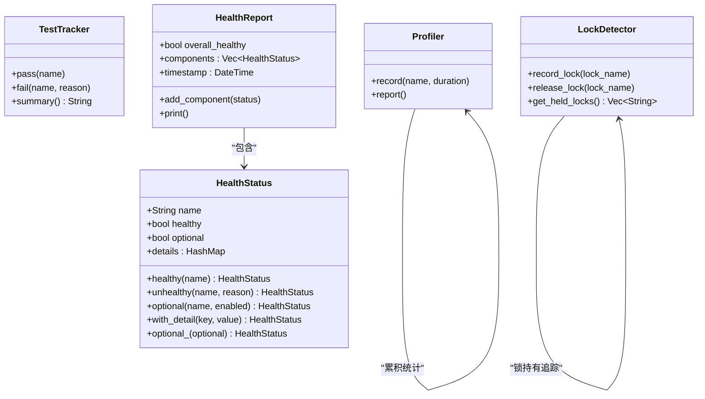
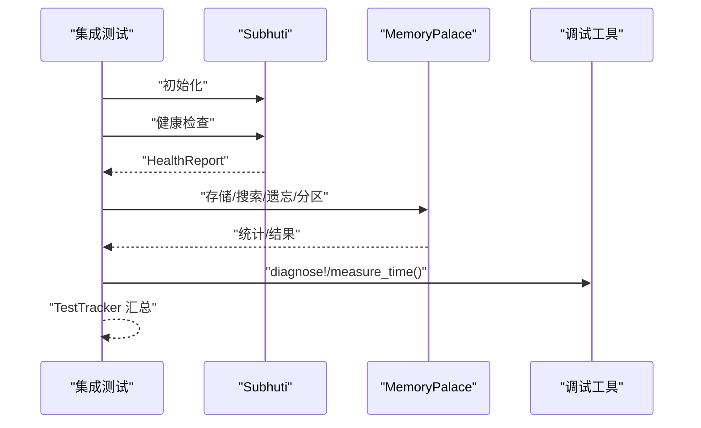
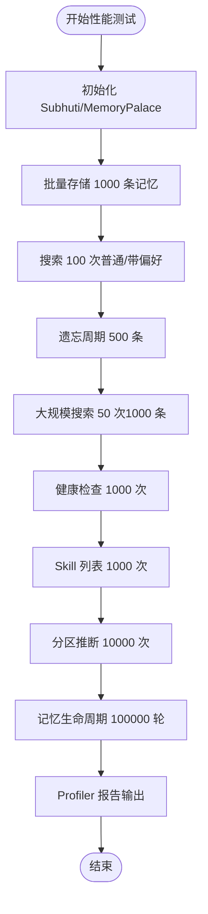
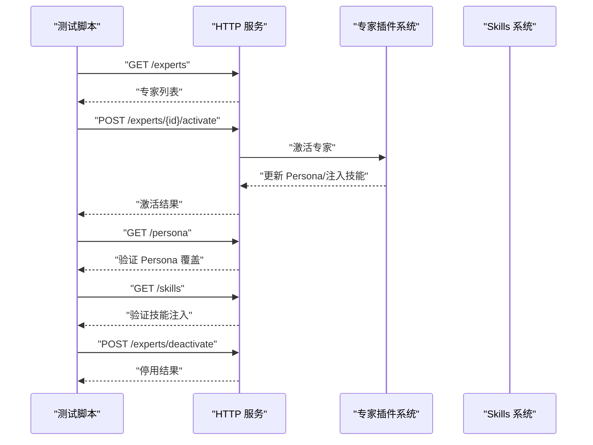
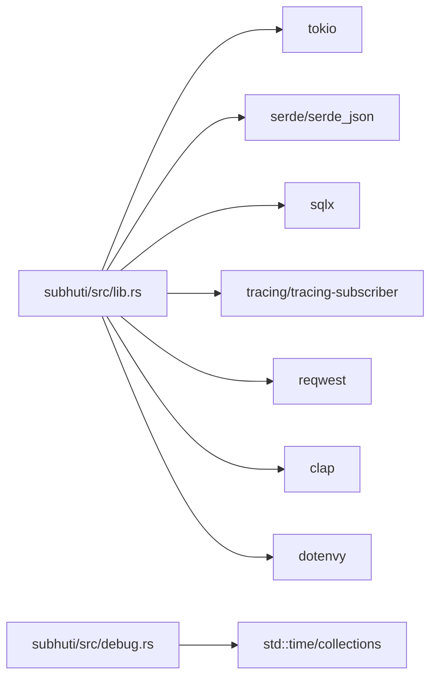
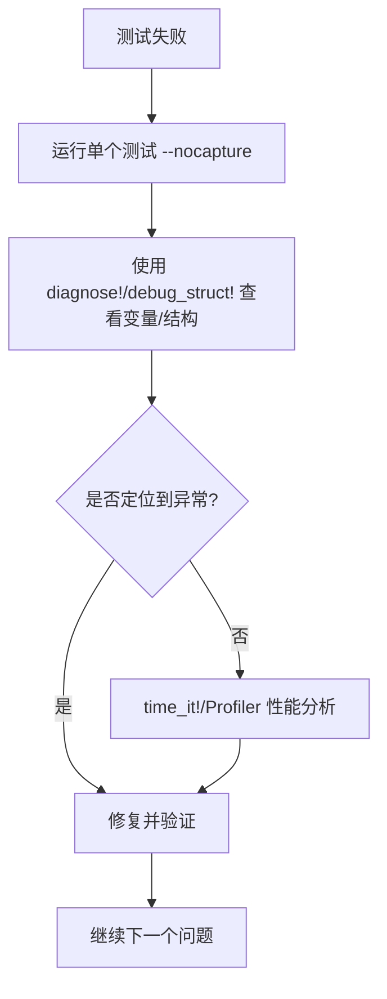

# 测试与调试

<cite>
**本文引用的文件**
- [crates/subhuti/Cargo.toml](file://crates/subhuti/Cargo.toml)
- [crates/subhuti/src/lib.rs](file://crates/subhuti/src/lib.rs)
- [crates/subhuti/src/debug.rs](file://crates/subhuti/src/debug.rs)
- [crates/subhuti/tests/integration_test.rs](file://crates/subhuti/tests/integration_test.rs)
- [crates/subhuti/tests/performance_test.rs](file://crates/subhuti/tests/performance_test.rs)
- [crates/subhuti/tests/test_debug_tools.rs](file://crates/subhuti/tests/test_debug_tools.rs)
- [src/bin/sync_test.rs](file://src/bin/sync_test.rs)
- [Cargo.toml](file://Cargo.toml)
- [docs/DEBUG_TOOLS.md](file://docs/DEBUG_TOOLS.md)
- [docs/DEBUG_TOOLS_GUIDE.md](file://docs/DEBUG_TOOLS_GUIDE.md)
- [docs/DEBUG_TOOLS_SUMMARY.md](file://docs/DEBUG_TOOLS_SUMMARY.md)
- [crates/subhuti/data/persona.json](file://crates/subhuti/data/persona.json)
- [test_expert.sh](file://test_expert.sh)
- [test_expert_v2.sh](file://test_expert_v2.sh)
</cite>

## 目录
1. [简介](#简介)
2. [项目结构](#项目结构)
3. [核心组件](#核心组件)
4. [架构总览](#架构总览)
5. [详细组件分析](#详细组件分析)
6. [依赖关系分析](#依赖关系分析)
7. [性能考量](#性能考量)
8. [故障排查指南](#故障排查指南)
9. [结论](#结论)
10. [附录](#附录)

## 简介
本指南面向 Subhuti 框架的开发者与测试工程师，系统阐述如何编写与执行单元测试、集成测试、性能测试与压力测试；如何使用调试工具进行日志分析、断点调试、性能分析与死锁/锁竞争诊断；以及如何准备测试数据、搭建测试环境、配置持续集成与发布流程。同时给出常见 Bug 类型的识别与修复方法、测试覆盖率与质量保证流程、缺陷跟踪管理建议。

## 项目结构
Subhuti 采用多 crate 的工作区组织方式，核心库位于 crates/subhuti，应用侧包含 HTTP 服务器、CLI、同步测试二进制等。测试覆盖单元测试、集成测试、性能测试与调试工具测试，并配套专家插件生态的端到端脚本。

**图表来源**
- [Cargo.toml:1-58](file://Cargo.toml#L1-L58)
- [crates/subhuti/src/lib.rs:1-120](file://crates/subhuti/src/lib.rs#L1-L120)
- [crates/subhuti/src/debug.rs:1-60](file://crates/subhuti/src/debug.rs#L1-L60)
- [crates/subhuti/tests/integration_test.rs:1-40](file://crates/subhuti/tests/integration_test.rs#L1-L40)
- [crates/subhuti/tests/performance_test.rs:1-40](file://crates/subhuti/tests/performance_test.rs#L1-L40)
- [crates/subhuti/tests/test_debug_tools.rs:1-20](file://crates/subhuti/tests/test_debug_tools.rs#L1-L20)
- [src/bin/sync_test.rs:1-20](file://src/bin/sync_test.rs#L1-L20)
- [test_expert.sh:1-20](file://test_expert.sh#L1-L20)
- [test_expert_v2.sh:1-20](file://test_expert_v2.sh#L1-L20)

**章节来源**
- [Cargo.toml:1-58](file://Cargo.toml#L1-L58)
- [crates/subhuti/Cargo.toml:1-63](file://crates/subhuti/Cargo.toml#L1-L63)

## 核心组件
- 调试工具与健康检查：提供诊断宏、断言宏、计时宏、结构调试、健康报告、性能分析器、锁竞争检测器等，贯穿开发、测试与运维。
- 集成测试：覆盖初始化、健康检查、心灵宫殿存储/搜索/遗忘/分区、人格系统、Skills、专家插件等关键路径。
- 性能测试：对核心组件进行基准测试，设定阈值并输出统计报告。
- 同步测试二进制：验证 LLM 同步调用链路。
- 专家插件生态脚本：验证专家插件的安装、启用、激活、停用与权限/沙箱配置。

**章节来源**
- [crates/subhuti/src/debug.rs:128-384](file://crates/subhuti/src/debug.rs#L128-L384)
- [crates/subhuti/tests/integration_test.rs:21-190](file://crates/subhuti/tests/integration_test.rs#L21-L190)
- [crates/subhuti/tests/performance_test.rs:22-264](file://crates/subhuti/tests/performance_test.rs#L22-L264)
- [src/bin/sync_test.rs:8-32](file://src/bin/sync_test.rs#L8-L32)
- [test_expert.sh:1-118](file://test_expert.sh#L1-L118)
- [test_expert_v2.sh:1-143](file://test_expert_v2.sh#L1-L143)

## 架构总览
下图展示测试与调试在框架中的位置与交互关系，强调“测试驱动开发”和“可观测性”的结合。

**图表来源**
- [crates/subhuti/src/lib.rs:562-642](file://crates/subhuti/src/lib.rs#L562-L642)
- [crates/subhuti/src/debug.rs:298-350](file://crates/subhuti/src/debug.rs#L298-L350)
- [crates/subhuti/tests/integration_test.rs:196-382](file://crates/subhuti/tests/integration_test.rs#L196-L382)
- [crates/subhuti/tests/performance_test.rs:27-264](file://crates/subhuti/tests/performance_test.rs#L27-L264)
- [src/bin/sync_test.rs:8-32](file://src/bin/sync_test.rs#L8-L32)
- [test_expert.sh:5-118](file://test_expert.sh#L5-L118)
- [test_expert_v2.sh:5-143](file://test_expert_v2.sh#L5-L143)

## 详细组件分析

### 调试工具与健康检查
- 诊断宏与结构调试：快速打印变量名、值与类型，或完整结构体 Debug 内容，便于变量状态与数据结构核验。
- 计时宏与性能分析器：对关键路径进行计时，累积统计并输出最小/最大/平均耗时，辅助性能回归与瓶颈定位。
- 健康检查：一键检查记忆宫殿、数据库、心灵层、专家插件、Skills 等组件状态，支持可选组件与整体健康度汇总。
- 锁竞争检测器：记录锁持有与释放，辅助死锁与竞态问题诊断。
- 测试追踪器：结构化记录测试通过/失败与失败原因，输出简洁摘要。

**图表来源**
- [crates/subhuti/src/debug.rs:128-384](file://crates/subhuti/src/debug.rs#L128-L384)

**章节来源**
- [crates/subhuti/src/debug.rs:16-126](file://crates/subhuti/src/debug.rs#L16-L126)
- [crates/subhuti/src/debug.rs:128-384](file://crates/subhuti/src/debug.rs#L128-L384)
- [docs/DEBUG_TOOLS.md:1-386](file://docs/DEBUG_TOOLS.md#L1-L386)
- [docs/DEBUG_TOOLS_GUIDE.md:69-413](file://docs/DEBUG_TOOLS_GUIDE.md#L69-L413)

### 集成测试策略
- 覆盖路径：基础初始化、健康检查、心灵宫殿存储/搜索/遗忘/分区、人格系统、Skills、专家插件。
- 执行方式：使用测试追踪器记录每一步结果，配合诊断宏与计时宏输出详细日志。
- 健康检查：在测试末尾打印最终系统健康报告，确保组件状态正常。

**图表来源**
- [crates/subhuti/tests/integration_test.rs:21-190](file://crates/subhuti/tests/integration_test.rs#L21-L190)
- [crates/subhuti/src/lib.rs:562-642](file://crates/subhuti/src/lib.rs#L562-L642)
- [crates/subhuti/src/debug.rs:96-126](file://crates/subhuti/src/debug.rs#L96-L126)

**章节来源**
- [crates/subhuti/tests/integration_test.rs:21-190](file://crates/subhuti/tests/integration_test.rs#L21-L190)
- [crates/subhuti/tests/integration_test.rs:196-382](file://crates/subhuti/tests/integration_test.rs#L196-L382)

### 性能测试与压力测试
- 基准项：框架初始化、宫殿存储/搜索/遗忘/大规模搜索、健康检查、Skill 列表、分区推断、记忆生命周期等。
- 阈值设定：如“平均初始化 < 5ms”、“批量存储 < 5s/1000条”、“普通搜索 < 10ms/次”等。
- 统计输出：Profiler 输出调用次数、总耗时、平均耗时、最小/最大耗时，便于回归对比。

**图表来源**
- [crates/subhuti/tests/performance_test.rs:27-264](file://crates/subhuti/tests/performance_test.rs#L27-L264)
- [crates/subhuti/src/debug.rs:298-350](file://crates/subhuti/src/debug.rs#L298-L350)

**章节来源**
- [crates/subhuti/tests/performance_test.rs:22-264](file://crates/subhuti/tests/performance_test.rs#L22-L264)

### API 与端到端测试
- 专家插件激活测试：验证专家列表、当前激活专家、Persona 覆盖、技能注入、自动匹配与停用流程。
- 生态系统测试 v2：验证插件安装/启用/禁用、激活后的 Persona 与大五人格参数、技能注入、权限与沙箱配置。
- HTTP 服务：通过 curl 脚本验证健康检查、专家接口、技能列表等端点。

**图表来源**
- [test_expert.sh:5-118](file://test_expert.sh#L5-L118)
- [test_expert_v2.sh:5-143](file://test_expert_v2.sh#L5-L143)
- [crates/subhuti/src/lib.rs:274-320](file://crates/subhuti/src/lib.rs#L274-L320)

**章节来源**
- [test_expert.sh:1-118](file://test_expert.sh#L1-L118)
- [test_expert_v2.sh:1-143](file://test_expert_v2.sh#L1-L143)

### 同步测试与异步测试
- 同步测试二进制：验证 LLM 同步调用链路，便于在无异步运行时的环境中快速验证。
- 异步测试：在单元/集成/性能测试中广泛使用 tokio 异步运行时，确保并发与异步行为正确。

**章节来源**
- [src/bin/sync_test.rs:8-32](file://src/bin/sync_test.rs#L8-L32)
- [crates/subhuti/Cargo.toml:16-16](file://crates/subhuti/Cargo.toml#L16-L16)

### Mock 对象与测试隔离
- 开发依赖：使用 mockall 提供的宏与派生能力，为接口与 trait 构造可配置的 Mock 对象，隔离外部依赖（如 LLM API、数据库）。
- 建议实践：对易变外部依赖进行 Mock，确保测试稳定与可重复；对核心业务逻辑使用真实实现以验证行为。

**章节来源**
- [crates/subhuti/Cargo.toml:55-57](file://crates/subhuti/Cargo.toml#L55-L57)

### 测试数据准备与环境搭建
- 默认人格数据：使用 persona.json 作为初始心智配置，便于一致性测试。
- 环境变量：数据库、嵌入模型、LLM API 等可通过环境变量配置，便于本地与 CI 环境切换。
- 日志：tracing-subscriber 支持 env-filter 与 JSON 输出，便于测试日志采集与分析。

**章节来源**
- [crates/subhuti/data/persona.json:1-44](file://crates/subhuti/data/persona.json#L1-L44)
- [crates/subhuti/src/lib.rs:176-187](file://crates/subhuti/src/lib.rs#L176-L187)
- [Cargo.toml:30-30](file://Cargo.toml#L30-L30)

### 持续集成配置
- 工作区：通过 workspace 管理多 crate，统一版本与依赖解析。
- 二进制：定义 http_server、cli、sync_test 等可执行目标，便于 CI 中运行端到端与同步测试。
- 建议：在 CI 中分别运行单元测试、集成测试、性能测试与专家插件脚本，收集日志与报告。

**章节来源**
- [Cargo.toml:1-7](file://Cargo.toml#L1-L7)
- [Cargo.toml:13-24](file://Cargo.toml#L13-L24)

## 依赖关系分析
- 框架依赖 tokio、serde、sqlx、tracing、reqwest、clap、dotenvy 等，支撑异步运行、序列化、数据库、日志、网络与配置。
- 调试工具依赖标准库时间与集合类型，不引入额外运行时开销。
- 测试依赖 mockall、tempfile 等 dev-dependencies，确保测试隔离与临时文件管理。

**图表来源**
- [crates/subhuti/Cargo.toml:14-54](file://crates/subhuti/Cargo.toml#L14-L54)
- [crates/subhuti/src/lib.rs:1-82](file://crates/subhuti/src/lib.rs#L1-L82)
- [crates/subhuti/src/debug.rs:12-14](file://crates/subhuti/src/debug.rs#L12-L14)

**章节来源**
- [crates/subhuti/Cargo.toml:14-54](file://crates/subhuti/Cargo.toml#L14-L54)

## 性能考量
- 调试工具开销极低：诊断、计时、结构打印、测试追踪等工具单次调用开销通常在微秒级，可放心在开发与测试中使用。
- 性能分析器：建议在性能测试与回归测试中使用，输出最小/最大/平均耗时，便于对比优化效果。
- 健康检查：可在启动阶段与关键节点调用，避免对生产造成显著影响。

**章节来源**
- [docs/DEBUG_TOOLS_GUIDE.md:561-571](file://docs/DEBUG_TOOLS_GUIDE.md#L561-L571)
- [crates/subhuti/src/debug.rs:298-350](file://crates/subhuti/src/debug.rs#L298-L350)

## 故障排查指南
- 死锁与锁竞争：使用 LockDetector 记录锁持有与释放，结合 diagnose!/time_it! 定位卡顿点。
- 性能瓶颈：在关键路径使用 time_it!/Profiler，输出统计报告，识别热点。
- 状态不透明：使用 Subhuti::health_check 与 HealthReport，查看组件详情与整体健康度。
- 测试失败：使用 TestTracker 获取通过/失败摘要，结合 diagnose! 与 debug_struct! 快速定位变量与结构问题。

**图表来源**
- [docs/DEBUG_TOOLS_SUMMARY.md:116-154](file://docs/DEBUG_TOOLS_SUMMARY.md#L116-L154)
- [crates/subhuti/src/debug.rs:16-126](file://crates/subhuti/src/debug.rs#L16-L126)
- [crates/subhuti/src/debug.rs:298-350](file://crates/subhuti/src/debug.rs#L298-L350)

**章节来源**
- [docs/DEBUG_TOOLS_SUMMARY.md:1-245](file://docs/DEBUG_TOOLS_SUMMARY.md#L1-L245)
- [crates/subhuti/src/debug.rs:352-383](file://crates/subhuti/src/debug.rs#L352-L383)

## 结论
Subhuti 框架提供了完善的测试与调试基础设施：从诊断宏、断言宏、计时宏到健康检查、性能分析器与锁竞争检测器，覆盖开发、测试与运维全生命周期。通过集成测试、性能测试与专家插件端到端脚本，能够系统性保障框架稳定性与性能。建议在日常开发中积极使用这些工具，建立持续集成流水线，确保高质量交付。

## 附录

### 常见 Bug 类型与修复建议
- 死锁/竞态：使用 LockDetector 与 diagnose! 标记锁获取/释放点，确保锁粒度合理与释放顺序正确。
- 性能退化：使用 time_it!/Profiler 定位热点，优化算法或缓存策略。
- 状态不一致：使用 HealthReport 与 diagnose! 核验组件状态与关键字段。
- 外部依赖不稳定：使用 mockall 构造 Mock，隔离网络/数据库波动。

**章节来源**
- [crates/subhuti/src/debug.rs:352-383](file://crates/subhuti/src/debug.rs#L352-L383)
- [crates/subhuti/Cargo.toml:55-57](file://crates/subhuti/Cargo.toml#L55-L57)

### 测试覆盖率与质量保证流程
- 覆盖率：建议在 CI 中开启覆盖率统计，重点关注核心模块（记忆、心灵层、专家插件、运行时）。
- 质量门禁：设置性能阈值与健康检查通过门槛，阻断不达标变更。
- 缺陷跟踪：使用 TestTracker 与 HealthReport 生成可追溯的测试报告，结合日志与截图进行缺陷归档与复盘。

**章节来源**
- [docs/DEBUG_TOOLS_GUIDE.md:601-676](file://docs/DEBUG_TOOLS_GUIDE.md#L601-L676)