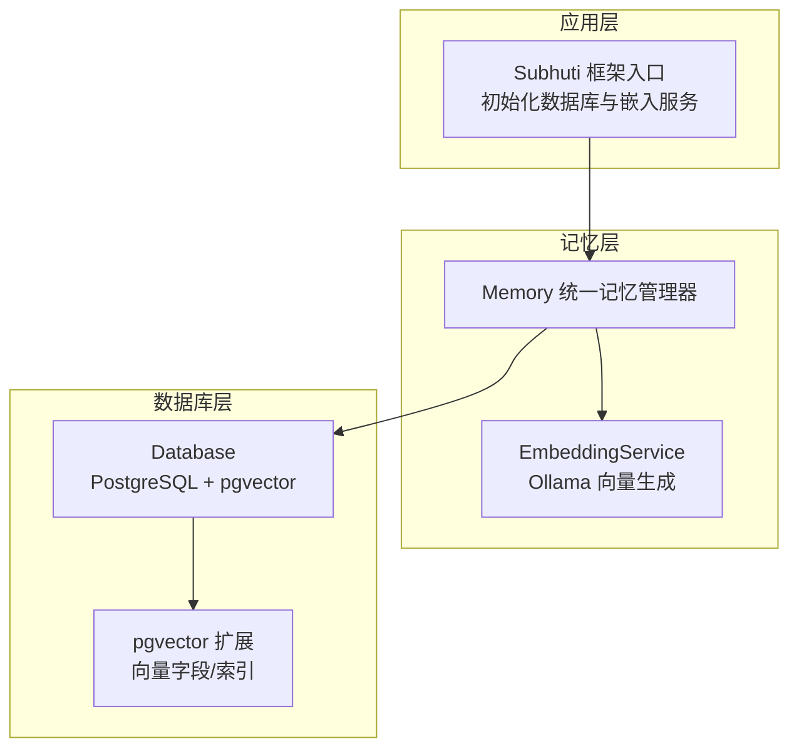
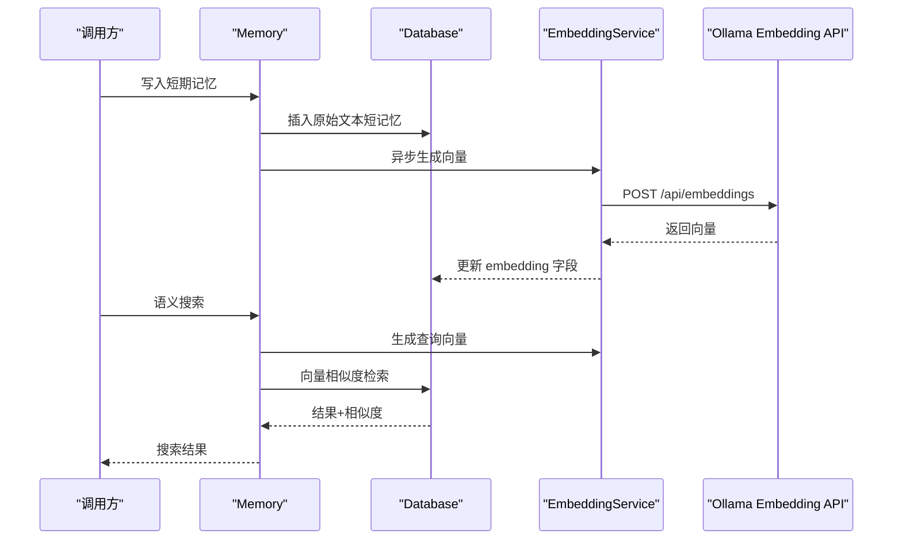
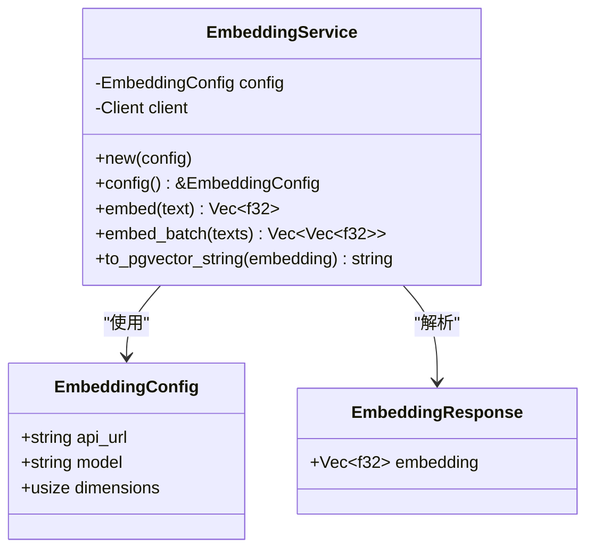
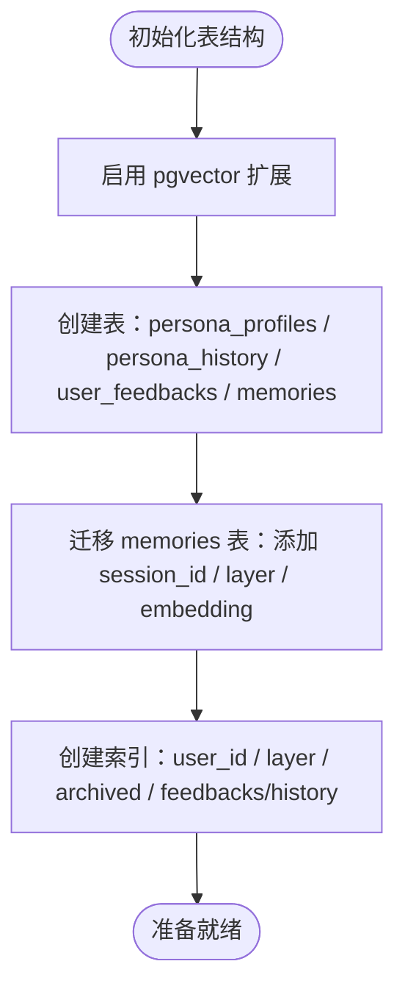
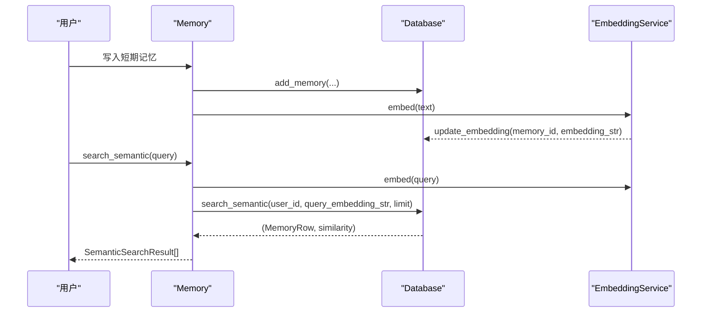
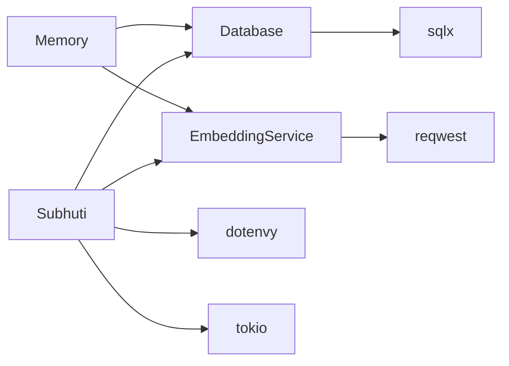

# 向量嵌入系统

<cite>
**本文引用的文件**
- [embedding.rs](file://crates/subhuti/src/memory/embedding.rs)
- [mod.rs（memory）](file://crates/subhuti/src/memory/mod.rs)
- [mod.rs（db）](file://crates/subhuti/src/db/mod.rs)
- [lib.rs](file://crates/subhuti/src/lib.rs)
- [performance_test.rs](file://crates/subhuti/tests/performance_test.rs)
- [Cargo.toml](file://Cargo.toml)
- [main.rs（CLI）](file://src/bin/cli/main.rs)
</cite>

## 目录
1. [简介](#简介)
2. [项目结构](#项目结构)
3. [核心组件](#核心组件)
4. [架构总览](#架构总览)
5. [详细组件分析](#详细组件分析)
6. [依赖关系分析](#依赖关系分析)
7. [性能考量](#性能考量)
8. [故障排除指南](#故障排除指南)
9. [结论](#结论)
10. [附录](#附录)

## 简介
本文件面向“向量嵌入系统”的技术文档，聚焦于 EmbeddingService 的设计与实现，涵盖文本向量化算法、向量维度配置、相似度计算方法；嵌入模型选择与配置、向量存储格式与索引策略；与数据库（PostgreSQL + pgvector）的集成方式与查询优化；初始化配置、批量处理能力与缓存机制；并提供模型对比分析、性能基准测试与部署指南，以及模型选择建议、参数调优方法与故障排除方案。

## 项目结构
- 向量嵌入位于 memory 模块中的 embedding 子模块，负责通过 Ollama 的 embedding API 生成文本向量，并提供与数据库层的交互能力。
- 数据库层（db 模块）负责 PostgreSQL 连接、表结构初始化、pgvector 扩展启用、向量字段与索引维护，以及基于向量的相似度检索。
- 记忆层（memory 模块）整合短期/长期/知识库三类记忆，并在开启数据库与嵌入服务时，实现“写入记忆即异步生成向量并入库”的双写策略。
- 框架入口（lib.rs）在初始化阶段可自动连接数据库与嵌入服务，便于整体系统启动时完成向量嵌入能力的装配。

图表来源
- [lib.rs:158-188](file://crates/subhuti/src/lib.rs#L158-L188)
- [mod.rs（memory）:163-258](file://crates/subhuti/src/memory/mod.rs#L163-L258)
- [mod.rs（db）:44-688](file://crates/subhuti/src/db/mod.rs#L44-L688)

章节来源
- [mod.rs（memory）:163-258](file://crates/subhuti/src/memory/mod.rs#L163-L258)
- [mod.rs（db）:44-688](file://crates/subhuti/src/db/mod.rs#L44-L688)
- [lib.rs:158-188](file://crates/subhuti/src/lib.rs#L158-L188)

## 核心组件
- EmbeddingService：封装 Ollama 的 embedding API，负责生成文本向量、批量生成、向量格式转换（pgvector 字符串）。
- Database：封装 PostgreSQL 连接、表结构初始化、pgvector 扩展启用、向量字段与索引维护、向量相似度检索。
- Memory：统一记忆管理器，负责短期/长期/知识库三类记忆，支持与数据库和嵌入服务联动，实现“写入即生成向量”的双写策略。
- Subhuti：框架入口，在初始化阶段自动连接数据库与嵌入服务，便于整体系统装配。

章节来源
- [embedding.rs:29-98](file://crates/subhuti/src/memory/embedding.rs#L29-L98)
- [mod.rs（db）:44-688](file://crates/subhuti/src/db/mod.rs#L44-L688)
- [mod.rs（memory）:163-444](file://crates/subhuti/src/memory/mod.rs#L163-L444)
- [lib.rs:158-188](file://crates/subhuti/src/lib.rs#L158-L188)

## 架构总览
- 文本向量化：EmbeddingService 通过 Ollama 的 embedding API 生成固定维度的浮点向量。
- 向量存储：Database 在 memories 表中新增 embedding vector(1024) 字段，启用 pgvector 扩展，支持向量相似度检索。
- 相似度计算：使用 PostgreSQL 的向量内核（cosine 距离），返回 1 - (embedding <=> query::vector) 作为相似度分数。
- 双写策略：Memory 在写入短期记忆时，异步生成向量并更新数据库 embedding 字段，实现持久化与向量检索能力。
- 查询优化：Database 提供多索引（user_id、layer、archived 等），并利用 pgvector 的向量索引加速相似度检索。

图表来源
- [mod.rs（memory）:269-311](file://crates/subhuti/src/memory/mod.rs#L269-L311)
- [embedding.rs:50-82](file://crates/subhuti/src/memory/embedding.rs#L50-L82)
- [mod.rs（db）:554-592](file://crates/subhuti/src/db/mod.rs#L554-L592)

章节来源
- [mod.rs（memory）:269-311](file://crates/subhuti/src/memory/mod.rs#L269-L311)
- [embedding.rs:50-82](file://crates/subhuti/src/memory/embedding.rs#L50-L82)
- [mod.rs（db）:554-592](file://crates/subhuti/src/db/mod.rs#L554-L592)

## 详细组件分析

### EmbeddingService 组件分析
- 设计要点
  - 配置化：EmbeddingConfig 支持自定义 Ollama API 地址、模型名与向量维度。
  - 单次与批量：embed 生成单个向量，embed_batch 提供串行批量生成（可扩展为并行）。
  - pgvector 格式：to_pgvector_string 将向量序列化为 SQL 可接受的向量字符串。
  - 错误处理：对非成功状态码进行错误聚合与日志告警。
- 数据结构与复杂度
  - 向量维度：默认 1024，与数据库 embedding vector(1024) 保持一致。
  - 时间复杂度：单次 embed 为 O(n)，n 为向量维度；批量为 O(m·n)，m 为文本数。
- 依赖关系
  - 依赖 reqwest 发送 HTTP 请求至 Ollama。
  - 依赖 serde_json 序列化请求体与解析响应。
- 优化建议
  - 批量生成可改为并发请求（注意 Ollama 限流与资源占用）。
  - 可引入本地缓存（如 LRU）减少重复生成，提升高频查询性能。

图表来源
- [embedding.rs:8-98](file://crates/subhuti/src/memory/embedding.rs#L8-L98)

章节来源
- [embedding.rs:8-98](file://crates/subhuti/src/memory/embedding.rs#L8-L98)

### Database 组件分析
- 设计要点
  - 连接池：PgPoolOptions 配置最大连接数，建立 PostgreSQL 连接。
  - 表结构初始化：启用 pgvector 扩展，创建 persona_profiles、persona_history、user_feedbacks、memories 等表。
  - 向量字段与索引：memories.embedding 为 vector(1024)，并创建 user_id、layer、archived 等索引。
  - 相似度检索：使用 1 - (embedding <=> query::vector) 计算相似度，按升序排列。
- 数据结构与复杂度
  - 向量维度：固定 1024，与 EmbeddingService 一致。
  - 相似度查询：依赖 pgvector 索引，复杂度取决于索引类型与数据量。
- 依赖关系
  - 依赖 sqlx 进行数据库操作。
  - 依赖 serde_json 处理 JSONB 字段。
- 优化建议
  - 在高并发场景下增加连接池大小与数据库资源。
  - 为 embedding 字段建立 ivfflat 或 hnsw 索引（需额外配置）以进一步提升相似度检索性能。

图表来源
- [mod.rs（db）:65-180](file://crates/subhuti/src/db/mod.rs#L65-L180)

章节来源
- [mod.rs（db）:65-180](file://crates/subhuti/src/db/mod.rs#L65-L180)
- [mod.rs（db）:554-592](file://crates/subhuti/src/db/mod.rs#L554-L592)

### Memory 组件分析
- 设计要点
  - 双写策略：写入短期记忆时，同步插入数据库并异步生成向量更新 embedding。
  - 语义搜索：当配置了数据库与嵌入服务时，可对查询文本生成向量并在数据库中进行相似度检索。
  - 记忆分层：短期、长期、知识库三类记忆，分别对应不同的检索与存储策略。
- 数据流
  - 写入：短期记忆写入数据库后，触发异步任务生成向量并更新 embedding。
  - 搜索：语义搜索时，生成查询向量，调用数据库相似度检索接口，返回按相似度排序的结果。
- 依赖关系
  - 依赖 Database 进行持久化与检索。
  - 依赖 EmbeddingService 生成向量。
- 优化建议
  - 异步生成向量可引入队列或批处理，降低瞬时负载。
  - 对高频查询结果可引入本地缓存（LRU）以减少重复向量生成与数据库查询。

图表来源
- [mod.rs（memory）:269-311](file://crates/subhuti/src/memory/mod.rs#L269-L311)
- [mod.rs（memory）:385-407](file://crates/subhuti/src/memory/mod.rs#L385-L407)
- [embedding.rs:50-82](file://crates/subhuti/src/memory/embedding.rs#L50-L82)
- [mod.rs（db）:554-592](file://crates/subhuti/src/db/mod.rs#L554-L592)

章节来源
- [mod.rs（memory）:269-311](file://crates/subhuti/src/memory/mod.rs#L269-L311)
- [mod.rs（memory）:385-407](file://crates/subhuti/src/memory/mod.rs#L385-L407)

### Subhuti 初始化与装配
- 设计要点
  - init_database：创建 Database 连接并初始化表结构，随后将数据库连接传递给记忆系统与心灵层。
  - 自动装配嵌入服务：根据环境变量（OLLAMA_URL、EMBEDDING_MODEL）创建 EmbeddingService 并注入记忆系统。
- 依赖关系
  - 依赖 dotenvy 加载环境变量。
  - 依赖 tokio 运行时进行异步初始化。
- 优化建议
  - 在生产环境中建议显式配置环境变量，避免默认值导致的不可预期行为。
  - 可引入健康检查与重试机制，提升初始化稳定性。

章节来源
- [lib.rs:158-188](file://crates/subhuti/src/lib.rs#L158-L188)

## 依赖关系分析
- 外部依赖
  - reqwest：HTTP 客户端，用于调用 Ollama 的 embedding API。
  - sqlx：PostgreSQL 异步驱动，负责连接池、查询与迁移。
  - serde/serde_json：序列化与反序列化，用于请求体与响应体处理。
  - tokio：异步运行时，支撑嵌入生成与数据库操作。
  - dotenvy：环境变量加载，支持 Ollama 与 API Key 的配置。
- 内部耦合
  - Memory 与 Database、EmbeddingService 存在运行时耦合，通过 Arc 共享与 RwLock 保护。
  - Subhuti 作为入口，协调数据库与嵌入服务的初始化与注入。

图表来源
- [embedding.rs:31-43](file://crates/subhuti/src/memory/embedding.rs#L31-L43)
- [mod.rs（db）:46-58](file://crates/subhuti/src/db/mod.rs#L46-L58)
- [lib.rs:158-188](file://crates/subhuti/src/lib.rs#L158-L188)
- [Cargo.toml:25-58](file://Cargo.toml#L25-L58)

章节来源
- [Cargo.toml:25-58](file://Cargo.toml#L25-L58)
- [lib.rs:158-188](file://crates/subhuti/src/lib.rs#L158-L188)

## 性能考量
- 嵌入生成性能
  - 单次生成：受 Ollama 服务性能与模型大小影响，建议在高并发场景下评估限流与资源占用。
  - 批量生成：当前实现为串行，可考虑并发优化（需关注 Ollama 的并发限制与资源竞争）。
- 数据库检索性能
  - 相似度检索依赖 pgvector 索引，建议在大数据量场景下评估 ivfflat 或 hnsw 索引配置。
  - 索引策略：user_id、layer、archived 等已有索引，可结合业务查询模式进一步优化。
- 缓存与去重
  - 可引入本地缓存（如 LRU）减少重复向量生成与数据库查询。
  - 对高频查询结果进行缓存，设定 TTL 与失效策略。
- 资源与并发
  - 连接池大小与数据库资源需与业务负载匹配，避免阻塞与超时。
  - 异步任务队列可平滑瞬时高峰，提升系统稳定性。

章节来源
- [performance_test.rs:22-295](file://crates/subhuti/tests/performance_test.rs#L22-L295)

## 故障排除指南
- Ollama 未运行或模型未拉取
  - 现象：嵌入生成失败，返回 API 错误。
  - 处理：安装 Ollama 并拉取 bge-m3 模型；检查 OLLAMA_URL 与 EMBEDDING_MODEL 环境变量。
- PostgreSQL 未安装或 pgvector 未启用
  - 现象：初始化表结构失败或向量字段创建异常。
  - 处理：安装 PostgreSQL 并启用 pgvector 扩展；检查数据库连接凭据与权限。
- 向量维度不匹配
  - 现象：嵌入维度与数据库 embedding 字段不一致。
  - 处理：迁移时若发现维度不一致，系统会发出警告并重建 embedding 字段。
- 相似度检索异常
  - 现象：相似度查询返回空或异常。
  - 处理：确认 embedding 字段已正确更新且非空；检查查询向量格式与数据库连接状态。

章节来源
- [embedding.rs:65-79](file://crates/subhuti/src/memory/embedding.rs#L65-L79)
- [mod.rs（db）:214-244](file://crates/subhuti/src/db/mod.rs#L214-L244)
- [main.rs（CLI）:347-414](file://src/bin/cli/main.rs#L347-L414)

## 结论
本向量嵌入系统以 EmbeddingService 为核心，结合 Database 的 pgvector 能力，实现了从文本向量化到向量检索的完整闭环。通过 Memory 的双写策略，系统在保证数据持久化的同时，提供了高效的语义检索能力。在生产环境中，建议结合并发优化、缓存策略与索引优化，持续提升性能与稳定性。

## 附录

### 模型选择与配置建议
- 模型选择
  - bge-m3：默认模型，适合通用语义检索，维度 1024。
  - 其他模型：可根据任务需求选择不同维度与语种的模型，注意与数据库 embedding 字段维度保持一致。
- 配置项
  - OLLAMA_URL：Ollama 服务地址。
  - EMBEDDING_MODEL：嵌入模型名称。
  - DbConfig：数据库连接参数（host、port、database、username、password、max_connections）。

章节来源
- [embedding.rs:19-27](file://crates/subhuti/src/memory/embedding.rs#L19-L27)
- [mod.rs（db）:11-42](file://crates/subhuti/src/db/mod.rs#L11-L42)

### 相似度计算方法
- 计算公式：1 - (embedding <=> query::vector)，值越小越相似。
- 返回值：MemoryRow + 相似度（f32）。

章节来源
- [mod.rs（db）:554-592](file://crates/subhuti/src/db/mod.rs#L554-L592)

### 向量存储格式与索引策略
- 存储格式：向量以字符串形式存储，格式为 “[v1,v2,...,vn]”，由 EmbeddingService.to_pgvector_string 生成。
- 索引策略：memories 表包含 embedding vector(1024) 字段；已有 user_id、layer、archived 等索引；可结合业务场景评估 ivfflat/hnsw 索引。

章节来源
- [embedding.rs:93-98](file://crates/subhuti/src/memory/embedding.rs#L93-L98)
- [mod.rs（db）:138-180](file://crates/subhuti/src/db/mod.rs#L138-L180)

### 初始化与部署指南
- 初始化步骤
  - 安装并启动 Ollama，拉取 bge-m3 模型。
  - 安装 PostgreSQL 并启用 pgvector 扩展。
  - 配置环境变量（OLLAMA_URL、EMBEDDING_MODEL、数据库连接等）。
  - 启动 Subhuti，init_database 将自动完成表结构初始化与嵌入服务装配。
- 部署建议
  - 生产环境建议使用独立的 Ollama 服务与数据库实例。
  - 配置连接池大小与资源上限，监控嵌入生成与数据库查询性能。
  - 引入健康检查与重试机制，确保系统稳定运行。

章节来源
- [lib.rs:158-188](file://crates/subhuti/src/lib.rs#L158-L188)
- [main.rs（CLI）:347-414](file://src/bin/cli/main.rs#L347-L414)