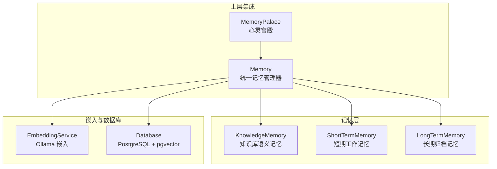
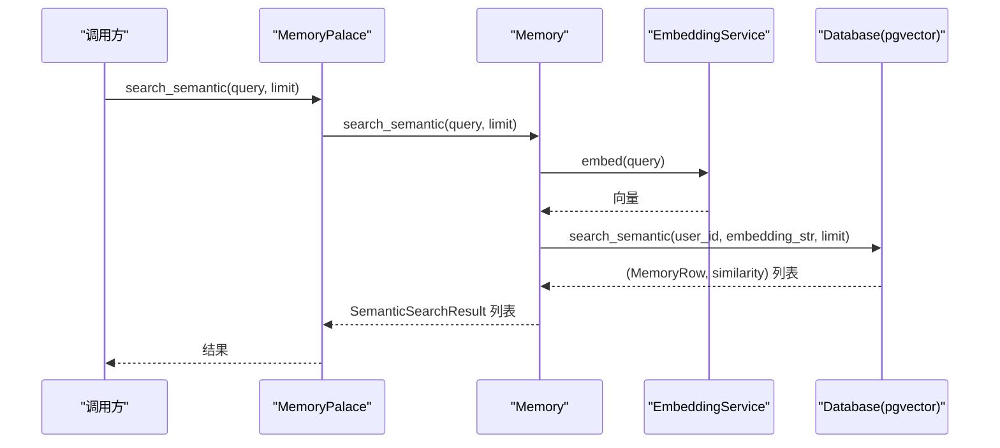
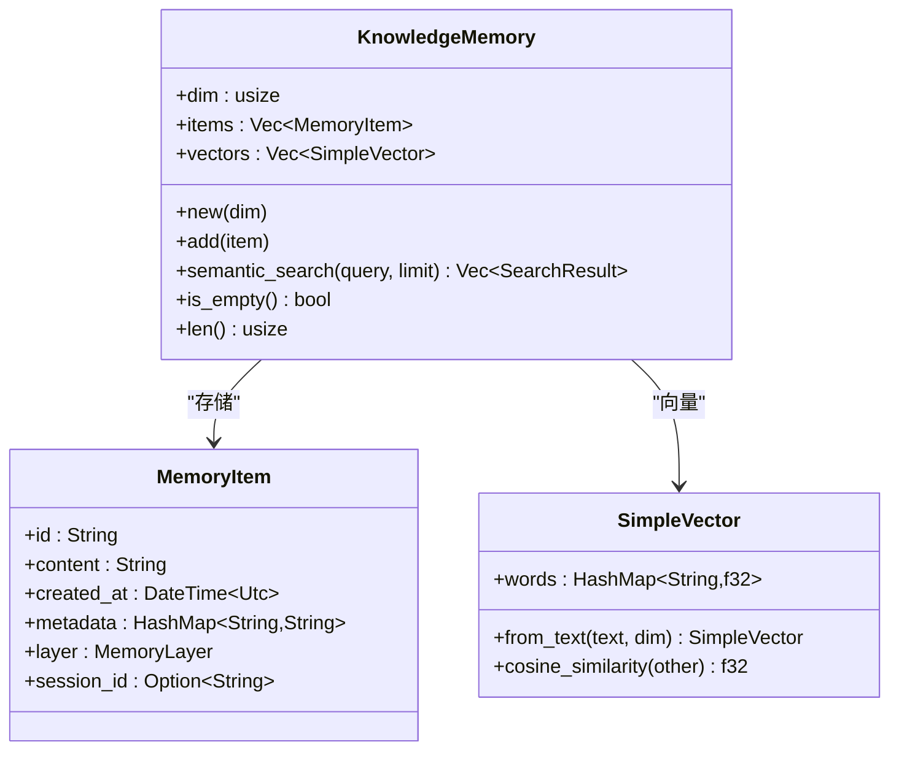
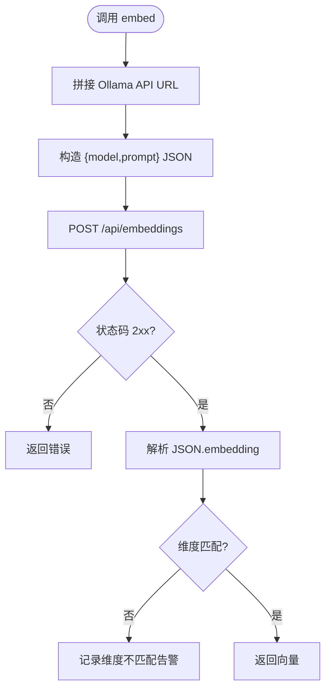
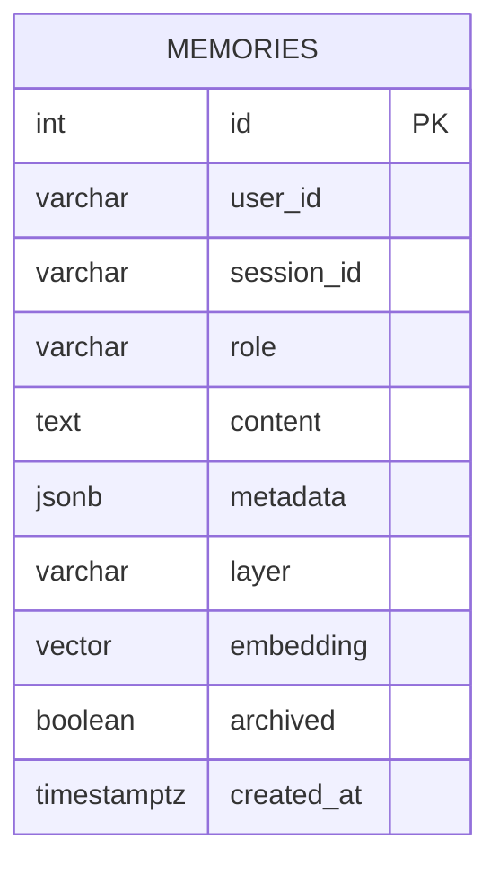
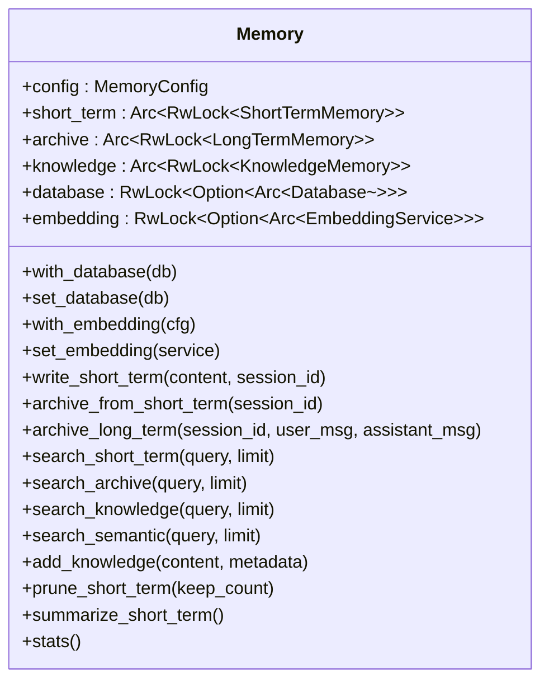
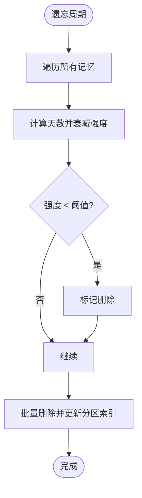
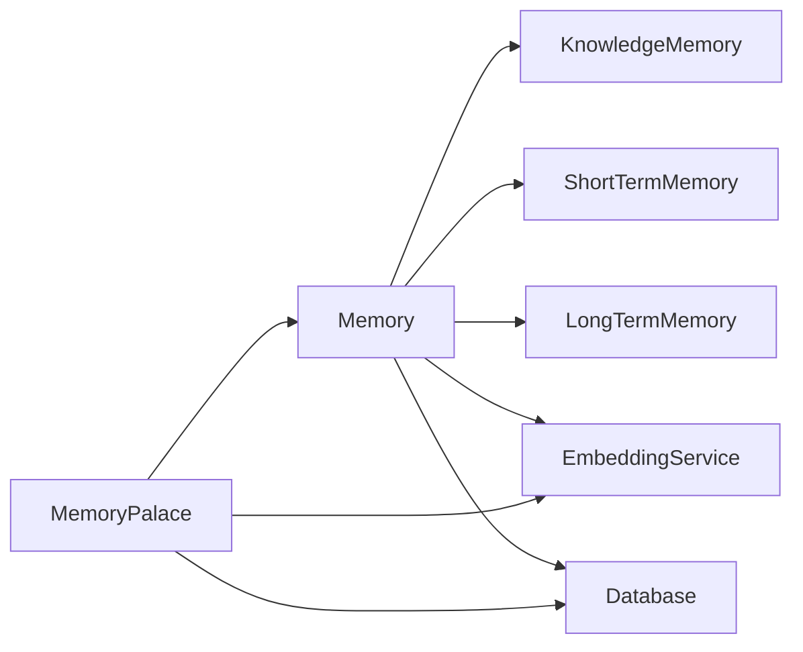

# 知识库

<cite>
**本文引用的文件**
- [knowledge.rs](file://crates/subhuti/src/memory/knowledge.rs)
- [embedding.rs](file://crates/subhuti/src/memory/embedding.rs)
- [mod.rs](file://crates/subhuti/src/memory/mod.rs)
- [long_term.rs](file://crates/subhuti/src/memory/long_term.rs)
- [short_term.rs](file://crates/subhuti/src/memory/short_term.rs)
- [palace.rs](file://crates/subhuti/src/soul/palace.rs)
- [db/mod.rs](file://crates/subhuti/src/db/mod.rs)
- [lib.rs](file://crates/subhuti/src/lib.rs)
- [Cargo.toml](file://Cargo.toml)
</cite>

## 目录
1. [简介](#简介)
2. [项目结构](#项目结构)
3. [核心组件](#核心组件)
4. [架构总览](#架构总览)
5. [详细组件分析](#详细组件分析)
6. [依赖关系分析](#依赖关系分析)
7. [性能考量](#性能考量)
8. [故障排查指南](#故障排查指南)
9. [结论](#结论)
10. [附录](#附录)

## 简介
本文件面向“知识库”（KnowledgeMemory）系统，提供从数据模型、向量索引构建、语义检索到版本管理与扩展的完整技术文档。知识库负责结构化知识与外部文档的向量化存储与检索，结合数据库与嵌入服务实现高效语义搜索，并通过心灵宫殿（MemoryPalace）提供分区、重要性与联想网络等高级记忆治理能力。本文还涵盖批量导入导出、质量评估与维护策略，以及与外部嵌入服务（如 Ollama）和数据库（PostgreSQL + pgvector）的集成方式。

## 项目结构
- 记忆层（Memory Layer）：短期/长期/知识库三类记忆，统一接口与配置。
- 嵌入服务（EmbeddingService）：对接 Ollama 的 embedding API，生成向量并支持 pgvector 格式。
- 数据库（Database）：PostgreSQL + pgvector，提供向量相似度检索与持久化。
- 心灵宫殿（MemoryPalace）：在记忆基础上增加分区、重要性、联想网络与遗忘周期等高级治理。

图表来源
- [mod.rs:163-444](file://crates/subhuti/src/memory/mod.rs#L163-L444)
- [palace.rs:228-316](file://crates/subhuti/src/soul/palace.rs#L228-L316)
- [db/mod.rs:44-63](file://crates/subhuti/src/db/mod.rs#L44-L63)
- [embedding.rs:29-98](file://crates/subhuti/src/memory/embedding.rs#L29-L98)

章节来源
- [mod.rs:1-52](file://crates/subhuti/src/memory/mod.rs#L1-L52)
- [lib.rs:22-33](file://crates/subhuti/src/lib.rs#L22-L33)

## 核心组件
- Memory：统一记忆管理器，聚合短期、长期与知识库，支持双写数据库与嵌入服务。
- KnowledgeMemory：知识库语义记忆，内置简化向量与余弦相似度，支持语义搜索。
- EmbeddingService：嵌入服务，对接 Ollama，生成向量并转为 pgvector 字符串。
- Database：PostgreSQL + pgvector，提供向量相似度检索与表结构初始化。
- MemoryPalace：在 Memory 基础上扩展分区、重要性、联想网络与遗忘周期。

章节来源
- [mod.rs:163-444](file://crates/subhuti/src/memory/mod.rs#L163-L444)
- [knowledge.rs:69-165](file://crates/subhuti/src/memory/knowledge.rs#L69-L165)
- [embedding.rs:29-98](file://crates/subhuti/src/memory/embedding.rs#L29-L98)
- [db/mod.rs:44-180](file://crates/subhuti/src/db/mod.rs#L44-L180)
- [palace.rs:228-316](file://crates/subhuti/src/soul/palace.rs#L228-L316)

## 架构总览
知识库的检索路径分为两条：
- 简化实现：Memory.knowledge 内部向量与余弦相似度，适合演示与小规模数据。
- 生产实现：MemoryPalace.search_semantic -> Memory.search_semantic -> EmbeddingService.embed -> Database.search_semantic，基于数据库 pgvector 的向量相似度检索。

图表来源
- [palace.rs:575-578](file://crates/subhuti/src/soul/palace.rs#L575-L578)
- [mod.rs:389-407](file://crates/subhuti/src/memory/mod.rs#L389-L407)
- [embedding.rs:50-82](file://crates/subhuti/src/memory/embedding.rs#L50-L82)
- [db/mod.rs:554-592](file://crates/subhuti/src/db/mod.rs#L554-L592)

## 详细组件分析

### 知识库（KnowledgeMemory）
- 数据模型
  - MemoryItem：唯一ID、内容、创建时间、元数据、记忆层级、会话ID。
  - SimpleVector：简化向量（词袋 + 归一化），用于演示。
- 向量索引与检索
  - add：将内容转为 SimpleVector 并存入 items/vectors。
  - semantic_search：对查询生成 SimpleVector，计算与所有向量的余弦相似度，排序取前 limit。
- 版本管理与容量
  - 默认维度 384；可通过 MemoryConfig.knowledge_dim 调整。
  - 支持 clear 清空；is_empty/len 辅助统计。

图表来源
- [knowledge.rs:69-165](file://crates/subhuti/src/memory/knowledge.rs#L69-L165)
- [mod.rs:54-96](file://crates/subhuti/src/memory/mod.rs#L54-L96)

章节来源
- [knowledge.rs:16-165](file://crates/subhuti/src/memory/knowledge.rs#L16-L165)
- [mod.rs:54-96](file://crates/subhuti/src/memory/mod.rs#L54-L96)

### 嵌入服务（EmbeddingService）
- 配置
  - api_url、model、dimensions；默认 bge-m3:latest，1024 维。
- 能力
  - embed：POST /api/embeddings，校验状态码与维度，返回向量。
  - embed_batch：串行批量生成（可并行优化）。
  - to_pgvector_string：将向量格式化为 [v1,v2,...] 字符串，便于 SQL 写入。
- 错误处理
  - 非 2xx 状态码时返回错误；维度不匹配发出告警。

图表来源
- [embedding.rs:50-91](file://crates/subhuti/src/memory/embedding.rs#L50-L91)

章节来源
- [embedding.rs:8-98](file://crates/subhuti/src/memory/embedding.rs#L8-L98)

### 数据库（Database + pgvector）
- 表结构
  - memories：id、user_id、session_id、role、content、metadata、layer、embedding(vector)、archived、created_at。
  - 索引：user_id、layer、archived、embedding。
- 能力
  - search_semantic：使用向量内积（1 - (embedding <=> ?)）进行相似度排序。
  - update_embedding：将生成的向量字符串写回 embedding 列。
  - 迁移：确保 embedding 列存在且维度正确。
- 双写策略
  - Memory.write_short_term/archive/archive_long_term 时，同时写入数据库并异步生成向量。

图表来源
- [db/mod.rs:138-177](file://crates/subhuti/src/db/mod.rs#L138-L177)

章节来源
- [db/mod.rs:66-244](file://crates/subhuti/src/db/mod.rs#L66-L244)
- [db/mod.rs:554-592](file://crates/subhuti/src/db/mod.rs#L554-L592)

### 统一记忆管理器（Memory）
- 组成
  - short_term、archive、knowledge 三个子记忆，Arc + RwLock 线程安全。
  - database、embedding 可选，运行时可设置。
- 能力
  - 写入短期记忆并双写数据库与异步生成向量。
  - 归档短期记忆到长期。
  - 知识库添加 add_knowledge。
  - 语义搜索 search_semantic：生成查询向量 -> 数据库向量检索 -> 返回 SemanticSearchResult。
  - 统计 stats、裁剪 prune_short_term、摘要 summarize_short_term。

图表来源
- [mod.rs:163-444](file://crates/subhuti/src/memory/mod.rs#L163-L444)

章节来源
- [mod.rs:198-444](file://crates/subhuti/src/memory/mod.rs#L198-L444)

### 心灵宫殿（MemoryPalace）
- 分区（MemoryZone）
  - DailyChat、ExpertKnowledge、Emotional、TaskProgress、CreativeIdeas、Default。
  - infer_from_content 基于关键词推断分区。
- 重要性（MemoryImportance）
  - Trivial、Normal、Important、Core，影响遗忘速率。
- 联想网络（Associated IDs）
  - 双向关联，检索时可增强相关记忆强度。
- 遗忘周期（Forget Cycle）
  - 按重要性与时间衰减，低于阈值则删除。
- 能力
  - store/store_in_zone：写入记忆并自动分区。
  - search：全文匹配 + 记忆强度加权，支持人格偏置。
  - search_semantic：委托 Memory.search_semantic。
  - run_forget_cycle：执行遗忘清理。

图表来源
- [palace.rs:582-635](file://crates/subhuti/src/soul/palace.rs#L582-L635)

章节来源
- [palace.rs:34-115](file://crates/subhuti/src/soul/palace.rs#L34-L115)
- [palace.rs:118-224](file://crates/subhuti/src/soul/palace.rs#L118-L224)
- [palace.rs:228-765](file://crates/subhuti/src/soul/palace.rs#L228-L765)

## 依赖关系分析
- 内部依赖
  - Memory 依赖 knowledge.rs、short_term.rs、long_term.rs、embedding.rs、db/mod.rs。
  - MemoryPalace 依赖 Memory、EmbeddingService、Database。
- 外部依赖
  - reqwest：调用 Ollama。
  - sqlx + pgvector：PostgreSQL 向量检索。
  - serde/chrono/uuid：序列化、时间与标识。
  - tokio：异步任务与并发。

图表来源
- [mod.rs:16-19](file://crates/subhuti/src/memory/mod.rs#L16-L19)
- [palace.rs:24-30](file://crates/subhuti/src/soul/palace.rs#L24-L30)

章节来源
- [Cargo.toml:25-58](file://Cargo.toml#L25-L58)

## 性能考量
- 简化知识库
  - 线性扫描向量列表，时间复杂度 O(n·d)，其中 n 为知识条目数，d 为词袋维度。
  - 适合小规模演示；大规模需引入向量数据库（如 Qdrant、Chroma）。
- 生产向量检索
  - 使用 pgvector 的向量索引与内积相似度，性能优于内存线性扫描。
  - 建议：
    - 合理设置维度与索引类型。
    - 控制并发与批处理大小，避免 Ollama 瞬时压力。
    - 对高频查询建立缓存（可选）。
- 内存与并发
  - MemoryPalace 使用 RwLock 保护共享状态，读多写少场景下读锁可并行。
  - 异步任务生成向量，避免阻塞主线程。

[本节为通用性能建议，不直接分析具体文件]

## 故障排查指南
- 嵌入服务不可用
  - 现象：Embedding API 返回非 2xx 或维度不匹配告警。
  - 排查：确认 Ollama 服务地址与模型可用；检查环境变量 OLLAMA_URL、EMBEDDING_MODEL。
- 数据库连接失败
  - 现象：初始化表失败或查询报错。
  - 排查：确认 PostgreSQL 连接信息、pgvector 扩展已启用；检查迁移逻辑。
- 向量相似度异常
  - 现象：相似度全 0 或极低。
  - 排查：确认嵌入维度一致；检查 to_pgvector_string 格式；验证数据库 embedding 列类型与维度。
- 记忆未归档
  - 现象：短期记忆未进入长期。
  - 排查：检查 archive_threshold 配置；确认 write_short_term 后触发归档逻辑。

章节来源
- [embedding.rs:65-79](file://crates/subhuti/src/memory/embedding.rs#L65-L79)
- [db/mod.rs:67-71](file://crates/subhuti/src/db/mod.rs#L67-L71)
- [db/mod.rs:214-240](file://crates/subhuti/src/db/mod.rs#L214-L240)
- [mod.rs:313-317](file://crates/subhuti/src/memory/mod.rs#L313-L317)

## 结论
知识库系统通过 Memory/KnowledgeMemory 提供简洁的向量检索能力，结合 MemoryPalace 实现分区、重要性与联想网络等高级治理；通过 Memory 与 Database/EmbeddingService 的双写与向量检索，形成完整的知识抽取、预处理、存储与检索闭环。对于生产环境，建议采用专业向量数据库与完善的索引策略，并配合缓存与并发控制提升性能与稳定性。

[本节为总结性内容，不直接分析具体文件]

## 附录

### 数据模型与元数据
- MemoryItem
  - 字段：id、content、created_at、metadata、layer、session_id。
  - 用途：统一承载短期、长期、知识库的记忆单元。
- MemoryLayer
  - 枚举：ShortTerm、Archive、Knowledge。
- 元数据管理
  - 通过 HashMap<String, String> 扩展键值对，支持分类标签、来源、版本等。

章节来源
- [mod.rs:54-108](file://crates/subhuti/src/memory/mod.rs#L54-L108)

### 内容分类策略
- 简化规则
  - 基于关键词集合（情感、任务、专家、创意、日常）推断分区。
- 心灵宫殿增强
  - infer_from_content 自动推断；store_in_zone 支持手动指定分区。
  - 重要性估算：长度、关键词命中、情感密度等综合打分。

章节来源
- [palace.rs:54-90](file://crates/subhuti/src/soul/palace.rs#L54-L90)
- [palace.rs:173-198](file://crates/subhuti/src/soul/palace.rs#L173-L198)

### 向量索引与相似度
- 简化实现
  - SimpleVector：词频归一化；余弦相似度。
- 生产实现
  - EmbeddingService：Ollama bge-m3；to_pgvector_string。
  - Database：pgvector 向量列；search_semantic 使用 1 - (embedding <=> ?) 排序。

章节来源
- [knowledge.rs:16-67](file://crates/subhuti/src/memory/knowledge.rs#L16-L67)
- [embedding.rs:94-98](file://crates/subhuti/src/memory/embedding.rs#L94-L98)
- [db/mod.rs:554-592](file://crates/subhuti/src/db/mod.rs#L554-L592)

### 检索优化算法
- 短期/长期检索
  - 短期：按会话索引与内容包含匹配。
  - 长期：关键词索引 + 内容包含匹配。
- 知识库检索
  - 简化：余弦相似度排序。
  - 生产：数据库向量索引 + 相似度排序。
- 心灵宫殿检索
  - 文本匹配 + 记忆强度加权；支持人格偏置；激活记忆增强相关强度。

章节来源
- [short_term.rs:135-146](file://crates/subhuti/src/memory/short_term.rs#L135-L146)
- [long_term.rs:105-116](file://crates/subhuti/src/memory/long_term.rs#L105-L116)
- [knowledge.rs:97-118](file://crates/subhuti/src/memory/knowledge.rs#L97-L118)
- [palace.rs:423-518](file://crates/subhuti/src/soul/palace.rs#L423-L518)

### 添加/删除/批量导入/导出/版本管理
- 添加
  - add_knowledge：写入知识库；store/store_in_zone：写入记忆并分区。
- 删除
  - KnowledgeMemory.clear：清空知识库；MemoryPalace.run_forget_cycle：按强度删除。
- 批量导入/导出
  - 批量导入：MemoryPalace.store_in_zone 循环写入；Database 提供 add_memory。
  - 批量导出：Database.get_recent_memories/search_memories_text。
- 版本管理
  - MemoryItem.is_expired：基于 TTL 过期检查；MemoryPalace.stats：统计分区与重要性分布。

章节来源
- [mod.rs:409-417](file://crates/subhuti/src/memory/mod.rs#L409-L417)
- [palace.rs:582-635](file://crates/subhuti/src/soul/palace.rs#L582-L635)
- [db/mod.rs:418-473](file://crates/subhuti/src/db/mod.rs#L418-L473)
- [mod.rs:90-96](file://crates/subhuti/src/memory/mod.rs#L90-L96)

### 配置参数说明
- MemoryConfig
  - short_term_capacity：短期记忆容量。
  - archive_threshold：短期记忆达到阈值后归档。
  - knowledge_dim：知识库向量维度。
  - ttl_seconds：记忆过期时间（秒）。
- EmbeddingConfig
  - api_url：Ollama API 地址。
  - model：嵌入模型名称。
  - dimensions：嵌入向量维度。
- DbConfig
  - host/port/database/username/password/max_connections：数据库连接参数。
- PalaceConfig
  - enable_zones、enable_forgetting、enable_association：功能开关。
  - forget_check_interval_secs、forget_threshold：遗忘周期与阈值。
  - association_depth、persona_influence_weight：联想深度与人格影响权重。

章节来源
- [mod.rs:30-52](file://crates/subhuti/src/memory/mod.rs#L30-L52)
- [embedding.rs:8-27](file://crates/subhuti/src/memory/embedding.rs#L8-L27)
- [db/mod.rs:11-42](file://crates/subhuti/src/db/mod.rs#L11-L42)
- [palace.rs:248-274](file://crates/subhuti/src/soul/palace.rs#L248-L274)

### 扩展方案
- 向量数据库
  - 替换 KnowledgeMemory 为专业向量库客户端（如 Qdrant、Chroma），保持 MemoryStore 接口。
- 模型与维度
  - 支持多模型切换与动态维度检测；在初始化阶段校验并迁移数据库列。
- 检索增强
  - 引入重排（re-ranking）、过滤条件（metadata）、混合检索（BM25 + 向量）。
- 维护与可观测性
  - 增加向量维度监控、索引统计、检索耗时追踪与缓存命中率。

[本节为扩展建议，不直接分析具体文件]