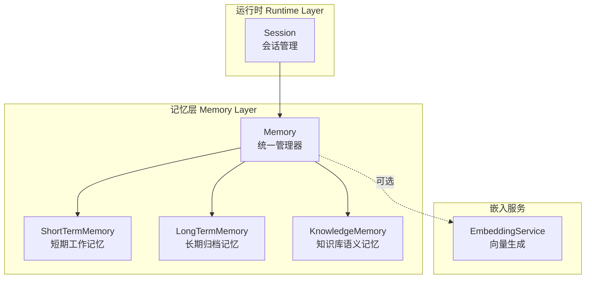
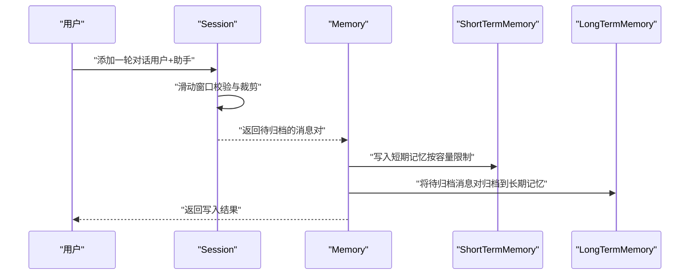
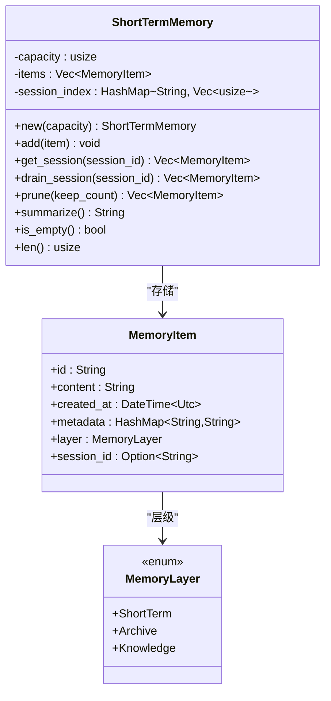
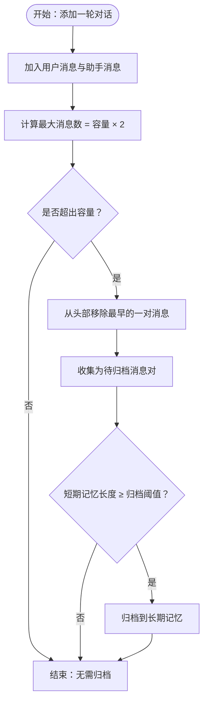
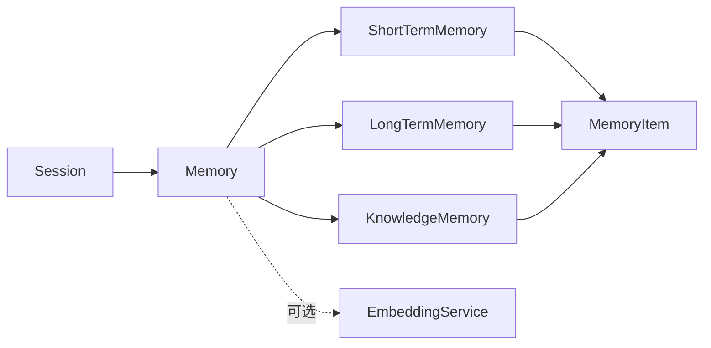

# 短期记忆

<cite>
**本文引用的文件**
- [short_term.rs](file://crates/subhuti/src/memory/short_term.rs)
- [mod.rs](file://crates/subhuti/src/memory/mod.rs)
- [session.rs](file://crates/subhuti/src/runtime/session.rs)
- [embedding.rs](file://crates/subhuti/src/memory/embedding.rs)
- [lib.rs](file://crates/subhuti/src/lib.rs)
- [integration_test.rs](file://crates/subhuti/tests/integration_test.rs)
</cite>

## 目录
1. [简介](#简介)
2. [项目结构](#项目结构)
3. [核心组件](#核心组件)
4. [架构总览](#架构总览)
5. [详细组件分析](#详细组件分析)
6. [依赖关系分析](#依赖关系分析)
7. [性能考量](#性能考量)
8. [故障排除指南](#故障排除指南)
9. [结论](#结论)
10. [附录](#附录)

## 简介
本文件面向短期记忆系统（ShortTermMemory）的技术文档，聚焦其设计原理与实现机制，包括：
- 临时存储机制与容量限制
- 会话绑定与自动清理策略
- 数据结构与滑动窗口算法
- FIFO 缓存实现与索引维护
- 与会话的绑定关系、内容过期机制与内存管理
- 增删改查与批量处理方法、性能优化技巧
- 配置参数说明、使用场景与最佳实践
- 故障排除与常见问题

短期记忆在本系统中承担“当前对话上下文”的职责，默认自动注入 LLM，超限时自动归档至长期记忆。

## 项目结构
短期记忆位于记忆层（Memory Layer）中，与长期记忆、知识库共同构成三层记忆体系。短期记忆通过统一的 Memory 管理器对外暴露写入、搜索、归档等能力，并与会话（Session）紧密耦合，形成滑动窗口的对话上下文。

图表来源
- [mod.rs:163-444](file://crates/subhuti/src/memory/mod.rs#L163-L444)
- [short_term.rs:10-158](file://crates/subhuti/src/memory/short_term.rs#L10-L158)
- [session.rs:67-315](file://crates/subhuti/src/runtime/session.rs#L67-L315)
- [embedding.rs:29-98](file://crates/subhuti/src/memory/embedding.rs#L29-L98)

章节来源
- [mod.rs:1-52](file://crates/subhuti/src/memory/mod.rs#L1-L52)
- [short_term.rs:1-18](file://crates/subhuti/src/memory/short_term.rs#L1-L18)
- [session.rs:1-41](file://crates/subhuti/src/runtime/session.rs#L1-L41)

## 核心组件
- ShortTermMemory：短期工作记忆容器，采用 Vec 存储，配合会话索引与容量限制实现滑动窗口。
- Memory：统一记忆管理器，负责写入短期记忆、触发自动归档、提供搜索与统计。
- Session：会话管理，定义短期记忆容量（消息对数量），实现滑动窗口添加与归档消息对。
- MemoryConfig：记忆配置，包含短期容量、归档阈值、向量维度、TTL 等。
- EmbeddingService：可选的向量服务，用于语义搜索与持久化时的向量生成。

章节来源
- [short_term.rs:10-158](file://crates/subhuti/src/memory/short_term.rs#L10-L158)
- [mod.rs:30-52](file://crates/subhuti/src/memory/mod.rs#L30-L52)
- [session.rs:16-41](file://crates/subhuti/src/runtime/session.rs#L16-L41)
- [embedding.rs:8-27](file://crates/subhuti/src/memory/embedding.rs#L8-L27)

## 架构总览
短期记忆与会话的关系体现在：Session 决定短期记忆的容量（消息对数量），Memory 在写入短期记忆时根据配置进行自动归档；ShortTermMemory 通过会话索引维护每条记忆的归属，支持按会话提取与批量归档。

图表来源
- [session.rs:157-198](file://crates/subhuti/src/runtime/session.rs#L157-L198)
- [mod.rs:260-333](file://crates/subhuti/src/memory/mod.rs#L260-L333)

## 详细组件分析

### ShortTermMemory 数据结构与算法
- 数据结构
  - items: Vec<MemoryItem>，线性存储短期记忆，支持随机访问与顺序遍历。
  - session_index: HashMap<String, Vec<usize>>，按会话 ID 维护索引，值为 items 中的下标列表。
  - capacity: usize，容量上限，决定滑动窗口大小。
- 滑动窗口与 FIFO
  - 写入时若达到容量上限，移除最旧元素（下标 0），新元素追加到末尾，保持 FIFO 行为。
  - drain_session 按索引倒序删除，避免下标变化导致的错误。
  - prune 用于强制裁剪，重建 session_index。
- 会话绑定与检索
  - add 时更新 session_index，便于按会话快速提取。
  - get_session 通过索引映射到 items，返回对应记忆列表。
- 搜索与统计
  - search 文本搜索，返回 SearchResult 列表。
  - summarize 提供摘要信息（消息数量与首尾内容）。
  - is_empty/len 提供基本统计。

图表来源
- [short_term.rs:10-158](file://crates/subhuti/src/memory/short_term.rs#L10-L158)
- [mod.rs:54-108](file://crates/subhuti/src/memory/mod.rs#L54-L108)

章节来源
- [short_term.rs:20-95](file://crates/subhuti/src/memory/short_term.rs#L20-L95)

### 会话绑定与滑动窗口
- SessionConfig.short_term_capacity 定义“消息对”数量，最终转换为消息条数（每对 2 条）。
- Session.add_conversation_pair 将一轮对话（用户+助手）加入消息队列，若超出容量则从头部移除最早的一对，并返回待归档的消息对。
- Memory.write_short_term 将短期记忆写入 ShortTermMemory，并在达到归档阈值时触发归档。
- Memory.archive_from_short_term/drain_session 将指定会话的历史消息对批量移出短期记忆并写入长期记忆。

图表来源
- [session.rs:157-198](file://crates/subhuti/src/runtime/session.rs#L157-L198)
- [mod.rs:320-333](file://crates/subhuti/src/memory/mod.rs#L320-L333)

章节来源
- [session.rs:157-198](file://crates/subhuti/src/runtime/session.rs#L157-L198)
- [mod.rs:313-333](file://crates/subhuti/src/memory/mod.rs#L313-L333)

### 内存管理与容量限制
- 容量限制：ShortTermMemory.capacity 控制 items 的最大长度；当达到上限时，写入前移除最旧元素，确保 FIFO。
- 索引维护：add/drain_session/prune 时同步维护 session_index，保证按会话检索的正确性。
- 清理策略：prune 会清空 session_index 并重建索引，适用于大规模裁剪场景。
- 内存占用：items 与 session_index 的空间开销与记忆条数线性相关；建议合理设置 capacity 与归档阈值，避免内存膨胀。

章节来源
- [short_term.rs:30-95](file://crates/subhuti/src/memory/short_term.rs#L30-L95)

### 过期机制与 TTL
- MemoryItem.is_expired 根据 created_at 与配置的 ttl_seconds 判断是否过期。
- 当前短期记忆未直接使用 TTL 进行自动清理，但可通过上层逻辑在读取或归档时结合 TTL 进行过滤或清理。
- 建议：在业务层对过期记忆进行定期清理或在查询时过滤过期项。

章节来源
- [mod.rs:90-96](file://crates/subhuti/src/memory/mod.rs#L90-L96)

### 增删改查与批量处理
- 写入：Memory.write_short_term 将内容写入短期记忆，并触发自动归档。
- 读取：ShortTermMemory.get_session 按会话 ID 获取记忆；Memory.search_short_term 提供文本搜索。
- 删除：Memory.clear 清空短期记忆；ShortTermMemory.drain_session 按会话批量移除。
- 批量处理：prune 用于批量裁剪；archive_from_short_term/drain_session 用于批量归档。
- 统计：Memory.summarize_short_term 提供摘要；Memory.stats 提供整体统计。

章节来源
- [short_term.rs:49-157](file://crates/subhuti/src/memory/short_term.rs#L49-L157)
- [mod.rs:260-444](file://crates/subhuti/src/memory/mod.rs#L260-L444)

### 性能优化技巧
- 使用 capacity 与归档阈值控制短期记忆规模，减少频繁扩容与索引重建。
- 会话粒度的批量归档（drain_session）比逐条删除更高效。
- 搜索时限制 limit，避免全量扫描。
- 若需高频查询，可考虑为 session_index 增加二级索引或缓存热点会话。
- 批量裁剪（prune）时一次性重建索引，避免多次小规模更新带来的额外开销。

章节来源
- [short_term.rs:62-95](file://crates/subhuti/src/memory/short_term.rs#L62-L95)
- [mod.rs:313-333](file://crates/subhuti/src/memory/mod.rs#L313-L333)

## 依赖关系分析
短期记忆与会话、统一管理器、嵌入服务之间的依赖关系如下：

图表来源
- [session.rs:67-315](file://crates/subhuti/src/runtime/session.rs#L67-L315)
- [mod.rs:163-444](file://crates/subhuti/src/memory/mod.rs#L163-L444)
- [short_term.rs:10-158](file://crates/subhuti/src/memory/short_term.rs#L10-L158)
- [embedding.rs:29-98](file://crates/subhuti/src/memory/embedding.rs#L29-L98)

章节来源
- [lib.rs:22-45](file://crates/subhuti/src/lib.rs#L22-L45)
- [mod.rs:163-214](file://crates/subhuti/src/memory/mod.rs#L163-L214)

## 性能考量
- 时间复杂度
  - add：O(1)（容量未满时），O(n)（容量满时需移除最旧元素并可能移动后续元素）
  - get_session：O(k)，k 为该会话记忆条数
  - drain_session：O(k log n)（按索引倒序删除，哈希查找 O(1)，删除 O(n)）
  - prune：O(n)
  - search：O(n)
- 空间复杂度：O(n)，n 为记忆条数
- 优化建议
  - 合理设置 capacity，避免频繁扩容
  - 使用批量归档与批量裁剪
  - 会话粒度的批量操作优于逐条操作
  - 对热点会话建立二级缓存（如应用层）

[本节为通用性能讨论，不直接分析具体文件]

## 故障排除指南
- 症状：短期记忆未按预期归档
  - 检查 MemoryConfig.archive_threshold 是否设置合理
  - 确认 Memory.write_short_term 是否被调用且达到阈值
  - 查看归档流程是否被阻断（如数据库不可用）
- 症状：按会话检索为空
  - 确认 MemoryItem.session_id 是否正确设置
  - 检查 session_index 是否被意外清空（如 prune 后未重建）
- 症状：内存增长过快
  - 检查 capacity 与归档阈值设置
  - 定期执行 prune 或清理过期记忆
- 症状：搜索结果不准确
  - 检查查询关键字大小写处理（当前为小写匹配）
  - 调整 limit 与查询策略

章节来源
- [mod.rs:313-333](file://crates/subhuti/src/memory/mod.rs#L313-L333)
- [short_term.rs:62-95](file://crates/subhuti/src/memory/short_term.rs#L62-L95)

## 结论
短期记忆系统通过简洁的 Vec + 会话索引实现高效的滑动窗口与会话绑定，具备良好的可扩展性与可维护性。结合会话的容量控制与自动归档机制，能够在有限内存下维持高质量的对话上下文。建议在生产环境中合理配置容量与阈值，并结合批量操作与缓存策略进一步提升性能。

[本节为总结性内容，不直接分析具体文件]

## 附录

### 配置参数说明
- MemoryConfig
  - short_term_capacity：短期记忆容量（消息对数量）
  - archive_threshold：短期记忆长度达到该阈值时触发自动归档
  - knowledge_dim：知识库向量维度
  - ttl_seconds：记忆过期时间（秒），用于过期判断
- SessionConfig
  - short_term_capacity：会话短期记忆容量（消息对数量）
  - auto_archive：是否启用自动归档

章节来源
- [mod.rs:30-52](file://crates/subhuti/src/memory/mod.rs#L30-L52)
- [session.rs:16-41](file://crates/subhuti/src/runtime/session.rs#L16-L41)

### 使用场景与最佳实践
- 使用场景
  - 实时对话上下文：短期记忆承载当前轮次的对话，自动注入 LLM
  - 历史沉淀：超限时自动归档到长期记忆，便于后续检索
  - 会话隔离：按会话 ID 维护独立的记忆视图
- 最佳实践
  - 合理设置 short_term_capacity 与 archive_threshold，平衡上下文质量与内存占用
  - 使用批量归档与批量裁剪，减少碎片化操作
  - 对热点会话建立应用层缓存，降低重复检索成本
  - 在查询时限制 limit，避免全量扫描

章节来源
- [mod.rs:313-333](file://crates/subhuti/src/memory/mod.rs#L313-L333)
- [short_term.rs:49-95](file://crates/subhuti/src/memory/short_term.rs#L49-L95)

### 代码示例路径
- 写入短期记忆并触发归档
  - [Memory.write_short_term:260-318](file://crates/subhuti/src/memory/mod.rs#L260-L318)
- 从短期记忆归档到长期记忆
  - [Memory.archive_from_short_term:320-333](file://crates/subhuti/src/memory/mod.rs#L320-L333)
- 按会话提取短期记忆
  - [ShortTermMemory.get_session:49-59](file://crates/subhuti/src/memory/short_term.rs#L49-L59)
- 批量裁剪短期记忆
  - [ShortTermMemory.prune:77-95](file://crates/subhuti/src/memory/short_term.rs#L77-L95)
- 搜索短期记忆
  - [Memory.search_short_term:370-373](file://crates/subhuti/src/memory/mod.rs#L370-L373)

章节来源
- [mod.rs:260-373](file://crates/subhuti/src/memory/mod.rs#L260-L373)
- [short_term.rs:49-95](file://crates/subhuti/src/memory/short_term.rs#L49-L95)