# 记忆系统

<cite>
**本文引用的文件**
- [lib.rs](file://crates/subhuti/src/lib.rs)
- [memory/mod.rs](file://crates/subhuti/src/memory/mod.rs)
- [memory/short_term.rs](file://crates/subhuti/src/memory/short_term.rs)
- [memory/long_term.rs](file://crates/subhuti/src/memory/long_term.rs)
- [memory/knowledge.rs](file://crates/subhuti/src/memory/knowledge.rs)
- [memory/embedding.rs](file://crates/subhuti/src/memory/embedding.rs)
- [db/mod.rs](file://crates/subhuti/src/db/mod.rs)
- [soul/palace.rs](file://crates/subhuti/src/soul/palace.rs)
- [integration_test.rs](file://crates/subhuti/tests/integration_test.rs)
- [performance_test.rs](file://crates/subhuti/tests/performance_test.rs)
- [Cargo.toml](file://Cargo.toml)
</cite>

## 目录
1. [简介](#简介)
2. [项目结构](#项目结构)
3. [核心组件](#核心组件)
4. [架构总览](#架构总览)
5. [详细组件分析](#详细组件分析)
6. [依赖分析](#依赖分析)
7. [性能考虑](#性能考虑)
8. [故障排除指南](#故障排除指南)
9. [结论](#结论)
10. [附录](#附录)

## 简介
本文件面向 Subhuti 记忆系统，提供三层记忆架构的完整技术文档：短期记忆（ShortTermMemory）、长期记忆（LongTermMemory）、知识库（KnowledgeMemory），以及向量嵌入（Embedding）与语义检索（Semantic Search）。文档覆盖数据结构、检索算法、索引策略、时间衰减与重要性评分、查询优化、模糊匹配与多模态融合思路，并给出性能优化建议与故障排除指南。

## 项目结构
Subhuti 记忆系统位于 crates/subhuti/src/memory 下，采用“模块化+分层”的组织方式：
- memory/mod.rs：统一入口与公共类型（Memory、MemoryItem、MemoryLayer、MemoryStore、MemoryConfig、SearchResult、SemanticSearchResult、MemoryStats 等）
- memory/short_term.rs：短期工作记忆，基于容量的滑动窗口与会话索引
- memory/long_term.rs：长期归档记忆，关键词索引与会话索引
- memory/knowledge.rs：知识库语义记忆，简化向量与余弦相似度
- memory/embedding.rs：EmbeddingService，对接 Ollama 的 bge-m3 模型，生成向量并支持 pgvector 格式
- db/mod.rs：PostgreSQL 集成，memories 表、索引、向量相似度搜索、迁移与双写策略
- soul/palace.rs：心灵宫殿（MemoryPalace），在记忆之上增加分区、重要性、联想网络、时间衰减与人格偏置

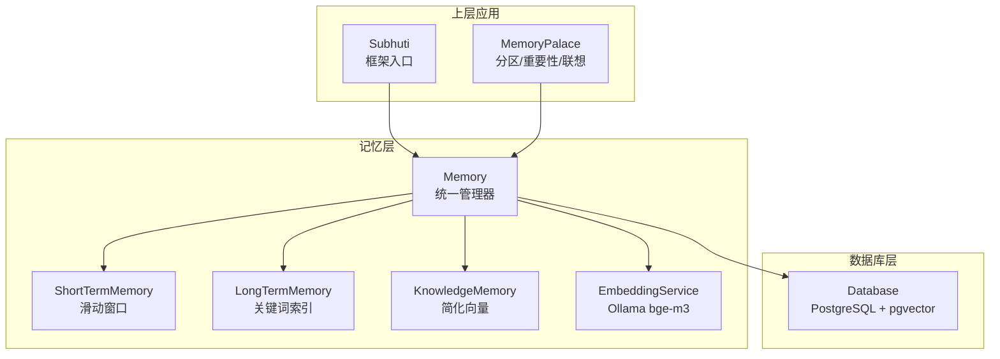

**图示来源**
- [memory/mod.rs:164-444](file://crates/subhuti/src/memory/mod.rs#L164-L444)
- [memory/short_term.rs:10-158](file://crates/subhuti/src/memory/short_term.rs#L10-L158)
- [memory/long_term.rs:11-129](file://crates/subhuti/src/memory/long_term.rs#L11-L129)
- [memory/knowledge.rs:70-166](file://crates/subhuti/src/memory/knowledge.rs#L70-L166)
- [memory/embedding.rs:29-134](file://crates/subhuti/src/memory/embedding.rs#L29-L134)
- [db/mod.rs:46-603](file://crates/subhuti/src/db/mod.rs#L46-L603)
- [soul/palace.rs:229-765](file://crates/subhuti/src/soul/palace.rs#L229-L765)

**章节来源**
- [memory/mod.rs:16-108](file://crates/subhuti/src/memory/mod.rs#L16-L108)
- [Cargo.toml:1-58](file://Cargo.toml#L1-L58)

## 核心组件
- Memory：三层记忆的统一管理器，负责写入、归档、搜索、统计与双写数据库；支持 EmbeddingService 的语义检索
- MemoryItem：记忆项数据结构，包含内容、创建时间、元数据、层级、会话ID
- MemoryLayer：记忆层级枚举（ShortTerm、Archive、Knowledge）
- MemoryStore：抽象存储接口，定义写入、读取、删除、文本搜索、清空
- MemoryConfig：记忆配置（容量、归档阈值、向量维度、TTL）
- SearchResult/SemanticSearchResult：搜索结果结构
- EmbeddingService：文本向量化服务，对接 Ollama，支持批量生成与 pgvector 字符串格式
- Database：PostgreSQL 集成，memories 表、索引、向量相似度搜索、迁移与双写

**章节来源**
- [memory/mod.rs:30-183](file://crates/subhuti/src/memory/mod.rs#L30-L183)
- [memory/embedding.rs:8-98](file://crates/subhuti/src/memory/embedding.rs#L8-L98)
- [db/mod.rs:11-603](file://crates/subhuti/src/db/mod.rs#L11-L603)

## 架构总览
三层记忆架构与检索路径如下：

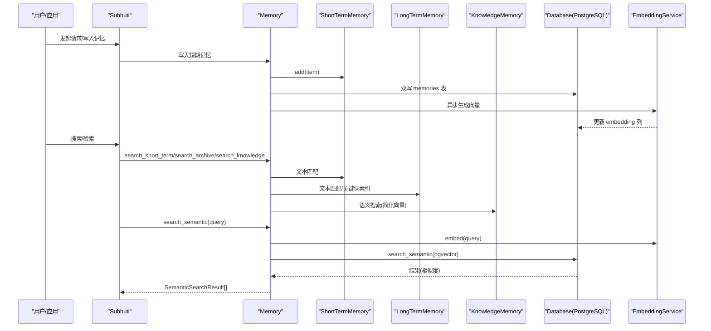

**图示来源**
- [memory/mod.rs:260-407](file://crates/subhuti/src/memory/mod.rs#L260-L407)
- [memory/embedding.rs:50-98](file://crates/subhuti/src/memory/embedding.rs#L50-L98)
- [db/mod.rs:554-592](file://crates/subhuti/src/db/mod.rs#L554-L592)

## 详细组件分析

### 短期记忆（ShortTermMemory）
- 设计要点
  - 基于容量的滑动窗口，超出容量时移除最旧元素
  - 会话索引 session_index：session_id -> Vec<index>，便于按会话归档与裁剪
  - 文本搜索：大小写无关包含匹配，返回固定分数
  - 摘要：基于首尾消息生成简要摘要
- 关键方法
  - add(item)、get_session(id)、drain_session(id)、prune(keep_count)、summarize()、search(query, limit)、clear()

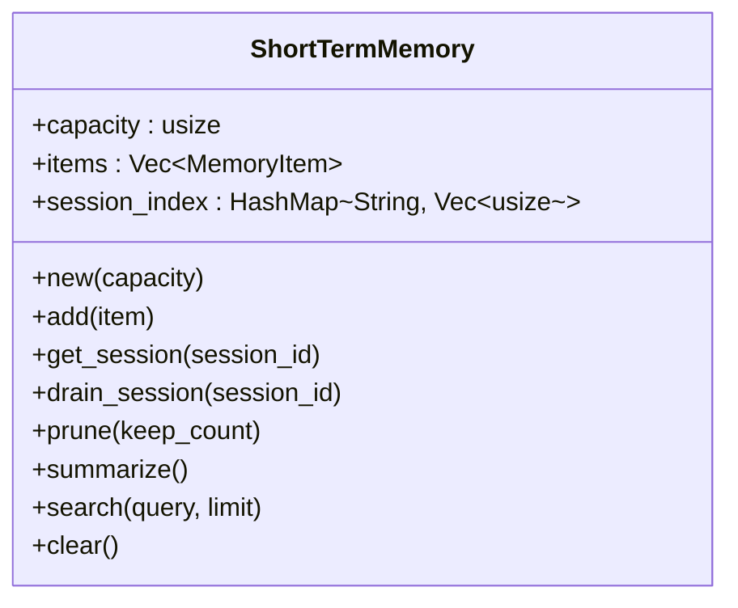

**图示来源**
- [memory/short_term.rs:10-158](file://crates/subhuti/src/memory/short_term.rs#L10-L158)

**章节来源**
- [memory/short_term.rs:20-158](file://crates/subhuti/src/memory/short_term.rs#L20-L158)

### 长期记忆（LongTermMemory）
- 设计要点
  - 无容量上限，按需增长
  - 会话索引 session_index 与关键词索引 keyword_index（过滤短词）
  - 文本搜索：大小写无关包含匹配，返回固定分数
  - 提供按时间范围查询占位（待实现）
- 关键方法
  - add(item)、get_session(id)、get_by_time_range(start,end)、search(query, limit)、clear()

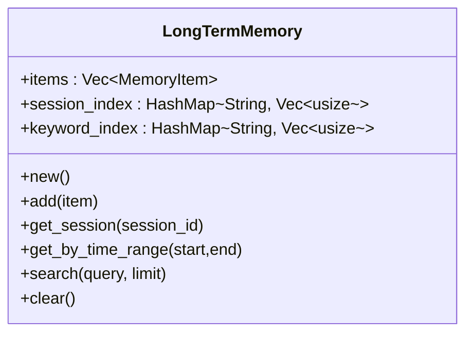

**图示来源**
- [memory/long_term.rs:11-129](file://crates/subhuti/src/memory/long_term.rs#L11-L129)

**章节来源**
- [memory/long_term.rs:21-129](file://crates/subhuti/src/memory/long_term.rs#L21-L129)

### 知识库（KnowledgeMemory）
- 设计要点
  - 简化向量：词频直方图归一化为向量
  - 余弦相似度计算
  - 语义搜索：对查询与全部知识项计算相似度并排序
- 关键方法
  - new(dim)、add(item)、semantic_search(query, limit)、search(query, limit)、clear()

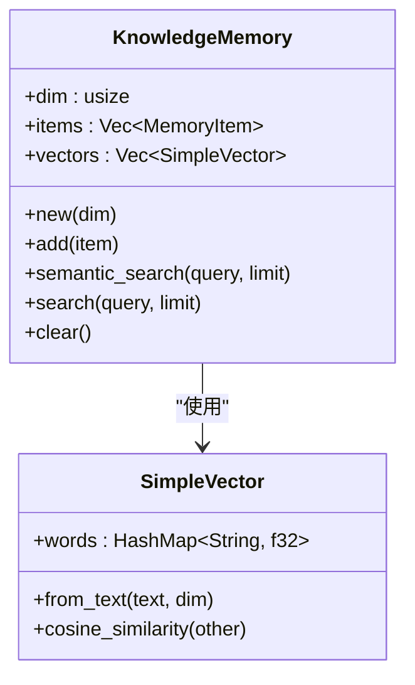

**图示来源**
- [memory/knowledge.rs:70-166](file://crates/subhuti/src/memory/knowledge.rs#L70-L166)
- [memory/knowledge.rs:16-67](file://crates/subhuti/src/memory/knowledge.rs#L16-L67)

**章节来源**
- [memory/knowledge.rs:80-166](file://crates/subhuti/src/memory/knowledge.rs#L80-L166)

### 向量嵌入系统（EmbeddingService）
- 设计要点
  - 配置：api_url、model、dimensions
  - 单文本与批量向量生成
  - pgvector 字符串格式转换，便于 SQL 查询
  - 与数据库结合进行语义检索
- 关键方法
  - new(config)、embed(text)、embed_batch(texts)、to_pgvector_string(embedding)

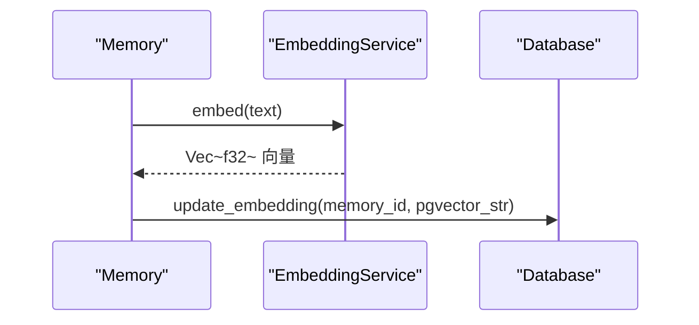

**图示来源**
- [memory/embedding.rs:29-98](file://crates/subhuti/src/memory/embedding.rs#L29-L98)
- [memory/mod.rs:277-311](file://crates/subhuti/src/memory/mod.rs#L277-L311)
- [db/mod.rs:537-552](file://crates/subhuti/src/db/mod.rs#L537-L552)

**章节来源**
- [memory/embedding.rs:36-98](file://crates/subhuti/src/memory/embedding.rs#L36-L98)

### 语义检索（Semantic Search）
- 设计要点
  - 需要配置 Database 与 EmbeddingService
  - 查询向量生成后，使用 pgvector 的向量距离进行相似度排序
  - 返回内容、相似度、层级、角色、创建时间
- 关键方法
  - Memory.search_semantic(query, limit)、Database.search_semantic(user_id, embedding_str, limit)

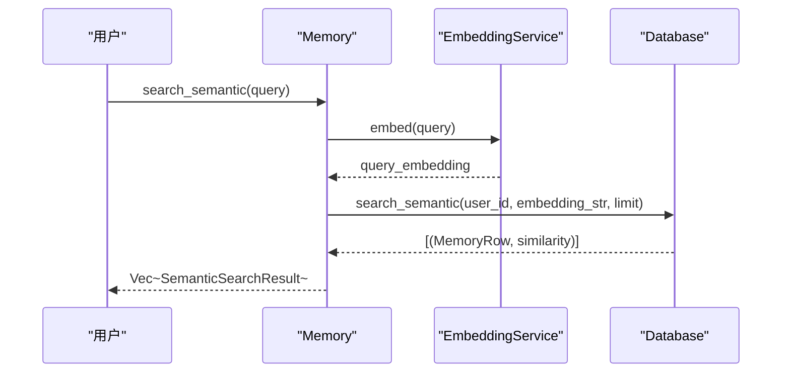

**图示来源**
- [memory/mod.rs:389-407](file://crates/subhuti/src/memory/mod.rs#L389-L407)
- [db/mod.rs:554-592](file://crates/subhuti/src/db/mod.rs#L554-L592)

**章节来源**
- [memory/mod.rs:385-407](file://crates/subhuti/src/memory/mod.rs#L385-L407)
- [db/mod.rs:554-592](file://crates/subhuti/src/db/mod.rs#L554-L592)

### 记忆项数据结构与过期机制
- MemoryItem：包含 id、content、created_at、metadata、layer、session_id
- 过期判定：基于 created_at 与配置的 TTL（秒），超过阈值视为过期
- TTL 配置：MemoryConfig.ttl_seconds，默认 7 天

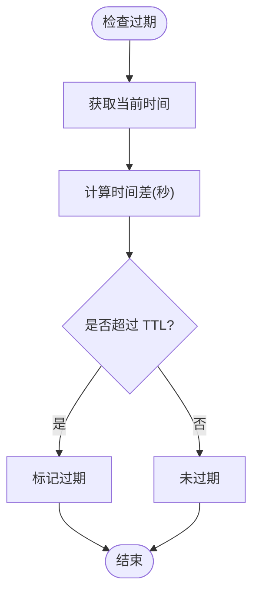

**图示来源**
- [memory/mod.rs:90-96](file://crates/subhuti/src/memory/mod.rs#L90-L96)
- [memory/mod.rs:39-51](file://crates/subhuti/src/memory/mod.rs#L39-L51)

**章节来源**
- [memory/mod.rs:54-96](file://crates/subhuti/src/memory/mod.rs#L54-L96)

### 重要性评分与时间衰减（心灵宫殿 MemoryPalace）
- 重要性等级：Trivial、Normal、Important、Core
- 重要性估算：基于内容长度、关键词命中、情感词汇
- 时间衰减：按重要性设定不同衰减率，days_passed 决定强度下降
- 激活增强：检索/引用时提升强度，降低遗忘概率
- 人格偏置：根据 MemoryZone 的偏好权重对最终得分进行加权

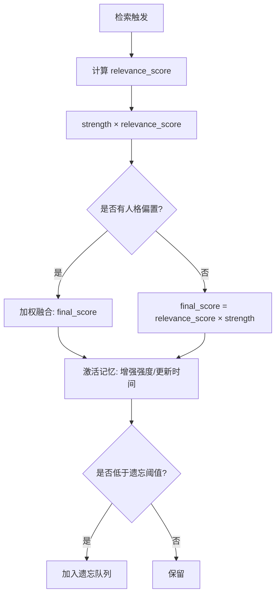

**图示来源**
- [soul/palace.rs:173-224](file://crates/subhuti/src/soul/palace.rs#L173-L224)
- [soul/palace.rs:423-566](file://crates/subhuti/src/soul/palace.rs#L423-L566)

**章节来源**
- [soul/palace.rs:138-224](file://crates/subhuti/src/soul/palace.rs#L138-L224)
- [soul/palace.rs:423-566](file://crates/subhuti/src/soul/palace.rs#L423-L566)

### 归档与滑动窗口机制
- 短期记忆容量达到阈值时，自动将会话内的旧消息归档至长期记忆
- 归档时将 layer 切换为 Archive，并可选择性地写入数据库

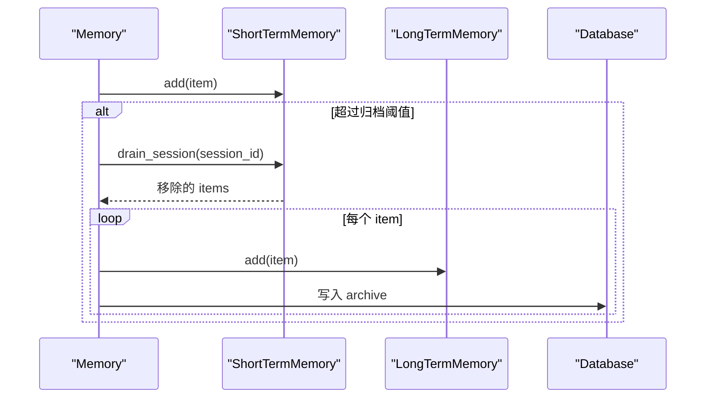

**图示来源**
- [memory/mod.rs:320-368](file://crates/subhuti/src/memory/mod.rs#L320-L368)

**章节来源**
- [memory/mod.rs:313-368](file://crates/subhuti/src/memory/mod.rs#L313-L368)

### 数据库与索引（PostgreSQL + pgvector）
- 表结构：memories（user_id、session_id、role、content、metadata、layer、embedding、archived、created_at）
- 索引：user_id、layer、archived、embedding 向量索引
- 迁移：动态添加缺失列，必要时重建 embedding 列
- 查询：ILIKE 文本搜索、向量相似度（pgvector 距离）

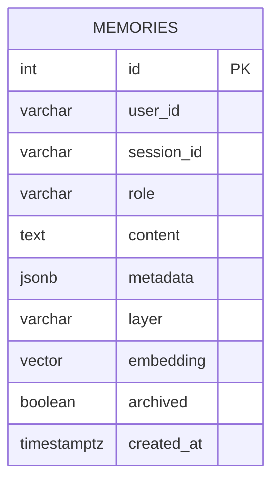

**图示来源**
- [db/mod.rs:138-177](file://crates/subhuti/src/db/mod.rs#L138-L177)
- [db/mod.rs:182-244](file://crates/subhuti/src/db/mod.rs#L182-L244)

**章节来源**
- [db/mod.rs:138-177](file://crates/subhuti/src/db/mod.rs#L138-L177)
- [db/mod.rs:554-592](file://crates/subhuti/src/db/mod.rs#L554-L592)

## 依赖分析
- 组件耦合
  - Memory 对 ShortTermMemory、LongTermMemory、KnowledgeMemory、EmbeddingService、Database 的组合使用
  - MemoryPalace 以装饰器模式包装 Memory，增加分区、重要性、联想与遗忘
- 外部依赖
  - Ollama（EmbeddingService）
  - PostgreSQL + pgvector（Database）
  - reqwest（HTTP 客户端）
  - tokio（异步运行时）
- 可能的循环依赖
  - 通过模块化与共享引用避免循环导入

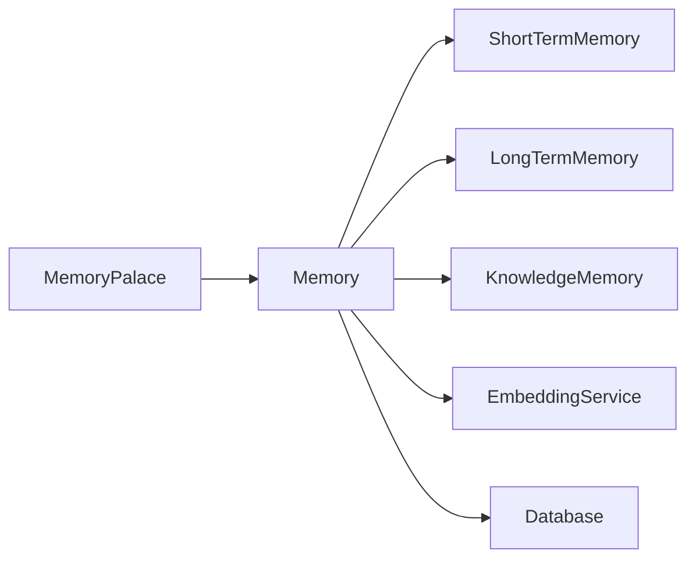

**图示来源**
- [memory/mod.rs:164-196](file://crates/subhuti/src/memory/mod.rs#L164-L196)
- [soul/palace.rs:229-317](file://crates/subhuti/src/soul/palace.rs#L229-L317)

**章节来源**
- [memory/mod.rs:164-196](file://crates/subhuti/src/memory/mod.rs#L164-L196)
- [Cargo.toml:25-58](file://Cargo.toml#L25-L58)

## 性能考虑
- 短期记忆
  - 滑动窗口 O(n) 插入，drain_session 需重建索引，建议在高频场景下批量归档
- 长期记忆
  - 文本搜索为线性扫描，关键词索引可显著提升大体量文本检索效率
- 知识库
  - 简化向量与余弦相似度为 O(n×d)，建议在知识量较大时引入专用向量数据库（如 Qdrant、Chroma）
- 向量检索
  - pgvector 向量距离查询依赖索引，确保 embedding 列建立向量索引
- 异步双写
  - 写入短期记忆时异步生成向量并更新数据库，避免阻塞主线程
- 心灵宫殿
  - 搜索阶段先读锁扫描，再排序与激活，避免长时间持锁

**章节来源**
- [memory/short_term.rs:62-95](file://crates/subhuti/src/memory/short_term.rs#L62-L95)
- [memory/long_term.rs:105-128](file://crates/subhuti/src/memory/long_term.rs#L105-L128)
- [memory/knowledge.rs:97-118](file://crates/subhuti/src/memory/knowledge.rs#L97-L118)
- [memory/embedding.rs:84-91](file://crates/subhuti/src/memory/embedding.rs#L84-L91)
- [db/mod.rs:161-177](file://crates/subhuti/src/db/mod.rs#L161-L177)
- [soul/palace.rs:423-566](file://crates/subhuti/src/soul/palace.rs#L423-L566)

## 故障排除指南
- Ollama 未启动或不可达
  - 现象：EmbeddingService.embed 抛错
  - 处理：确认 Ollama 服务运行，检查 api_url 与 model 配置
  - 参考：[embedding 模块测试:110-125](file://crates/subhuti/src/memory/embedding.rs#L110-L125)
- pgvector 扩展缺失或维度不匹配
  - 现象：初始化表时报错或维度警告
  - 处理：确保启用 vector 扩展；若维度不一致，按迁移逻辑重建 embedding 列
  - 参考：[数据库迁移:182-244](file://crates/subhuti/src/db/mod.rs#L182-L244)
- 记忆未过期但被误判
  - 现象：TTL 配置无效
  - 处理：检查 MemoryConfig.ttl_seconds 与 MemoryItem.created_at
  - 参考：[过期判定:90-96](file://crates/subhuti/src/memory/mod.rs#L90-L96)
- 语义检索无结果
  - 现象：search_semantic 返回空
  - 处理：确认已配置 Database 与 EmbeddingService；检查 embedding 是否成功写入
  - 参考：[语义检索:389-407](file://crates/subhuti/src/memory/mod.rs#L389-L407), [数据库向量搜索:554-592](file://crates/subhuti/src/db/mod.rs#L554-L592)
- 集成测试与性能测试
  - 使用集成测试验证整体流程，使用性能测试评估关键路径吞吐
  - 参考：[集成测试:21-190](file://crates/subhuti/tests/integration_test.rs#L21-L190), [性能测试:22-264](file://crates/subhuti/tests/performance_test.rs#L22-L264)

**章节来源**
- [memory/embedding.rs:110-125](file://crates/subhuti/src/memory/embedding.rs#L110-L125)
- [db/mod.rs:182-244](file://crates/subhuti/src/db/mod.rs#L182-L244)
- [memory/mod.rs:90-96](file://crates/subhuti/src/memory/mod.rs#L90-L96)
- [memory/mod.rs:389-407](file://crates/subhuti/src/memory/mod.rs#L389-L407)
- [db/mod.rs:554-592](file://crates/subhuti/src/db/mod.rs#L554-L592)
- [integration_test.rs:21-190](file://crates/subhuti/tests/integration_test.rs#L21-L190)
- [performance_test.rs:22-264](file://crates/subhuti/tests/performance_test.rs#L22-L264)

## 结论
Subhuti 记忆系统以清晰的三层架构为基础，结合数据库与向量检索，实现了从短期工作记忆到长期归档再到知识库的完整闭环。通过心灵宫殿的分区、重要性与时间衰减机制，系统进一步增强了记忆的组织性与个性化。建议在生产环境中引入专用向量数据库与更完善的索引策略，并持续监控 Ollama 与数据库的可用性，以保障检索性能与稳定性。

## 附录
- 配置项参考
  - MemoryConfig：short_term_capacity、archive_threshold、knowledge_dim、ttl_seconds
  - EmbeddingConfig：api_url、model、dimensions
  - DbConfig：host、port、database、username、password、max_connections
- 常用 API 路径参考
  - Memory.write_short_term/content/session_id
  - Memory.search_short_term/query/limit
  - Memory.search_archive/query/limit
  - Memory.search_knowledge/query/limit
  - Memory.search_semantic/query/limit
  - Database.search_semantic/user_id/embedding_str/limit
  - MemoryPalace.store/content/layer/session_id
  - MemoryPalace.search/query/limit/persona_zone_bias

**章节来源**
- [memory/mod.rs:30-52](file://crates/subhuti/src/memory/mod.rs#L30-L52)
- [memory/embedding.rs:8-27](file://crates/subhuti/src/memory/embedding.rs#L8-L27)
- [db/mod.rs:11-42](file://crates/subhuti/src/db/mod.rs#L11-L42)
- [memory/mod.rs:260-407](file://crates/subhuti/src/memory/mod.rs#L260-L407)
- [db/mod.rs:554-592](file://crates/subhuti/src/db/mod.rs#L554-L592)
- [soul/palace.rs:320-419](file://crates/subhuti/src/soul/palace.rs#L320-L419)
- [soul/palace.rs:423-566](file://crates/subhuti/src/soul/palace.rs#L423-L566)