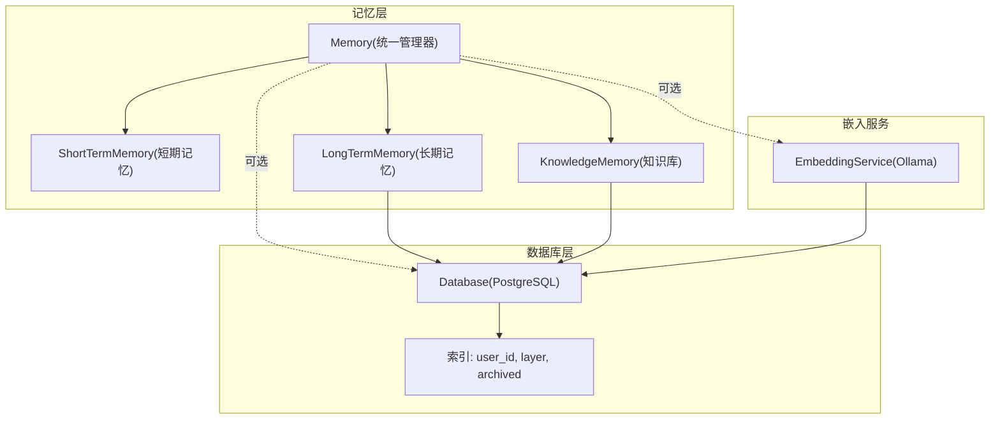
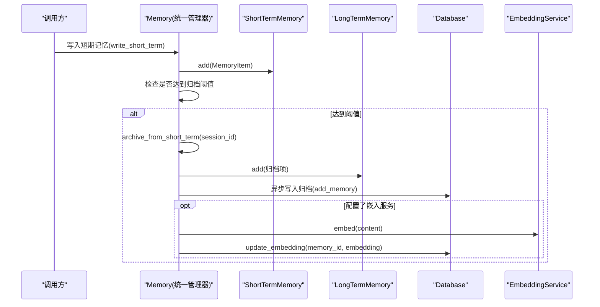
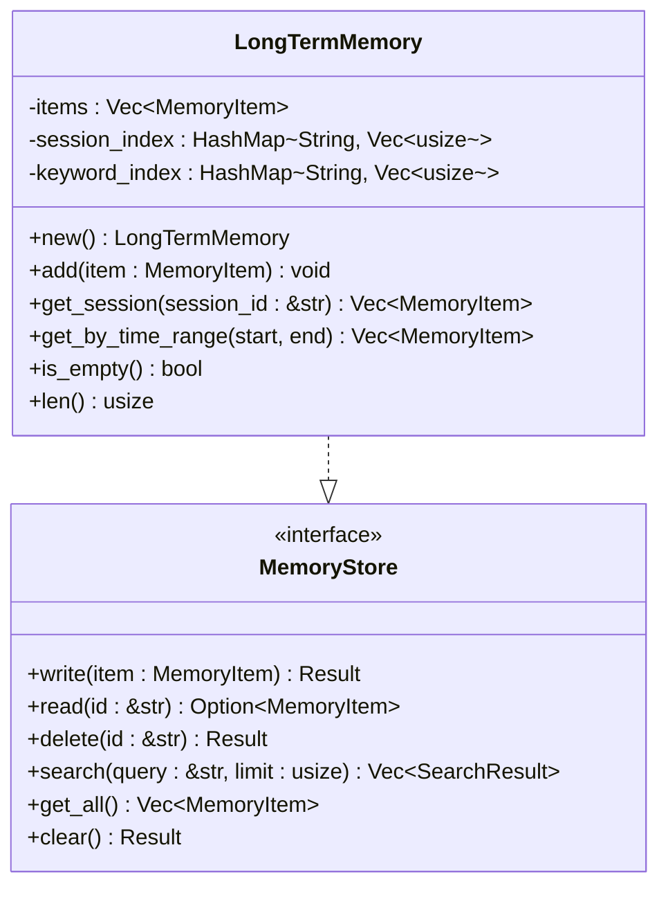
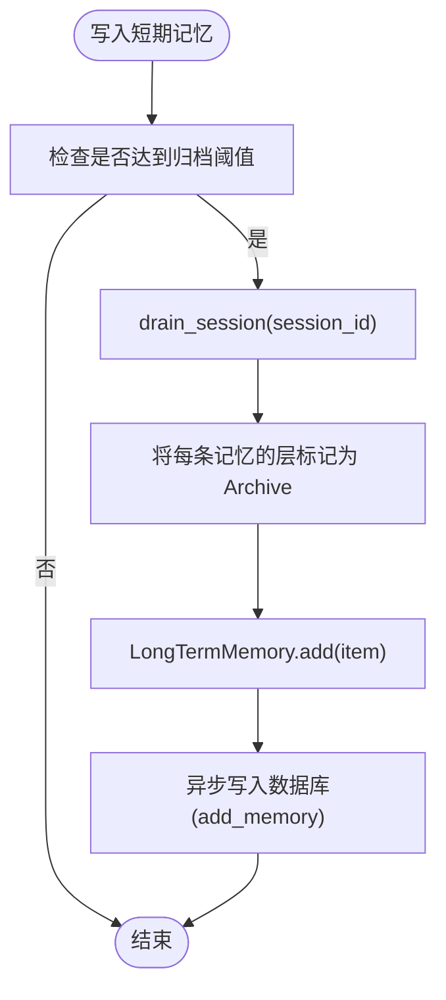
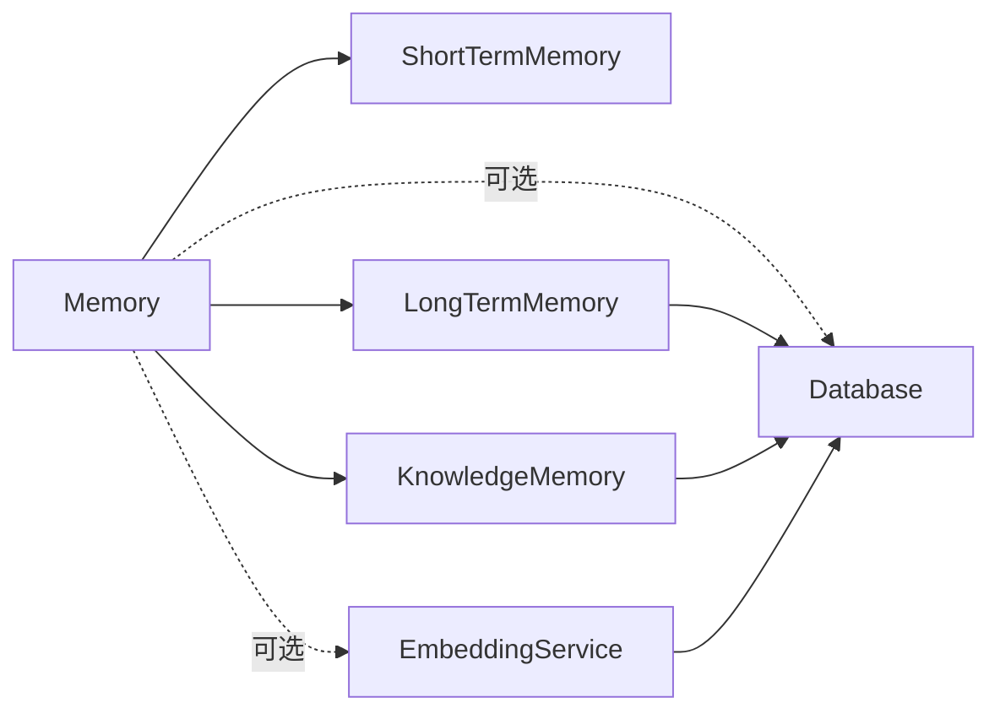

# 长期记忆

<cite>
**本文引用的文件**
- [long_term.rs](file://crates/subhuti/src/memory/long_term.rs)
- [mod.rs](file://crates/subhuti/src/memory/mod.rs)
- [short_term.rs](file://crates/subhuti/src/memory/short_term.rs)
- [knowledge.rs](file://crates/subhuti/src/memory/knowledge.rs)
- [embedding.rs](file://crates/subhuti/src/memory/embedding.rs)
- [db/mod.rs](file://crates/subhuti/src/db/mod.rs)
- [integration_test.rs](file://crates/subhuti/tests/integration_test.rs)
- [Cargo.toml](file://Cargo.toml)
</cite>

## 目录
1. [简介](#简介)
2. [项目结构](#项目结构)
3. [核心组件](#核心组件)
4. [架构总览](#架构总览)
5. [详细组件分析](#详细组件分析)
6. [依赖关系分析](#依赖关系分析)
7. [性能考量](#性能考量)
8. [故障排查指南](#故障排查指南)
9. [结论](#结论)
10. [附录](#附录)

## 简介
本文件面向“长期记忆”子系统，系统性阐述长期记忆（LongTermMemory）的设计原理、实现机制与运维实践，覆盖以下主题：
- 持久化存储策略：内存+数据库双写、索引与迁移
- 历史归档机制：短期记忆到长期记忆的转换、滑动窗口算法
- 数据结构与查询优化：关键词索引、搜索策略、批量操作
- 数据完整性与一致性：嵌入向量生成、数据库约束与迁移
- 备份恢复与迁移：数据库迁移脚本、索引策略、维护建议

## 项目结构
长期记忆位于记忆层（Memory Layer），与短期记忆、知识库共同构成三层记忆体系。数据库模块提供持久化能力，嵌入服务提供向量检索能力。

图表来源
- [mod.rs:163-444](file://crates/subhuti/src/memory/mod.rs#L163-L444)
- [db/mod.rs:44-180](file://crates/subhuti/src/db/mod.rs#L44-L180)
- [embedding.rs:29-98](file://crates/subhuti/src/memory/embedding.rs#L29-L98)

章节来源
- [mod.rs:1-173](file://crates/subhuti/src/memory/mod.rs#L1-L173)
- [db/mod.rs:1-688](file://crates/subhuti/src/db/mod.rs#L1-L688)

## 核心组件
- 长期记忆容器：维护记忆列表与会话/关键词索引，提供基本增删改查与清空能力
- 统一记忆管理器：协调短期/长期/知识三类记忆，负责归档、搜索、统计等
- 数据库：提供表结构、索引、迁移、向量搜索等持久化能力
- 嵌入服务：对接 Ollama 生成向量，供语义搜索使用

章节来源
- [long_term.rs:10-129](file://crates/subhuti/src/memory/long_term.rs#L10-L129)
- [mod.rs:163-444](file://crates/subhuti/src/memory/mod.rs#L163-L444)
- [db/mod.rs:138-180](file://crates/subhuti/src/db/mod.rs#L138-L180)
- [embedding.rs:29-98](file://crates/subhuti/src/memory/embedding.rs#L29-L98)

## 架构总览
长期记忆的生命周期与交互如下：
- 写入路径：短期记忆写入后，若达到阈值则触发归档；也可由滑动窗口挤出时归档
- 归档路径：短期记忆或对话对归档为长期记忆，同时异步写入数据库
- 查询路径：短期记忆直接内存查询；长期记忆支持关键词检索；知识库支持向量检索
- 持久化路径：数据库提供表结构、索引、迁移、向量搜索

图表来源
- [mod.rs:260-368](file://crates/subhuti/src/memory/mod.rs#L260-L368)
- [db/mod.rs:418-552](file://crates/subhuti/src/db/mod.rs#L418-L552)
- [embedding.rs:50-91](file://crates/subhuti/src/memory/embedding.rs#L50-L91)

## 详细组件分析

### 长期记忆容器（LongTermMemory）
- 数据结构
  - 记忆列表：Vec<MemoryItem>
  - 会话索引：session_id -> Vec<index>
  - 关键词索引：word -> Vec<index>（按空白切分，过滤短词）
- 关键方法
  - add：写入时更新会话索引与关键词索引
  - get_session：按会话ID返回记忆集合
  - search：按内容包含进行简单匹配（大小写不敏感）
  - get_all/is_empty/len：遍历与统计
  - clear：清空所有数据与索引
- 与接口的关系
  - 实现 MemoryStore trait，提供 write/read/delete/search/get_all/clear

图表来源
- [long_term.rs:10-129](file://crates/subhuti/src/memory/long_term.rs#L10-L129)
- [mod.rs:134-148](file://crates/subhuti/src/memory/mod.rs#L134-L148)

章节来源
- [long_term.rs:10-129](file://crates/subhuti/src/memory/long_term.rs#L10-L129)

### 短期记忆到长期记忆的转换机制
- 归档阈值触发：当短期记忆长度达到配置阈值时，触发归档
- 会话级归档：drain_session 移除指定会话的记忆并转为长期记忆
- 对话对归档：滑动窗口挤出时，将用户与助手消息组合为一条长期记忆

图表来源
- [mod.rs:313-368](file://crates/subhuti/src/memory/mod.rs#L313-L368)
- [db/mod.rs:418-444](file://crates/subhuti/src/db/mod.rs#L418-L444)

章节来源
- [mod.rs:313-368](file://crates/subhuti/src/memory/mod.rs#L313-L368)

### 数据结构与索引策略
- 内存索引
  - 会话索引：按 session_id -> [索引数组]，便于快速定位某会话的所有记忆
  - 关键词索引：按词 -> [索引数组]，过滤长度<=2的词，避免噪声
- 数据库索引
  - user_id、layer、archived 字段建立索引，支撑高频查询与向量搜索
- 时间范围查询
  - 当前 LongTermMemory 提供占位实现，建议后续按 created_at 过滤

章节来源
- [long_term.rs:15-52](file://crates/subhuti/src/memory/long_term.rs#L15-L52)
- [db/mod.rs:161-177](file://crates/subhuti/src/db/mod.rs#L161-L177)

### 查询优化与批量操作
- 文本搜索
  - LongTermMemory：按内容包含进行简单匹配，返回固定分数
  - KnowledgeMemory：基于词袋模型计算余弦相似度，按分数降序
- 语义搜索
  - Memory.search_semantic：生成查询向量，调用数据库向量相似度查询
  - 嵌入服务：支持单条与批量生成，批量默认串行，可扩展并行
- 批量操作
  - Memory.prune_short_term：裁剪短期记忆，重建索引
  - Memory.add_knowledge：批量添加知识项（内部逐条构建向量）

章节来源
- [long_term.rs:105-120](file://crates/subhuti/src/memory/long_term.rs#L105-L120)
- [knowledge.rs:97-118](file://crates/subhuti/src/memory/knowledge.rs#L97-L118)
- [mod.rs:385-417](file://crates/subhuti/src/memory/mod.rs#L385-L417)
- [embedding.rs:84-91](file://crates/subhuti/src/memory/embedding.rs#L84-L91)

### 数据完整性与一致性
- 嵌入向量生成
  - 写入短期记忆时，若配置嵌入服务，异步生成向量并写回数据库
  - 向量维度校验：生成后与配置维度对比，不一致时发出告警
- 数据库迁移
  - 自动迁移 memories 表，确保新增列（如 session_id、layer、embedding）存在
  - 若 embedding 维度不匹配，给出重建提示
- TTL 与过期
  - MemoryItem 提供 is_expired 检查，可用于定期清理

章节来源
- [mod.rs:90-96](file://crates/subhuti/src/memory/mod.rs#L90-L96)
- [db/mod.rs:182-244](file://crates/subhuti/src/db/mod.rs#L182-L244)
- [embedding.rs:73-81](file://crates/subhuti/src/memory/embedding.rs#L73-L81)

## 依赖关系分析
- 组件耦合
  - Memory 统一持有短期/长期/知识三类记忆的共享句柄
  - LongTermMemory/KnowledgeMemory 实现 MemoryStore，便于统一调度
  - Database 与 EmbeddingService 作为可选依赖，通过 Memory.set_database/set_embedding 注入
- 外部依赖
  - PostgreSQL + pgvector：向量存储与相似度查询
  - Ollama：文本向量生成
  - sqlx：数据库访问

图表来源
- [mod.rs:163-173](file://crates/subhuti/src/memory/mod.rs#L163-L173)
- [db/mod.rs:44-48](file://crates/subhuti/src/db/mod.rs#L44-L48)
- [embedding.rs:29-43](file://crates/subhuti/src/memory/embedding.rs#L29-L43)

章节来源
- [mod.rs:163-258](file://crates/subhuti/src/memory/mod.rs#L163-L258)
- [db/mod.rs:44-688](file://crates/subhuti/src/db/mod.rs#L44-L688)
- [embedding.rs:29-98](file://crates/subhuti/src/memory/embedding.rs#L29-L98)

## 性能考量
- 索引与查询
  - 会话索引与关键词索引提升短期/长期检索效率
  - 数据库索引（user_id、layer、archived）支撑高频查询
- 向量搜索
  - 嵌入生成采用异步非阻塞，避免阻塞主线程
  - 语义搜索使用 pgvector 向量相似度，建议合理限制 limit
- 批量与并发
  - 嵌入批量默认串行，可根据硬件资源扩展为并行
  - 归档与写库采用异步任务，避免阻塞请求线程

[本节为通用性能建议，无需特定文件来源]

## 故障排查指南
- 嵌入服务不可用
  - 现象：生成向量失败，日志出现告警
  - 处理：确认 Ollama 服务可用、模型名称正确、维度匹配
- 数据库连接失败
  - 现象：无法初始化表、写入失败
  - 处理：检查连接字符串、权限、pgvector 扩展启用
- 向量维度不匹配
  - 现象：迁移后维度不一致，需重建 embedding 列
  - 处理：根据迁移日志提示，执行重建
- 查询性能下降
  - 现象：搜索变慢
  - 处理：确认索引是否存在、limit 是否过大、是否误用全表扫描

章节来源
- [embedding.rs:65-81](file://crates/subhuti/src/memory/embedding.rs#L65-L81)
- [db/mod.rs:67-71](file://crates/subhuti/src/db/mod.rs#L67-L71)
- [db/mod.rs:214-244](file://crates/subhuti/src/db/mod.rs#L214-L244)

## 结论
长期记忆通过内存索引与数据库持久化相结合，实现了高效的历史归档与检索。配合短期记忆的滑动窗口与阈值归档策略，形成完整的记忆生命周期管理。通过数据库索引与向量搜索，系统在文本检索与语义检索之间取得平衡。建议在生产环境中：
- 明确归档阈值与滑动窗口参数
- 为数据库建立必要索引
- 定期检查嵌入服务与数据库迁移状态
- 控制语义搜索的 limit，避免过度扫描

[本节为总结性内容，无需特定文件来源]

## 附录

### 配置参数说明
- MemoryConfig
  - short_term_capacity：短期记忆容量
  - archive_threshold：短期记忆达到该阈值后触发归档
  - knowledge_dim：知识库向量维度
  - ttl_seconds：记忆过期时间（秒）
- DbConfig
  - host/port/database/username/password/max_connections：数据库连接参数
- EmbeddingConfig
  - api_url/model/dimensions：嵌入服务地址、模型与维度

章节来源
- [mod.rs:30-52](file://crates/subhuti/src/memory/mod.rs#L30-L52)
- [db/mod.rs:11-42](file://crates/subhuti/src/db/mod.rs#L11-L42)
- [embedding.rs:8-27](file://crates/subhuti/src/memory/embedding.rs#L8-L27)

### 存储格式规范
- memories 表
  - 字段：id、user_id、session_id、role、content、metadata、layer、embedding、archived、created_at
  - 索引：user_id、layer、archived
  - 约束：layer 默认 'short_term'，archived 默认 false
- 迁移策略
  - 自动添加缺失列（session_id、layer、embedding）
  - 若 embedding 维度不匹配，给出重建提示

章节来源
- [db/mod.rs:138-180](file://crates/subhuti/src/db/mod.rs#L138-L180)
- [db/mod.rs:182-244](file://crates/subhuti/src/db/mod.rs#L182-L244)

### 备份恢复与迁移策略
- 备份
  - 使用数据库导出工具备份 memories 表及索引
- 恢复
  - 导入后验证索引存在，必要时重新创建
- 迁移
  - 通过迁移脚本自动补齐列，注意 embedding 维度变更时的重建步骤

章节来源
- [db/mod.rs:182-244](file://crates/subhuti/src/db/mod.rs#L182-L244)

### 维护指南
- 定期清理过期记忆：利用 TTL 机制与数据库查询结合
- 监控嵌入服务：确保模型可用与维度一致
- 监控数据库性能：关注索引使用情况与查询计划

章节来源
- [mod.rs:90-96](file://crates/subhuti/src/memory/mod.rs#L90-L96)
- [db/mod.rs:554-592](file://crates/subhuti/src/db/mod.rs#L554-L592)