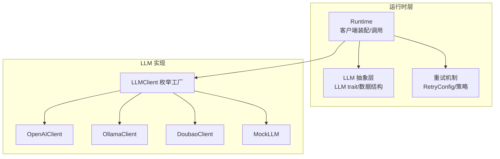
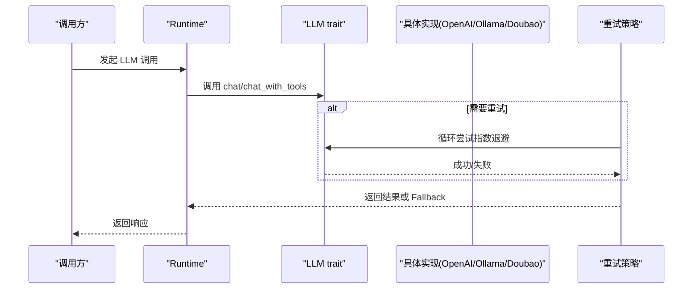
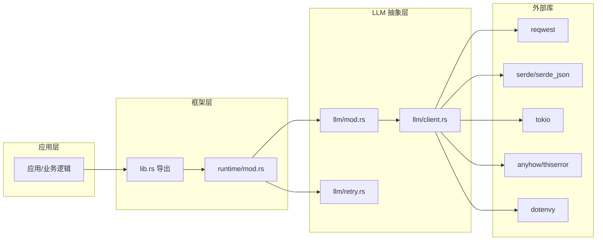

# LLM 客户端

<cite>
**本文引用的文件**
- [client.rs](file://crates/subhuti/src/runtime/llm/client.rs)
- [mod.rs](file://crates/subhuti/src/runtime/llm/mod.rs)
- [retry.rs](file://crates/subhuti/src/runtime/llm/retry.rs)
- [lib.rs](file://crates/subhuti/src/lib.rs)
- [runtime/mod.rs](file://crates/subhuti/src/runtime/mod.rs)
- [Cargo.toml](file://crates/subhuti/Cargo.toml)
- [app/Cargo.toml](file://Cargo.toml)
</cite>

## 目录
1. [简介](#简介)
2. [项目结构](#项目结构)
3. [核心组件](#核心组件)
4. [架构总览](#架构总览)
5. [组件详解](#组件详解)
6. [依赖关系分析](#依赖关系分析)
7. [性能考量](#性能考量)
8. [故障排查指南](#故障排查指南)
9. [结论](#结论)
10. [附录](#附录)

## 简介
本文件面向 LLM 客户端模块的技术文档，系统阐述 LLM 抽象层的设计与实现，包括统一的 LLM trait 接口、LLMClient 枚举类型、OpenAI/Ollama/Doubao/Custom 等提供商的实现差异；消息格式（Message）、角色定义（Role）、LLM 响应结构（LLMResponse）的设计；客户端初始化流程、配置管理、连接池机制；重试机制的实现策略、超时处理与网络异常恢复；以及配置示例、性能调优建议与多提供商切换的最佳实践。

## 项目结构
LLM 抽象层位于运行时层的 runtime/llm 目录下，采用“trait + 多实现 + 工厂”的分层设计：
- 抽象层：LLM trait、通用数据结构（Message、Role、LLMConfig、LLMResponse、ToolInfo/ToolCall 等）
- 实现层：OpenAIClient、OllamaClient、DoubaoClient、MockLLM
- 工具层：重试机制（RetryConfig、chat_with_retry 等）
- 集成层：LLMClient 枚举工厂、Runtime 中的客户端装配与调用

图示来源
- [client.rs:997-1024](file://crates/subhuti/src/runtime/llm/client.rs#L997-L1024)
- [mod.rs:124-148](file://crates/subhuti/src/runtime/llm/mod.rs#L124-L148)
- [retry.rs:25-85](file://crates/subhuti/src/runtime/llm/retry.rs#L25-L85)
- [runtime/mod.rs:89-117](file://crates/subhuti/src/runtime/mod.rs#L89-L117)

章节来源
- [client.rs:1-1046](file://crates/subhuti/src/runtime/llm/client.rs#L1-L1046)
- [mod.rs:1-239](file://crates/subhuti/src/runtime/llm/mod.rs#L1-L239)
- [retry.rs:1-322](file://crates/subhuti/src/runtime/llm/retry.rs#L1-L322)
- [runtime/mod.rs:89-117](file://crates/subhuti/src/runtime/mod.rs#L89-L117)

## 核心组件
- LLM trait：统一的异步接口，支持非流式 chat、带工具调用的 chat_with_tools、流式 chat_streaming、健康检查 health_check。
- 数据结构：
  - Role：系统/用户/助手/工具
  - Message：携带角色、内容、工具调用 ID
  - LLMConfig：模型名、API 地址、API Key、温度、最大 token
  - LLMResponse：文本内容、工具调用、模型名、Token 统计
  - ToolInfo/FunctionDefinition/ToolCall：工具定义与调用
- 客户端枚举 LLMClient：统一持有 OpenAI/Ollama/Doubao 实例，提供工厂方法 from_config 自动推断提供商。
- MockLLM：测试用模拟实现，支持预设响应队列、消息捕获、工具调用响应。
- 重试机制：RetryConfig 控制最大重试次数、初始延迟、指数退避、是否启用 Fallback。

章节来源
- [mod.rs:19-239](file://crates/subhuti/src/runtime/llm/mod.rs#L19-L239)
- [client.rs:997-1046](file://crates/subhuti/src/runtime/llm/client.rs#L997-L1046)
- [retry.rs:25-135](file://crates/subhuti/src/runtime/llm/retry.rs#L25-L135)

## 架构总览
LLM 抽象层通过 LLM trait 将上层调用与具体提供商解耦。Runtime 在启动时根据配置选择或自动推断提供商，创建对应客户端实例并注入运行时；调用方通过统一接口发起请求，必要时结合重试策略提升可靠性。

图示来源
- [runtime/mod.rs:161-203](file://crates/subhuti/src/runtime/mod.rs#L161-L203)
- [retry.rs:137-202](file://crates/subhuti/src/runtime/llm/retry.rs#L137-L202)

## 组件详解

### LLM 抽象层与数据结构
- LLM trait：定义 provider/config/chat/chat_with_tools/chat_streaming/health_check 等方法，确保不同提供商的一致行为契约。
- Role/Message：标准化消息角色与内容，支持工具消息携带 tool_call_id。
- LLMConfig：集中管理模型、地址、密钥、温度、最大 token 等参数，默认值适配 OpenAI。
- LLMResponse：统一承载文本内容、工具调用、模型名与 Token 统计，便于上层处理与可观测性。
- ToolInfo/FunctionDefinition/ToolCall：将工具能力以函数定义形式注入模型，支持 function calling。

章节来源
- [mod.rs:19-239](file://crates/subhuti/src/runtime/llm/mod.rs#L19-L239)

### OpenAI 客户端（OpenAIClient）
- 请求/响应映射：将通用 Message 映射为 OpenAI 的 role/content；非流式走 chat/completions；支持 tools 的 function calling。
- 认证：通过 Authorization 头携带 Bearer Token。
- 工具调用：若模型返回 function_call，则解析为 ToolCall 并填充 LLMResponse；否则返回普通文本内容。
- 健康检查：返回布尔值表示可用性。

章节来源
- [client.rs:100-233](file://crates/subhuti/src/runtime/llm/client.rs#L100-L233)
- [mod.rs:167-212](file://crates/subhuti/src/runtime/llm/mod.rs#L167-L212)

### Ollama 客户端（OllamaClient）
- 请求/响应映射：将通用 Message 映射为 Ollama 的 role/content；非流式走 /api/chat。
- 工具调用：支持 tools 字段，响应中可能包含 tool_calls 数组，解析为 ToolCall。
- 健康检查：访问 /api/tags 判断服务可用性。

章节来源
- [client.rs:309-427](file://crates/subhuti/src/runtime/llm/client.rs#L309-L427)
- [mod.rs:167-212](file://crates/subhuti/src/runtime/llm/mod.rs#L167-L212)

### Doubao 客户端（DoubaoClient）
- 请求/响应映射：使用 Chat Completions API，支持 tools；兼容 tool_calls 与 function_call 两种格式。
- 认证：Authorization 头携带 Bearer Token；API Key 来自配置或环境变量 DOUBAO_API_KEY。
- 超时与连接：基于 reqwest ClientBuilder 设置整体超时与连接超时。
- 健康检查：返回布尔值表示可用性。

章节来源
- [client.rs:568-784](file://crates/subhuti/src/runtime/llm/client.rs#L568-L784)
- [client.rs:575-598](file://crates/subhuti/src/runtime/llm/client.rs#L575-L598)

### MockLLM（测试用）
- 行为：支持预设响应队列、捕获消息历史、工具调用响应；流式输出按词分段模拟。
- 用途：单元测试与集成测试中的稳定输出与断言。

章节来源
- [client.rs:800-981](file://crates/subhuti/src/runtime/llm/client.rs#L800-L981)

### LLMClient 枚举与工厂
- 枚举：统一持有 OpenAI/Ollama/Doubao 实例，便于上层以统一方式调用。
- 工厂：from_config 根据 api_url 或 model 名称自动推断提供商；Runtime.with_config_and_llm 根据 Provider 枚举创建对应客户端。

章节来源
- [client.rs:997-1024](file://crates/subhuti/src/runtime/llm/client.rs#L997-L1024)
- [runtime/mod.rs:89-117](file://crates/subhuti/src/runtime/mod.rs#L89-L117)

### 重试机制（RetryConfig/策略）
- 配置：最大重试次数、初始延迟、是否启用指数退避、是否启用 Fallback、回退消息。
- 策略：非流式 chat_with_retry、流式 chat_stream_with_retry；指数退避按 2^n 增长；失败后可返回友好回退消息或抛出错误。
- 结果：RetryResult 统一封装成功/回退/失败状态与重试次数、最后错误。

章节来源
- [retry.rs:25-283](file://crates/subhuti/src/runtime/llm/retry.rs#L25-L283)
- [mod.rs:124-148](file://crates/subhuti/src/runtime/llm/mod.rs#L124-L148)

### 调用流程与集成点
- Runtime.call_llm_with_tools：对外暴露统一调用入口，内部获取 Arc<dyn LLM> 并转发至具体实现。
- Runtime.call_llm_streaming：支持流式回调输出。
- Subhuti.set_mock_llm：注入 MockLLM 用于测试。

章节来源
- [runtime/mod.rs:161-203](file://crates/subhuti/src/runtime/mod.rs#L161-L203)
- [lib.rs:515-524](file://crates/subhuti/src/lib.rs#L515-L524)

## 依赖关系分析
- 外部依赖：reqwest（HTTP 客户端）、serde/serde_json（序列化）、tokio（异步运行时）、anyhow/thiserror（错误处理）、uuid（ID 生成）、dotenvy（环境变量加载）。
- 模块依赖：runtime/llm 向上层导出 LLM trait、数据结构与工具；client.rs 实现具体提供商；retry.rs 提供重试策略；lib.rs 与 runtime/mod.rs 将 LLM 集成到框架。

图示来源
- [Cargo.toml:14-53](file://crates/subhuti/Cargo.toml#L14-L53)
- [app/Cargo.toml:25-58](file://Cargo.toml#L25-L58)

章节来源
- [Cargo.toml:14-53](file://crates/subhuti/Cargo.toml#L14-L53)
- [app/Cargo.toml:25-58](file://Cargo.toml#L25-L58)

## 性能考量
- 连接复用：各客户端内部使用 reqwest::Client，建议在生产环境中复用同一 Client 实例以减少连接开销（当前实现已在各客户端中各自创建 Client，可考虑在上层统一注入共享实例）。
- 超时与并发：DoubaoClient 已设置整体超时与连接超时；建议根据网络状况与模型响应时间调整 RetryConfig 的初始延迟与最大重试次数，避免过度重试导致资源浪费。
- 流式输出：chat_streaming 仅在实现中简单回显，建议在具体提供商处完善真正的流式解析与回调。
- 工具调用：OpenAI 与 Doubao 支持 function calling，合理利用可减少往返次数；注意解析工具调用参数的健壮性与错误处理。
- 日志与可观测性：各实现使用 tracing 输出调试信息，建议在生产环境配置合适的日志级别与采样策略。

## 故障排查指南
- 认证失败：确认 API Key 正确且未过期；OpenAI 通过 Authorization 头传递，Doubao 通过请求头 Authorization 传递。
- 网络超时/连接失败：检查网络连通性与代理设置；适当增大 RetryConfig 的初始延迟与最大重试次数；DoubaoClient 已内置超时配置。
- 响应为空/无内容：某些提供商在特定条件下可能返回空内容或仅返回 finish_reason；需在上层进行兜底处理或提示用户重试。
- 工具调用未命中：检查 tools 定义是否符合提供商要求；OpenAI 使用 tools 字段，Doubao 兼容 tool_calls 与 function_call 两种格式。
- MockLLM：用于测试时，确保预设响应队列与工具调用响应已正确注入；通过 get_captured_messages 验证 Prompt 构建是否符合预期。

章节来源
- [client.rs:575-598](file://crates/subhuti/src/runtime/llm/client.rs#L575-L598)
- [client.rs:618-768](file://crates/subhuti/src/runtime/llm/client.rs#L618-L768)
- [retry.rs:137-202](file://crates/subhuti/src/runtime/llm/retry.rs#L137-L202)
- [client.rs:800-981](file://crates/subhuti/src/runtime/llm/client.rs#L800-L981)

## 结论
本 LLM 客户端模块通过统一的抽象层与工厂模式，实现了对多家提供商的无缝接入与一致行为契约；配合完善的重试机制与工具调用支持，提升了系统的可靠性与扩展性。建议在生产环境中进一步优化连接复用、流式输出与可观测性配置，并结合 RetryConfig 与工具调用策略进行性能与稳定性平衡。

## 附录

### 配置示例与最佳实践
- LLMConfig 默认值适用于 OpenAI；如接入 Ollama/Doubao，需调整 api_url 与 model 名称，并在 Doubao 情况下提供 DOUBAO_API_KEY。
- 多提供商切换：通过 Runtime.with_config_and_llm 或 LLMClient.from_config 自动推断；建议在配置层集中管理 Provider 与关键参数。
- 重试策略：保守场景使用保守配置（较少重试），激进场景使用激进配置（多重试）；必要时禁用 Fallback 以便快速失败定位问题。
- 连接池与超时：建议在上层统一创建 reqwest::Client 并注入到各客户端，以复用连接；同时根据网络状况调整超时与重试参数。

章节来源
- [mod.rs:83-108](file://crates/subhuti/src/runtime/llm/mod.rs#L83-L108)
- [client.rs:1006-1014](file://crates/subhuti/src/runtime/llm/client.rs#L1006-L1014)
- [retry.rs:52-84](file://crates/subhuti/src/runtime/llm/retry.rs#L52-L84)
- [runtime/mod.rs:89-117](file://crates/subhuti/src/runtime/mod.rs#L89-L117)