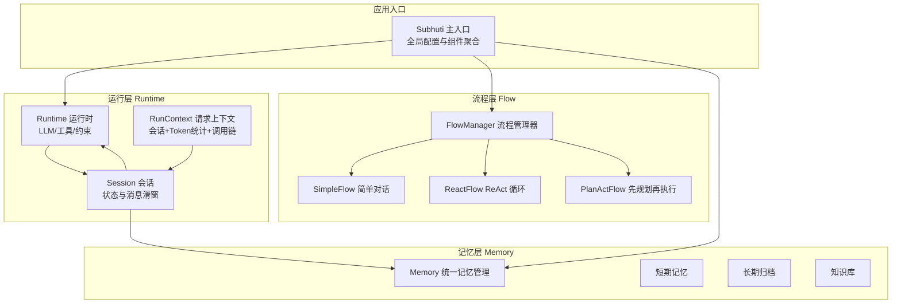
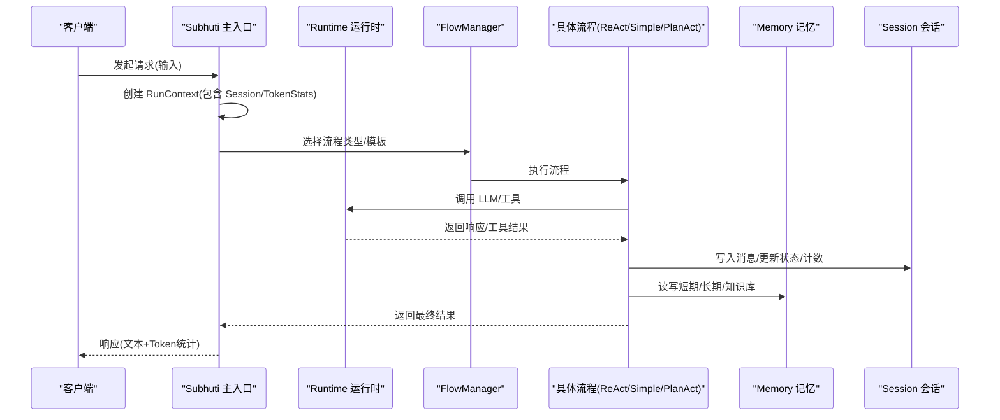
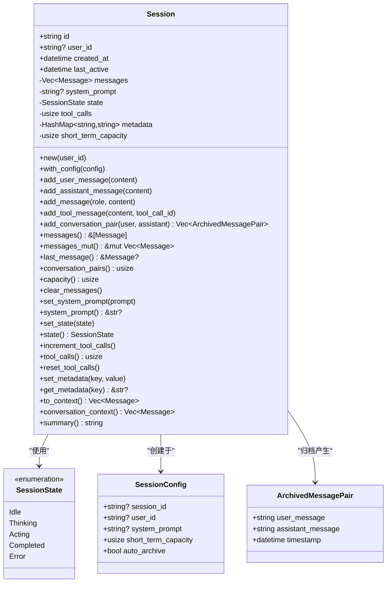
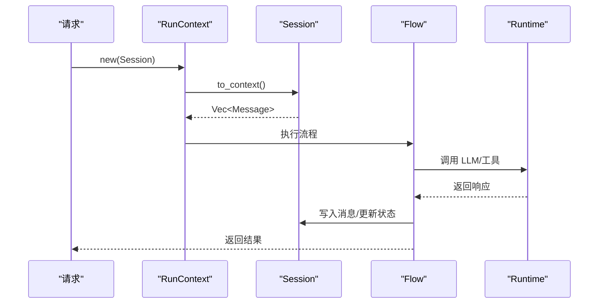
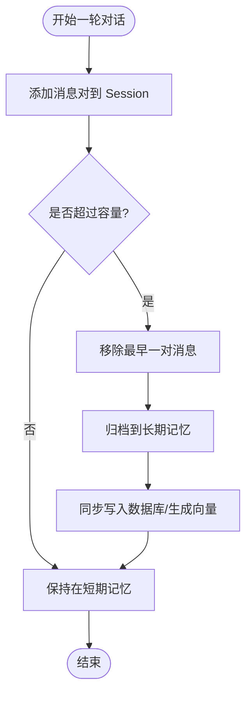
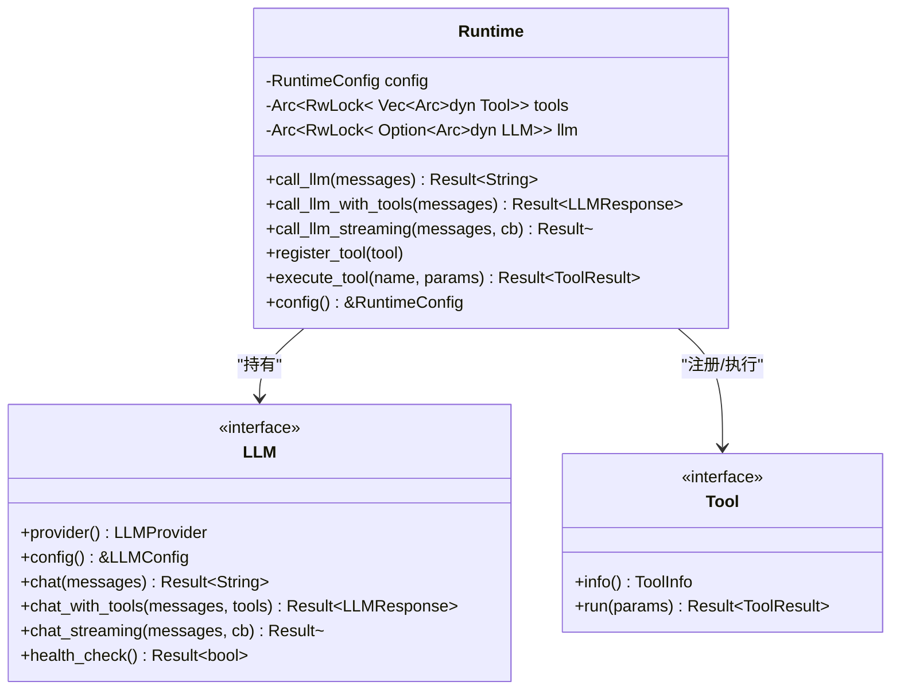
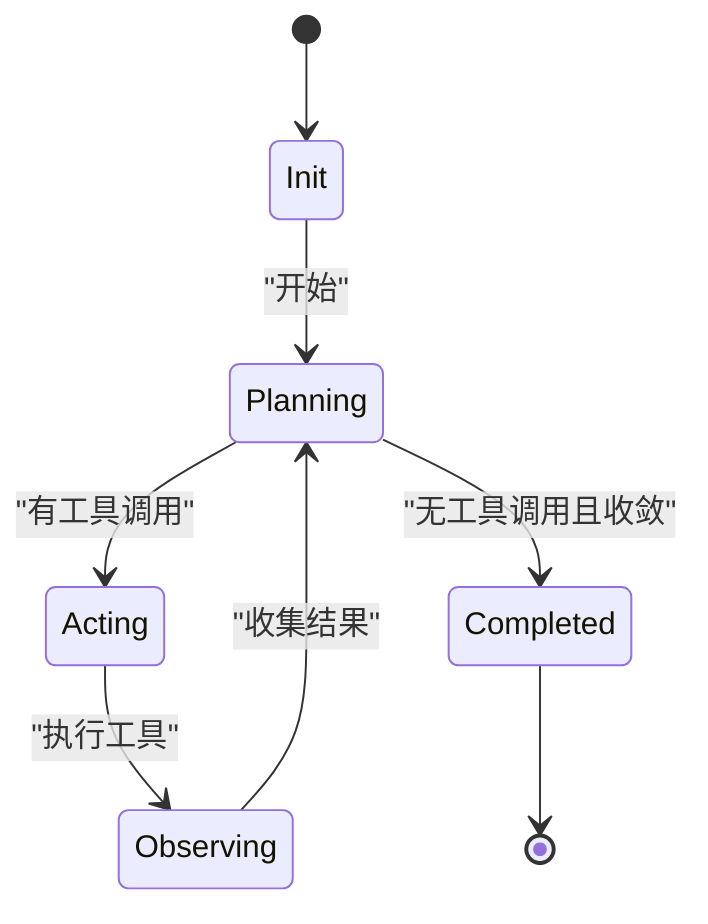
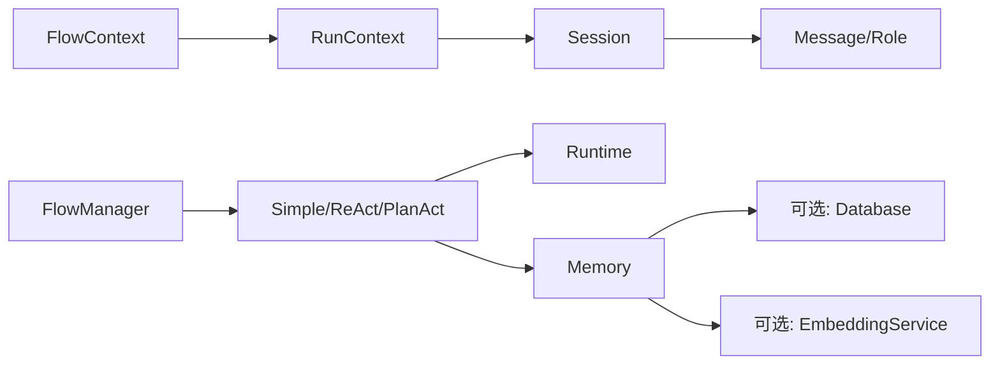

# 会话管理

<cite>
**本文引用的文件**
- [session.rs](file://crates/subhuti/src/runtime/session.rs)
- [context.rs](file://crates/subhuti/src/context.rs)
- [lib.rs](file://crates/subhuti/src/lib.rs)
- [runtime/mod.rs](file://crates/subhuti/src/runtime/mod.rs)
- [runtime/llm/mod.rs](file://crates/subhuti/src/runtime/llm/mod.rs)
- [runtime/tools/mod.rs](file://crates/subhuti/src/runtime/tools/mod.rs)
- [memory/mod.rs](file://crates/subhuti/src/memory/mod.rs)
- [flow/mod.rs](file://crates/subhuti/src/flow/mod.rs)
- [flow/react.rs](file://crates/subhuti/src/flow/react.rs)
- [flow/simple.rs](file://crates/subhuti/src/flow/simple.rs)
- [flow/plan_act.rs](file://crates/subhuti/src/flow/plan_act.rs)
- [integration_test.rs](file://crates/subhuti/tests/integration_test.rs)
- [Cargo.toml](file://Cargo.toml)
</cite>

## 目录
1. [简介](#简介)
2. [项目结构](#项目结构)
3. [核心组件](#核心组件)
4. [架构总览](#架构总览)
5. [详细组件分析](#详细组件分析)
6. [依赖关系分析](#依赖关系分析)
7. [性能考量](#性能考量)
8. [故障排查指南](#故障排查指南)
9. [结论](#结论)
10. [附录](#附录)

## 简介
本文件围绕会话管理系统进行系统化技术文档整理，重点覆盖 Session 结构的设计架构、会话状态（SessionState）的生命周期管理、配置（SessionConfig）参数设置；深入说明状态维护机制、上下文传递策略、会话恢复与持久化方案；解释会话与运行时的交互模式、状态隔离原则、并发访问控制；并提供会话设计模式、内存管理策略、性能优化技巧、配置示例、状态监控方法与故障恢复策略。

## 项目结构
会话管理位于运行层（Runtime Layer）的 session 模块，配合上下文（RunContext）、流程（Flow）、记忆（Memory）与运行时（Runtime）共同构成完整的 Agent 执行闭环。整体采用“全局共享 + 请求级上下文”的分层设计，确保状态隔离与可扩展性。

图示来源
- [lib.rs:84-156](file://crates/subhuti/src/lib.rs#L84-L156)
- [runtime/mod.rs:16-25](file://crates/subhuti/src/runtime/mod.rs#L16-L25)
- [flow/mod.rs:677-800](file://crates/subhuti/src/flow/mod.rs#L677-L800)
- [memory/mod.rs:164-173](file://crates/subhuti/src/memory/mod.rs#L164-L173)

章节来源
- [lib.rs:84-156](file://crates/subhuti/src/lib.rs#L84-L156)
- [runtime/mod.rs:16-25](file://crates/subhuti/src/runtime/mod.rs#L16-L25)
- [flow/mod.rs:677-800](file://crates/subhuti/src/flow/mod.rs#L677-L800)
- [memory/mod.rs:164-173](file://crates/subhuti/src/memory/mod.rs#L164-L173)

## 核心组件
- 会话（Session）：承载会话 ID、用户 ID、创建/活跃时间、消息历史（滑动窗口）、系统提示词、状态、工具调用计数、元数据与短期记忆容量等。
- 会话配置（SessionConfig）：包含 session_id、user_id、system_prompt、short_term_capacity、auto_archive 等参数。
- 会话状态（SessionState）：Idle、Thinking、Acting、Completed、Error，用于跟踪会话生命周期。
- 请求上下文（RunContext）：包含 Session、Token 统计（Arc 共享）、调用链等，用于一次请求内的可变状态管理。
- 运行时（Runtime）：无状态，负责 LLM 调用、工具执行、约束控制，与 Session 解耦。
- 流程（Flow）：Simple/ReAct/PlanAct 等，驱动会话状态流转与工具调用。
- 记忆（Memory）：短期/长期/知识库三层记忆，支持归档与向量检索。

章节来源
- [session.rs:16-90](file://crates/subhuti/src/runtime/session.rs#L16-L90)
- [context.rs:51-86](file://crates/subhuti/src/context.rs#L51-L86)
- [runtime/mod.rs:57-62](file://crates/subhuti/src/runtime/mod.rs#L57-L62)
- [flow/mod.rs:256-288](file://crates/subhuti/src/flow/mod.rs#L256-L288)

## 架构总览
会话管理遵循“状态在 Session，运行时无状态”的设计原则。Subhuti 主入口负责组装全局组件（Runtime、FlowManager、Memory、Skill 等），每次请求通过 RunContext 将 Session 与 Token 统计注入到流程执行链路中，最终由 Flow 驱动 Runtime 完成 LLM 与工具调用，期间通过 Session 维护消息历史与状态。

图示来源
- [lib.rs:655-742](file://crates/subhuti/src/lib.rs#L655-L742)
- [flow/mod.rs:729-794](file://crates/subhuti/src/flow/mod.rs#L729-L794)
- [runtime/mod.rs:146-223](file://crates/subhuti/src/runtime/mod.rs#L146-L223)
- [memory/mod.rs:370-383](file://crates/subhuti/src/memory/mod.rs#L370-L383)

## 详细组件分析

### 会话（Session）设计与生命周期
- 结构组成：id、user_id、created_at、last_active、messages（滑动窗口）、system_prompt、state、tool_calls、metadata、short_term_capacity。
- 生命周期状态：Idle → Thinking/Acting（工具调用）→ Completed；异常时进入 Error。
- 消息滑动窗口：add_conversation_pair 在容量超限时，从最早的一对消息开始归档，支持自动归档（auto_archive）。
- 上下文生成：to_context() 将 system_prompt 与消息历史组合为 LLM 输入；conversation_context() 仅返回对话历史。
- 工具调用追踪：increment_tool_calls()/tool_calls()/reset_tool_calls() 用于统计工具调用次数。
- 元数据与摘要：set_metadata()/get_metadata()/summary() 支持扩展属性与会话摘要。

图示来源
- [session.rs:16-308](file://crates/subhuti/src/runtime/session.rs#L16-L308)

章节来源
- [session.rs:16-308](file://crates/subhuti/src/runtime/session.rs#L16-L308)

### 会话配置（SessionConfig）与参数设置
- 关键参数
  - session_id：会话标识，未提供时自动生成。
  - user_id：用户标识，便于多用户隔离。
  - system_prompt：系统提示词，可注入到上下文。
  - short_term_capacity：短期记忆滑动窗口容量（以“消息对”计，每对两条消息）。
  - auto_archive：是否启用超额自动归档。
- 默认行为：默认容量为 3 对（约 3 轮对话），启用自动归档。

章节来源
- [session.rs:16-41](file://crates/subhuti/src/runtime/session.rs#L16-L41)

### 状态维护机制与上下文传递
- RunContext 设计：将 Session、TokenStats（Arc 共享）、调用链等作为请求级状态，避免全局污染。
- 上下文生成：Session.to_context() 将 system_prompt 与历史消息拼接，作为 LLM 的完整上下文；conversation_context() 仅包含对话历史。
- Token 统计：RunContext 与 SkillContext 内部均持有 Arc<RwLock<TokenStats>>，跨调用累加统计。

图示来源
- [context.rs:51-86](file://crates/subhuti/src/context.rs#L51-L86)
- [session.rs:275-297](file://crates/subhuti/src/runtime/session.rs#L275-L297)
- [flow/mod.rs:393-403](file://crates/subhuti/src/flow/mod.rs#L393-L403)

章节来源
- [context.rs:51-86](file://crates/subhuti/src/context.rs#L51-L86)
- [session.rs:275-297](file://crates/subhuti/src/runtime/session.rs#L275-L297)
- [flow/mod.rs:393-403](file://crates/subhuti/src/flow/mod.rs#L393-L403)

### 会话恢复与持久化方案
- 短期记忆滑动窗口：add_conversation_pair 超限时自动归档最早的一对消息，形成 ArchivedMessagePair。
- 长期归档与知识库：Memory 层提供短期归档到长期、知识库检索与向量搜索能力；可结合数据库实现持久化。
- 数据库双写策略：Memory 在写入短期记忆时可异步写入数据库并生成向量嵌入，确保数据一致性与检索能力。
- 心灵宫殿（MemoryPalace）：提供分区化记忆组织与遗忘周期，支持人格化的记忆偏好与统计。

图示来源
- [session.rs:157-198](file://crates/subhuti/src/runtime/session.rs#L157-L198)
- [memory/mod.rs:335-368](file://crates/subhuti/src/memory/mod.rs#L335-L368)

章节来源
- [session.rs:157-198](file://crates/subhuti/src/runtime/session.rs#L157-L198)
- [memory/mod.rs:335-368](file://crates/subhuti/src/memory/mod.rs#L335-L368)

### 会话与运行时交互模式
- 运行时（Runtime）无状态：通过 Arc 共享，避免请求间状态污染。
- LLM/工具调用：Runtime 提供 chat/chat_with_tools/chat_streaming 等统一接口；工具通过 Tool trait 注册。
- 会话驱动：Flow 在执行过程中通过 Session.to_context() 获取上下文，调用 Runtime 完成推理与工具执行。

图示来源
- [runtime/mod.rs:57-259](file://crates/subhuti/src/runtime/mod.rs#L57-L259)
- [runtime/llm/mod.rs:124-148](file://crates/subhuti/src/runtime/llm/mod.rs#L124-L148)
- [runtime/tools/mod.rs:53-61](file://crates/subhuti/src/runtime/tools/mod.rs#L53-L61)

章节来源
- [runtime/mod.rs:57-259](file://crates/subhuti/src/runtime/mod.rs#L57-L259)
- [runtime/llm/mod.rs:124-148](file://crates/subhuti/src/runtime/llm/mod.rs#L124-L148)
- [runtime/tools/mod.rs:53-61](file://crates/subhuti/src/runtime/tools/mod.rs#L53-L61)

### 状态隔离与并发访问控制
- RunContext 使用 Arc<RwLock<TokenStats>> 实现跨调用共享的 Token 统计，保证并发安全。
- Session 作为请求级可变状态，与全局 Runtime 解耦，避免竞态。
- Flow 在执行过程中通过 FlowContext 将 Session、Runtime、Memory 注入，严格限定作用域。

章节来源
- [context.rs:18-49](file://crates/subhuti/src/context.rs#L18-L49)
- [flow/mod.rs:290-310](file://crates/subhuti/src/flow/mod.rs#L290-L310)

### 设计模式与流程模板
- 预设流程模板：Simple/ReAct/PlanAct/Chain-of-Thought，Skill 可选择使用或完全自定义。
- ReAct 循环：先规划（Plan），再执行（Act），观察（Observe），反思（Reflect），直至收敛。
- PlanAct：先生成计划，再逐条执行工具，最后总结回答。
- Simple：直接调用 LLM，适合简单对话。

图示来源
- [flow/mod.rs:256-288](file://crates/subhuti/src/flow/mod.rs#L256-L288)
- [flow/react.rs:107-196](file://crates/subhuti/src/flow/react.rs#L107-L196)
- [flow/plan_act.rs:95-154](file://crates/subhuti/src/flow/plan_act.rs#L95-L154)
- [flow/simple.rs:47-60](file://crates/subhuti/src/flow/simple.rs#L47-L60)

章节来源
- [flow/mod.rs:93-113](file://crates/subhuti/src/flow/mod.rs#L93-L113)
- [flow/react.rs:107-196](file://crates/subhuti/src/flow/react.rs#L107-L196)
- [flow/plan_act.rs:95-154](file://crates/subhuti/src/flow/plan_act.rs#L95-L154)
- [flow/simple.rs:47-60](file://crates/subhuti/src/flow/simple.rs#L47-L60)

### 内存管理策略与性能优化
- 滑动窗口与自动归档：通过 short_term_capacity 控制短期记忆容量，避免无限增长；超限时自动归档，降低上下文长度与内存占用。
- Token 统计与约束：RuntimeConfig 提供 max_turns、max_context_tokens、timeout_seconds 等约束，防止过度消耗。
- 工具调用计数：Session.tool_calls 与 Flow 中的收敛阈值协同，避免无效循环。
- 异步持久化：Memory 写入短期记忆时异步写入数据库并生成向量，提升吞吐。

章节来源
- [session.rs:220-263](file://crates/subhuti/src/runtime/session.rs#L220-L263)
- [runtime/mod.rs:30-55](file://crates/subhuti/src/runtime/mod.rs#L30-L55)
- [memory/mod.rs:260-318](file://crates/subhuti/src/memory/mod.rs#L260-L318)

## 依赖关系分析
- Session 依赖 LLM 的 Message/Role 定义，用于上下文拼接。
- RunContext 依赖 Session、TokenStats，FlowContext 依赖 RunContext 与 Session。
- FlowManager 统一调度 Simple/ReAct/PlanAct，依赖 Runtime 与 Memory。
- Memory 与数据库/Embedding 服务可选集成，支持双写与向量检索。

图示来源
- [runtime/llm/mod.rs:19-81](file://crates/subhuti/src/runtime/llm/mod.rs#L19-L81)
- [context.rs:51-86](file://crates/subhuti/src/context.rs#L51-L86)
- [flow/mod.rs:677-800](file://crates/subhuti/src/flow/mod.rs#L677-L800)
- [memory/mod.rs:164-173](file://crates/subhuti/src/memory/mod.rs#L164-L173)

章节来源
- [runtime/llm/mod.rs:19-81](file://crates/subhuti/src/runtime/llm/mod.rs#L19-L81)
- [context.rs:51-86](file://crates/subhuti/src/context.rs#L51-L86)
- [flow/mod.rs:677-800](file://crates/subhuti/src/flow/mod.rs#L677-L800)
- [memory/mod.rs:164-173](file://crates/subhuti/src/memory/mod.rs#L164-L173)

## 性能考量
- 滑动窗口容量：合理设置 short_term_capacity，平衡上下文长度与记忆丰富度。
- 工具调用收敛：通过收敛阈值与工具调用计数，避免无效循环与 Token 消耗。
- 异步持久化：短期记忆写入时异步落库与生成向量，避免阻塞主流程。
- Token 限额与超时：RuntimeConfig 的 max_context_tokens、timeout_seconds 限制资源消耗。
- 关键路径优化：FlowContext 的上下文数据缓存与模板变量替换，减少重复计算。

## 故障排查指南
- 健康检查：Subhuti.health_check() 汇总 MemoryPalace、Database、SoulLayer、ExpertPlugins、Skills 等组件状态。
- Token 统计：RunContext/SkillContext 的 TokenStats 累加可用于定位异常高消耗环节。
- 记忆归档：若发现对话丢失，检查 short_term_capacity 与归档阈值配置。
- LLM/工具不可用：确认 Runtime.has_llm() 与工具注册情况，查看日志与错误返回。

章节来源
- [lib.rs:573-647](file://crates/subhuti/src/lib.rs#L573-L647)
- [context.rs:18-49](file://crates/subhuti/src/context.rs#L18-L49)
- [memory/mod.rs:313-333](file://crates/subhuti/src/memory/mod.rs#L313-L333)

## 结论
会话管理系统以 Session 为核心，结合 RunContext 的请求级状态、Flow 的流程编排、Runtime 的无状态执行与 Memory 的三层记忆，实现了高隔离、可扩展、可监控的会话生命周期管理。通过滑动窗口与自动归档、Token 限额与收敛控制、异步持久化与向量检索等策略，兼顾性能与可靠性。建议在生产环境中结合健康检查与 Token 统计持续监控，并根据业务场景调整 short_term_capacity 与流程模板。

## 附录

### 会话配置示例（参数说明）
- session_id：会话唯一标识，未提供时自动生成。
- user_id：用户标识，便于多租户/多用户隔离。
- system_prompt：系统提示词，注入到上下文。
- short_term_capacity：短期记忆容量（消息对数量）。
- auto_archive：是否启用超额自动归档。

章节来源
- [session.rs:16-41](file://crates/subhuti/src/runtime/session.rs#L16-L41)

### 状态监控方法
- 健康检查：Subhuti.health_check() 输出组件健康状态与统计。
- Token 统计：RunContext/SkillContext 的 TokenStats 累加，支持跨调用共享。
- 记忆统计：Memory.stats() 返回短期/长期/知识库计数。

章节来源
- [lib.rs:573-647](file://crates/subhuti/src/lib.rs#L573-L647)
- [context.rs:18-49](file://crates/subhuti/src/context.rs#L18-L49)
- [memory/mod.rs:436-443](file://crates/subhuti/src/memory/mod.rs#L436-L443)

### 故障恢复策略
- 会话恢复：通过 Session 的消息历史与 system_prompt 重建上下文，结合 Memory 的检索恢复关键信息。
- 持久化回退：若短期记忆丢失，可通过长期归档与知识库检索恢复。
- 资源限制：遇到超时或 Token 超限，调整 RuntimeConfig 的超时与上下文长度限制。

章节来源
- [memory/mod.rs:335-368](file://crates/subhuti/src/memory/mod.rs#L335-L368)
- [runtime/mod.rs:30-55](file://crates/subhuti/src/runtime/mod.rs#L30-L55)