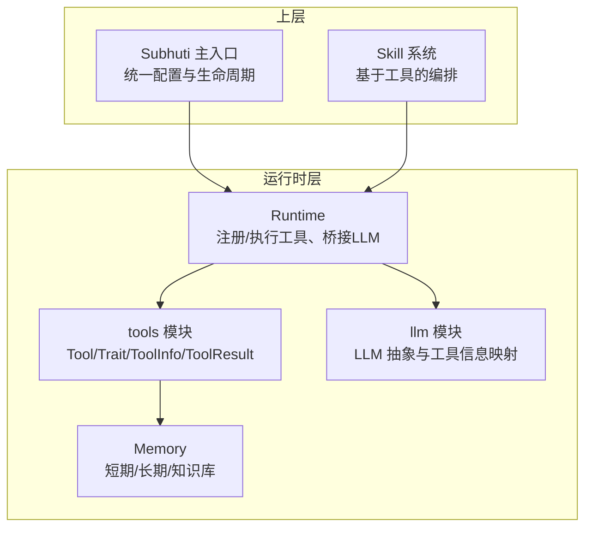
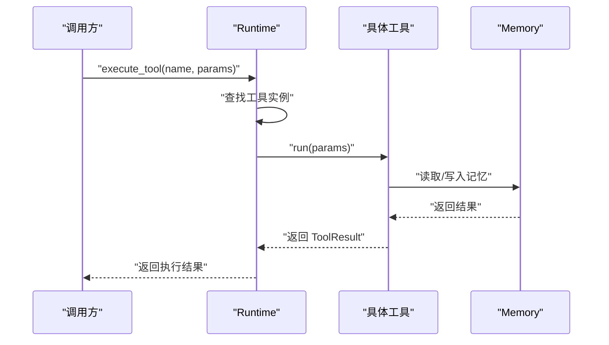
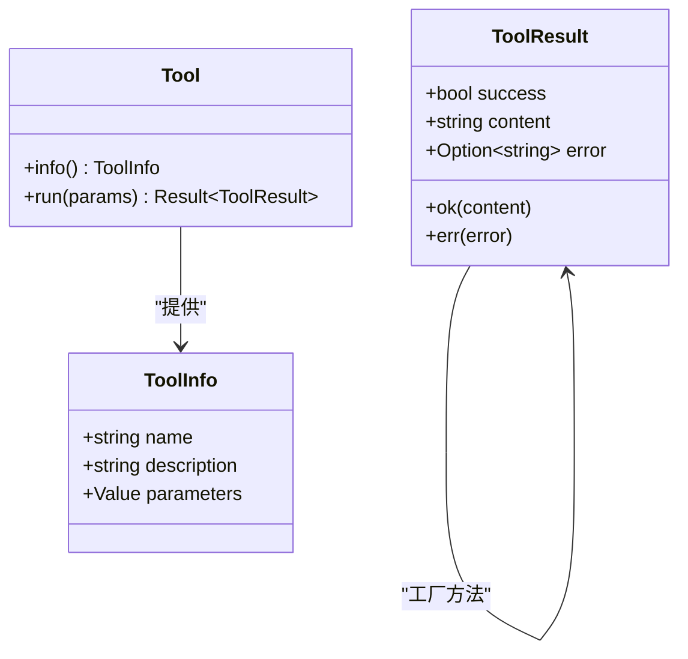
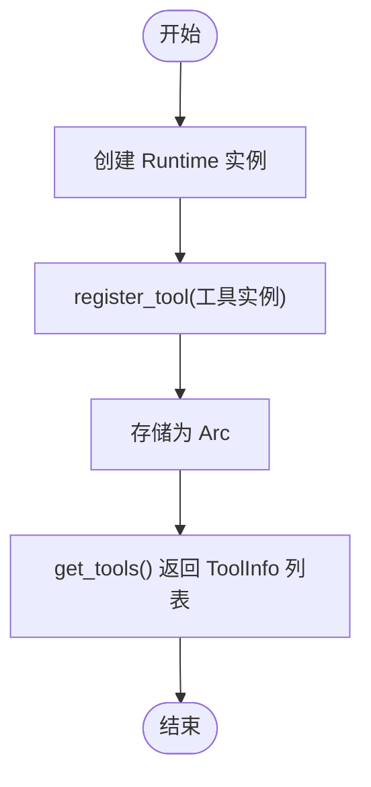
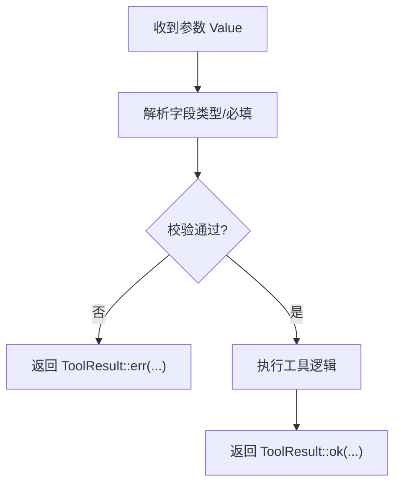
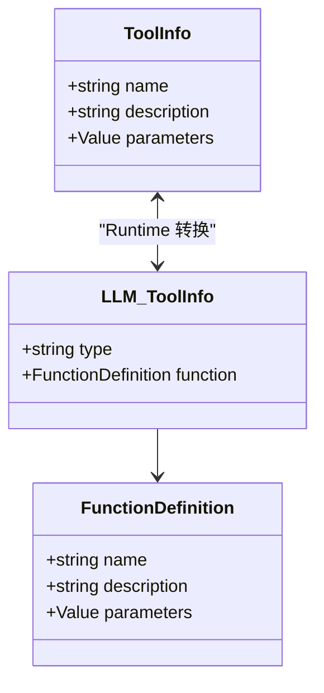
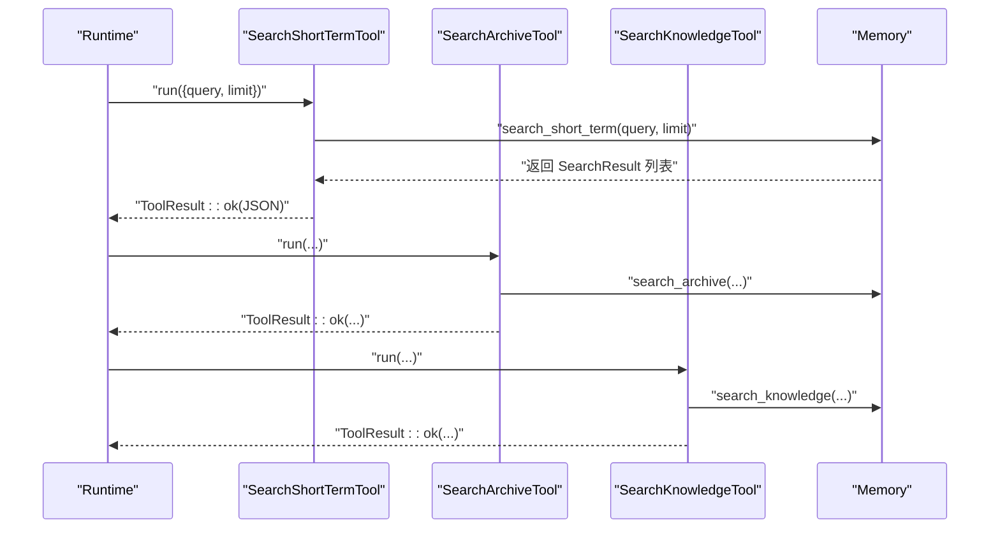
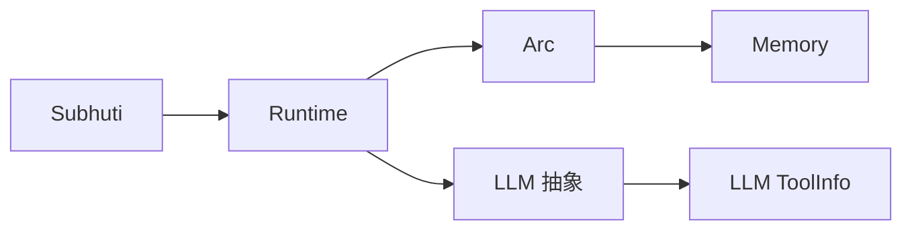

# 工具系统

<cite>
**本文引用的文件**
- [crates/subhuti/src/runtime/tools/mod.rs](file://crates/subhuti/src/runtime/tools/mod.rs)
- [crates/subhuti/src/runtime/mod.rs](file://crates/subhuti/src/runtime/mod.rs)
- [crates/subhuti/src/runtime/llm/mod.rs](file://crates/subhuti/src/runtime/llm/mod.rs)
- [crates/subhuti/src/memory/mod.rs](file://crates/subhuti/src/memory/mod.rs)
- [crates/subhuti/src/lib.rs](file://crates/subhuti/src/lib.rs)
- [crates/subhuti/tests/test_llm_mock.rs](file://crates/subhuti/tests/test_llm_mock.rs)
- [docs/DEBUG_TOOLS.md](file://docs/DEBUG_TOOLS.md)
</cite>

## 目录
1. [简介](#简介)
2. [项目结构](#项目结构)
3. [核心组件](#核心组件)
4. [架构总览](#架构总览)
5. [详细组件分析](#详细组件分析)
6. [依赖关系分析](#依赖关系分析)
7. [性能考量](#性能考量)
8. [故障排查指南](#故障排查指南)
9. [结论](#结论)
10. [附录](#附录)

## 简介
本文件系统性阐述 Subhuti 框架中的“工具系统”，围绕 Tool trait 的设计原则、工具注册与执行、参数校验、结果标准化、错误处理与异步模式展开，并结合内置记忆工具与运行时集成给出最佳实践、组合使用模式与性能优化建议。目标读者既包括希望快速上手的开发者，也包括需要深入理解实现细节的技术人员。

## 项目结构
工具系统位于运行时层（runtime），与 LLM 抽象、约束护栏、会话管理共同构成执行层；工具通过运行时统一注册与调度，向 LLM 暴露函数式工具信息，支持工具调用链路与结果回传。

图表来源
- [crates/subhuti/src/runtime/mod.rs:57-259](file://crates/subhuti/src/runtime/mod.rs#L57-L259)
- [crates/subhuti/src/runtime/tools/mod.rs:53-61](file://crates/subhuti/src/runtime/tools/mod.rs#L53-L61)
- [crates/subhuti/src/runtime/llm/mod.rs:168-201](file://crates/subhuti/src/runtime/llm/mod.rs#L168-L201)
- [crates/subhuti/src/memory/mod.rs:164-444](file://crates/subhuti/src/memory/mod.rs#L164-L444)

章节来源
- [crates/subhuti/src/runtime/mod.rs:1-277](file://crates/subhuti/src/runtime/mod.rs#L1-L277)
- [crates/subhuti/src/runtime/tools/mod.rs:1-213](file://crates/subhuti/src/runtime/tools/mod.rs#L1-L213)
- [crates/subhuti/src/runtime/llm/mod.rs:160-239](file://crates/subhuti/src/runtime/llm/mod.rs#L160-L239)
- [crates/subhuti/src/memory/mod.rs:1-496](file://crates/subhuti/src/memory/mod.rs#L1-L496)
- [crates/subhuti/src/lib.rs:22-48](file://crates/subhuti/src/lib.rs#L22-L48)

## 核心组件
- Tool trait：最小可用接口，包含工具元信息与异步执行方法，确保可组合、可替换、可测试。
- ToolInfo：工具元数据，包含名称、描述与参数 JSON Schema，用于 LLM 工具调用声明。
- ToolResult：工具执行结果的标准化结构，统一 success/content/error 字段。
- 运行时 Runtime：集中注册工具、暴露 get_tools/execute_tool 接口，并将工具信息映射为 LLM 可消费的格式。
- 内置记忆工具：基于 Memory 的三个工具（短期/长期/知识库），展示参数 schema 与执行流程。
- LLM 工具信息映射：将 ToolInfo 转换为 LLM 的 ToolInfo/FunctionDefinition，打通工具调用链路。

章节来源
- [crates/subhuti/src/runtime/tools/mod.rs:11-61](file://crates/subhuti/src/runtime/tools/mod.rs#L11-L61)
- [crates/subhuti/src/runtime/mod.rs:225-253](file://crates/subhuti/src/runtime/mod.rs#L225-L253)
- [crates/subhuti/src/runtime/llm/mod.rs:168-201](file://crates/subhuti/src/runtime/llm/mod.rs#L168-L201)

## 架构总览
工具系统在运行时层承担“能力抽象与执行”的职责，向上承接 Skill/Flow 的编排，向下对接 Memory 与 LLM。工具注册后，Runtime 以 Arc<dyn Tool> 形式持有，支持并发安全访问；执行时按名称查找并异步调用。

图表来源
- [crates/subhuti/src/runtime/mod.rs:240-253](file://crates/subhuti/src/runtime/mod.rs#L240-L253)
- [crates/subhuti/src/runtime/tools/mod.rs:103-111](file://crates/subhuti/src/runtime/tools/mod.rs#L103-L111)
- [crates/subhuti/src/memory/mod.rs:370-383](file://crates/subhuti/src/memory/mod.rs#L370-L383)

## 详细组件分析

### Tool trait 与数据结构
- ToolInfo：包含 name/description/parameters（JSON Schema）。参数 schema 用于 LLM 工具调用时的参数校验与自动补全。
- ToolResult：success/content/error 三段式结构，便于统一处理与上层解析。
- Tool：info()/run() 两方法，run() 返回 Result<ToolResult>，支持异步执行与错误传播。

图表来源
- [crates/subhuti/src/runtime/tools/mod.rs:11-61](file://crates/subhuti/src/runtime/tools/mod.rs#L11-L61)

章节来源
- [crates/subhuti/src/runtime/tools/mod.rs:11-61](file://crates/subhuti/src/runtime/tools/mod.rs#L11-L61)

### 工具注册机制
- 运行时注册：Runtime::register_tool<T: Tool + 'static>(...) 将工具包装为 Arc<dyn Tool> 并存入共享容器。
- 获取工具清单：Runtime::get_tools() 将所有工具的 ToolInfo 暴露给上层（例如 LLM 的工具声明）。
- 注册内置记忆工具：通过 register_memory_tools(...) 将短期/长期/知识库工具一次性注册。

图表来源
- [crates/subhuti/src/runtime/mod.rs:225-238](file://crates/subhuti/src/runtime/mod.rs#L225-L238)
- [crates/subhuti/src/runtime/tools/mod.rs:207-212](file://crates/subhuti/src/runtime/tools/mod.rs#L207-L212)

章节来源
- [crates/subhuti/src/runtime/mod.rs:225-238](file://crates/subhuti/src/runtime/mod.rs#L225-L238)
- [crates/subhuti/src/runtime/tools/mod.rs:207-212](file://crates/subhuti/src/runtime/tools/mod.rs#L207-L212)

### 参数验证流程
- 参数来源：来自 LLM 的工具调用请求（JSON），由 Runtime.execute_tool 接收。
- 验证策略：工具实现内部自行解析 serde_json::Value 并进行类型/必填/范围校验；若校验失败，返回 ToolResult::err(...)。
- Schema 声明：ToolInfo.parameters 采用 JSON Schema，用于 LLM 理解参数约束，但实际校验在代码层执行，不依赖 LLM 的参数准确性。

图表来源
- [crates/subhuti/src/runtime/tools/mod.rs:103-111](file://crates/subhuti/src/runtime/tools/mod.rs#L103-L111)
- [crates/subhuti/src/runtime/tools/mod.rs:43-50](file://crates/subhuti/src/runtime/tools/mod.rs#L43-L50)

章节来源
- [crates/subhuti/src/runtime/tools/mod.rs:103-111](file://crates/subhuti/src/runtime/tools/mod.rs#L103-L111)
- [crates/subhuti/src/runtime/tools/mod.rs:43-50](file://crates/subhuti/src/runtime/tools/mod.rs#L43-L50)

### 执行结果处理
- 成功：ToolResult::ok(content)，content 通常为序列化后的结构化数据（如 JSON 字符串）。
- 失败：ToolResult::err(error)，error 为人类可读的错误信息，便于上层处理与重试/降级。
- 上层使用：Runtime.execute_tool 返回 Result<ToolResult>，调用方可据此决定后续动作（如再次调用/终止）。

章节来源
- [crates/subhuti/src/runtime/tools/mod.rs:33-51](file://crates/subhuti/src/runtime/tools/mod.rs#L33-L51)
- [crates/subhuti/src/runtime/mod.rs:240-253](file://crates/subhuti/src/runtime/mod.rs#L240-L253)

### 工具信息（ToolInfo）与 LLM 映射
- ToolInfo：name/description/parameters（JSON Schema）。
- LLM ToolInfo：Runtime 在调用 LLM 时，将工具列表转换为 LLM 的 ToolInfo（type=function，function=name/description/parameters）。
- 作用：使 LLM 能够正确声明工具签名，从而进行参数校验与自动调用。

图表来源
- [crates/subhuti/src/runtime/tools/mod.rs:11-20](file://crates/subhuti/src/runtime/tools/mod.rs#L11-L20)
- [crates/subhuti/src/runtime/llm/mod.rs:168-186](file://crates/subhuti/src/runtime/llm/mod.rs#L168-L186)
- [crates/subhuti/src/runtime/mod.rs:198-223](file://crates/subhuti/src/runtime/mod.rs#L198-L223)

章节来源
- [crates/subhuti/src/runtime/llm/mod.rs:168-201](file://crates/subhuti/src/runtime/llm/mod.rs#L168-L201)
- [crates/subhuti/src/runtime/mod.rs:198-223](file://crates/subhuti/src/runtime/mod.rs#L198-L223)

### 内置记忆工具（SearchShortTerm/Archive/Knowledge）
- 工具职责：基于 Memory 的三层记忆进行检索，返回结构化结果。
- 参数 schema：包含 query（字符串，必填）与 limit（整数，可选默认值）。
- 执行流程：从 params 中提取 query/limit，调用 Memory 对应方法，将结果序列化为字符串放入 ToolResult.content。
- 注册方式：通过 register_memory_tools(...) 一次性注册到 Runtime。

图表来源
- [crates/subhuti/src/runtime/tools/mod.rs:69-112](file://crates/subhuti/src/runtime/tools/mod.rs#L69-L112)
- [crates/subhuti/src/runtime/tools/mod.rs:115-158](file://crates/subhuti/src/runtime/tools/mod.rs#L115-L158)
- [crates/subhuti/src/runtime/tools/mod.rs:161-204](file://crates/subhuti/src/runtime/tools/mod.rs#L161-L204)
- [crates/subhuti/src/memory/mod.rs:370-383](file://crates/subhuti/src/memory/mod.rs#L370-L383)

章节来源
- [crates/subhuti/src/runtime/tools/mod.rs:69-204](file://crates/subhuti/src/runtime/tools/mod.rs#L69-L204)
- [crates/subhuti/src/memory/mod.rs:370-383](file://crates/subhuti/src/memory/mod.rs#L370-L383)

### 工具开发最佳实践
- 元数据优先：name 使用动词+下划线命名，description 体现“功能+场景+边界”，提升 LLM 调用准确率。
- 参数契约：严格使用 JSON Schema 声明字段类型、必填项、默认值与格式约束；在工具内部再次校验，不依赖 LLM 的参数准确性。
- 结果标准化：统一返回 ToolResult，content 使用结构化 JSON 字符串，error 仅在失败时填充。
- 异步与并发：工具实现为异步，注意避免阻塞；并发访问 Memory 时使用合适的锁策略。
- 可测试性：通过 MockLLM 与自定义工具配合，构建端到端测试链路。

章节来源
- [crates/subhuti/src/runtime/tools/mod.rs:11-20](file://crates/subhuti/src/runtime/tools/mod.rs#L11-L20)
- [crates/subhuti/src/runtime/tools/mod.rs:59-61](file://crates/subhuti/src/runtime/tools/mod.rs#L59-L61)
- [crates/subhuti/tests/test_llm_mock.rs:245-296](file://crates/subhuti/tests/test_llm_mock.rs#L245-L296)

### 错误处理策略
- 工具内部：参数缺失/类型错误/业务异常均通过 ToolResult::err(...) 返回，携带错误信息。
- 运行时：未找到工具时返回错误；LLM 未配置时调用 LLM 抛错。
- 上层兜底：调用方可根据 ToolResult.success 与 error 字段决定重试、降级或终止。

章节来源
- [crates/subhuti/src/runtime/tools/mod.rs:43-50](file://crates/subhuti/src/runtime/tools/mod.rs#L43-L50)
- [crates/subhuti/src/runtime/mod.rs:240-253](file://crates/subhuti/src/runtime/mod.rs#L240-L253)

### 异步执行模式
- Tool::run 为异步方法，适配 IO 密集型工具（如数据库、网络请求、嵌入向量化）。
- 运行时 execute_tool 为异步，支持并发调用多个工具。
- 内置记忆工具在执行时直接同步调用 Memory 的同步方法，但整体仍保持异步接口一致性。

章节来源
- [crates/subhuti/src/runtime/tools/mod.rs:59-61](file://crates/subhuti/src/runtime/tools/mod.rs#L59-L61)
- [crates/subhuti/src/runtime/mod.rs:240-253](file://crates/subhuti/src/runtime/mod.rs#L240-L253)

### 自定义工具开发示例
- 定义结构体并实现 Tool trait，提供 info() 返回 ToolInfo（含 JSON Schema），run() 返回 ToolResult。
- 在测试或应用中通过 Runtime::register_tool 注册工具。
- 通过 Runtime::execute_tool 或 LLM 工具调用链路进行调用与验证。

章节来源
- [crates/subhuti/tests/test_llm_mock.rs:264-284](file://crates/subhuti/tests/test_llm_mock.rs#L264-L284)

### 工具组合使用模式
- Skill 编排：SkillContext 中注入工具数组，Skill 在执行时按需调用多个工具，形成工具链。
- LLM 工具调用：Runtime 将工具列表映射为 LLM 的工具签名，LLM 可自动选择并调用多个工具，再由 Runtime 汇总结果。

章节来源
- [crates/subhuti/src/runtime/mod.rs:198-223](file://crates/subhuti/src/runtime/mod.rs#L198-L223)

## 依赖关系分析
- 运行时依赖工具模块：Runtime 持有 Arc<dyn Tool> 列表，提供注册与执行接口。
- 工具依赖记忆模块：内置工具直接依赖 Memory 的三层检索能力。
- LLM 依赖工具模块：Runtime 将工具信息转换为 LLM 的 ToolInfo/FunctionDefinition。
- 主入口依赖运行时：Subhuti 暴露 runtime 引用，便于注册工具与执行。

图表来源
- [crates/subhuti/src/lib.rs:84-107](file://crates/subhuti/src/lib.rs#L84-L107)
- [crates/subhuti/src/runtime/mod.rs:57-62](file://crates/subhuti/src/runtime/mod.rs#L57-L62)
- [crates/subhuti/src/runtime/tools/mod.rs:69-204](file://crates/subhuti/src/runtime/tools/mod.rs#L69-L204)
- [crates/subhuti/src/runtime/llm/mod.rs:168-201](file://crates/subhuti/src/runtime/llm/mod.rs#L168-L201)

章节来源
- [crates/subhuti/src/lib.rs:84-107](file://crates/subhuti/src/lib.rs#L84-L107)
- [crates/subhuti/src/runtime/mod.rs:57-62](file://crates/subhuti/src/runtime/mod.rs#L57-L62)
- [crates/subhuti/src/runtime/tools/mod.rs:69-204](file://crates/subhuti/src/runtime/tools/mod.rs#L69-L204)
- [crates/subhuti/src/runtime/llm/mod.rs:168-201](file://crates/subhuti/src/runtime/llm/mod.rs#L168-L201)

## 性能考量
- 工具并发：Runtime 使用 Arc + RwLock 管理工具列表，支持并发读取；注册为一次性操作，运行时读多写少。
- 参数解析：工具内部对 serde_json::Value 进行解析，建议缓存常用配置与避免重复解析。
- 记忆检索：Memory 的检索为本地操作，注意 limit 控制与索引/向量化配置；必要时引入缓存。
- 异步 IO：对于外部服务调用，保持异步非阻塞；合理设置超时与重试策略。
- 调试与监控：借助调试工具与健康检查，定位性能瓶颈与死锁问题。

章节来源
- [crates/subhuti/src/runtime/mod.rs:58-72](file://crates/subhuti/src/runtime/mod.rs#L58-L72)
- [docs/DEBUG_TOOLS.md:1-386](file://docs/DEBUG_TOOLS.md#L1-L386)

## 故障排查指南
- 工具未找到：检查工具是否已通过 Runtime::register_tool 注册，名称是否一致。
- 参数校验失败：核对 ToolInfo.parameters 的 JSON Schema 与实际调用参数；在工具内部增加日志与断言。
- 执行异常：捕获 Result<ToolResult>，区分业务错误与系统错误；必要时启用 MockLLM 进行端到端验证。
- 死锁与性能问题：使用调试工具定位锁竞争与耗时操作，优化锁粒度与并发策略。

章节来源
- [crates/subhuti/src/runtime/mod.rs:240-253](file://crates/subhuti/src/runtime/mod.rs#L240-L253)
- [crates/subhuti/tests/test_llm_mock.rs:245-296](file://crates/subhuti/tests/test_llm_mock.rs#L245-L296)
- [docs/DEBUG_TOOLS.md:1-386](file://docs/DEBUG_TOOLS.md#L1-L386)

## 结论
工具系统以极简的 Tool trait 为核心，通过 ToolInfo 的 JSON Schema 契约与 ToolResult 的标准化输出，实现了与 LLM 的无缝集成与可组合的执行链路。运行时负责注册、并发安全与与 LLM 的工具信息映射；内置记忆工具展示了参数 schema、执行流程与结果序列化的最佳实践。结合调试工具与健康检查，开发者可以高效地开发、测试与优化自定义工具，并在生产环境中获得稳定与可观测的执行体验。

## 附录
- JSON Schema 参数示例：参考内置工具的 parameters 字段，包含属性、类型、必填项与默认值。
- 端到端测试：参考测试文件中 MockLLM 与自定义工具的组合使用方式。

章节来源
- [crates/subhuti/src/runtime/tools/mod.rs:85-99](file://crates/subhuti/src/runtime/tools/mod.rs#L85-L99)
- [crates/subhuti/tests/test_llm_mock.rs:245-296](file://crates/subhuti/tests/test_llm_mock.rs#L245-L296)