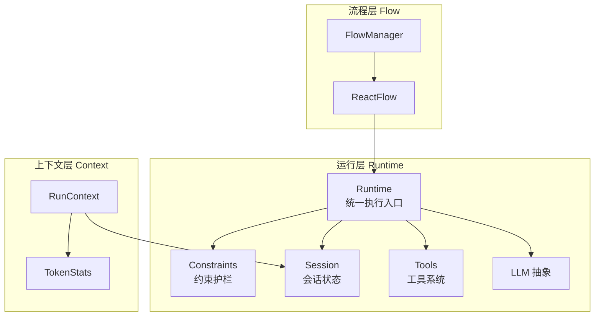
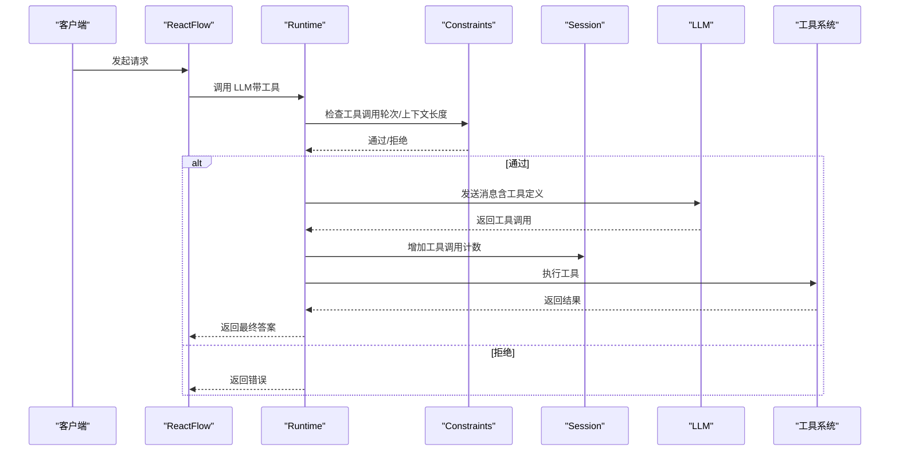
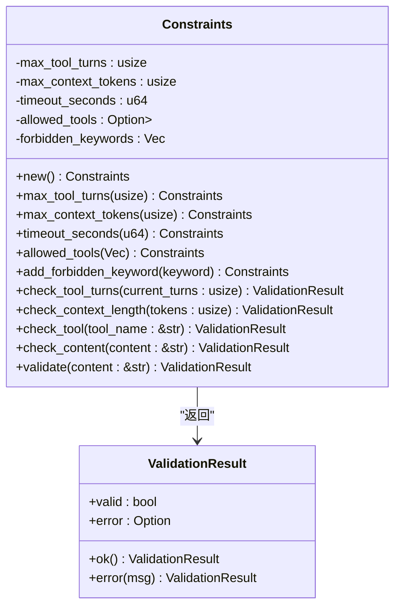
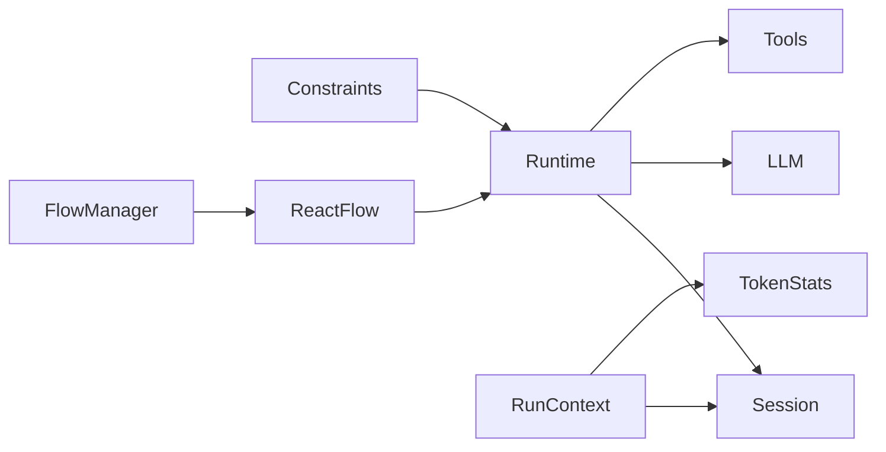

# 约束护栏

<cite>
**本文引用的文件**
- [crates/subhuti/src/runtime/constraints.rs](file://crates/subhuti/src/runtime/constraints.rs)
- [crates/subhuti/src/runtime/mod.rs](file://crates/subhuti/src/runtime/mod.rs)
- [crates/subhuti/src/runtime/session.rs](file://crates/subhuti/src/runtime/session.rs)
- [crates/subhuti/src/runtime/tools/mod.rs](file://crates/subhuti/src/runtime/tools/mod.rs)
- [crates/subhuti/src/context.rs](file://crates/subhuti/src/context.rs)
- [crates/subhuti/src/flow/react.rs](file://crates/subhuti/src/flow/react.rs)
- [crates/subhuti/src/flow/mod.rs](file://crates/subhuti/src/flow/mod.rs)
- [crates/subhuti/src/lib.rs](file://crates/subhuti/src/lib.rs)
- [crates/subhuti/src/memory/mod.rs](file://crates/subhuti/src/memory/mod.rs)
</cite>

## 目录
1. [引言](#引言)
2. [项目结构](#项目结构)
3. [核心组件](#核心组件)
4. [架构总览](#架构总览)
5. [详细组件分析](#详细组件分析)
6. [依赖关系分析](#依赖关系分析)
7. [性能考量](#性能考量)
8. [故障排查指南](#故障排查指南)
9. [结论](#结论)
10. [附录](#附录)

## 引言
本文件聚焦“约束护栏”系统，即运行层中的代码级强制限制机制，旨在通过最大工具调用轮次、上下文长度、超时控制以及输入/工具安全检查，确保系统在复杂交互与外部工具调用场景下的稳定性、安全性与可控性。文档将从设计理念、数据结构、处理逻辑、集成点、错误处理、性能影响、调试与监控等方面进行系统化阐述，并提供安全最佳实践、动态调整策略与故障排除技巧。

## 项目结构
约束护栏位于运行层（Runtime Layer），与 LLM 抽象、工具系统、会话管理、流程编排共同构成四层架构中的“执行层”。其主要职责是：
- 在代码层面实施强制约束，避免依赖提示词（prompt）的软性限制
- 保障系统在工具调用、上下文长度、超时等方面的边界安全
- 为上层流程（如 ReAct 循环）提供可组合的安全检查能力

图表来源
- [crates/subhuti/src/runtime/mod.rs:1-277](file://crates/subhuti/src/runtime/mod.rs#L1-L277)
- [crates/subhuti/src/runtime/constraints.rs:1-177](file://crates/subhuti/src/runtime/constraints.rs#L1-L177)
- [crates/subhuti/src/runtime/session.rs:1-315](file://crates/subhuti/src/runtime/session.rs#L1-L315)
- [crates/subhuti/src/runtime/tools/mod.rs:1-213](file://crates/subhuti/src/runtime/tools/mod.rs#L1-L213)
- [crates/subhuti/src/flow/mod.rs:1-828](file://crates/subhuti/src/flow/mod.rs#L1-L828)
- [crates/subhuti/src/flow/react.rs:1-200](file://crates/subhuti/src/flow/react.rs#L1-L200)
- [crates/subhuti/src/context.rs:1-87](file://crates/subhuti/src/context.rs#L1-L87)

章节来源
- [crates/subhuti/src/runtime/mod.rs:1-277](file://crates/subhuti/src/runtime/mod.rs#L1-L277)
- [crates/subhuti/src/flow/mod.rs:1-828](file://crates/subhuti/src/flow/mod.rs#L1-L828)

## 核心组件
- 约束检查器（Constraints）
  - 最大工具调用轮次：防止无限工具循环
  - 最大上下文长度（token）：控制输入上下文规模
  - 超时控制：结合运行时配置与流程控制
  - 工具白名单与关键词黑名单：输入与工具调用安全
- 运行时配置（RuntimeConfig）
  - 提供默认上限参数，支撑约束检查器的默认行为
- 会话（Session）
  - 维护工具调用计数、消息滑动窗口与状态机，为约束检查提供上下文
- 工具系统（Tools）
  - 通过白名单机制限制可调用工具集合
- 流程（Flow）
  - ReAct 循环在每轮中维护工具调用计数与收敛条件，与约束护栏协同

章节来源
- [crates/subhuti/src/runtime/constraints.rs:1-177](file://crates/subhuti/src/runtime/constraints.rs#L1-L177)
- [crates/subhuti/src/runtime/mod.rs:30-55](file://crates/subhuti/src/runtime/mod.rs#L30-L55)
- [crates/subhuti/src/runtime/session.rs:86-263](file://crates/subhuti/src/runtime/session.rs#L86-L263)
- [crates/subhuti/src/runtime/tools/mod.rs:53-61](file://crates/subhuti/src/runtime/tools/mod.rs#L53-L61)
- [crates/subhuti/src/flow/react.rs:107-196](file://crates/subhuti/src/flow/react.rs#L107-L196)

## 架构总览
约束护栏贯穿运行层与流程层：
- 运行层负责加载默认约束参数与执行 LLM/工具调用
- 会话层提供工具调用计数与上下文长度统计
- 流程层在 ReAct 循环中逐轮检查工具调用轮次与收敛条件
- 上下文层提供请求级 Token 统计，辅助评估上下文长度

图表来源
- [crates/subhuti/src/flow/react.rs:107-196](file://crates/subhuti/src/flow/react.rs#L107-L196)
- [crates/subhuti/src/runtime/constraints.rs:95-150](file://crates/subhuti/src/runtime/constraints.rs#L95-L150)
- [crates/subhuti/src/runtime/session.rs:250-263](file://crates/subhuti/src/runtime/session.rs#L250-L263)
- [crates/subhuti/src/runtime/mod.rs:197-223](file://crates/subhuti/src/runtime/mod.rs#L197-L223)

## 详细组件分析

### 约束检查器（Constraints）设计与实现
- 设计理念
  - 代码级强制限制，不依赖提示词
  - 支持最大工具调用轮次、上下文长度、工具白名单、关键词黑名单
- 关键数据结构
  - 最大工具调用轮次：usize
  - 最大上下文长度（token）：usize
  - 超时时间（秒）：u64
  - 允许的工具列表：Option<Vec<String>>
  - 禁止关键词：Vec<String>
- 核心检查方法
  - 工具调用轮次检查：check_tool_turns
  - 上下文长度检查：check_context_length
  - 工具合法性检查：check_tool
  - 内容关键词检查：check_content
  - 统一验证：validate（先内容后工具）
- 默认行为
  - new() 提供默认上限：轮次=10、上下文=8192、超时=60、无工具白名单、无关键词

图表来源
- [crates/subhuti/src/runtime/constraints.rs:11-151](file://crates/subhuti/src/runtime/constraints.rs#L11-L151)

章节来源
- [crates/subhuti/src/runtime/constraints.rs:38-151](file://crates/subhuti/src/runtime/constraints.rs#L38-L151)

### 运行时配置（RuntimeConfig）与默认值
- 字段
  - max_turns：最大工具调用轮次
  - max_context_tokens：最大上下文长度（token）
  - timeout_seconds：超时时间（秒）
  - default_temperature / default_max_tokens：模型推理参数（与约束护栏配合）
- 默认值
  - 轮次=10、上下文=8192、超时=60、温度=0.7、max_tokens=2048

章节来源
- [crates/subhuti/src/runtime/mod.rs:30-55](file://crates/subhuti/src/runtime/mod.rs#L30-L55)

### 会话（Session）与工具调用计数
- 工具调用计数
  - increment_tool_calls()/tool_calls()/reset_tool_calls()：在 ReAct 循环中逐轮增加
- 消息滑动窗口
  - short_term_capacity 控制短期记忆容量，超额自动归档，间接影响上下文长度
- 状态机
  - 用于流程编排与可观测性追踪

章节来源
- [crates/subhuti/src/runtime/session.rs:86-263](file://crates/subhuti/src/runtime/session.rs#L86-L263)

### 工具系统（Tools）与白名单
- 工具注册与暴露
  - Runtime::get_tools() 将工具信息转换为 LLM 可消费的格式
- 白名单机制
  - Constraints::allowed_tools() 限制可调用工具集合，未命中则拒绝

章节来源
- [crates/subhuti/src/runtime/tools/mod.rs:207-213](file://crates/subhuti/src/runtime/tools/mod.rs#L207-L213)
- [crates/subhuti/src/runtime/constraints.rs:119-127](file://crates/subhuti/src/runtime/constraints.rs#L119-L127)

### ReAct 循环与收敛控制
- 工具调用轮次
  - 每次工具调用后增加 Session::tool_calls()
- 收敛阈值
  - consecutive_no_tool 达到阈值时提前结束，避免无效轮次
- 参数校验
  - 若工具调用参数为空，回退为纯文本回复，降低风险

章节来源
- [crates/subhuti/src/flow/react.rs:144-162](file://crates/subhuti/src/flow/react.rs#L144-L162)

### 上下文与 Token 统计
- TokenStats
  - 统计 prompt/completion/total tokens，便于评估上下文长度
- RunContext
  - 每次请求创建，包含 session、tokens、chain 等

章节来源
- [crates/subhuti/src/context.rs:18-86](file://crates/subhuti/src/context.rs#L18-L86)

## 依赖关系分析
- 运行层对外导出 Constraints，供流程层与上层框架使用
- FlowManager/ReactFlow 通过 Runtime 调用 LLM 与工具，期间受 Constraints 与 Session 的约束
- Memory 与数据库/Embedding 的配置与连接不影响约束护栏，但会影响上下文长度与工具调用结果

图表来源
- [crates/subhuti/src/runtime/mod.rs:16-25](file://crates/subhuti/src/runtime/mod.rs#L16-L25)
- [crates/subhuti/src/flow/mod.rs:677-800](file://crates/subhuti/src/flow/mod.rs#L677-L800)
- [crates/subhuti/src/context.rs:51-86](file://crates/subhuti/src/context.rs#L51-L86)

章节来源
- [crates/subhuti/src/runtime/mod.rs:16-25](file://crates/subhuti/src/runtime/mod.rs#L16-L25)
- [crates/subhuti/src/flow/mod.rs:677-800](file://crates/subhuti/src/flow/mod.rs#L677-L800)

## 性能考量
- 上下文长度控制
  - 通过 max_context_tokens 限制输入规模，避免 LLM 调用成本上升与延迟增加
  - Session 的滑动窗口进一步压缩历史消息，降低 token 使用
- 工具调用轮次限制
  - 限制最大轮次，避免长时间工具链路导致资源耗尽
- 超时控制
  - 结合 timeout_seconds 与流程收敛阈值，防止无限循环
- Token 统计
  - RunContext::TokenStats 提供实时统计，便于在流程中做节流与预警

章节来源
- [crates/subhuti/src/runtime/constraints.rs:41-46](file://crates/subhuti/src/runtime/constraints.rs#L41-L46)
- [crates/subhuti/src/runtime/session.rs:220-223](file://crates/subhuti/src/runtime/session.rs#L220-L223)
- [crates/subhuti/src/context.rs:18-49](file://crates/subhuti/src/context.rs#L18-L49)

## 故障排查指南
- 常见问题与定位
  - 工具调用轮次超限：检查 Session::tool_calls() 与 Constraints::max_tool_turns
  - 上下文过长：结合 TokenStats 与 Session 消息长度，确认 max_context_tokens 设置
  - 工具被拒绝：核对 allowed_tools 白名单与工具名称大小写
  - 关键词触发：检查 forbidden_keywords 与输入内容大小写转换
- 日志与追踪
  - Flow 中的日志（如“Tool call has empty arguments”）可用于快速定位工具调用异常
  - 使用 RunContext::TokenStats 与日志输出，评估上下文增长趋势
- 临时缓解策略
  - 降低 max_turns 或 max_context_tokens
  - 为工具添加白名单，缩小攻击面
  - 为敏感输入添加关键词黑名单

章节来源
- [crates/subhuti/src/flow/react.rs:150-162](file://crates/subhuti/src/flow/react.rs#L150-L162)
- [crates/subhuti/src/runtime/constraints.rs:95-150](file://crates/subhuti/src/runtime/constraints.rs#L95-L150)
- [crates/subhuti/src/context.rs:18-49](file://crates/subhuti/src/context.rs#L18-L49)

## 结论
约束护栏通过“代码级强制限制”在运行层提供了稳定、可预测且可审计的安全边界。它与会话状态、工具系统、流程编排形成闭环：在工具调用轮次、上下文长度与输入/工具安全方面建立多道防线；在超时与收敛控制方面提升鲁棒性。结合 Token 统计与日志追踪，可在生产环境中实现持续监控与动态优化。

## 附录

### 安全最佳实践
- 输入验证
  - 使用 check_content 对输入进行关键词过滤，建议将关键词转为小写统一匹配
- 工具调用防护
  - 严格启用 allowed_tools 白名单，避免任意工具执行
  - 对工具参数进行最小权限校验，必要时在工具内部再做二次过滤
- 上下文治理
  - 合理设置 max_context_tokens，结合 Session 滑动窗口控制历史消息长度
- 超时与收敛
  - 配置合理的 timeout_seconds 与收敛阈值，避免无限循环
- 审计与可观测性
  - 记录每次工具调用与上下文长度变化，定期复盘

章节来源
- [crates/subhuti/src/runtime/constraints.rs:129-150](file://crates/subhuti/src/runtime/constraints.rs#L129-L150)
- [crates/subhuti/src/flow/react.rs:131-135](file://crates/subhuti/src/flow/react.rs#L131-L135)

### 约束配置参数与默认值
- 最大工具调用轮次：max_tool_turns
  - 默认：10
  - 建议：根据业务复杂度与工具链路长度调整
- 最大上下文长度（token）：max_context_tokens
  - 默认：8192
  - 建议：结合模型上下文窗口与任务复杂度设定
- 超时时间（秒）：timeout_seconds
  - 默认：60
  - 建议：根据工具调用平均耗时与 SLA 设定
- 允许的工具列表：allowed_tools
  - 默认：None（不限制）
  - 建议：生产环境务必启用白名单
- 禁止关键词：forbidden_keywords
  - 默认：空列表
  - 建议：按业务敏感度维护关键词库

章节来源
- [crates/subhuti/src/runtime/mod.rs:30-55](file://crates/subhuti/src/runtime/mod.rs#L30-L55)
- [crates/subhuti/src/runtime/constraints.rs:53-63](file://crates/subhuti/src/runtime/constraints.rs#L53-L63)

### 动态调整策略
- 运行时参数
  - 通过 RuntimeConfig 动态调整 max_turns、max_context_tokens、timeout_seconds
- 会话级策略
  - 根据用户身份或会话状态调整 allowed_tools 与 forbidden_keywords
- 流程级策略
  - 在 Flow 中根据收敛阈值与迭代次数动态终止，避免资源浪费

章节来源
- [crates/subhuti/src/runtime/mod.rs:30-55](file://crates/subhuti/src/runtime/mod.rs#L30-L55)
- [crates/subhuti/src/flow/react.rs:122-135](file://crates/subhuti/src/flow/react.rs#L122-L135)

### 实际案例（路径指引）
- 创建约束检查器并设置轮次与关键词
  - 参考：[crates/subhuti/src/runtime/constraints.rs:53-93](file://crates/subhuti/src/runtime/constraints.rs#L53-L93)
- 在流程中使用约束检查
  - 参考：[crates/subhuti/src/flow/react.rs:144-162](file://crates/subhuti/src/flow/react.rs#L144-L162)
- 获取 Token 统计辅助评估上下文
  - 参考：[crates/subhuti/src/context.rs:18-49](file://crates/subhuti/src/context.rs#L18-L49)

### 安全审计清单
- 是否启用了 allowed_tools 白名单
- 是否配置了 forbidden_keywords
- 是否设置了 max_turns 与 max_context_tokens
- 是否存在超时与收敛控制
- 是否记录了工具调用与上下文长度
- 是否对工具参数进行了二次校验

章节来源
- [crates/subhuti/src/runtime/constraints.rs:119-150](file://crates/subhuti/src/runtime/constraints.rs#L119-L150)
- [crates/subhuti/src/flow/react.rs:144-162](file://crates/subhuti/src/flow/react.rs#L144-L162)