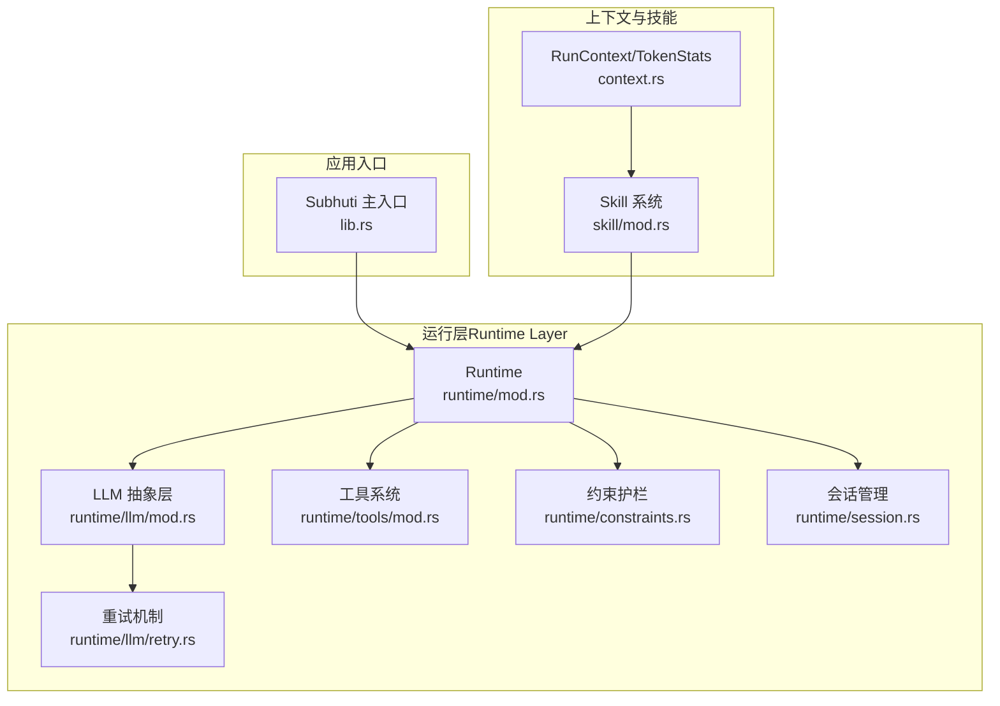
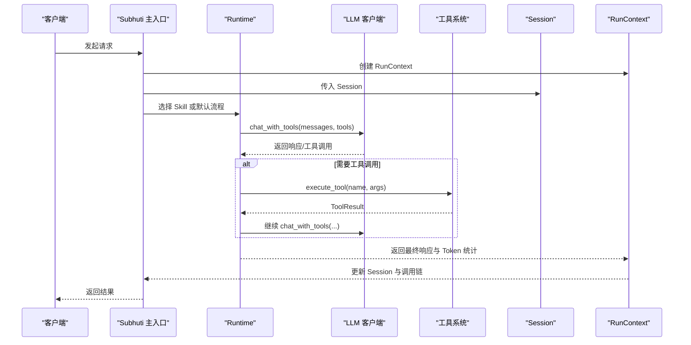
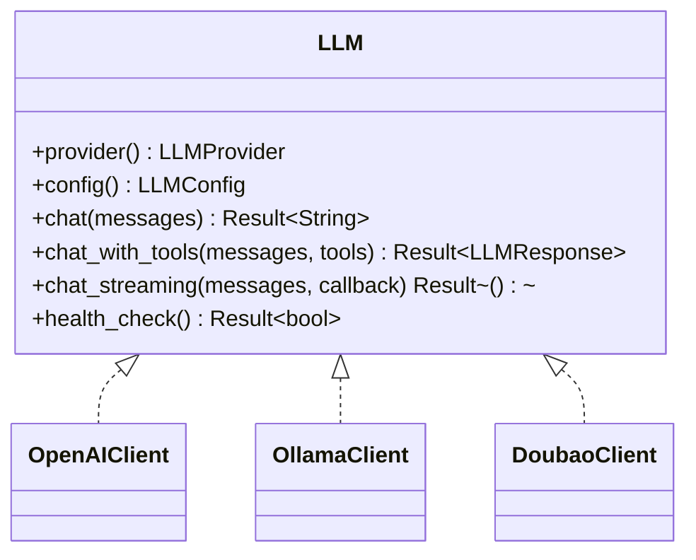
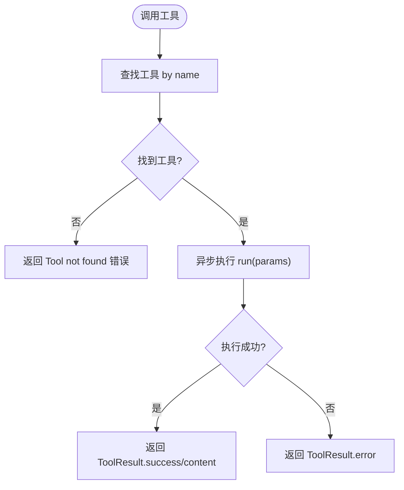
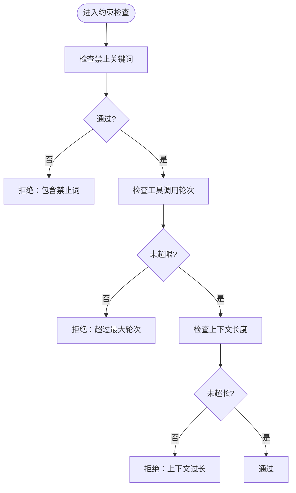
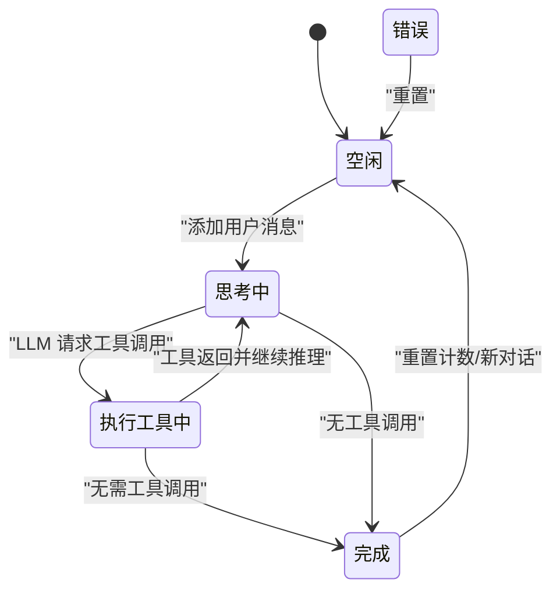
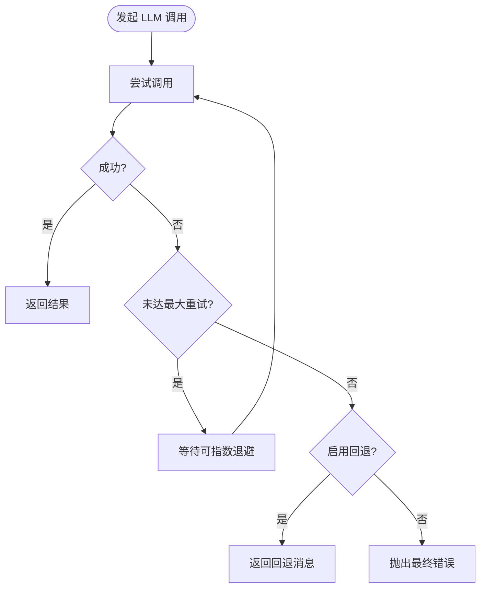
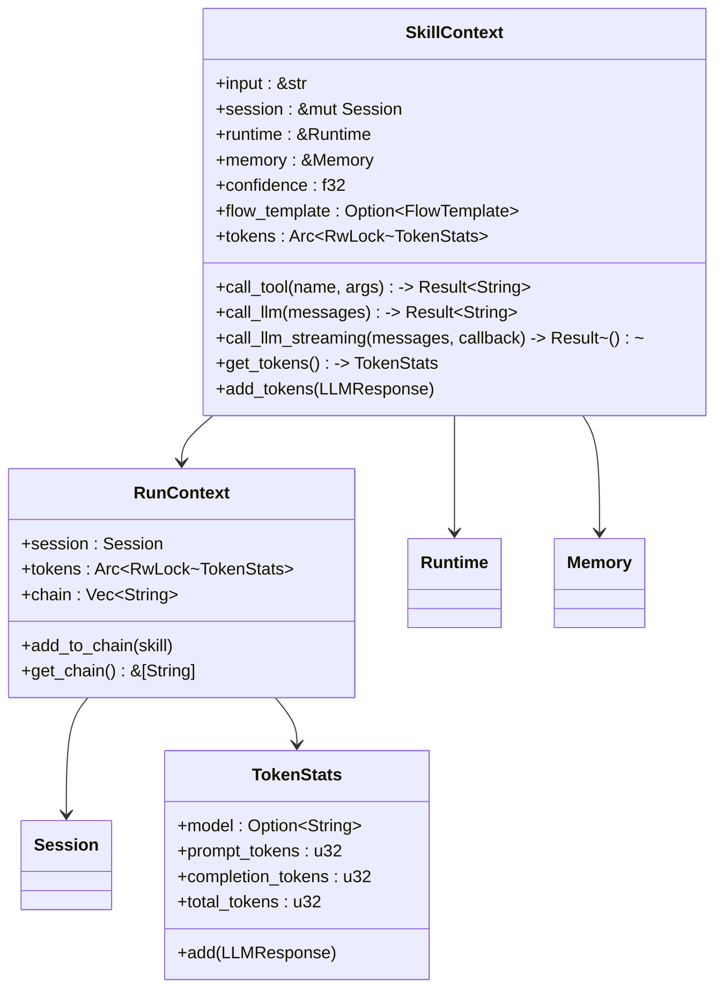
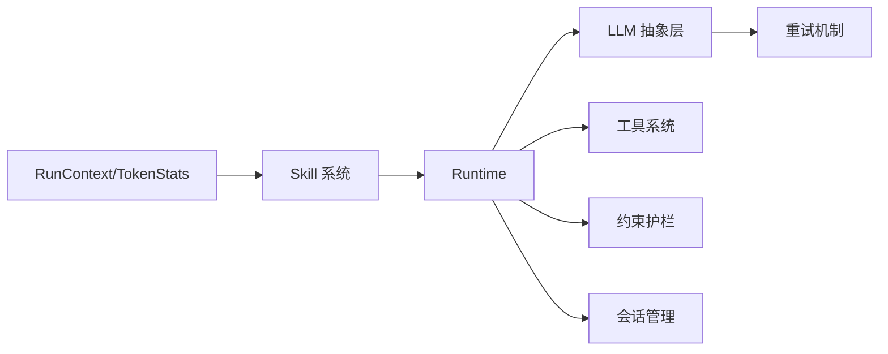

# 运行时系统

<cite>
**本文引用的文件**
- [lib.rs](file://crates/subhuti/src/lib.rs)
- [runtime/mod.rs](file://crates/subhuti/src/runtime/mod.rs)
- [runtime/llm/mod.rs](file://crates/subhuti/src/runtime/llm/mod.rs)
- [runtime/llm/client.rs](file://crates/subhuti/src/runtime/llm/client.rs)
- [runtime/llm/retry.rs](file://crates/subhuti/src/runtime/llm/retry.rs)
- [runtime/tools/mod.rs](file://crates/subhuti/src/runtime/tools/mod.rs)
- [runtime/constraints.rs](file://crates/subhuti/src/runtime/constraints.rs)
- [runtime/session.rs](file://crates/subhuti/src/runtime/session.rs)
- [context.rs](file://crates/subhuti/src/context.rs)
- [skill/mod.rs](file://crates/subhuti/src/skill/mod.rs)
- [Cargo.toml](file://Cargo.toml)
- [API_TUTORIAL.md](file://docs/API_TUTORIAL.md)
- [integration_test.rs](file://crates/subhuti/tests/integration_test.rs)
- [performance_test.rs](file://crates/subhuti/tests/performance_test.rs)
- [persona.json](file://crates/subhuti/data/persona.json)
</cite>

## 目录
1. [简介](#简介)
2. [项目结构](#项目结构)
3. [核心组件](#核心组件)
4. [架构总览](#架构总览)
5. [详细组件分析](#详细组件分析)
6. [依赖关系分析](#依赖关系分析)
7. [性能考量](#性能考量)
8. [故障排查指南](#故障排查指南)
9. [结论](#结论)
10. [附录](#附录)

## 简介
本文件面向 Subhuti 运行时系统，聚焦“运行层”（Runtime Layer）的 LLM 抽象层、工具系统（Tools）、约束护栏（Constraints）、会话管理（Session）以及重试与超时机制。文档以代码为依据，结合架构图与流程图，帮助读者理解系统设计、数据流与控制流，并提供配置示例、性能调优建议与安全最佳实践。

## 项目结构
Subhuti 采用四层架构：记忆层（Memory）、运行层（Runtime）、流程层（Flow）、扩展层（Extension）。运行层负责统一 LLM 接口、工具注册与执行、约束校验、会话状态管理；并通过上下文（RunContext）实现请求级状态隔离。

图表来源
- [lib.rs:84-156](file://crates/subhuti/src/lib.rs#L84-L156)
- [runtime/mod.rs:57-248](file://crates/subhuti/src/runtime/mod.rs#L57-L248)
- [runtime/llm/mod.rs:124-148](file://crates/subhuti/src/runtime/llm/mod.rs#L124-L148)
- [runtime/tools/mod.rs:53-61](file://crates/subhuti/src/runtime/tools/mod.rs#L53-L61)
- [runtime/constraints.rs:38-151](file://crates/subhuti/src/runtime/constraints.rs#L38-L151)
- [runtime/session.rs:67-308](file://crates/subhuti/src/runtime/session.rs#L67-L308)
- [runtime/llm/retry.rs:25-85](file://crates/subhuti/src/runtime/llm/retry.rs#L25-L85)
- [context.rs:51-86](file://crates/subhuti/src/context.rs#L51-L86)
- [skill/mod.rs:255-405](file://crates/subhuti/src/skill/mod.rs#L255-L405)

章节来源
- [lib.rs:22-46](file://crates/subhuti/src/lib.rs#L22-L46)
- [runtime/mod.rs:12-25](file://crates/subhuti/src/runtime/mod.rs#L12-L25)
- [Cargo.toml:1-58](file://Cargo.toml#L1-L58)

## 核心组件
- 运行时（Runtime）：统一承载 LLM 客户端、工具注册与执行、调用统计与上下文传递。
- LLM 抽象层：统一消息结构、角色枚举、响应结构、工具调用协议与客户端适配（OpenAI/Ollama/Doubao）。
- 工具系统：极简 Tool Trait，统一工具注册、参数 Schema、执行与结果封装。
- 约束护栏：最大工具调用轮次、上下文长度、超时、关键词过滤等强制校验。
- 会话管理（Session）：滑动窗口消息队列、系统提示词、状态机、工具调用计数与元数据。
- 重试机制：自动重试、指数退避、回退降级与流式重试。
- 上下文（RunContext）：请求级状态容器，包含 Session、Token 统计与调用链。

章节来源
- [runtime/mod.rs:57-248](file://crates/subhuti/src/runtime/mod.rs#L57-L248)
- [runtime/llm/mod.rs:124-224](file://crates/subhuti/src/runtime/llm/mod.rs#L124-L224)
- [runtime/tools/mod.rs:53-61](file://crates/subhuti/src/runtime/tools/mod.rs#L53-L61)
- [runtime/constraints.rs:38-151](file://crates/subhuti/src/runtime/constraints.rs#L38-L151)
- [runtime/session.rs:67-308](file://crates/subhuti/src/runtime/session.rs#L67-L308)
- [runtime/llm/retry.rs:137-202](file://crates/subhuti/src/runtime/llm/retry.rs#L137-L202)
- [context.rs:51-86](file://crates/subhuti/src/context.rs#L51-L86)

## 架构总览
运行层通过 Runtime 统一调度 LLM 与工具，Session 作为唯一状态载体贯穿请求生命周期；Skill 系统在运行前进行意图识别与路由，若无匹配则回落至默认流程。约束护栏在关键节点进行安全与稳定性校验。

图表来源
- [lib.rs:644-731](file://crates/subhuti/src/lib.rs#L644-L731)
- [runtime/mod.rs:135-212](file://crates/subhuti/src/runtime/mod.rs#L135-L212)
- [runtime/llm/mod.rs:133-147](file://crates/subhuti/src/runtime/llm/mod.rs#L133-L147)
- [runtime/tools/mod.rs:229-242](file://crates/subhuti/src/runtime/tools/mod.rs#L229-L242)

## 详细组件分析

### LLM 抽象层与客户端
- 统一消息结构与角色枚举，支持系统/用户/助手/工具消息。
- LLM Trait 提供非流式、流式与工具调用接口，客户端适配 OpenAI、Ollama、Doubao。
- 工具调用协议：LLMResponse 包含 content 与可选 tool_call，便于后续工具执行。
- 客户端实现：OpenAIClient/OllamaClient/DoubaoClient 分别映射各自 API 的请求/响应结构。

图表来源
- [runtime/llm/mod.rs:124-148](file://crates/subhuti/src/runtime/llm/mod.rs#L124-L148)
- [runtime/llm/client.rs:99-233](file://crates/subhuti/src/runtime/llm/client.rs#L99-L233)
- [runtime/llm/client.rs:309-427](file://crates/subhuti/src/runtime/llm/client.rs#L309-L427)
- [runtime/llm/client.rs:568-784](file://crates/subhuti/src/runtime/llm/client.rs#L568-L784)

章节来源
- [runtime/llm/mod.rs:19-81](file://crates/subhuti/src/runtime/llm/mod.rs#L19-L81)
- [runtime/llm/mod.rs:124-224](file://crates/subhuti/src/runtime/llm/mod.rs#L124-L224)
- [runtime/llm/client.rs:12-84](file://crates/subhuti/src/runtime/llm/client.rs#L12-L84)
- [runtime/llm/client.rs:235-427](file://crates/subhuti/src/runtime/llm/client.rs#L235-L427)
- [runtime/llm/client.rs:429-784](file://crates/subhuti/src/runtime/llm/client.rs#L429-L784)

### 工具系统（Tools）
- Tool Trait：info() 返回工具元信息（名称、描述、参数 Schema），run(params) 异步执行并返回 ToolResult。
- 内置工具：短期/长期/知识库搜索工具，统一注册到 Runtime。
- 执行流程：Runtime.get_tools() 汇总工具信息，Runtime.execute_tool(name, params) 定位并执行工具。

图表来源
- [runtime/tools/mod.rs:53-61](file://crates/subhuti/src/runtime/tools/mod.rs#L53-L61)
- [runtime/tools/mod.rs:229-242](file://crates/subhuti/src/runtime/tools/mod.rs#L229-L242)
- [runtime/tools/mod.rs:68-112](file://crates/subhuti/src/runtime/tools/mod.rs#L68-L112)
- [runtime/tools/mod.rs:114-158](file://crates/subhuti/src/runtime/tools/mod.rs#L114-L158)
- [runtime/tools/mod.rs:160-204](file://crates/subhuti/src/runtime/tools/mod.rs#L160-L204)

章节来源
- [runtime/tools/mod.rs:11-51](file://crates/subhuti/src/runtime/tools/mod.rs#L11-L51)
- [runtime/tools/mod.rs:207-213](file://crates/subhuti/src/runtime/tools/mod.rs#L207-L213)

### 约束护栏（Constraints）
- 校验维度：最大工具调用轮次、上下文长度、允许/禁止工具、禁止关键词。
- 校验顺序：先内容关键词过滤，再轮次与长度检查；任一失败即阻断。
- 使用场景：在工具调用前与 LLM 调用前进行前置校验，保证系统稳定与安全。

图表来源
- [runtime/constraints.rs:95-151](file://crates/subhuti/src/runtime/constraints.rs#L95-L151)

章节来源
- [runtime/constraints.rs:38-151](file://crates/subhuti/src/runtime/constraints.rs#L38-L151)

### 会话管理（Session）
- 滑动窗口：短期消息限制容量，超出自动归档为 ArchivedMessagePair。
- 状态机：Idle/Thinking/Acting/Completed/Error，用于跟踪执行阶段。
- 上下文构造：to_context() 合并系统提示词与消息历史，供 LLM 调用。
- 工具调用计数：increment_tool_calls()/reset_tool_calls() 控制约束护栏。

图表来源
- [runtime/session.rs:52-65](file://crates/subhuti/src/runtime/session.rs#L52-L65)
- [runtime/session.rs:157-198](file://crates/subhuti/src/runtime/session.rs#L157-L198)
- [runtime/session.rs:275-292](file://crates/subhuti/src/runtime/session.rs#L275-L292)

章节来源
- [runtime/session.rs:67-308](file://crates/subhuti/src/runtime/session.rs#L67-L308)

### 重试机制与超时处理
- RetryConfig：最大重试次数、初始延迟、指数退避开关、是否启用回退、回退消息。
- chat_with_retry：对非流式调用进行自动重试与回退降级。
- chat_stream_with_retry：对流式调用进行重试并在失败时输出回退消息。
- 超时控制：客户端层（如 DoubaoClient）通过 HTTP 客户端配置超时，配合重试形成弹性。

图表来源
- [runtime/llm/retry.rs:137-202](file://crates/subhuti/src/runtime/llm/retry.rs#L137-L202)
- [runtime/llm/retry.rs:221-283](file://crates/subhuti/src/runtime/llm/retry.rs#L221-L283)
- [runtime/llm/client.rs:575-598](file://crates/subhuti/src/runtime/llm/client.rs#L575-L598)

章节来源
- [runtime/llm/retry.rs:25-85](file://crates/subhuti/src/runtime/llm/retry.rs#L25-L85)
- [runtime/llm/retry.rs:137-202](file://crates/subhuti/src/runtime/llm/retry.rs#L137-L202)
- [runtime/llm/retry.rs:221-283](file://crates/subhuti/src/runtime/llm/retry.rs#L221-L283)
- [runtime/llm/client.rs:575-598](file://crates/subhuti/src/runtime/llm/client.rs#L575-L598)

### 上下文与 Token 统计
- RunContext：包含 Session、Token 统计（Arc 共享）与调用链，贯穿一次请求生命周期。
- TokenStats：聚合 prompt/completion/total tokens，支持增量累加。
- SkillContext：从 RunContext 派生，提供 call_tool/call_llm/call_llm_streaming 等便捷方法。

图表来源
- [context.rs:51-86](file://crates/subhuti/src/context.rs#L51-L86)
- [skill/mod.rs:115-235](file://crates/subhuti/src/skill/mod.rs#L115-L235)

章节来源
- [context.rs:18-49](file://crates/subhuti/src/context.rs#L18-L49)
- [skill/mod.rs:115-235](file://crates/subhuti/src/skill/mod.rs#L115-L235)

## 依赖关系分析
- 运行层依赖：LLM 抽象层（消息/响应/工具调用）、工具系统（注册/执行）、约束护栏（校验）、会话管理（状态）、重试机制（弹性）。
- 上下文依赖：RunContext 与 TokenStats 为请求级共享，SkillContext 从 RunContext 派生。
- 外部依赖：HTTP 客户端（reqwest）、异步运行时（tokio）、序列化（serde）、追踪（tracing）。

图表来源
- [runtime/mod.rs:57-248](file://crates/subhuti/src/runtime/mod.rs#L57-L248)
- [context.rs:51-86](file://crates/subhuti/src/context.rs#L51-L86)
- [skill/mod.rs:255-405](file://crates/subhuti/src/skill/mod.rs#L255-L405)

章节来源
- [Cargo.toml:25-58](file://Cargo.toml#L25-L58)

## 性能考量
- 初始化与健康检查：框架初始化与健康检查开销极小，适合高频调用。
- 心灵宫殿（记忆）：大规模存储/搜索/遗忘周期均具备毫秒级平均耗时，满足实时交互需求。
- Skill 匹配：关键词索引优化，匹配性能稳定。
- 记忆分区推断与生命周期：微秒级平均耗时，保证高吞吐场景下的低延迟。

章节来源
- [performance_test.rs:36-170](file://crates/subhuti/src/tests/performance_test.rs#L36-L170)
- [performance_test.rs:171-254](file://crates/subhuti/src/tests/performance_test.rs#L171-L254)
- [integration_test.rs:196-382](file://crates/subhuti/src/tests/integration_test.rs#L196-L382)

## 故障排查指南
- 健康检查：通过 Subhuti.health_check() 获取整体健康状态与各组件详情，定位问题根因。
- Trace 追踪：结合 API 的 trace_id 查询完整调用链，定位耗时环节。
- 重试与回退：确认 RetryConfig 配置（最大重试、指数退避、回退开关），必要时调整保守/激进策略。
- 约束护栏：若频繁被拒绝，检查最大轮次、上下文长度与禁止关键词配置。
- 会话状态：关注 Session 状态机流转，确保在工具调用前后正确更新状态与计数。

章节来源
- [lib.rs:562-636](file://crates/subhuti/src/lib.rs#L562-L636)
- [API_TUTORIAL.md:711-766](file://docs/API_TUTORIAL.md#L711-L766)
- [runtime/llm/retry.rs:25-85](file://crates/subhuti/src/runtime/llm/retry.rs#L25-L85)
- [runtime/constraints.rs:95-151](file://crates/subhuti/src/runtime/constraints.rs#L95-L151)
- [runtime/session.rs:240-263](file://crates/subhuti/src/runtime/session.rs#L240-L263)

## 结论
Subhuti 运行时系统以“运行层”为核心，通过统一的 LLM 抽象、简洁的工具接口、严格的约束护栏与可扩展的会话管理，实现了可控、可观测、可扩展的 AI Agent 运行环境。结合重试与超时机制，系统在面对网络波动与外部服务不稳定时具备良好的韧性；通过上下文与 Token 统计，开发者能够精准掌握资源消耗与调用链路。

## 附录

### 配置示例
- LLM 配置（模型、API 地址、密钥、温度、最大 token）
- 运行时配置（最大工具轮次、上下文长度、超时、默认温度/最大 token）
- 会话配置（会话 ID、用户 ID、系统提示词、短期容量、自动归档）

章节来源
- [runtime/llm/mod.rs:83-108](file://crates/subhuti/src/runtime/llm/mod.rs#L83-L108)
- [runtime/mod.rs:30-55](file://crates/subhuti/src/runtime/mod.rs#L30-L55)
- [runtime/session.rs:16-41](file://crates/subhuti/src/runtime/session.rs#L16-L41)

### API 使用示例（HTTP）
- 聊天接口：支持普通与流式输出，返回 trace_id 与匹配技能。
- 心灵宫殿 API：统计、搜索、执行遗忘周期、查看人格分区偏好。
- 专家插件 API：列出、激活、停用、查看当前专家。
- 记忆管理 API：手动添加记忆、底层搜索、统计。
- 系统 API：健康检查、详细健康检查、Trace 追踪。

章节来源
- [API_TUTORIAL.md:18-83](file://docs/API_TUTORIAL.md#L18-L83)
- [API_TUTORIAL.md:165-340](file://docs/API_TUTORIAL.md#L165-L340)
- [API_TUTORIAL.md:342-491](file://docs/API_TUTORIAL.md#L342-L491)
- [API_TUTORIAL.md:493-604](file://docs/API_TUTORIAL.md#L493-L604)
- [API_TUTORIAL.md:606-766](file://docs/API_TUTORIAL.md#L606-L766)

### 安全最佳实践
- 禁止关键词过滤：在 Constraints 中配置敏感词，阻断潜在风险内容。
- 工具白名单：限制可用工具集合，避免未授权能力暴露。
- 上下文长度限制：防止过长上下文导致成本与延迟飙升。
- 超时与重试：合理设置超时与重试策略，避免级联故障。
- 会话隔离：Session 作为唯一状态载体，避免全局共享状态引发竞态。

章节来源
- [runtime/constraints.rs:83-151](file://crates/subhuti/src/runtime/constraints.rs#L83-L151)
- [runtime/session.rs:275-292](file://crates/subhuti/src/runtime/session.rs#L275-L292)
- [runtime/llm/retry.rs:25-85](file://crates/subhuti/src/runtime/llm/retry.rs#L25-L85)

### 人格与记忆数据样例
- 人格配置文件 persona.json：包含版本、描述、五大人格维度、擅长领域、交互统计等。

章节来源
- [persona.json:1-44](file://crates/subhuti/data/persona.json#L1-L44)