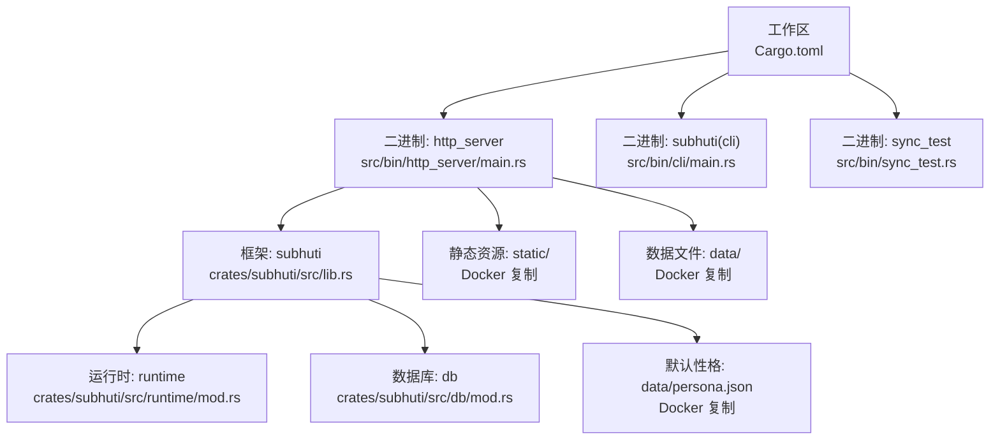
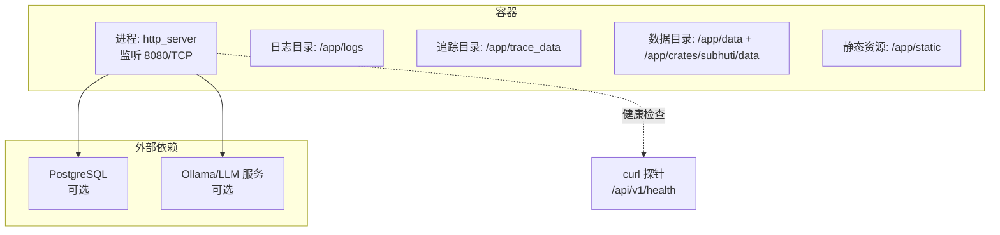
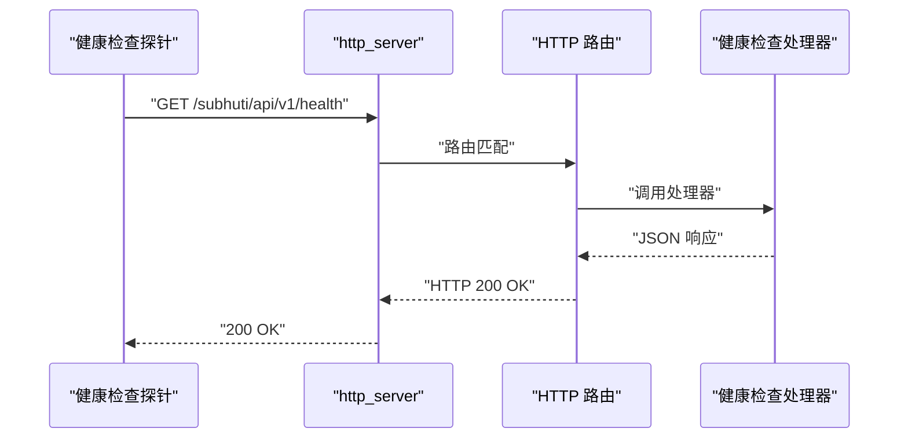
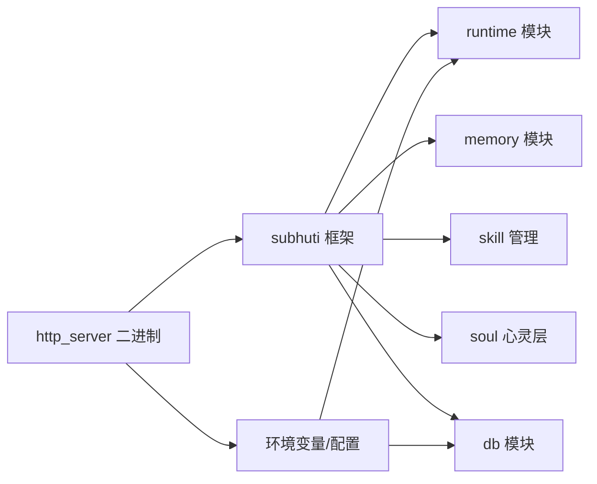

# 容器化部署

<cite>
**本文引用的文件**
- [Dockerfile](file://Dockerfile)
- [Cargo.toml](file://Cargo.toml)
- [crates/subhuti/Cargo.toml](file://crates/subhuti/Cargo.toml)
- [src/bin/http_server/main.rs](file://src/bin/http_server/main.rs)
- [crates/subhuti/src/lib.rs](file://crates/subhuti/src/lib.rs)
- [crates/subhuti/src/runtime/mod.rs](file://crates/subhuti/src/runtime/mod.rs)
- [crates/subhuti/src/db/mod.rs](file://crates/subhuti/src/db/mod.rs)
- [data/persona.json](file://data/persona.json)
- [docs/DEBUG_TOOLS.md](file://docs/DEBUG_TOOLS.md)
</cite>

## 目录
1. [简介](#简介)
2. [项目结构](#项目结构)
3. [核心组件](#核心组件)
4. [架构总览](#架构总览)
5. [详细组件分析](#详细组件分析)
6. [依赖关系分析](#依赖关系分析)
7. [性能考虑](#性能考虑)
8. [故障排除指南](#故障排除指南)
9. [结论](#结论)
10. [附录](#附录)

## 简介
本文件面向 Subhuti 框架的容器化部署，涵盖 Docker 镜像多阶段构建、运行时配置、Kubernetes 清单示例、Helm Chart 管理、健康检查与资源限制、自动扩缩容策略以及最佳实践与故障排除。目标是帮助运维与开发团队以安全、可控、可观测的方式在容器环境中稳定运行 Subhuti HTTP 服务。

## 项目结构
Subhuti 采用多 crate 工作区组织，核心应用通过 http_server 二进制对外提供 REST API 与 SSE 流式输出；框架主体位于 crates/subhuti，包含运行时、记忆、技能、心灵层等模块；项目根 Cargo.toml 声明了二进制入口与依赖。

**图示来源**
- [Cargo.toml:13-23](file://Cargo.toml#L13-L23)
- [src/bin/http_server/main.rs:1324-1383](file://src/bin/http_server/main.rs#L1324-L1383)
- [crates/subhuti/src/lib.rs:1-60](file://crates/subhuti/src/lib.rs#L1-L60)
- [crates/subhuti/src/runtime/mod.rs:1-40](file://crates/subhuti/src/runtime/mod.rs#L1-L40)
- [crates/subhuti/src/db/mod.rs:1-40](file://crates/subhuti/src/db/mod.rs#L1-L40)
- [data/persona.json:1-40](file://data/persona.json#L1-L40)

**章节来源**
- [Cargo.toml:1-58](file://Cargo.toml#L1-L58)
- [src/bin/http_server/main.rs:1-120](file://src/bin/http_server/main.rs#L1-L120)

## 核心组件
- HTTP 服务与路由：统一入口 /api/v1/chat、技能路由 /api/v1/skills、健康检查 /api/v1/health、SSE 流式输出。
- 框架核心：SubhutiConfig、Runtime、Memory、Skill 管理、SoulLayer（心灵层）、Trace 观测。
- 运行时配置：LLM 提供商与模型、工具注册、约束护栏（最大轮次、超时、上下文长度）。
- 数据库：可选 PostgreSQL（sqlx），支持初始化与持久化记忆；未配置时使用内存模式。
- 健康检查：HTTP 接口与容器健康检查探针。

**章节来源**
- [src/bin/http_server/main.rs:11-16](file://src/bin/http_server/main.rs#L11-L16)
- [crates/subhuti/src/lib.rs:54-82](file://crates/subhuti/src/lib.rs#L54-L82)
- [crates/subhuti/src/runtime/mod.rs:30-55](file://crates/subhuti/src/runtime/mod.rs#L30-L55)
- [crates/subhuti/src/db/mod.rs:13-38](file://crates/subhuti/src/db/mod.rs#L13-L38)
- [docs/DEBUG_TOOLS.md:102-105](file://docs/DEBUG_TOOLS.md#L102-L105)

## 架构总览
下图展示了容器内运行的服务、依赖与健康检查路径。

**图示来源**
- [Dockerfile:41-79](file://Dockerfile#L41-L79)
- [src/bin/http_server/main.rs:1324-1383](file://src/bin/http_server/main.rs#L1324-L1383)
- [crates/subhuti/src/db/mod.rs:13-38](file://crates/subhuti/src/db/mod.rs#L13-L38)

## 详细组件分析

### Docker 镜像构建（多阶段、优化与安全基线）
- 多阶段构建
  - 构建阶段：基于 rust:1.79-bookworm，安装 OpenSSL 开发库，先复制依赖清单与占位源码以利用层缓存，预编译依赖，再复制真实源码并执行 release 构建。
  - 运行阶段：基于 debian:bookworm-slim，仅安装运行时所需依赖（libssl3、ca-certificates、curl），复制二进制与静态资源、数据文件，创建日志与追踪目录。
- 镜像大小控制
  - 仅复制最终二进制与必要资源，避免携带构建工具链与源码。
  - 使用 slim 基镜像减少体积。
- 安全基线
  - 运行阶段仅安装最小依赖，禁用不必要的包管理器缓存。
  - 使用非 root 用户运行（建议在容器编排中添加 runAsUser、fsGroup、readOnlyRootFilesystem 等）。
  - 健康检查使用 curl，确保服务可用性。
- 环境变量与暴露端口
  - 默认 DB_*、HTTP_ADDR、RUST_LOG 等环境变量在运行阶段设定。
  - 暴露 8080 端口。

**章节来源**
- [Dockerfile:1-80](file://Dockerfile#L1-L80)

### 容器运行时配置（环境变量、端口、卷、网络）
- 环境变量（运行时）
  - HTTP_ADDR：服务绑定地址与端口，默认 0.0.0.0:8080。
  - DB_HOST/DB_PORT/DB_DATABASE/DB_USERNAME/DB_PASSWORD/DB_MAX_CONN：PostgreSQL 连接参数。
  - LLM_MODEL/LLM_API_URL/DOUBAO_API_KEY/OLLAMA_BASE_URL：LLM 提供商与密钥（按需配置）。
  - RUST_LOG：日志级别。
- 端口映射
  - 8080/TCP 对外暴露。
- 卷挂载
  - /app/logs：持久化日志。
  - /app/trace_data：追踪数据（可选）。
  - /app/data 与 /app/crates/subhuti/data：持久化 persona.json 与相关数据（可选）。
- 网络
  - 默认桥接网络，容器通过主机端口访问；若启用数据库或 LLM 服务，建议使用自定义网络或外部服务发现。

**章节来源**
- [Dockerfile:64-74](file://Dockerfile#L64-L74)
- [src/bin/http_server/main.rs:1332-1383](file://src/bin/http_server/main.rs#L1332-L1383)
- [crates/subhuti/src/db/mod.rs:13-38](file://crates/subhuti/src/db/mod.rs#L13-L38)

### 健康检查与可观测性
- HTTP 健康检查端点
  - GET /subhuti/api/v1/health 返回服务基本状态。
  - GET /subhuti/api/v1/health/detailed 返回详细组件状态（框架健康报告）。
- 容器健康检查探针
  - 使用 curl 命令探测 /api/v1/health，配置间隔、超时与重试。
- 日志与追踪
  - 日志写入 /app/logs；追踪数据可写入 /app/trace_data（按需启用）。

**图示来源**
- [src/bin/http_server/main.rs:975-980](file://src/bin/http_server/main.rs#L975-L980)
- [docs/DEBUG_TOOLS.md:102-105](file://docs/DEBUG_TOOLS.md#L102-L105)

**章节来源**
- [src/bin/http_server/main.rs:975-980](file://src/bin/http_server/main.rs#L975-L980)
- [docs/DEBUG_TOOLS.md:77-105](file://docs/DEBUG_TOOLS.md#L77-L105)

### Kubernetes 部署清单（示例思路）
以下为典型清单字段说明（不含具体 YAML 内容）。生产部署建议使用 ConfigMap/Secret 管理配置与密钥，Deployment 使用副本数与滚动更新策略，Service 暴露 8080 端口，配合 Ingress/NLB。

- Deployment
  - 镜像：subhuti:tag
  - 环境变量：通过 ConfigMap/Secret 注入 DB_*、LLM_*、RUST_LOG
  - 资源请求/限制：CPU/内存
  - 健康检查：liveness/readiness/probe 指向 /api/v1/health
  - 卷：logs、trace_data、data（按需）
- Service
  - ClusterIP/NodePort/NLB，端口 8080
- ConfigMap
  - 非敏感配置（如 HTTP_ADDR、RUST_LOG）
- Secret
  - 数据库密码、LLM API Key、Ollama 地址等
- HPA（可选）
  - CPU 或自定义指标触发扩缩容

[本节为概念性说明，不直接分析具体文件，故无“章节来源”]

### Helm Chart 配置与管理
- 值文件定制
  - image.repository、image.tag、image.pullPolicy
  - replicaCount、strategy（滚动更新）
  - service.type/port
  - resources.requests/limits
  - autoscaling.enabled/minReplicas/maxReplicas/targetCPUUtilizationPercentage
  - env（DB_*、LLM_*、RUST_LOG）
  - persistence.enabled/logs、trace_data、data 的大小与存储类
- 版本管理
  - chart.yaml 中 version/appVersion
  - values.yaml 中注释说明每个键的作用与默认值
- 滚动更新策略
  - RollingUpdate（maxUnavailable、maxSurge）与 PodDisruptionBudget
- 健康检查与探针
  - livenessProbe/readinessProbe 指向 /api/v1/health

[本节为概念性说明，不直接分析具体文件，故无“章节来源”]

### 资源限制与自动扩缩容
- 资源限制
  - CPU：根据并发与推理负载设置 requests/limits
  - 内存：结合 LLM 推理与 Tokio 任务栈估算
  - 存储：logs、trace_data、data 卷容量
- HPA
  - 基于 CPU 使用率或自定义指标（QPS、P95 延迟、队列长度）
- Pod 级别优化
  - 并发模型：合理设置 LLM 超时、工具调用轮次与上下文长度
  - 连接池：DB_MAX_CONN 与 LLM 并发上限协调

[本节为通用指导，不直接分析具体文件，故无“章节来源”]

## 依赖关系分析
- 二进制与框架
  - http_server 二进制依赖 subhuti 框架，后者提供运行时、记忆、技能、心灵层与数据库接口。
- 运行时依赖
  - LLM 提供商：OpenAI/Ollama/Doubao/Custom（按 Provider 注入）
  - 数据库：PostgreSQL（可选），sqlx 连接与迁移
  - 日志：tracing-subscriber（支持 JSON、环境过滤）
- Docker 复制
  - 静态资源、数据文件与 persona.json 在运行阶段被复制到镜像中，便于首次启动与持久化。

**图示来源**
- [Cargo.toml:25-58](file://Cargo.toml#L25-L58)
- [crates/subhuti/Cargo.toml:14-54](file://crates/subhuti/Cargo.toml#L14-L54)
- [src/bin/http_server/main.rs:1336-1351](file://src/bin/http_server/main.rs#L1336-L1351)

**章节来源**
- [Cargo.toml:25-58](file://Cargo.toml#L25-L58)
- [crates/subhuti/Cargo.toml:14-54](file://crates/subhuti/Cargo.toml#L14-L54)

## 性能考虑
- 构建优化
  - 多阶段构建与依赖缓存显著缩短重复构建时间。
- 运行时优化
  - 控制 LLM 超时与工具调用轮次，避免长时间阻塞。
  - 合理设置 DB 连接池大小，避免过度并发导致数据库压力。
  - SSE 流式输出对前端友好，注意背压与客户端断开处理。
- 资源规划
  - 根据推理规模与并发量设置 CPU/内存；对高延迟 LLM 建议增加超时与重试策略。

[本节为通用指导，不直接分析具体文件，故无“章节来源”]

## 故障排除指南
- 健康检查失败
  - 使用 /api/v1/health 与 /api/v1/health/detailed 确认服务状态。
  - 检查容器健康检查探针是否可达（端口、路径）。
- 数据库连接问题
  - 确认 DB_HOST/DB_PORT/DB_DATABASE/DB_USERNAME/DB_PASSWORD 是否正确。
  - 若未配置数据库，服务将以内存模式运行，部分持久化能力受限。
- LLM 配置问题
  - 确认 LLM_PROVIDER、LLM_MODEL、API Key 或 Ollama 地址是否正确。
- 日志定位
  - 查看 /app/logs 下的日志文件，结合 RUST_LOG 调整详细程度。
- 性能问题
  - 检查并发与超时设置，评估工具调用频率与上下文长度。

**章节来源**
- [docs/DEBUG_TOOLS.md:77-105](file://docs/DEBUG_TOOLS.md#L77-L105)
- [src/bin/http_server/main.rs:1332-1383](file://src/bin/http_server/main.rs#L1332-L1383)
- [crates/subhuti/src/db/mod.rs:13-38](file://crates/subhuti/src/db/mod.rs#L13-L38)

## 结论
通过多阶段 Docker 构建与最小化运行时镜像，结合完善的健康检查与可观测性，Subhuti 可在容器环境中实现高效、安全与稳定的运行。建议在生产中配套使用 ConfigMap/Secret、HPA、资源限制与滚动更新策略，并持续监控日志与追踪数据以保障服务质量。

## 附录

### 关键环境变量一览
- HTTP_ADDR：服务监听地址与端口
- DB_HOST/DB_PORT/DB_DATABASE/DB_USERNAME/DB_PASSWORD/DB_MAX_CONN：数据库连接
- LLM_MODEL/LLM_API_URL/DOUBAO_API_KEY/OLLAMA_BASE_URL：LLM 提供商与密钥
- RUST_LOG：日志级别

**章节来源**
- [Dockerfile:64-74](file://Dockerfile#L64-L74)
- [src/bin/http_server/main.rs:1336-1373](file://src/bin/http_server/main.rs#L1336-L1373)