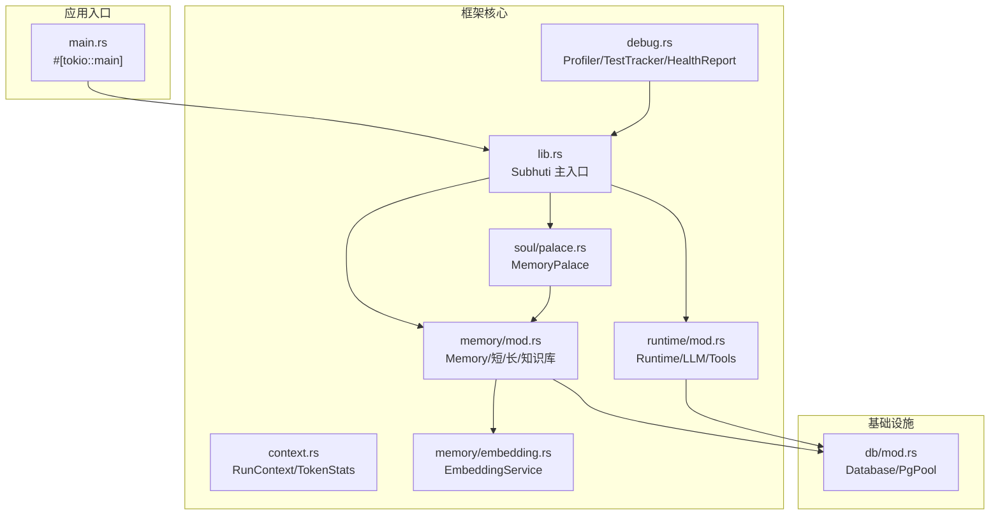
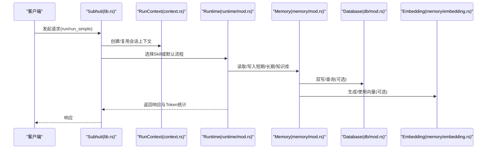
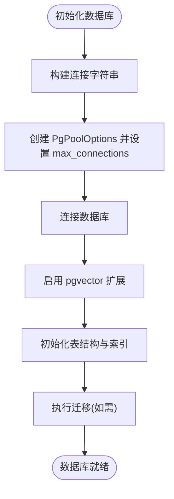
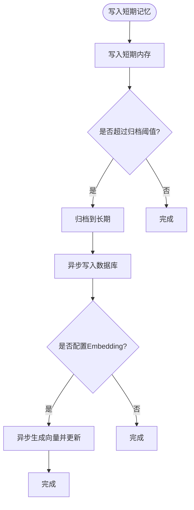
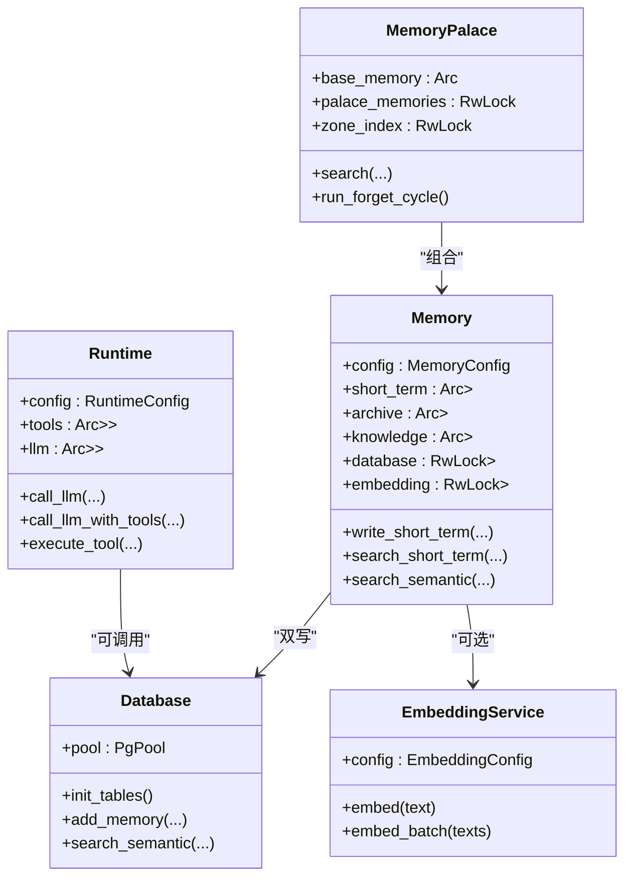
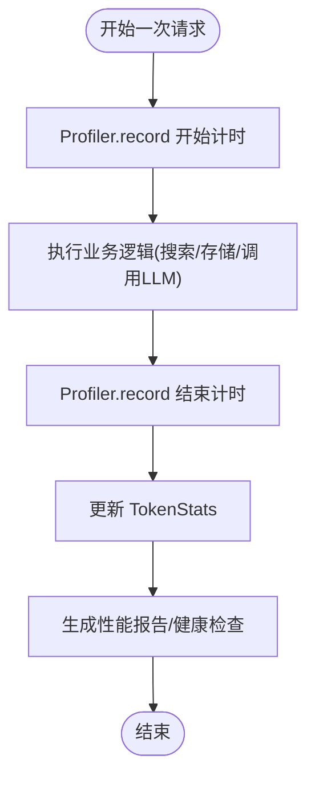
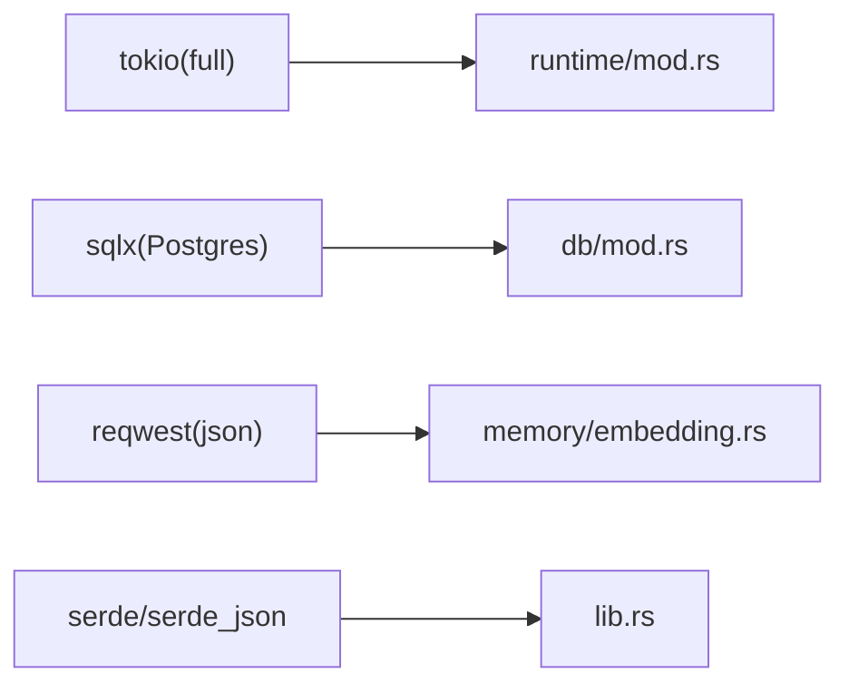

# 性能优化

<cite>
**本文引用的文件**   
- [Cargo.toml](file://crates/subhuti/Cargo.toml)
- [lib.rs](file://crates/subhuti/src/lib.rs)
- [context.rs](file://crates/subhuti/src/context.rs)
- [runtime/mod.rs](file://crates/subhuti/src/runtime/mod.rs)
- [db/mod.rs](file://crates/subhuti/src/db/mod.rs)
- [memory/mod.rs](file://crates/subhuti/src/memory/mod.rs)
- [memory/embedding.rs](file://crates/subhuti/src/memory/embedding.rs)
- [soul/palace.rs](file://crates/subhuti/src/soul/palace.rs)
- [debug.rs](file://crates/subhuti/src/debug.rs)
- [performance_test.rs](file://crates/subhuti/tests/performance_test.rs)
- [main.rs](file://src/main.rs)
</cite>

## 目录
1. [简介](#简介)
2. [项目结构](#项目结构)
3. [核心组件](#核心组件)
4. [架构总览](#架构总览)
5. [详细组件分析](#详细组件分析)
6. [依赖分析](#依赖分析)
7. [性能考量](#性能考量)
8. [故障排查指南](#故障排查指南)
9. [结论](#结论)
10. [附录](#附录)

## 简介
本指南面向 Subhuti 框架的性能优化实践，围绕数据库连接池、内存管理、并发控制、缓存策略、性能监控与测试方法展开。文档结合仓库现有实现，给出可落地的配置建议、优化策略与最佳实践，并提供可视化图示帮助读者快速把握关键路径。

## 项目结构
Subhuti 采用四层架构：记忆层、运行时层、流程层、扩展层；并提供心灵宫殿（Memory Palace）统一记忆与人格系统。核心性能相关模块集中在：
- 数据库与连接池：sqlx PgPool
- 记忆与缓存：短期/长期/知识库、向量嵌入、心智宫殿
- 并发与运行时：Tokio 运行时、RwLock/Arc 共享、异步任务
- 性能监控与测试：内置 Profiler、TestTracker、健康检查

**图表来源**
- [main.rs:64-71](file://src/main.rs#L64-L71)
- [lib.rs:84-107](file://crates/subhuti/src/lib.rs#L84-L107)
- [context.rs:51-86](file://crates/subhuti/src/context.rs#L51-L86)
- [runtime/mod.rs:57-62](file://crates/subhuti/src/runtime/mod.rs#L57-L62)
- [memory/mod.rs:163-173](file://crates/subhuti/src/memory/mod.rs#L163-L173)
- [memory/embedding.rs:29-34](file://crates/subhuti/src/memory/embedding.rs#L29-L34)
- [soul/palace.rs:228-234](file://crates/subhuti/src/soul/palace.rs#L228-L234)
- [db/mod.rs:44-48](file://crates/subhuti/src/db/mod.rs#L44-L48)
- [debug.rs:298-350](file://crates/subhuti/src/debug.rs#L298-L350)

**章节来源**
- [Cargo.toml:14-47](file://crates/subhuti/Cargo.toml#L14-L47)
- [lib.rs:22-33](file://crates/subhuti/src/lib.rs#L22-L33)

## 核心组件
- 数据库与连接池
  - 使用 sqlx PgPoolOptions 配置连接池上限，支持运行时连接字符串拼接与表初始化。
- 记忆与缓存
  - 短期/长期/知识库三层结构；支持向量嵌入与 pgvector；心智宫殿提供分区、联想、遗忘周期。
- 并发与运行时
  - Tokio 运行时（full 特性）；多处使用 Arc + RwLock 共享状态；大量异步任务与 spawn。
- 性能监控与测试
  - 内置 Profiler、TestTracker、HealthReport；性能测试覆盖初始化、搜索、存储、健康检查等关键路径。

**章节来源**
- [db/mod.rs:11-42](file://crates/subhuti/src/db/mod.rs#L11-L42)
- [memory/mod.rs:30-52](file://crates/subhuti/src/memory/mod.rs#L30-L52)
- [soul/palace.rs:248-274](file://crates/subhuti/src/soul/palace.rs#L248-L274)
- [debug.rs:298-350](file://crates/subhuti/src/debug.rs#L298-L350)

## 架构总览
Subhuti 的运行时路径通常为：请求进入 → 构造 RunContext → 选择 Skill 或默认流程 → 调用 Runtime → 访问 Memory/Palace → 可选数据库/Embedding → 返回响应并统计 Token。

**图表来源**
- [lib.rs:667-742](file://crates/subhuti/src/lib.rs#L667-L742)
- [context.rs:51-86](file://crates/subhuti/src/context.rs#L51-L86)
- [runtime/mod.rs:146-174](file://crates/subhuti/src/runtime/mod.rs#L146-L174)
- [memory/mod.rs:260-318](file://crates/subhuti/src/memory/mod.rs#L260-L318)
- [db/mod.rs:418-444](file://crates/subhuti/src/db/mod.rs#L418-L444)
- [memory/embedding.rs:50-82](file://crates/subhuti/src/memory/embedding.rs#L50-L82)

## 详细组件分析

### 数据库连接池配置
- 连接池上限
  - 通过 DbConfig.max_connections 控制；Database::new 使用 PgPoolOptions::max_connections 设置。
- 连接字符串
  - DbConfig.connection_string 拼接主机、端口、数据库、用户名、密码。
- 表初始化与索引
  - init_tables 创建 persona_profiles、memories、user_feedbacks、persona_history 等表，并建立常用索引。
- 迁移与兼容
  - migrate_memories_table 处理 embedding 列维度不一致的情况，必要时重建列。

**图表来源**
- [db/mod.rs:11-42](file://crates/subhuti/src/db/mod.rs#L11-L42)
- [db/mod.rs:50-59](file://crates/subhuti/src/db/mod.rs#L50-L59)
- [db/mod.rs:65-180](file://crates/subhuti/src/db/mod.rs#L65-L180)
- [db/mod.rs:182-244](file://crates/subhuti/src/db/mod.rs#L182-L244)

**章节来源**
- [db/mod.rs:11-42](file://crates/subhuti/src/db/mod.rs#L11-L42)
- [db/mod.rs:50-59](file://crates/subhuti/src/db/mod.rs#L50-L59)
- [db/mod.rs:65-180](file://crates/subhuti/src/db/mod.rs#L65-L180)
- [db/mod.rs:182-244](file://crates/subhuti/src/db/mod.rs#L182-L244)

### 内存管理优化
- 短期/长期/知识库
  - MemoryConfig 控制短期容量、归档阈值、知识维度与 TTL；短期记忆达到阈值自动归档至长期。
- 心智宫殿
  - MemoryPalace 基于 Memory，增加分区、重要性、关联网络、遗忘周期；搜索阶段先读锁扫描，再排序与激活，避免长时间持锁。
- 双写策略
  - 写入短期记忆时，同时异步写入数据库并生成向量，降低主路径阻塞。
- 对象池与重用
  - 建议：对频繁分配的小对象（如 MemoryItem、PalaceSearchResult）引入对象池；对字符串/Vec 使用预分配容量策略。

**图表来源**
- [memory/mod.rs:260-318](file://crates/subhuti/src/memory/mod.rs#L260-L318)
- [memory/mod.rs:319-368](file://crates/subhuti/src/memory/mod.rs#L319-L368)
- [memory/mod.rs:384-407](file://crates/subhuti/src/memory/mod.rs#L384-L407)

**章节来源**
- [memory/mod.rs:30-52](file://crates/subhuti/src/memory/mod.rs#L30-L52)
- [memory/mod.rs:163-173](file://crates/subhuti/src/memory/mod.rs#L163-L173)
- [memory/mod.rs:260-318](file://crates/subhuti/src/memory/mod.rs#L260-L318)
- [memory/mod.rs:319-368](file://crates/subhuti/src/memory/mod.rs#L319-L368)
- [soul/palace.rs:421-566](file://crates/subhuti/src/soul/palace.rs#L421-L566)

### 并发控制策略
- Tokio 运行时
  - 依赖 tokio full 特性，支持多线程、IO、定时器、信号等；可通过环境变量或启动参数调整线程数与调度策略。
- 共享状态
  - Runtime/Memory/MemoryPalace 多处使用 Arc<RwLock<T>>，读多写少场景下读锁可并行，写锁仅在必要时获取。
- 异步任务
  - 写入数据库与生成向量均通过 tokio::task::spawn 异步执行，避免阻塞主线程。
- 锁竞争减少
  - 搜索阶段先在读锁内完成评分与聚合，再释放锁进行排序与激活，缩短持锁时间。

**图表来源**
- [runtime/mod.rs:57-62](file://crates/subhuti/src/runtime/mod.rs#L57-L62)
- [memory/mod.rs:163-173](file://crates/subhuti/src/memory/mod.rs#L163-L173)
- [soul/palace.rs:228-234](file://crates/subhuti/src/soul/palace.rs#L228-L234)
- [db/mod.rs:44-48](file://crates/subhuti/src/db/mod.rs#L44-L48)
- [memory/embedding.rs:29-34](file://crates/subhuti/src/memory/embedding.rs#L29-L34)

**章节来源**
- [runtime/mod.rs:57-62](file://crates/subhuti/src/runtime/mod.rs#L57-L62)
- [memory/mod.rs:163-173](file://crates/subhuti/src/memory/mod.rs#L163-L173)
- [soul/palace.rs:421-566](file://crates/subhuti/src/soul/palace.rs#L421-L566)

### 缓存策略设计
- 短期记忆缓存
  - 基于内存的短期工作记忆，容量受 MemoryConfig 控制；超出阈值自动归档，避免无限增长。
- 向量嵌入缓存
  - EmbeddingService 通过 Ollama API 生成向量；建议在高频查询场景下增加本地缓存（如 LRU），避免重复调用外部服务。
- 响应缓存机制
  - 可在应用层对稳定查询（如固定问答、知识检索）增加缓存；注意缓存失效策略与一致性。
- 心智宫殿缓存
  - 搜索结果与分区权重可缓存；结合 persona_zone_bias 的权重，减少重复计算。

**章节来源**
- [memory/mod.rs:30-52](file://crates/subhuti/src/memory/mod.rs#L30-L52)
- [memory/embedding.rs:50-91](file://crates/subhuti/src/memory/embedding.rs#L50-L91)
- [soul/palace.rs:421-566](file://crates/subhuti/src/soul/palace.rs#L421-L566)

### 性能监控指标
- QPS 与延迟
  - 使用 Profiler 记录关键路径耗时，TestTracker 统计测试通过率；结合 RunContext.TokenStats 统计 Token 使用。
- 资源利用率
  - 健康检查（HealthReport）汇总 MemoryPalace、Database、SoulLayer、Skills 等组件状态；可扩展为系统资源采集。
- 框架内置工具
  - Profiler：记录多次调用的总/均/最小/最大耗时。
  - TestTracker：测试用例计数与失败列表。
  - HealthReport：组件健康状态与细节。

**图表来源**
- [debug.rs:298-350](file://crates/subhuti/src/debug.rs#L298-L350)
- [context.rs:18-49](file://crates/subhuti/src/context.rs#L18-L49)
- [debug.rs:185-296](file://crates/subhuti/src/debug.rs#L185-L296)

**章节来源**
- [debug.rs:298-350](file://crates/subhuti/src/debug.rs#L298-L350)
- [context.rs:18-49](file://crates/subhuti/src/context.rs#L18-L49)
- [debug.rs:185-296](file://crates/subhuti/src/debug.rs#L185-L296)

### 性能测试方法与基准
- 框架内置性能测试
  - 覆盖 Subhuti::new、MemoryPalace 存储/搜索/遗忘周期、健康检查、Skill 列表、分区推断、记忆生命周期等。
- 基准测试建议
  - 使用 Criterion 或自定义循环计时；针对不同负载（QPS、并发协程数、数据规模）分别压测。
- 瓶颈分析技巧
  - 逐步隔离：禁用数据库/Embedding，观察性能变化；定位 CPU/IO/锁竞争热点。
  - 使用火焰图/性能剖析工具（perf/flamegraph）定位热点函数。

**章节来源**
- [performance_test.rs:22-264](file://crates/subhuti/tests/performance_test.rs#L22-L264)

## 依赖分析
- Tokio 运行时
  - 通过 tokio = { version = "1", features = ["full"] } 提供多线程事件循环与异步生态。
- sqlx
  - Postgres 连接池与查询执行；支持 tokio-native-tls、chrono、uuid、json 等特性。
- 异步生态
  - async-trait、futures、reqwest 等配合实现异步接口与 HTTP 调用。

**图表来源**
- [Cargo.toml:16](file://crates/subhuti/Cargo.toml#L16)
- [Cargo.toml:23](file://crates/subhuti/Cargo.toml#L23)
- [Cargo.toml:47](file://crates/subhuti/Cargo.toml#L47)
- [Cargo.toml:19](file://crates/subhuti/Cargo.toml#L19)

**章节来源**
- [Cargo.toml:14-47](file://crates/subhuti/Cargo.toml#L14-L47)

## 性能考量
- 连接池设置
  - 根据并发请求数与数据库承载能力设置 max_connections；避免过高导致上下文切换开销增大。
- 内存与归档
  - 合理设置短期容量与归档阈值，平衡响应延迟与存储成本。
- 异步与锁
  - 保持读锁短时持有，尽量在释放锁后进行排序/激活等重计算。
- 向量服务
  - 外部 Embedding 服务（Ollama）可能成为瓶颈，建议缓存与批量处理。
- 监控与告警
  - 健康检查与性能剖析结合，建立 QPS、P95/P99 延迟、CPU/内存/连接池使用率等指标。

[本节为通用指导，无需特定文件引用]

## 故障排查指南
- 健康检查
  - 使用 HealthReport 检查 MemoryPalace、Database、SoulLayer、Skills 状态与细节。
- 锁竞争检测
  - 使用 LockDetector 记录锁持有位置，定位潜在死锁或长时间持锁点。
- 性能剖析
  - 使用 Profiler 记录关键路径耗时，结合 TestTracker 查看测试通过情况。

**章节来源**
- [debug.rs:185-296](file://crates/subhuti/src/debug.rs#L185-L296)
- [debug.rs:352-383](file://crates/subhuti/src/debug.rs#L352-L383)
- [debug.rs:298-350](file://crates/subhuti/src/debug.rs#L298-L350)

## 结论
通过合理的数据库连接池配置、内存与缓存策略、并发控制与性能监控，Subhuti 框架可在保证功能完整性的同时获得稳定的性能表现。建议在生产环境中结合健康检查与性能剖析工具持续迭代优化。

[本节为总结，无需特定文件引用]

## 附录
- 关键配置项
  - DbConfig.max_connections：连接池上限
  - MemoryConfig.short_term_capacity/archive_threshold/knowledge_dim/ttl_seconds：记忆容量与维度
  - RuntimeConfig.max_turns/max_context_tokens/timeout_seconds/default_temperature/default_max_tokens：运行时约束
- 关键路径
  - 记忆写入：短期 → 归档/知识库 → 可选数据库双写 → 可选异步向量生成
  - 搜索：心智宫殿分区与权重 → 评分与排序 → 激活与关联增强
  - LLM 调用：Runtime 统一入口 → 工具注册与调用 → Token 统计

[本节为概览，无需特定文件引用]